# 01. Core Concepts

## 📑 Table of Contents
- [Kubernetes Architecture](#kubernetes-architecture)
  - [Control Plane (Master Node) Components](#control-plane-master-node-components)
  - [Worker Node Components](#worker-node-components)
- [ETCD for Beginners](#etcd-for-beginners)
  - [Key-Value Store vs. Relational Database](#key-value-store-vs-relational-database)
  - [Basic Operations & Port Configuration](#basic-operations-port-configuration)
- [ETCD in Kubernetes](#etcd-in-kubernetes)
  - [Deployment Methods](#deployment-methods)
  - [High Availability (HA) in ETCD](#high-availability-ha-in-etcd)
- [ETCD - Commands](#etcd---commands)
  - [API Version Differences](#api-version-differences)
  - [Certificate Authentication](#certificate-authentication)
  - [Executing ETCDCTL Inside the Static Pod](#executing-etcdctl-inside-the-static-pod)
- [kube-api Server](#kube-api-server)
  - [Pod Creation Workflow](#pod-creation-workflow)
  - [Inspection and Configuration](#inspection-and-configuration)
- [KUBE-CONTROLLER Manager](#kube-controller-manager)
  - [Key Controllers](#key-controllers)
  - [Installation & Configuration](#installation-configuration)
- [Kube Scheduler](#kube-scheduler)
  - [Scheduling Process (Two Phases)](#scheduling-process-two-phases)
  - [Installation & Configuration](#scheduler-installation--configuration)
- [Kubelet](#kubelet)
  - [Installation & Verification](#kubelet-installation--verification)
- [Kube Proxy](#kube-proxy)
  - [Role of Kube-Proxy](#role-of-kube-proxy)
  - [Deployment & Verification](#kube-proxy-deployment--verification)
- [PODs](#pods)
  - [Scaling Pods](#scaling-pods)
  - [Multi-Container Pods](#multi-container-pods)
  - [Managing Pods](#managing-pods)
- [PODs with YAML](#pods-with-yaml)
  - [YAML Formatting & Indentation Rules](#yaml-formatting-indentation-rules)
  - [Sample Pod Manifest](#sample-pod-manifest)
- [ReplicaSets and Replication Controller](#replicasets-and-replication-controller)
  - [ReplicationController vs. ReplicaSet](#replicationcontroller-vs-replicaset)
  - [ReplicationController Manifest](#replicationcontroller-manifest)
  - [ReplicaSet Manifest](#replicaset-manifest)
  - [Why `selector.matchLabels` is Mandatory](#why-selectormatchlabels-is-mandatory)
  - [Scaling ReplicaSets](#scaling-replicasets)
  - [Common ReplicaSet Commands](#common-replicaset-commands)
- [Deployments](#deployments)
  - [Deployment Manifest](#deployment-manifest)
- [Services](#services)
  - [NodePort](#nodeport)
    - [Service Types Overview](#service-types-overview)
    - [Port Definitions in NodePort](#port-definitions-in-nodeport)
    - [NodePort Manifest](#nodeport-manifest)
  - [Services ClusterIP](#services-clusterip)
    - [ClusterIP Manifest](#clusterip-manifest)
  - [Services - LoadBalancer](#services---loadbalancer)
    - [LoadBalancer Manifest](#loadbalancer-manifest)
- [Namespaces](#namespaces)
  - [Built-in Namespaces](#built-in-namespaces)
  - [Environment Isolation & Quotas](#environment-isolation-quotas)
  - [DNS Resolution Across Namespaces](#dns-resolution-across-namespaces)
  - [Namespace CLI Operations & Manifests](#namespace-cli-operations-manifests)
  - [Creating Namespaces](#creating-namespaces)
  - [Setting Context Namespace](#setting-context-namespace)
  - [Resource Quotas](#resource-quotas)
- [Imperative vs Declarative](#imperative-vs-declarative)
  - [Imperative Management](#imperative-management)
  - [Declarative Management](#declarative-management)
  - [Trade-offs & Configuration Drift](#trade-offs-configuration-drift)
- [Certification Tips - Imperative Commands with Kubectl](#certification-tips---imperative-commands-with-kubectl)
  - [POD Commands](#pod-commands)
  - [Deployment Commands](#deployment-commands)
  - [Service Commands](#service-commands)
  - [Official References](#official-references)
- [KUBECTL APPLY](#kubectl-apply)
  - [Three-Way Merge Mechanism & Removed Fields](#three-way-merge-mechanism-removed-fields)
  - [Storage of Last Applied Configuration](#storage-of-last-applied-configuration)
- [CustomResourceDefinitions (CRDs) & The Operator Pattern](#customresourcedefinitions-crds--the-operator-pattern)
  - [1. CustomResourceDefinition (`apiextensions.k8s.io/v1`)](#1-customresourcedefinition-apiextensionsk8siov1)
  - [2. The Operator Pattern](#2-the-operator-pattern)

---

### <a id="kubernetes-architecture"></a>Kubernetes Architecture

Kubernetes is an open-source container orchestration platform designed to automate containerized application deployment, horizontal scaling, and operational lifecycle management.

A Kubernetes cluster is divided into **Control Plane (Master) Nodes** and **Worker Nodes**:

#### <a id="control-plane-master-node-components"></a>Control Plane (Master Node) Components
The control plane is responsible for maintaining the global cluster state, scheduling workloads, handling cluster events, and exposing the management API.
- **`kube-apiserver`**: The primary administrative gateway and orchestration center. It intercepts, authenticates, authorizes, and validates all API requests (`kubectl`, controllers, worker nodes). It is the **sole** component that interfaces directly with ETCD.
- **`ETCD`**: A distributed, consistent, and highly available key-value store that holds the complete authoritative state and configuration data of the cluster.
- **`kube-scheduler`**: Responsible for assigning newly created, unscheduled pods to optimal worker nodes based on resource capacity, constraints, taints, tolerations, and node affinity rules. It decides *where* pods should run, but does not execute them.
- **`kube-controller-manager`**: A daemon combining core control loops into a single binary. It continuously monitors the current state via `kube-apiserver` and triggers corrective actions to transition the cluster toward the desired state (e.g., Node Controller, ReplicaSet Controller).

#### <a id="worker-node-components"></a>Worker Node Components
Worker nodes run containerized application workloads and report operational health back to the control plane.
- **`kubelet`**: The node-level agent running on every node. It registers the node with the cluster, receives PodSpecs from `kube-apiserver`, commands the container runtime to pull images and start/stop containers, and periodically reports pod/node health status.
- **`kube-proxy`**: A network proxy running on each worker node. It manages host-level network routing rules (via `iptables` or `IPVS`) to enable service communication across pods and external clients.
- **`Container Runtime Engine`**: The underlying software responsible for running containers (e.g., `containerd`, `CRI-O`, `Docker`). It must be installed on all nodes across the cluster.

---

### <a id="etcd-for-beginners"></a>ETCD for Beginners

**ETCD** is a strongly consistent, distributed, reliable key-value store that is simple, secure, and fast.

#### <a id="key-value-store-vs-relational-database"></a>Key-Value Store vs. Relational Database
- **Relational Databases (RDBMS)**: Store data in structured tabular schemas (rows and columns). Suited for complex relationships, joins, and large datasets.
- **Key-Value Stores**: Store data as discrete key-value pairs without tabular constraints. Designed for ultra-fast reads and writes of small configuration items. Keys must be unique.

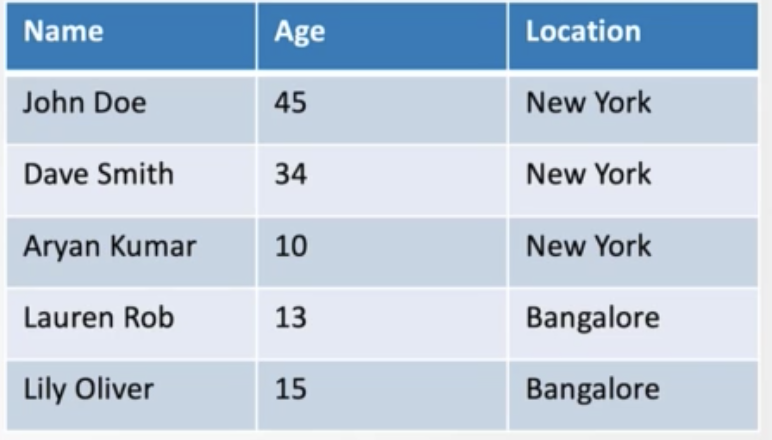

#### <a id="basic-operations-port-configuration"></a>Basic Operations & Port Configuration
- **Default Port**: ETCD listens for client traffic on port **`2379`** (and peer traffic on port `2380`).
- **CLI Client**: `etcdctl` is the command-line utility used to manage ETCD.
  - Set a key: `etcdctl put <key> <value>` (or v2: `set`)
  - Retrieve a key: `etcdctl get <key>`

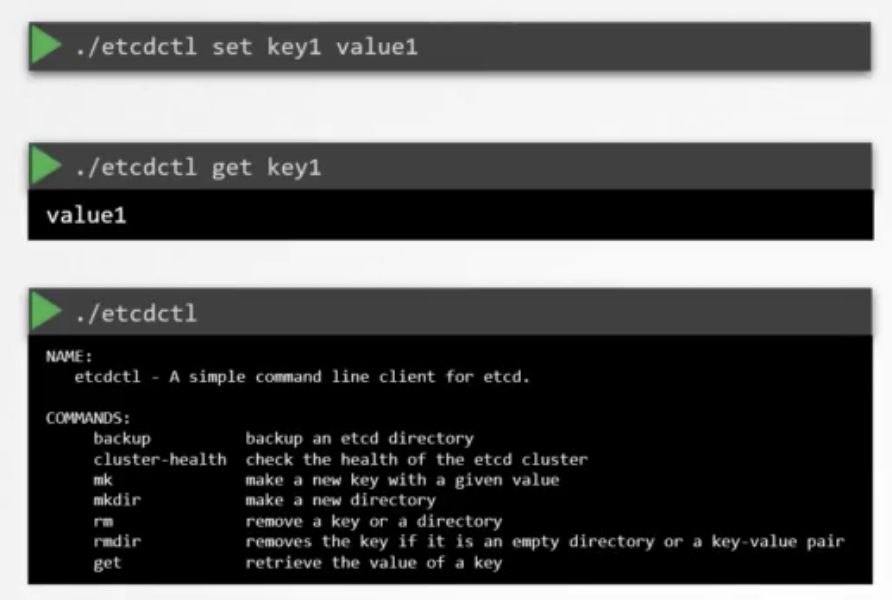

---

### <a id="etcd-in-kubernetes"></a>ETCD in Kubernetes

ETCD stores the entire state of the Kubernetes cluster, including **nodes, pods, configs, secrets, accounts, roles, and bindings**.
- Every `kubectl get` command queries data stored in ETCD.
- Any cluster modification is considered complete only after it has been committed to ETCD.

#### <a id="deployment-methods"></a>Deployment Methods
1. **Manual Setup (From Scratch)**:
   - ETCD is downloaded as a binary and configured directly as a systemd service (`/etc/systemd/system/etcd.service`) on master nodes.
   - The `--advertise-client-urls` parameter defines the listening IP and port (`https://<MASTER-IP>:2379`) used by `kube-apiserver` to connect to ETCD.

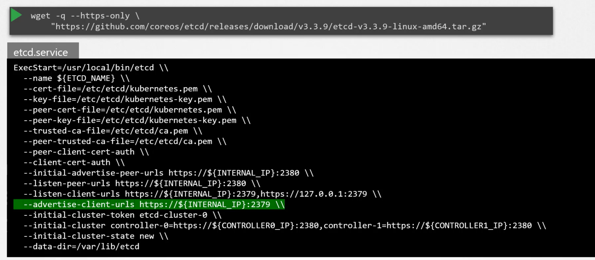

2. **Kubeadm Setup**:
   - `kubeadm` deploys ETCD as a **Static Pod** in the `kube-system` namespace.
   - Manifest path: `/etc/kubernetes/manifests/etcd.yaml`.
   - Data is stored in a hierarchical directory structure starting under the `/registry` root prefix (e.g., `/registry/pods`, `/registry/nodes`, `/registry/deployments`).

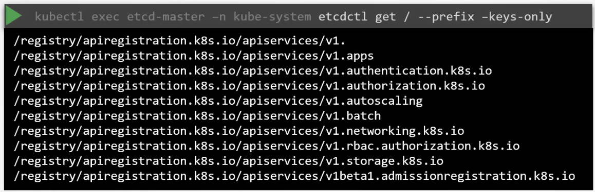

#### <a id="high-availability-ha-in-etcd"></a>High Availability (HA) in ETCD
- In multi-master clusters, ETCD runs across multiple master nodes using the **Raft consensus algorithm**.
- The `--initial-cluster` parameter specifies all peer instances in the ETCD cluster so members can discover and communicate with each other.

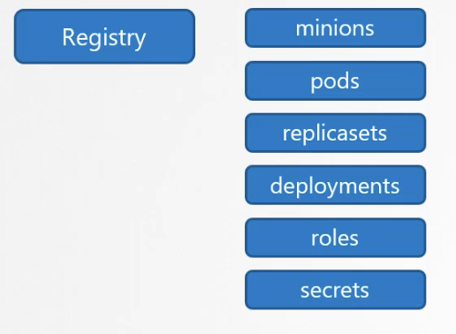

---

### <a id="etcd---commands"></a>ETCD - Commands

The `etcdctl` CLI interacts with ETCD using two distinct API versions: **Version 2** and **Version 3**.

```bash
# Set the API version (default is v2 if unset)
export ETCDCTL_API=3
```

#### <a id="api-version-differences"></a>API Version Differences
| Action | ETCDCTL v2 | ETCDCTL v3 |
| :--- | :--- | :--- |
| **Backup / Snapshot** | `etcdctl backup` | `etcdctl snapshot save <file.db>` |
| **Cluster Health** | `etcdctl cluster-health` | `etcdctl endpoint health` |
| **Write Data** | `etcdctl set <key> <value>` | `etcdctl put <key> <value>` |
| **Read Data** | `etcdctl get <key>` | `etcdctl get <key>` |
| **Make Directory** | `etcdctl mkdir <dir>` | *(Not applicable in v3 flat keyspace)* |

#### <a id="certificate-authentication"></a>Certificate Authentication
In production and `kubeadm` clusters, ETCD requires mTLS authentication. The certificates are stored on the master node under `/etc/kubernetes/pki/etcd/`:
- CA Certificate: `--cacert /etc/kubernetes/pki/etcd/ca.crt`
- Server Certificate: `--cert /etc/kubernetes/pki/etcd/server.crt`
- Private Key: `--key /etc/kubernetes/pki/etcd/server.key`

#### <a id="executing-etcdctl-inside-the-static-pod"></a>Executing ETCDCTL Inside the Static Pod
```bash
kubectl exec etcd-master -n kube-system -- sh -c   "ETCDCTL_API=3 etcdctl get / --prefix --keys-only --limit=10   --cacert /etc/kubernetes/pki/etcd/ca.crt   --cert /etc/kubernetes/pki/etcd/server.crt   --key /etc/kubernetes/pki/etcd/server.key"
```

---

### <a id="kube-api-server"></a>kube-api Server

The `kube-apiserver` is the core management interface of Kubernetes. It processes RESTful HTTP requests, validates them, and updates the ETCD store.

Requests can be initiated via `kubectl` or direct HTTP POST calls:

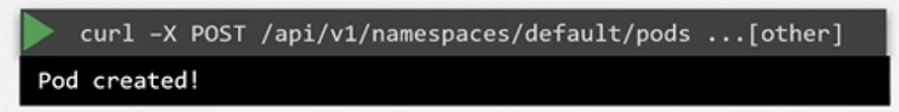

#### <a id="pod-creation-workflow"></a>Pod Creation Workflow
1. The user sends a request to create a Pod (`kubectl apply` or POST request).
2. `kube-apiserver` authenticates the user, authorizes the action, validates the schema, and creates an unscheduled Pod object in ETCD.
3. The `kube-scheduler` watches the API server, detects the unassigned Pod, evaluates node capacities, and selects an optimal node. It notifies the API server.
4. `kube-apiserver` updates the Pod's node assignment in ETCD.
5. The API server notifies the `kubelet` on the target worker node.
6. The `kubelet` instructs the local container runtime engine (e.g., containerd) to pull the container image and start the container.
7. The `kubelet` reports the Pod status back to `kube-apiserver`, which updates ETCD.

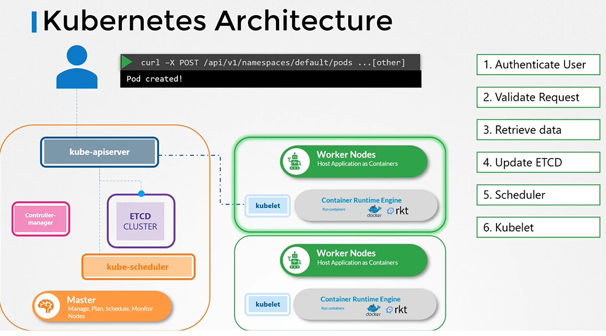

#### <a id="inspection-and-configuration"></a>Inspection and Configuration
- **Hard Way / Systemd**: Downloaded as a binary and configured via `/etc/systemd/system/kube-apiserver.service`.

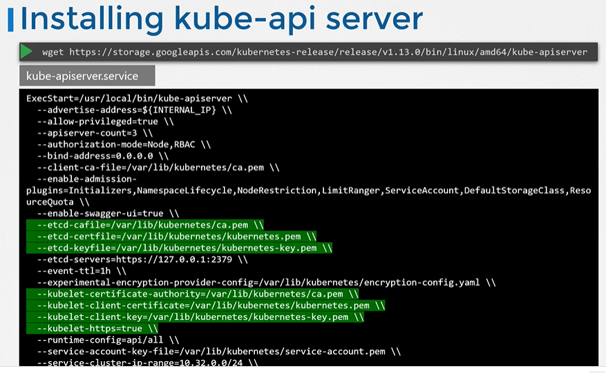

Key flags include:
- `--etcd-servers`: Points to ETCD endpoints.
- TLS flags (`--tls-cert-file`, `--tls-private-key-file`, `--client-ca-file`): Secure cluster communication.
- Network flags (`--service-cluster-ip-range`): Defines ClusterIP CIDR block.

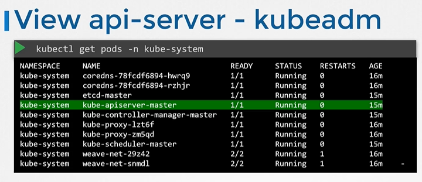

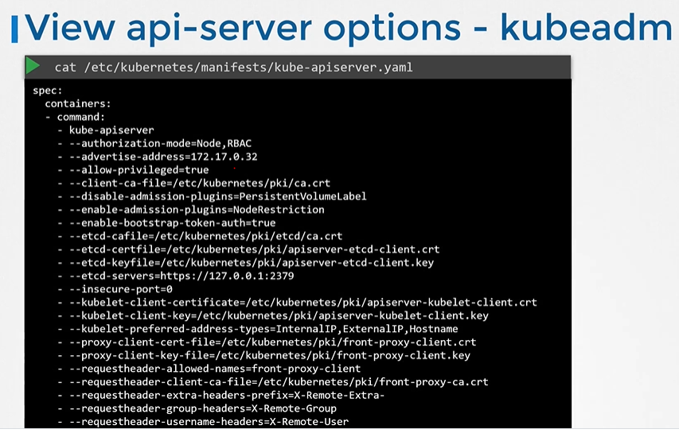

- **Kubeadm**: Configured as a Static Pod at `/etc/kubernetes/manifests/kube-apiserver.yaml`.

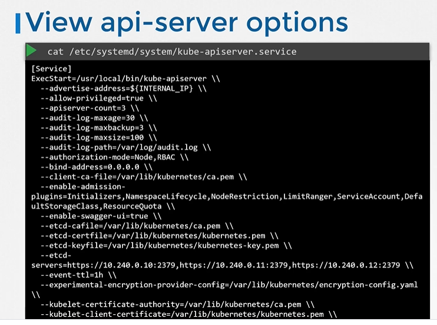

- **Process Inspection**:
```bash
ps -aux | grep kube-apiserver
```

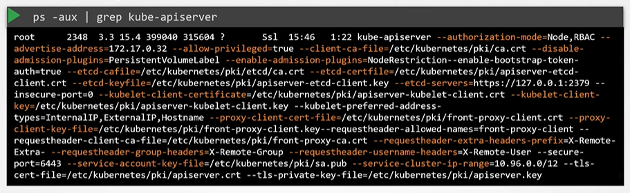

---

### <a id="kube-controller-manager"></a>KUBE-CONTROLLER Manager

The `kube-controller-manager` is a daemon that embeds all core control loops into a single process. A controller continuously monitors the cluster's actual state via `kube-apiserver` and makes changes to drive it toward the desired state.

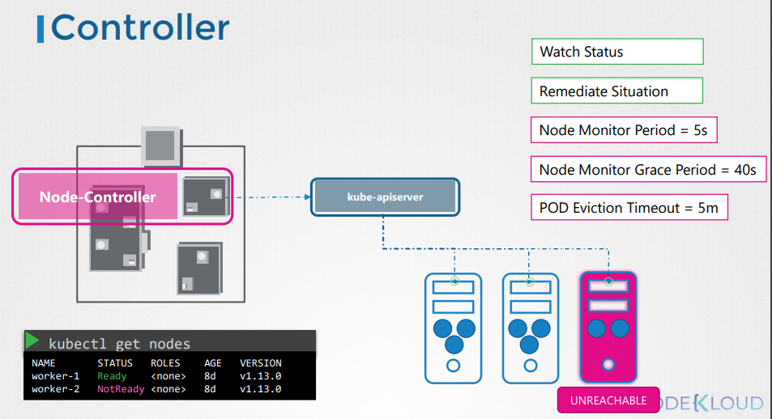

#### <a id="key-controllers"></a>Key Controllers
1. **Node Controller**:
   - Monitors worker node health and heartbeats.
   - Node monitor period: checks every 5 seconds (`--node-monitor-period=5s`).
   - Grace period: waits 40 seconds before marking a silent node `Unreachable` (`--node-monitor-grace-period=40s`).
   - Eviction timeout: waits 5 minutes (`--pod-eviction-timeout=5m0s`) before evicting pods from an unreachable node and recreating them on healthy nodes.

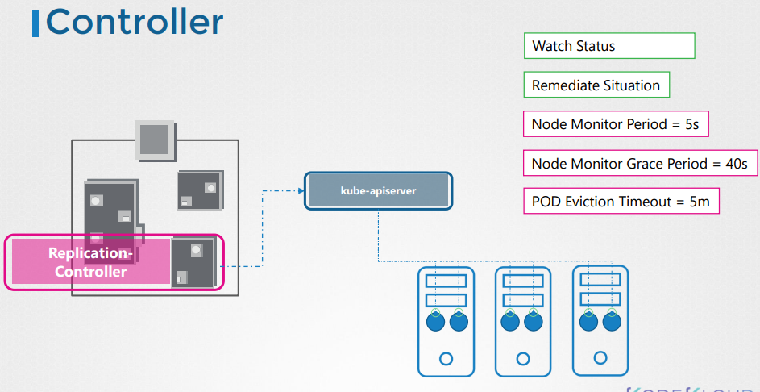

2. **Replication Controller / ReplicaSet Controller**:
   - Ensures the specified number of Pod replicas remain running at all times. Automatically launches replacement pods if one fails.

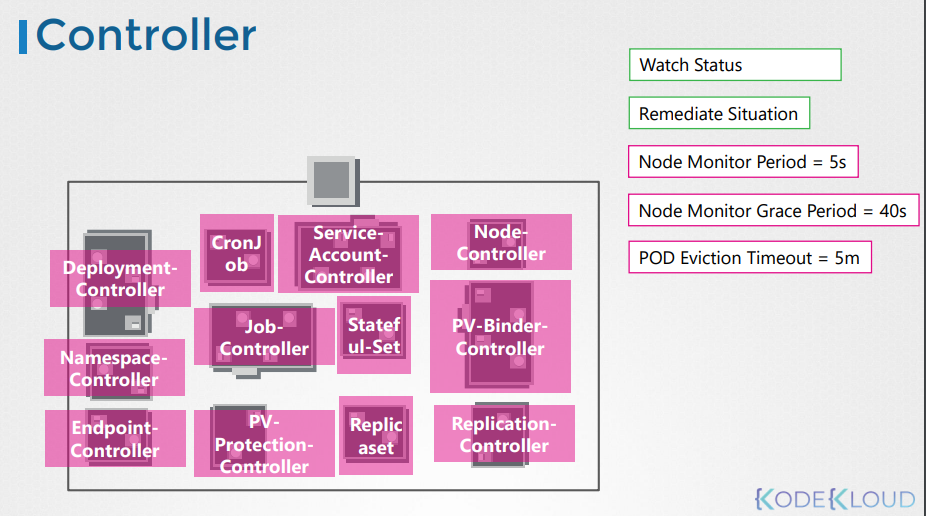

3. Other controllers include Deployment Controller, Namespace Controller, ServiceAccount Controller, EndpointSlice Controller, and Job Controller.

#### <a id="installation-configuration"></a>Installation & Configuration
- **Binary / Systemd**:
```bash
wget https://storage.googleapis.com/kubernetes-release/release/v1.13.0/bin/linux/amd64/kube-controller-manager
cat /etc/systemd/system/kube-controller-manager.service
```

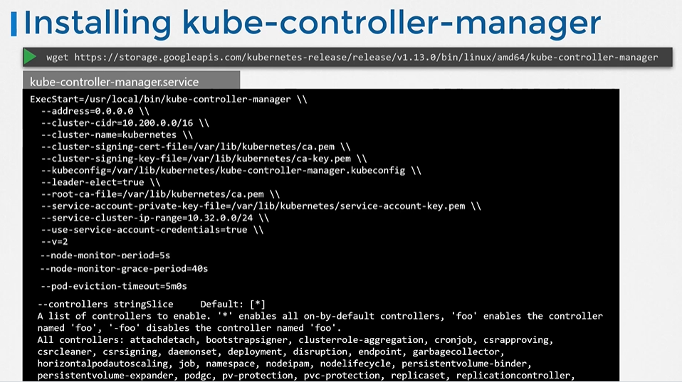

- **Static Pod Manifest (kubeadm)**:
```bash
cat /etc/kubernetes/manifests/kube-controller-manager.yaml
```

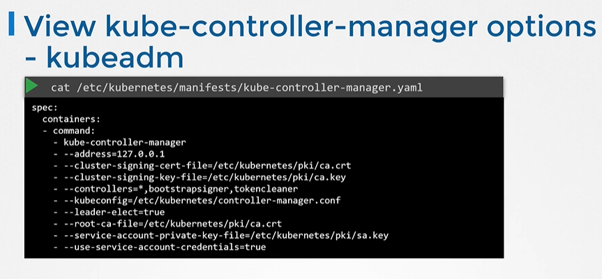

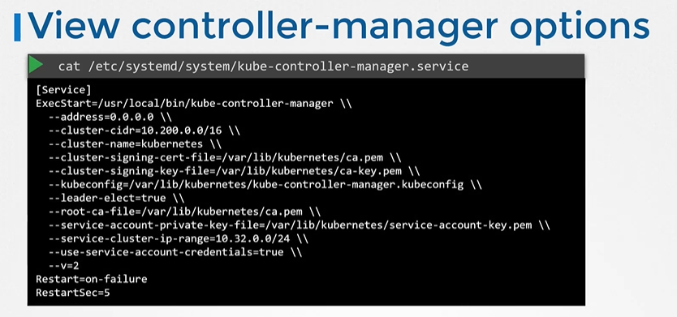

- **Process Inspection**:
```bash
ps -aux | grep kube-controller-manager
```

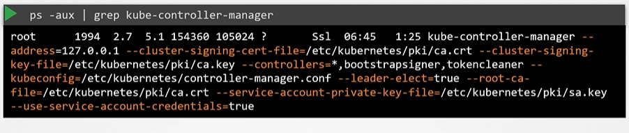

---

### <a id="kube-scheduler"></a>Kube Scheduler

The `kube-scheduler` assigns unscheduled pods to nodes. It does **not** create or execute containers on worker nodes—that is exclusively the responsibility of the `kubelet`.

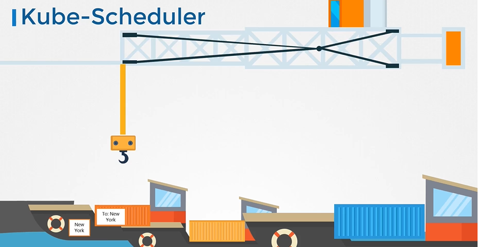

#### <a id="scheduling-process-two-phases"></a>Scheduling Process (Two Phases)
1. **Phase 1: Filtering (Predicates)**:
   - Filters out candidate nodes that cannot fulfill the Pod's requirements (e.g., insufficient CPU/Memory, untolerated taints, mismatched node selectors).
2. **Phase 2: Scoring / Ranking (Priorities)**:
   - Evaluates remaining nodes using priority scoring functions on a scale of 0 to 10 (e.g., calculating available resources post-placement). The node with the highest score is selected.

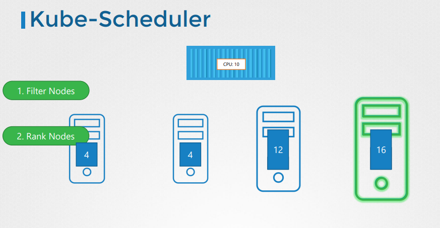

#### <a id="scheduler-installation--configuration"></a>Installation & Configuration
- **Binary / Systemd**:
```bash
wget https://storage.googleapis.com/kubernetes-release/release/v1.13.0/bin/linux/amd64/kube-scheduler
```

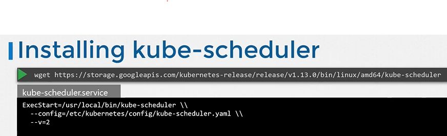

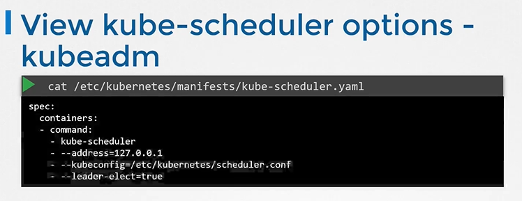

- **Static Pod Manifest (kubeadm)**: `/etc/kubernetes/manifests/kube-scheduler.yaml`
- **Process Inspection**:
```bash
ps -aux | grep kube-scheduler
```

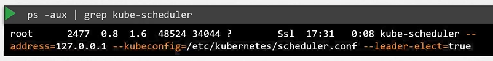

---

### <a id="kubelet"></a>Kubelet

The `kubelet` is the primary node agent running on every node in the cluster.
- Registers the worker node with the Kubernetes cluster.
- Watches `kube-apiserver` for assigned Pod specifications (`PodSpecs`).
- Communicates with the Container Runtime Interface (CRI) to pull images and run container instances.
- Monitors pod and container health and sends regular status reports back to `kube-apiserver`.

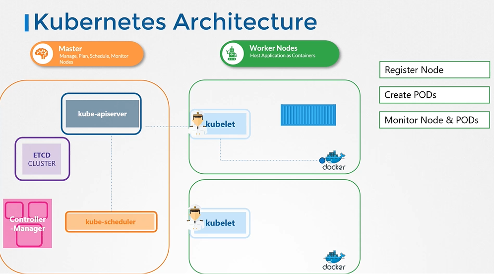

> [!IMPORTANT]
> `kubeadm` does **not** deploy the `kubelet` as a pod. The `kubelet` must always be installed manually on every node as a native host service via `apt`/`yum` or binary.

#### <a id="kubelet-installation--verification"></a>Installation & Verification
```bash
wget https://storage.googleapis.com/kubernetes-release/release/v1.13.0/bin/linux/amd64/kubelet
```

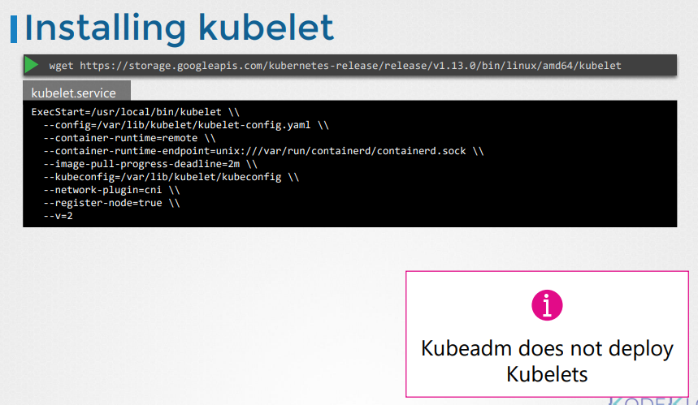

```bash
ps -aux | grep kubelet
```

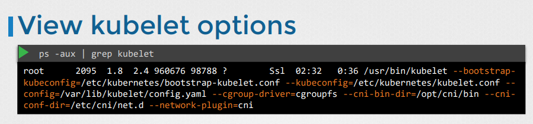

---

### <a id="kube-proxy"></a>Kube Proxy

Within a Kubernetes cluster, every Pod receives a unique IP address and can communicate with every other Pod across nodes via an overlay Pod network (CNI plugin).

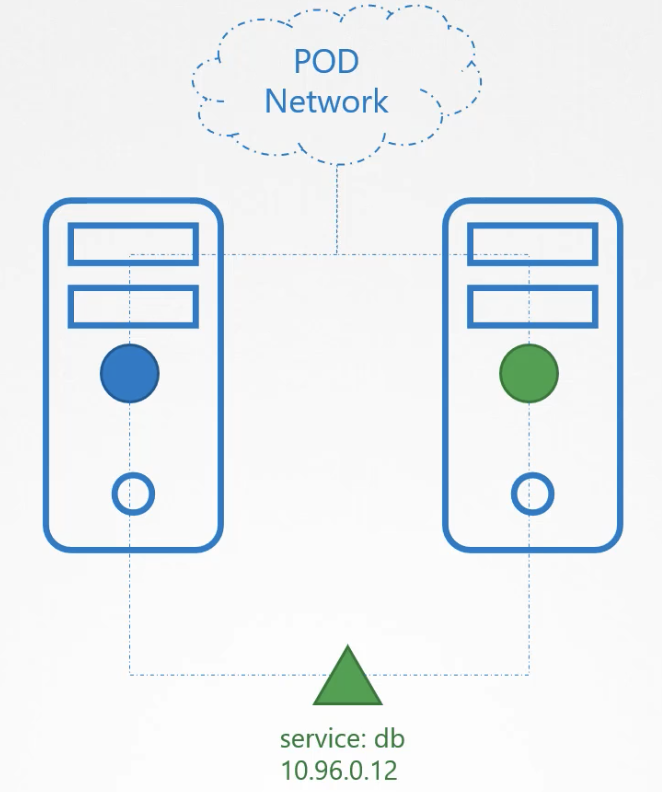

#### <a id="role-of-kube-proxy"></a>Role of Kube-Proxy
- Pod IP addresses are ephemeral. Kubernetes **Services** provide stable virtual IP addresses (`ClusterIP`) to route traffic to dynamic backend pods.
- Services are virtual constructs (they do not have physical network interfaces or listening processes).
- `kube-proxy` runs on every worker node, watches for new Services and Endpoints, and programs packet filtering rules (using **`iptables`** or **`IPVS`**) to redirect service traffic to backend pod IPs.

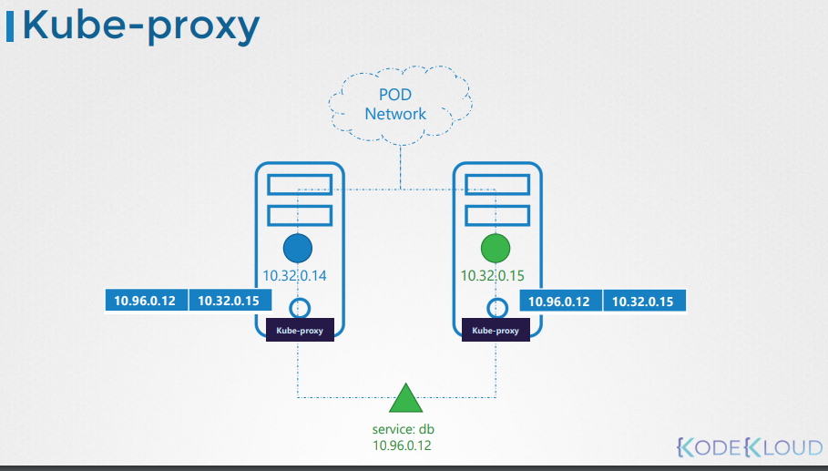

#### <a id="kube-proxy-deployment--verification"></a>Deployment & Verification
- **Binary**:
```bash
wget https://storage.googleapis.com/kubernetes-release/release/v1.13.0/bin/linux/amd64/kube-proxy
```

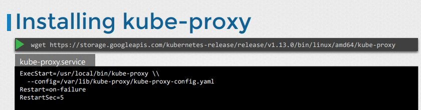

- **Kubeadm**: Deployed as a `DaemonSet` named `kube-proxy` in the `kube-system` namespace:
```bash
kubectl get pods -n kube-system
```

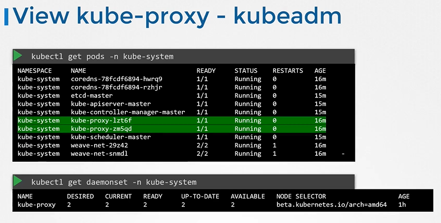

---

### <a id="pods"></a>PODs

A **Pod** is the smallest deployable and manageable computing unit in Kubernetes.
- Encapsulates one or more closely coupled application containers.
- Usually has a 1:1 relationship with application containers.

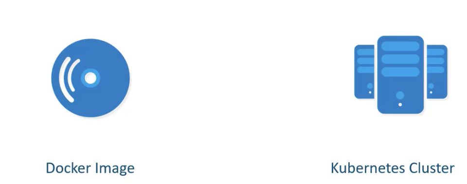

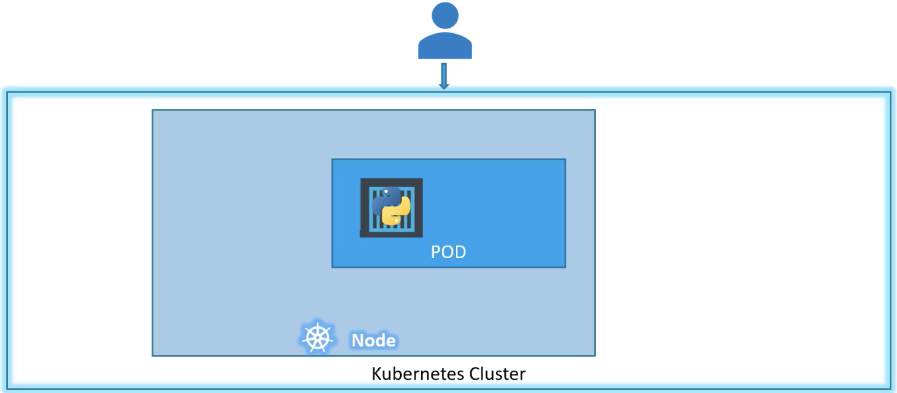

#### <a id="scaling-pods"></a>Scaling Pods
- **Scaling Up**: Deploy additional Pod replicas across nodes. **Do not** add duplicate containers into the same Pod to scale.

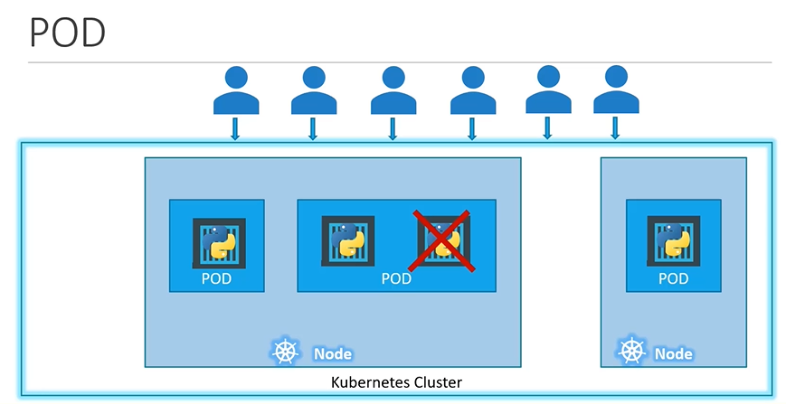

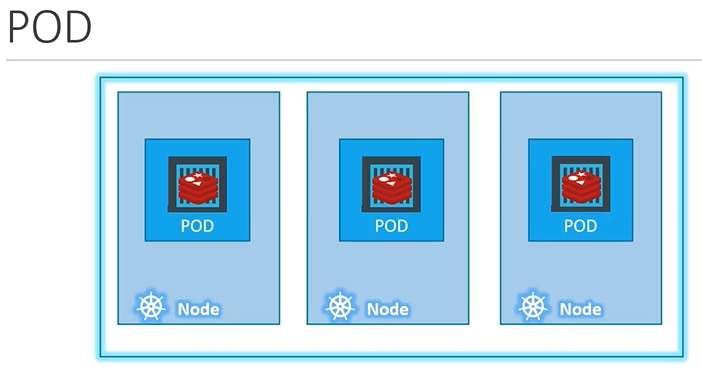

#### <a id="multi-container-pods"></a>Multi-Container Pods
A single Pod can host multiple containers when helper/sidecar patterns are required (e.g., logging agents, data proxies, file synchronization).
Containers within the same Pod share:
- **Network Namespace**: Same IP address, share port space, and communicate with each other over `localhost`.
- **Storage Volumes**: Shared filesystem mounts.
- **Lifecycle**: Created, scheduled, and destroyed together.

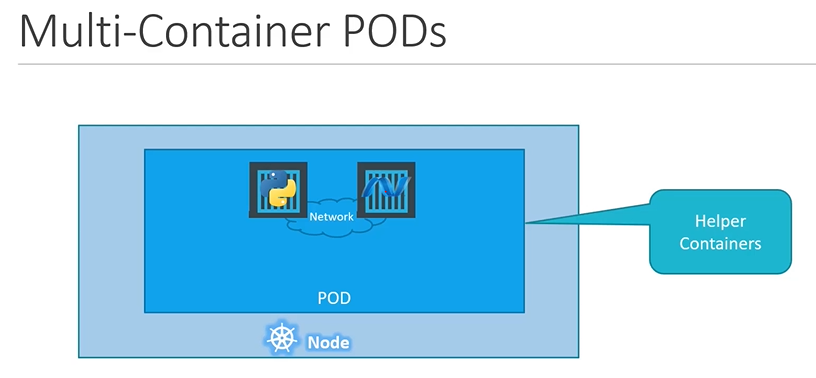

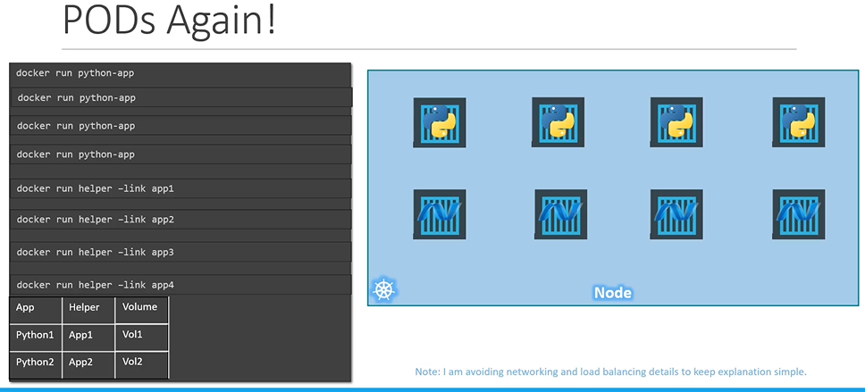

#### <a id="managing-pods"></a>Managing Pods
```bash
# Imperatively run a pod
kubectl run nginx --image=nginx

# List active pods
kubectl get pods

# Inspect detailed pod status and events
kubectl describe pod nginx
```

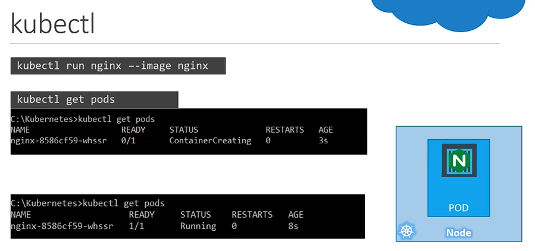

---

### <a id="pods-with-yaml"></a>PODs with YAML

Kubernetes object configurations are authored in declarative YAML files. Every manifest requires four root-level fields:

| Field | Type | Description |
| :--- | :--- | :--- |
| `apiVersion` | String | Version of the Kubernetes API (`v1` for Pods) |
| `kind` | String | Type of Kubernetes object being defined (`Pod`) |
| `metadata` | Dictionary | Metadata attributes (`name`, `labels`, `namespace`) |
| `spec` | Dictionary | Desired state specification (`containers`, `volumes`, etc.) |

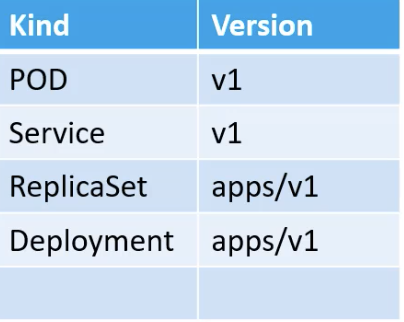

#### <a id="yaml-formatting-indentation-rules"></a>YAML Formatting & Indentation Rules
- Indentation must use consistent spaces (do not use tabs).
- Sibling properties must share identical indentation. Child elements must indent further than their parents.

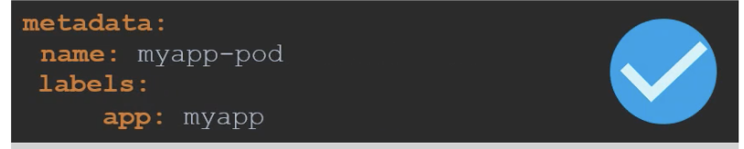

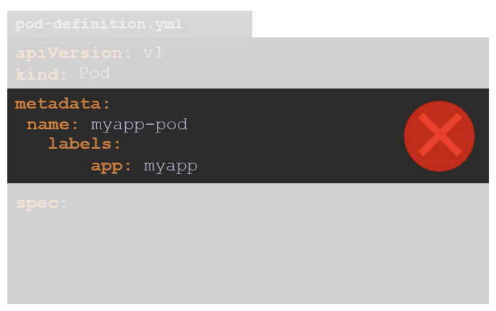


#### <a id="sample-pod-manifest"></a>Sample Pod Manifest
```yaml
apiVersion: v1
kind: Pod
metadata:
  name: myapp-pod
  labels:
    app: myapp
    type: front-end
spec:
  containers:
  - name: nginx-container
    image: nginx
```

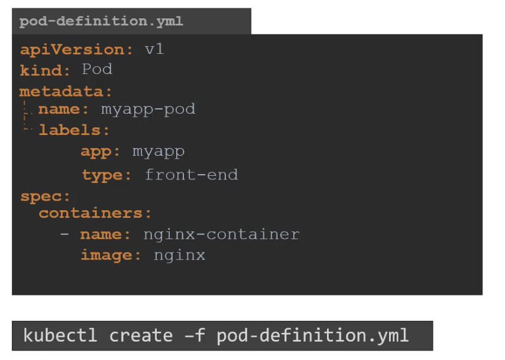

```bash
# Create the Pod
kubectl create -f pod-definition.yaml

# Verify creation and details
kubectl get pods
kubectl describe pod myapp-pod
```

---

### <a id="replicasets-and-replication-controller"></a>ReplicaSets and Replication Controller

Replication controllers ensure that a specified number of Pod replicas remain running at all times, providing high availability, fault tolerance, and load balancing across nodes.


#### <a id="replicationcontroller-vs-replicaset"></a>ReplicationController vs. ReplicaSet
- **`ReplicationController`** (`apiVersion: v1`): Legacy object that supports only equality-based label matching.
- **`ReplicaSet`** (`apiVersion: apps/v1`): Modern standard replacement. Requires a `selector` block with `matchLabels` and supports set-based matching.

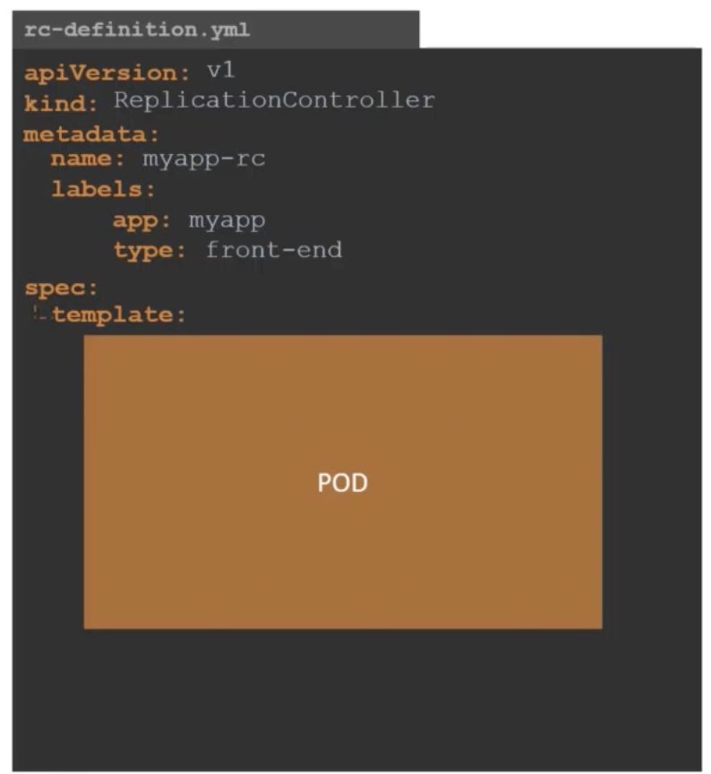

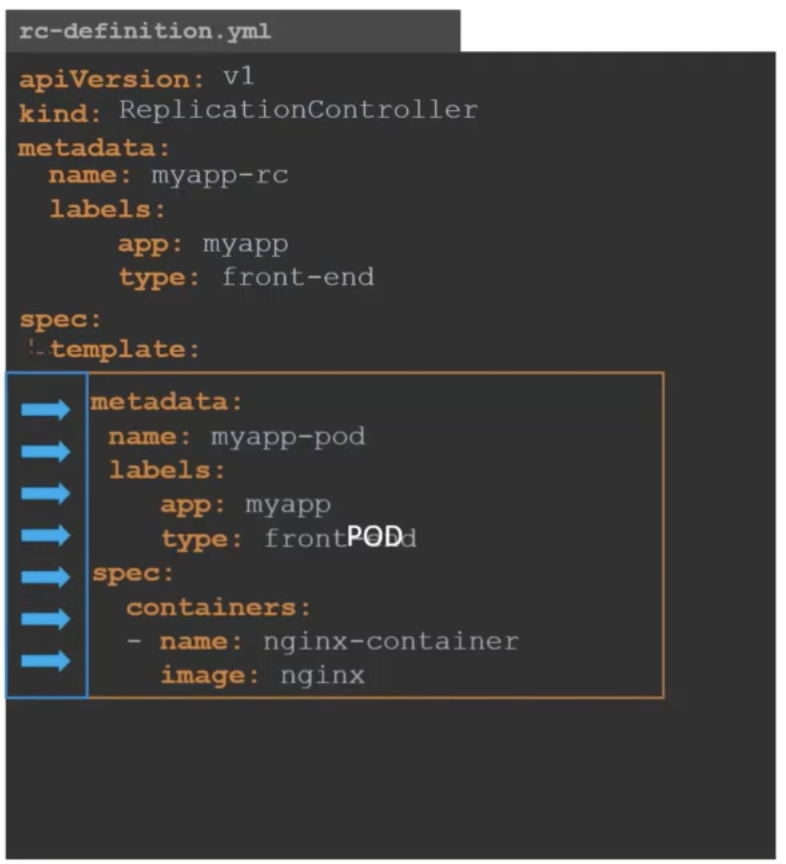

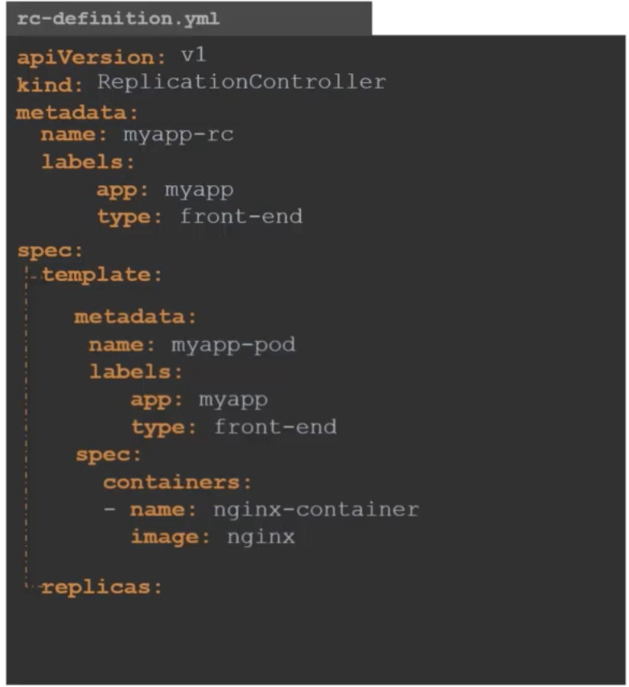

#### <a id="replicationcontroller-manifest"></a>ReplicationController Manifest
```yaml
apiVersion: v1
kind: ReplicationController
metadata:
  name: myapp-rc
  labels:
    app: myapp
    type: front-end
spec:
  replicas: 3
  template:
    metadata:
      name: myapp-pod
      labels:
        app: myapp
        type: front-end
    spec:
      containers:
      - name: nginx-container
        image: nginx
```

```bash
kubectl create -f rc-definition.yaml
kubectl get rc
kubectl get pods
```

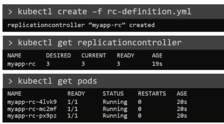

#### <a id="replicaset-manifest"></a>ReplicaSet Manifest

> [!WARNING]
> ReplicaSets belong to `apps/v1`. Using `v1` will produce a `no match for /, kind=ReplicaSet` error.

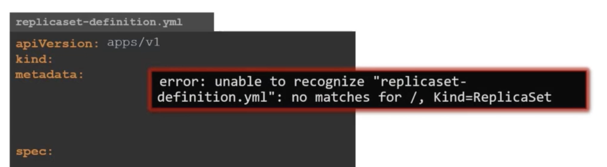


```yaml
apiVersion: apps/v1
kind: ReplicaSet
metadata:
  name: myapp-replicaset
  labels:
    app: myapp
    type: front-end
spec:
  replicas: 3
  selector:
    matchLabels:
      type: front-end
  template:
    metadata:
      name: myapp-pod
      labels:
        app: myapp
        type: front-end
    spec:
      containers:
      - name: nginx-container
        image: nginx
```

#### <a id="why-selectormatchlabels-is-mandatory"></a>Why `selector.matchLabels` is Mandatory
The ReplicaSet uses the selector to identify which Pods it manages. It can adopt existing unmanaged Pods if their labels match the selector.


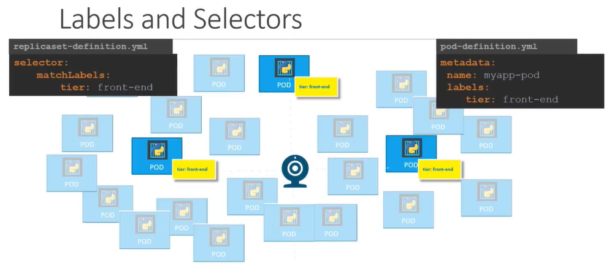

#### <a id="scaling-replicasets"></a>Scaling ReplicaSets
1. **Declarative**: Update `replicas: 6` in the YAML definition file and apply:
```bash
kubectl replace -f rs-definition.yaml
```

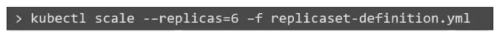

2. **Imperative**: Scale directly from the command line:
```bash
kubectl scale replicaset myapp-replicaset --replicas=6
# Or by file reference (does not modify file on disk):
kubectl scale --replicas=6 -f rs-definition.yaml
```

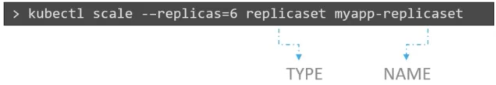

#### <a id="common-replicaset-commands"></a>Common ReplicaSet Commands
```bash
kubectl create -f rs-definition.yaml
kubectl get replicaset
kubectl delete replicaset myapp-replicaset
kubectl replace -f rs-definition.yaml
kubectl scale replicaset myapp-replicaset --replicas=6
```

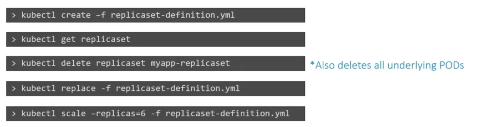

---

### <a id="deployments"></a>Deployments

A **Deployment** is a higher-level abstraction that sits above ReplicaSets.
- **Hierarchy**: Deployment → ReplicaSet → Pods.
- **Capabilities**:
  - Seamless zero-downtime rolling updates.
  - Automated rollbacks to earlier revisions (`kubectl rollout undo`).
  - Pausing and resuming rollouts (`kubectl rollout pause` / `resume`) to batch configuration updates.
  - Declarative scaling.

#### <a id="deployment-manifest"></a>Deployment Manifest
```yaml
apiVersion: apps/v1
kind: Deployment
metadata:
  name: myapp-deployment
  labels:
    app: myapp
    type: front-end
spec:
  replicas: 3
  selector:
    matchLabels:
      type: front-end
  template:
    metadata:
      name: myapp-pod
      labels:
        app: myapp
        type: front-end
    spec:
      containers:
      - name: nginx-container
        image: nginx
```

```bash
# Create deployment
kubectl create -f deployment-definition.yaml

# Verify deployment hierarchy
kubectl get deployments
kubectl get replicaset
kubectl get pods
kubectl get all
```

---

### <a id="services"></a>Services

Kubernetes **Services** enable network abstraction, loose coupling, and discovery between application microservices as well as external consumers.

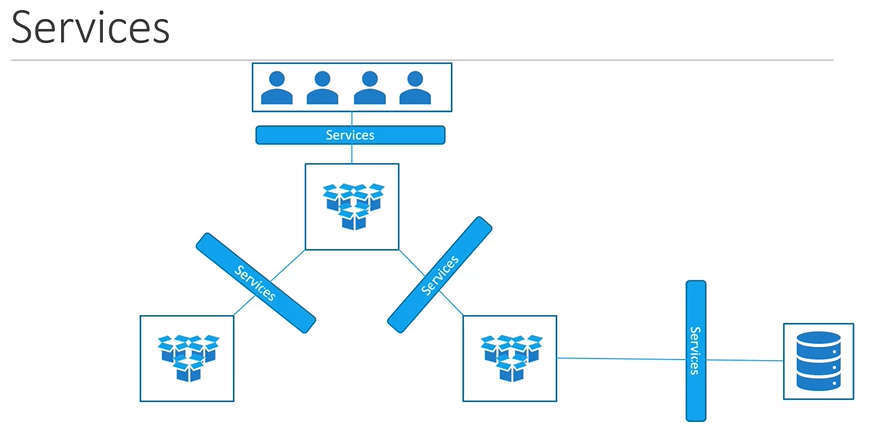

#### <a id="nodeport"></a>NodePort

A **NodePort** service exposes an internal application on a static port across every node's external IP in the cluster.

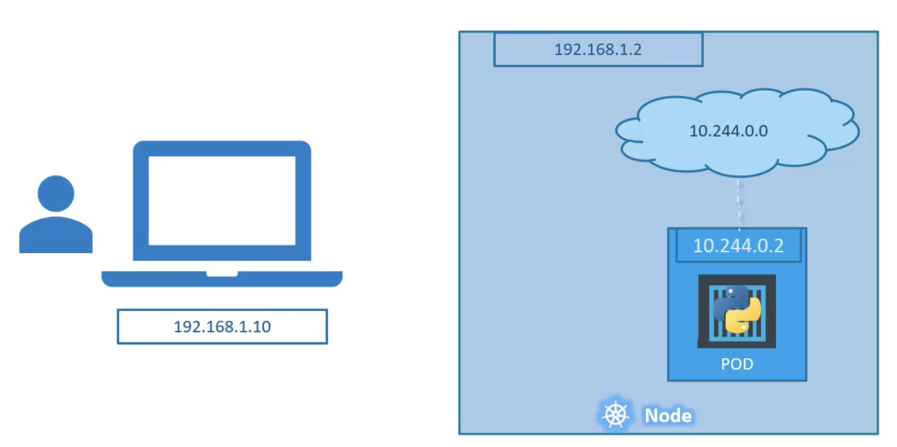

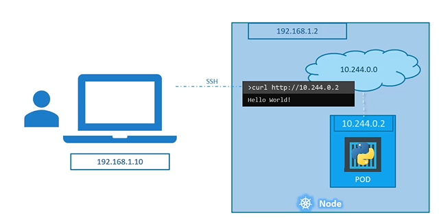

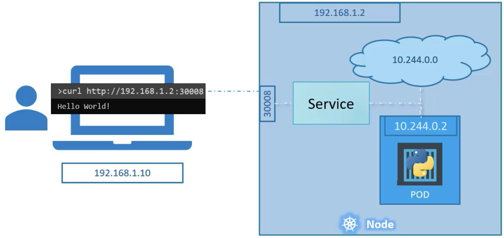

##### <a id="service-types-overview"></a>Service Types Overview
- **`ClusterIP`**: Exposes service on an internal cluster-only virtual IP (default).
- **`NodePort`**: Exposes service externally on each node's IP at a static port (`30000–32767`).
- **`LoadBalancer`**: Provisions a cloud provider's native load balancer (e.g., AWS NLB/ALB, GCP Cloud LB).

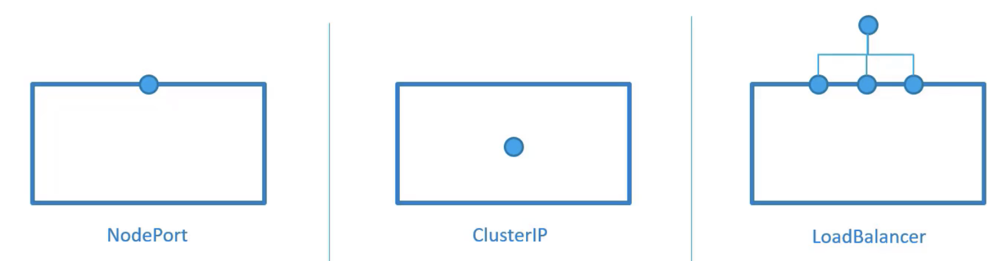

##### <a id="port-definitions-in-nodeport"></a>Port Definitions in NodePort
- **`targetPort`**: Port on the backend Pod container (e.g., `80`). Defaults to `port` if omitted.
- **`port`**: Port on the Service itself (e.g., `80`).
- **`nodePort`**: External port on every cluster node (Range: **`30000 to 32767`**, e.g., `30008`). Auto-allocated if omitted.

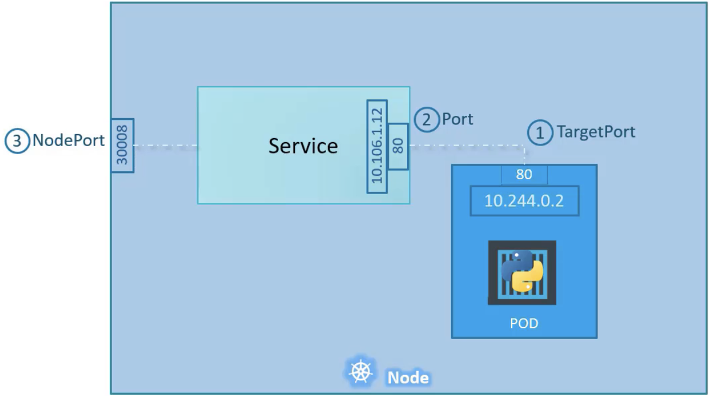

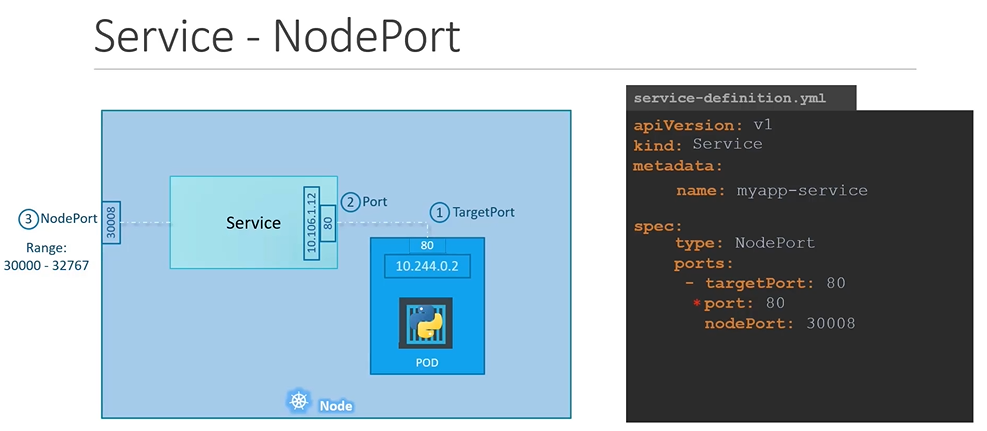

##### <a id="nodeport-manifest"></a>NodePort Manifest
```yaml
apiVersion: v1
kind: Service
metadata:
  name: myapp-service
spec:
  type: NodePort
  ports:
  - targetPort: 80
    port: 80
    nodePort: 30008
  selector:
    app: myapp
    type: front-end
```

```bash
kubectl create -f service-nodeport.yaml
kubectl get services
curl http://192.168.1.2:30008
```

- When multiple Pods match the selector, traffic is distributed across them using a random load-balancing algorithm.
- Traffic sent to `<Any-Worker-Node-IP>:<nodePort>` routes successfully to backend pods, even if the pod runs on a different node.

#### <a id="services-clusterip"></a>Services ClusterIP

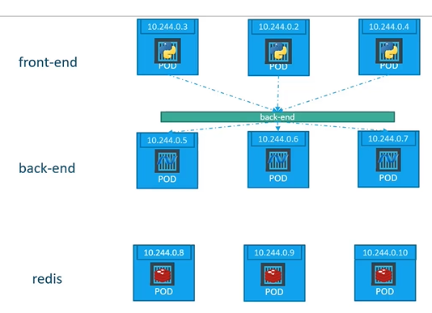

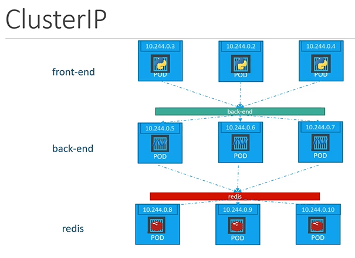

**ClusterIP** is the default service type. It creates a single virtual IP address inside the cluster to group related pods (e.g., backend services or database replicas) behind a stable endpoint with internal DNS resolution.

##### <a id="clusterip-manifest"></a>ClusterIP Manifest
```yaml
apiVersion: v1
kind: Service
metadata:
  name: back-end
spec:
  type: ClusterIP
  ports:
  - targetPort: 80
    port: 80
  selector:
    app: myapp
    type: back-end
```

```bash
kubectl create -f service-clusterip.yaml
```

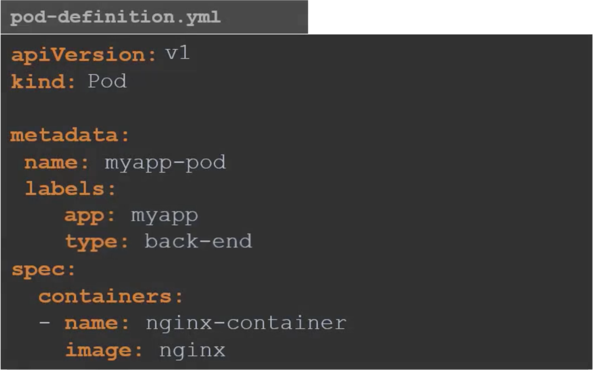

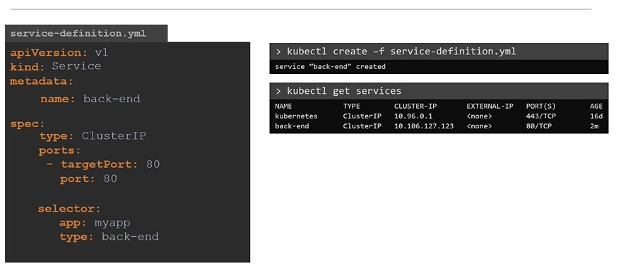

#### <a id="services---loadbalancer"></a>Services - LoadBalancer

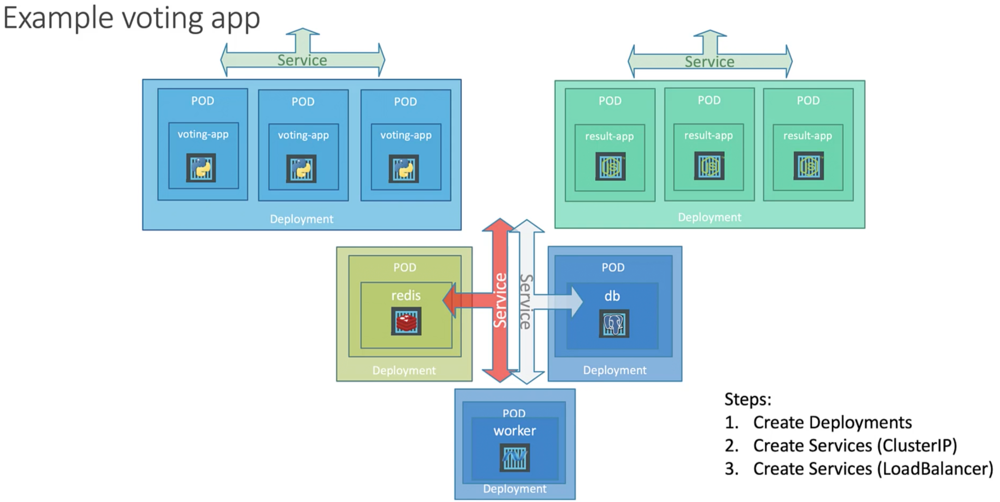

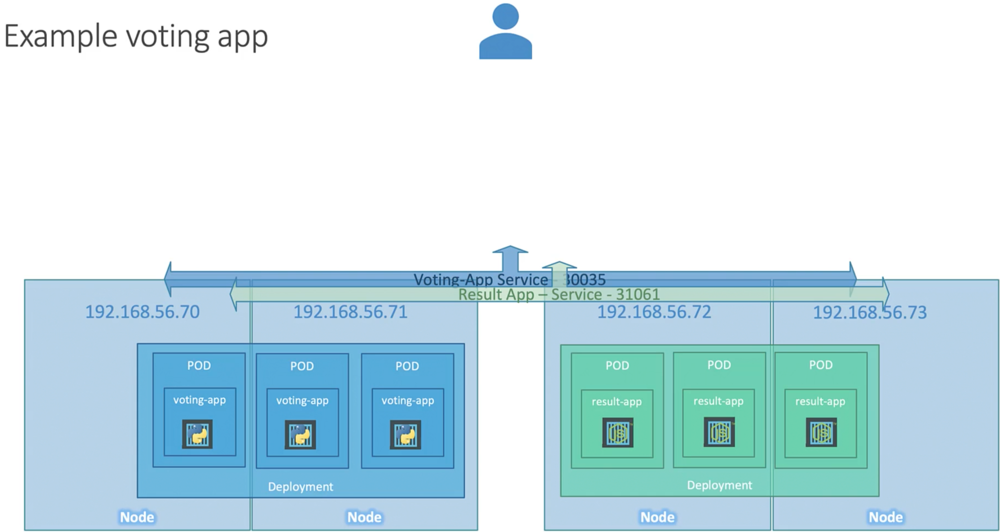

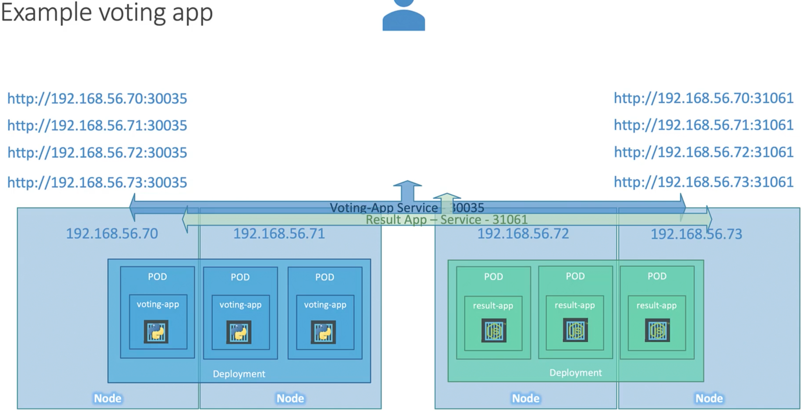

- While `NodePort` requires external clients to track individual node IPs and port numbers, **`LoadBalancer`** integrates with supported cloud platforms (GCP, AWS, Azure) to provision an external cloud load balancer.
- The cloud load balancer routes traffic automatically across all cluster nodes on the assigned `nodePort`.
- In unsupported environments (e.g., bare-metal or local VMs), the service simply functions as a standard `NodePort` service.

##### <a id="loadbalancer-manifest"></a>LoadBalancer Manifest
```yaml
apiVersion: v1
kind: Service
metadata:
  name: myapp-lb-service
spec:
  type: LoadBalancer
  ports:
  - targetPort: 80
    port: 80
    nodePort: 30008
  selector:
    app: myapp
    type: front-end
```

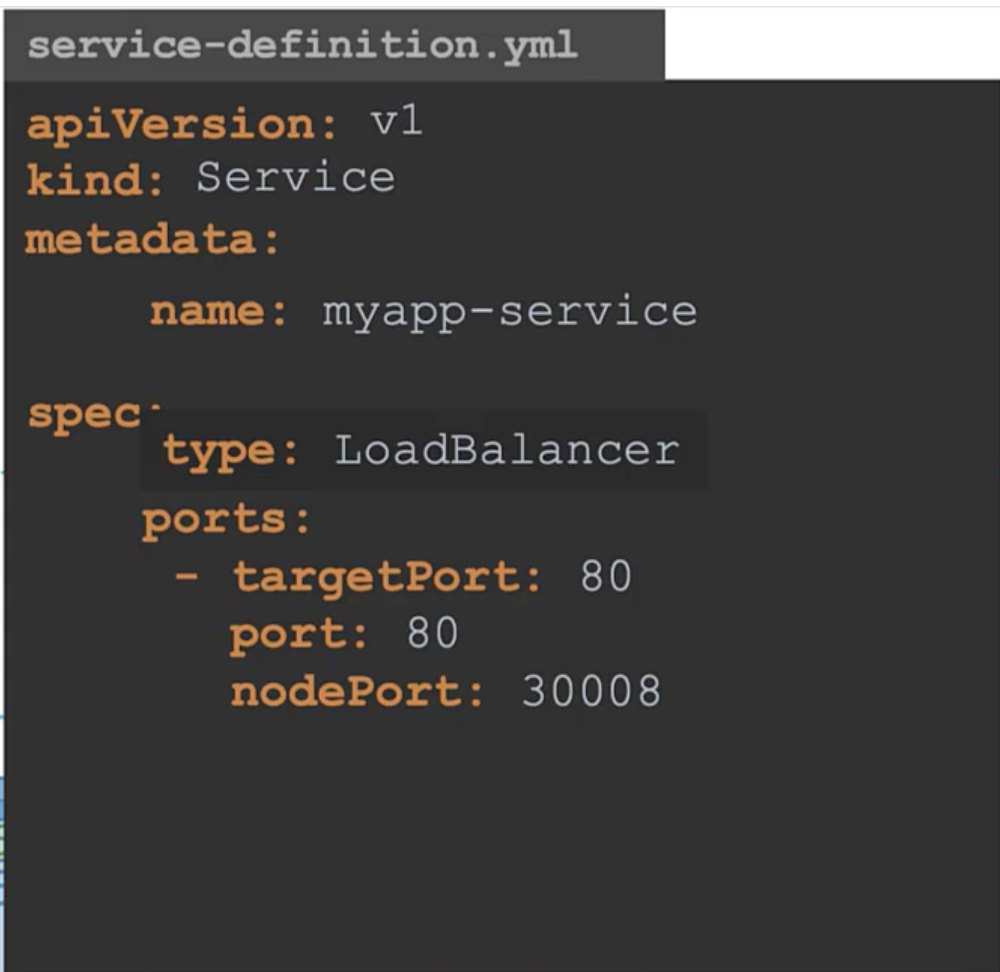

---

### <a id="namespaces"></a>Namespaces

Namespaces provide virtual cluster partitioning within a single physical Kubernetes cluster, enabling multi-tenancy, environment isolation, and resource quotas.

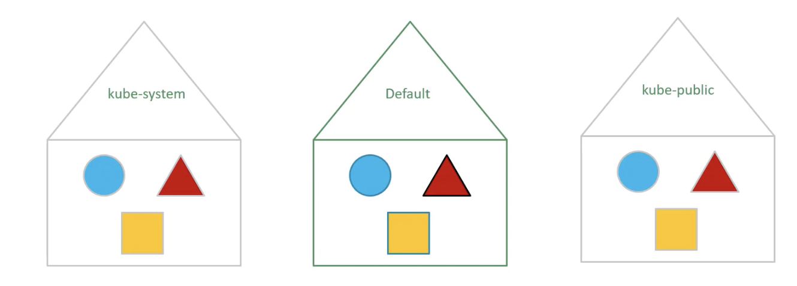

#### <a id="built-in-namespaces"></a>Built-in Namespaces
- **`default`**: Default workspace for user-created resources.
- **`kube-system`**: Reserved for internal Kubernetes control plane and infrastructure components (networking plugins, CoreDNS).
- **`kube-public`**: Auto-created for cluster-wide public readability (e.g., cluster info).
- **`kube-node-lease`**: Holds node lease objects for heartbeat tracking.

#### <a id="environment-isolation-quotas"></a>Environment Isolation & Quotas
Namespaces allow isolating environments (e.g., `dev` vs. `prod`) within the same cluster to prevent accidental modifications and enforce resource limits.

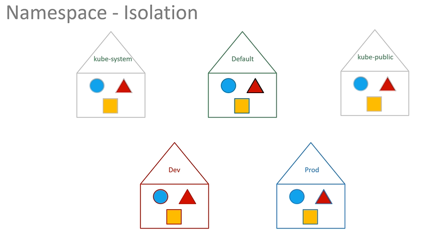

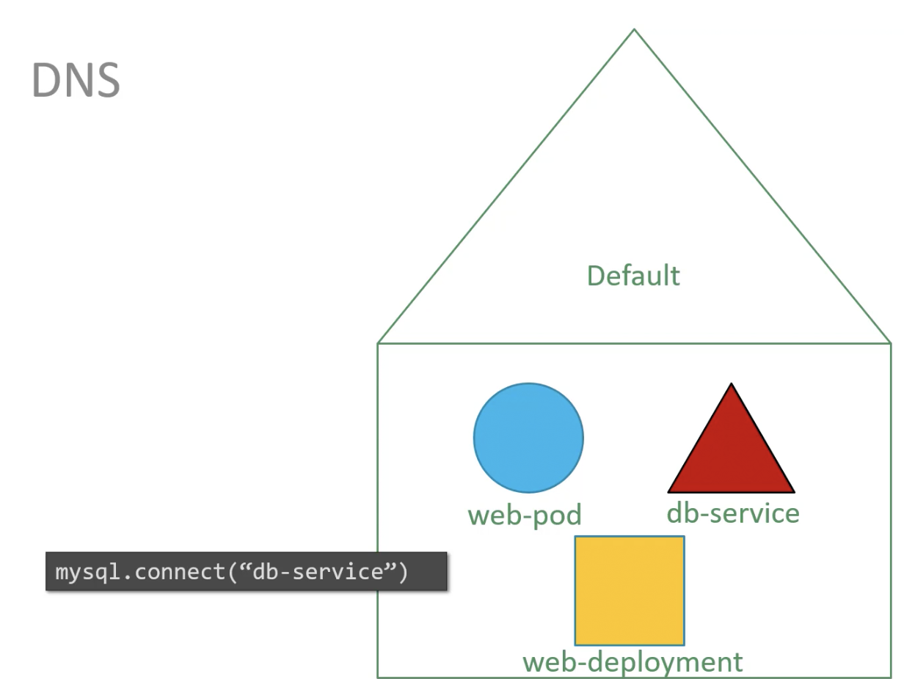

#### <a id="dns-resolution-across-namespaces"></a>DNS Resolution Across Namespaces
- **Same Namespace**: Services communicate directly via shortname (e.g., `db-service`).
- **Cross-Namespace**: Requires the Fully Qualified Domain Name (FQDN):
  ```text
  <service-name>.<namespace>.svc.cluster.local
  ```
  Example: `db-service.dev.svc.cluster.local`

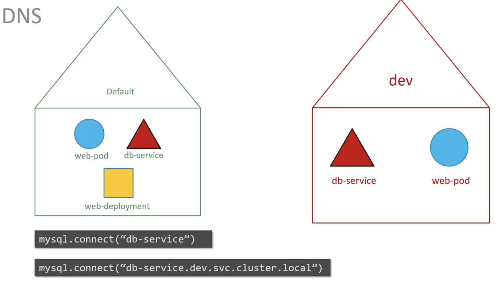

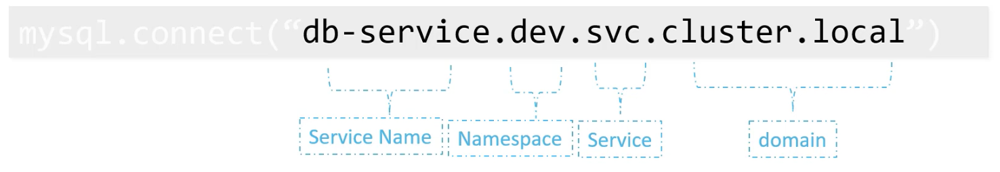

#### <a id="namespace-cli-operations-manifests"></a>Namespace CLI Operations & Manifests
```bash
# List pods in a specific namespace
kubectl get pods -n kube-system

# Create pod in a specific namespace imperatively
kubectl create -f pod-definition.yaml --namespace=dev
```

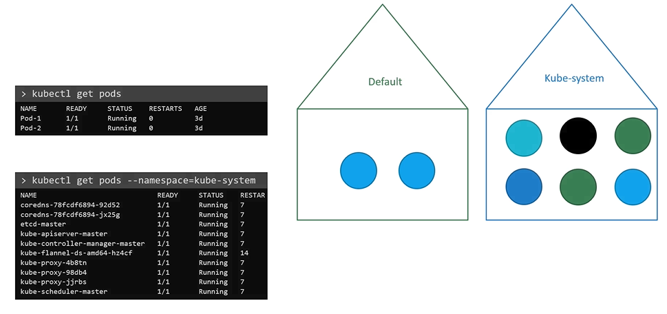

```yaml
apiVersion: v1
kind: Pod
metadata:
  name: myapp-pod
  namespace: dev
  labels:
    app: myapp
    type: front-end
spec:
  containers:
  - name: nginx-container
    image: nginx
```

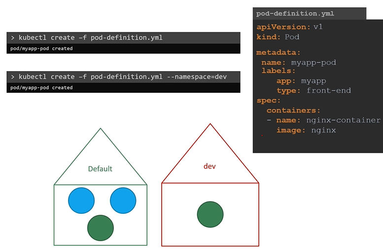

#### <a id="creating-namespaces"></a>Creating Namespaces
```yaml
apiVersion: v1
kind: Namespace
metadata:
  name: dev
```

```bash
kubectl create -f namespace-dev.yaml
# Or imperatively:
kubectl create namespace dev
```

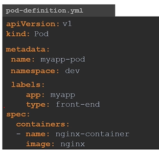

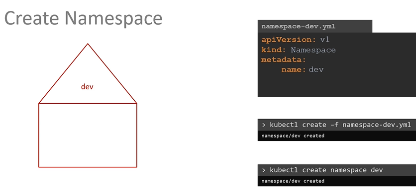

#### <a id="setting-context-namespace"></a>Setting Context Namespace
```bash
# Switch default namespace for current context permanently
kubectl config set-context --current --namespace=dev

# List pods across ALL namespaces
kubectl get pods --all-namespaces
# Or shorthand:
kubectl get pods -A
```

#### <a id="resource-quotas"></a>Resource Quotas
Restricts compute resource consumption inside a target namespace:
```yaml
apiVersion: v1
kind: ResourceQuota
metadata:
  name: compute-quota
  namespace: dev
spec:
  hard:
    pods: "10"
    requests.cpu: "10"
    requests.memory: 10Gi
    limits.cpu: "20"
    limits.memory: 20Gi
```

---

### <a id="imperative-vs-declarative"></a>Imperative vs Declarative

| Approach | Definition | Kubernetes Mechanism |
| :--- | :--- | :--- |
| **Imperative** | Specifies **what** to do and **how** to do it step-by-step. | `kubectl run`, `create`, `expose`, `edit`, `scale`, `replace` |
| **Declarative** | Declares the **desired end state**; the system determines how to reconcile it. | `kubectl apply -f <manifest-or-directory>` |

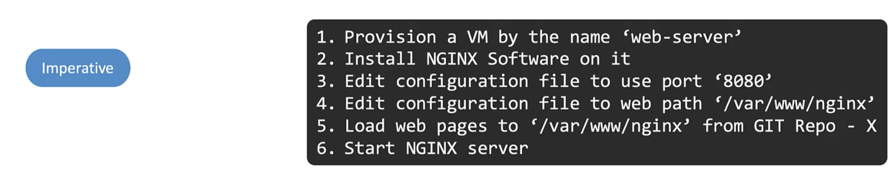

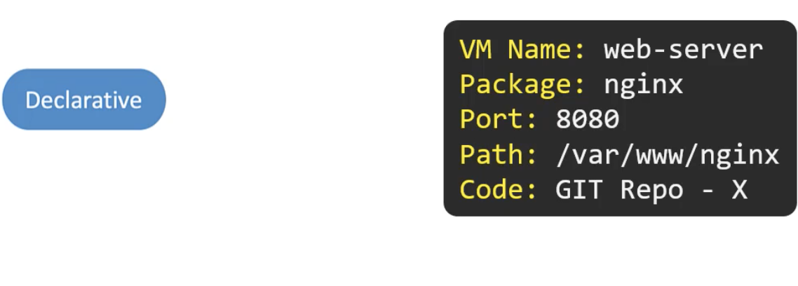

#### <a id="imperative-management"></a>Imperative Management
1. **Imperative Commands**: One-liner CLI commands. Fast for exam scenarios, but lack version control and change auditability.

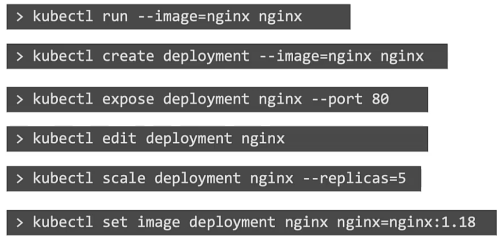

2. **Imperative Object Configuration**: Using manifest files with imperative verbs (`kubectl create -f`, `replace -f`, `delete -f`).

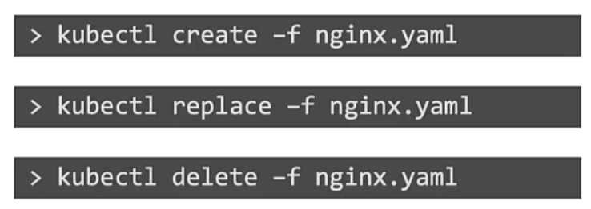

#### <a id="declarative-management"></a>Declarative Management
Using `kubectl apply -f`, Kubernetes compares the desired manifest against live cluster state and automatically decides whether to create, update, or patch resources.


#### <a id="trade-offs-configuration-drift"></a>Trade-offs & Configuration Drift
- **Command Limitations**: Complex configurations (multi-container pods, volume mounts) are cumbersome or impossible via imperative CLI.

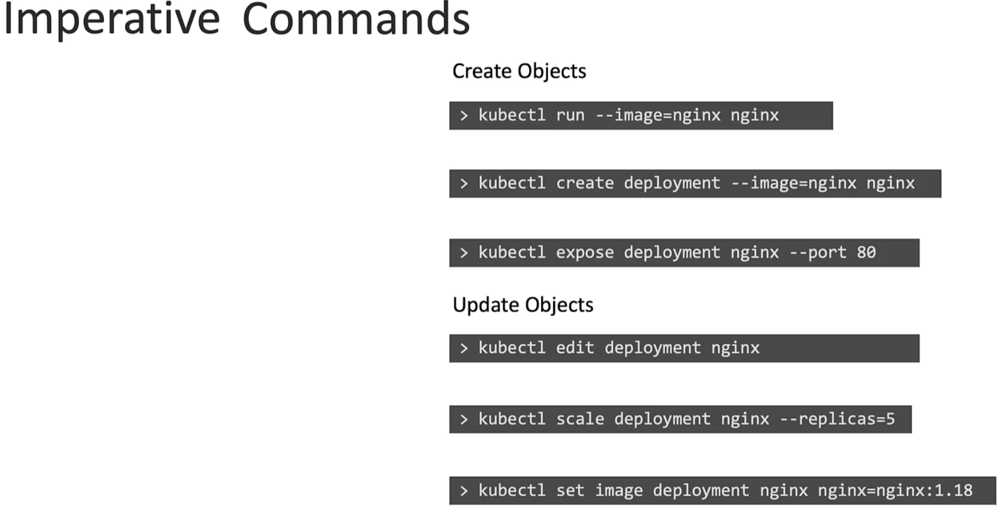

- **Configuration Drift with `kubectl edit`**: `kubectl edit` modifies live objects in memory without updating local YAML files, causing silent drift.

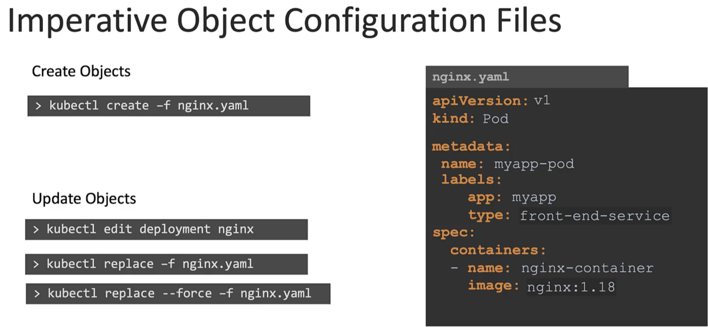

- **Execution Failures**: `kubectl create` fails if the resource already exists; `kubectl replace` fails if the resource does not exist.

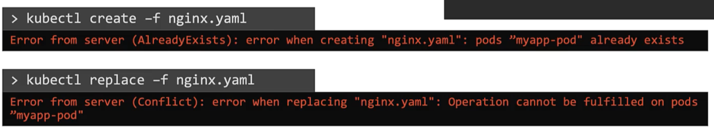

- **Declarative Directory Management**: `kubectl apply -f <directory>/` idempotently applies all manifests in a folder.

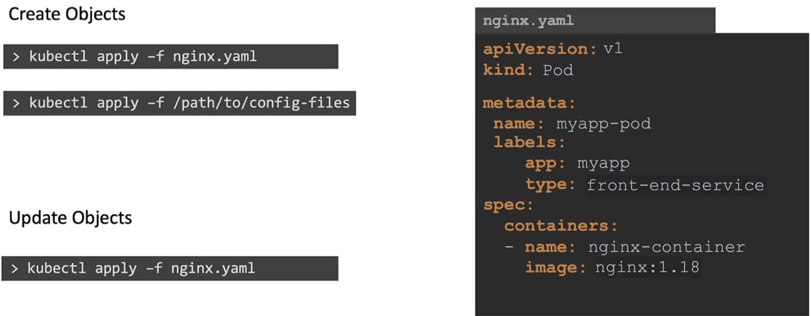

```bash
# Exam task example: Create pod and expose ClusterIP service in one imperative command
kubectl run httpd --image=httpd:alpine --port=80 --expose
```

---

### <a id="certification-tips---imperative-commands-with-kubectl"></a>Certification Tips - Imperative Commands with Kubectl

Using `--dry-run=client -o yaml` generates starter manifest templates instantly without creating live resources:
- `--dry-run=client`: Tests command syntax locally without contacting the API server.
- `-o yaml`: Emits the generated resource definition in YAML format.

#### <a id="pod-commands"></a>POD Commands

**Create an NGINX Pod:**
```bash
kubectl run nginx --image=nginx
```

**Generate Pod Manifest YAML without creating it:**
```bash
kubectl run nginx --image=nginx --dry-run=client -o yaml > pod.yaml
```

#### <a id="deployment-commands"></a>Deployment Commands

**Create a Deployment:**
```bash
kubectl create deployment nginx --image=nginx
```

**Generate Deployment YAML without creating it:**
```bash
kubectl create deployment nginx --image=nginx --dry-run=client -o yaml > deployment.yaml
```

**Create Deployment with 4 Replicas:**
```bash
kubectl create deployment nginx --image=nginx --replicas=4
```

**Scale a Deployment:**
```bash
kubectl scale deployment nginx --replicas=4
```

**Save and modify Deployment manifest:**
```bash
kubectl create deployment nginx --image=nginx --dry-run=client -o yaml > nginx-deployment.yaml
```

#### <a id="service-commands"></a>Service Commands

**Create a Service named `redis-service` of type ClusterIP to expose pod `redis` on port 6379:**
```bash
kubectl expose pod redis --port=6379 --name=redis-service --dry-run=client -o yaml
```
*(Automatically uses the Pod's labels as selectors)*

Or via `create service`:
```bash
kubectl create service clusterip redis --tcp=6379:6379 --dry-run=client -o yaml
```
*(Assumes selector `app=redis`; cannot pass custom selectors on CLI)*

**Create a Service named `nginx-service` of type NodePort to expose pod `nginx` on port 80 (NodePort 30080):**
```bash
kubectl expose pod nginx --type=NodePort --port=80 --name=nginx-service --dry-run=client -o yaml
```
*(Cannot set nodePort directly via flag; output to YAML and edit `nodePort: 30080`)*

Or via `create service`:
```bash
kubectl create service nodeport nginx --tcp=80:80 --node-port=30080 --dry-run=client -o yaml
```

#### <a id="official-references"></a>Official References
- [Kubectl Command Reference](https://kubernetes.io/docs/reference/generated/kubectl/kubectl-commands)
- [Kubectl Conventions](https://kubernetes.io/docs/reference/kubectl/conventions/)

---

### <a id="kubectl-apply"></a>KUBECTL APPLY

The `kubectl apply` command performs a **Three-Way Merge** by comparing:
1. **Local Configuration File**: The manifest stored locally on disk.
2. **Live Object Configuration**: The actual object state stored in ETCD (including runtime status and system defaults).
3. **Last Applied Configuration**: The JSON copy of the previous configuration stored inside the live object's annotation.

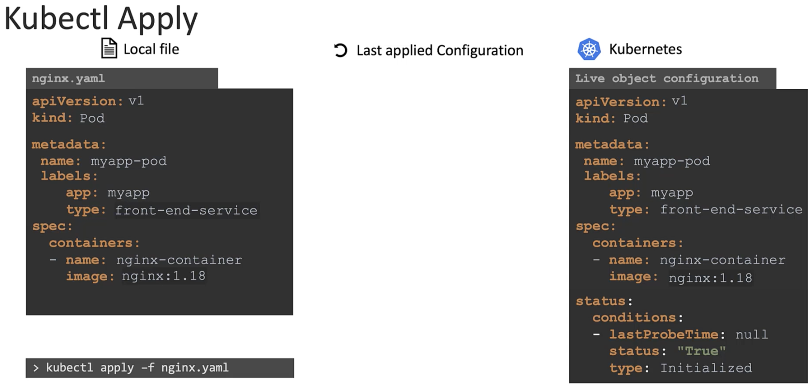

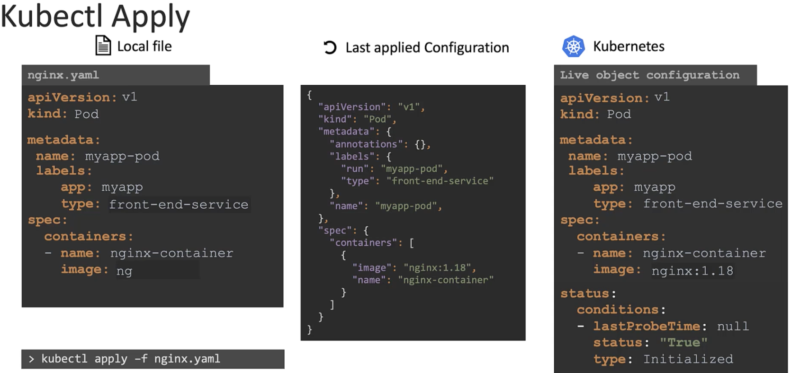

#### <a id="three-way-merge-mechanism-removed-fields"></a>Three-Way Merge Mechanism & Removed Fields
- If a property exists in the **Live** object and **Last Applied**, but is **absent** in the **Local** file, `kubectl apply` identifies it as an intentional deletion and removes it from the live object.
- If a property exists in the **Live** object but was never present in **Last Applied** (e.g., dynamically injected default values), it is preserved.

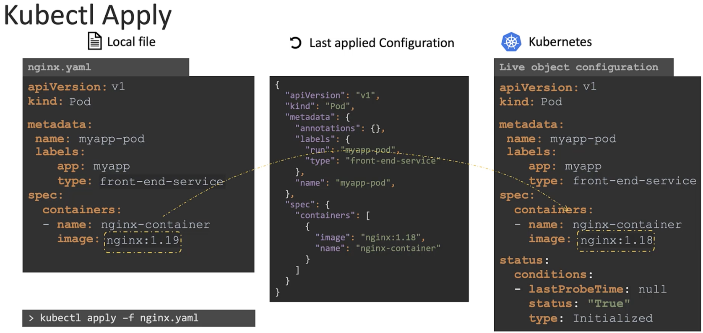

#### <a id="storage-of-last-applied-configuration"></a>Storage of Last Applied Configuration
The JSON configuration is recorded under `metadata.annotations`:
```yaml
metadata:
  annotations:
    kubectl.kubernetes.io/last-applied-configuration: |
      {"apiVersion":"v1","kind":"Pod","metadata":{"name":"myapp-pod"}}
```

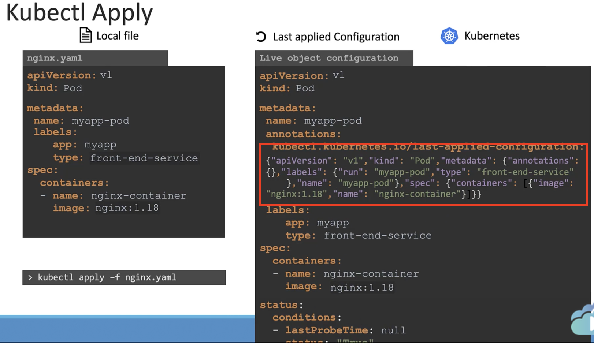

> [!CAUTION]
> Never mix `kubectl create` / `kubectl replace` with `kubectl apply`. Imperative commands do not maintain the `last-applied-configuration` annotation, causing unpredictable merge behavior.

---

### <a id="customresourcedefinitions-crds--the-operator-pattern"></a>CustomResourceDefinitions (CRDs) & The Operator Pattern

Kubernetes is built to be extensible. While built-in resources (Pods, Deployments, Services) cover standard workloads, modern platforms use **CustomResourceDefinitions (CRDs)** and **Operators** to manage stateful infrastructure natively.

#### <a id="1-customresourcedefinition-apiextensionsk8siov1"></a>1. CustomResourceDefinition (`apiextensions.k8s.io/v1`)
A CRD registers new resource endpoints in the Kubernetes API backed by ETCD storage.

```yaml
apiVersion: apiextensions.k8s.io/v1
kind: CustomResourceDefinition
metadata:
  name: databases.company.org
spec:
  group: company.org
  names:
    kind: Database
    plural: databases
    singular: database
    shortNames: ["db"]
  scope: Namespaced
  versions:
  - name: v1
    served: true
    storage: true
    schema:
      openAPIV3Schema:
        type: object
        properties:
          spec:
            type: object
            required: ["engine", "storage"]
            properties:
              engine:
                type: string
                enum: ["postgres", "mysql"]
              storage:
                type: string
    subresources:
      status: {}
```

#### <a id="2-the-operator-pattern"></a>2. The Operator Pattern
A CRD provides the declarative schema, but has no operational intelligence. An **Operator** pairs a CRD with a **Custom Controller**:
- **Informer / Watch**: Watches custom resource events (`Add`, `Update`, `Delete`) over HTTP streaming.
- **Reconcile Loop**: Continuously compares observed state against `.spec` and creates or scales underlying StatefulSets, PVCs, and Secrets.
- **Autonomous Recovery**: Automates failover, point-in-time restores, and database schema migrations without human intervention.
