# 02. Scheduling

## 📑 Table of Contents
- [1. Kubernetes Scheduling Overview](#1-kubernetes-scheduling-overview)
- [2. Manual Scheduling](#2-manual-scheduling)
  - [2.1 Setting `nodeName` at Creation](#21-setting-nodename-at-creation)
  - [2.2 Scheduling Existing Unassigned Pods (Binding API)](#22-scheduling-existing-unassigned-pods-binding-api)
- [3. Labels, Selectors, and Annotations](#3-labels-selectors-and-annotations)
  - [3.1 Labels and Selectors Concepts](#31-labels-and-selectors-concepts)
  - [3.2 Attaching Labels to Pods](#32-attaching-labels-to-pods)
  - [3.3 Object Interconnection via Selectors (ReplicaSets & Services)](#33-object-interconnection-via-selectors-replicasets--services)
  - [3.4 Annotations vs. Labels](#34-annotations-vs-labels)
  - [3.5 Practical Filtering Commands](#35-practical-filtering-commands)
- [4. Taints and Tolerations](#4-taints-and-tolerations)
  - [4.1 Core Concepts & Analogy](#41-core-concepts--analogy)
  - [4.2 Taint Effects: `NoSchedule`, `PreferNoSchedule`, `NoExecute`](#42-taint-effects-noschedule-prefernoschedule-noexecute)
  - [4.3 Configuring Taints on Nodes](#43-configuring-taints-on-nodes)
  - [4.4 Configuring Tolerations on Pods](#44-configuring-tolerations-on-pods)
  - [4.5 `NoExecute` Deep-Dive & Pod Eviction](#45-noexecute-deep-dive--pod-eviction)
  - [4.6 Control Plane (Master) Node Taints](#46-control-plane-master-node-taints)
  - [4.7 Essential Commands for Taints](#47-essential-commands-for-taints)
- [5. Node Selectors](#5-node-selectors)
  - [5.1 Purpose & Limitations](#51-purpose--limitations)
  - [5.2 Labeling Nodes](#52-labeling-nodes)
  - [5.3 Assigning Pods with `nodeSelector`](#53-assigning-pods-with-nodeselector)
- [6. Node Affinity](#6-node-affinity)
  - [6.1 Why Node Affinity?](#61-why-node-affinity)
  - [6.2 Node Affinity Types & Pod Lifecycle](#62-node-affinity-types--pod-lifecycle)
  - [6.3 Operators (`In`, `NotIn`, `Exists`, `DoesNotExist`, `Gt`, `Lt`)](#63-operators-in-notin-exists-doesnotexist-gt-lt)
  - [6.4 Pod Manifest Examples](#64-pod-manifest-examples)
- [7. Taints & Tolerations vs. Node Affinity](#7-taints--tolerations-vs-node-affinity)
  - [7.1 Key Differences](#71-key-differences)
  - [7.2 Combining Both for Full Node Isolation](#72-combining-both-for-full-node-isolation)
- [8. Resource Requests, Limits, and Editing Pods](#8-resource-requests-limits-and-editing-pods)
  - [8.1 Scheduling Evaluation & Pending State](#81-scheduling-evaluation--pending-state)
  - [8.2 Defining Resource Requests & Limits](#82-defining-resource-requests--limits)
  - [8.3 Understanding Resource Units (CPU & Memory)](#83-understanding-resource-units-cpu--memory)
  - [8.4 Exceeding Limits: CPU Throttling vs. Memory OOMKilled](#84-exceeding-limits-cpu-throttling-vs-memory-oomkilled)
  - [8.5 Default Resource Allocation via LimitRange](#85-default-resource-allocation-via-limitrange)
  - [8.6 Editing Running Pods and Deployments](#86-editing-running-pods-and-deployments)
- [9. DaemonSets](#9-daemonsets)
  - [9.1 Purpose and Key Use Cases](#91-purpose-and-key-use-cases)
  - [9.2 DaemonSet Manifest & Selectors](#92-daemonset-manifest--selectors)
  - [9.3 How DaemonSets Schedule Pods](#93-how-daemonsets-schedule-pods)
  - [9.4 Practical Commands](#94-practical-commands)
- [10. Static Pods](#10-static-pods)
  - [10.1 Concept & Kubelet Independence](#101-concept--kubelet-independence)
  - [10.2 Configuring Static Pod Manifest Path](#102-configuring-static-pod-manifest-path)
  - [10.3 Mirror Pods in kube-apiserver](#103-mirror-pods-in-kube-apiserver)
  - [10.4 Deploying Control Plane Components with Static Pods](#104-deploying-control-plane-components-with-static-pods)
  - [10.5 Static Pods vs. DaemonSets](#105-static-pods-vs-daemonsets)
  - [10.6 Diagnostic and Inspection Commands](#106-diagnostic-and-inspection-commands)
- [11. Multiple Schedulers](#11-multiple-schedulers)
  - [11.1 Custom Schedulers Overview](#111-custom-schedulers-overview)
  - [11.2 Deploying an Additional Scheduler](#112-deploying-an-additional-scheduler)
  - [11.3 High Availability & Leader Election](#113-high-availability--leader-election)
  - [11.4 Assigning Pods to a Custom Scheduler (`schedulerName`)](#114-assigning-pods-to-a-custom-scheduler-schedulername)
  - [11.5 Verifying Scheduling Events and Logs](#115-verifying-scheduling-events-and-logs)
  - [11.6 Modern Scheduler Configuration Profiles](#116-modern-scheduler-configuration-profiles)
- [12. Topology Spread Constraints](#12-topology-spread-constraints)
  - [12.1 Failure Domains & Even Distribution](#121-failure-domains--even-distribution)
  - [12.2 Core Parameters](#122-core-parameters)
  - [12.3 Manifest Example](#123-manifest-example)
- [13. PriorityClass & Pod Preemption](#13-priorityclass--pod-preemption)
  - [13.1 Preemption Mechanism](#131-preemption-mechanism)
  - [13.2 Defining a PriorityClass](#132-defining-a-priorityclass)
  - [13.3 Assigning PriorityClass to Pods](#133-assigning-priorityclass-to-pods)
  - [13.4 Non-Preempting Priorities & System Classes](#134-non-preempting-priorities--system-classes)
- [14. Pod Disruption Budgets (PDB)](#14-pod-disruption-budgets-pdb)
  - [14.1 Voluntary vs. Involuntary Disruptions](#141-voluntary-vs-involuntary-disruptions)
  - [14.2 PDB Manifest Specifications](#142-pdb-manifest-specifications)
  - [14.3 Inspection and Diagnostic Commands](#143-inspection-and-diagnostic-commands)
- [15. LimitRange (Namespace Constraints)](#15-limitrange-namespace-constraints)
  - [15.1 Namespace-Level Resource Governance](#151-namespace-level-resource-governance)
  - [15.2 Comprehensive LimitRange Manifest](#152-comprehensive-limitrange-manifest)
  - [15.3 LimitRange vs. ResourceQuota](#153-limitrange-vs-resourcequota)

---

## 1. Kubernetes Scheduling Overview

The **Kubernetes Scheduler** (`kube-scheduler`) is responsible for assigning unscheduled Pods to suitable worker nodes in the cluster.
- **Filtering (Predicates)**: Filters out nodes that do not meet Pod requirements (resource capacity, taints/tolerations, node selectors).
- **Scoring (Priorities)**: Ranks remaining eligible nodes and selects the node with the highest score.
- **Binding**: Creates a `Binding` object that updates `spec.nodeName` on the Pod.

If no scheduler is running or no nodes meet the requirements, Pods remain stuck in the **`Pending`** state.

---

## 2. Manual Scheduling

### 2.1 Setting `nodeName` at Creation

When no scheduler is active, or to bypass the scheduler entirely, set the `nodeName` field under `spec` in the Pod manifest. The Pod is directly assigned to the designated node upon creation.

```yaml
apiVersion: v1
kind: Pod
metadata:
  name: nginx
  labels:
    name: nginx
spec:
  nodeName: node02
  containers:
  - name: nginx
    image: nginx
    ports:
    - containerPort: 8080
```

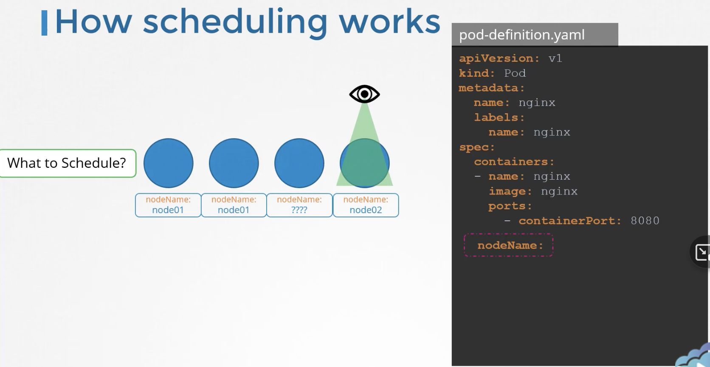

> [!NOTE]
> `nodeName` can **only** be assigned at Pod creation time. Kubernetes does not allow modifying `spec.nodeName` on an already-created Pod via `kubectl edit` or standard YAML updates.

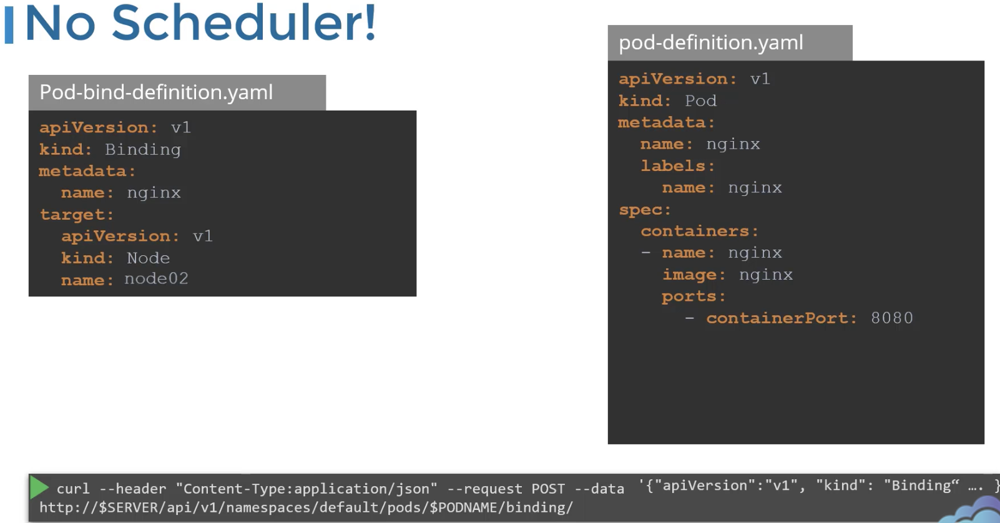

---

### 2.2 Scheduling Existing Unassigned Pods (Binding API)

If a Pod is already created without a node assignment (in `Pending` state), assign it manually by creating a `Binding` object and submitting an HTTP POST request to the Pod's binding sub-resource:

#### Binding Object Definition (`pod-bind-definition.yaml`)
```yaml
apiVersion: v1
kind: Binding
metadata:
  name: nginx
target:
  apiVersion: v1
  kind: Node
  name: node02
```

#### Executing the Binding API Call
Convert the binding object into JSON and send a `POST` request to the target Pod's binding endpoint:

```bash
curl --header "Content-Type: application/json" \
  --request POST \
  --data '{"apiVersion":"v1","kind":"Binding","metadata":{"name":"nginx"},"target":{"apiVersion":"v1","kind":"Node","name":"node02"}}' \
  http://127.0.0.1:8001/api/v1/namespaces/default/pods/nginx/binding
```

---

## 3. Labels, Selectors, and Annotations

### 3.1 Labels and Selectors Concepts

- **Labels**: Key-value pairs attached to Kubernetes objects (Pods, Services, Nodes) for identification, categorization, and filtering.
- **Selectors**: Query expressions used by operators and controllers to filter and group objects matching specific label criteria.

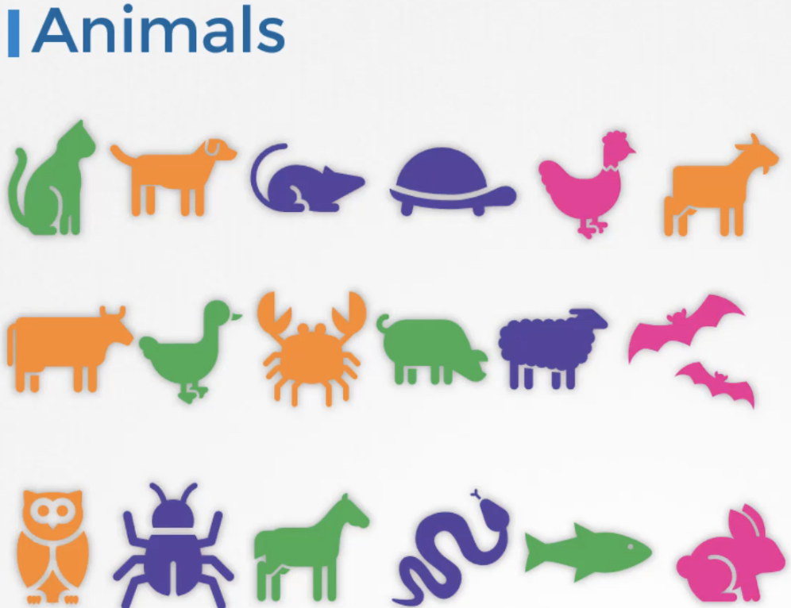
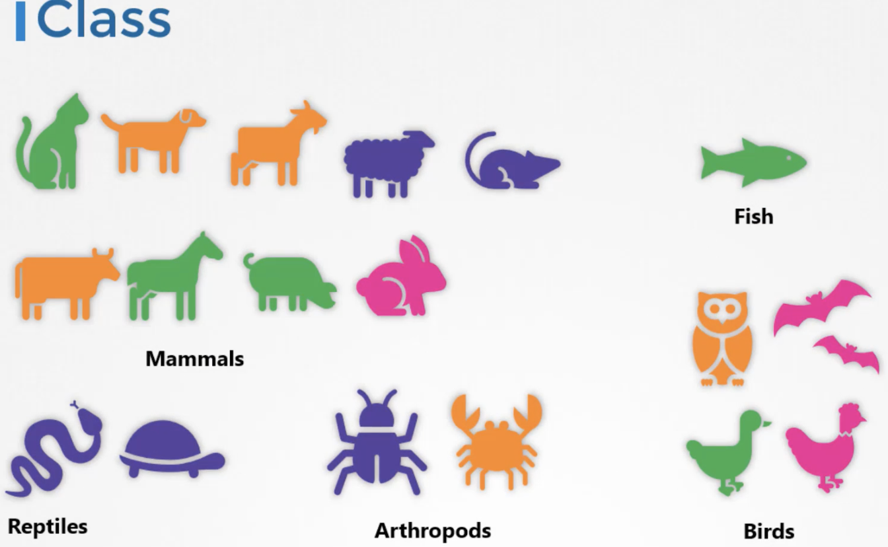
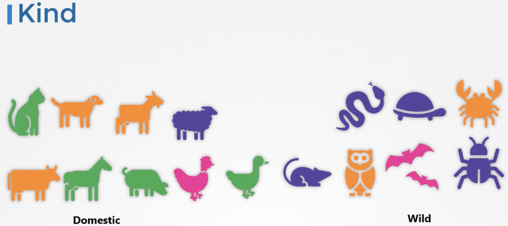
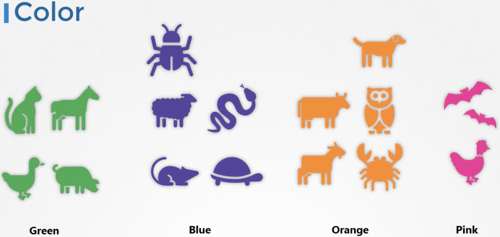
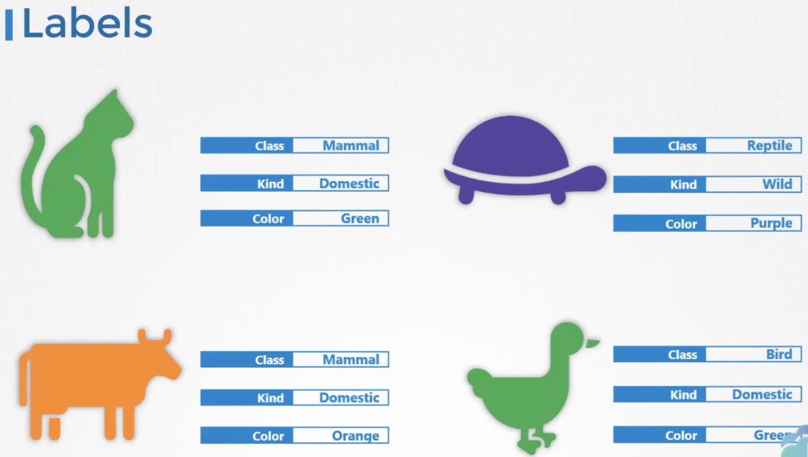

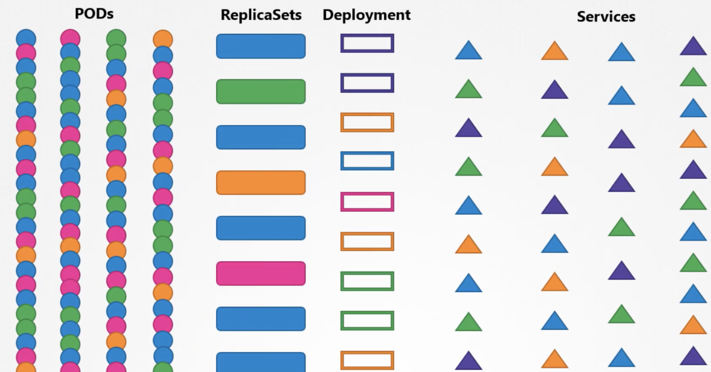

In Kubernetes production environments, labels categorize resources by application name, environment, tier, or business unit:

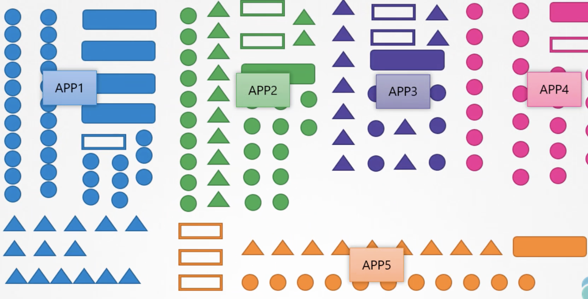
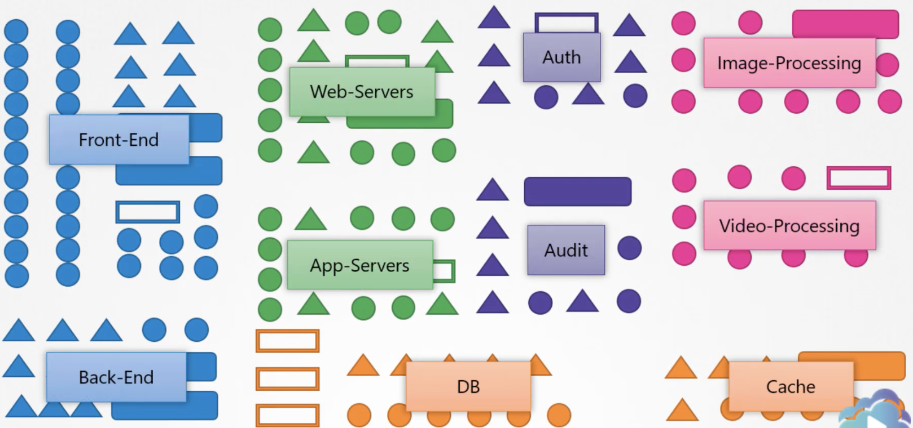

---

### 3.2 Attaching Labels to Pods

Labels are defined under `metadata.labels`:

```yaml
apiVersion: v1
kind: Pod
metadata:
  name: simple-webapp
  labels:
    app: App1
    function: Front-end
spec:
  containers:
  - name: simple-webapp
    image: simple-webapp
    ports:
    - containerPort: 8080
```

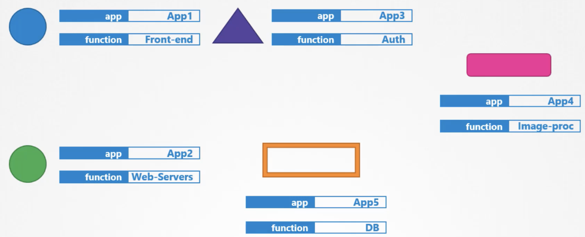


Query labeled pods using the `--selector` (or `-l`) flag:

```bash
kubectl get pods --selector app=App1
```

---

### 3.3 Object Interconnection via Selectors (ReplicaSets & Services)

Controllers use label selectors internally to track and route traffic to target Pods:

#### ReplicaSet Pod Discovery
- `metadata.labels`: Labels applied to the ReplicaSet object itself.
- `spec.selector.matchLabels`: Must match `spec.template.metadata.labels` of the Pod template.

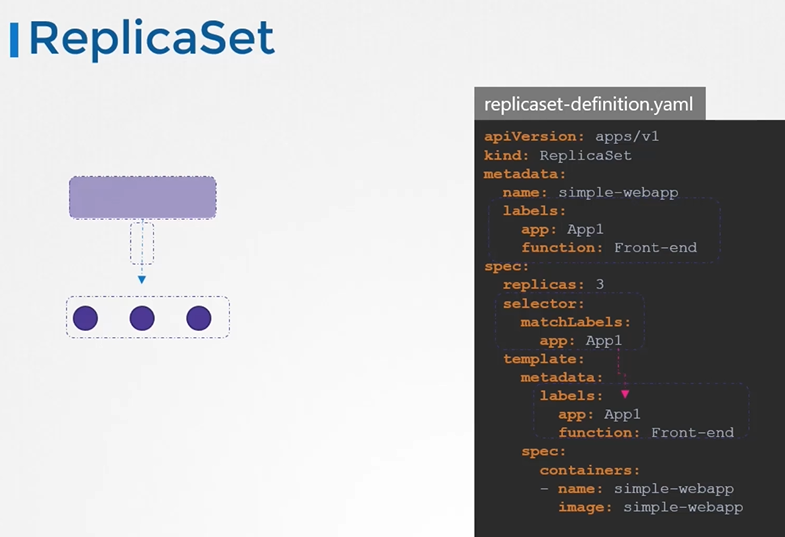

#### Service Routing to Backend Pods
A Service uses `spec.selector` to dynamically select endpoints:

```yaml
apiVersion: v1
kind: Service
metadata:
  name: my-service
spec:
  selector:
    app: App1
  ports:
  - protocol: TCP
    port: 80
    targetPort: 9376
```

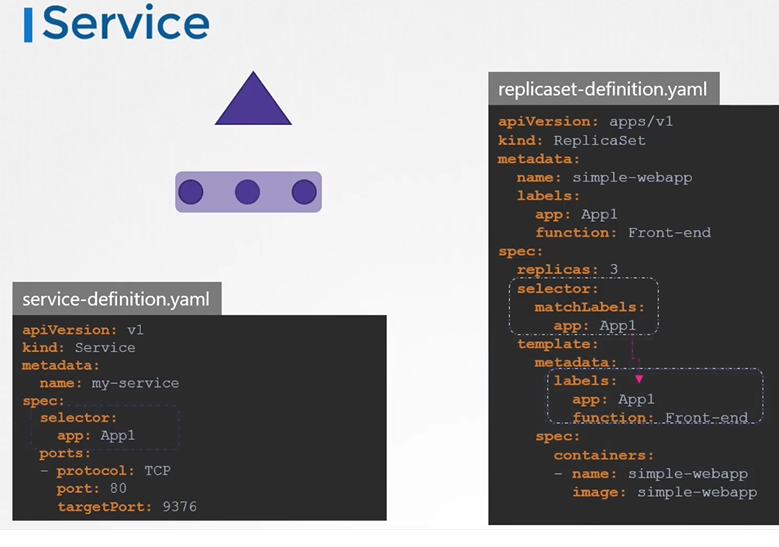

---

### 3.4 Annotations vs. Labels

| Characteristic | Labels | Annotations |
| :--- | :--- | :--- |
| **Purpose** | Identifying, grouping, and selecting objects | Recording non-identifying metadata |
| **Used by Selectors?** | Yes (`matchLabels`, `--selector`) | No |
| **Typical Data** | `tier: frontend`, `env: prod`, `app: web` | Build timestamps, Git commit SHA, contact emails, tool configs |

#### ReplicaSet with Annotations
```yaml
apiVersion: apps/v1
kind: ReplicaSet
metadata:
  name: simple-webapp
  labels:
    app: App1
    function: Front-end
  annotations:
    buildversion: "1.34"
    maintainer: "devops-team@example.com"
spec:
  replicas: 3
  selector:
    matchLabels:
      app: App1
  template:
    metadata:
      labels:
        app: App1
        function: Front-end
    spec:
      containers:
      - name: simple-webapp
        image: simple-webapp
```

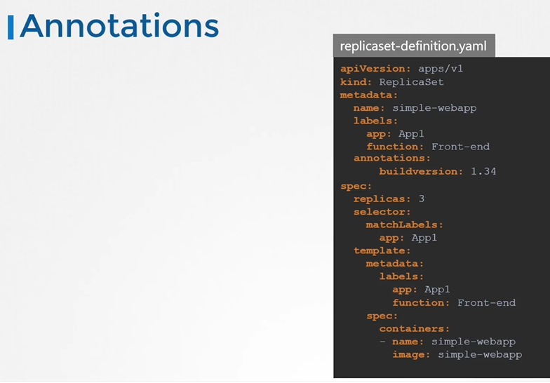

---

### 3.5 Practical Filtering Commands

```bash
# Filter Pods by single label
kubectl get pods --selector env=dev
kubectl get pods --selector bu=finance

# Filter all resources in production environment
kubectl get all --selector env=prod

# Multiple label conditions (logical AND via comma-separated list)
kubectl get all --selector env=prod,bu=finance,tier=frontend
```

---

## 4. Taints and Tolerations

### 4.1 Core Concepts & Analogy

- **Taints** are applied to **Nodes** to repel a set of Pods.
- **Tolerations** are applied to **Pods** to allow (but not force) them to schedule on nodes with matching taints.
- Analogy: A node is sprayed with insect repellent (taint). Only insects immune to the repellent (pods with tolerations) can land on it.

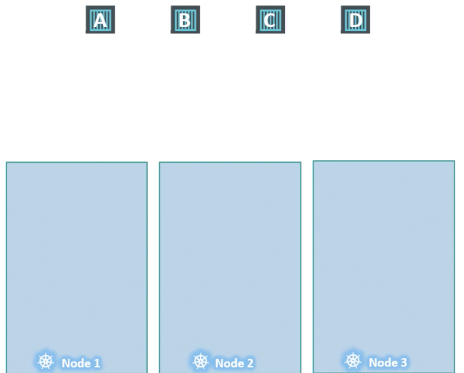
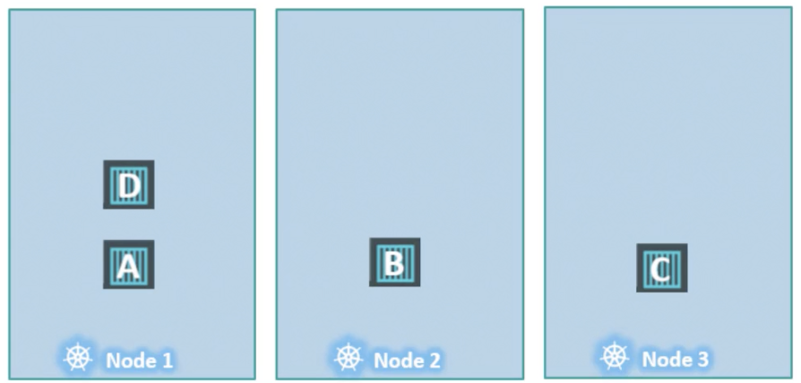
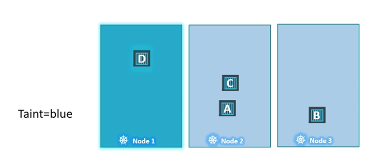

> [!IMPORTANT]
> **Taints and Tolerations do NOT guarantee Pod placement!**
> A toleration merely permits a Pod to schedule on a tainted node. If untainted nodes are also available, the scheduler may place the tolerating Pod on an untainted node. Full dedication requires pairing with **Node Affinity**.

---

### 4.2 Taint Effects: `NoSchedule`, `PreferNoSchedule`, `NoExecute`

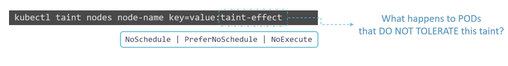

1. **`NoSchedule`**: New pods without matching tolerations will **not** be scheduled on this node. Existing running pods remain untouched.
2. **`PreferNoSchedule`**: Soft constraint. The scheduler tries to avoid scheduling intolerant pods on this node, but will place them here if no alternatives exist.
3. **`NoExecute`**: Hard constraint affecting both new and running pods. New intolerant pods are rejected, and existing running intolerant pods are immediately **evicted** (terminated).

---

### 4.3 Configuring Taints on Nodes

```bash
# Syntax
kubectl taint nodes <node-name> <key>=<value>:<taint-effect>

# Examples
kubectl taint nodes node1 app=blue:NoSchedule
kubectl taint nodes node1 app=blue:PreferNoSchedule
kubectl taint nodes node1 app=blue:NoExecute
```

---

### 4.4 Configuring Tolerations on Pods

Tolerations are configured under `spec.tolerations` inside the Pod manifest:

```yaml
apiVersion: v1
kind: Pod
metadata:
  name: myapp-pod
spec:
  containers:
  - name: nginx-container
    image: nginx
  tolerations:
  - key: "app"
    operator: "Equal"
    value: "blue"
    effect: "NoSchedule"
```

> [!TIP]
> If `operator: "Exists"` is specified, the `value` field must be omitted. An `Exists` operator matches any value for the specified key.

---

### 4.5 `NoExecute` Deep-Dive & Pod Eviction

When a node running multiple Pods receives a `NoExecute` taint:
- Pods with matching tolerations remain running.
- Pods without matching tolerations are evicted immediately.

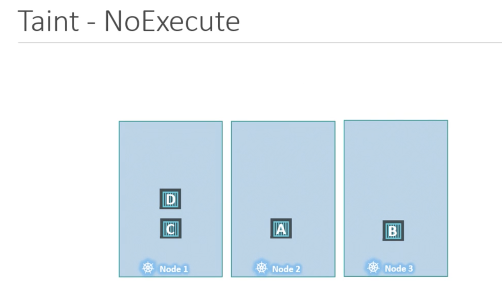
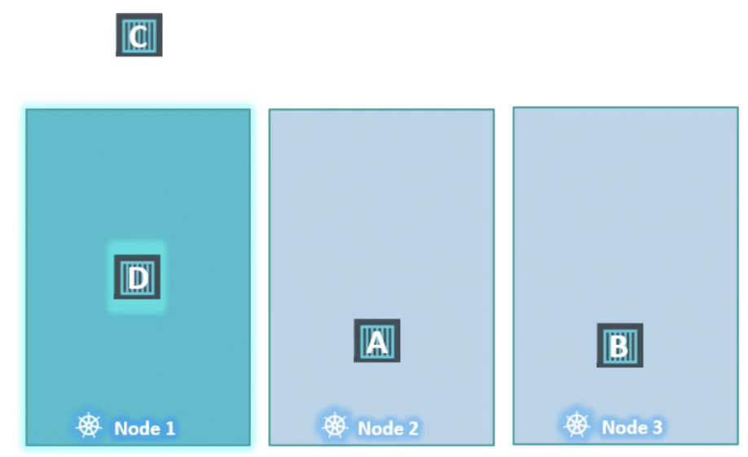
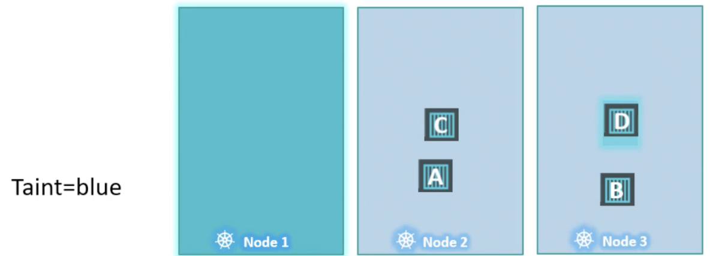

#### Optional `tolerationSeconds`
Pods can specify `tolerationSeconds` under a `NoExecute` toleration to delay eviction upon node disruption:

```yaml
tolerations:
- key: "node.kubernetes.io/unreachable"
  operator: "Exists"
  effect: "NoExecute"
  tolerationSeconds: 300
```

---

### 4.6 Control Plane (Master) Node Taints

By default, Kubernetes prevents user workloads from running on control plane nodes by applying a taint during cluster initialization:
- Older versions: `node-role.kubernetes.io/master:NoSchedule`
- Newer versions: `node-role.kubernetes.io/control-plane:NoSchedule`

#### Inspecting Control Plane Taints
```bash
kubectl describe node controlplane | grep -i taints
```

---

### 4.7 Essential Commands for Taints

```bash
# Check taints on worker nodes
kubectl describe node node01 | grep -i taints

# Apply a taint to node01
kubectl taint nodes node01 spray=mortein:NoSchedule

# Remove a taint (append a minus sign '-' to the taint)
kubectl taint nodes controlplane node-role.kubernetes.io/master:NoSchedule-
kubectl taint nodes controlplane node-role.kubernetes.io/control-plane:NoSchedule-
kubectl taint nodes node01 spray=mortein:NoSchedule-
```

#### Example Workload Lacking Toleration
```yaml
apiVersion: v1
kind: Pod
metadata:
  name: mosquito
  labels:
    app: my-app
    tier: front-end
spec:
  containers:
  - name: nginx
    image: nginx
```

---

## 5. Node Selectors

### 5.1 Purpose & Limitations

In clusters with heterogeneous hardware (e.g., general-purpose vs. high-memory compute nodes), workloads requiring specific resources must be targeted to designated nodes. Without restrictions, the default scheduler may place heavy compute jobs on small nodes.

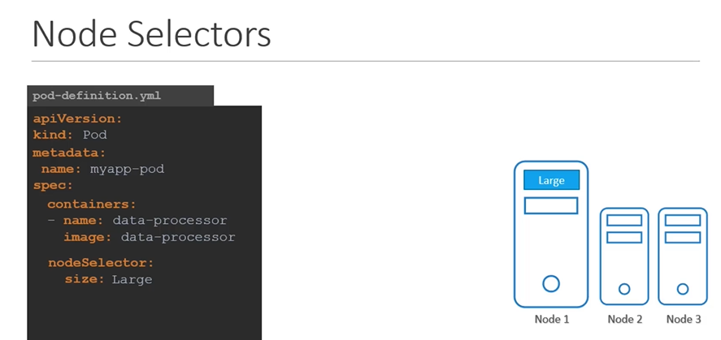
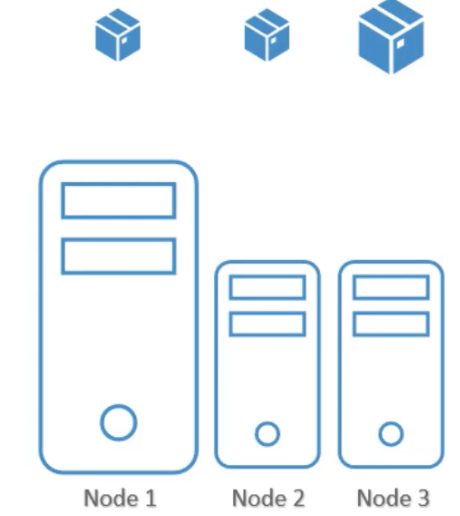

---

### 5.2 Labeling Nodes

Before using `nodeSelector`, assign descriptive labels to target worker nodes:

```bash
# Syntax
kubectl label nodes <node-name> <label-key>=<label-value>

# Example: Label node01 as Large
kubectl label nodes node01 size=Large

# Verify applied labels
kubectl get nodes --show-labels
```

---

### 5.3 Assigning Pods with `nodeSelector`

Reference the exact node label key-value pair under `spec.nodeSelector`:

```yaml
apiVersion: v1
kind: Pod
metadata:
  name: myapp-pod
spec:
  containers:
  - name: data-processor
    image: data-processor
  nodeSelector:
    size: Large
```

```bash
kubectl create -f pod-definition.yaml
```

> [!WARNING]
> **Limitations of `nodeSelector`**:
> `nodeSelector` only supports exact equality matching (`size: Large`). It cannot perform advanced logic such as **OR** (`Large OR Medium`), **NOT** (`NOT Small`), or existence checks. For advanced rules, use **Node Affinity**.

---

## 6. Node Affinity

### 6.1 Why Node Affinity?

Node Affinity extends `nodeSelector` with expressive placement logic, providing operators such as `In`, `NotIn`, `Exists`, `DoesNotExist`, `Gt`, and `Lt`.

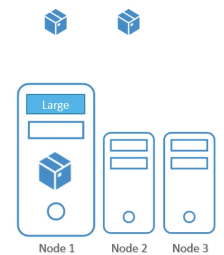

---

### 6.2 Node Affinity Types & Pod Lifecycle

Node affinity defines scheduler behavior across two distinct lifecycle phases:
1. **DuringScheduling**: When the Pod is first created and unassigned.
2. **DuringExecution**: When the Pod is already running on a node.

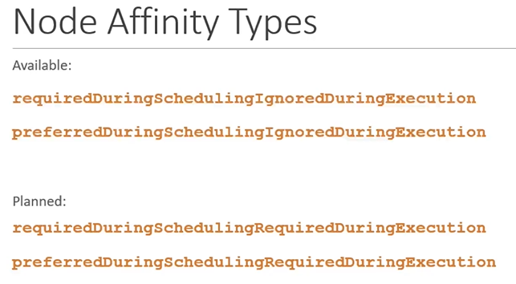

| Affinity Type | DuringScheduling | DuringExecution | Description |
| :--- | :--- | :--- | :--- |
| **`requiredDuringSchedulingIgnoredDuringExecution`** | **Hard** | Ignored | Pod **must** be scheduled on a matching node; stays `Pending` if no match exists. If node labels change later, running pod remains running. |
| **`preferredDuringSchedulingIgnoredDuringExecution`** | **Soft** | Ignored | Scheduler attempts to find a matching node; falls back to other available nodes if no match is found. Running pods remain unaffected. |
| **`requiredDuringSchedulingRequiredDuringExecution`** *(Planned)* | **Hard** | **Hard** | Pod must be scheduled on matching node. If node labels change later, pod is evicted immediately. |

---

### 6.3 Operators (`In`, `NotIn`, `Exists`, `DoesNotExist`, `Gt`, `Lt`)

- **`In`**: Node label value must match one of the entries in `values`.
- **`NotIn`**: Node label value must not match any entry in `values`.
- **`Exists`**: Node label key must exist on the node (omit `values`).
- **`DoesNotExist`**: Node label key must not exist on the node (omit `values`).
- **`Gt` / `Lt`**: Numerical greater-than / less-than comparison against integer label values.

---

### 6.4 Pod Manifest Examples

#### Hard Affinity with `In` Operator (Large OR Medium)
```yaml
apiVersion: v1
kind: Pod
metadata:
  name: myapp-pod
spec:
  containers:
  - name: data-processor
    image: data-processor
  affinity:
    nodeAffinity:
      requiredDuringSchedulingIgnoredDuringExecution:
        nodeSelectorTerms:
        - matchExpressions:
          - key: size
            operator: In
            values:
            - Large
            - Medium
```

#### Hard Affinity with `NotIn` Operator (Exclude Small Nodes)
```yaml
apiVersion: v1
kind: Pod
metadata:
  name: myapp-pod
spec:
  containers:
  - name: data-processor
    image: data-processor
  affinity:
    nodeAffinity:
      requiredDuringSchedulingIgnoredDuringExecution:
        nodeSelectorTerms:
        - matchExpressions:
          - key: size
            operator: NotIn
            values:
            - Small
```

#### Hard Affinity with `Exists` Operator (Verify Label Key Presence)
```yaml
apiVersion: v1
kind: Pod
metadata:
  name: myapp-pod
spec:
  containers:
  - name: data-processor
    image: data-processor
  affinity:
    nodeAffinity:
      requiredDuringSchedulingIgnoredDuringExecution:
        nodeSelectorTerms:
        - matchExpressions:
          - key: size
            operator: Exists
```

#### Soft Affinity (`preferredDuringSchedulingIgnoredDuringExecution`)
```yaml
apiVersion: v1
kind: Pod
metadata:
  name: myapp-pod
spec:
  containers:
  - name: data-processor
    image: data-processor
  affinity:
    nodeAffinity:
      preferredDuringSchedulingIgnoredDuringExecution:
      - weight: 1
        preference:
          matchExpressions:
          - key: size
            operator: In
            values:
            - Large
```

#### Practical Deployment with Node Affinity
```bash
# Label node01 with color=Blue
kubectl label nodes node01 color=Blue
```

```yaml
apiVersion: apps/v1
kind: Deployment
metadata:
  name: blue
  labels:
    app: nginx
spec:
  replicas: 3
  selector:
    matchLabels:
      app: nginx
  template:
    metadata:
      labels:
        app: nginx
    spec:
      affinity:
        nodeAffinity:
          requiredDuringSchedulingIgnoredDuringExecution:
            nodeSelectorTerms:
            - matchExpressions:
              - key: color
                operator: In
                values:
                - Blue
      containers:
      - name: nginx
        image: nginx
```

---

## 7. Taints & Tolerations vs. Node Affinity

### 7.1 Key Differences

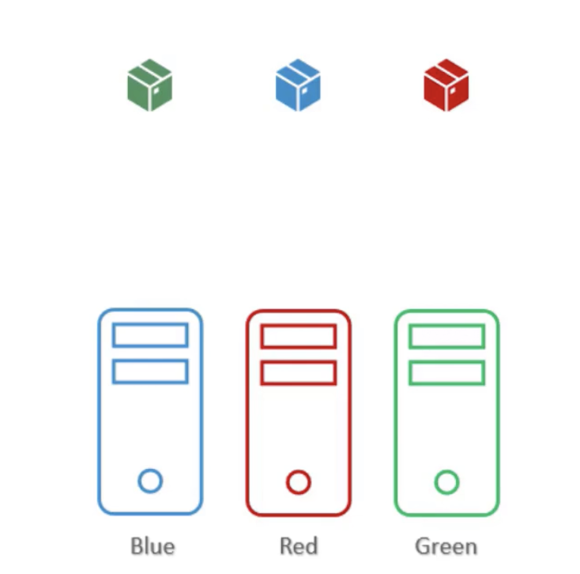

- **Taints & Tolerations**: Set on nodes to keep unwanted pods out. They **do not guarantee** that tolerating pods won't land on other untainted nodes.
- **Node Affinity**: Set on pods to attract them to specific nodes. It **does not prevent** other untargeted pods from landing on those same nodes.

---

### 7.2 Combining Both for Full Node Isolation

To achieve 100% dedicated node isolation (e.g., dedicating `NodeBlue` exclusively to `PodBlue`):
1. **Apply a Taint to the Node**: Repels all other workloads that do not tolerate `color=blue`.
2. **Apply a Toleration to the Pod**: Enables `PodBlue` to schedule on `NodeBlue`.
3. **Apply a Node Label & Node Affinity to the Pod**: Directs `PodBlue` specifically to `NodeBlue`, preventing it from scheduling on untainted nodes.

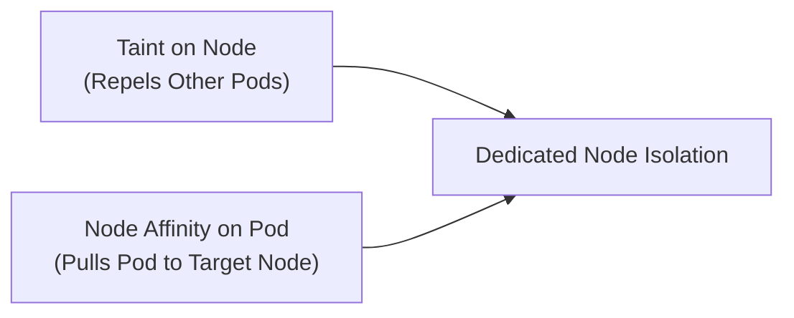
```mermaid
flowchart LR
    A["Taint on Node<br/>(Repels Other Pods)"] --> C["Dedicated Node Isolation"]
    B["Node Affinity on Pod<br/>(Pulls Pod to Target Node)"] --> C
```

---

## 8. Resource Requests, Limits, and Editing Pods

### 8.1 Scheduling Evaluation & Pending State

The scheduler evaluates the sum of container `requests` against the **allocatable** capacity of worker nodes:


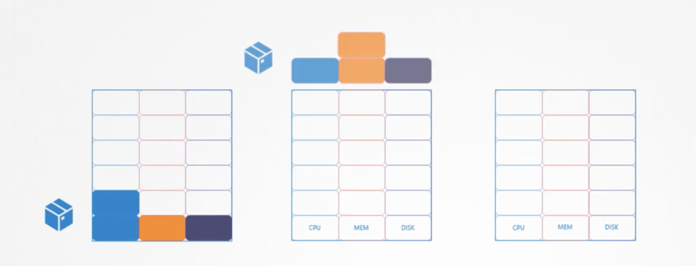

If no single node possesses sufficient CPU or memory capacity to satisfy the requested amount, the Pod is held in a **`Pending`** state:

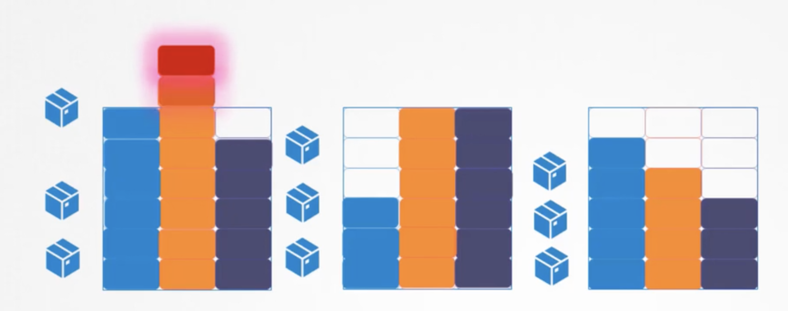
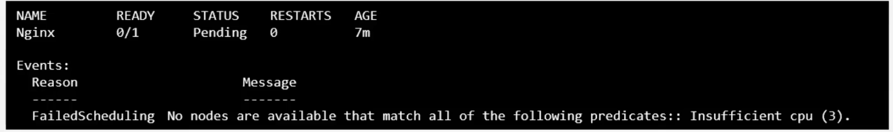

Inspect events to determine the scheduling failure cause:
```bash
kubectl describe pod <pod-name>
# Event Reason: FailedScheduling: 0/3 nodes are available: 3 Insufficient cpu.
```

---

### 8.2 Defining Resource Requests & Limits

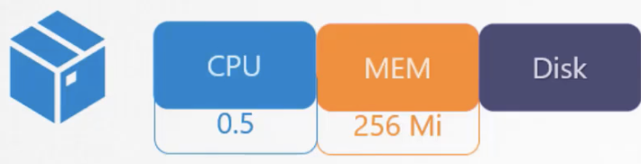
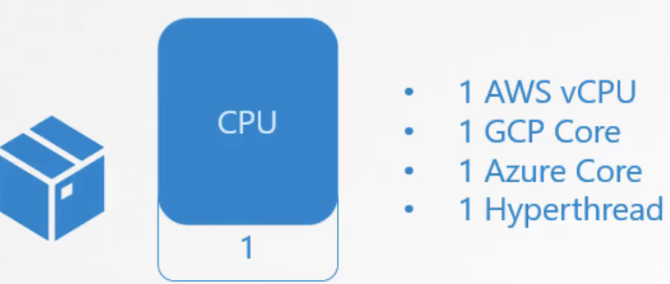

- **Requests**: Minimum compute resources guaranteed to the container. Used by `kube-scheduler` during node selection.
- **Limits**: Maximum ceiling of compute resources the container can consume. Enforced by the container runtime via cgroups.

```yaml
apiVersion: v1
kind: Pod
metadata:
  name: simple-webapp-color
  labels:
    name: simple-webapp-color
spec:
  containers:
  - name: simple-webapp-color
    image: simple-webapp-color
    ports:
    - containerPort: 8080
    resources:
      requests:
        cpu: "1"
        memory: "1Gi"
      limits:
        cpu: "2"
        memory: "2Gi"
```

---

### 8.3 Understanding Resource Units (CPU & Memory)

#### CPU Units

- `1` CPU = 1 vCPU (AWS) = 1 Core (GCP/Azure) = 1 Hyperthread.
- Minimum granularity: `1m` (one millicore = `0.001` CPU).
- `500m` = `0.5` CPU.

#### Memory Units
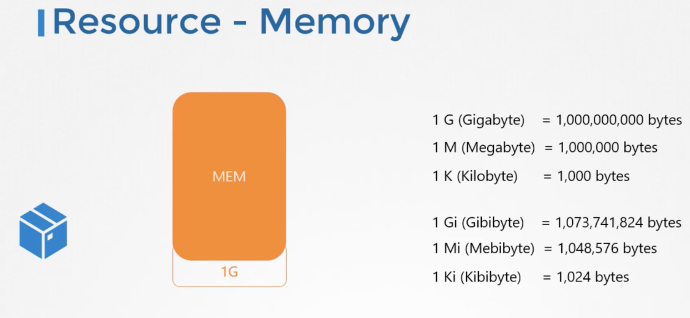
- **Binary representation (powers of 1024)**: `Ki`, `Mi`, `Gi`, `Ti` (e.g., `256Mi` = $256 \times 1024^2$ bytes).
- **Decimal representation (powers of 1000)**: `K`, `M`, `G`, `T` (e.g., `256M` = $256 \times 1000^2$ bytes).

---

### 8.4 Exceeding Limits: CPU Throttling vs. Memory OOMKilled

- **CPU (Compressible)**: When a container reaches its CPU limit, the kernel throttles execution cycles. The application slows down, but the Pod **is not terminated**.
- **Memory (Incompressible)**: When a container exceeds its memory limit, the Linux Out-Of-Memory (OOM) killer terminates the offending process. The Pod fails with status **`OOMKilled`** (Exit Code **137**).

---

### 8.5 Default Resource Allocation via LimitRange

To enforce baseline requests and limits across Pods that do not explicitly define them, configure a `LimitRange` in the target namespace:

```yaml
apiVersion: v1
kind: LimitRange
metadata:
  name: mem-limit-range
  namespace: default
spec:
  limits:
  - default:
      memory: 512Mi
    defaultRequest:
      memory: 256Mi
    type: Container
---
apiVersion: v1
kind: LimitRange
metadata:
  name: cpu-limit-range
  namespace: default
spec:
  limits:
  - default:
      cpu: "1"
    defaultRequest:
      cpu: "500m"
    type: Container
```

---

### 8.6 Editing Running Pods and Deployments

#### Editing a Running Pod
Only the following fields are mutable on an active running Pod:
1. `spec.containers[*].image`
2. `spec.initContainers[*].image`
3. `spec.activeDeadlineSeconds`
4. `spec.tolerations`

Modifying any other field (e.g., environment variables, resource limits, ports) triggers an API validation error:

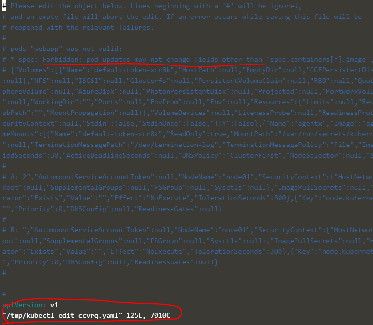
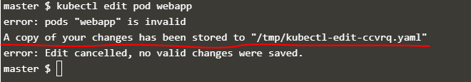

#### Workarounds for Immutable Pod Fields
1. **Using Temporary File from `kubectl edit`**:
   ```bash
   kubectl edit pod webapp
   # When saving fails, Kubernetes saves edits to /tmp/kubectl-edit-xxxx.yaml
   kubectl delete pod webapp
   kubectl create -f /tmp/kubectl-edit-xxxx.yaml
   ```

2. **Export, Modify, and Recreate**:
   ```bash
   kubectl get pod webapp -o yaml > my-new-pod.yaml
   vi my-new-pod.yaml
   kubectl replace --force -f my-new-pod.yaml
   # Or explicitly:
   # kubectl delete pod webapp
   # kubectl create -f my-new-pod.yaml
   ```

#### Editing Deployments
All fields in `spec.template` can be edited freely. Kubernetes automatically performs a rolling restart of underlying replica pods:

```bash
kubectl edit deployment my-deployment
```

---

## 9. DaemonSets

### 9.1 Purpose and Key Use Cases

A **DaemonSet** ensures that an exact single copy of a specified Pod runs on **all (or selected) worker nodes** in the cluster.
- When new nodes join the cluster, DaemonSet pods are automatically provisioned on them.
- When nodes are removed, DaemonSet pods are automatically garbage collected.

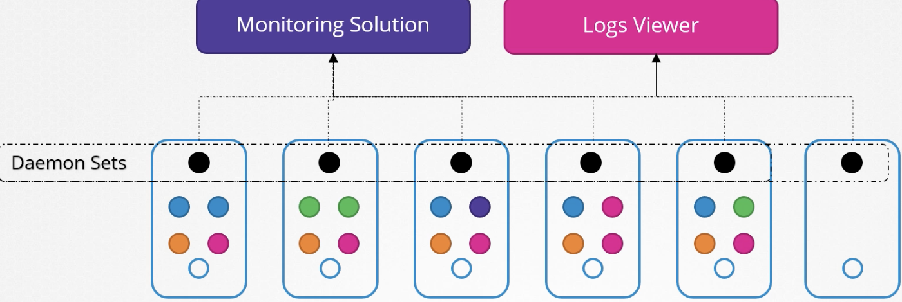

#### Common Use Cases:
1. **Cluster Monitoring Agents**: Prometheus Node Exporter, Datadog agent, New Relic.
2. **Log Collectors**: Fluentd, Logstash, Vector, Fluentbit.
3. **Cluster Networking**: `kube-proxy`, CNI plugins (Weave Net, Flannel, Calico).

---

### 9.2 DaemonSet Manifest & Selectors

```yaml
apiVersion: apps/v1
kind: DaemonSet
metadata:
  name: monitoring-daemon
  labels:
    app: monitoring-agent
spec:
  selector:
    matchLabels:
      app: monitoring-agent
  template:
    metadata:
      labels:
        app: monitoring-agent
    spec:
      containers:
      - name: monitoring-agent
        image: monitoring-agent
```

---

### 9.3 How DaemonSets Schedule Pods

- **Pre-Kubernetes v1.12**: The DaemonSet controller directly configured `spec.nodeName` on pod creation, bypassing the scheduler entirely.
- **Kubernetes v1.12+**: DaemonSet pods are scheduled by the **default scheduler** using automatically injected `NodeAffinity` rules and default tolerations.

---

### 9.4 Practical Commands

```bash
# List all DaemonSets across namespaces
kubectl get daemonsets --all-namespaces

# Inspect DaemonSet details
kubectl describe daemonsets kube-flannel-ds -n kube-system

# Fast generation via Deployment dry-run:
kubectl create deployment elasticsearch --image=k8s.gcr.io/fluentd-elasticsearch:1.20 \
  -n kube-system --dry-run=client -o yaml > fluentd.yaml

# Modify fluentd.yaml:
# 1. Change 'kind: Deployment' to 'kind: DaemonSet'
# 2. Remove 'replicas', 'strategy', and 'status' fields
kubectl create -f fluentd.yaml
```

---

## 10. Static Pods

### 10.1 Concept & Kubelet Independence

**Static Pods** are managed directly by the `kubelet` daemon on an individual node without involvement from the control plane (`kube-apiserver`, `kube-scheduler`, or `controller-manager`).

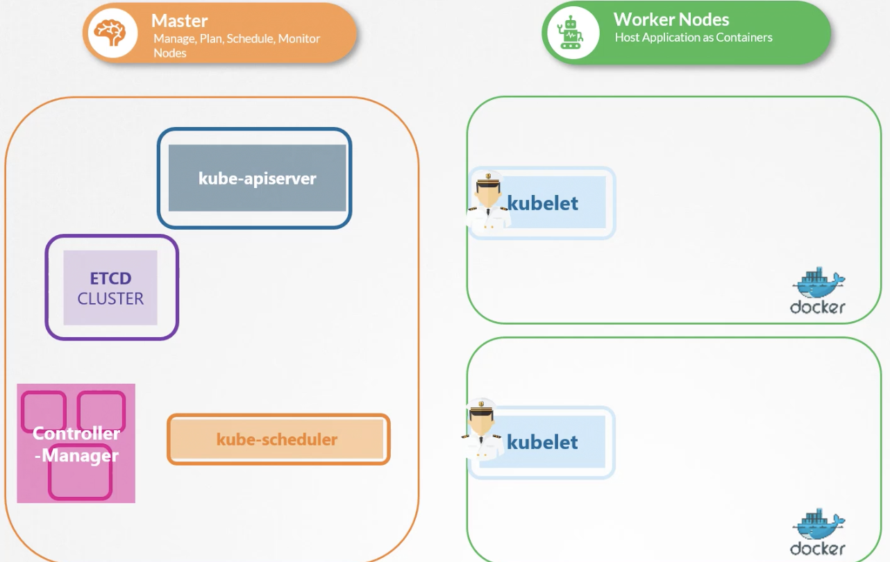

- Kubelet periodically scans a designated host directory for manifest files.
- Kubelet creates, monitors, and restarts the static Pods directly on the host container runtime.
- If a manifest is updated, kubelet restarts the Pod. If removed, kubelet deletes the Pod.
- **Limitation**: Kubelet can only manage individual Pods statically—it cannot create ReplicaSets, Deployments, or Services.

---

### 10.2 Configuring Static Pod Manifest Path

The static pod directory is configured using one of two methods:

#### Method 1: Kubelet Service Command-Line Flag
Set `--pod-manifest-path` in `/etc/systemd/system/kubelet.service.d/10-kubeadm.conf`:
```text
--pod-manifest-path=/etc/kubernetes/manifests
```

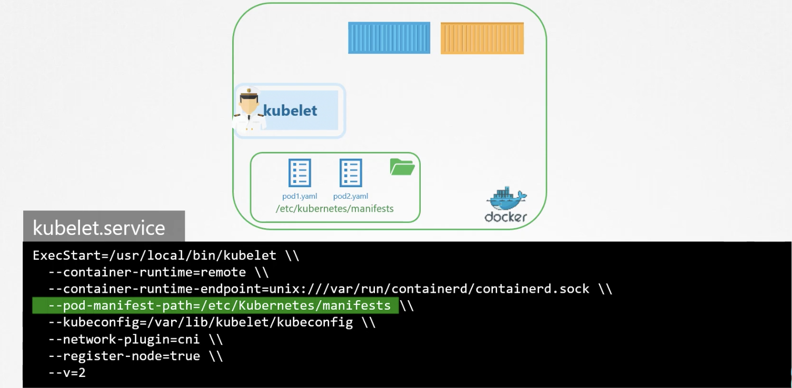

#### Method 2: Kubelet YAML Configuration File (kubeadm standard)
Set `--config=/var/lib/kubelet/config.yaml` in the service file, and define `staticPodPath` in `config.yaml`:
```yaml
staticPodPath: /etc/kubernetes/manifests
```

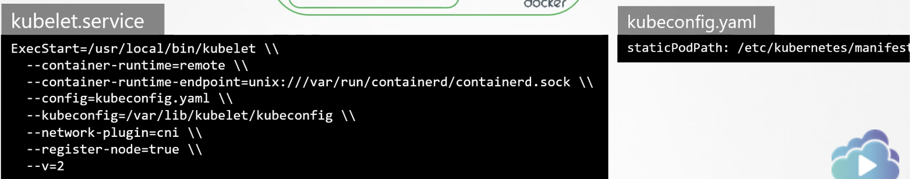

---

### 10.3 Mirror Pods in kube-apiserver

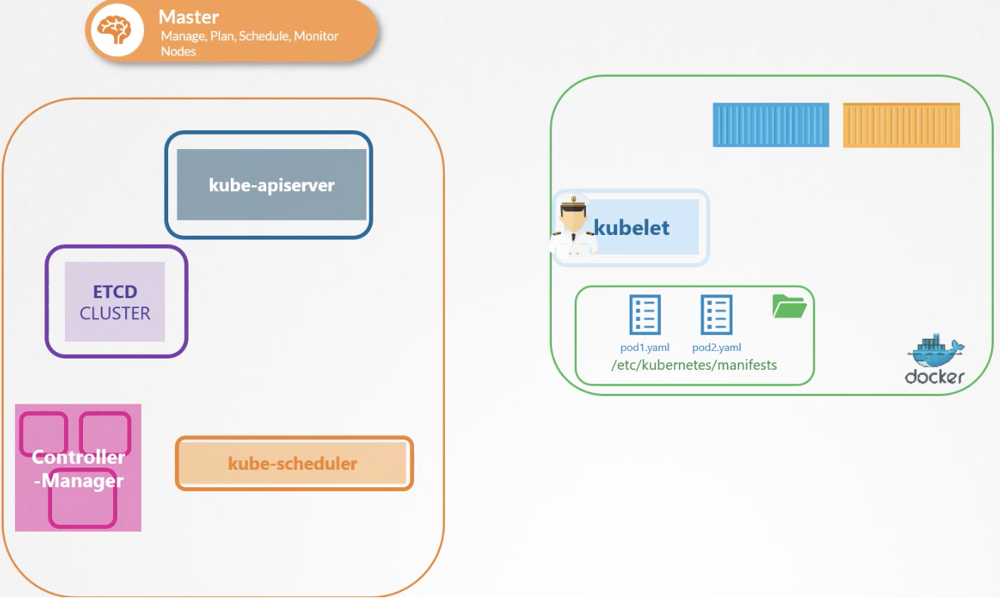

When a node with static pods belongs to a Kubernetes cluster:
- Kubelet registers a read-only **Mirror Pod** in `kube-apiserver`.
- Mirror pods appear in `kubectl get pods`, with the host node name appended to the pod name (e.g., `kube-apiserver-controlplane`).
- You **cannot** edit or delete a static pod via `kubectl`. Modifying or deleting requires direct filesystem access to the node's static manifest folder.

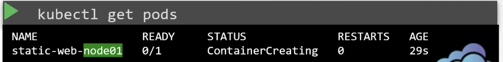

---

### 10.4 Deploying Control Plane Components with Static Pods

The `kubeadm` initialization tool leverages Static Pods to bootstrap the core Kubernetes control plane:
- Manifests placed in `/etc/kubernetes/manifests/`:
  - `kube-apiserver.yaml`
  - `kube-controller-manager.yaml`
  - `kube-scheduler.yaml`
  - `etcd.yaml`
- Kubelet runs and restarts these core components without requiring an existing operational cluster.

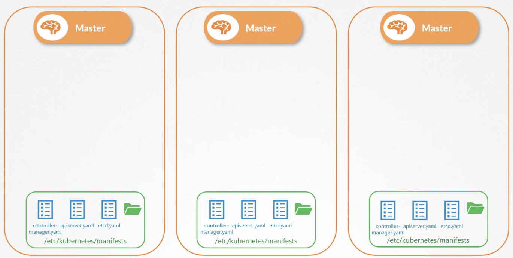

---

### 10.5 Static Pods vs. DaemonSets

| Feature | Static Pods | DaemonSets |
| :--- | :--- | :--- |
| **Created / Managed By** | Kubelet directly | DaemonSet Controller (Control Plane) |
| **API Server Requirement** | Not required (operates standalone) | Mandatory |
| **Creation Method** | Placing YAML in manifest directory | Applying YAML through `kubectl` / API |
| **Scope** | Single node | Multi-node across cluster |
| **Kube-Scheduler Impact** | Completely ignored | Scheduled via default scheduler |
| **Primary Use Case** | Bootstrapping control plane (`apiserver`, `etcd`) | Monitoring, log collection, CNI networking |

---

### 10.6 Diagnostic and Inspection Commands

```bash
# List all pods including mirror pods
kubectl get pods --all-namespaces

# Identify the static pod manifest path on a node
ps -ef | grep kubelet | grep -i config
# Inspect the resulting config file:
grep -i staticpod /var/lib/kubelet/config.yaml

# View running containers on a standalone node (without kubectl/API server)
crictl ps
# Or if Docker is the runtime:
docker ps
```

---

## 11. Multiple Schedulers

### 11.1 Custom Schedulers Overview

Kubernetes is extensible: you can run multiple schedulers concurrently alongside the `default-scheduler`. Applications choose which scheduler places their Pods using the `schedulerName` property.

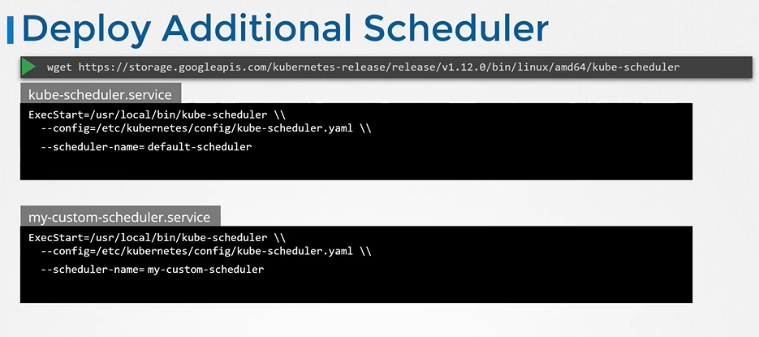

---

### 11.2 Deploying an Additional Scheduler

An additional scheduler can run as a binary service or as a Pod inside the `kube-system` namespace.

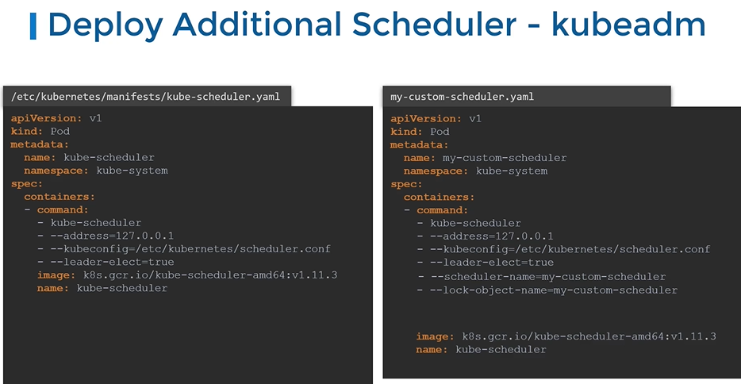

#### Custom Scheduler Pod Manifest (`my-custom-scheduler.yaml`)
```yaml
apiVersion: v1
kind: Pod
metadata:
  name: my-custom-scheduler
  namespace: kube-system
spec:
  containers:
  - name: kube-scheduler
    image: registry.k8s.io/kube-scheduler:v1.30.0
    command:
    - kube-scheduler
    - --address=0.0.0.0
    - --leader-elect=false
    - --scheduler-name=my-custom-scheduler
```

```bash
kubectl create -f my-custom-scheduler.yaml
kubectl get pods -n kube-system
```

---

### 11.3 High Availability & Leader Election

When running multiple replicas of a scheduler across master nodes:
- Set `--leader-elect=true` to elect an active leader while other replicas remain on standby.
- When running a secondary custom scheduler alongside the default scheduler, set `--leader-elect=false` or configure a distinct `--lock-object-name` to prevent interfering with the default scheduler's leader election.

---

### 11.4 Assigning Pods to a Custom Scheduler (`schedulerName`)

Designate the custom scheduler in `spec.schedulerName`:

```yaml
apiVersion: v1
kind: Pod
metadata:
  name: nginx
spec:
  schedulerName: my-custom-scheduler
  containers:
  - name: nginx
    image: nginx
```

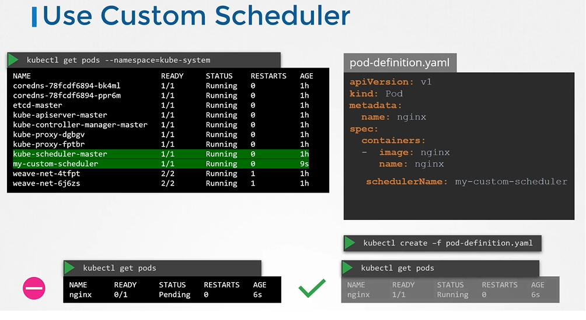

```bash
kubectl create -f pod-definition.yaml
kubectl get pods
```

---

### 11.5 Verifying Scheduling Events and Logs

#### Check Scheduling Events
```bash
kubectl get events
```

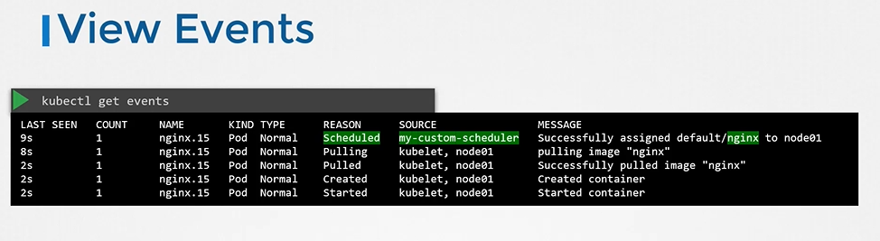

The event output confirms scheduling was handled by `my-custom-scheduler`:
```text
default    Normal    Scheduled    pod/nginx    Successfully assigned default/nginx to node01 by my-custom-scheduler
```

#### Inspect Scheduler Logs
```bash
kubectl logs my-custom-scheduler -n kube-system
```

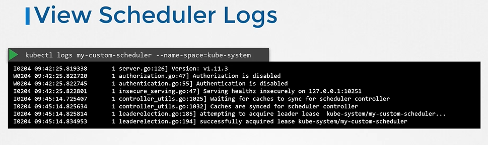

---

### 11.6 Modern Scheduler Configuration Profiles

In Kubernetes v1.22+, custom schedulers are configured using `KubeSchedulerConfiguration` profiles:

```yaml
apiVersion: kubescheduler.config.k8s.io/v1
kind: KubeSchedulerConfiguration
profiles:
  - schedulerName: my-scheduler
leaderElection:
  leaderElect: false
```

Required RBAC bindings typically include:
- `ServiceAccount`: `my-scheduler` in `kube-system`
- `ClusterRoleBinding`: `my-scheduler-as-kube-scheduler`
- `ClusterRoleBinding`: `my-scheduler-as-volume-scheduler`

---

## 12. Topology Spread Constraints

### 12.1 Failure Domains & Even Distribution

**Topology Spread Constraints** control how Pods are distributed across failure domains (regions, zones, racks, or nodes) to ensure high availability and prevent single-point failures.

---

### 12.2 Core Parameters

- **`maxSkew`**: Maximum permissible difference in the number of matching Pods between any two topology domains. Must be $> 0$.
- **`topologyKey`**: Node label key representing the topology domain (e.g., `topology.kubernetes.io/zone`, `kubernetes.io/hostname`).
- **`whenUnsatisfiable`**:
  - `DoNotSchedule` (Hard): Prevents scheduling if the skew constraint cannot be satisfied.
  - `ScheduleAnyway` (Soft): Schedules the Pod while prioritizing nodes that minimize skew.
- **`labelSelector`**: Identifies which Pods count toward the domain calculation.
- **`matchLabelKeys`** (Kubernetes 1.27+): Dynamic Pod label keys used during rolling upgrades to calculate skew across revisions.

---

### 12.3 Manifest Example

```yaml
apiVersion: apps/v1
kind: Deployment
metadata:
  name: web-app
  labels:
    app: web
spec:
  replicas: 6
  selector:
    matchLabels:
      app: web
  template:
    metadata:
      labels:
        app: web
    spec:
      topologySpreadConstraints:
      - maxSkew: 1
        topologyKey: topology.kubernetes.io/zone
        whenUnsatisfiable: DoNotSchedule
        labelSelector:
          matchLabels:
            app: web
      containers:
      - name: nginx
        image: nginx:alpine
        resources:
          requests:
            cpu: 100m
            memory: 128Mi
```

---

## 13. PriorityClass & Pod Preemption

### 13.1 Preemption Mechanism

When cluster compute resources are exhausted, high-priority Pods can **preempt** (evict) lower-priority Pods to claim required scheduling capacity.

---

### 13.2 Defining a PriorityClass

```yaml
apiVersion: scheduling.k8s.io/v1
kind: PriorityClass
metadata:
  name: high-priority
value: 1000000
globalDefault: false
description: "Mission-critical tier service priority class"
preemptionPolicy: PreemptLowerPriority # Or 'Never' for non-preempting queue jumping
```

---

### 13.3 Assigning PriorityClass to Pods

```yaml
apiVersion: v1
kind: Pod
metadata:
  name: critical-api-pod
spec:
  priorityClassName: high-priority
  containers:
  - name: api
    image: nginx:alpine
```

---

### 13.4 Non-Preempting Priorities & System Classes

- **`preemptionPolicy: Never`**: Pod advances to the head of the scheduling queue without evicting running lower-priority Pods.
- **Built-in System Priorities**:
  - `system-node-critical` (`value: 2000001000`): Used for node-essential daemons (`kube-proxy`).
  - `system-cluster-critical` (`value: 2000000000`): Used for cluster control plane addons (`CoreDNS`).

---

## 14. Pod Disruption Budgets (PDB)

### 14.1 Voluntary vs. Involuntary Disruptions

- **Involuntary Disruptions**: Hardware faults, kernel panics, power failures. (Cannot be prevented by PDB).
- **Voluntary Disruptions**: Actions initiated by cluster admins or automated tooling (`kubectl drain`, node scale-down via Cluster Autoscaler, software upgrades).

A **PodDisruptionBudget (PDB)** ensures a minimum quorum of healthy replicas remain operational during voluntary disruptions.

---

### 14.2 PDB Manifest Specifications

Define either `minAvailable` or `maxUnavailable` (as an absolute integer or a percentage):

#### Using `minAvailable`
```yaml
apiVersion: policy/v1
kind: PodDisruptionBudget
metadata:
  name: web-pdb
  namespace: default
spec:
  minAvailable: 2
  selector:
    matchLabels:
      app: web
```

#### Using `maxUnavailable`
```yaml
apiVersion: policy/v1
kind: PodDisruptionBudget
metadata:
  name: payments-pdb
  namespace: default
spec:
  maxUnavailable: "25%"
  selector:
    matchLabels:
      app: payments
```

---

### 14.3 Inspection and Diagnostic Commands

```bash
# List all active Pod Disruption Budgets
kubectl get pdb -A

# Inspect disruption budget status
kubectl describe pdb web-pdb
```

---

## 15. LimitRange (Namespace Constraints)

### 15.1 Namespace-Level Resource Governance

While `ResourceQuota` limits the aggregate consumption of an entire namespace, a **`LimitRange`** enforces constraints on individual Pods, containers, and PVCs within the namespace:
1. **Default Requests & Limits**: Injected automatically into containers that omit resource declarations.
2. **Min & Max Bounds**: Sets lower and upper compute limits per container or pod.
3. **Max Limit-to-Request Ratio**: Prevents extreme overcommit ratios.

---

### 15.2 Comprehensive LimitRange Manifest

```yaml
apiVersion: v1
kind: LimitRange
metadata:
  name: mem-limit-range
  namespace: default
spec:
  limits:
  - type: Container
    default:
      cpu: 500m
      memory: 512Mi
    defaultRequest:
      cpu: 100m
      memory: 128Mi
    max:
      cpu: "2"
      memory: 1Gi
    min:
      cpu: 50m
      memory: 64Mi
    maxLimitRequestRatio:
      cpu: 4
      memory: 4
```

---

### 15.3 LimitRange vs. ResourceQuota

| Feature | `LimitRange` | `ResourceQuota` |
| :--- | :--- | :--- |
| **Enforcement Scope** | Per Container / Per Pod / Per PVC | Entire Namespace (Aggregated) |
| **Default Injection** | Yes (injects default requests/limits) | No |
| **Primary Goal** | Prevent individual runaway pods & set floors | Cap aggregate compute & storage spend |
| **Admission Controller** | `LimitRanger` | `ResourceQuota` |
