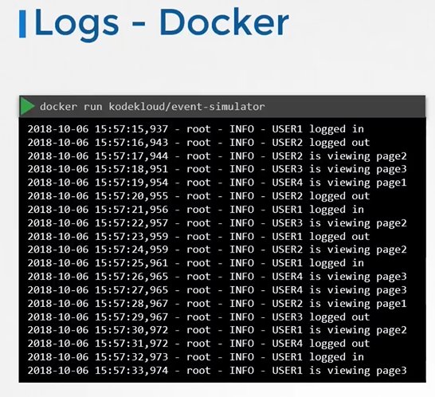

# 03. Logging & Monitoring

## Logging & Monitoring

- In this section we discussed the various logging and monitoring options available.

- We first see how to monitor the kubernetes cluster components as well as the applications hosted on them.

- We then see how to view and manage the logs for the cluster components as well as the applications.

### Monitor Cluster Components

**So how do you monitor resource consumption on Kubernetes?**  **Or more importantly what would you like to monitor?**

Let's Say I’d like to know **Node level metrics** such as the number of nodes in the cluster, how many of them are healthy as well as performance metrics such as **CPU. Memory, network and disk utilization.** As well as **POD level metrics** such as the number of PODs, and performance metrics of each POD such as the **CPU and Memory consumption on them**. So we need a solution that will monitor these metrics, store them and provide analytics around this data. Kubernetes does not come with a full featured built-in monitoring solution. However, there are a number of open-source solutions available today, such as the **Metrics-Server, Prometheus, Elastic Stack,** and proprietary solutions like **Datadog and Dynatrace.** 

Heapster was one of the original projects that enabled monitoring and analysis features for kubernetes You will see a lot of references online when you look for reference architectures on monitoring Kubernetes. However, **Heapster is now Deprecated** and a slimmed down version was formed known as the **Metrics Server.**

**Metrics server**You can have one metrics server per kubernetes cluster. The metric server retrieves metrics from each of the kubernetes nodes and pods, aggregates them and stores them in memory.  **Note** that the metric server is only an in memory monitoring solution and does not store the metrics on a disk and as a result you cannot see historical performance data. 

**So how are the metrics generated for the PODs on these nodes?**  Kubernetes  runs an agent on each node known as the **kubelet**, which is responsible for receiving instructions from the kubernetes API master server and running PODs on the nodes. The kubelet also contains a subcomponent known as *cAdvisor or Container Advisor*. **cAdvisor** is responsible for retrieving performance metrics from pods, and exposing them through the kubelet API to make the metrics available for the Metrics Server. If you are using minikube for your local cluster, run the command minikube addons enable metrics-server. For all other environments deploy the metrics server by cloning the metrics-server deployment files from the github repository. And then deploying the required components using the kubectl create command. This command deploys a set of pods, services and roles to enable metrics server to poll for performance metrics from the nodes in the cluster. Once deployed, give the metrics-server some time to collect and process data. Once processed, cluster performance can be viewed by running the command `kubectl top node.` This provides the CPU and Memory consumption of each of the nodes. 

As you can see 8% of the CPU on my master node is consumed, which is about 166 milli cores. 

Use the `kubectl top pod` command to view performance metrics of pods in kubernetes.

### Managing Application Logs

There are  various logging mechanisms in kubernetes. Let us start with logging in Docker.

```bash
$ docker run -d kodekloud/event-simulator  
```



 I run a docker container, called event-simulator and all that it does is generate random events simulating a web server. These are events streamed to the standard output by the application. Now, if I were to run the docker container in the background, in a detached mode using the `–d` option, I wouldn't see the logs if I wanted to view the logs.

I could use the docker logs command followed by the container ID. The `–f` option helps us see the live log trail. 

Now back to Kubernetes. We create a pod with the same docker image using the pod definition file. Once the pod is running, we can view the logs using the kubectl logs command with the pod name. 

Use the `–f` option to stream the logs live just like the docker command. Now these logs are specific to the container running inside the pod. As we learned before, Kubernetes PODs can have multiple docker containers in them. In this case I modify my pod definition file to include an additional container called image-processor. If you ran the kubectl logs command now with the pod name, which container’s log would it show? If there are multiple containers within a pod. You must specify the name of the container explicitly in the command. Otherwise it would fail asking you to specify a name. In this case I will specify the name of the first container event-simulator and that prints the relevant log messages.

### Advanced Application & Container Logging

In the CKA exam, logging tasks often involve multi-container pods, previous container crashes, or filtering logs across deployments:

```bash
# 1. Stream logs from a specific container in a multi-container Pod
kubectl logs <pod-name> -c <container-name> -f

# 2. View logs from a previous, crashed container instance (CrashLoopBackOff)
kubectl logs <pod-name> -c <container-name> --previous

# 3. Stream logs with timestamps and limit output to the last 50 lines
kubectl logs <pod-name> --tail=50 --timestamps=true -f

# 4. View logs generated in the last 15 minutes or 1 hour
kubectl logs <pod-name> --since=15m
kubectl logs <pod-name> --since=1h

# 5. Tail logs from all containers in a Pod simultaneously
kubectl logs <pod-name> --all-containers=true -f

# 6. Stream logs from all Pods matching a label selector
kubectl logs -l app=web-frontend --all-containers=true --tail=100 -f
```

---

### JSONPath Queries & Data Extraction (Essential for CKA)

The CKA exam frequently requires querying specific fields using `kubectl` JSONPath without installing external utilities like `jq`.

#### 1. Basic JSONPath Syntax
- Root object: `$` or `.`
- Wildcard (all elements in a list): `[*]`
- Specific index: `[0]`
- String formatting: `{"\n"}` for newline, `{"\t"}` for tab

#### 2. Practical JSONPath Examples for Exam Tasks

```bash
# Get Internal IPs of all worker nodes
kubectl get nodes -o jsonpath='{.items[*].status.addresses[?(@.type=="InternalIP")].address}'

# Output node names and their internal IPs line by line
kubectl get nodes -o jsonpath='{range .items[*]}{.metadata.name}{"\t"}{.status.addresses[?(@.type=="InternalIP")].address}{"\n"}{end}'

# Get the container images used by all Pods in the default namespace
kubectl get pods -o jsonpath='{.items[*].spec.containers[*].image}'

# Get all Pod names and their allocated node names line by line
kubectl get pods -A -o jsonpath='{range .items[*]}{.metadata.namespace}{"\t"}{.metadata.name}{"\t"}{.spec.nodeName}{"\n"}{end}'

# Get the storage capacity of all PersistentVolumes
kubectl get pv -o jsonpath='{range .items[*]}{.metadata.name}{"\t"}{.spec.capacity.storage}{"\n"}{end}'

# Get the Operating System image of all nodes
kubectl get nodes -o jsonpath='{.items[*].status.nodeInfo.osImage}'
```

---

### Custom Columns & Sorting

When JSONPath syntax is too cumbersome or a clean tabular output is needed, use `-o custom-columns` and `--sort-by`:

#### 1. Custom Columns Table
```bash
# Display Pod name, namespace, node, and IP in custom columns
kubectl get pods -A -o custom-columns=NAME:.metadata.name,NAMESPACE:.metadata.namespace,NODE:.spec.nodeName,IP:.status.podIP

# Display Node name, CPU capacity, and OS image
kubectl get nodes -o custom-columns=NODE:.metadata.name,CPU:.status.capacity.cpu,OS:.status.nodeInfo.osImage
```

#### 2. Sorting Output
```bash
# Sort Pods by creation timestamp (oldest first)
kubectl get pods -A --sort-by=.metadata.creationTimestamp

# Sort Nodes by CPU capacity
kubectl get nodes --sort-by=.status.capacity.cpu

# Sort PersistentVolumes by capacity
kubectl get pv --sort-by=.spec.capacity.storage
```

---

### Cluster Event Monitoring

Cluster events record lifecycle changes, failures, scheduling decisions, and evictions:

```bash
# 1. View all events across all namespaces sorted by time
kubectl get events -A --sort-by=.metadata.creationTimestamp

# 2. Watch cluster events in realtime
kubectl get events -A -w

# 3. Filter only Warning events (e.g. FailedScheduling, BackOff, Unhealthy)
kubectl get events -A --field-selector type=Warning

# 4. View events for a specific Pod or deployment
kubectl get events -n <namespace> --field-selector involvedObject.name=<pod-name>
```

---

### Host & Systemd Journal Logging (Control Plane & Node Daemons)

When Kubernetes components fail before the API server can respond, inspect systemd logs directly on the node:

```bash
# 1. Kubelet daemon logs
sudo journalctl -u kubelet -n 100 --no-pager
sudo journalctl -u kubelet -f

# 2. Containerd runtime logs
sudo journalctl -u containerd -n 100 --no-pager

# 3. Static Pod raw log files on disk (bypassing API server)
# Logs for static pods (apiserver, etcd, scheduler, controller-manager) are written to:
ls -la /var/log/pods/
ls -la /var/log/containers/
```

