# 04. Application Lifecycle Management

## Application Lifecycle Management

### Rolling Updates and Rollbacks

Updates and rollbacks in a deployment. Before we look at how we upgrade our application, let's try to understand rollouts and versioning in a deployment. When you first create a deployment, it triggers a rollout, a new rollout, creates a new **deployment revision**, let's call it revision one.

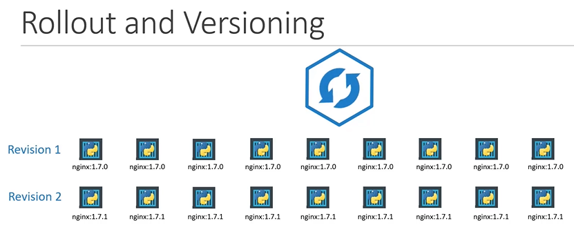

In the future, when the application is upgraded, meaning when the container version is updated to a new one, a new rollout is triggered and a new **deployment revision** is created named “revision two” this helps us keep track of the changes made to our deployment and enables us to roll back to a previous version of deployment if necessary.

You can see the status of your rollout by running the command `kubectl rollout status deployment/myapp`, followed by the name of the deployment. 

```bash
$ kubectl rollout status deployment/myapp-deployment
```

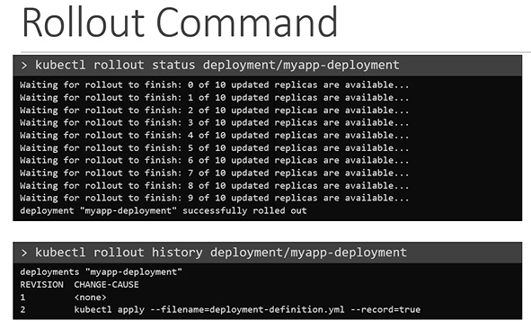

To see the revisions and history of rollout run the `kubectl rollout history` command followed by the deployment name. 

```bash
$ kubectl rollout history deployment/myapp-deployment And this will show you the revisions and history of our deployment.
```

There are two types of deployment strategies. Say, for example, you have five replicas of your Web application instance deployed. One way to upgrade these to a newer version is to destroy all of these and then create newer versions of application instances, meaning first destroy the five running instances and then deploy five new instances of the new application version.The problem with this, as you can imagine, is that during the period after the older versions are down and before any newer version is up, the application is down and inaccessible to users. This strategy is known as the **recreate strategy**, and thankfully, this is not the default deployment strategy.

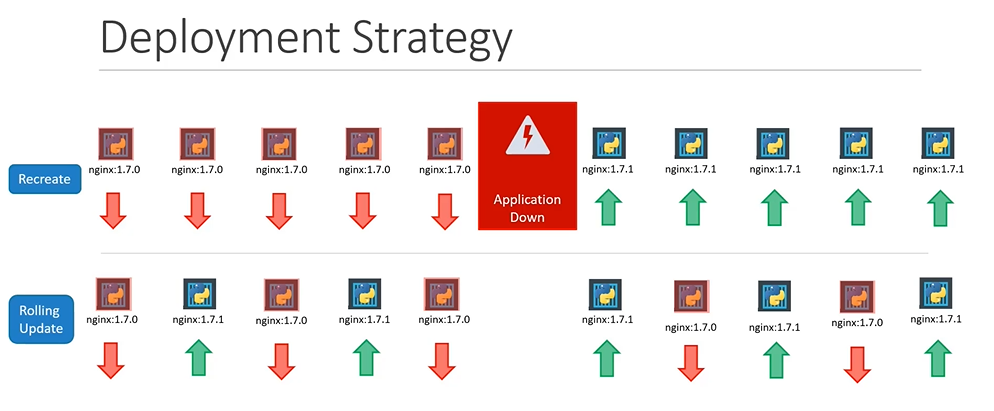

The second strategy is where we do not destroy all of them at once. Instead, we take down the older version and bring up a newer version one by one, this way the application never goes down and the upgrade is seamless.**Remember, if you do not specify your strategy while creating the deployment, it will assume it to** **be rolling** **update.**In other words, rolling update is the default deployment strategy. 

**So we talked about upgrades. How exactly do you update your deployment?**

**When I say update** it could be different things, such as updating your application version by updating the version of **Docker** containers used, updating their **labels** or updating the number of **replicas**, etc. Since we already have a deployment definition file, it is easy for us to modify these files once we make the necessary changes.

```yaml
apiVersion: apps/v1
kind: Deployment
metadata:
 name: myapp-deployment
 labels:
  app: nginx
spec:
 template:
   metadata:
     name: myap-pod
     labels:
       app: myapp
       type: front-end
   spec:
    containers:
    - name: nginx-container
      image: nginx:1.7.1
 replicas: 3
 selector:
  matchLabels:
```

    `type: front-end`    

```bash
$ kubectl apply -f deployment-definition.yaml
```

A new rollout is triggered and a new revision after deployment is created. But there is another way to do the same thing. Alternate way to update a deployment say for example for updating an image.You could use the `kubectl set Image` command, to update the image of your application.

```bash
$ kubectl set image deployment/myapp-deployment nginx=nginx:1.9.1
```

Note:  **remember, doing it this way will result in the deployment definition file having a different configuration.** So you must be careful when using the same definition file to make changes in the future. 

The differences between the recreate and rolling update strategies can also be seen when you view the deployments in detail from the `kubectl describe deployment` command to see the detailed information regarding the deployments. You will notice when the recreated strategy was used, The events indicate that the old ReplicaSet was scaled down to zero first, and then the new replicaSet scaled up to five.

However, when the rolling update strategy was used, the old ReplicaSet was scaled down one at a time.Simultaneously scaling up the new ReplicaSet one at a time.

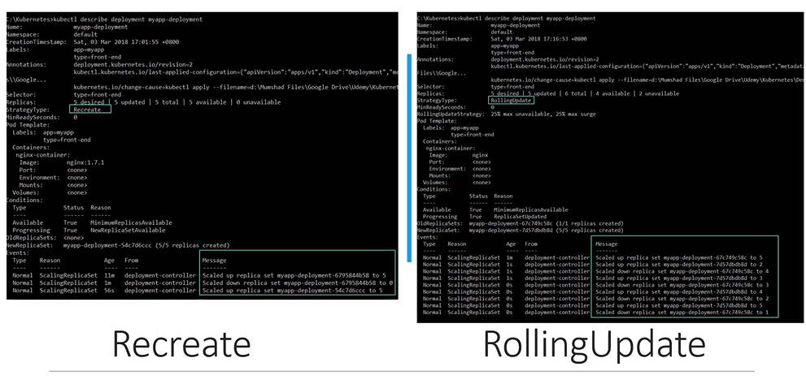

Let's look at how a deployment performs an upgrade under the hood,  when a new deployment is created. Say  to deploy five replicas. It first creates a replicaSet automatically, which in turn creates the number of PODs required to meet the number of replicas. 

When you upgrade your application, as we saw in the previous `, the kubernetes deployment object creates a new replicaSet under the hood and starts deploying the containers there at the same time, taking down the paths in the old ReplicaSet following a rolling update strategy. 

This can be seen when you try to list the replicaSets using the `kubectl get ReplicaSets` command.

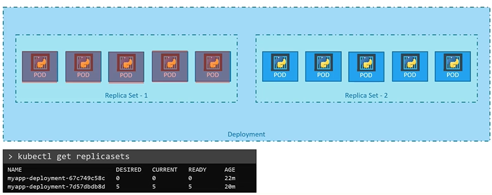

Here we see the old ReplicaSet with zero PODs and the new ReplicaSet with five PODs.

Say, for instance, once you upgrade your application, you realise something is inferior, right?

Something's wrong with the new version of Build you used for upgrading. So you would like to roll back your update.

Kubernetes deployments  allow you to roll back to a previous revision.To undo a change run the  `kubectl rollout undo deployment/myapp-deployment` command followed by the name of the deployment. The deployment will then destroy the PODs in the new ReplicaSet and bring the older ones up in the old ReplicaSet. And your application is back to its older format.

When you compare the output of the `kubectl get replicasets` command before and after the roll back, you will be able to notice the difference. 

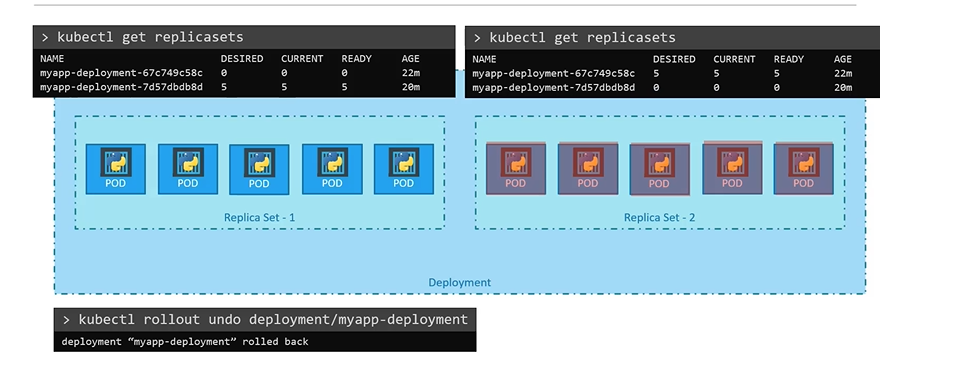

Before the rollback the first ReplicaSet had zero pods and new replicas that had five pods. And this is reversed after the rollback is finished.

To summarise the commands real quick, use the kubectl create command to create the deployment.

get deployment's, command to list the deployments.

Apply and set image commands to update the deployments and `rollout status` commands to see the status of rollouts and `rollout undo` command to roll back a deployment operation.

```bash
$ kubectl create -f deployment-definition.yaml
$ kubectl get deployments
$ kubectl apply -f deployment-definition.yaml
$ kubectl set image deployment/myapp-deployment nginx=nginx:1.9.1
$ kubectl rollout status deployment/myapp-deployment
$ kubectl rollout history deployment/myapp-deployment
$ kubectl rollout undo deployment/myapp-deployment
```

#### Practice Test

```bash
controlplane ~ ➜  cat curl-test.sh
for i in {1..35}; do
   kubectl exec --namespace=kube-public curl -- sh -c 'test=`wget -qO- -T 2  http://webapp-service.default.svc.cluster.local:8080/info 2>&1` && echo "$test OK" || echo "Failed"';
   echo ""
done
```

Configuring applications comprises of understanding the following concepts:

- Configuring Command and Arguments on applications

- Configuring Environment Variables

- Configuring Secrets

### Command and Arguments in a Pod Definition file.

We will first look at command arguments and entry points in Docker. Let's start with a simple scenario.

Say you were to run a docker container from an Ubuntu image, when you run the “`docker run ubuntu`” command, *it runs an instance of Ubuntu image and exits immediately.* If you were to list the running containers you wouldn't see the container running. If you list all containers including those that are stopped you will see that the new container you ran is in an exited state. **Now why is that ?** **Unlike virtual machines, Containers are not meant to host an operating system** 

```bash
$ docker run ubuntu # To run a docker container$ docker ps #To list running containers$ docker ps -a #To list all containers including that are stopped
```

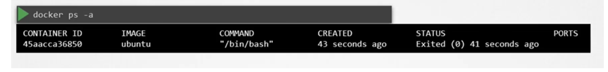

“*Containers are meant to run a specific task or process such as to host an instance of a web server or application server or a database or simply to carry out some kind of computation or analysis. Once the task is complete, the container exits. A container only lives as long as the process inside it is alive.”*

If the web service inside the container is stopped or crashes the container exits. 

**So who defines what process is run within the container.**

If you look at the docker file for popular Docker images like NGINX you will see an instruction called CMD which stands for command that defines the program that will be run within the container when it starts. For the NGINX image it is the nginx command, for the mysql image it is the mysqld command. 

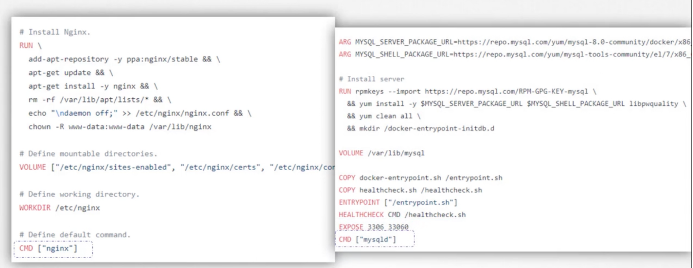

What we tried to do earlier was to run a container with a plain Ubuntu Operating System. Let us look at the docker file for this image and you will see that it uses bash as the default command. Now bash is not really a process like a web server or database server. It is a shell that listens for inputs from a terminal if it cannot find a terminal it exits. 

When we ran the Ubuntu container earlier Docker created a container from the Ubuntu image and launched the bash program, by default Docker does not attach a terminal to a container when it is run. And so the bash program does not find the terminal and so it exits since the process that was started when the container was created finished and the container exits as well.

**So how do you specify a different command to start the container?**

One option is to append a command to the docker run command and that way it overrides the default command specified within the image.

```bash
$ docker run ubuntu sleep 5
```

In this case we run the `docker run ubuntu` command with the “sleep 5” command as the added option.

This way when the container starts it runs the sleep program, waits for 5 seconds and then exits.

But how do you make that change permanent?


Say you want the image to always run the sleep command when it starts. You would then create your own image from the base Ubuntu image and specify a new command. There are different ways of specifying the command, either the command simply as is in a shell form or Or in a JSON array format like this.

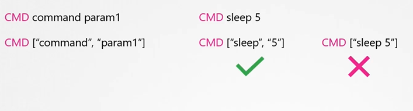

But remember, when you specify in a JSON array format, the first element in the array should be the  executable.

Do not specify the command and parameters together like in this case of the sleep program , the command and its parameters should be separate elements in the list. 

So I now build my new image using the docker build command, and name it as ubuntu-sleeper.

I could now simply run the docker Ubuntu sleeper command and get the same results. It always sleeps for five seconds and exits. `$ docker build -t ubuntu-sleeper .`

```bash
$ docker run ubuntu-sleeper 
```

*But what if I wish to change the number of seconds it sleeps currently. It is hard coded to five seconds as we learned before.* 

One option is to run the docker run command with the new command appended to it. 

```bash
$ docker run ubuntu-sleeper sleep 10 
```

In this case sleep 10 and so the command that will be run at startup will be sleep 10 but it doesn't look very good.

The name of the image Ubuntu sleeper in itself implies that the container will sleep. So we shouldn't have to specify the sleep command again. Instead we would like it to be something like this.

```text
$ Docker run Ubuntu sleeper 10
```

We only want to pass in the number of seconds the containers should sleep and sleep command should be invoked automatically and that is where the entry point instruction comes into play.

The **entry point instruction** is like the command instruction as in you can specify the program that will be run when the container starts and whatever you specify on the command line. In this case 10 will get appended to the entry point so the command that will be run when the container starts is sleep 10.

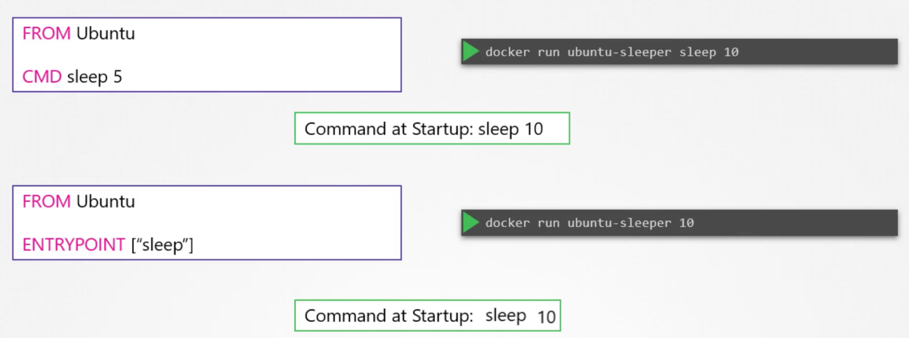

So that's the difference between the two. In case of the CMD instruction the command line parameters passed will get replaced entirely, whereas in case of entry point the command line parameters will get appended. 

Now, in the second case, what if I run the ubuntu-sleeper without appending the number of seconds,  then the command at startup will just sleep and you get the error that the operand is missing.

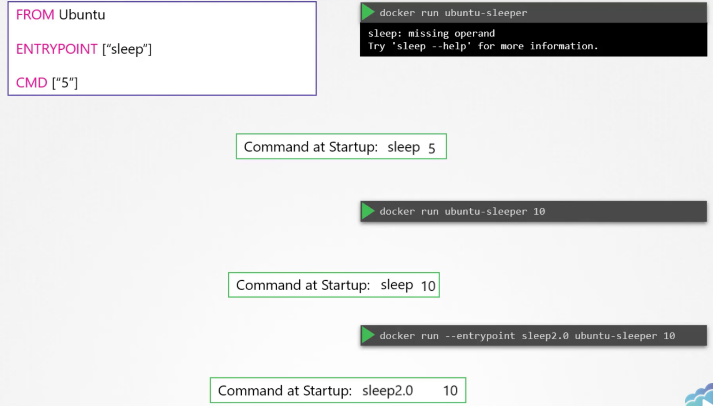

So how do you configure a default value for the command. If one was not specified in the command line that's where you would use both entry point as well as the command instruction. 

In this case the command instruction will be appended to the entry point instruction so at startup the

command would be sleep 5 if you didn't specify any parameters in the command line. if you did then that will override the command instruction and remember for this to happen you should always specify the entry point and command instructions in a JSON format. 

Finally, what if you really really want to modify the entrypoint during runtime say from sleep to an imaginary sleep 2.0 command.

Well in that case you can override it by using the entry point option in the docker run command.

The final command at startup would then be sleep 2.0 10.`docker run --entrypoint sleep2.0 ubuntu-sleeper 10`

### Commands and Arguments in Kubernetes

Command and Arguments in a Kubernetes POD. In the previous lecture we created a simple Docker image that sleeps for a given number of seconds. We named it **ubuntu-sleeper** and we ran it using the docker command 

```bash
$ docker run --name ubuntu-sleeper ubuntu-sleeper
```

 By default It sleeps for five seconds but you can override it by passing a command line argument. 

```bash
$ docker run --name ubuntu-sleeper ubuntu-sleeper 10 
```

We will now create a pod using this image. We start with a blank pod definition template, input the name of the pod and specify the image name.  When the pod is created, it creates a container from the specified image, and the container sleeps for five seconds before exiting. Now if you need the container to sleep for 10 seconds as in the second command how do you specify the additional argument in the pod definition file ? 

Anything that is appended to the docker run command will go into the “args” property of the pod definition file in the form of an array like this. 

```yaml
apiVersion: v1
kind: Pod
metadata:
  name: ubuntu-sleeper-pod
spec:
 containers:
 - name: ubuntu-sleeper
   image: ubuntu-sleeper
   command: ["sleep2.0"]
   args: ["10"]
```

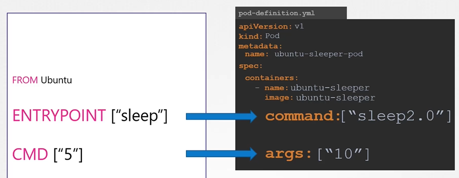

```bash
$ kubectl create -f pod-definition.yaml 
```

Let us try to relate that to the docker file we created earlier. The Dockerfile has an ENTRYPOINT as well as a CMD instruction specified. The ENTRYPOINT is the command that is run at startup, and the CMD is the default parameter passed to the command. With the args option in the pod definition file we **override** the CMD instruction in the Dockerfile. 

But what if you need to override the ENTRYPOINT? Say from sleep to a hypothetical sleep2.0 command? `$ docker run --name ubuntu-sleeper \`       `--entrypoint sleep2.0`        `ubuntu-sleeper 10` 

In the docker world we would run the docker run command with the entry point option set to the new command the corresponding entry in the pod definition file would be using a command field the command field corresponds to entry point instruction in the docker file 

So to summarize there are two fields that correspond to two instructions in the docker file. The command field overrides the entry point instruction and the args field overrides the command instruction in the docker file. **Remember** it is not the command field that overrides the CMD instruction in the docker file. 

### Configure Environment Variables in Applications

**How to set an environment variable in Kubernetes ?** Given a pod definition file which uses the same image as the dockor command we ran in the last lecture. To set an environment variable, use the ENV property. `$ docker run -e APP_COLOR=pink simple-webapp-color`

```yaml
apiVersion: v1
kind: Pod
metadata:
  name: simple-webapp-color
spec:
 containers:
 - name: simple-webapp-color
   image: simple-webapp-color
   ports:
   - containerPort: 8080
   env:
   - name: APP_COLOR
     value: pink
```

`env:` is an array so every item under the env property starts with a dash, indicating an item in the array.  Each item has a name and a value property. The name is the name of the environment variable made available with the container and the value is its value.

What we just saw was a direct way of specifying the environment variables using a plain key value pair format, however there are other ways of setting the environment variables such as using configMaps and secrets.

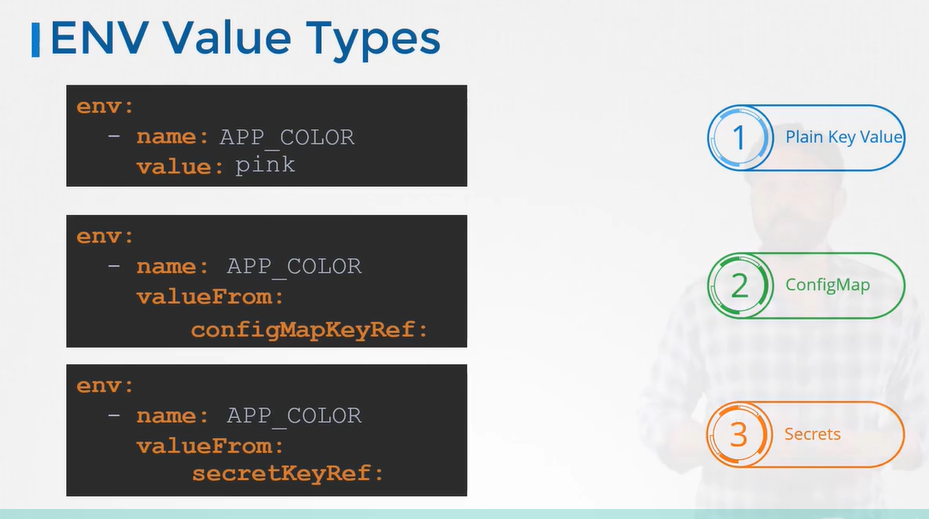

The difference in this case is that instead of specifying value, we say valueFrom And then a specification of configMap or secret.

### ConfigMaps in Applications

**How to work with configuration data in Kubernetes.?** In the previous lecture we saw how to define environment variables in the pod definition file. When you have a lot of pod definition files it will become difficult to manage the environment data stored within the various files.

We can take this information out of the pod definition file and manage it centrally using ConfigurationMaps. ConfigMaps are used to pass configuration data in the form of key value pairs in Kubernetes. When the pod is created, inject the config map into the pod. So the key value pairs that are available as environment variables for the application hosted inside the container in the pod. 

There are two phases involved in configuring ConfigMaps. First create the ConfigMaps and second Inject them into the POD. 

Just like any other Kubernetes object there are two ways of creating a configmap. 

 **The imperative way** - without using a ConfigMap definition file and  **The Declarative way** by using a Config map definition file. 

If you do not wish to create a configmap definition, you could simply use the `kubectl create configmap` command and specify the required arguments.

Let's take a look at that first with this method. You can directly specify the key value pairs in the command line. To create a configMap of the given values, run the `kubectl create configmap` command. The command is followed by the config name and the option `-–from-literal`. The from literal option is used to specify the key value pairs in the command itself. 

In this example, we are creating a configmap by the name app-config, with a key value pair `APP_COLOR=blue.` If you wish to add additional key value pairs simply specify the `--from-literal` options multiple times.

```bash
$ kubectl create configmap app-config --from-literal=APP_COLOR=blue --from-literal=APP_MODE=prod
```

However this will get complicated when you have too many configuration items. Another way to input configuration data is through a file. Use the `--from-file` option and specify a path to the file that contains the required data. The data from this file is read and stored under the name of the file. 

```bash
$ kubectl create configmap app-config --from-file=app_config.properties #Another way
```

Let us now look at the declarative approach. For this we create a definition file just like how we did for the pod. The file has apiVersion, kind, metadata and instead of spec, here we have “data”. 

```yaml
apiVersion: v1
kind: ConfigMap
metadata:
 name: app-config
data:
 APP_COLOR: blue
 APP_MODE: prod
```

The apiVersion is v1, kind is ConfigMap. Under metadata specify the name of the configmap. 

We will call it app-config. Under data add the configuration data in a key-value format. Run the `kubectl create` command and specify the configuration file name. So that creates the app-config ConfigMap with the values we specified.`$ kubectl create -f config-map.yaml`

You can create as many configmaps as you need in the same way for various different purposes. 

```bash
$ kubectl get configmaps (or)
$ kubectl get cm$ kubectl describe configmaps
```

Here lets say I have one for my application, another for mysql and yet another one for redis. So it is important to name the configmaps appropriately as you will be using these names later while associating it with PODs. To view the configmaps, run the `kubectl get configmaps` command. This lists  the newly created configmap named app-config.  The `describe configmaps` command List the configuration data as well under the data section.  Now that we have the configmap created let us proceed with step 2 configuring it with a pod. Here I have a simple pod definition file that runs a simple web application, to inject an environment variable and add a new property to the container called envFrom. The `envFrom` property is a list, so we can pass as many environment variables as required. 

```yaml
apiVersion: v1
kind: Pod
metadata:
  name: simple-webapp-color
spec:
 containers:
 - name: simple-webapp-color
   image: simple-webapp-color
   ports:
   - containerPort: 8080
   envFrom:
   - configMapRef:
       name: app-config

apiVersion: v1
kind: ConfigMap
metadata:
  name: app-config
data:
  APP_COLOR: blue
  APP_MODE: prod

$ kubectl create -f pod-definition.yaml
```

Each item in the list corresponds to a configMap item. Specify the name of the configmap we created earlier. This is how we inject a specific configmap from the ones we created before. 

Creating the pod definition file now creates a web application with a blue background. What we just saw was using configMaps to inject environment variables. There are other ways to inject configuration data into pods; you can inject it as a single environment variable or you can inject the whole data as files in a volume. 

We will look at some of these options in the coding exercises that accompany this lecture. 

```bash
$ kubectl create configmap webapp-config-map --from-literal=APP_COLOR=darkblue
```

### SECRETS

Here we have a simple python web application that connects to a mysql database. On success the application displays a successful message.

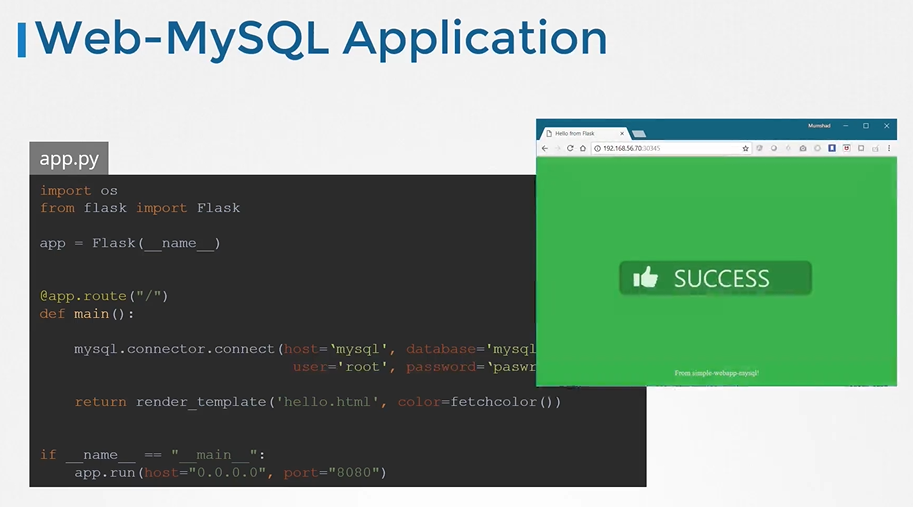

If you look closely into the code you will see the hostname username and password hardcoded. This is of course not a good idea. As we learned in the previous lecture, one option would be to move these values into a configMap. The configMap stores configuration data in plain text format, So while it would be okay to move the hostname and username into a configMap it is definitely not the right place to store a password. 

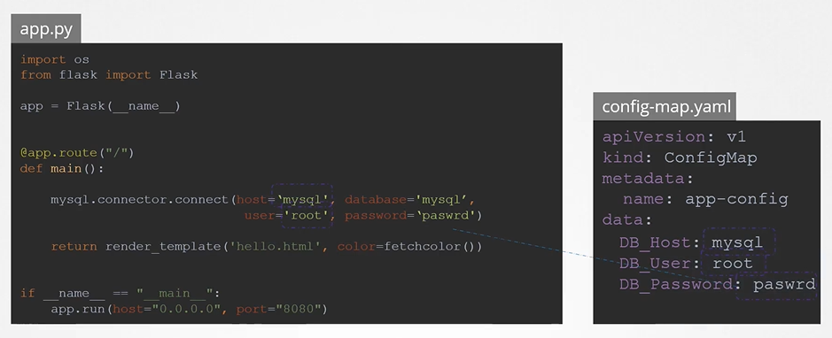

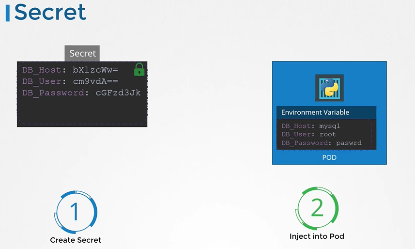

This is where secrets come in, secrets are used to store sensitive information like passwords or keys. They're similar to configMap except that they're stored in an encoded or hashed format. As with config maps. There are two steps involved in working with secrets. First create the secret and second inject it into a pod.   

There are two ways of creating a secret. **The imperative way** - without using a Secret definition file and the **Declarative way** by using a Secret definition file  With the imperative method you can directly specify the key value pairs in the command line itself to create a secret of the given values, run the `kubectl create secret` `generic` command. 

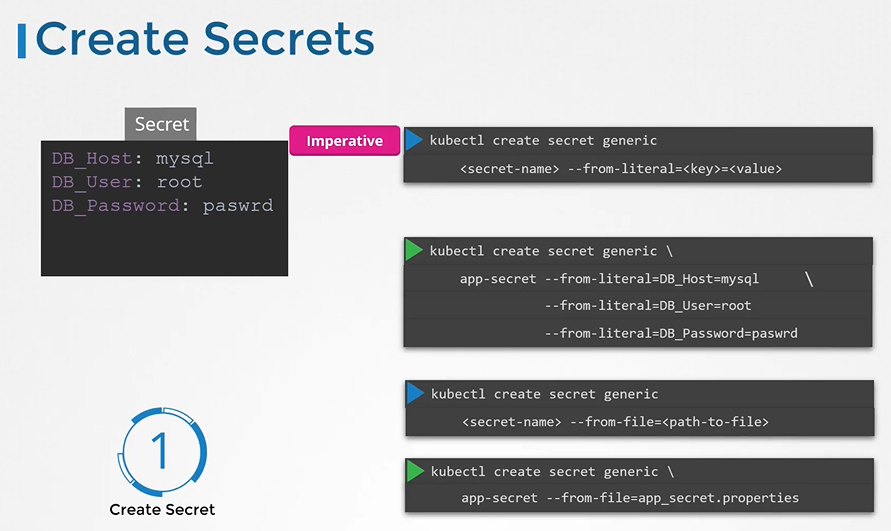

The command is followed by the secret name and the option `–from-literal`. The from literal option is used to specify the key value pairs in the command itself. `$ kubectl create secret generic app-secret --from-literal=DB_Host=mysql --from-literal=DB_User=root --from-literal=DB_Password=paswrd`

In this example, we are creating a secret by the name app-secret, with a key value pair `DB_Host=mysql`. If you wish to add additional key value pairs, simply specify the from literal options multiple times however this could get complicated when you have too many secrets to pass in.

Another way to input the secret data is through a file. Use the `–from-file` option to specify a path to the file that contains the required data.  The data from this file is read and stored under the name of the file. `$ kubectl create secret generic app-secret --from-file=app_secret.properties`

**Let us now look at the declarative approach.**

For this we create a definition file, just like how we did for the ConfigMap. 

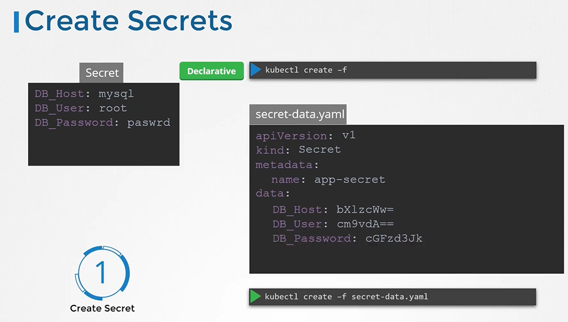

The file has apiVersion, kind, metadata and data. The apiVersion is v1, kind is Secret. Under metadata specify the name of the secret. We will call it app-secret. Under data add the secret data in a key-value format. However one thing we discussed about secrets was that they are used to store sensitive data and are stored in an encoded format. Here we have specified the data in plain text which is not very safe. So while creating a secret with a declarative approach you must specify the secret values in a hashed format. So you must specify the data in an encoded form like this. But how do you convert the data from plain text to an encoded format on a linux host from the command. `echo –n` followed by the text you are trying to convert, which is mysql in this case and pipe  that to the base64 utility. `Generate a hash value of the password and pass it to secret-data.yaml definition value as a value to DB_Password variable.``$ echo -n "mysql" | base64``$ echo -n "root" | base64``$ echo -n "paswrd"| base64`

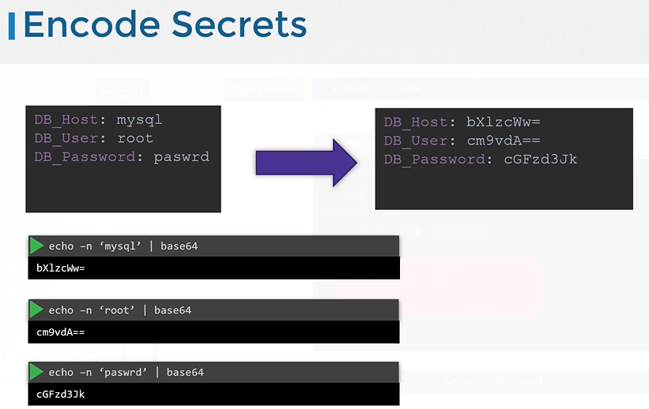

Create a secret definition file and run kubectl create to deploy it

```yaml
apiVersion: v1
kind: Secret
metadata:
 name: app-secret
data:
  DB_Host: bX1zcWw=
  DB_User: cm9vdA==
  DB_Password: cGFzd3Jk

$ kubectl create -f secret-data.yaml
```

To view secrets run the `kubectl get secrets` command. This lists the newly created secret along with another secret previously created by kubernetes for its internal purposes to view more information on the newly created secret.  run the `kubectl describe secret` command.This shows the attributes in the secret but hides the value themselves to view the values as well. run the kubectl get secret command with the output displayed in a YAML format using the `–o` option.

```bash
To view secrets $ kubectl get secrets
To describe secret $ kubectl describe secret
To view the values of the secret $ kubectl get secret app-secret -o yaml
```

**Now how do you decode these hashed values?** 

Use the same base64 Command used earlier to encode it but this time add a `--decode` option to it.`$ echo -n "bX1zcWw=" | base64 --decode`

```text
$ echo -n "cm9vdA==" | base64 --decode
$ echo -n "cGFzd3Jk" | base64 --decode
```

Now that we have a secret created let us proceed with step 2 configuring it with a pod. 

Here I have a simple pod definition file that runs my application.

To inject an environment variable, add a new property to the container called **envFrom**. The envFrom property is a list so we can pass as many environment variables as required each item in the list corresponds to a secret item.`apiVersion: v1`

```yaml
kind: Secret
metadata:
 name: app-secret
data:
  DB_Host: bX1zcWw=
  DB_User: cm9vdA==
  DB_Password: cGFzd3Jk

apiVersion: v1
 kind: Pod
 metadata:
   name: simple-webapp-color
 spec:
  containers:
  - name: simple-webapp-color
    image: simple-webapp-color
    ports:
    - containerPort: 8080
    envFrom:
    - secretRef:
        name: app-secret

$ kubectl create -f pod-definition.yaml
```

Specify the name of the secret we created earlier. Creating the pod definition file now makes the data in the secret available as environment variables for the application. What we just saw was injecting secrets as environment variables into the PODs. There are other ways to inject **secret** into PODs. You can inject as single environment variables or inject the whole secret as files in a volume if you were to mount the secret as a volume in the pod. Each attribute in the secret is created as a file with the value of the secret as its content.  In this case since we have three attributes in our secret, three files are created and if we look at the contents of the DB password file we see the password in it. **there are other better ways of handling sensitive data like passwords in Kubernetes, such as using tools like Helm Secrets,** [HashiCorp Vault](https://www.vaultproject.io/)**. +**

#### A note on Secrets

**Remember that secrets encode data in base64 format. Anyone with the base64 encoded secret can easily decode it. As such the secrets can be considered not very safe.**

**The concept of safety of the Secrets is a bit confusing in Kubernetes. The** [kubernetes documentation](https://kubernetes.io/docs/concepts/configuration/secret) **page and a lot of blogs out there refer to secrets as a “safer option” to store sensitive data. They are safer than storing in plain text as they reduce the risk of accidentally exposing passwords and other sensitive data. In my opinion it’s not the secret itself that is safe, it is the practices around it.**

**Secrets are not encrypted, so it is not safer in that sense. However, some best practices around using secrets make it safer. As in best practices like:**

- *Not checking-in secret object definition files to source code repositories.**

- [Enabling Encryption at Rest](https://kubernetes.io/docs/tasks/administer-cluster/encrypt-data/) **for Secrets so they are stored encrypted in ETCD.**

**Also the way kubernetes handles secrets. Such as:**

- *A secret is only sent to a node if a pod on that node requires it.**

- *Kubelet stores the secret into a tmpfs so that the secret is not written to disk storage.**

- *Once the Pod that depends on the secret is deleted, kubelet will delete its local copy of the secret data as well.**

**Read about the** [protections](https://kubernetes.io/docs/concepts/configuration/secret/#protections) **and** [risks](https://kubernetes.io/docs/concepts/configuration/secret/#risks) **of using secrets** [here](https://kubernetes.io/docs/concepts/configuration/secret/#risks)

**Having said that, there are other better ways of handling sensitive data like passwords in Kubernetes, such as using tools like Helm Secrets,** [HashiCorp Vault](https://www.vaultproject.io/)**. I hope to make a lecture on these in the future.**

### Multi Container Pods

The idea of decoupling a large monolithic application into sub-components known as microservices enables us to develop and deploy a set of independent small and reusable code. This architecture can then help us scale up and down as well as modify each service as required as opposed to modifying the entire applicationHowever at times you may need two services to work together such as a web server and a logging service. You need one agent instance per web server instance paired together. 

You don't want to march and bloat the code of the two services as each of them target different functionalities and you'd still like them to be developed and deployed separately, you only need the two functionality to work together. 

You need one agent per web server instance paired together that can scale up and down together, and that is why you have multi-container pods that share the same lifecycle which means they are created together and destroyed together they share the same network space which means they can refer to each other as local host and they have access to the same storage volumes. 

This way you do not have to establish volume sharing or services between the pods, to enable communication between them. To create a multi container pod add the new container information to the pod definition file. Remember the container section under the spec section in a pod definition file is an array and the reason it is an array is to allow multiple containers in a single pod. 

In this case we add a new container named log agent to our existing pod.

```yaml
apiVersion: v1
kind: Pod
metadata:
  name: simple-webapp
  labels:
    name: simple-webapp
spec:
  containers:
  - name: simple-webapp
    image: simple-webapp
    ports:
    - ContainerPort: 8080
  - name: log-agent
    image: log-agent 
```

There are 3 common patterns, when it comes to designing multi-container PODs. The first and what we just saw with the logging service example is known as a side car pattern. The others are the adapter and the ambassador pattern.

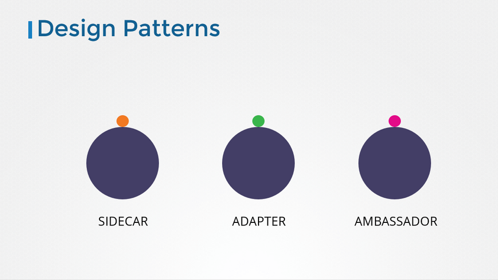

But these fall under the CKAD curriculum and are not required for the CKA exam. So we will be discuss these in more detail in the CKAD course. 

### Init Containers

In a multi-container pod, each container is expected to run a process that stays alive as long as the POD’s lifecycle. For example in the multi-container pod that we talked about earlier that has a web application and logging agent, both the containers are expected to stay alive at all times. The process running in the log agent container is expected to stay alive as long as the web application is running. If any of them fails, the POD restarts. 

But at times you may want to run a process that runs to completion in a container. For example a process that pulls a code or binary from a repository that will be used by the main web application. That is a task that will be run only one time when the pod is first created. Or a process that waits for an external service or database to be up before the actual application starts. That’s where **initContainers** comes in.An **initContainer** is configured in a pod like all other containers, except that it is specified inside a initContainers section, like this:

```yaml
apiVersion: v1
kind: Pod
metadata:
  name: myapp-pod
  labels:
    app: myapp
spec:
  containers:
  - name: myapp-container
    image: busybox:1.28
    command: ['sh', '-c', 'echo The app is running! && sleep 3600']
  initContainers:
  - name: init-myservice
    image: busybox
    command: ['sh', '-c', 'git clone <some-repository-that-will-be-used-by-application> ;']
```

When a POD is first created the initContainer is run, and the process in the initContainer must run to a completion before the real container hosting the application starts.You can configure multiple such initContainers as well, like how we did for multi-pod containers. In that case each init container is run **one at a time in sequential order**.

If any of the initContainers fail to complete, Kubernetes restarts the Pod repeatedly until the Init Container succeeds.

```yaml
apiVersion: v1
kind: Pod
metadata:
  name: myapp-pod
  labels:
    app: myapp
spec:
  containers:
  - name: myapp-container
    image: busybox:1.28
    command: ['sh', '-c', 'echo The app is running! && sleep 3600']
  initContainers:
  - name: init-myservice
    image: busybox:1.28
    command: ['sh', '-c', 'until nslookup myservice; do echo waiting for myservice; sleep 2; done;']
  - name: init-mydb
    image: busybox:1.28
    command: ['sh', '-c', 'until nslookup mydb; do echo waiting for mydb; sleep 2; done;']
```

### Self Healing Applications & Container Probes

Kubernetes supports self-healing applications through ReplicaSets, Deployments, and native Container Probes executed by the node's `kubelet`.

#### Container Health Probes (Liveness, Readiness, Startup)

Modern Kubernetes supports three native probe mechanisms to evaluate container status:

1. **`startupProbe`**:
   - Protects slow-starting applications (e.g., legacy enterprise Java/JVM apps) from premature eviction.
   - Pauses all `livenessProbe` and `readinessProbe` executions until it succeeds.
   - If it fails `failureThreshold` times, the container is killed and restarted.

2. **`livenessProbe`**:
   - Detects when an application enters an unrecoverable deadlocked state or infinite loop.
   - If consecutive failures reach `failureThreshold`, kubelet terminates the container process and triggers a restart according to `restartPolicy`.

3. **`readinessProbe`**:
   - Determines whether the container is ready to accept user network traffic.
   - When a readiness probe fails, the Pod's `Ready` condition is set to `False`.
   - The endpoints controller immediately removes the Pod's IP from Service backends and `EndpointSlices`. **The container process is not killed**.

#### Probe Handlers

- **`httpGet`**: Performs an HTTP GET on a given path/port. Status codes 200–399 count as success.
- **`tcpSocket`**: Checks if a TCP 3-way handshake succeeds on the given port.
- **`exec`**: Runs a command inside the container namespace; exit code 0 indicates success.
- **`grpc`**: Evaluates response using standard gRPC health checking protocol.

#### Complete Production Probes Manifest

```yaml
apiVersion: v1
kind: Pod
metadata:
  name: resilient-service
  labels:
    app: api-server
spec:
  containers:
  - name: api
    image: nginx:alpine
    ports:
    - containerPort: 8080
    startupProbe:
      httpGet:
        path: /healthz
        port: 8080
      initialDelaySeconds: 10
      periodSeconds: 5
      failureThreshold: 20 # Allows up to 100s for initialization
    livenessProbe:
      httpGet:
        path: /healthz
        port: 8080
      periodSeconds: 10
      timeoutSeconds: 2
      failureThreshold: 3
    readinessProbe:
      httpGet:
        path: /ready
        port: 8080
      periodSeconds: 5
      successThreshold: 1
      failureThreshold: 2
```
