# 05. Cluster Maintenance

## Cluster Maintenance

### OS Upgrades

Scenarios where you might have to take down nodes as part of your cluster, say for maintenance purposes like upgrading a base software or applying patches like security patches etc on your cluster.

So you have a cluster with a few nodes and pods serving applications. **What happens when one of these nodes goes down ?** 

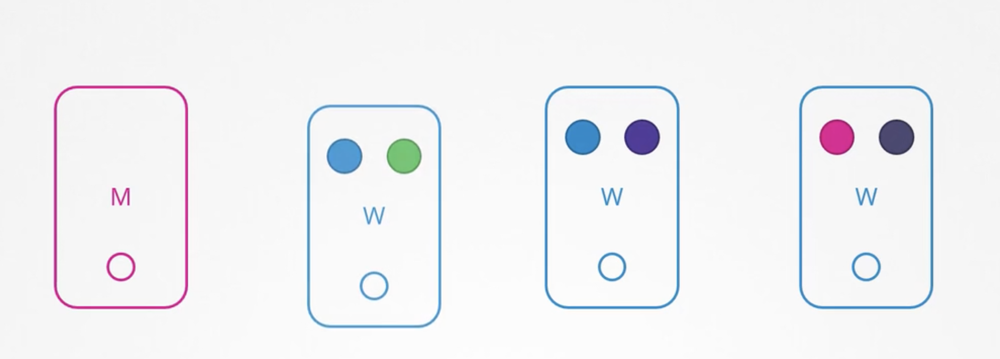

Of course the pods on them are not accessible. Now depending upon how you deployed those PODs your users may be impacted. For example, since you have multiple replicas of the blue pod, the users accessing the blue application are not impacted as they are being served through the other blue pod that's online.  However users accessing the green pod, are impacted as that was the only pod running the green application. **Now what does kubernetes do in this case? (HOW IT WORKS)**  

- If the node comes back online immediately, then the kubectl process starts and the pods come back online.

- However, if the node was down for more than 5 minutes, then the pods are terminated from that node.Well, kubernetes considers them as dead.

- If the PODs were part of a replicaset then they are recreated on other nodes.

- The time it waits for a pod to come back online is known as the **pod eviction timeout** and is set on the controller manager with a **default value of five minutes**.

```text
$ kube-controller-manager --pod-eviction-timeout=5m0s .. 
```

So whenever a node goes offline, the master node waits for up to 5 minutes before considering the node dead.When the node comes back on line after the pod eviction timeout it comes up blank without any pods scheduled on it. Since the blue pod was part of a replicaSet, it had a new pod created on another node. However since the green pod was not part of the ReplicaSet it's just gone. 

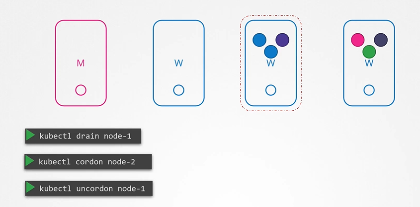

Thus if you have maintenance tasks to be performed on a node if you know that the workloads running on the Node have other replicas and if it's okay that they go down for a short period of time. And if you're sure the node will come back online within five minutes, you can make a quick upgrade and reboot. However you do not  know for sure if a node is going to be back online in five minutes. Well you cannot for sure say it is going to be back at all. So there is a safer way to do it.  You can purposefully drain the node of all the workloads so that the workloads are moved to other nodes in the cluster. 

Well technically they are not moved. When you drain the node the pods are gracefully terminated from the node that they're on and recreated on another. The node is also **cordoned** or marked as unschedulable. Meaning no pods can be scheduled on this node until you specifically remove the restriction. 

Now that the pods are safe on the other nodes, you can reboot the first node. When it comes back online it is still unschedulable. You then need to **uncordon** it, so that pods can be scheduled on it again. 

Now, remember the pods that were moved to the other nodes, don’t automatically fall back. If any of those pods were deleted or if new pods were created in the cluster, Then they would be created on this node.

Apart from drain and uncordon, there is also another command called cordon. Cordon simply marks a node unschedulable.Unlike drain it does not terminate or move the pods on an existing node. It simply makes sure that new pods are not scheduled on that node.

Practice. 

How many applications are hosted ? → check the number of deployments 

which nodes are the applications hosted on ? 

We need to take node01 out for maintenance. Empty the node of all applications and mark it unschedulable. ?

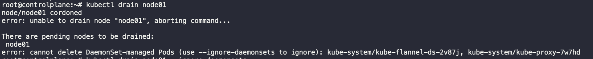

```bash
$ kubectl drain node01 --ignore-daemonsets
```

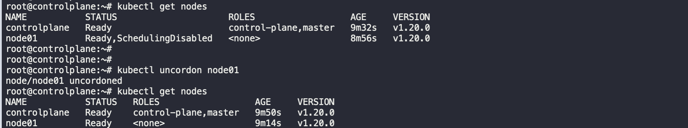

### Kubernetes Software versions.

Kubernetes releases and versions.

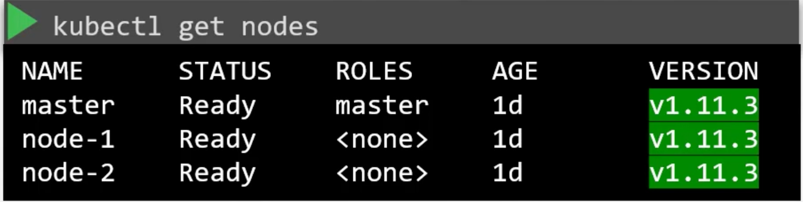

So what do we know about API versions in Kubernetes so far? We know that when we install a kubernetes cluster, we install a specific version of kubernetes. We can see that when we run the kubectl get nodes command. In this case its v1.11.3.​​

How does the kubernetes project manage software releases ? 

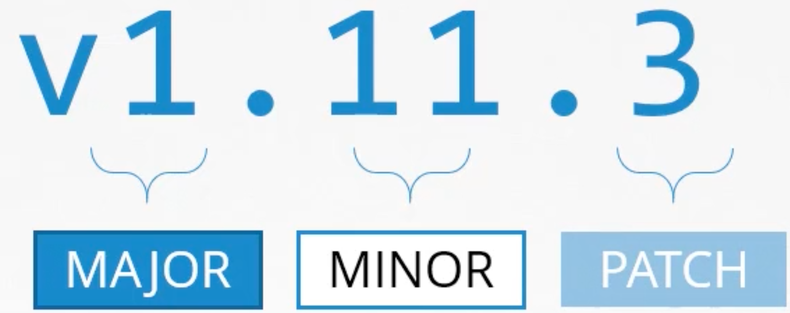

Let's take a closer look at that version number. The kubernetes release version consists of 3 parts. 

The first is the major version, followed by the minor version and then the Patch version. While minor versions are released every few months with new features and functionalities, patches are released more often with critical bug fixes. Just like many other popular applications out there, kubernetes follows a standard software release versioning procedure. Every few months it comes out with new features and functionalities through a minor release. 

The first major version 1.0 was released in July of 2015. As of this date the latest stable version is 1.13.0. Whatever we have seen here are stable releases of kubernetes. Apart from this you will also see Alpha and  beta releases all the bug fixes and improvements first go into an alpha release tagged alpha. In this release the features are disabled by default and maybe buggy. Then from there they make their way to beta release  where the code is well tested the new features are enabled by default. And finally they make their way to the main stable release.  You can find all the releases in the releases page of the Kubernetes Github repository.  

https://github.com/kubernetes/kubernetes/releases

Download the kubernetes.tar.gz file and extract it to find executables for all the kubernetes components. The downloaded package when extracted has all the control plane components in it. All of them of the same version.Remember that there are other components within the control plane that do not have the same version numbers. The ETCD cluster and CoreDNS servers have their own versions as they are separate projects. The release notes of each release provides information about the supported versions of externally dependent applications like ETCD and CoreDNS etc. 

[https://kubernetes.io/docs/concepts/overview/kubernetes-api/](https://kubernetes.io/docs/concepts/overview/kubernetes-api/)

Here is a link to kubernetes documentation if you want to learn more about this topic (You don’t need it for the exam though):

[https://github.com/kubernetes/community/blob/master/contributors/devel/sig-architecture/api-conventions.md](https://github.com/kubernetes/community/blob/master/contributors/devel/sig-architecture/api-conventions.md)[https://github.com/kubernetes/community/blob/master/contributors/devel/sig-architecture/api_changes.md](https://github.com/kubernetes/community/blob/master/contributors/devel/sig-architecture/api_changes.md)[https://blog.risingstack.com/the-history-of-kubernetes/](https://blog.risingstack.com/the-history-of-kubernetes/)https://kubernetes.io/releases/version-skew-policy/

### Cluster Upgrade Introduction

We will discuss the cluster upgrade process in Kubernetes.  We will keep dependency on external components like ETCD and coreDNS aside for now and focus on the core control plane components. 

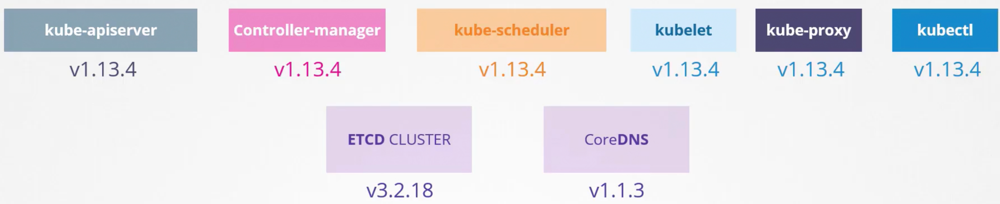

**Is it mandatory for all of these to have the same version?** No. The components can be at different released versions since the **KubeAPI** server is the primary component in the control plane, and that is the component that all other components talk to.None of the other components should ever be at a version higher than the KubeAPI server. The **controller-manage**r and **kube-scheduler** can be at one version lower.  So if KubeAPI server was at X, controller-managers and Kube-schedulers can be at X-1, and the Kubelet and kube-proxy components can be at two versions lower, X-2.

So if KubeAPI server was at 1.10  the controller manager and scheduler could be at 1.10 or 1.9, and the Kubelet and kube-proxy could be at 1.8 None of them could be  at a version higher than the KubeAPI server like 1.11. Now, this is not the case with kubectl, The kubectl utility could be at 1.11 A version higher than the API Server, 1.10 the same version as the API server, or at 1.9 version lower than the API server. Now, this permissible skew in versions allows us to carry out live upgrades. We can upgrade component by component if required. 

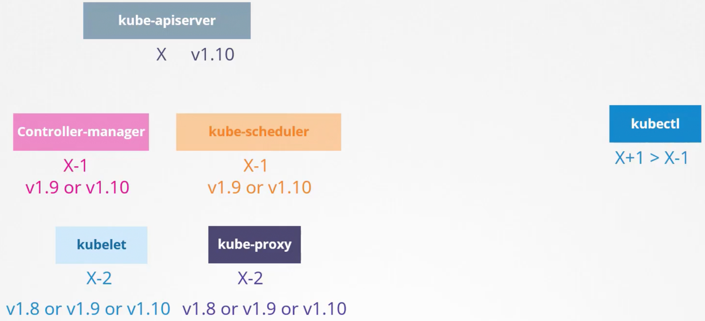

**So when should you upgrade?** Say you were at 1.10 and Kubernetes releases versions, 1.11 and 1.12, at any time, Kubernetes supports only up to the recent three minor versions. So with 1.12 being the latest release, Kubernetes supports versions 1.12, 1.11 and 1.10. So when 1.13 is released, only versions 1.13 1.12  or 1.11 are supported, before the release of version 1.13 would be a good time to upgrade your cluster to the next release. 

**So how do we upgrade? Do we upgrade directly from 1.10 to 1.13?** No. The recommended approach is to upgrade one minor version at a time. Version 1.10 to 1.11, then 1.11 to 1.12 and then 1.12 to 1.13. The upgrade process depends on how your cluster is set up, for example, if your cluster is a managed Kubernetes cluster deployed on cloud service providers like Google, for instance, Google Kubernetes Engine lets you upgrade your cluster easily with just a few clicks. If you have deployed  your cluster using tools like Kubeadm, then the tool can help you plan and upgrade the cluster. If you have deployed your cluster from scratch, then you manually upgrade the different components of the cluster yourself. In this lecture, we will look at the options by kubeadm. 

So you have a cluster with master and worker nodes running in production, hosting PODs and serving users. The nodes and components are at version 1.10. Upgrading a cluster involves two major steps.→ First, you upgrade your master nodes and then upgrade to worker nodes. 

While the master is being upgraded, the control plane components such as the API server, Scheduler and controller managers go down briefly, the master going down does not mean your worker nodes and  applications on the cluster are impacted, all workloads hosted on the worker nodes continue to serve users as normal since the master is down. 

All management functions are down, you cannot access the cluster using Kube Control or other Kubernetes API. You cannot deploy new applications or delete or modify existing ones. The controller managers don't function, either. If a POD was to fail, a new POD won't be automatically created. 

But as long as the nodes and the PODs are up, your applications should be up and users will not be impacted. Once the upgrade is complete and the cluster is back up, it should function normally. We now have the master and the master components at version 1.11 and the worker nodes at version 1.10, as we saw earlier. This is a supported configuration. It is now time to upgrade the worker nodes.  → There are different strategies available to upgrade the worker nodes. 

- One is to upgrade all of them at once. But then your PODs are down and users are no longer able to access the applications. Once the upgrade is complete, the nodes are back up. New PODs are scheduled and users can resume access. That's one strategy that requires downtime.

- The second strategy is to upgrade one node at a time. So going back to the state where we have our master upgraded and nodes waiting to be upgraded, we first upgrade the first node where the workloads move to the second and third node. And users are so from there.Once the first node is upgraded and back up with an update, the second node where the workloads move to the first and third nodes. And finally, the third node where the workloads are shared between the first two until we have all nodes upgraded to a newer version. We then followed the same procedure to upgrade the node from 1.11 to 1.12 and then version 1.13.

- A third strategy would be to add new nodes to the cluster. Nodes with newer software versions. This is especially convenient if you're on a cloud environment where you can easily provision new nodes and decommissioned old ones; nodes with the newer software version can be added to the cluster move the workload over to the new and then remove the old nodes.Until you finally have all new nodes with the new software version.

**Let us now see how it is done.**

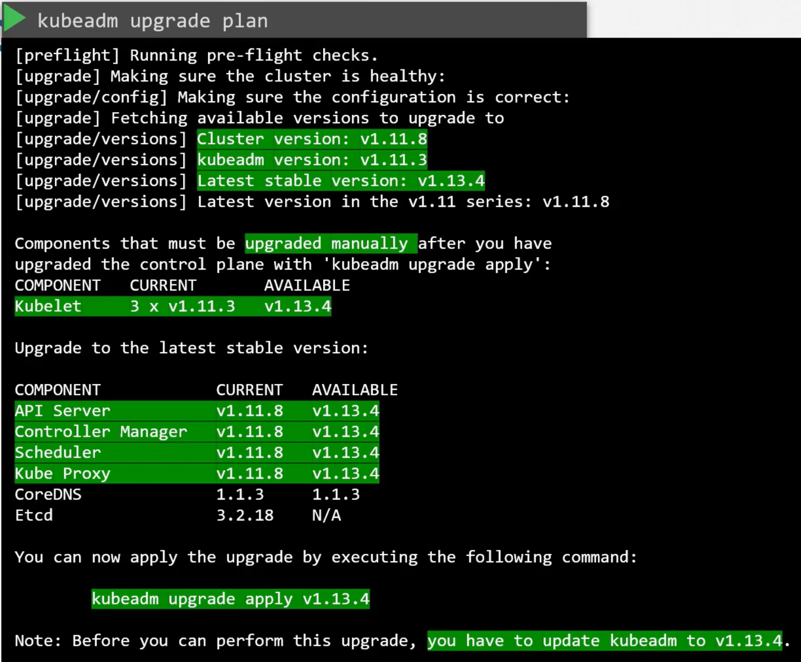

So we were to upgrade this cluster from 1.11 to 1.13. Kubadm has an upgrade command that helps in upgrading clusters with kubeadm run the `kubadm upgrade plan` command, and it will give you a lot of good information. 

- The current cluster version,

- the kubeadm tool version,

- the latest stable version of Kubernetes.

Then it lists all the control plane components and their versions and what version these can be upgraded to.It also tells you that after we upgrade the control plane components, you must manually upgrade the  Kubelet versions on each node. Remember kubeadm does not install or upgrade kubelets.  

Finally, it gives you the command to upgrade the cluster.  Also, note that you must upgrade the kubeadm tool itself before you can upgrade the cluster.

The kubeadm tool also follows the same software version as Kubernetes, so we're at 1.11 and we want to go to 1.13. But remember, we can only go one minor version at a time, so we first go to version 1.12. First upgrade the kubeadm tool itself to version 1.12, then upgrade the cluster using the command from the upgrade plan output kubeadm upgrade apply. `apt-get upgrade -y kubeadm=1.12.0-00``kubeadm upgrade apply v1.12.0` 

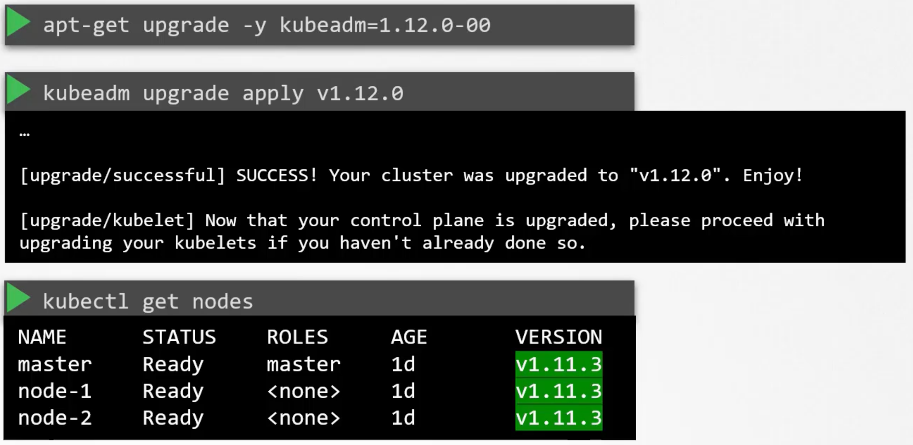

It pulls the necessary images and upgrades the cluster components. Once complete, your control plane components are now at 1.12.  If you run the `kubectl get nodes` command, you will still see the master node at 1.11. This is because in the output of this command, it is showing the versions of kubelets on each of these nodes registered with the API server and not the version of the API server itself. 

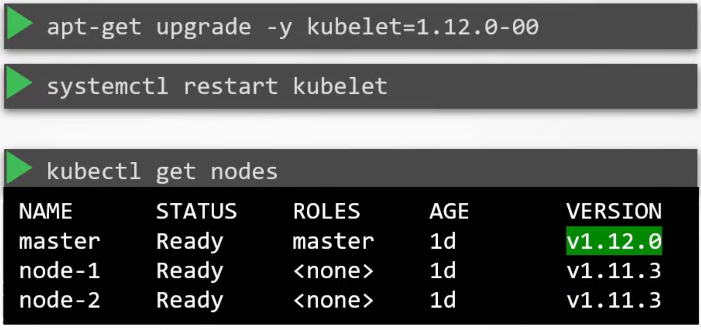

So the next step is to upgrade the Kubelets. Remember, depending on your setup You may or may not have kubelets running on your master node. In this case, the cluster deployed with kubeadm has kubelets on the master node, which are used to run the control plane components as PODs of the master nodes. When we set up a Kubernetes cluster from scratch later during this course, we did not install kubelet on the master node.  You will not see the master node in the output of this command in that case. So the next step is to upgrade kubelet on the master node. If you have kubelet on them, run the `apt-get  kubelet` command for this. Once the package is upgraded, restart the kubelet service. Running the kubectl get nodes command now shows that the master has been upgraded to 1.12, the worker nodes are still at 1.11 

So next, the worker nodes, let us start one at a time. We need to first move the workloads from the first worker node to the other nodes. The `kubectl drain` Command lets you safely terminate all the PODs from the node and reschedules them on the other nodes. It also **cordons** the node and marks it unschedulable that way, no new PODs are scheduled on it. Then upgrade the kubeadm and Kubelet packages on the worker nodes, as we did on the master node, then using the kubeadm tool upgrade command update the node configuration for the new kubelet version.Then restart the kubelet service. The node should now be up with the new software version. 

```bash
$ kubectl drain node-1$ apt-get upgrade -y kubeadm=1.12.0-00$ apt-get upgrade -y kubelet=1.12.0$ kubeadm upgrade node config --kubelet-version v1.12.0 $ systemctl restart kubelet 
```

However, when we drained the node, we actually marked it unschedulable. So we need to unmark  it by running the command `kubectl uncordon  node-1`. The node is now schedulable 

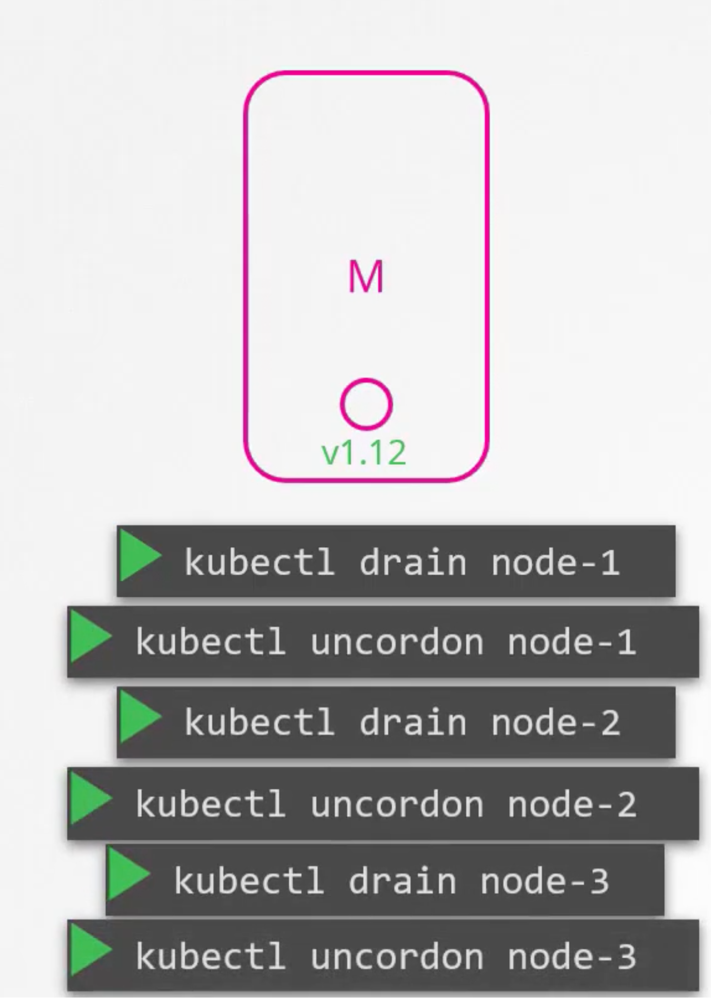

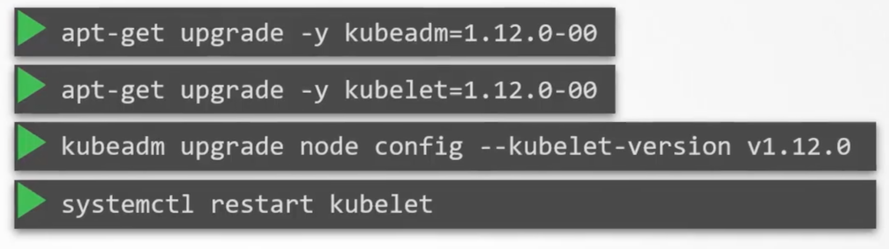

But remember that it is not necessary that the PODs come right back to this node. It is only marked as scheduled , but only when the PODs are deleted from other nodes or when new PODs are scheduled ,they really come back to this node. Well It will soon come when we take down the second node to perform the same steps to upgrade it. And finally, the third node. We now have all nodes upgraded.References

### Backup and Restore Methods

Let's start by looking at what you should consider backing up in a kubernetes cluster. So far in this course, we have deployed a number of different applications on our kubernetes cluster using deployments, PODs and service definition files. 

We know that the ETCD cluster is where all cluster related information is stored, and if your applications are configured with persistent storage, then that is another candidate for backups. With respect to resources that we created in the cluster. At times we use the imperative way of creating an object by executing a command such as well creating a namespace or a secret or config map or at times for exposing applications 

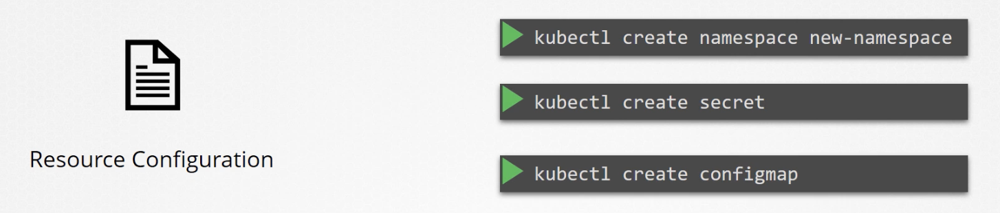

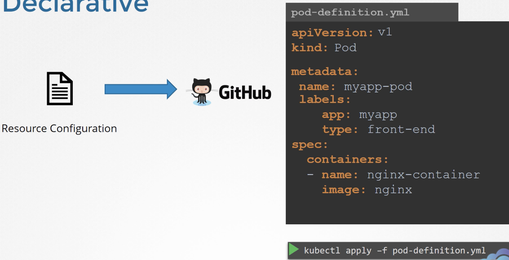

and at times, we used the declarative approach by first creating a definition file and then running the `kubectl apply` command on that file.  This is the preferred approach if you want to save your configuration, because now you have all the objects required for a single application in the form of object definition files in a single folder. This can easily be reused at a later time or shared with others.  Of course, you must have a copy of these files saved at all times. A good practice is to store these in source-code repositories. That way it can be maintained by a team. 

The source code repository should be configured with the right backup solutions with managed or public source code repositories like GitHub you don't have to worry about this. With that even when you lose your entire cluster, you can redeploy your application on the cluster by simply applying these configuration files on them. While the declarative approach is the preferred approach, it is not necessary that all of your team members stick to those standards. **What if someone created an object the imperative way without documenting that information anywhere?** So a better approach to backing up resource configuration is to query the kubeAPI server, query the Kubeapi server using the kubectl or by accessing the API server directly and save all resource configurations for all objects created on the cluster as a copy.  

For example, one of the commands that can be used in a backup script is to get all PODs and deployments and services in all namespace using the Kubectl utilities get all command and extract the output in a yamll format, then save that file.

```bash
$ kubectl get all --all-namespaces -o yaml > all-deploy-services.yaml (only for few resource groups)
```

And that's just for a few resource group, there are many other resource groups that must be considered.

Of course, you don't have to develop that solution yourself. There are tools like  ARK, now called VELERO by HabtIO, that can do this for you. It can help in taking backups of your kubernetes cluster using the kubernetes API.

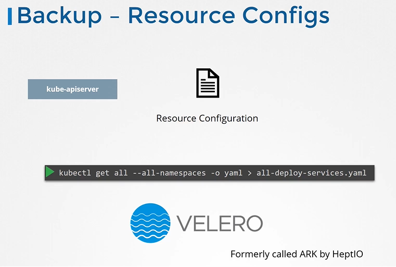

Let us now move on to ETCD. The ETCD cluster stores information about the state of our cluster, so information about the cluster itself, the nodes and every other resource created within the cluster are stored here.  So instead of backing up resources as before, you may choose to back up the ETCD server itself. 

As we have seen, the ETCD cluster is hosted on the master nodes while configuring ETCD we specified a location where all the data would be stored **“The data directory”** that is the directory that can be configured to be backed up by your backup tool. 

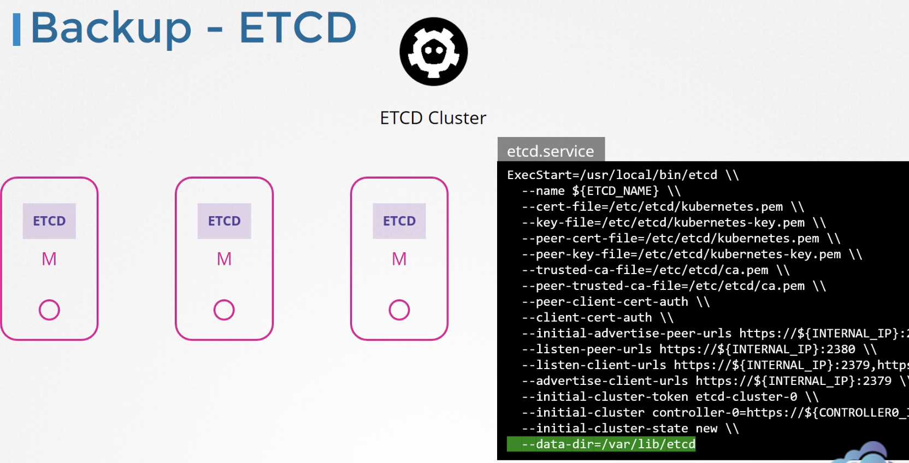

ETCD also comes with a built in snapshot solution, you can take a snapshot of the ETCD database by using the ETCD control utilities ,snapshot, save command, give the snapshot a name, snapshot.db

```bash
$ ETCDCTL_API=3 etcdctl snapshot save snapshot.db
```

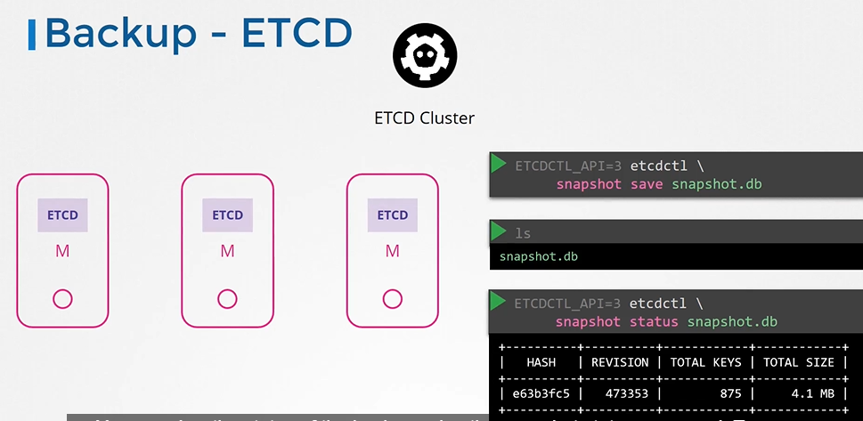

A snapshot file is created by the name in the current directory. If you want it to be created in another location, specify the full path.

You can view the status of the backup using the Snapshot Status Command. 

```bash
$  ETCDCTL_API=3 etcdctl snapshot status snapshot.db
```

To restore the cluster from this back up at a later point in time, First stop the kubeAPI server service, as the restore process will require you to restart the ETCD cluster and the kubeAPI server depends on it.

```text
$ service kube-apiserver stop
```

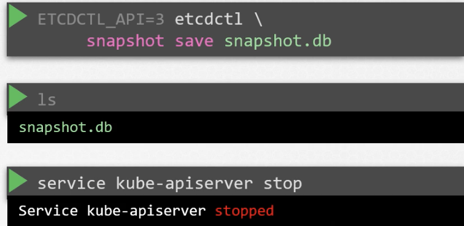

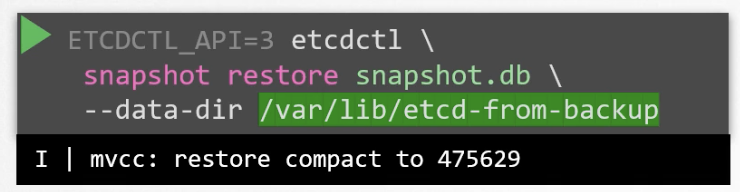

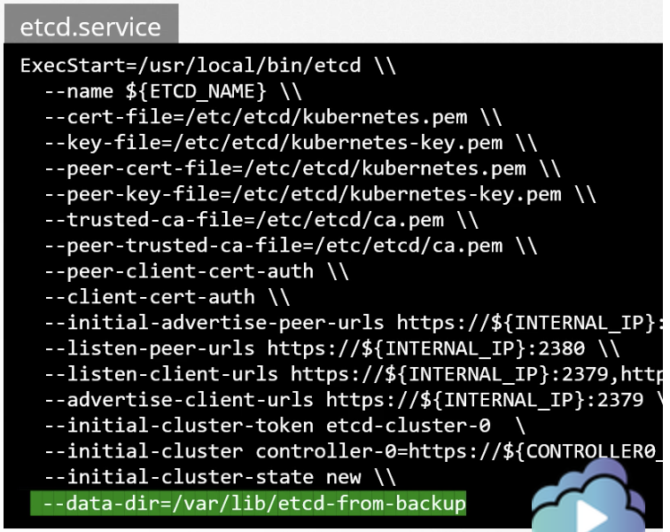

Then run the `etcdctl snapshot restore` command with the path set to the path of the backup file,which is the snapshot.db  file. When ETCD restores from a backup, it initializes a new cluster configuration and  configures the members of ETCD as new members to a new cluster. This is to prevent a new member from accidentally joining an existing cluster. On running this command a “new data directory” is created. In this example at location `/var/lib/etcd-from-backup.`We then configure the etcd configuration file to use the new data directory.Then reload the service daemon and restart active service.

```bash
$ systemctl daemon-reload$ service etcd restart Finally, start the kubeAPI server service, your cluster should now be back in the original state.$ service kube-apiserver start 
```

A quick note before I let you go, with all the ETCD commands, remember to specify the cert files for authentication, 

- Specify the end point to the ETCD cluster and

- The CA cert,

- The ETCD server certificate and

- The key.

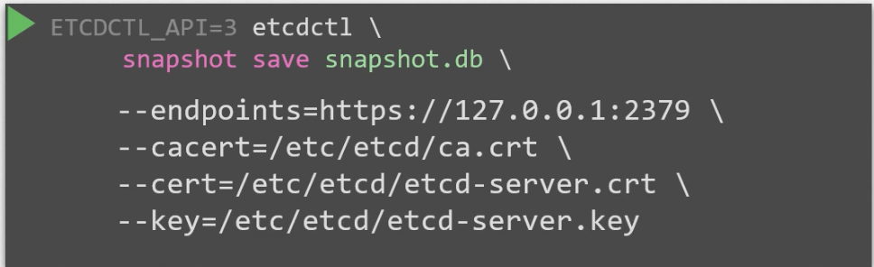

So we have seen two options, a backup using a ETCD and a backup by querying the kubeAPI  server Now, both of these have their pros and cons. Well, if you're using a managed environment, then at times you may not even have access to the ETCD cluster. In that case, backup by acquiring the kubeAPI server is probably the better way.

#### Practice Test Solution

**To check etcd version** Look at the ETCD Logs using the command `kubectl logs etcd-controlplane -n kube-system` or check the image used by the ETCD pod: `kubectl describe pod etcd-controlplane -n kube-system`

**At what address can you reach the ETCD cluster from the controlplane node? Check the ETCD Service configuration in the ETCD POD**`kubectl describe pod etcd-controlplane -n kube-system` `--listen-client-urls=https://127.0.0.1:2379,https://10.8.30.3:2379`

**Where is etcd server certificate file located ?**

**Where is the ETCD CA Certificate file located? Note this path down as you will need to use it later.**

```bash
root@controlplane:~# ETCDCTL_API=3 etcdctl --endpoints=https://[127.0.0.1]:2379 \
--cacert=/etc/kubernetes/pki/etcd/ca.crt \
--cert=/etc/kubernetes/pki/etcd/server.crt \
--key=/etc/kubernetes/pki/etcd/server.key \
snapshot save /opt/snapshot-pre-boot.db
```

**First Restore the snapshot:**

**root@controlplane:~#** `ETCDCTL_API=3 etcdctl  --data-dir /var/lib/etcd-from-backup \``snapshot restore /opt/snapshot-pre-boot.db` 

```text
2022-03-25 09:19:27.175043 I | mvcc: restore compact to 25522022-03-25 09:19:27.266709 I | etcdserver/membership: added member 8e9e05c52164694d [http://localhost:2380] to cluster cdf818194e3a8c32
root@controlplane:~# 
```

**Note: In this case, we are restoring the snapshot to a different directory but in the same server where we took the backup (the controlplane node) As a result, the only required option for the restore command is the --data-dir.** **Next, update the /etc/kubernetes/manifests/etcd.yaml:**

**We have now restored the etcd snapshot to a new path on the controlplane - /var/lib/etcd-from-backup, so, the only change to be made in the YAML file, is to change the hostPath for the volume called etcd-data from old directory (/var/lib/etcd) to the new directory (/var/lib/etcd-from-backup).**

```yaml
 volumes:
  - hostPath:
      path: /var/lib/etcd-from-backup
      type: DirectoryOrCreate
    name: etcd-data
```

**With this change, /var/lib/etcd on the container points to /var/lib/etcd-from-backup on the controlplane (which is what we want)**

**When this file is updated, the ETCD pod is automatically re-created as this is a static pod placed under the /etc/kubernetes/manifests directory.**

**Note 1: As the ETCD pod has changed it will automatically restart, and also kube-controller-manager and kube-scheduler. Wait 1-2 to mins for this pods to restart. You can run a watch "docker ps | grep etcd" command to see when the ETCD pod is restarted.**

**Note 2: If the etcd pod is not getting Ready 1/1, then restart it by kubectl delete pod -n kube-system etcd-controlplane and wait 1 minute.**

**Note 3: This is the simplest way to make sure that ETCD uses the restored data after the ETCD pod is recreated. You don't have to change anything else.**

**If you do change --data-dir to /var/lib/etcd-from-backup in the YAML file, make sure that the volumeMounts for etcd-data is updated as well, with the mountPath pointing to /var/lib/etcd-from-backup (THIS COMPLETE STEP IS OPTIONAL AND NEED NOT BE DONE FOR COMPLETING THE RESTORE)**

### Working with ETCDCTLetcdctl is a command line client for etcd.

In all our Kubernetes Hands-on labs, the ETCD key-value database is deployed as a static pod on the master. The version used is v3. To make use of etcdctl for tasks such as back up and restore, make sure that you set the ETCDCTL_API to 3.  

You can do this by exporting the variable ETCDCTL_API prior to using the etcdctl client. This can be done as follows:

export ETCDCTL_API=3

On the Master Node:

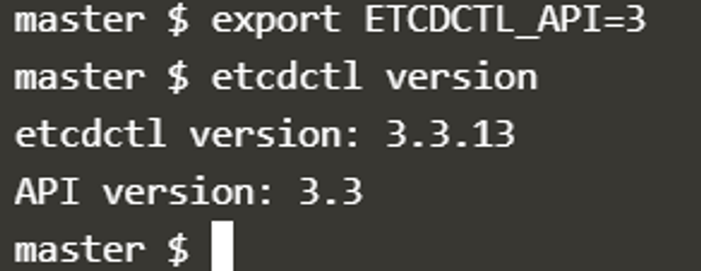

To see all the options for a specific sub-command, make use of the -h or –help flag.

 For example, if you want to take a snapshot of etcd, use:

```bash
etcdctl snapshot save -h and keep a note of the mandatory global options.
```

Since our ETCD database is TLS-Enabled, the following options are mandatory:

–cacert            verify certificates of TLS-enabled secure servers using this CA bundle

–cert                identify secure client using this TLS certificate file

–endpoints=[127.0.0.1:2379] This is the default as ETCD is running on master node and exposed on localhost 2379.

–key              identify secure client using this TLS key file

For a detailed explanation on how to make use of the etcdctl command line tool and work with the -h flags, check out the solution video for the Backup and Restore Lab.

---

### Step-by-Step Kubeadm Cluster Upgrade Playbook

In CKA exams, upgrading a cluster across minor versions (e.g., v1.30.x to v1.31.x) must be done step-by-step: first the control plane, then worker nodes one by one. You cannot skip minor versions (e.g. 1.29 -> 1.31 is not supported directly; upgrade 1.29 -> 1.30 -> 1.31).

#### Phase 1: Upgrade the Control Plane Node

1. **Drain the Control Plane node:**
   ```bash
   kubectl drain controlplane --ignore-daemonsets
   ```

2. **Upgrade `kubeadm` tool:**
   ```bash
   sudo apt-mark unhold kubeadm
   sudo apt-get update && sudo apt-get install -y kubeadm=1.31.0-1.1
   sudo apt-mark hold kubeadm
   
   # Verify version
   kubeadm version
   ```

3. **Plan and apply the upgrade:**
   ```bash
   # Check upgrade plan
   sudo kubeadm upgrade plan
   
   # Apply the upgrade (downloads new control plane static pod images)
   sudo kubeadm upgrade apply v1.31.0 -y
   ```

4. **Upgrade `kubelet` and `kubectl` on Control Plane:**
   ```bash
   sudo apt-mark unhold kubelet kubectl
   sudo apt-get install -y kubelet=1.31.0-1.1 kubectl=1.31.0-1.1
   sudo apt-mark hold kubelet kubectl
   
   # Reload systemd and restart kubelet
   sudo systemctl daemon-reload
   sudo systemctl restart kubelet
   ```

5. **Uncordon the Control Plane node:**
   ```bash
   kubectl uncordon controlplane
   ```

---

#### Phase 2: Upgrade Worker Nodes (One by One)

1. **Drain the Worker node from the Control Plane:**
   ```bash
   kubectl drain node01 --ignore-daemonsets --delete-emptydir-data --force
   ```

2. **SSH into the Worker node:**
   ```bash
   ssh node01
   ```

3. **Upgrade `kubeadm` on Worker:**
   ```bash
   sudo apt-mark unhold kubeadm
   sudo apt-get update && sudo apt-get install -y kubeadm=1.31.0-1.1
   sudo apt-mark hold kubeadm
   ```

4. **Upgrade Worker node configuration:**
   ```bash
   sudo kubeadm upgrade node
   ```

5. **Upgrade `kubelet` and `kubectl` on Worker:**
   ```bash
   sudo apt-mark unhold kubelet kubectl
   sudo apt-get install -y kubelet=1.31.0-1.1 kubectl=1.31.0-1.1
   sudo apt-mark hold kubelet kubectl
   
   # Reload systemd and restart kubelet
   sudo systemctl daemon-reload
   sudo systemctl restart kubelet
   ```

6. **Exit Worker and Uncordon from Control Plane:**
   ```bash
   exit
   kubectl uncordon node01
   ```

7. **Verify cluster status:**
   ```bash
   kubectl get nodes -o wide
   ```

---

### Kubeadm Certificate Expiry & Renewal

By default, certificates generated by `kubeadm` expire after 1 year. The cluster administrator must monitor and renew them before expiration.

#### Check Expiration Status
```bash
kubeadm certs check-expiration
```
*Output will display expiration dates, residual time, and authority for `apiserver`, `apiserver-kubelet-client`, `front-proxy-client`, `etcd-server`, etc.*

#### Manual Renewal
```bash
# Renew all certificates at once
sudo kubeadm certs renew all

# Or renew specific certificate
sudo kubeadm certs renew apiserver
```

#### Post-Renewal Steps
After renewing certificates, static pods must reload their TLS certificates. The simplest way is to restart them:
```bash
# In kubeadm clusters, killing the static pod containers or touching manifests triggers a reload
sudo systemctl restart kubelet

# Update admin kubeconfig file for local root user:
sudo cp -i /etc/kubernetes/admin.conf $HOME/.kube/config
sudo chown $(id -u):$(id -g) $HOME/.kube/config
```

---

### References
- [Kubernetes Documentation: Upgrading kubeadm clusters](https://kubernetes.io/docs/tasks/administer-cluster/kubeadm/kubeadm-upgrade/)
- [Kubernetes Documentation: Certificate Management with kubeadm](https://kubernetes.io/docs/tasks/administer-cluster/kubeadm/kubeadm-certs/)
