# 06. Security

## 📑 Table of Contents
- [1. Kubernetes Security Primitives](#1-kubernetes-security-primitives)
  - [1.1 Host-Level & Infrastructure Security](#11-host-level--infrastructure-security)
  - [1.2 Securing the Kube-API Server](#12-securing-the-kube-api-server)
  - [1.3 Internal Component & Pod-to-Pod Communication](#13-internal-component--pod-to-pod-communication)
- [2. Authentication](#2-authentication)
  - [2.1 User Accounts vs. ServiceAccounts](#21-user-accounts-vs-serviceaccounts)
  - [2.2 Authentication Mechanisms Overview](#22-authentication-mechanisms-overview)
  - [2.3 Basic Authentication (Static Password & Token Files - Deprecated)](#23-basic-authentication-static-password--token-files---deprecated)
  - [2.4 Configuring Basic Authentication in Kubeadm (Legacy Reference)](#24-configuring-basic-authentication-in-kubeadm-legacy-reference)
- [3. TLS Basics & PKI Concepts](#3-tls-basics--pki-concepts)
  - [3.1 Symmetric vs. Asymmetric Encryption](#31-symmetric-vs-asymmetric-encryption)
  - [3.2 Securing SSH & Web Servers](#32-securing-ssh--web-servers)
  - [3.3 Certificate Authorities (CA) & Digital Certificates](#33-certificate-authorities-ca--digital-certificates)
  - [3.4 Client Certificates vs. Server Certificates](#34-client-certificates-vs-server-certificates)
- [4. TLS in Kubernetes Architecture](#4-tls-in-kubernetes-architecture)
  - [4.1 Required Certificates Overview](#41-required-certificates-overview)
  - [4.2 Server Certificates (ETCD, Kube-API, Kubelet)](#42-server-certificates-etcd-kube-api-kubelet)
  - [4.3 Client Certificates (Admin, Scheduler, Controller Manager, Kube-Proxy, Kubelet-Client)](#43-client-certificates-admin-scheduler-controller-manager-kube-proxy-kubelet-client)
  - [4.4 Certificate Naming Conventions](#44-certificate-naming-conventions)
- [5. TLS Certificate Creation & Configuration](#5-tls-certificate-creation--configuration)
  - [5.1 Generating Certificate Authority (CA) Certificates](#51-generating-certificate-authority-ca-certificates)
  - [5.2 Generating Client Certificates (Admin, Scheduler, Controller Manager, Kube-Proxy)](#52-generating-client-certificates-admin-scheduler-controller-manager-kube-proxy)
  - [5.3 Generating ETCD Server & Peer Certificates](#53-generating-etcd-server--peer-certificates)
  - [5.4 Generating Kube-API Server Certificates with SAN (Subject Alternative Names)](#54-generating-kube-api-server-certificates-with-san-subject-alternative-names)
  - [5.5 Configuring Kube-API Server Startup Flags](#55-configuring-kube-api-server-startup-flags)
  - [5.6 Generating Kubelet Server & Client Certificates](#56-generating-kubelet-server--client-certificates)
- [6. Viewing & Inspecting Certificate Details](#6-viewing--inspecting-certificate-details)
  - [6.1 Certificate Locations in Kubeadm](#61-certificate-locations-in-kubeadm)
  - [6.2 Inspecting Certificates with OpenSSL](#62-inspecting-certificates-with-openssl)
  - [6.3 Troubleshooting & Component Logs (`journalctl`, `kubectl logs`, container runtime)](#63-troubleshooting--component-logs-journalctl-kubectl-logs-container-runtime)
  - [6.4 Certificate Health Check Spreadsheet Reference](#64-certificate-health-check-spreadsheet-reference)
- [7. Certificates API (`CertificateSigningRequest`)](#7-certificates-api-certificatesigningrequest)
  - [7.1 The Need for a Built-in CA & CSR Workflow](#71-the-need-for-a-built-in-ca--csr-workflow)
  - [7.2 Creating a `CertificateSigningRequest` Object](#72-creating-a-certificatesigningrequest-object)
  - [7.3 Reviewing, Approving, and Extracting Certificates](#73-reviewing-approving-and-extracting-certificates)
  - [7.4 Controller Manager CSR Signing Controllers](#74-controller-manager-csr-signing-controllers)
- [8. KubeConfig](#8-kubeconfig)
  - [8.1 KubeConfig Purpose & Structure (Clusters, Users, Contexts)](#81-kubeconfig-purpose--structure-clusters-users-contexts)
  - [8.2 Default Location (`~/.kube/config`) & Syntax](#82-default-location-kubeconfig--syntax)
  - [8.3 Managing KubeConfig via `kubectl config` Commands](#83-managing-kubeconfig-via-kubectl-config-commands)
  - [8.4 Setting Namespaces within Contexts](#84-setting-namespaces-within-contexts)
  - [8.5 Embedding Certificate Data (`certificate-authority-data`)](#85-embedding-certificate-data-certificate-authority-data)
- [9. Kubernetes API Groups](#9-kubernetes-api-groups)
  - [9.1 API Group Structure: Core (`/api/v1`) vs. Named Groups (`/apis/`)](#91-api-group-structure-core-apiv1-vs-named-groups-apis)
  - [9.2 Resources, Subresources, and Verbs](#92-resources-subresources-and-verbs)
  - [9.3 Accessing the API: `curl` vs. `kubectl proxy` vs. `kube-proxy`](#93-accessing-the-api-curl-vs-kubectl-proxy-vs-kube-proxy)
- [10. Authorization](#10-authorization)
  - [10.1 Why Authorization is Needed](#101-why-authorization-is-needed)
  - [10.2 Supported Authorization Modes](#102-supported-authorization-modes)
  - [10.3 Evaluation Chain & Ordering (`--authorization-mode`)](#103-evaluation-chain--ordering---authorization-mode)
- [11. Role-Based Access Control (RBAC)](#11-role-based-access-control-rbac)
  - [11.1 Roles & RoleBindings (Namespaced)](#111-roles--rolebindings-namespaced)
  - [11.2 Checking Permissions with `kubectl auth can-i`](#112-checking-permissions-with-kubectl-auth-can-i)
  - [11.3 Scoping Access to Specific `resourceNames`](#113-scoping-access-to-specific-resourcenames)
- [12. ClusterRoles & ClusterRoleBindings](#12-clusterroles--clusterrolebindings)
  - [12.1 Cluster-Scoped vs. Namespaced Resources](#121-cluster-scoped-vs-namespaced-resources)
  - [12.2 Creating ClusterRoles & ClusterRoleBindings](#122-creating-clusterroles--clusterrolebindings)
  - [12.3 Using ClusterRoles for Namespaced Resources Across All Namespaces](#123-using-clusterroles-for-namespaced-resources-across-all-namespaces)
  - [12.4 Practice Lab: Storage Administrator Role](#124-practice-lab-storage-administrator-role)
- [13. ServiceAccounts](#13-serviceaccounts)
  - [13.1 User Accounts vs. ServiceAccounts](#131-user-accounts-vs-serviceaccounts)
  - [13.2 Legacy ServiceAccount Mechanism (Secret-based Tokens)](#132-legacy-serviceaccount-mechanism-secret-based-tokens)
  - [13.3 Mounting ServiceAccount Tokens in Pods](#133-mounting-serviceaccount-tokens-in-pods)
  - [13.4 Practice Lab: Web Dashboard Deployment with ServiceAccount](#134-practice-lab-web-dashboard-deployment-with-serviceaccount)
- [14. Modern Projected ServiceAccount Tokens (`TokenRequest` API)](#14-modern-projected-serviceaccount-tokens-tokenrequest-api)
  - [14.1 Key Differences: Legacy (< v1.24) vs. Modern (v1.24+)](#141-key-differences-legacy--v124-vs-modern-v124)
  - [14.2 Imperative Token Generation (`kubectl create token`)](#142-imperative-token-generation-kubectl-create-token)
  - [14.3 Manually Creating Permanent ServiceAccount Secrets](#143-manually-creating-permanent-serviceaccount-secrets)
  - [14.4 Projected Volume Syntax in Pods](#144-projected-volume-syntax-in-pods)
- [15. Image Security & Private Registries](#15-image-security--private-registries)
  - [15.1 Container Image Naming Conventions & Registries](#151-container-image-naming-conventions--registries)
  - [15.2 Authenticating to Private Registries (`docker-registry` Secret)](#152-authenticating-to-private-registries-docker-registry-secret)
  - [15.3 Specifying `imagePullSecrets` in Pods](#153-specifying-imagepullsecrets-in-pods)
- [16. Security Contexts](#16-security-contexts)
  - [16.1 Pod-Level vs. Container-Level Security Contexts](#161-pod-level-vs-container-level-security-contexts)
  - [16.2 User IDs (`runAsUser`) & Linux Capabilities (`add`/`drop`)](#162-user-ids-runasuser--linux-capabilities-adddrop)
- [17. Network Policies](#17-network-policies)
  - [17.1 Traffic Flow Fundamentals: Ingress & Egress](#171-traffic-flow-fundamentals-ingress--egress)
  - [17.2 Default Kubernetes Network Security Model](#172-default-kubernetes-network-security-model)
  - [17.3 NetworkPolicy Manifest Structure](#173-networkpolicy-manifest-structure)
  - [17.4 Developing Complex Network Policies](#174-developing-complex-network-policies)
  - [17.5 CNI Plugin Network Policy Support](#175-cni-plugin-network-policy-support)
- [18. Kubectx and Kubens CLI Utilities](#18-kubectx-and-kubens-cli-utilities)
  - [18.1 `kubectx`: Fast Context Switching](#181-kubectx-fast-context-switching)
  - [18.2 `kubens`: Fast Namespace Switching](#182-kubens-fast-namespace-switching)
- [19. Admission Controllers](#19-admission-controllers)
  - [19.1 Admission Controller Lifecycle & Phases](#191-admission-controller-lifecycle--phases)
  - [19.2 Common Built-in Admission Plugins](#192-common-built-in-admission-plugins)
  - [19.3 Viewing & Configuring Admission Plugins in `kube-apiserver`](#193-viewing--configuring-admission-plugins-in-kube-apiserver)
  - [19.4 Inspection Commands](#194-inspection-commands)
- [20. Pod Security Standards (PSS) & Admission (PSA)](#20-pod-security-standards-pss--admission-psa)
  - [20.1 PSS Levels: Privileged, Baseline, Restricted](#201-pss-levels-privileged-baseline-restricted)
  - [20.2 PSA Namespace Labels & Modes (`enforce`, `audit`, `warn`)](#202-psa-namespace-labels--modes-enforce-audit-warn)

---

## 1. Kubernetes Security Primitives

Kubernetes security follows a defense-in-depth model across the entire stack: host infrastructure, network boundaries, cluster control plane, and pod workloads.

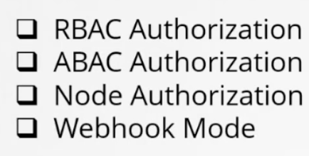

### 1.1 Host-Level & Infrastructure Security
Securing the underlying physical/virtual nodes is the foundational prerequisite:
- Disable root login over SSH.
- Enforce SSH key-based authentication; disable password authentication.
- Keep the host OS patched and implement firewall rules (e.g., `ufw`, `iptables`).
- Close unnecessary open ports on both control plane and worker nodes.

### 1.2 Securing the Kube-API Server
The **`kube-apiserver`** is the central management gateway for all cluster operations. Controlling API server access is the primary defense line:
1. **Authentication (Who can access?):** Validates the caller's identity via TLS client certificates, bearer tokens, or external identity providers (LDAP, OIDC).
2. **Authorization (What can they do?):** Enforces fine-grained permissions via **RBAC** (Role-Based Access Control), ABAC, Node Authorizer, or Webhooks.

### 1.3 Internal Component & Pod-to-Pod Communication
- **Internal Control Plane & Node Traffic:** All communication between ETCD, API server, controller manager, scheduler, and kubelets is encrypted with **mutual TLS (mTLS)**.
- **Pod-to-Pod Network Security:** By default, Kubernetes operates an unrestricted flat network where all pods can communicate with all other pods across all namespaces. Pod traffic isolation is achieved using **Network Policies**.

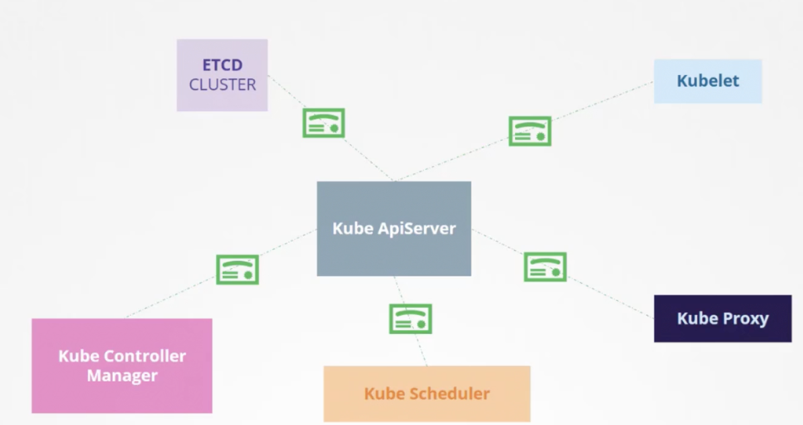

---

## 2. Authentication

The Kubernetes API server handles authentication for all incoming requests, whether invoked via `kubectl`, client SDKs, or direct REST calls.

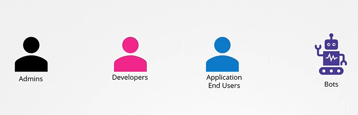

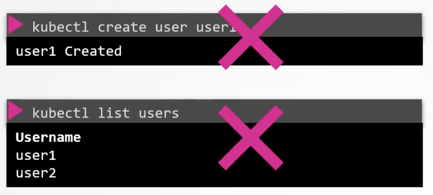

### 2.1 User Accounts vs. ServiceAccounts
Cluster callers fall into two distinct categories:

| Attribute | User Accounts (Humans) | ServiceAccounts (Robots / Pods) |
| :--- | :--- | :--- |
| **Target** | Administrators, developers, human operators | In-cluster pods, CI/CD pipelines (Jenkins), monitoring tools (Prometheus) |
| **Management** | **Not managed natively** by Kubernetes; relies on external sources (certificates, static files, OIDC/LDAP) | **Natively managed** by Kubernetes via the API (`kubectl create serviceaccount`) |
| **Storage** | No `User` resource stored in ETCD; cannot run `kubectl get users` | Stored as `ServiceAccount` resources in ETCD |

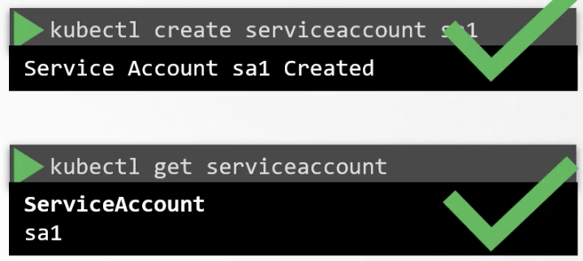

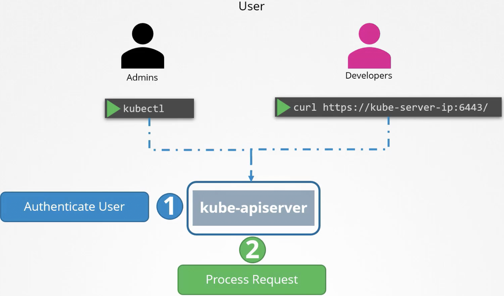

### 2.2 Authentication Mechanisms Overview
The `kube-apiserver` supports multiple authentication mechanisms:

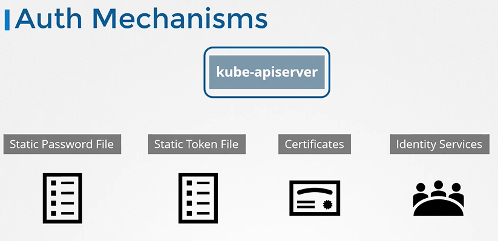

1. **Static Files (Basic Auth / Tokens):** Passwords or tokens stored in CSV files (deprecated/removed in modern Kubernetes).
2. **X.509 Client Certificates:** Mutual TLS authentication where client certificates are signed by a trusted cluster Certificate Authority (CA).
3. **OpenID Connect (OIDC) / OAuth2:** Integration with external enterprise identity providers (Okta, Google Workspace, Keycloak, Active Directory).
4. **Webhook Token Authentication:** Verification delegated to an external HTTP webhook service.

### 2.3 Basic Authentication (Static Password & Token Files - Deprecated)

> [!WARNING]
> Static password and token files store credentials in cleartext and are **deprecated as of Kubernetes 1.19** and completely removed in modern releases. They are covered here strictly for understanding authentication concepts and legacy exam questions.

A static password CSV file defines three required columns and one optional group column:
```text
password,username,user_id,group
```

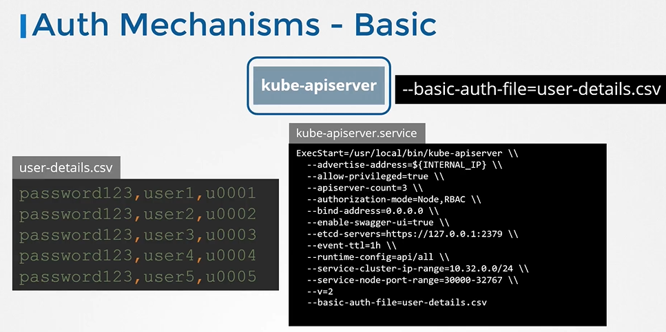

The static password file is passed to `kube-apiserver` via the `--basic-auth-file` flag:

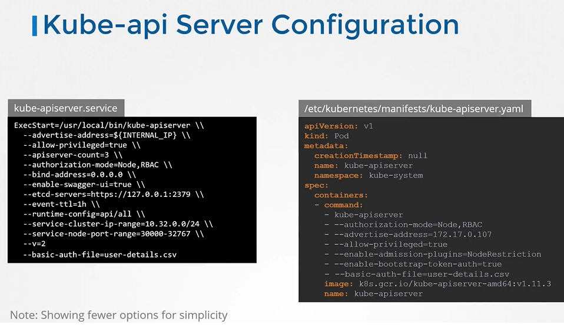

Authenticating against the API server using basic credentials via `curl`:
```bash
curl -v -k https://master-node-ip:6443/api/v1/pods -u "user1:password123"
```

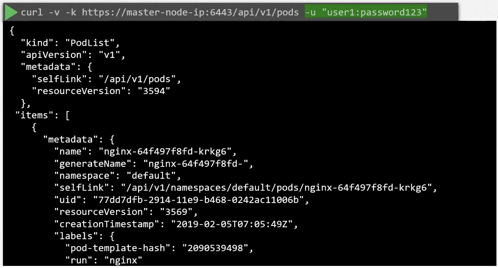

Similarly, static token authentication uses a CSV file (`token,username,user_id,group`) passed via `--token-auth-file`:

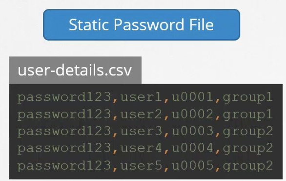

When authenticating with a token, the client passes an `Authorization: Bearer <token>` HTTP header:

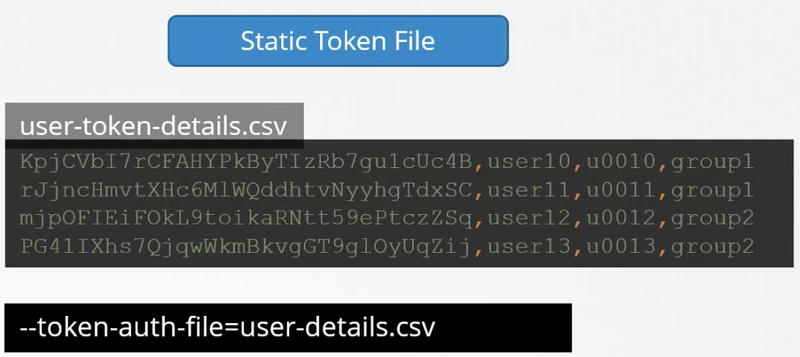

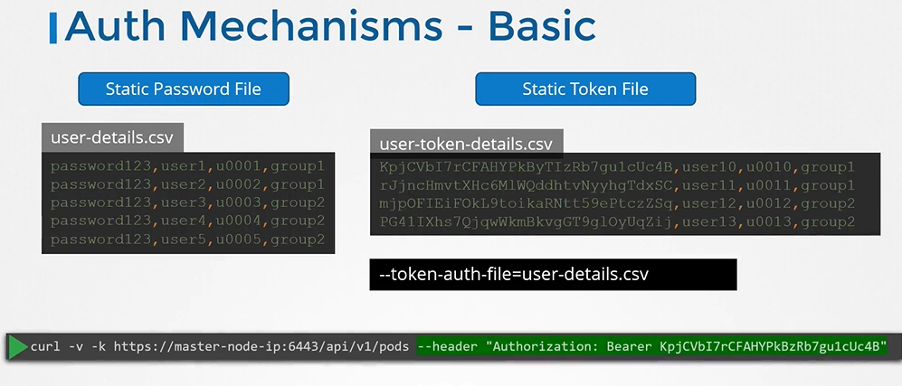

### 2.4 Configuring Basic Authentication in Kubeadm (Legacy Reference)

1. Create a user CSV file on the control plane host (e.g., `/tmp/users/user-details.csv`):
```text
password123,user1,u0001,group1
password123,user2,u0002,group1
```

2. Modify the `kube-apiserver` static pod manifest (`/etc/kubernetes/manifests/kube-apiserver.yaml`) to add the `--basic-auth-file` argument and hostPath volume mount:
```yaml
apiVersion: v1
kind: Pod
metadata:
  name: kube-apiserver
  namespace: kube-system
spec:
  containers:
  - name: kube-apiserver
    command:
    - kube-apiserver
    - --authorization-mode=Node,RBAC
    - --basic-auth-file=/tmp/users/user-details.csv
    volumeMounts:
    - mountPath: /tmp/users
      name: usr-details
      readOnly: true
  volumes:
  - hostPath:
      path: /tmp/users
      type: DirectoryOrCreate
    name: usr-details
```

3. Create RBAC `Role` and `RoleBinding` to authorize the user:
```yaml
apiVersion: rbac.authorization.k8s.io/v1
kind: Role
metadata:
  namespace: default
  name: pod-reader
rules:
- apiGroups: [""]
  resources: ["pods"]
  verbs: ["get", "watch", "list"]
---
apiVersion: rbac.authorization.k8s.io/v1
kind: RoleBinding
metadata:
  name: read-pods
  namespace: default
  name: read-pods
subjects:
- kind: User
  name: user1
  apiGroup: rbac.authorization.k8s.io
roleRef:
  kind: Role
  name: pod-reader
  apiGroup: rbac.authorization.k8s.io
```

4. Authenticate using `curl`:
```bash
curl -v -k https://localhost:6443/api/v1/pods -u "user1:password123"
```

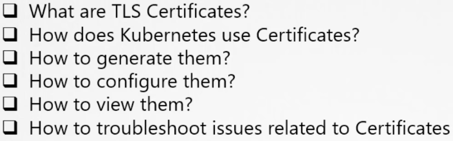

---

## 3. TLS Basics & PKI Concepts

Transport Layer Security (TLS) ensures two core security guarantees:
1. **Confidentiality & Integrity (Encryption):** Prevents network sniffers and man-in-the-middle (MITM) attackers from reading or altering data in transit.
2. **Authenticity (Identity Verification):** Proves that the server (and optionally the client) is genuinely who they claim to be.

### 3.1 Symmetric vs. Asymmetric Encryption
- **Symmetric Encryption:** Uses the **same shared key** for both encryption and decryption. Fast, but exchanging the secret key securely over an untrusted network presents a critical vulnerability.
- **Asymmetric Encryption:** Uses a mathematically linked **key pair**:
  - **Private Key:** Kept secret and never transmitted. Used for decrypting data encrypted with the corresponding public key, or for creating digital signatures.
  - **Public Key:** Freely distributed. Used for encrypting data that only the private key holder can decrypt, or for verifying signatures.

### 3.2 Securing SSH & Web Servers
- **SSH Key Pairs:** An operator generates a private key (`id_rsa`) and public key (`id_rsa.pub`). The public key is installed in `~/.ssh/authorized_keys` on target servers, allowing passwordless login.

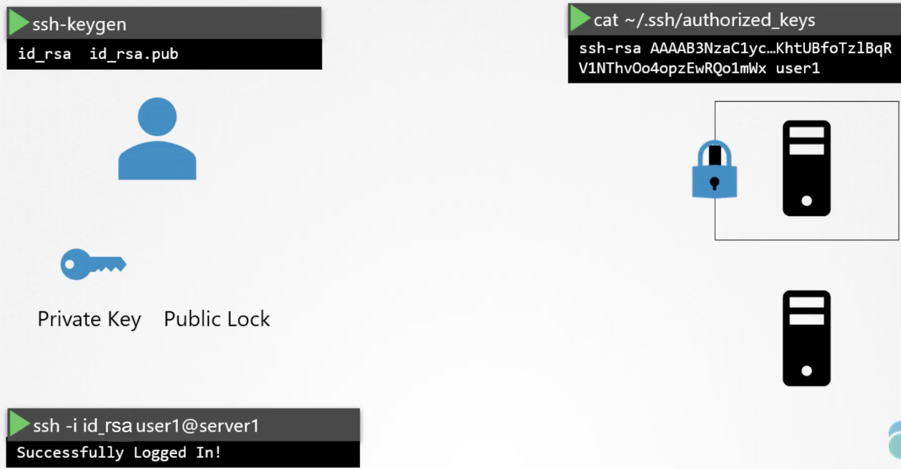

- **TLS Handshake for HTTPS:**
  1. The server presents its public key to the client inside a digital certificate.
  2. The client's browser verifies the certificate and generates a random one-time **symmetric session key**.
  3. The client encrypts the session key using the server's public key and sends it to the server.
  4. The server decrypts the session key using its private key.
  5. Both parties switch to fast symmetric encryption using the shared session key for all subsequent HTTP traffic.


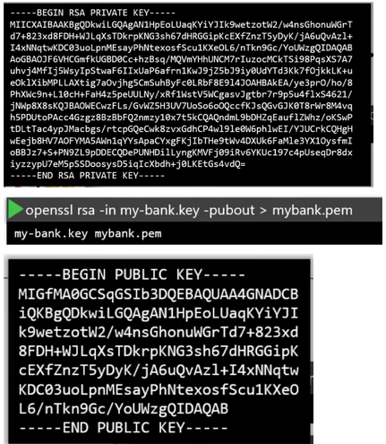

### 3.3 Certificate Authorities (CA) & Digital Certificates
Anyone can generate a key pair and claim to represent a given domain. To prevent spoofing and rogue servers:

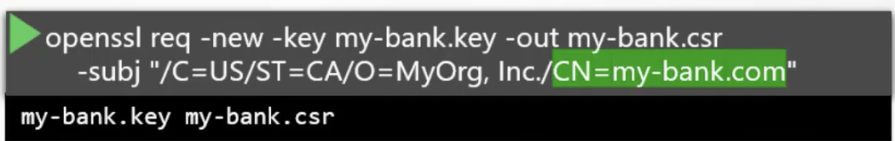

1. A server generates a private key and a **Certificate Signing Request (CSR)** containing its public key and domain names (Common Name / SANs).
2. A trusted **Certificate Authority (CA)** validates domain ownership and signs the CSR with its own private key, producing a digital certificate.
3. Browsers and OS platforms come pre-loaded with public root certificates of trusted public CAs (e.g., DigiCert, Let's Encrypt). The client uses the CA's public key to verify the server certificate's digital signature.

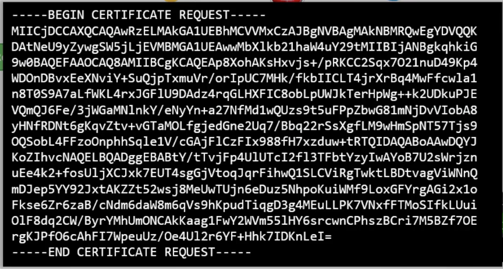

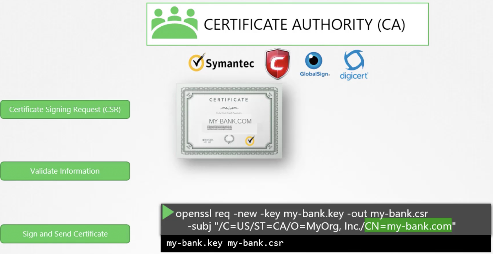

### 3.4 Client Certificates vs. Server Certificates
- **Server Certificates:** Configured on the server endpoint to encrypt incoming connections and prove the server's identity to clients.
- **Client Certificates (Mutual TLS / mTLS):** Configured on the client to authenticate the client's identity to the server during the TLS handshake.
- **Root CA Certificates:** Configured on all clients and servers to validate signatures across the PKI infrastructure.

---

## 4. TLS in Kubernetes Architecture

Kubernetes relies comprehensively on **Mutual TLS (mTLS)** for cluster-wide communication. Every component must be configured with both a server certificate (if listening) and a client certificate (if initiating requests).

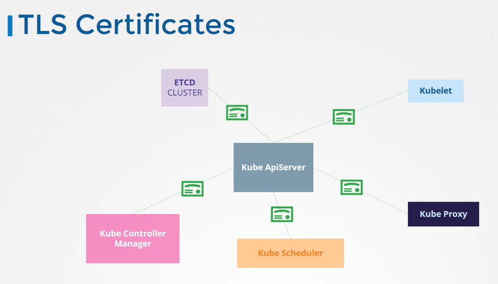

### 4.1 Required Certificates Overview

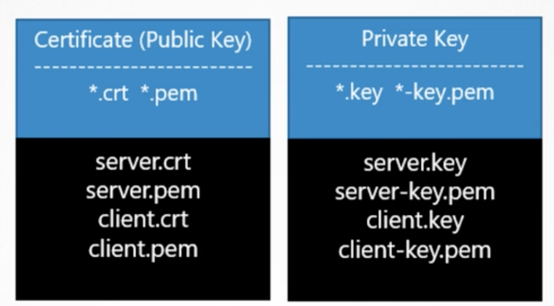

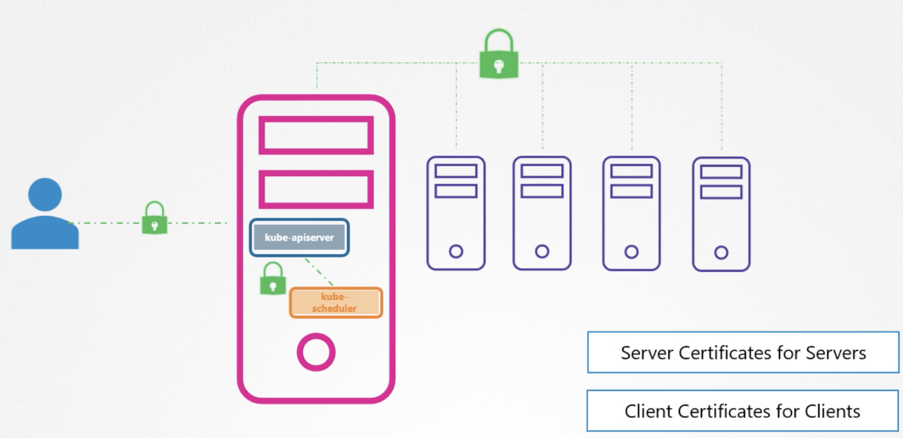

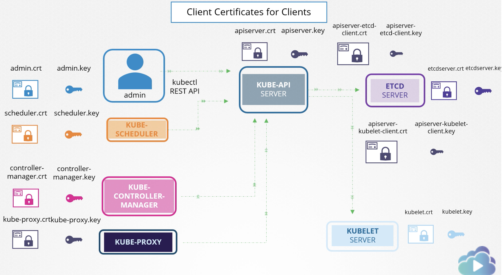

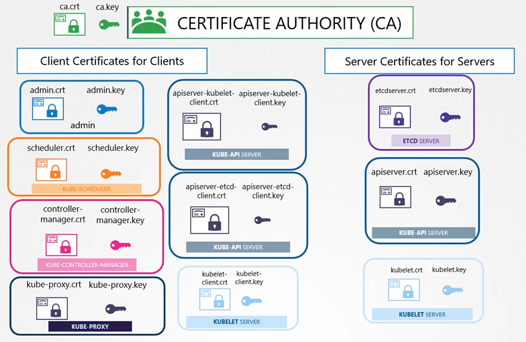

The cluster PKI encompasses three tiers of certificates:
1. **Root Certificate Authority (CA):** Holds `ca.crt` and `ca.key`. Signs all server and client certificates in the cluster. (Large clusters may also use a separate dedicated CA for ETCD).
2. **Server Certificates:** Secured endpoints that listen for HTTPS requests.
3. **Client Certificates:** Authorized entities that send requests to secure endpoints.

### 4.2 Server Certificates (ETCD, Kube-API, Kubelet)
| Server Component | Certificate File | Key File | Purpose |
| :--- | :--- | :--- | :--- |
| **Kube-API Server** | `apiserver.crt` | `apiserver.key` | Secures the control plane REST API on port 6443. Must include IP and DNS SANs. |
| **ETCD Server** | `etcdserver.crt` | `etcdserver.key` | Secures ETCD database port 2379 and cluster peer communication on port 2380. |
| **Kubelet Server** | `kubelet.crt` | `kubelet.key` | Secures worker node kubelet endpoints on port 10250 used by `kube-apiserver` for `kubectl logs`/`exec`. |

### 4.3 Client Certificates (Admin, Scheduler, Controller Manager, Kube-Proxy, Kubelet-Client)
| Client Component | Target Server | Certificate CN / Organization |
| :--- | :--- | :--- |
| **Admin User** | `kube-apiserver` | `CN=kube-admin`, `O=system:masters` |
| **Kube-Scheduler** | `kube-apiserver` | `CN=system:kube-scheduler` |
| **Kube-Controller-Manager** | `kube-apiserver` | `CN=system:kube-controller-manager` |
| **Kube-Proxy** | `kube-apiserver` | `CN=system:kube-proxy` |
| **Kubelet (Client)** | `kube-apiserver` | `CN=system:node:<node-name>`, `O=system:nodes` |
| **Kube-API Server (Client to ETCD)** | `etcd` | `apiserver-etcd-client.crt` |
| **Kube-API Server (Client to Kubelet)**| `kubelet` (port 10250) | `apiserver-kubelet-client.crt` |

### 4.4 Certificate Naming Conventions
- **Public Certificates:** Typically end with `.crt` or `.pem` (e.g., `apiserver.crt`, `ca.crt`).
- **Private Keys:** Always include `key` in the filename or extension (e.g., `apiserver.key`, `ca.key`, `client-key.pem`). Keep them protected with `chmod 600`.

---

## 5. TLS Certificate Creation & Configuration

Certificates can be generated using OpenSSL, CFSSL, or EasyRSA. In this section, we examine the OpenSSL workflow.

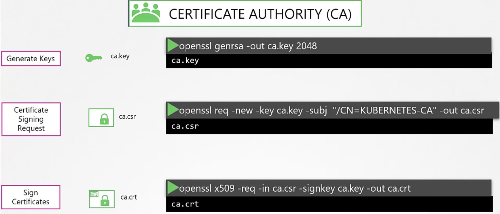

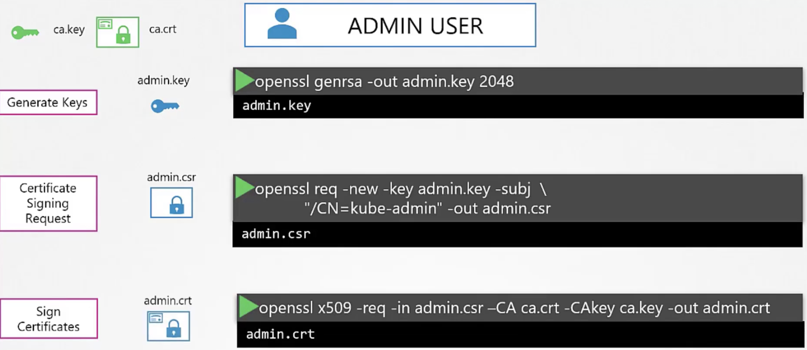


### 5.1 Generating Certificate Authority (CA) Certificates
The Kubernetes CA signs all other certificates in the cluster. It is self-signed:

```bash
# 1. Generate CA private key
openssl genrsa -out ca.key 2048

# 2. Generate Certificate Signing Request (CSR)
openssl req -new -key ca.key -subj "/CN=KUBERNETES-CA" -out ca.csr

# 3. Self-sign the CA root certificate
openssl x509 -req -in ca.csr -signkey ca.key -out ca.crt -days 3650
```

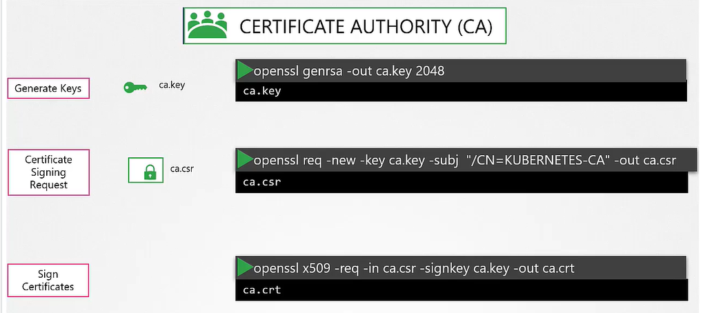

### 5.2 Generating Client Certificates (Admin, Scheduler, Controller Manager, Kube-Proxy)

#### Admin User Certificate
The admin user certificate identifies the cluster administrator. To grant full administrative permissions, the user must belong to the `system:masters` group, specified via the Organization (`/O=`) attribute:

```bash
# 1. Generate private key
openssl genrsa -out admin.key 2048

# 2. Generate CSR with CN and O attributes
openssl req -new -key admin.key -subj "/CN=kube-admin/O=system:masters" -out admin.csr

# 3. Sign using the Cluster CA
openssl x509 -req -in admin.csr -CA ca.crt -CAkey ca.key -CAcreateserial -out admin.crt -days 365
```

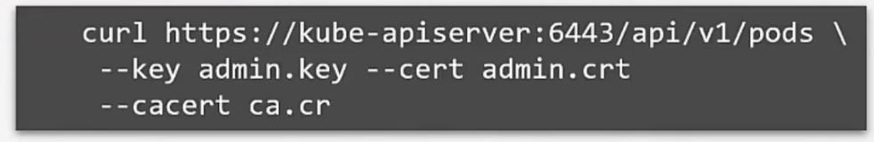

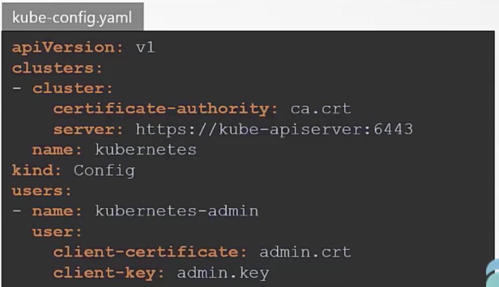

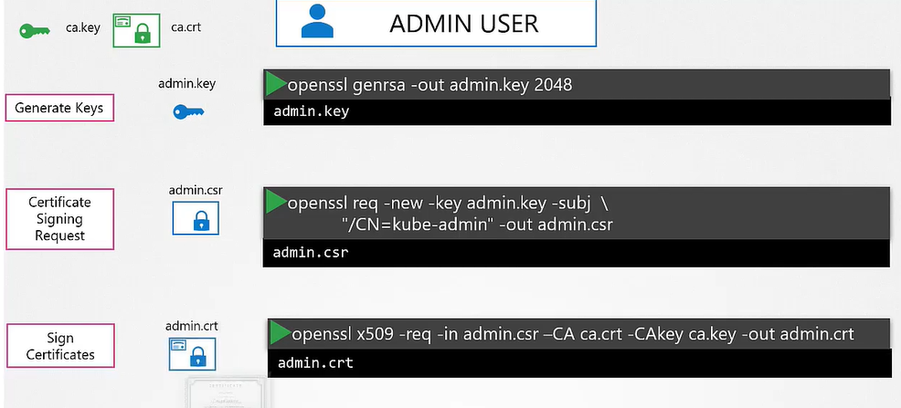

#### System Component Client Certificates
All system components must follow the `system:` prefix naming standard:
```bash
# Kube-Scheduler
openssl req -new -key scheduler.key -subj "/CN=system:kube-scheduler" -out scheduler.csr
openssl x509 -req -in scheduler.csr -CA ca.crt -CAkey ca.key -CAcreateserial -out scheduler.crt -days 365

# Kube-Controller-Manager
openssl req -new -key controller-manager.key -subj "/CN=system:kube-controller-manager" -out controller-manager.csr
openssl x509 -req -in controller-manager.csr -CA ca.crt -CAkey ca.key -CAcreateserial -out controller-manager.crt -days 365

# Kube-Proxy
openssl req -new -key kube-proxy.key -subj "/CN=system:kube-proxy" -out kube-proxy.csr
openssl x509 -req -in kube-proxy.csr -CA ca.crt -CAkey ca.key -CAcreateserial -out kube-proxy.crt -days 365
```

### 5.3 Generating ETCD Server & Peer Certificates
ETCD requires server certificates for client connections and peer certificates for synchronization across multi-node ETCD clusters:

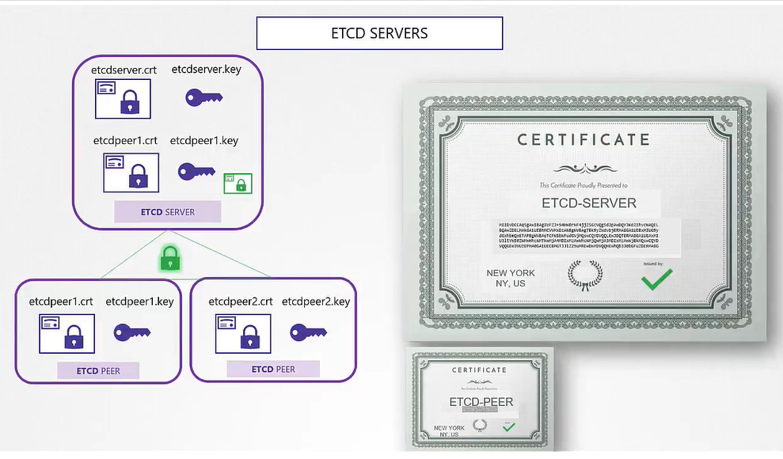


```bash
# Generate ETCD server key and cert
openssl genrsa -out etcdserver.key 2048
openssl req -new -key etcdserver.key -subj "/CN=etcd-server" -out etcdserver.csr
openssl x509 -req -in etcdserver.csr -CA ca.crt -CAkey ca.key -CAcreateserial -out etcdserver.crt -days 365
```

Configuring certificates in the ETCD startup command:
```bash
etcd --cert-file=/etc/kubernetes/pki/etcd/server.crt      --key-file=/etc/kubernetes/pki/etcd/server.key      --peer-cert-file=/etc/kubernetes/pki/etcd/peer.crt      --peer-key-file=/etc/kubernetes/pki/etcd/peer.key      --trusted-ca-file=/etc/kubernetes/pki/etcd/ca.crt      --peer-trusted-ca-file=/etc/kubernetes/pki/etcd/ca.crt
```

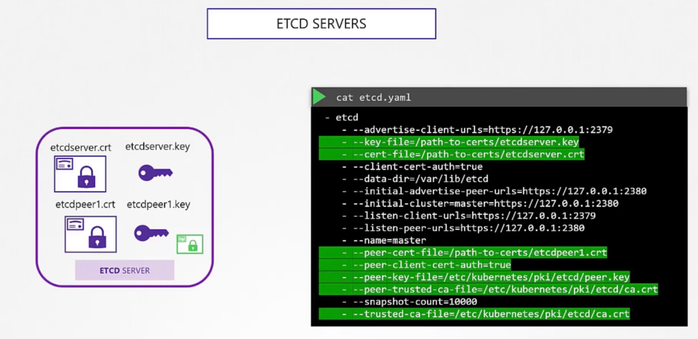

### 5.4 Generating Kube-API Server Certificates with SAN (Subject Alternative Names)
The Kube-API server is accessed via multiple aliases, DNS names, and IP addresses:
- DNS aliases: `kubernetes`, `kubernetes.default`, `kubernetes.default.svc`, `kubernetes.default.svc.cluster.local`
- Hostname: `master-node`, `controlplane`
- IP addresses: Node IP (e.g., `192.168.5.10`), Cluster Service IP (e.g., `10.96.0.1`), Localhost `127.0.0.1`

All these names must be declared under **Subject Alternative Names (SAN)** in an OpenSSL configuration file:

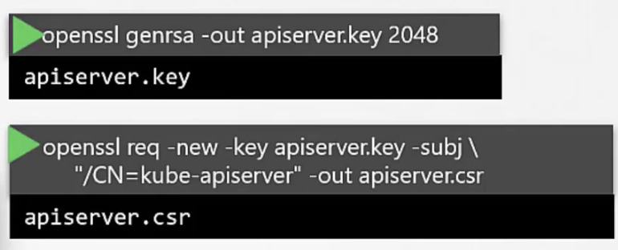

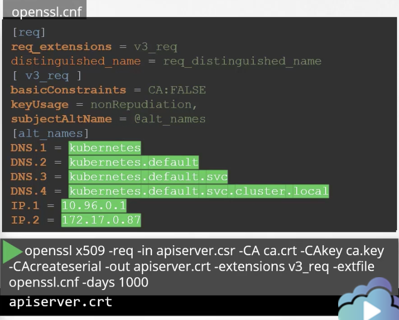

Create `openssl.cnf`:
```ini
[req]
req_extensions = v3_req
distinguished_name = req_distinguished_name
[req_distinguished_name]
[ v3_req ]
basicConstraints = CA:FALSE
keyUsage = nonRepudiation, digitalSignature, keyEncipherment
subjectAltName = @alt_names
[alt_names]
DNS.1 = kubernetes
DNS.2 = kubernetes.default
DNS.3 = kubernetes.default.svc
DNS.4 = kubernetes.default.svc.cluster.local
IP.1 = 10.96.0.1
IP.2 = 192.168.5.10
IP.3 = 127.0.0.1
```

Sign the certificate with SAN extension:
```bash
openssl genrsa -out apiserver.key 2048
openssl req -new -key apiserver.key -subj "/CN=kube-apiserver" -out apiserver.csr -config openssl.cnf
openssl x509 -req -in apiserver.csr -CA ca.crt -CAkey ca.key -CAcreateserial -out apiserver.crt -extfile openssl.cnf -extensions v3_req -days 365
```

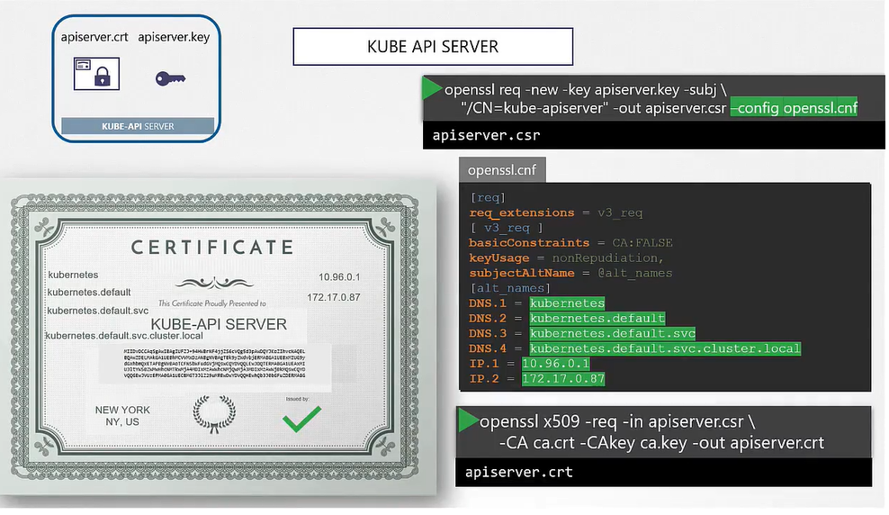

### 5.5 Configuring Kube-API Server Startup Flags
The generated certificates are configured on the `kube-apiserver` static pod manifest (`/etc/kubernetes/manifests/kube-apiserver.yaml`):

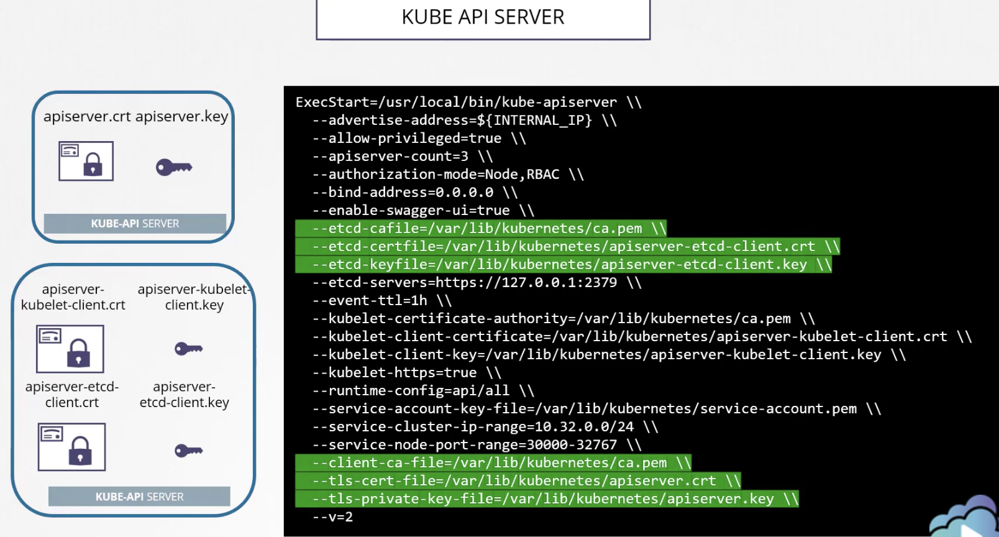

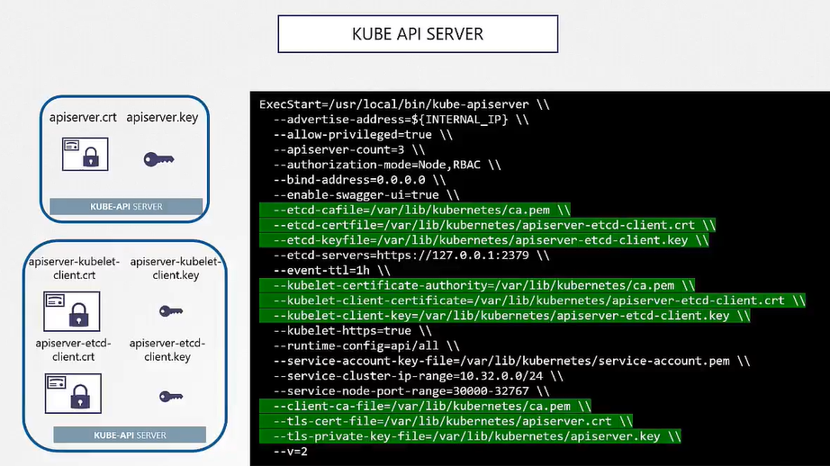

```yaml
spec:
  containers:
  - command:
    - kube-apiserver
    - --tls-cert-file=/etc/kubernetes/pki/apiserver.crt
    - --tls-private-key-file=/etc/kubernetes/pki/apiserver.key
    - --client-ca-file=/etc/kubernetes/pki/ca.crt
    # Client certs for connecting to ETCD
    - --etcd-cafile=/etc/kubernetes/pki/etcd/ca.crt
    - --etcd-certfile=/etc/kubernetes/pki/apiserver-etcd-client.crt
    - --etcd-keyfile=/etc/kubernetes/pki/apiserver-etcd-client.key
    # Client certs for connecting to Kubelet on nodes
    - --kubelet-client-certificate=/etc/kubernetes/pki/apiserver-kubelet-client.crt
    - --kubelet-client-key=/etc/kubernetes/pki/apiserver-kubelet-client.key
    - --kubelet-certificate-authority=/etc/kubernetes/pki/ca.crt
```

### 5.6 Generating Kubelet Server & Client Certificates

#### Kubelet Server Certificates
Each worker node runs a kubelet server listening on port 10250. Certificates are named after each individual node:
```bash
# Node01 server certificate
openssl genrsa -out node01.key 2048
openssl req -new -key node01.key -subj "/CN=node01" -out node01.csr
openssl x509 -req -in node01.csr -CA ca.crt -CAkey ca.key -CAcreateserial -out node01.crt -days 365
```

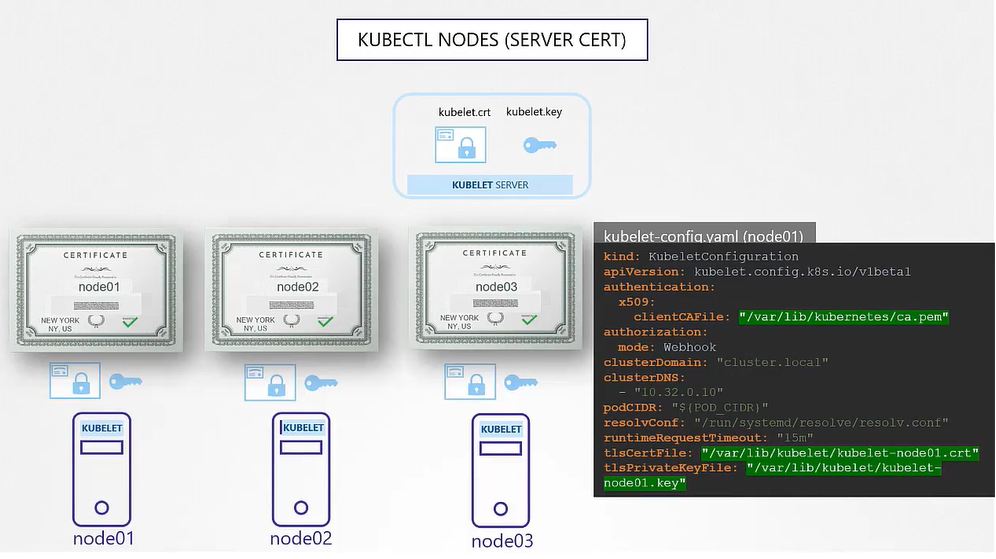

Configured in `/var/lib/kubelet/config.yaml`:
```yaml
tlsCertFile: /var/lib/kubelet/pki/kubelet.crt
tlsPrivateKeyFile: /var/lib/kubelet/pki/kubelet.key
```

#### Kubelet Client Certificates
When the kubelet communicates with the `kube-apiserver`, it authenticates using a client certificate. The API server recognizes it via:
- **Common Name:** `system:node:<node-name>`
- **Organization (Group):** `system:nodes`

```bash
openssl genrsa -out kubelet-client.key 2048
openssl req -new -key kubelet-client.key -subj "/CN=system:node:node01/O=system:nodes" -out kubelet-client.csr
openssl x509 -req -in kubelet-client.csr -CA ca.crt -CAkey ca.key -CAcreateserial -out kubelet-client.crt -days 365
```

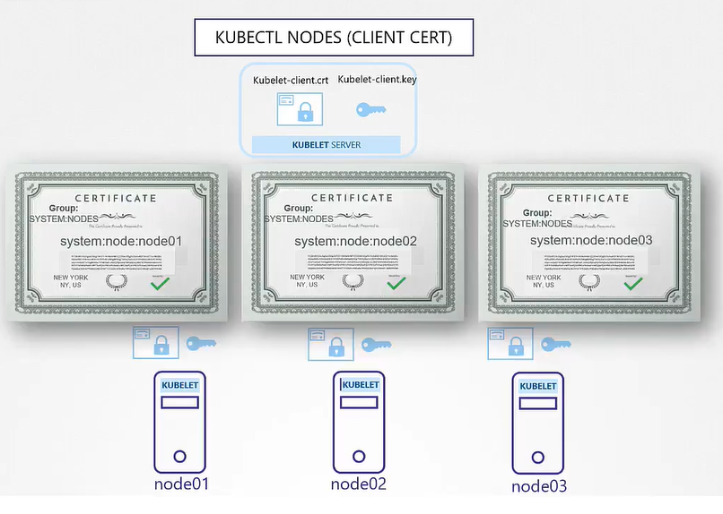

---

## 6. Viewing & Inspecting Certificate Details

When troubleshooting cluster authentication errors, administrators must verify certificate validity, Common Names, SANs, and expiration dates.

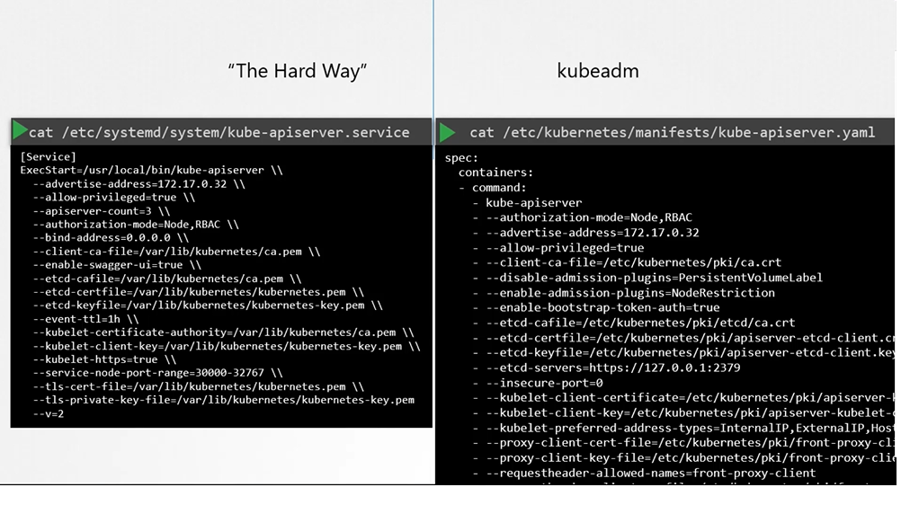

### 6.1 Certificate Locations in Kubeadm
In a cluster provisioned with `kubeadm`:
- Control plane certificates: `/etc/kubernetes/pki/`
- ETCD certificates: `/etc/kubernetes/pki/etcd/`
- Kubelet certificates: `/var/lib/kubelet/pki/`
- Kubeconfig credentials: `/etc/kubernetes/admin.conf`, `kubelet.conf`, `controller-manager.conf`, `scheduler.conf`

Check the static pod manifests under `/etc/kubernetes/manifests/` to inspect exact certificate argument paths:

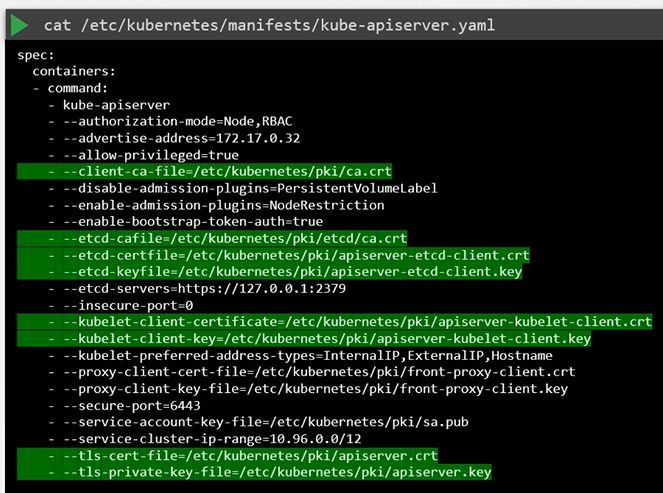

### 6.2 Inspecting Certificates with OpenSSL
To view decoded certificate attributes (Subject, Issuer, Validity Dates, Alternative Names):

```bash
openssl x509 -in /etc/kubernetes/pki/apiserver.crt -text -noout
```

Key fields to check:
- **Subject:** `CN = kube-apiserver`
- **Validity:** `Not Before`, `Not After` (ensure certificate has not expired)
- **Subject Alternative Name:** `DNS:kubernetes`, `DNS:kubernetes.default`, `IP:10.96.0.1`
- **Issuer:** `CN = kubernetes` (must match the trusted CA)

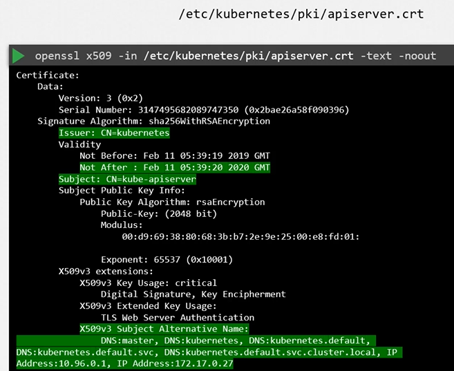

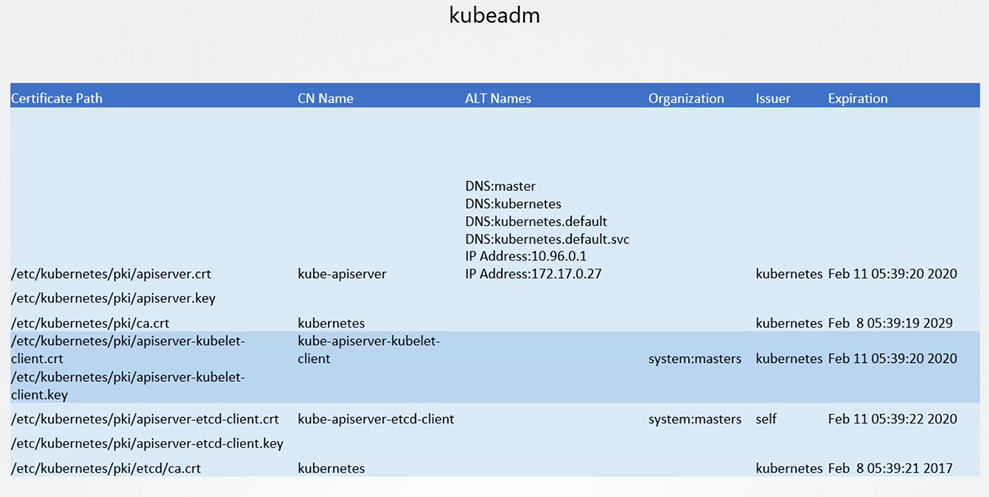

### 6.3 Troubleshooting & Component Logs (`journalctl`, `kubectl logs`, container runtime)
If control plane components fail to start due to certificate mismatches or expiration:

1. **Systemd Services (Hard Way Deployments):**
```bash
journalctl -u etcd.service -l --no-pager
journalctl -u kube-apiserver.service -l --no-pager
```

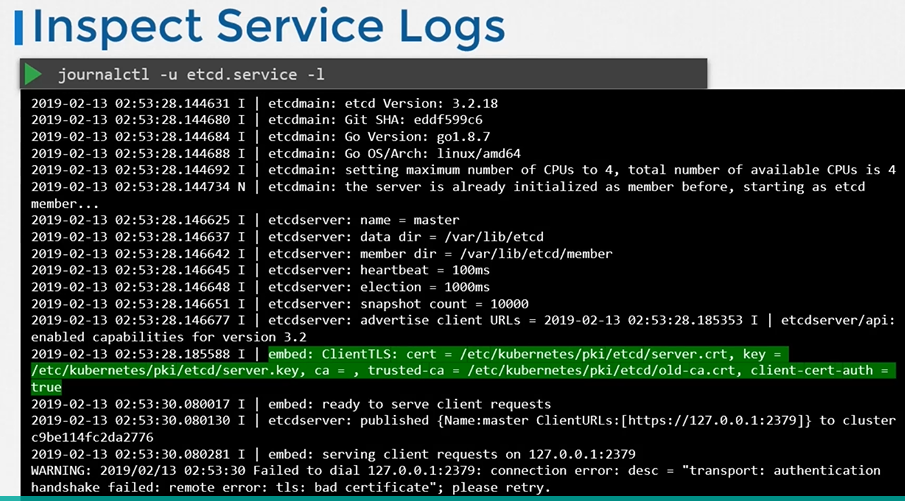

2. **Static Pods (Kubeadm Deployments):**
If the API server is functional:
```bash
kubectl logs etcd-controlplane -n kube-system
kubectl logs kube-apiserver-controlplane -n kube-system
```

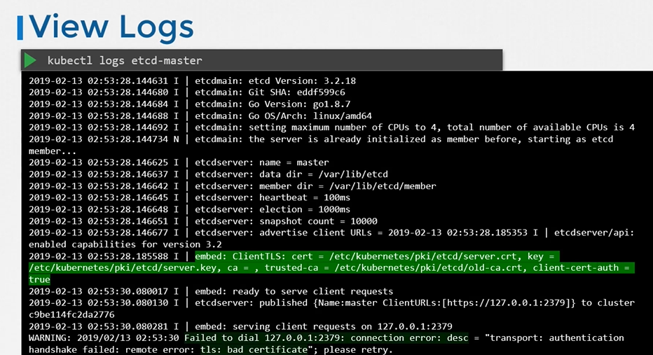

3. **Container Runtime Level (When Kube-API is down):**
When the API server is down, `kubectl` cannot connect. Inspect container logs directly via `crictl` or `docker`:
```bash
crictl ps -a
crictl logs <container-id>

# Or on older Docker environments:
docker ps -a
docker logs <container-id>
```

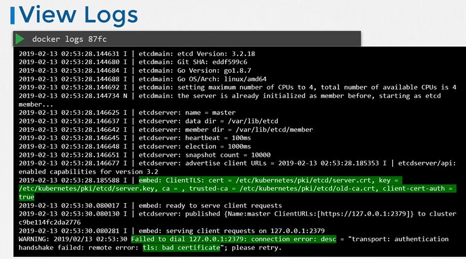

### 6.4 Certificate Health Check Spreadsheet Reference
For auditing and tracking certificate expirations across production environments:
[https://github.com/mmumshad/kubernetes-the-hard-way/tree/master/tools](https://github.com/mmumshad/kubernetes-the-hard-way/tree/master/tools)

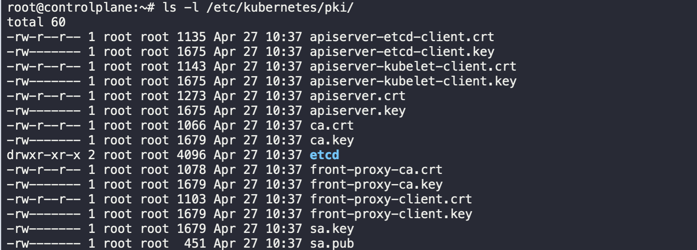

---

## 7. Certificates API (`CertificateSigningRequest`)

In large teams, manually logging onto the CA master node to sign certificates for every new engineer or service is slow and insecure.

### 7.1 The Need for a Built-in CA & CSR Workflow
Kubernetes provides the native **Certificates API** to automate CSR submission, approval, and certificate issuance via Kubernetes API objects.

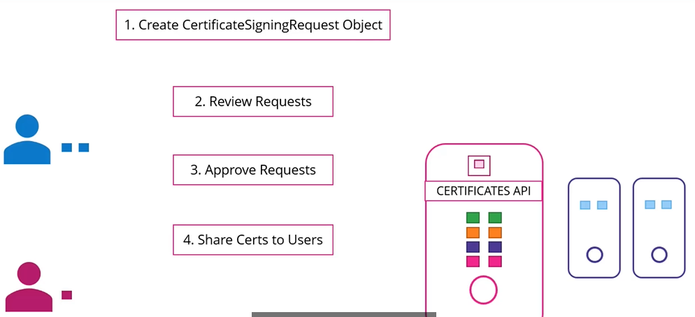

### 7.2 Creating a `CertificateSigningRequest` Object

1. The user generates their private key and CSR locally:
```bash
openssl genrsa -out jane.key 2048
openssl req -new -key jane.key -subj "/CN=jane" -out jane.csr
```

2. Encode the `.csr` file into base64 (single line):
```bash
cat jane.csr | base64 | tr -d '
'
```

3. Create the `CertificateSigningRequest` manifest (`certificates.k8s.io/v1`):
```yaml
apiVersion: certificates.k8s.io/v1
kind: CertificateSigningRequest
metadata:
  name: jane
spec:
  request: <BASE64_ENCODED_CSR_STRING>
  signerName: kubernetes.io/kube-apiserver-client
  usages:
  - client auth
```

> [!NOTE]
> In `certificates.k8s.io/v1`, the `signerName` field is required. Common values:
> - `kubernetes.io/kube-apiserver-client`: For client certificates authenticating to the API server.
> - `kubernetes.io/kubelet-serving`: For serving certificates on kubelet endpoints.

Apply the manifest:
```bash
kubectl apply -f jane-csr.yaml
```

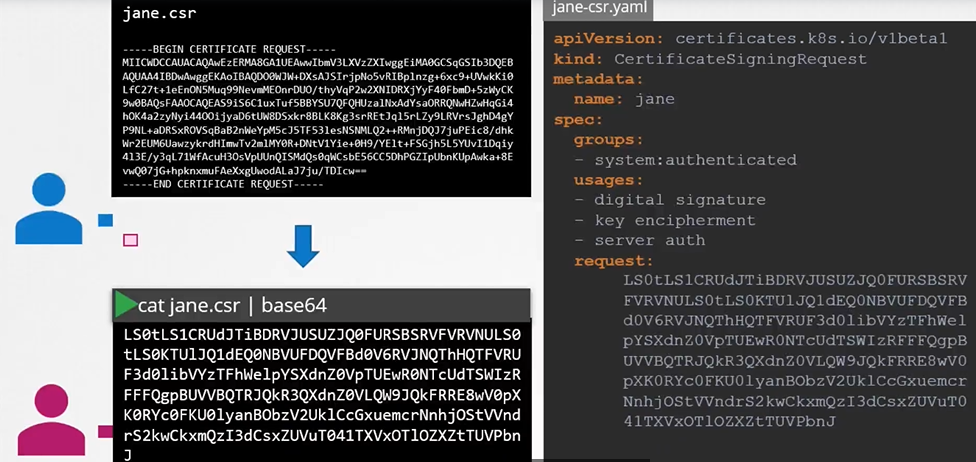

### 7.3 Reviewing, Approving, and Extracting Certificates
Administrators list and review pending CSRs:
```bash
# List all CSRs
kubectl get csr

# Approve the request
kubectl certificate approve jane

# Deny a request if unauthorized
kubectl certificate deny jane
```

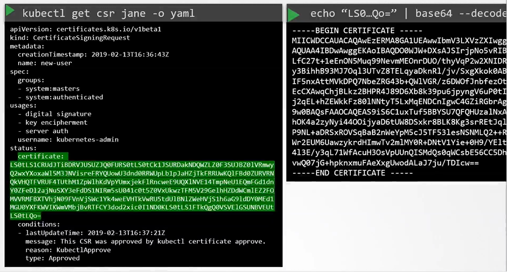

Extract the signed certificate from the approved CSR:
```bash
kubectl get csr jane -o jsonpath='{.status.certificate}' | base64 --decode > jane.crt
```

The user can now use `jane.crt` and `jane.key` to access the cluster.

### 7.4 Controller Manager CSR Signing Controllers
The **`kube-controller-manager`** is responsible for automating CSR signing. It contains specialized controllers (`csrapproving`, `csrsigning`):

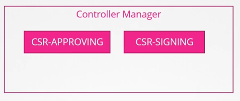

To sign certificates, `kube-controller-manager` must have access to the cluster CA key and certificate files:
```bash
kube-controller-manager   --cluster-signing-cert-file=/etc/kubernetes/pki/ca.crt   --cluster-signing-key-file=/etc/kubernetes/pki/ca.key
```

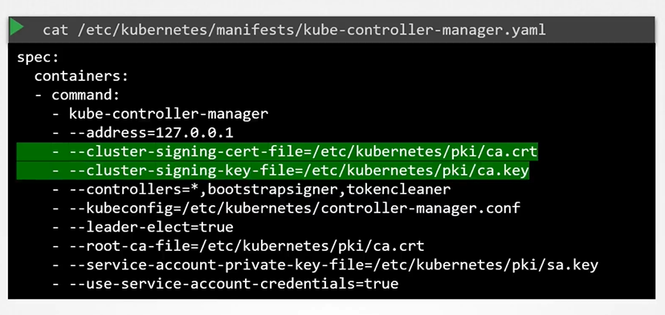

---

## 8. KubeConfig

Every REST call to the API server requires the API server URL, user certificates, and CA certificate:
```bash
curl https://master-node:6443/api/v1/pods   --key admin.key   --cert admin.crt   --cacert ca.crt
```

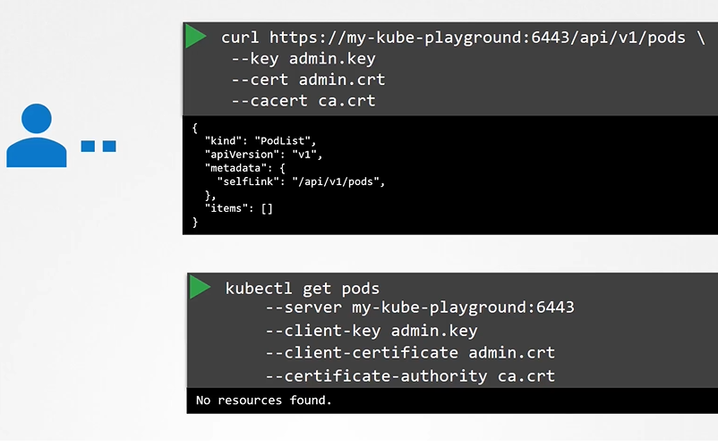

Specifying `--server`, `--client-key`, `--client-certificate`, and `--certificate-authority` flags with every single `kubectl` command is inefficient:

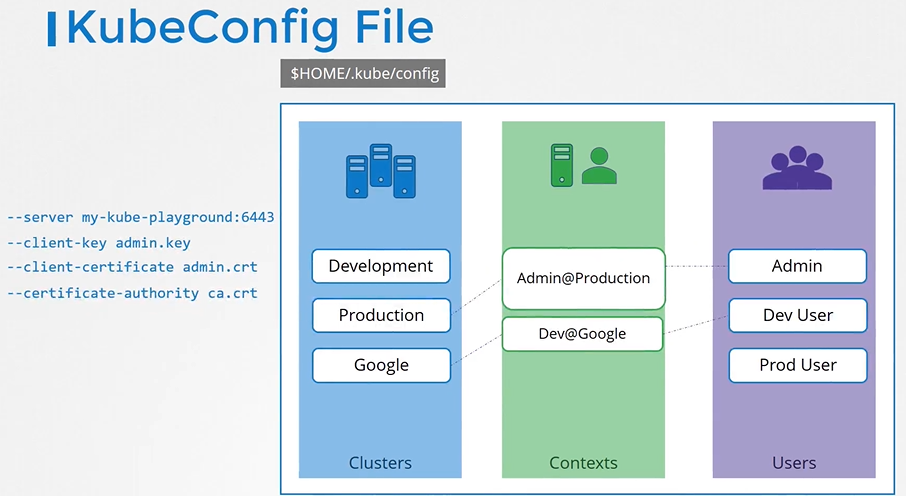

### 8.1 KubeConfig Purpose & Structure (Clusters, Users, Contexts)
A **KubeConfig** file organizes connection parameters into three primary sections:
- **`clusters`:** Endpoints of the Kubernetes clusters (`server`, `certificate-authority`).
- **`users`:** Client credentials (`client-certificate`, `client-key`, or auth tokens).
- **`contexts`:** Links a specific user to a specific cluster (and optionally a default namespace).


### 8.2 Default Location (`~/.kube/config`) & Syntax
By default, `kubectl` reads configuration from `$HOME/.kube/config`.

```yaml
apiVersion: v1
kind: Config
current-context: dev-user@development

clusters:
- name: development
  cluster:
    certificate-authority: /etc/kubernetes/pki/ca.crt
    server: https://192.168.1.100:6443

- name: production
  cluster:
    certificate-authority: /etc/kubernetes/pki/ca.crt
    server: https://192.168.1.200:6443

users:
- name: dev-user
  user:
    client-certificate: /etc/kubernetes/pki/users/dev-user.crt
    client-key: /etc/kubernetes/pki/users/dev-user.key

- name: admin-user
  user:
    client-certificate: /etc/kubernetes/pki/admin.crt
    client-key: /etc/kubernetes/pki/admin.key

contexts:
- name: dev-user@development
  context:
    cluster: development
    user: dev-user
    namespace: dev

- name: admin-user@production
  context:
    cluster: production
    user: admin-user
```

### 8.3 Managing KubeConfig via `kubectl config` Commands

```bash
# View active kubeconfig
kubectl config view

# View custom kubeconfig file
kubectl config view --kubeconfig=/path/to/custom-config

# Switch current active context
kubectl config use-context admin-user@production

# Set default namespace for current context
kubectl config set-context --current --namespace=finance

# Add or modify cluster credentials imperatively
kubectl config set-cluster my-cluster --server=https://10.0.0.1:6443
```

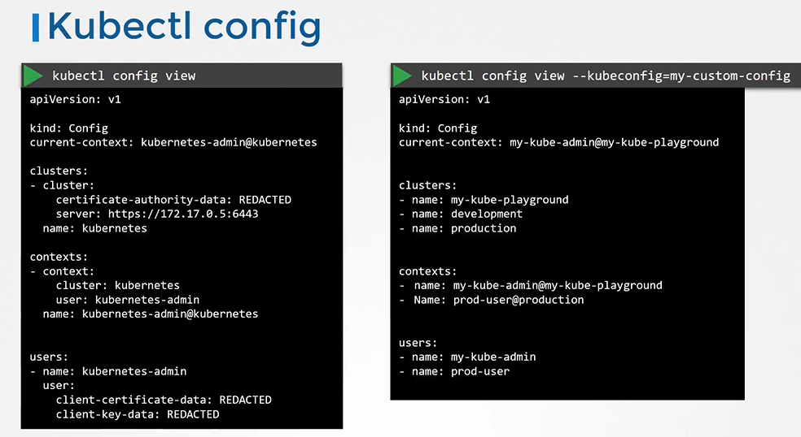

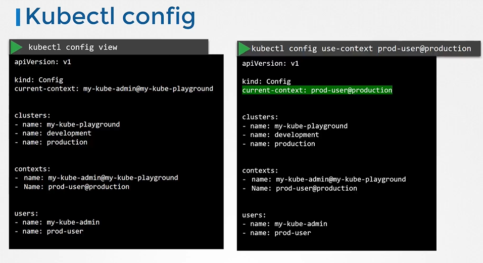

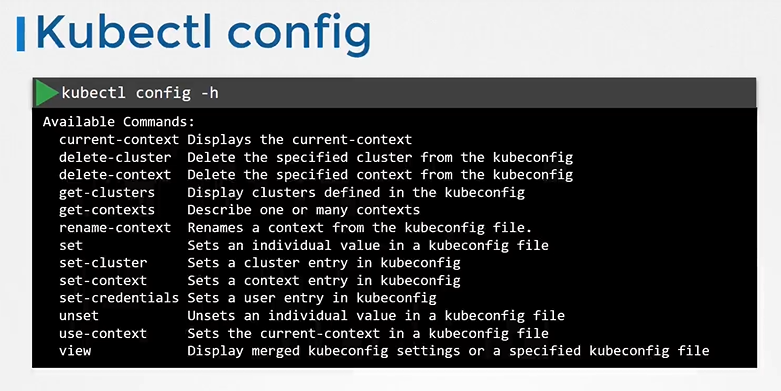

### 8.4 Setting Namespaces within Contexts
Setting a default namespace in the context eliminates the need to specify `--namespace=<name>` or `-n <name>` with every `kubectl` command:

```yaml
contexts:
- name: dev-context
  context:
    cluster: my-cluster
    user: dev-user
    namespace: backend-apps
```

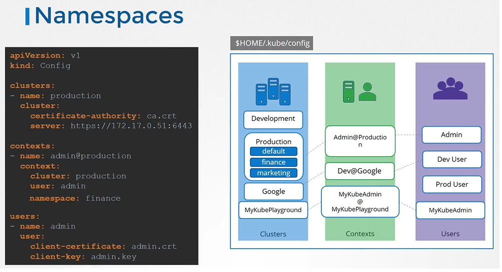

### 8.5 Embedding Certificate Data (`certificate-authority-data`)
Instead of referencing absolute file paths via `certificate-authority`, `client-certificate`, and `client-key`:

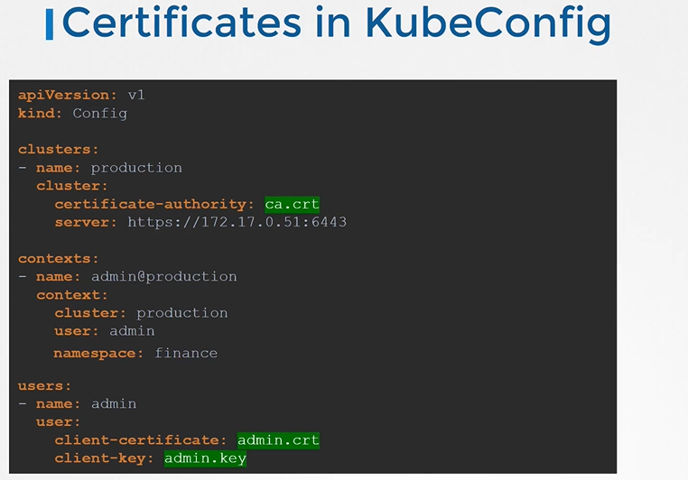

You can embed raw certificate and key data directly into the KubeConfig using base64 encoding:
- `certificate-authority-data`
- `client-certificate-data`
- `client-key-data`

```bash
# Encode certificate file to base64
cat ca.crt | base64 -w 0
```

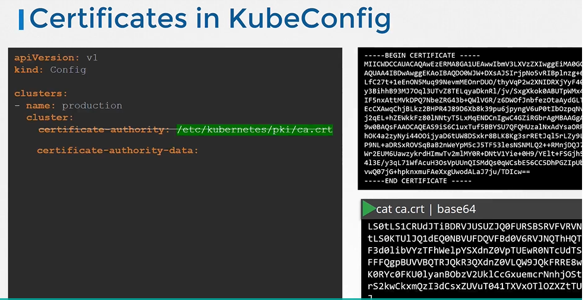

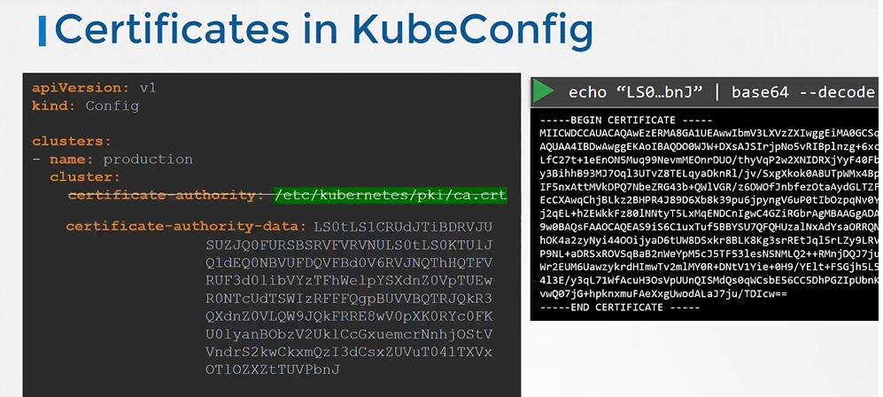

---

## 9. Kubernetes API Groups

The Kubernetes API exposes all cluster operations over HTTP endpoints grouped logically by purpose.


### 9.1 API Group Structure: Core (`/api/v1`) vs. Named Groups (`/apis/`)
- **System Endpoints:** `/version`, `/metrics`, `/healthz`, `/livez`, `/readyz`, `/logs`.
- **Core Group (`/api/v1`):** Legacy root endpoint without a group name prefix. Contains fundamental objects:
  - `pods`, `services`, `nodes`, `namespaces`, `configmaps`, `secrets`, `persistentvolumes`, `persistentvolumeclaims`, `events`, `endpoints`.

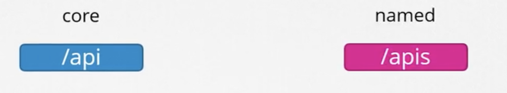

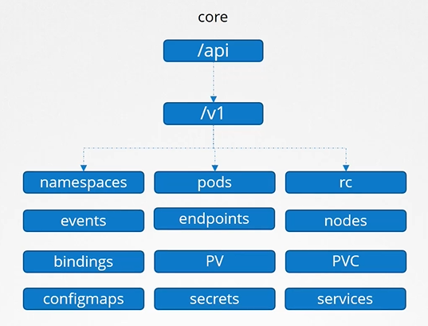

- **Named Groups (`/apis/<group>/<version>`):** Modular API groups created for modern extensions:
  - `apps/v1`: `deployments`, `daemonsets`, `statefulsets`, `replicasets`.
  - `networking.k8s.io/v1`: `networkpolicies`, `ingresses`.
  - `rbac.authorization.k8s.io/v1`: `roles`, `rolebindings`, `clusterroles`, `clusterrolebindings`.
  - `certificates.k8s.io/v1`: `certificatesigningrequests`.
  - `storage.k8s.io/v1`: `storageclasses`, `volumeattachments`.

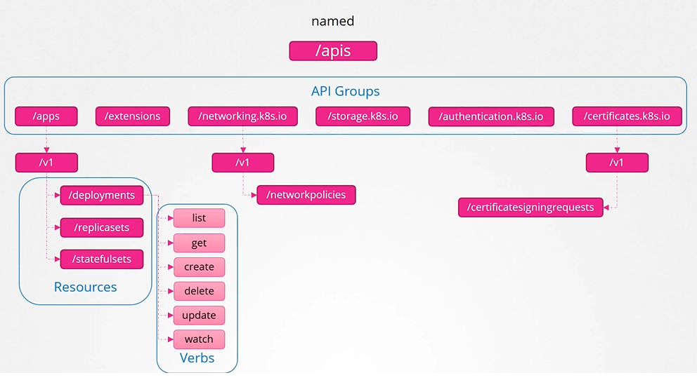

### 9.2 Resources, Subresources, and Verbs
Each resource exposes operations known as **verbs**:
- `get`, `list`, `watch`, `create`, `update`, `patch`, `delete`.
- Some resources have subresources (e.g., `pods/log`, `pods/exec`, `pods/status`).


Querying supported API groups directly from the API server:
```bash
curl https://master-node:6443/apis -k
```

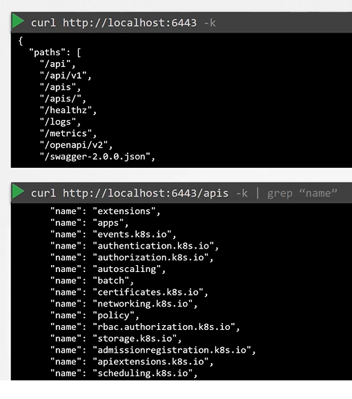

### 9.3 Accessing the API: `curl` vs. `kubectl proxy` vs. `kube-proxy`
Direct REST queries with `curl` require passing all client certificate and CA flags:

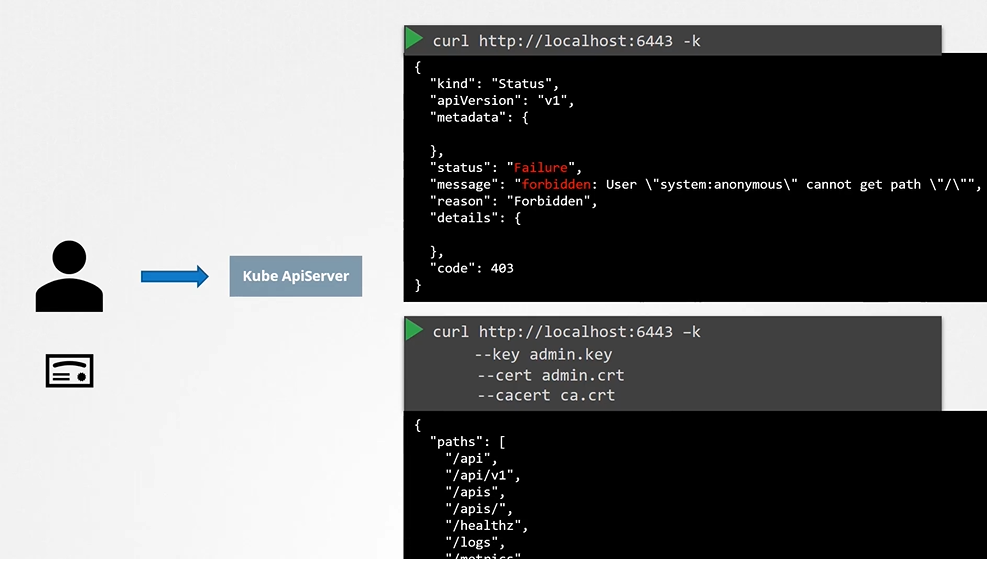

To simplify programmatic access, start a local **`kubectl proxy`**:
```bash
kubectl proxy --port=8001
```
`kubectl proxy` listens locally on `127.0.0.1:8001`, reads credentials from `~/.kube/config`, handles authentication automatically, and proxies requests to `kube-apiserver`.

```bash
curl http://localhost:8001/api/v1/pods
```

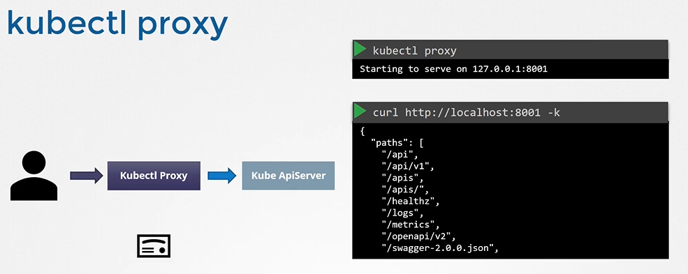

> [!IMPORTANT]
> **`kubectl proxy` vs. `kube-proxy`:**
> - **`kubectl proxy`:** An HTTP proxy utility run by operators/scripts to access the `kube-apiserver` without handling TLS certs manually.
> - **`kube-proxy`:** A core networking daemon running on every worker node that programs `iptables`/IPVS rules to implement Kubernetes Service virtual IPs and load balancing.


---

## 10. Authorization

Once a request is successfully authenticated, **Authorization** determines whether the caller has permission to perform the requested verb on the target resource.

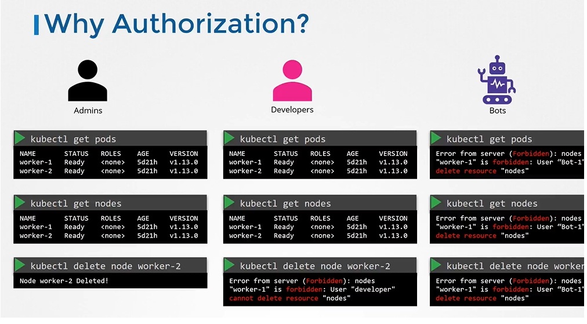

### 10.1 Why Authorization is Needed
Without authorization, any authenticated user can perform any operation (including deleting namespaces or draining nodes). Authorization enforces least privilege:
- Restricting developers to specific namespaces.
- Preventing automated service accounts from accessing sensitive secrets.
- Restricting nodes to only accessing pods running on themselves.

### 10.2 Supported Authorization Modes

1. **Node Authorization (`Node`):**
   - Specifically authorizes requests originating from kubelets.
   - Kubelets must authenticate with `CN=system:node:<node-name>` in group `system:nodes`.
   - Permits reading services, endpoints, pods, and writing node status.

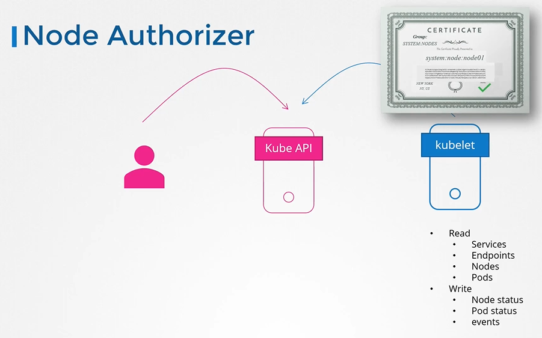

2. **Attribute-Based Access Control (`ABAC`):**
   - Maps users to permissions via a static JSON policy file.
   - Requires editing the policy file on disk and restarting `kube-apiserver` for every change; difficult to manage.

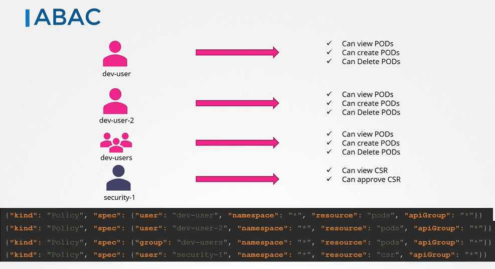

3. **Role-Based Access Control (`RBAC`):**
   - Dynamically configures permissions using native Kubernetes API objects (`Role`, `ClusterRole`, `RoleBinding`, `ClusterRoleBinding`).
   - Highly flexible, manageable via `kubectl`, and the standard industry best practice.

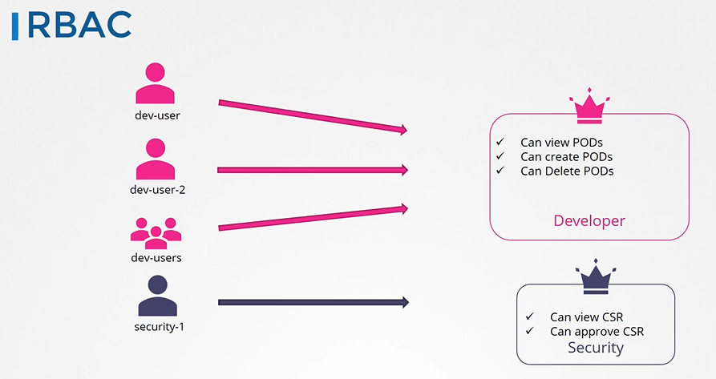

4. **Webhook Authorization (`Webhook`):**
   - Delegates authorization decisions to an external HTTP webhook service (e.g., Open Policy Agent - OPA).

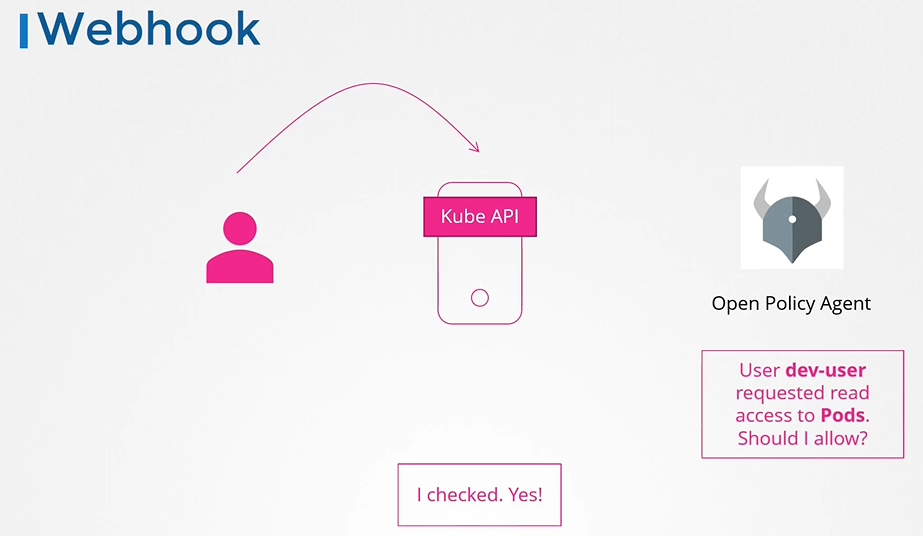

5. **AlwaysAllow & AlwaysDeny:**
   - Testing modes that unconditionally permit or reject all requests.

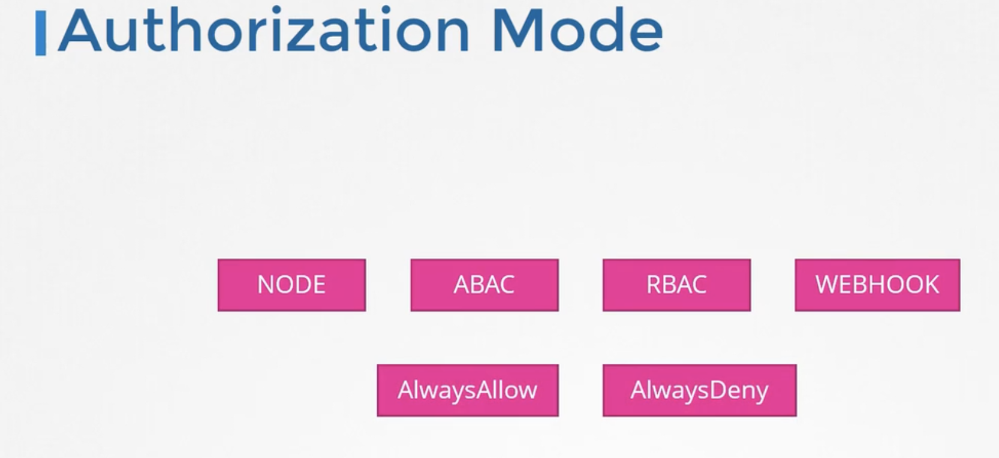

### 10.3 Evaluation Chain & Ordering (`--authorization-mode`)
Authorization modes are configured as a comma-separated list on `kube-apiserver`:
```bash
kube-apiserver --authorization-mode=Node,RBAC,Webhook
```

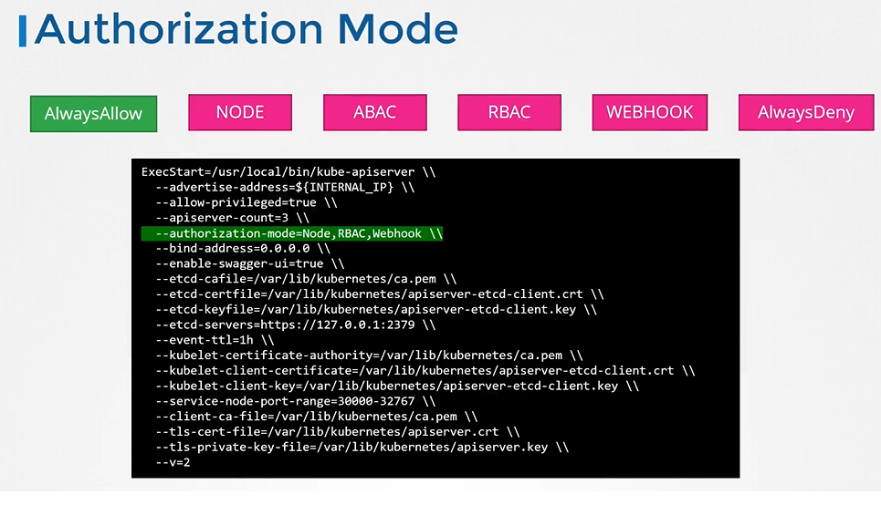

**Evaluation Flow:**
- Modules are evaluated sequentially in the configured order.
- If a module **approves** the request, access is granted immediately without evaluating subsequent modules.
- If a module **denies** or has no opinion, the request is passed down to the next module.
- If all modules deny or reach the end of the chain without approval, the request is rejected with **HTTP 403 Forbidden**.

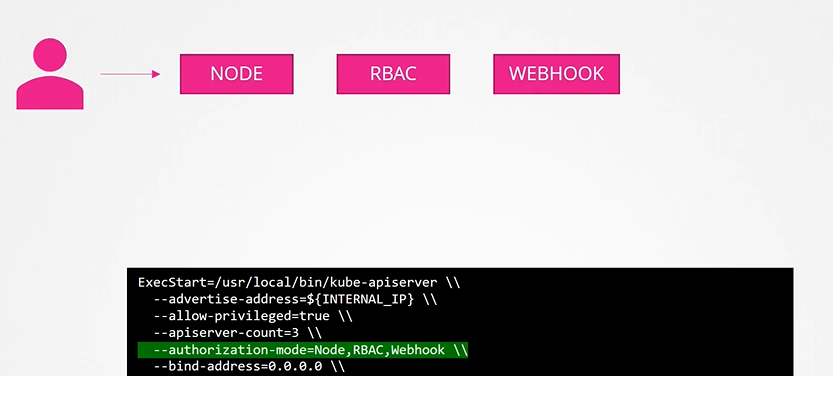

---

## 11. Role-Based Access Control (RBAC)

RBAC controls access to cluster resources by defining roles containing rules, and binding users, groups, or ServiceAccounts to those roles.

### 11.1 Roles & RoleBindings (Namespaced)
A **Role** defines allowed operations within a specific namespace.

```yaml
apiVersion: rbac.authorization.k8s.io/v1
kind: Role
metadata:
  namespace: default
  name: developer
rules:
- apiGroups: [""] # Core API group
  resources: ["pods"]
  verbs: ["get", "list", "create", "update", "delete"]
- apiGroups: [""]
  resources: ["configmaps"]
  verbs: ["create"]
```

Apply the Role:
```bash
kubectl apply -f developer-role.yaml
```

A **RoleBinding** assigns the Role to subjects (Users, Groups, or ServiceAccounts) in that namespace:

```yaml
apiVersion: rbac.authorization.k8s.io/v1
kind: RoleBinding
metadata:
  name: devuser-developer-binding
  namespace: default
subjects:
- kind: User
  name: dev-user
  apiGroup: rbac.authorization.k8s.io
roleRef:
  kind: Role
  name: developer
  apiGroup: rbac.authorization.k8s.io
```

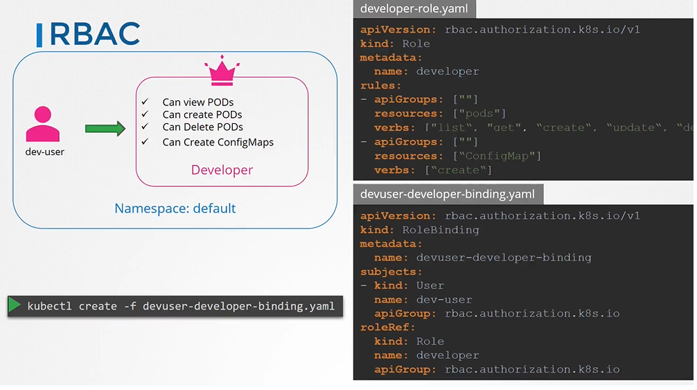

Inspection commands:
```bash
kubectl get roles
kubectl get rolebindings
kubectl describe role developer
kubectl describe rolebinding devuser-developer-binding
```

### 11.2 Checking Permissions with `kubectl auth can-i`
Verify authorization rules directly without logging in as another user:

```bash
# Check your own permissions
kubectl auth can-i create deployments
kubectl auth can-i delete nodes

# Impersonate another user (requires admin rights)
kubectl auth can-i create deployments --as dev-user
kubectl auth can-i create pods --as dev-user

# Check permissions in a specific namespace
kubectl auth can-i create pods --as dev-user --namespace test
```

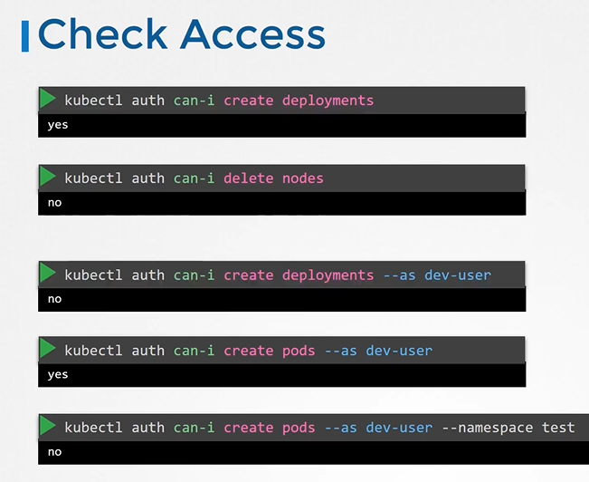

### 11.3 Scoping Access to Specific `resourceNames`
To restrict permissions to specific named instances of a resource:

```yaml
apiVersion: rbac.authorization.k8s.io/v1
kind: Role
metadata:
  name: pod-manager
  namespace: default
rules:
- apiGroups: [""]
  resources: ["pods"]
  verbs: ["get", "update", "delete"]
  resourceNames: ["blue-app", "orange-app"]
```
This rule permits operations only on pods named `blue-app` and `orange-app`. Note that verbs like `list` and `create` cannot be scoped by `resourceNames`.

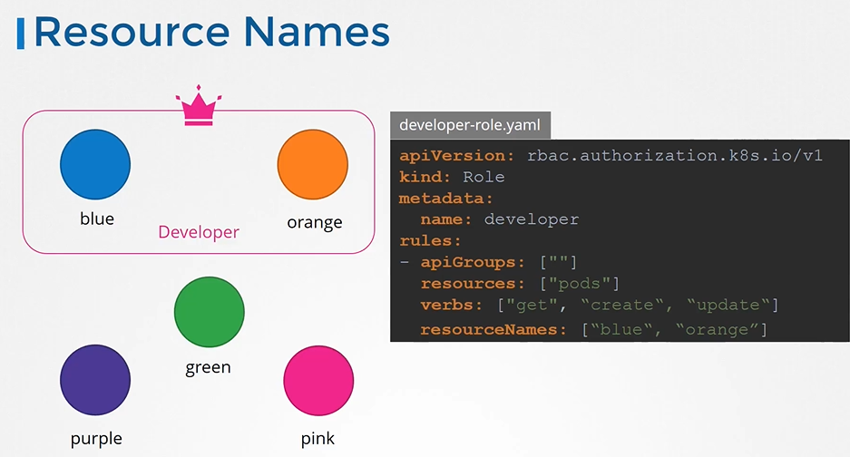

---

## 12. ClusterRoles & ClusterRoleBindings

While `Role` and `RoleBinding` are scoped to a single namespace, cluster-wide resources require `ClusterRole` and `ClusterRoleBinding`.

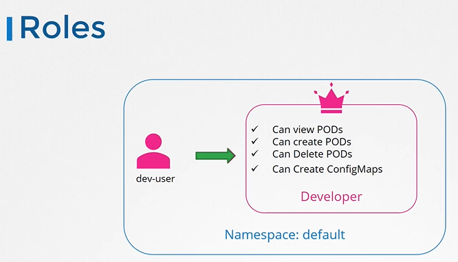

### 12.1 Cluster-Scoped vs. Namespaced Resources
- **Namespaced Resources:** `pods`, `services`, `deployments`, `configmaps`, `secrets`, `jobs`, `roles`, `rolebindings`.
- **Cluster-Scoped Resources:** `nodes`, `persistentvolumes`, `clusterroles`, `clusterrolebindings`, `certificatesigningrequests`, `namespaces`, `storageclasses`.

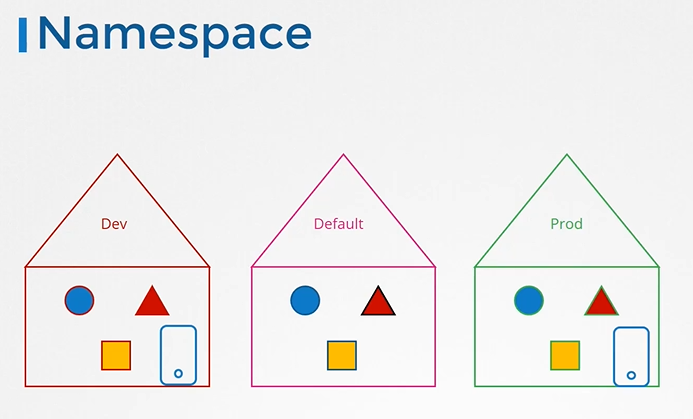

Check resource scoping via `kubectl api-resources`:
```bash
# List namespaced resources
kubectl api-resources --namespaced=true

# List cluster-scoped resources
kubectl api-resources --namespaced=false
```

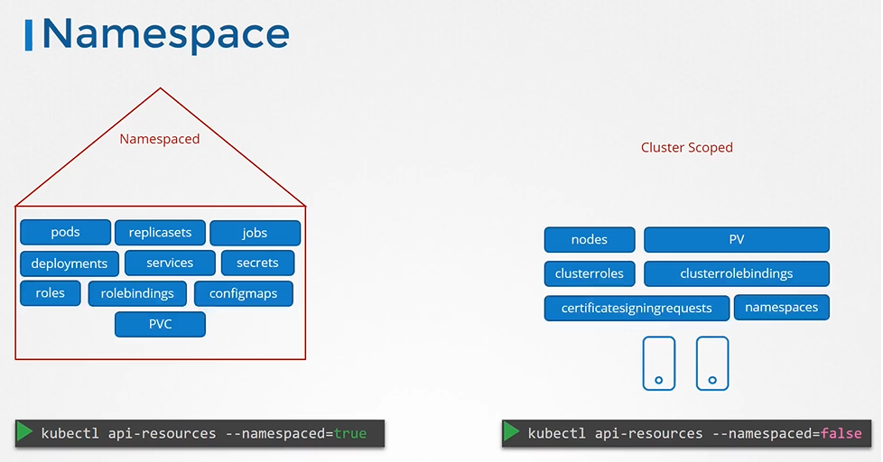

### 12.2 Creating ClusterRoles & ClusterRoleBindings
ClusterRoles are defined without a `metadata.namespace` field:

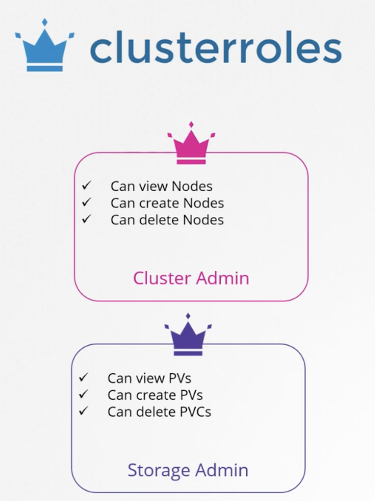

```yaml
apiVersion: rbac.authorization.k8s.io/v1
kind: ClusterRole
metadata:
  name: node-admin
rules:
- apiGroups: [""]
  resources: ["nodes"]
  verbs: ["get", "list", "create", "delete"]
---
apiVersion: rbac.authorization.k8s.io/v1
kind: ClusterRoleBinding
metadata:
  name: node-admin-binding
subjects:
- kind: User
  name: cluster-admin
  apiGroup: rbac.authorization.k8s.io
roleRef:
  kind: ClusterRole
  name: node-admin
  apiGroup: rbac.authorization.k8s.io
```

### 12.3 Using ClusterRoles for Namespaced Resources Across All Namespaces
ClusterRoles can also define permissions for namespaced resources (e.g., `pods`, `deployments`):
- If bound via **`ClusterRoleBinding`**: The user receives access to that resource across **all namespaces** in the entire cluster.
- If bound via **`RoleBinding`**: The permissions in the ClusterRole are scoped **strictly to the namespace** of that RoleBinding.

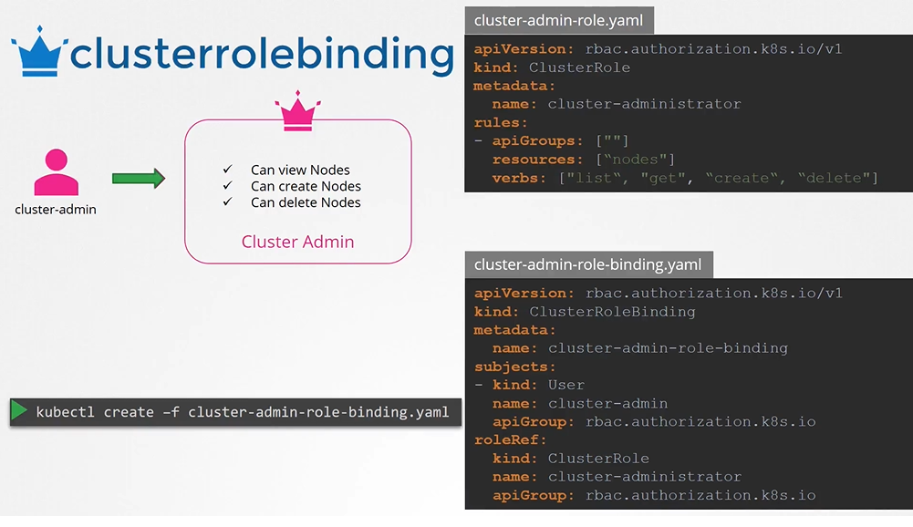

### 12.4 Practice Lab: Storage Administrator Role
**Task:** Authorize user `michelle` as storage administrator with full access to `persistentvolumes` and `storageclasses`.

```yaml
apiVersion: rbac.authorization.k8s.io/v1
kind: ClusterRole
metadata:
  name: storage-admin
rules:
- apiGroups: [""]
  resources: ["persistentvolumes"]
  verbs: ["get", "watch", "list", "create", "delete"]
- apiGroups: ["storage.k8s.io"]
  resources: ["storageclasses"]
  verbs: ["get", "watch", "list", "create", "delete"]
---
apiVersion: rbac.authorization.k8s.io/v1
kind: ClusterRoleBinding
metadata:
  name: michelle-storage-admin
subjects:
- kind: User
  name: michelle
  apiGroup: rbac.authorization.k8s.io
roleRef:
  kind: ClusterRole
  name: storage-admin
  apiGroup: rbac.authorization.k8s.io
```

---

## 13. ServiceAccounts

ServiceAccounts provide an identity for processes and applications running inside pods to interact with the Kubernetes API server.

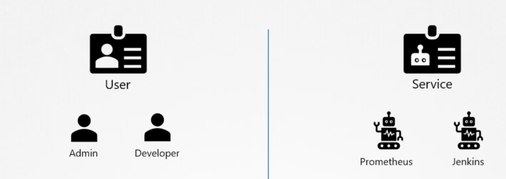

### 13.1 User Accounts vs. ServiceAccounts
- **Users:** Used by human administrators and developers.
- **ServiceAccounts:** Used by in-cluster applications (e.g., Prometheus, custom dashboards, operators) or external CI/CD tools.

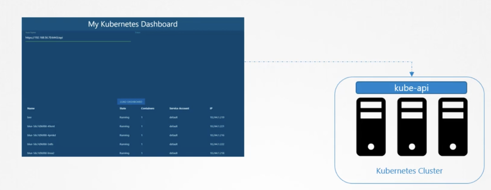

Create and view ServiceAccounts:
```bash
kubectl create serviceaccount dashboard-sa
kubectl get serviceaccounts
```

### 13.2 Legacy ServiceAccount Mechanism (Secret-based Tokens)
In older Kubernetes releases (< v1.24), creating a ServiceAccount automatically created a non-expiring Secret containing a bearer token:

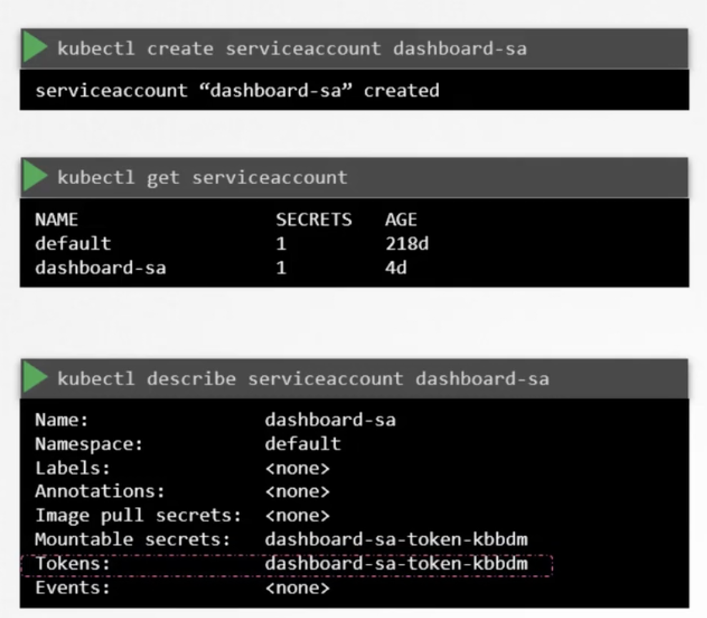

Inspect the generated token:
```bash
kubectl describe secret dashboard-sa-token-kbbdm
```

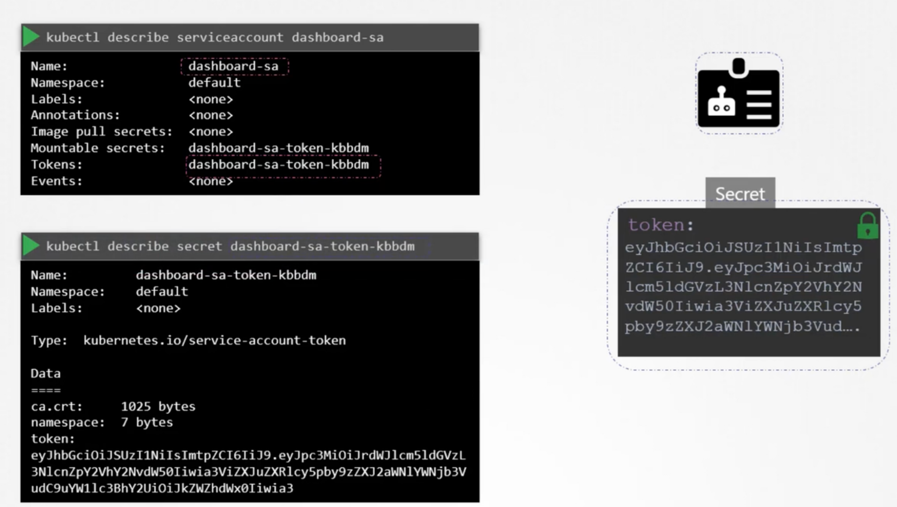

Authenticate against the API using the token:
```bash
curl https://192.168.56.70:6443/api/v1/pods   --insecure   --header "Authorization: Bearer <TOKEN_STRING>"
```

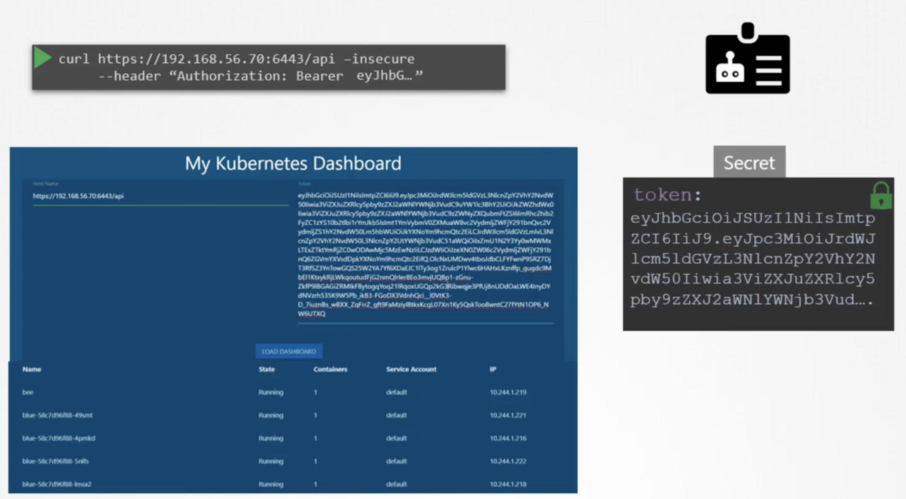

### 13.3 Mounting ServiceAccount Tokens in Pods
Every namespace has a `default` ServiceAccount. By default, every pod created without an explicit `serviceAccountName` automatically mounts the `default` ServiceAccount token as a volume at `/var/run/secrets/kubernetes.io/serviceaccount`:

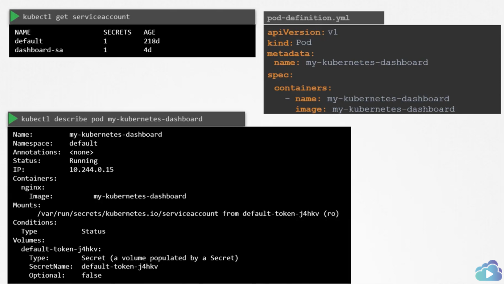

The mounted volume directory contains three files:
1. `token`: JWT bearer token.
2. `ca.crt`: Cluster root CA certificate used to verify the API server.
3. `namespace`: The pod's own namespace.

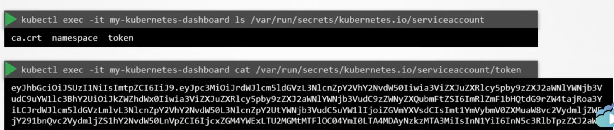

To configure a pod with a custom ServiceAccount:
```yaml
apiVersion: v1
kind: Pod
metadata:
  name: dashboard-pod
spec:
  serviceAccountName: dashboard-sa
  containers:
  - name: dashboard
    image: custom-dashboard
```

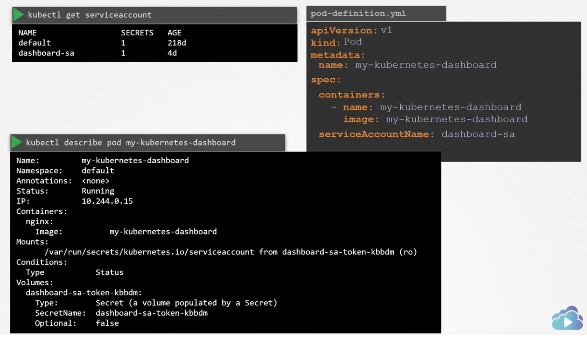

> [!NOTE]
> To prevent tokens from being automatically mounted in pods that do not interact with the API, set:
> ```yaml
> automountServiceAccountToken: false
> ```
> This can be specified either on the `ServiceAccount` manifest or in the pod's `spec`.

### 13.4 Practice Lab: Web Dashboard Deployment with ServiceAccount

1. Bind the `dashboard-sa` ServiceAccount to a Role:
```yaml
apiVersion: rbac.authorization.k8s.io/v1
kind: RoleBinding
metadata:
  name: read-pods
  namespace: default
subjects:
- kind: ServiceAccount
  name: dashboard-sa
  namespace: default
roleRef:
  kind: Role
  name: pod-reader
  apiGroup: rbac.authorization.k8s.io
```

2. Update the Deployment to mount `dashboard-sa`:
```yaml
apiVersion: apps/v1
kind: Deployment
metadata:
  name: web-dashboard
  namespace: default
spec:
  replicas: 1
  selector:
    matchLabels:
      name: web-dashboard
  template:
    metadata:
      labels:
        name: web-dashboard
    spec:
      serviceAccountName: dashboard-sa
      containers:
      - name: web-dashboard
        image: gcr.io/kodekloud/customimage/my-kubernetes-dashboard
        ports:
        - containerPort: 8080
          protocol: TCP
```

---

## 14. Modern Projected ServiceAccount Tokens (`TokenRequest` API)

Starting in **Kubernetes 1.24+**, ServiceAccount tokens are no longer stored in unbounded, non-expiring Secrets by default. Kubernetes uses the **`TokenRequest` API** and **Projected Volumes**.

### 14.1 Key Differences: Legacy (< v1.24) vs. Modern (v1.24+)

| Feature | Legacy (< v1.24) | Modern (v1.24+) |
| :--- | :--- | :--- |
| **Creation** | Auto-created Secret alongside ServiceAccount | Generated on demand via `TokenRequest` API |
| **Expiration** | Non-expiring (valid until Secret deleted) | Time-bound (default 1 hour), automatically rotated |
| **Audience** | Unrestricted / cluster-wide | Audience-bound (`--audience`, e.g., Vault, AWS IAM) |
| **Storage** | Persisted permanently in ETCD Secrets | Ephemeral; dynamically projected into pod memory |

### 14.2 Imperative Token Generation (`kubectl create token`)
Generate short-lived tokens on demand:
```bash
# Request a token for serviceaccount 'dashboard-sa' with a 2-hour validity
kubectl create token dashboard-sa --duration=2h

# Generate a token with a custom audience for cloud IAM or HashiCorp Vault federation
kubectl create token dashboard-sa --audience=https://vault.internal --duration=30m
```

### 14.3 Manually Creating Permanent ServiceAccount Secrets
If legacy CI/CD pipelines require a static, non-expiring token:
```yaml
apiVersion: v1
kind: Secret
metadata:
  name: dashboard-sa-token
  namespace: default
  annotations:
    kubernetes.io/service-account.name: "dashboard-sa"
type: kubernetes.io/service-account-token
```
Applying this Secret prompts the Kubernetes token controller to populate `token` and `ca.crt` in the Secret data.

### 14.4 Projected Volume Syntax in Pods
Modern pods inject audience-bound, rotating tokens using projected volumes:
```yaml
apiVersion: v1
kind: Pod
metadata:
  name: secure-app
spec:
  containers:
  - name: app
    image: alpine
    command: ["sleep", "3600"]
    volumeMounts:
    - mountPath: /var/run/secrets/tokens
      name: vault-token
  volumes:
  - name: vault-token
    projected:
      sources:
      - serviceAccountToken:
          path: vault-token
          expirationSeconds: 7200
          audience: https://vault.internal
```

---

## 15. Image Security & Private Registries

Containers in pods are instantiated from container images stored in public or private image registries.

### 15.1 Container Image Naming Conventions & Registries
An image reference follows the standard format:
```text
[registry-domain/][account-or-namespace/]image-name[:tag]
```

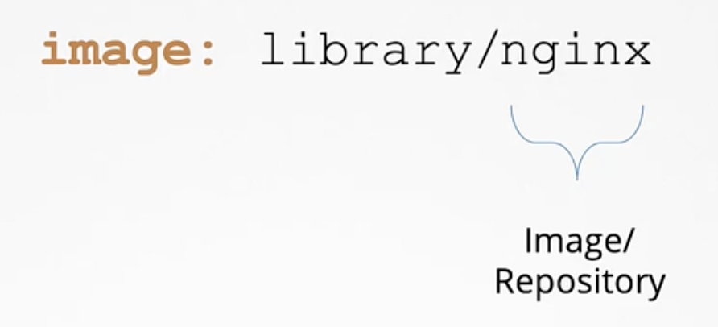

- `nginx`: Resolves to `docker.io/library/nginx:latest` (Docker Hub official library).
- `gcr.io/google-containers/pause:3.2`: Google Container Registry.
- `private-registry.io/apps/internal-app:v1`: Private corporate registry.

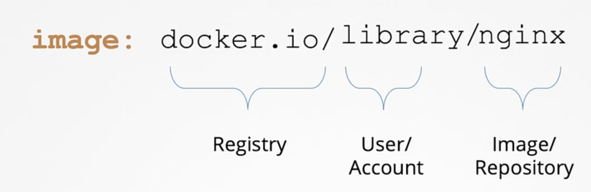

### 15.2 Authenticating to Private Registries (`docker-registry` Secret)
When pulling images from a private registry requiring credentials:

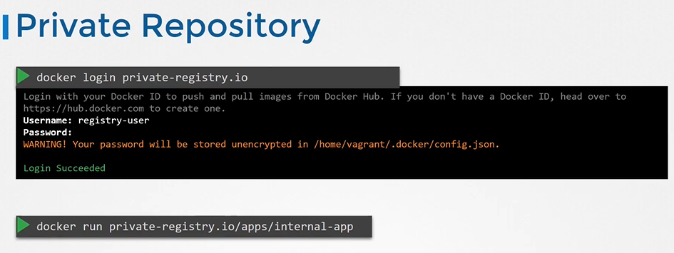

Create a Secret of type `kubernetes.io/dockerconfigjson`:
```bash
kubectl create secret docker-registry regcred   --docker-server=private-registry.io   --docker-username=registry-user   --docker-password=registry-password   --docker-email=registry-user@org.com
```

### 15.3 Specifying `imagePullSecrets` in Pods
Reference the Secret in the pod's `spec.imagePullSecrets`:

```yaml
apiVersion: v1
kind: Pod
metadata:
  name: internal-app-pod
spec:
  containers:
  - name: app
    image: private-registry.io/apps/internal-app:v1
  imagePullSecrets:
  - name: regcred
```

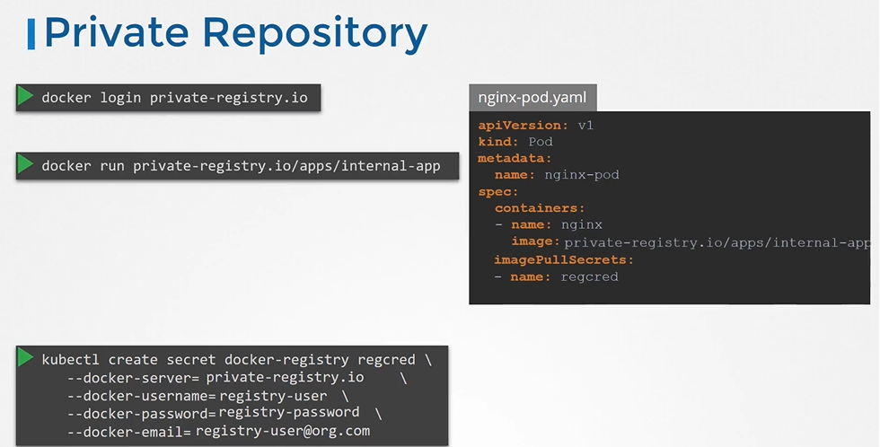

---

## 16. Security Contexts

Security contexts define privilege and access control settings for pods and containers.

### 16.1 Pod-Level vs. Container-Level Security Contexts
- **Pod-Level (`spec.securityContext`):** Applies security settings across all containers inside the pod.
- **Container-Level (`spec.containers[].securityContext`):** Applies settings to an individual container, overriding conflicting pod-level settings.

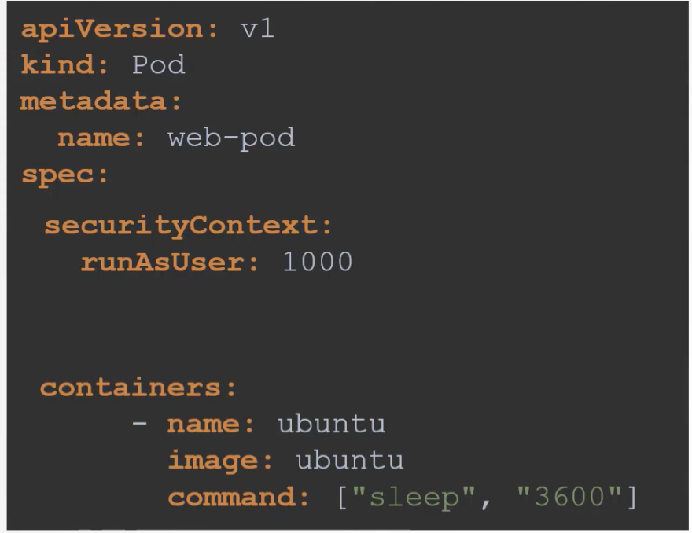

### 16.2 User IDs (`runAsUser`) & Linux Capabilities (`add`/`drop`)
Linux capabilities allow fine-grained privilege assignment instead of giving full root access. Capabilities can **only be defined at the container level**.

```yaml
apiVersion: v1
kind: Pod
metadata:
  name: secured-pod
spec:
  securityContext:
    runAsUser: 1000
    runAsGroup: 3000
  containers:
  - name: ubuntu-app
    image: ubuntu
    command: ["sleep", "3600"]
    securityContext:
      runAsUser: 2000 # Overrides pod-level runAsUser
      allowPrivilegeEscalation: false
      readOnlyRootFilesystem: true
      capabilities:
        add: ["NET_ADMIN", "SYS_TIME"]
        drop: ["ALL"]
```

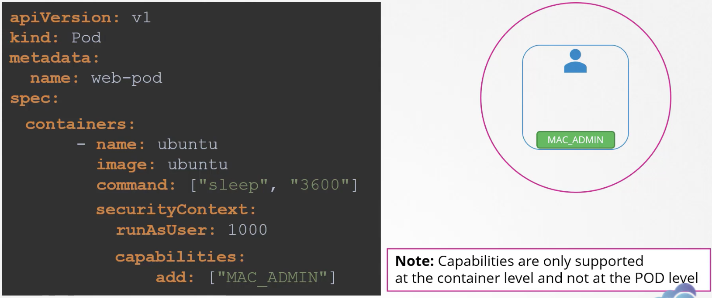

---

## 17. Network Policies

Network policies control traffic flow at the IP and port level (OSI Layer 3/4) between pods and external endpoints.

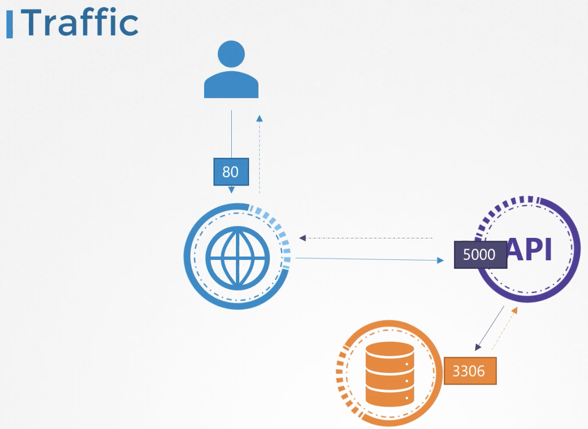

### 17.1 Traffic Flow Fundamentals: Ingress & Egress
- **Ingress:** Incoming traffic originating from an outside source towards the pod.
- **Egress:** Outgoing traffic originating from the pod towards an external destination.
- **Stateful Responses:** Network policies are stateful. If ingress traffic is allowed, the corresponding response back to the client is automatically permitted without requiring an egress rule.

### 17.2 Default Kubernetes Network Security Model
By default, Kubernetes implements an **All-Allow** network model: all pods can communicate with all other pods across all nodes and namespaces without restriction.

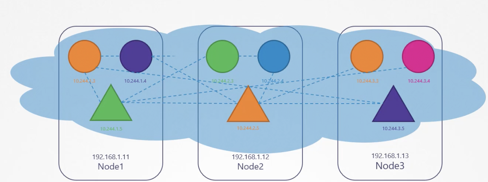

Applying a `NetworkPolicy` to a pod switches it to **Isolated** mode: any traffic not explicitly matched by an ingress or egress rule is dropped.

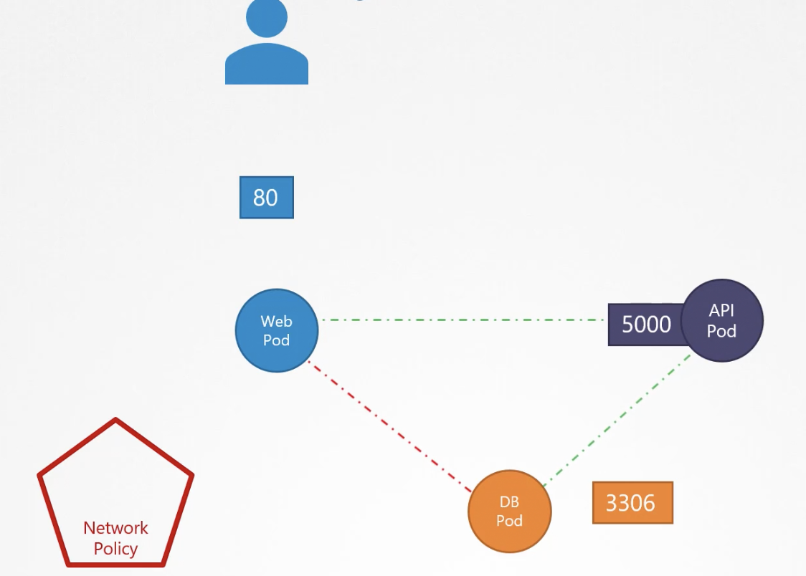

### 17.3 NetworkPolicy Manifest Structure
A NetworkPolicy links to target pods using `podSelector` labels:

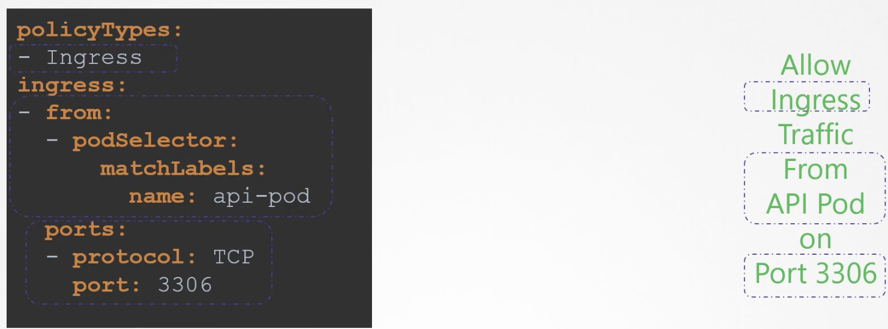

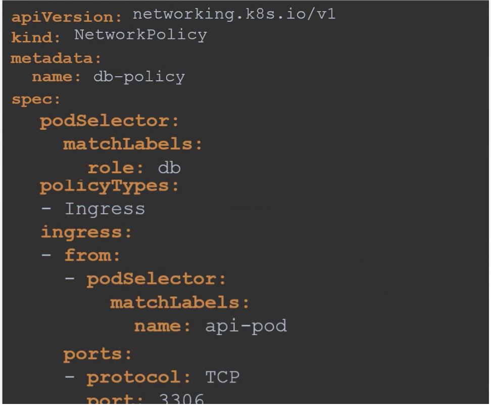

```yaml
apiVersion: networking.k8s.io/v1
kind: NetworkPolicy
metadata:
  name: db-policy
  namespace: prod
spec:
  podSelector:
    matchLabels:
      role: db
  policyTypes:
  - Ingress
  ingress:
  - from:
    - podSelector:
        matchLabels:
          role: api
    ports:
    - protocol: TCP
      port: 3306
```

### 17.4 Developing Complex Network Policies
The `from` and `to` sections support three selector types:
1. **`podSelector`:** Selects pods within the same namespace.
2. **`namespaceSelector`:** Selects all pods within namespaces matching the label.
3. **`ipBlock`:** Selects external CIDR IP ranges (outside the cluster).

#### Combining Selectors: AND vs. OR Logic

- **AND Condition (Same list item without dash):**
```yaml
  ingress:
  - from:
    - namespaceSelector:
        matchLabels:
          environment: prod
      podSelector:
        matchLabels:
          role: api
```
*Meaning:* Traffic is allowed ONLY from pods with `role=api` THAT ARE ALSO inside namespaces with `environment=prod`.

- **OR Condition (Separate list items with dashes):**
```yaml
  ingress:
  - from:
    - namespaceSelector:
        matchLabels:
          environment: prod
    - podSelector:
        matchLabels:
          role: api
    - ipBlock:
        cidr: 192.168.5.10/32
```
*Meaning:* Traffic is allowed from ANY pod in `environment=prod` namespaces, OR ANY pod with `role=api` in the local namespace, OR the external IP `192.168.5.10`.

#### Egress Policy Example
```yaml
apiVersion: networking.k8s.io/v1
kind: NetworkPolicy
metadata:
  name: db-backup-egress
  namespace: prod
spec:
  podSelector:
    matchLabels:
      role: db
  policyTypes:
  - Egress
  egress:
  - to:
    - ipBlock:
        cidr: 192.168.10.0/24
    ports:
    - protocol: TCP
      port: 80
```

### 17.5 CNI Plugin Network Policy Support
Network policies are enforced by the cluster CNI network plugin, not by kube-apiserver:
- **Supported Plugins:** Calico, Cilium, Weave-Net, Kube-router.
- **Unsupported Plugins:** Flannel (unless paired with Calico for network policy enforcement).
- If a NetworkPolicy is created on a cluster without network policy support, the object will be created successfully in ETCD but will have **no enforcement effect**.

---

## 18. Kubectx and Kubens CLI Utilities

Managing multiple contexts and namespaces via standard `kubectl config` commands can be cumbersome during administrative operations.

### 18.1 `kubectx`: Fast Context Switching
- List all contexts: `kubectx`
- Switch to context: `kubectx <context_name>`
- Switch back to previous context: `kubectx -`
- Display current context: `kubectx -c`

### 18.2 `kubens`: Fast Namespace Switching
- List all namespaces: `kubens`
- Switch active namespace: `kubens <namespace>`
- Switch back to previous namespace: `kubens -`

---

## 19. Admission Controllers

An **Admission Controller** intercepts requests to the Kubernetes API server **after** authentication and authorization, but **before** the object state is committed to ETCD.

### 19.1 Admission Controller Lifecycle & Phases
Incoming requests follow a strict sequence:
1. **Authentication & Authorization:** Validates caller identity and RBAC permissions.
2. **Mutating Admission:** Can modify or patch the incoming object (e.g., injecting default sidecar containers, assigning default storage classes).
3. **Object Schema Validation:** Verifies structural schema conformity against OpenAPI definitions.
4. **Validating Admission:** Accepts or rejects the request based on custom policies (e.g., disallowing privileged containers, enforcing security labels).
5. **Persistence:** Commits validated resource to ETCD.

### 19.2 Common Built-in Admission Plugins
- **`NodeRestriction`:** Restricts kubelets to only modifying their own Node and Pod resources.
- **`AlwaysPullImages`:** Mutates every created pod to enforce `imagePullPolicy: Always`.
- **`LimitRanger`:** Enforces default, min, and max compute constraints defined by `LimitRange` objects.
- **`ResourceQuota`:** Validates namespace resource quotas, rejecting creation if limits are exceeded.
- **`NamespaceLifecycle`:** Prevents object creation in non-existent or terminating namespaces; forbids deleting default namespaces (`default`, `kube-system`, `kube-public`).
- **`DefaultStorageClass`:** Mutates PVCs created without an explicit `storageClassName` to use the cluster default.

### 19.3 Viewing & Configuring Admission Plugins in `kube-apiserver`
Admission plugins are enabled and disabled via flags on the `kube-apiserver` manifest (`/etc/kubernetes/manifests/kube-apiserver.yaml`):

```yaml
spec:
  containers:
  - command:
    - kube-apiserver
    - --enable-admission-plugins=NodeRestriction,LimitRanger,ResourceQuota,AlwaysPullImages
    - --disable-admission-plugins=DefaultStorageClass
```

### 19.4 Inspection Commands
```bash
# Check default enabled plugins on the binary
kube-apiserver -h | grep enable-admission-plugins

# Query running kube-apiserver pod arguments
kubectl get pod -n kube-system kube-apiserver-controlplane -o jsonpath='{.spec.containers[0].command}' | tr -s ' ' '
' | grep admission
```

---

## 20. Pod Security Standards (PSS) & Admission (PSA)

In Kubernetes 1.25+, the built-in **Pod Security Admission (PSA)** controller replaced the legacy, deprecated `PodSecurityPolicy` (PSP).

### 20.1 PSS Levels: Privileged, Baseline, Restricted
Pod Security Standards define three policy profiles:

1. **`Privileged`:** Completely unrestricted. Allows root execution, host namespaces (`hostPID`, `hostNetwork`), privileged containers, and arbitrary capabilities.
2. **`Baseline`:** Minimally restrictive policy. Prevents known privilege escalations (forbids `privileged: true`, `hostPID`, `hostNetwork`), but permits running as root.
3. **`Restricted`:** Hardened cloud-native best practice. Mandates rootless execution (`runAsNonRoot: true`), drops all default capabilities except `NET_BIND_SERVICE`, forbids privilege escalation, and enforces read-only root filesystems.

### 20.2 PSA Namespace Labels & Modes (`enforce`, `audit`, `warn`)
PSA is configured declaratively using namespace labels:

```yaml
apiVersion: v1
kind: Namespace
metadata:
  name: production-secure
  labels:
    pod-security.kubernetes.io/enforce: restricted
    pod-security.kubernetes.io/enforce-version: latest
    pod-security.kubernetes.io/audit: restricted
    pod-security.kubernetes.io/warn: restricted
```

**Modes:**
- **`enforce`:** Rejects non-compliant pods during admission with an HTTP 403 error.
- **`audit`:** Permits non-compliant pods but logs an audit event for compliance tracking.
- **`warn`:** Emits a visible warning in the operator's terminal upon `kubectl apply` without rejecting the workload.
