# 07. Networking

## NETWORKING

### Prerequisite Switching, Routing, Gateways CNI in kubernetes

We look at basic networking concepts like Switching, Routing, Gateways etc. We then understand DNS, and then we get a basic introduction to core DNS.

We look at how to configure DNS settings on a Linux system within understand basics of network namespace in Linux.

I am not going to bore you with theories on OSI models or network layers. We're just brushing up enough networking to understand the rest of the section in this course. Now we don't just go through the concepts.

We see how these are configured on our systems specifically from a Linux perspective. So there are going to be a lot of commands. We look at this from a system admins and the application developers perspective and not necessarily from a network engineers, that way later on when we discuss these in the context of our course you know what we were talking about where to look for information, where things are configured, how to troubleshoot etc. And of course as always if these seem to be too basic for you, if you or if you're already good with networking in Linux feel free to skip these lectures and go straight to the ones on Kubernetes.So let's get started… 

**So what is a Network?** 

We have two computers A & B – laptops, desktops, VMs on the cloud, wherever. How does system A reach B?

We connect them to a switch, and the switch creates a network containing the two systems. To connect them to a switch we need an interface on each host. Physical or virtual depending on the host to see the interfaces for the host. 

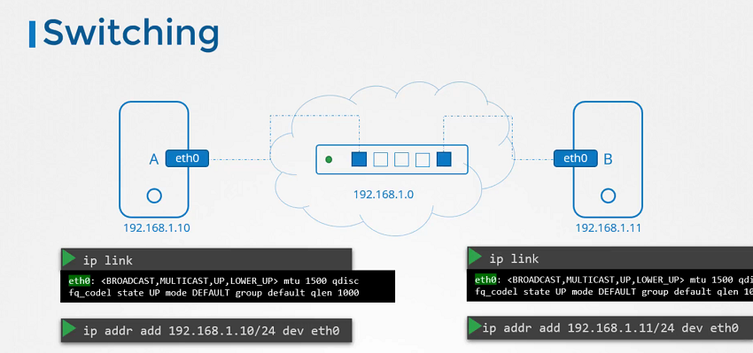

We can use the IP link command.  In this case, we look at the interface named eth0 that we will be using to connect to the switch. Let's assume it's a network with the address. 192.168.1.0.

We then assign the systems with IP addresses on the same network. For this, we use the command **ip addr**. Once the links are up, and the IP addresses are assigned The computers can now communicate with each other through the switch, the switch can only enable communication within and network which means it can receive packets from a host on the network and deliver it to other systems within the same network.

```text
$ ip link
$ ip addr
```

Say we have another network containing systems C & D at address 192.168.2.0.

The Systems have IP address 192.168.2.10 and 192.168.2.11 respectively.

**How does a system in one network reach a system in the other?**

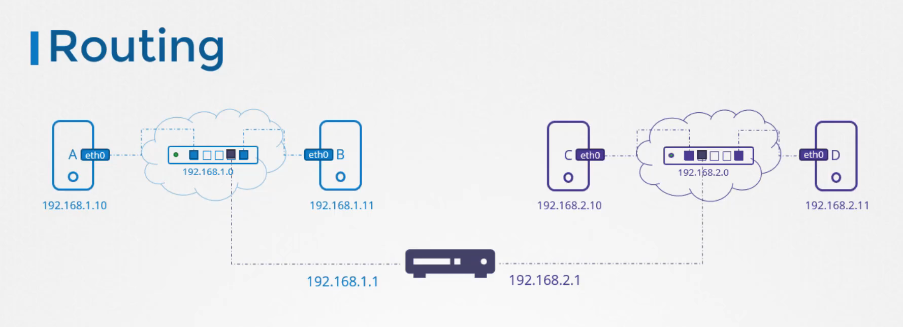

How does System B with the IP 192.168.1.11 reach system C with the IP 192.168.2.10 on the other network?

That’s where a Router comes in. **A Router helps connect two networks together**. It is an intelligent device, so think of it as another server with many network ports. Since it connects to the two separate networks, **it gets two IPs assigned**. One on each network. In the first network we assign it an IP address 192.168.1.1 and in the second we assign it an IP 192.168.2.1. Now we have a router connected to the two networks that can enable communication between them. 

When system B tries to send a packet to system C, how does it know where the router is on the network, to send the packet through.The router is just another device on the network there could be many other such devices. 

That’s where we configure the systems with a **gateway** or a route.  If the network was a room, the gateway is a door to the outside world to other networks or to the Internet. 

The systems need to know where that door is to go through that, to see the existing routing configurationon a system run the route command. It displays the kernels routing table and within that, as you can see there are no routing configurations as of now.

```text
$ route
```

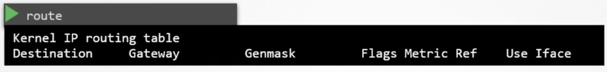

```bash
$ ip route showor $ ip route list
```

So in this condition your system B will not be able to reach system C it can only reach other systems within the same network in the range 192.168.1.0. 

To configure a gateway on system B to reach the systems on network 192.168.2.0, run the ip route add command, and specify that you can reach the 192.168.2.0 network through the door or gateway at 192.168.1.1 `$ ip route add 192.168.1.0/24 via 192.168.2.1`

Running the route command again shows that we have a route added to reach the 192.168.2.0 series network through the router.

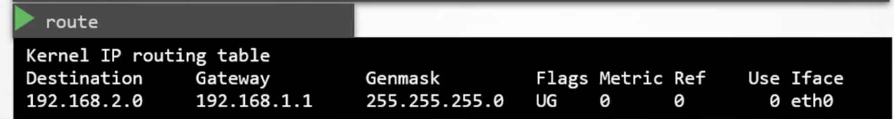

Now remember this has to be configured on all the systems. For example, if the system C is to send a packet to system B, then you need to add a route on system C’s routing table to access network 192.168.1.0 through the router configured with the IP address 192.168.2.1. Now suppose these systems need access to the Internet. 

Say they need access to Google at 172.217.194.0 network on the internet. So you connect the router to the internet. and then add a new route in your routing table to route all traffic to the network 172.217.194.0 through your router there are so many different sites on different networks on the Internet instead of adding a routing table entry for these same routers IP address for each of those networks you can simply say for any network that you don't know a route to use this router as the default gateway.

This way any request to any network outside of your existing network goes to this particular router.

So in a simple setup like this, all you need is a single routing table entry with a default gateway set to the router's IP address. 

Remember instead of the word default you could also say 0.0.0.0.0.

It means any IP destination.

Both of these lines mean the same thing. A 0.0.0.0 Entry in the Gateway field indicates that you don't need a gateway for example in this case for system C to access any devices in the 192.168.2.0 network. It doesn't need a gateway because it is in its own network. But say you have multiple routers in your network one for the Internet another for the internal private network then you will need to have two separate entries for each network.One entry for the internal private network and another entry with the default gateway for all other networks including public networks.

So if you are having issues reaching internet from your systems, This routing table and the default gateway configuration is a good place to start. 

 let us know look at how we can set up a linux host as a router. 

Let's start with a simple setup.

I have 3 hosts A, B and C. A & B are connected to a network 192.168.1.0 and B& C to another on 192.168.2.0  So host B is connected to both the networks using two interfaces eth0 A has IP 192.168.1.5, C has 192.168.2.5 and B has an IP on both the networks. 192.168.1.6 and 192.168.2.6.

How do we get A to talk to C? 

Basically, if I try to ping 192.168.2.5 from A, it would say Network is Unreachable. And by now we know why that is. Host A has no idea how to reach a network at 192.168.2.X 

We need to tell host A that the door or gateway to network 2 is through host B. And we do that by adding a routing table entry.  

We add a route to access network 192.168.2 via the gateway

192.168.1.6. If the packets where to get through to Host C, Host C will have to send back responses to Host A. When Host C tries to reach Host A at 192.168.1.x network, it would face the same issue. So  we need to let know Host C know that it can reach Host A through Host B which is acting as a router. 

So we add a similar entry into Host C’s routing table. This time we say to reach network 192.168.1.0, talk to Host B at 192.168.2.6. When we try to ping now, we no longer get the Network Unreachable error message that means our routing entries are right but we still don't get any response back. By default in Linux, packets are not forwarded from one interface to the next for example packets received on eth0 on host, B are not forwarded to elsewhere through eth1 this is this way for security reasons. 

For example, if you had eth0 connected to your private network and eth1 to a public network, we don't want anyone from the public network to easily send messages to the private network unless you explicitly allow that.

But in this case since we know that both are private networks and it is safe to enable communication between them we can allow host B to forward packets from one network to the other, whether a host can forward packets between interfaces is governed by a setting in this system at file /proc/sys/net/ipv4/ip_forward by default, the value in this file is set to 0 meaning no forward. Set this to 1 and you should see the pings go through.

Now remember simply setting this value does not persist the changes across reboots for that you must

modify the same value in the /etc/sysctl.conf file.

So let's take away some key commands from this lecture.

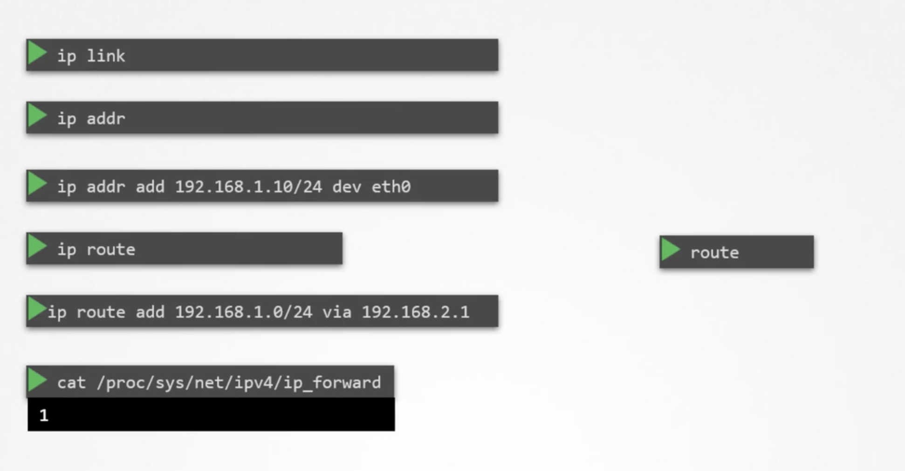

These will be handy in the upcoming lectures IP link is to list and modify interfaces on the host

```text
ip addr command is to see the ip addresses assigned to those interfaces ip addr add command is used to set
```

IP addresses on the interfaces.

Now remember changed made using these commands are only valid till a restart. If you want to persist these

changes you must set them in the /etc/network/interfaces file. ip route or simply the route command

is used to view the routing table. And ip route add command is used to add entries into the routing table.

And finally remember the command to check if IP forwarding is enabled on a host.

If you're working with a house configured as a router.

### Prerequisite DNS

DNS in Linux for absolute beginners. 

We will discuss the basic concepts and view some commands that will help us explore DNS configuration on hosts, specifically Linux hosts. 

We have two computers A and B, both part of the same network, and they've been assigned with IP addresses. 192.168.1.10 and 192.168.1.11 You're able to ping one computer from the other using the other computer's IP address. 

You know that System B has database services on them. So instead of having to remember the IP address of the System B, you decide to give it a name db.   

Going forward, you would like to ping System B using the name DB instead of its IP address. If you try to ping DB now, you would see that hostA is unaware of a host named DB.

**So how do you fix that?** 

Basically, you want to tell the system A that system  B  at IP address 192.168.1.11  As a name DB, you want to tell system that when I say DB, I mean the IP 192 168 1.11, you can do that by adding an entry into the  /etc/host  file on System A. mentioned the IP address and the name you want your host to see. System B as we told System A that the IP at 192 168 1.11 is a host named DB. Ping to DB now get sent to the correct IP and are successful.

Now there is an important point to note here we’ve told System A that the IP at 192 168 1.11 is a host named DB, host A takes that for granted.

Whatever we put in the /etc/host file is the source of truth for host A, but that may not be the truth.

Host A does not check to make sure if System B's actual name is DB. 

For instance, running a hostname command on System B reveals that it is named Host-2, but Host A doesn't care. It goes by what's in the host file. 

You can even fool systemA into believing that System B is Google just an entry into the host file with an IP mapping to www.Google.com, then Ping Google and you will get a response from System B. 

So we have two names pointing to the same system one as DB and another as Google, and we can use either names to read System B.

We can have as many names as you want for as many servers as you want in the /etc/host file.

Every time we reference another host  by its name from hostA  through a ping command or  ssh command or through any of the applications or tools within this system, it looks into its /etc/host file to find out the IP address of that host. Translating hostname to IP address this way is known as name resolution.  

Within a small network of few systems, you can easily get away with the entries in the /etc/host file. On each system, I specify which are the other systems in the environment and that's how it was done in the past.

Until the environment grew and these files got filled with too many entries and managing these became too hard.

If one of the server's IP changed, you would need to modify the entries in all of these hosts.

And that's where we decided to move all these entries into a single server who will manage it centrally.

We call that our DNS server, and then we point all hosts to look up that server if they need to resolve the hostname to an IP address instead of its own, it's the host files. 

**So how do we do that?**

How do we point our host to a DNS server?

Our DNS server has the IP 192.168.1.1.

Every host has a DNS resolution configuration file at **/etc/resolv.conf.**

You add an entry into it, specifying the address of the DNS server with a name server and pointed to 192.168.1.1. and that should be it.

Once this is configured on all of your hosts, every time a host comes up across a hostname that it does not know about, it looks it up from the DNS server.

If the IP of any of the host was to change, simply update the DNS server and all hosts should resolve the new IP address going forward.

You no longer need any entries in the /etc/hosts file in any of the hosts, but that does not mean you can't have entries in host file you still can, for example, say you were to provision a test server for your own needs.

You don't think others would need to resolve the server by each name, so it need not be added to the DNS server in that case. You can add an entry into your host /etc/hosts file to resolve the server.

You can now resolve the server. However, no other system will be able to do that.

So a system is able to use hostname to IP mapping from the /etc/host file locally, as well as from a remote DNS server.

What if you have an entry in both places, one in your /etc/host file and another in DNS?

I have an entry in my local file set to 192.168.1.116 and someone added an entry for the same host to 192.168.1.116 on the DNS server.

In that case, the host first looks in the local /etc/host file and then looks at the name server.

So if it finds the entry in the local /etc/hosts file, it uses that. If not, it looks for that hosts in the DNS server.

**But that order can be changed.**  The order is defined by an entry in the file **/etc/nsswitch.conf.**

The line with the hosts entry.As you can see, the order is first files and then followed by DNS, Files, refers to the hosts file and DNS refers to the DNS server.

So for every hostname, the host first looks into the /etc/hosts file and if it cannot find it there, it then looks at the DNS server.

This order can be modified by editing this entry in the file. As per this order, our host would resolve the test server to 192.168.1.115. What if you try to ping a server that is not in either list? 

For example, I try and ping [www.facebook.com](http://www.facebook.com) I don't have www.facebook.com in my /etc/hosts file and I don't have it in my DNS server either.

So in that case, it will fail. 

You can add another entry into your /etc/resolve.conf file to point to a name server that knows Facebook.

For example, 8.8.8.8 is a common well-known public name server available on the internet hosted by Google that knows about all the websites on the internet. 

You can have multiple name servers like this configured on your host. 

But then you have to configure that on all your hosts in their network. You already have a name server within your network configured on all the hosts.

So in that case, you can configure the DNS server itself to forward any unknown host names to the public name server on the internet.

You should not be able to ping external sites such as facebook.com. 

Until now, we've been just trying to reach systems with their names like Web, DB, NFS, etc. But we just try to ping Facebook at [www.facebook.com](http://www.facebook.com). 

What is this name with a total www and dot com at the end?

**It's called a domain name**, and it is how IPs translate to names that we can't remember on the public internet, just like how we did for our hosts. Now, the reason they're in this format separated by Dot is to group like things together. 

The last portion of the domain name the dot coms, the .net   , .Edu, .org, etc. are the top level domains that represent the intent of the website dot com for commercial or general purpose, .net for network, .edu for educational organizations and .org for non-profit organizations.

Let's look at one in particular in Google's case.

The Dot is the route that's where everything starts. Dot com is a top-level domain.

Google is the domain name assigned to Google and WWW is a subdomain.

The subdomains help in further grouping things together. Under Google, for example, Google's map service is available at maps.google.com, so Maps is subdomain. Google's storage service is available at drive.google.com, Mobile apps are available at app.google.com.  Google's email service are available at mail.google.com

You can further divide each of these into as many subdomains based on your needs. So you begin to see a tree structure forming.

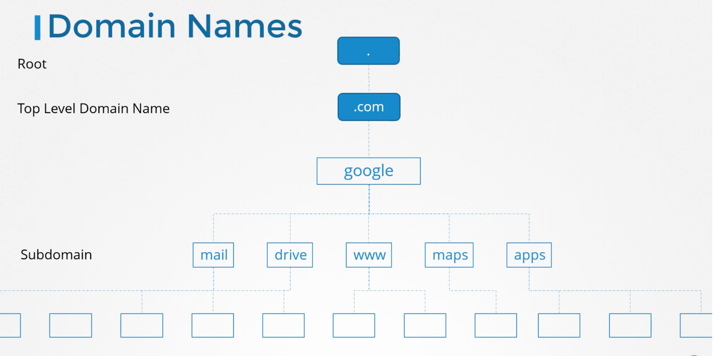

When you try to reach any of these domain names, say app.google.com from within your organization,

your request first hits your organization's internal DNS server. It doesn't know who apps or Google is, so it forwards your request to the internet on the internet. The IP address of the server surfing app store google.com maybe resolve with the help of multiple DNS servers and root DNS over looks at your request and points you to and subversive in .com and server looks at your request and forwards you to Google and Google's DNS server provides you the IP of the server serving the app's applications.

In order to speed up all future results.Your organization's DNS server may choose to cache this IP for a period of time, typically a few seconds up to few minutes. 

That way, it doesn't have to go through the whole process again each time.

So that was out in the public. What about your organization?

Your organization can have a similar structure to, for example, your organization could be called as mycompay.com and have multiple subdomains for each purpose that the WWw for external facing web site, mail.mcompany.com for accessing your organization's mail, drive for accessing storage, pay.mycompany.com accessing the payroll application. HR for accessing H.R. application, etc. All of these are configured in your organization's internal DNS server.

The reason we discussed all of this is to understand another entry in the /etc/resolve.conf file 

Remember, this is the file where we configured the DNS server to be used for our host. With that, we were able to resolve servers in your organization with just their names like web. We have now introduced more standard domain names like Web.MyCompany.Com or db.mycompany.com etcetera.

Now when you ping, web you can no longer get a response. Of course, this is because we are trying to ping web, but there is no record for by the name web on my DNS server. Instead, it is web.mycompany.com. So you have to use web.mycompany.com.

Now I can understand if someone outside our company wants to access our web server. He would have to use web.mycompany.com

But within your company, your own company, you want to simply address the web server by its first name web.

Just like how you address other members in your family simply by their first names, which is not the case when someone outside your family addresses them using their full names. 

**So what do you do to configure the web to resolve my** web.mycompany.com**?**

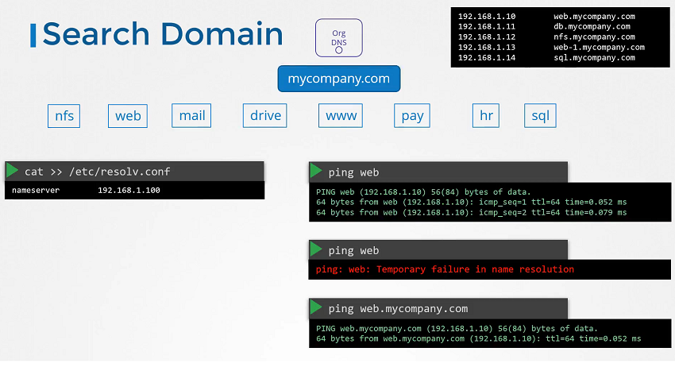

You want to say when I say web, I mean web.mycompany.com.

For that, you make an entry into your hosts /etc/resolv.conf file called **search** and specify the domain name you want to append.

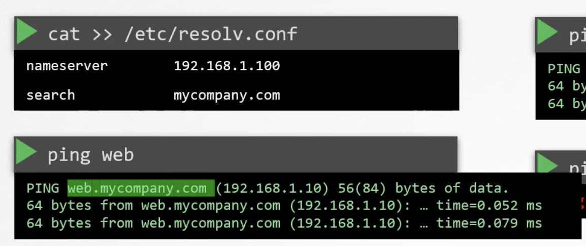

Next time you try tapping web, you will see it actually tries. web.mycompany.com

Now your host is intelligent enough to exclude the search domain. If you specified a domain in your query like this, you may also provide additional search domains like this.

So it would mean when I say web, I mean web.mycompany.com  or web dot dot dot my company dot

com.

So your host would try searching all of these domain name when you look for a hostname.

**Finally, a word about record types, so how are the records stored in the DNS server?**

We know that it stores IP to host names that's known as **A records.** Storing IPv6 to host names is known as **AAAA records (quad A records),** mapping  one name to another name is called CNAME  records.

For example, you may have multiple aliases for the same application, like a food delivery service may also be reached at Eat or Hungry.

That's where a CNAME records is used name to name mapping.

There are many more, but that's all we're going to look at for now. 

Now, Ping may not always be the right tool to test DNS resolution. There are a few other tools as well, such as **nslookup** you can use and its lookup to query a hostname from a DNS server.

But remember, nslookup does not consider the entries in the local /etc/hosts file.

So if you add an entry into the local host, file for your web application and if you try to do an nslookup for that web application, it is not going to find it.

The entry for your web application has to be present in your DNS server. Nslookup only queries the DNS server. The same goes with Dig, Dig is another useful tool to test the name resolution. It returns more details in a similar form as is stored on the server. 

- Every host has a DNS resolution configuration file at /etc/resolv.conf.

```text
$ cat /etc/resolv.conf
nameserver 127.0.0.53
options edns0
```

- To change the order of dns resolution, we need to do changes into the /etc/nsswitch.conf file.

```yaml
$ cat /etc/nsswitch.conf
hosts:          files dns
networks:       files
```

- If it fails in some conditions.

```text
$ ping wwww.github.com
ping: www.github.com: Temporary failure in name resolution
```

- Adding well known public nameserver in the /etc/resolv.conf file.

```yaml
$ cat /etc/resolv.conf
nameserver   127.0.0.53
nameserver   8.8.8.8
options edns0

$ ping www.github.com
PING github.com (140.82.121.3) 56(84) bytes of data.
64 bytes from 140.82.121.3 (140.82.121.3): icmp_seq=1 ttl=57 time=7.07 ms
64 bytes from 140.82.121.3 (140.82.121.3): icmp_seq=2 ttl=57 time=5.42 ms
```

### Prerequisite CoreDNS

In the previous lecture we saw why you need a DNS server and how it can help manage name resolution in large environments with many hostnames and IPs and how you can configure your hosts to point to a DNS server. In this article we will see how to configure a host as a DNS server. 

We are given a server dedicated as the DNS server, and a set of IPs to configure as entries in the server. There are many DNS server solutions out there, in this lecture we will focus on a particular one – CoreDNS.

So how do you get core dns? CoreDNS binaries can be downloaded from their Github releases page or as a docker image. Let’s go the traditional route. Download the binary using curl or wget. And extract it. You get the coredns executable.

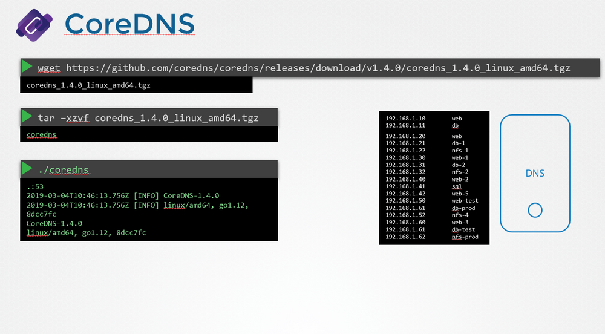

Run the executable to start a DNS server. It by default listens on port 53, which is the default port for a DNS server.

Now we haven’t specified the IP to hostname mappings. For that you need to provide some configurations. There are multiple ways to do that. We will look at one. First we put all of the entries into the DNS servers /etc/hosts file.

And then we configure CoreDNS to use that file. CoreDNS loads it’s configuration from a file named Corefile. Here is a simple configuration that instructs CoreDNS to fetch the IP to hostname mappings from the file /etc/hosts. When the DNS server is run, it now picks the Ips and names from the /etc/hosts file on the server.

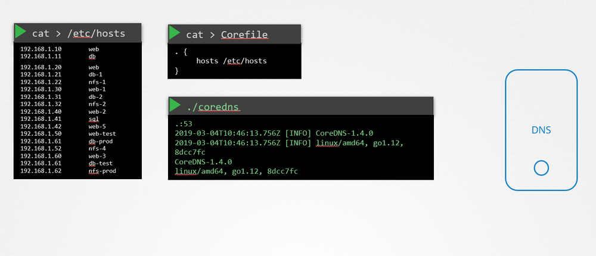

CoreDNS also supports other ways of configuring DNS entries through plugins. We will look at the plugin that it uses for Kubernetes in a later section.

Read more about CoreDNS here:

[https://github.com/kubernetes/dns/blob/master/docs/specification.md](https://github.com/kubernetes/dns/blob/master/docs/specification.md)

[https://coredns.io/plugins/kubernetes/](https://coredns.io/plugins/kubernetes/)

### Prerequisite Network Namespaces

Introduction  to network names, spaces in Linux networks, namespaces are used by containers like Docker to implement network isolation. 

We'll start with a simple host. 

As we know already, containers are separated from the underlying host using namespaces 

**So what are namespaces?** 

If your host was your house, then namespaces are the rooms within the house that you assign to each of your children.   The room helps in providing privacy to each child. Each child can only see what's within his or her room. They cannot see what happens outside their room. As far as they're concerned, they're the only person living in the house. 

However, as a parent, you have visibility into all the rooms in the house as well as other areas of the house. If you wish, you can establish connectivity between two rooms in the house. 

When you create a container, you want to make sure that it is isolated, that it does not see any other processes on the host or any other containers.  So we create a special room for it on our host using a namespace. 

As far as the container is concerned, it only sees the processes run by it and thinks that it is on its own host.

The underlying host, however, has visibility into all of the processes, including those running inside the containers. This can be seen when you list the processes from within the container.  You see a single process with the process of one. 

When you list the same processes as a root user from the underlying host, you see all the other processes along with the process running inside the container, this time with a different process IDs. 

I think it's the same process running with different process IDs inside and outside the container.  **That's how namespaces work.** 

**When it comes to networking, our host has its own interfaces that connect to the local area network.** 

Our host has its own routing and arp tables with information about the rest of the network.  We want to seal off those details from the container. When the container is created, we create a network namespace for it, that way it has no visibility to any network related information on the host. Within its namespace. The container can have its own virtual interfaces, routing and arp tables. The container has its own interface. 

To create a new network namespace on a Linux host, run the `ip netns add`  command. In this case, we create  two network namespaces. To list the network namespaces, run the  `ip netns`  command.

```bash
$ ip netns add red
$ ip netns add blue
$ ip netns 
```

To list the interfaces on my host, I run the `ip link` command, I see that my host has the Lookback interface and the eth0 interface.$ ip link

**Now, how do we view the same within the network namespace that we created?**

**How do we run the same command within the red or blue namespace?**

Prefix the command with the command `ip netns exec` followed by the namespace name, which is red. Now the IP link command will be executed inside the red namespace. 

```bash
Exec inside the network namespace
$ ip netns exec red ip link
1: lo: <LOOPBACK> mtu 65536 qdisc noop state DOWN mode DEFAULT group default qlen 1000
    link/loopback 00:00:00:00:00:00 brd 00:00:00:00:00:00

$ ip netns exec blue ip link
1: lo: <LOOPBACK> mtu 65536 qdisc noop state DOWN mode DEFAULT group default qlen 1000
    link/loopback 00:00:00:00:00:00 brd 00:00:00:00:00:00

You can try with other options as well. Both works the same.
$ ip -n red link
1: lo: <LOOPBACK> mtu 65536 qdisc noop state DOWN mode DEFAULT group default qlen 1000
    link/loopback 00:00:00:00:00:00 brd 00:00:00:00:00:00
```

Another way to do it is to add the dash and option -n to the original IP link command.  Both of these are the same.  The second one is similar. But remember, this only works if you intend to run the IP command inside the namespace.  As you can see, it only lets the loopback interface. 

You cannot see eth0 interface on the host. So with namespaces, we have successfully prevented the container from seeing the host's interface. The same is true with the ARP table. If you run the ARP command on the host, you see a list of entries, but if you run it inside the container, you see no entries. And the same for the routing table. 

- On the host

```yaml
$ arp
Address                  HWtype  HWaddress           Flags Mask            Iface
172.17.0.21              ether   02:42:ac:11:00:15   C                     ens3
172.17.0.55              ether   02:42:ac:11:00:37   C                     ens3
```

- On the Network Namespace

```bash
$ ip netns exec red arp
Address                  HWtype  HWaddress           Flags Mask            Iface

$ ip netns exec blue arp
Address                  HWtype  HWaddress           Flags Mask            Iface
```

- On the host

```text
$ route
```

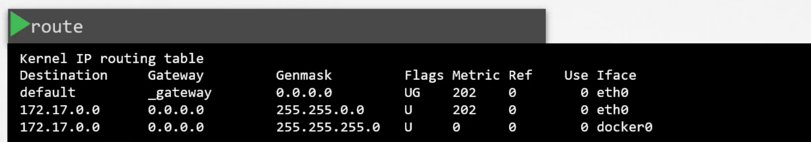

- On the Network Namespace

```bash
$ ip netns exec red route
Kernel IP routing table
Destination     Gateway         Genmask         Flags Metric Ref    Use Iface

$ ip netns exec blue route
Kernel IP routing table
Destination     Gateway         Genmask         Flags Metric Ref    Use Iface
```

Now, as of now, these network namespaces have no network connectivity, they have no interfaces of their own, and they cannot see the underlying host network. Let's first look at establishing connectivity between the name spaces themselves, just like how we would connect to physical machines together, Using a cable to an ethernet  interface. On each machine, you can connect to namespace spaces together using a virtual Ethernet pair or a **virtual cable**.

On the host

```yaml
# Not available
$ arp
Address                  HWtype  HWaddress           Flags Mask            Iface
172.16.0.72              ether   06:fe:61:1a:75:47   C                     ens3
172.17.0.68              ether   02:42:ac:11:00:44   C                     ens3
172.17.0.74              ether   02:42:ac:11:00:4a   C                     ens3
172.17.0.75              ether   02:42:ac:11:00:4b   C                     ens3
```

It's often referred to as a **pipe**, but I'd like to call it a **virtual cable** with two interfaces on either ends.

 To create the cable or on the `ip link add` command with a type set to visit and specify the two ends with red and blue.

- To create a virtual cable

```text
$ ip link add veth-red type veth peer name veth-blue
```

The next step is to attach each interface to the appropriate namespace. Use the command IP link set with red and red to do that.Similarly, attach the blue interface to the blue namespace. We can then assign IP addresses to each of these namespaces.

- To attach with the network namespaces

```text
$ ip link set veth-red netns red

$ ip link set veth-blue netns blue
```

- To add an IP address

```text
$ ip -n red addr add 192.168.15.1/24 dev veth-red
$ ip -n blue addr add 192.168.15.2/24 dev veth-blue
```

We will use the usual ip addr command to assign the IP address, but within each namespace we will assign the red namespace and IP 192.168.15.1  within assigned the blue namespace and IP 192.168.15.2

We then bring up the interface using the IP link, set up command for each device within the respective namespace as the links are up and the namespace can now reach each other and try a ping from the red namespace to reach the IP of the blue.

- To turn it up ns interfaces

```text
$ ip -n red link set veth-red up

$ ip -n blue link set veth-blue up
```

- Check the reachability

```bash
$ ip netns exec red ping 192.168.15.2
PING 192.168.15.2 (192.168.15.2) 56(84) bytes of data.
64 bytes from 192.168.15.2: icmp_seq=1 ttl=64 time=0.035 ms
64 bytes from 192.168.15.2: icmp_seq=2 ttl=64 time=0.046 ms
```

If you look at the ARP table on the red namespace, you see it's identified. It's blue number at 198.168.15.2 with a Mac address. 

```bash
$ ip netns exec red arp
Address                  HWtype  HWaddress           Flags Mask            Iface
192.168.15.2             ether   da:a7:29:c4:5a:45   C                     veth-red

$ ip netns exec blue arp
Address                  HWtype  HWaddress           Flags Mask            Iface
192.168.15.1             ether   92:d1:52:38:c8:bc   C                     veth-blue
```

Similarly, if you list the ARP table on the blue namespace, you see it's identified. It's the red neighbor.

If you compare this with the arp table of the host, you see that the host table has no idea about this new namespace, as we have created and no idea about the interfaces we created in them. 

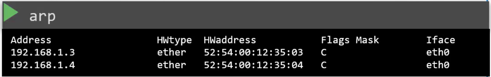

You know that worked when you have just two namespaces?  

**What do you do when you have more of them?**

**How do you enable all of them to communicate with each other?**

Just like in the physical world, you create a virtual network inside your host, to create a network, you need a switch. So to create a virtual network. You need a virtual switch. 

So you create a virtual switch within our host and connect the namespaces to it. 

**Well, how do you create a virtual switch between our host?** 

There are multiple solutions available, such as the native solution called as Linux Bridge and the open vSwitch, etc..

In this example, we will use the **Linux Bridge** option to create an internal bridge network. 

We add a new interface to the host using the IP link Add command with the type set to bridge.  We will name it v-net-0.

- To create a internal virtual bridge network, we add a new interface to the host `$ ip link add v-net-0 type bridge`

As far as our host is concerned, it is just another interface, just like the interface, it appears in the output of the IP link command along with the other interfaces.

```yaml
Display in the host
$ ip link
8: v-net-0: <BROADCAST,MULTICAST> mtu 1500 qdisc noop state DOWN mode DEFAULT group default qlen 1000
    link/ether fa:fd:d4:9b:33:66 brd ff:ff:ff:ff:ff:ff
```

It's currently down.

```text
Currently it's down, so turn it up
$ ip link set dev v-net-0 up
```

So you need to turn it up, use the `ip link set dev up`  command to bring it up.

Now for the namespace. This interface is like a switch that it can connect to. So think of it as an interface for the host and a switch for the namespace. So the next step is to connect the namespaces to this new virtual network switch. 

Earlier we created the cable or the eth pair with the vethRed interface on one end and blue interface on the other, because we wanted to connect the two namespaces directly. Now we will be connecting all name spaces to the bridge network, so we need new cables for that purpose.

This cable doesn't make sense anymore, so we will get rid of it. 

Use the IP link, delete command to delete the cable.

- Delete the link.

```text
$ ip -n red link del veth-red
```

When you delete the link with one end, the other end gets deleted automatically.Since they are the are a pair. Let us now create new cables to connect the namespace to the bridge. 

run the `ip link add` command and create a pair with. veth-red on one end like before, but this time the other end will be named `veth-red-br`

- To connect network namespace to the bridge. Creating a virtual cabel

```text
$ ip link add veth-red type veth peer name veth-red-br$ ip link add veth-blue type veth peer name veth-blue-br
```

veth-red-br as it connects to the bridge network. 

This naming convention will help us easily identify the interfaces that associate to the red namespace. Similarly, create a cable to connect the blue namespace to the bridge network.

Now that we have the cables ready, it's time to get them connected to the namespaces.

To attach one end of this of the interface to the red namespace run the ip link set. 

- Set with the network namespaces

```text
$ ip link set veth-red netns red
$ ip link set veth-blue netns blue
$ ip link set veth-red-br master v-net-0
$ ip link set veth-blue-br master v-net-0
```

veth-red netns red Command, to attach the other end to the bridge network run ip link set command

on the veth-red- br end and specify the master for it as the `v-net-0`  Network.

Follow the same procedure to attach the blue cable to the blue namespace and the bridge network. Let us now set IP addresses for these links and turned them up.

We will use the same IP addresses that we used before, 192.168.15.1 and 192.168.15.2 and finally turn the devices up.

- To add an IP address`$ ip -n red addr add 192.168.15.1/24 dev veth-red``$ ip -n blue addr add 192.168.15.2/24 dev veth-blue`

- To turn it up ns interfaces`$ ip -n red link set veth-red up``$ ip -n blue link set veth-blue up`

The containers can now reach each other over the network. So we follow the same procedure to connect the remaining two namespaces to the same network. 

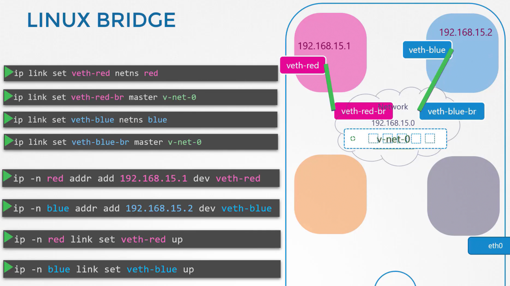

We now have all four namespaces connected to our internal network, and they can all communicate with each other.

They have all IP addresses, 192.168.15.1, 192.168.15.2, 192.168.15.3and 192.168.15.4.

And remember, we assigned our host the IP 190.168.1.2 from my host.

What if I tried to reach one of these interfaces in this namespace, well it work?

No my host is on one network and the namespaces are on another.

**But what if I really want to establish connectivity between my host and this namespace?**

Remember we said that the bridge switch is actually a network interface for the host. 

So we do have an interface on the192.168.15.1  network on our host since its just another interface.All we need to do is assign an IP address to it so we can reach the namespace through it, 

run the ip addr  add command to set the IP 192.168.15.5 to this interface.

- To add an IP address*

```text
$ ip addr add 192.168.15.5/24 dev v-net-0
```

We can now ping the red namespace from our local host.

Now remember, this entire network is still private and restricted within the host, from within the namespaces you can't reach the outside world, nor can anyone from the outside world reach the services or applications hosted inside.

The only door to the outside world is the ethernet  port on the host(192.168.1.2). So how do we configure this bridge to reach the LAN network through the ethernet port?

So there is another host attached to our network with the address 192.168.1.3, 

How can I reach this host from within my name spaces?

What happens if I try to ping this host from my blue namespace?

The blue namespace sees that I'm trying to reach a network at 192.168.1.X, which is different from my current network of 192.168.15.X

So it looks at its routing table to see how to find that network.

The routing table has no information about the other network, so it comes back saying that the network is unreachable.

So we need to add an entry into the routing table to provide a gateway or door to the outside world.

**So how do we find that gateway?**

A door or a gateway, as we discussed before, is a system on the local network that connects to the other network.

So what is a system that has one interface on the network local to the blue namespace, which is the 192.168.15.x  network and is also connected to the outside LAN network 

Here's a logical view.

It's the localhost that have all these namespaces on, so you can ping the namespaces.  Remember, our local host has an interface to attach to the private network so you can ping the namespaces. So our local host is the gateway that connects the two networks together. 

We can now add a route entry in the blue namespace to say route all traffic to the 192.168.1.x network through

the gateway at 192.168.15.5 Now remember, our host has two IP addresses, one on the bridge network at 192.168.15.5 and another on the external network at 192.168.1.2. 

**Can you use any in the route ?**

No, Because the blue namespace can only reach the gateway and its local network at 192.168.15.5. 

The default gateway should be reachable from your namespace when you add it to your route.

When you try to ping now you no longer get the network unreachable message 

But You still don't get any response back from the ping.

**What might be the problem?**

We talked about a similar situation in one of our earlier lectures where from our home network we tried to reach the external Internet through our router.  Our home network has our internal private IP addresses that the Destination Network don't know about. So they cannot reach back. For this we need NAT enabled on our host acting as the gateway  here so that it can send the messages to the LAN in its own name with its own address.

So how do we add NAT functionality to our host?

You should do that using IP tables, add  a new rule in the net IP table, in the post routing chain to masquerade or replace the from address on all packets coming from the source network.192.168.15.0 with its own IP address. That way, anyone receiving these packets outside the network will think that they're coming from the host and not from within The namespaces. When we try ping now we see that we are able to reach the outside world.

Finally say the LAN is connected to the Internet. We want the name spaces to reach the Internet, so we try to ping a server on the Internet at 8.8.8.8 from the blue namespace, we receive a familiar message that the network is unreachable.

But now we know why that is. We look at the routing table and see that we have routes to the network 192.168.1.x anything else. Since these namespaces can reach any network our hosts can reach.

We can simply say that to reach any external network, talk to our host so we add a default gateway specifying our host.

We should now be able to reach the outside world from within this namespace. 

Now, what about connectivity from the outside world to inside the name spaces, say, for example, the blue namespace hosts a Web application on port 80.

As of now, the name spaces are on an internal private network and no one from the outside world knows about that.

We can only access these from the host itself. 

If you try to ping the private IP of the namespace from another host on another network, you will see that it's not reachable, obviously, because that host doesn't know about this private network. In order to make that communication possible.

You have two options.

The two options that we saw in the previous lecture on NAT.

The first is to give away the identity of the private network to the second host. So we basically add an IP route entry to the second host, telling the host that the network  192.168.15.x can be reached through the host at 192.168.1.2

But we don't want to do that.

The other option is to add a port forwarding rule using IP tables to say any traffic coming to Port 

80 on the localhost is to be forwarded to Port 80 on the IP assigned to the blue namespace.

FAQ

While testing the Network Namespaces, if you come across issues where you can’t ping one namespace from the other, make sure you set the NETMASK while setting IP Address. ie: 192.168.1.10/24

```text
ip -n red addr add 192.168.1.10/24 dev veth-red
```

Another thing to check is FirewallD/IP Table rules. Either add rules to IP Tables to allow traffic from one namespace to another. Or disable IP Tables all together (Only in a learning environment).

### Prerequisite Docker Networking

We will look at networking in Docker.

We will start with basic networking options in Docker and then try and relate to the concepts around networking namespaces.

Let’s start with a single Docker Host. A server with Docker installed on it.

It has an ethernet interface at eth0 that connects to the local network with the IP address 192.168.1.10.

When you run a container you have different networking options to choose from.

First, let’s see the none network. With the **None network**, the docker container is not attached to any network.

```bash
$ docker run --network none nginx
```

The container cannot reach the outside world and no one from the outside world can reach the container. If you run multiple containers they are all created without being part of any network and cannot talk to each other or to the outside world.

Next is the **Host network**. With the **host network**, the container is attached to the host’s network. There is no network isolation between the host and the container.If you deploy a web application listening on port 80 in the container then the web application is available on port 80 on the host without having to do any additional port mapping. 

```bash
$ docker run --network host nginx
```

*Note: If you try to run another instance of the same container that listens on the same port it won't work as they share hosts networking and two processes cannot listen on the same port at the same time.*

The third networking option is the **bridge**. In this case, an internal private network is created which the docker host and containers attach to. The network has an address 172.17.0.0 by default and each device connecting to this network get their own internal private network address on this network.

```bash
$ docker run --network bridge nginx
```

This is the network that we are most interested in. So we will take a deeper look at how exactly docker creates and manages this network.

When Docker is installed on the host it creates an internal private network called **bridge** by default. 

You can see this when you run the `docker network ls` command. Now, docker calls the network by the name “bridge”. But on the host the network is created by the name docker0.

```bash
$ docker network ls
NETWORK ID          NAME                DRIVER              SCOPE
4974cba36c8e        bridge              bridge              local
0e7b30a6c996        host                host                local
a4b19b17d2c5        none                null                local

$ ip link
or
$ ip link show docker0
3: docker0: <NO-CARRIER,BROADCAST,MULTICAST,UP> mtu 1500 qdisc noqueue state DOWN mode DEFAULT group default
    link/ether 02:42:cf:c3:df:f5 brd ff:ff:ff:ff:ff:ff
```

You can see this in the output of the `ip link` command. Docker internally uses a technique similar to what we saw in the video on namespaces by running the `ip link add` command with the type set to bridge. So remember, the name bridge in the docker network ls output refers to the name docker0 on the host. They are one and the same thing.

Also note that the interface or network is currently down. Now, remember we said that the bridge network is like an interface to the host, but a switch to the namespaces or containers within the host. So the interface docker0 on the host is assigned an IP 172.17.0.1. You can see this in the output of the `ip addr` command.

```yaml
$ ip addr
or
$ ip addr show docker0
3: docker0: <NO-CARRIER,BROADCAST,MULTICAST,UP> mtu 1500 qdisc noqueue state DOWN group default
    link/ether 02:42:cf:c3:df:f5 brd ff:ff:ff:ff:ff:ff
    inet 172.18.0.1/24 brd 172.18.0.255 scope global docker0
       valid_lft forever preferred_lft forever
```

Whenever a container is created Docker creates a network namespace for it just like how we created network namespaces in the previous video. Run the `ip netns` command to list the namespace. 

Note that there is a minor hack to be done to get the `ip netns` command to list the namespaces created by Docker.

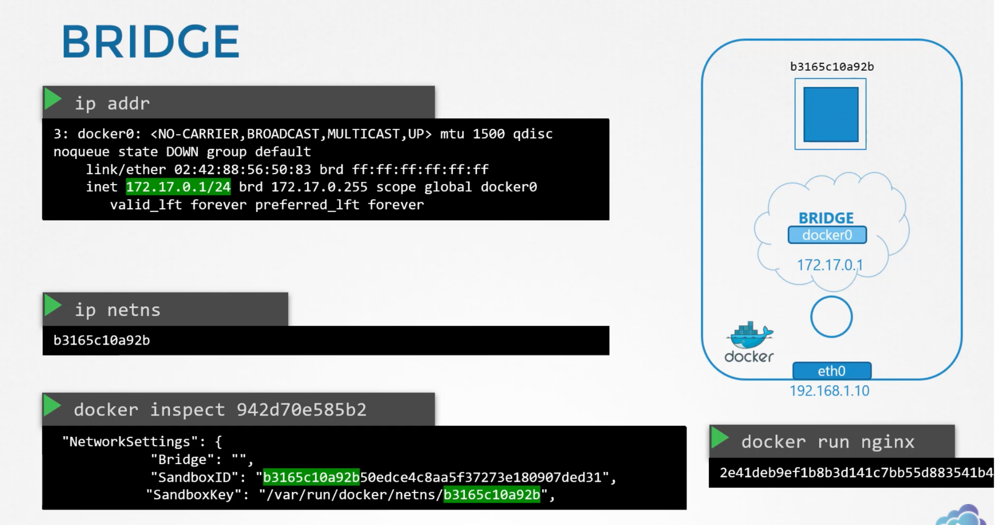

Checkout the resources section of this lecture for information on that. 

The namespace has the name starting b3165. You can see the namespace associated with each container in the output of the docker inspect comment.

```bash
$ ip netns
1c452d473e2a (id: 2)
db732004aa9b (id: 1)
04acb487a641 (id: 0)
default

# Inspect the Docker Container

$ docker inspect <container-id>

# To view the interface attached with the local bridge docker0

$ ip link
3: docker0: <BROADCAST,MULTICAST,UP,LOWER_UP> mtu 1500 qdisc noqueue state UP mode DEFAULT group default
link/ether 02:42:c8:3a:ea:67 brd ff:ff:ff:ff:ff:ff
5: vetha3e33331@if3: <BROADCAST,MULTICAST,UP,LOWER_UP> mtu 1500 qdisc noqueue master docker0 state UP mode DEFAULT group default
link/ether e2:b2:ad:c9:8b:98 brd ff:ff:ff:ff:ff:ff link-netnsid 0

# with -n options with the network namespace to view the other end of the interface

$ ip -n 04acb487a641 link
1: lo: <LOOPBACK,UP,LOWER_UP> mtu 65536 qdisc noqueue state UNKNOWN mode DEFAULT group default qlen 1000
link/loopback 00:00:00:00:00:00 brd 00:00:00:00:00:00
3: eth0@if5: <BROADCAST,MULTICAST,UP,LOWER_UP> mtu 1500 qdisc noqueue state UP mode DEFAULT group default
link/ether c6:f3:ca:12:5e:74 brd ff:ff:ff:ff:ff:ff link-netnsid 0

# To view the IP Addr assigned to this interface

$ ip -n 04acb487a641 addr
3: eth0@if5: <BROADCAST,MULTICAST,UP,LOWER_UP> mtu 1500 qdisc noqueue state UP group default
link/ether c6:f3:ca:12:5e:74 brd ff:ff:ff:ff:ff:ff link-netnsid 0
inet 10.244.0.2/24 scope global eth0
   valid_lft forever preferred_lft forever
```

**So how does docker attach the container or its network namespace to the bridge network?** For the remainder of this lecture. container and network namespace mean the same thing. When I say container I'm referring to the network namespace created by Docker for that container.

**So how does docker attach the container to the bridge?** 

As we did before  it creates a cable, a VIRTUAL cable, with two interfaces on each end. 

Let's find out what Docker has created here. If you run the ip link command on the docker host you see one end of the interface which is attached to the local bridge docker0.

If you run the same command again this time with the –n option with the namespace, then it lists the other end of the interface within the container namespace. 

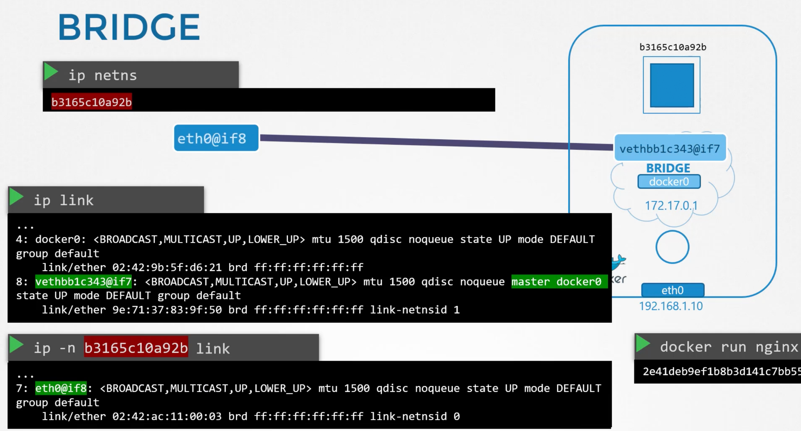

The interface also gets an IP assigned within the network.

You can view this by running the ip addr command but within the container's namespace. 

The container gets assigned 172.17.0.3. 

You can also view this by attaching to the container and looking at the IP address assigned to it that way.

The same procedure is followed every time a new container is created. Docker creates a namespace. Creates a pair of interfaces. Attaches one end to the container and another end to bridge network. The interface pairs can be identified using their numbers. Odd and even form a  pair 9 and 10 are one pair.7 and 8 are another and 11 and 12 are one pair. 

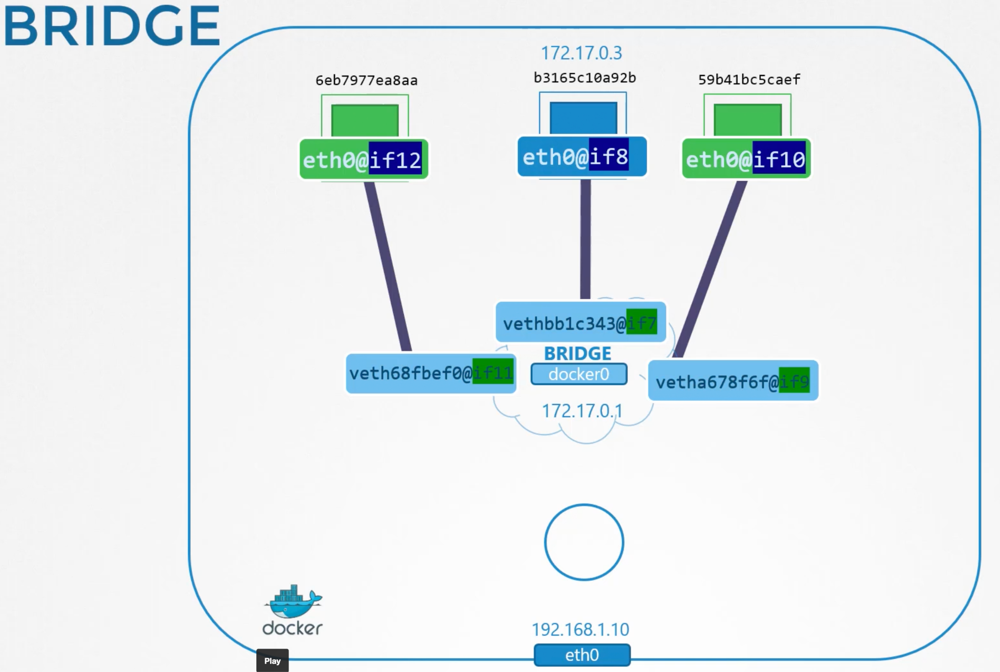

The containers are all part of the network now they can all communicate with each other. Let us look at port mapping now. The container we created is nginx, so it’s a web application serving web page on port 80. Since our container is within a private network inside the host. Only other containers in the same network or the host itself can access this Web page. 

If you tried to access the web page using curl with the IP of the container from within Docker host on port 80 you will see the web page. 

If you try to do the same thing outside the host, you cannot view the web page. To allow external users to access the applications hosted on containers. Docker provides a port publishing or port mapping option. When you run containers

Tell Docker to map port 8080 on the Docker host to port 80 on the container.

With that done, you could access the web application using the IP of the docker host and port 8080.

Any traffic to port 8080 on the docker host will be forwarded to port 80 on the container.

Now all of your external users and other applications or service can use this Url to access the application deployed on the host.

- Creating a docker container.

```bash
$ docker run -itd --name nginx nginx
d74ca9d57c1d8983db2c590df2fdd109e07e1972d6b361a6ecad8a942af5bf7e
```

- Inspect the docker container to view the IPAddress.

```bash
$ docker inspect nginx | grep -w IPAddress
            "IPAddress": "172.18.0.6",
                    "IPAddress": "172.18.0.6",
```

- Accessing web page with the curl command.

```bash
$ curl --head  http://172.18.0.6:80
HTTP/1.1 200 OK
Server: nginx/1.19.2
```

- Port Mapping to docker container

```bash
$ docker run -itd --name nginx -p 8080:80 nginx
e7387bbb2e2b6cc1d2096a080445a6b83f2faeb30be74c41741fe7891402f6b6
```

- Inspecting docker container to view the assgined ports.

```bash
$ docker inspect nginx | grep -w -A5 Ports

  "Ports": {
                "80/tcp": [
                    {
                        "HostIp": "0.0.0.0",
                        "HostPort": "8080"
                    }
```

- To view the IP Addr of the host system

```bash
$ ip a
# Accessing nginx page with curl command
$ curl --head http://192.168.10.11:8080
HTTP/1.1 200 OK
Server: nginx/1.19.2
```

- Configuring **iptables nat** rules

```bash
$ iptables \
         -t nat \
         -A PREROUTING \
         -j DNAT \
         --dport 8080 \
         --to-destination 80

$ iptables \
      -t nat \
      -A DOCKER \
      -j DNAT \
      --dport 8080 \
      --to-destination 172.18.0.6:80
```

**But how does docker do that?**

**How does it forward traffic from one port to another?**

**What would you do?**

Let's forget about Docker and everything else for a second.

The requirement is to forward traffic coming in on one port to another port on the server.

We talked about it in one of our prerequisite lectures. We create a NAT rule for that. Using iptables we create an entry into the NAT table, to append a rule to the PREROUTING chain to change the destination port from 8080 to 80. Docker does it the same way. Docker adds the rule to the docker chain and sets destination to include the containers IP as well.  you can 

see the rule docker creates when you list the rules in iptables.

#### List the Iptables rules

```bash
$ iptables -nvL -t nat
```

### Prerequisite CNI

Container networking interface. 

So far, we saw how network namespaces work, as in how to create an isolated network namespace environment within our system. 

- We saw how to connect multiple such namespaces through a bridge network,

- How to create Virtual cables, or pipes with virtual interfaces on either end, and then how to attach each end to a namespace and the bridge.

- We then saw how to assign ip and bring them up. And finally enable NAT or IP Masquerade for external communication etc.

We then saw how Docker did it for its bridge networking option.It was pretty much the same way except that it uses different naming patterns.

Well other container solutions solve the networking challenges in kind of the same way like rocket or Mesos Containerizer or any other solutions that work with containers and requires to configure networking between them like Kubernetes.

**If we are all solving the same networking challenges, by researching and finally identifying a similar approach with our own little minor differences why code and develop the same solution multiple times? Why not just create a single standard approach that everyone can follow?**

So we take all of these ideas from the different solutions and move all the networking portions of it into a single program or code And since this is for the bridge network we call it bridge.

So we created a program or a script that performs all the required tasks to get the container attached to a bridge network. For example you could run this program using its name bridge and specify that you want to add this container to a particular network namespace. The bridge program takes care of the rest so that the container runtime environments are relieved of those tasks.

For example, whenever rkt or kubernetes creates a new container, they call the bridge program and pass the container id and namespace to get networking configured for that container. 

So what if you wanted to create such a program for yourself? Maybe for a new networking type. If you were doing so.

**What arguments and commands should it support?**

**How do you make sure the program you create will work correctly with these run times?**

**How do you know container run times like kubernetes or rkt will invoke your program correctly?**

That’s where we need some standards defined. A standard that defines, how a program should look, how container runtime will invoke them so that everyone can adhere to a single set of standards and develop solutions that work across runtime.

That’s where the container network interface comes in. The CNI is a set of standards that define how programs should be developed to solve networking challenges in a container runtime environment.

The programs are referred to as plugins. In this case the bridge program that we have been referring to is a plugin for CNI. CNI defines how the plugins should be developed and how container run times should invoke them. CNI defines a set of responsibilities for container run times and plugins. For container runtimes CNI specifies that it is responsible for creating a network namespace for each container.

It should then identify the networks the container must attach to. Container runtime must then invoke the plugin. When a container is created using the ADD command and also invoke the plugin when the container is deleted using the Del command. It also specifies how to configure a network plugin on the container runtime environment. using a JSON file. On the plugin side, it defines that the plugin should support Add, Del and check command line arguments and that these should accept parameters like container and network namespace. 

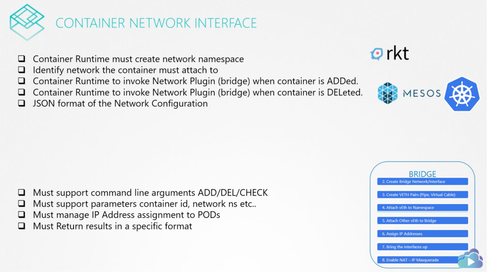

The plugin should take care of assigning IP addresses to the PODs and any associated routes required for the containers to reach other containers in the network. 

At the end the results should be specified in a particular format. 

As long as the container runtime and plugins adhere to these standards they can all live together in harmony.

Any runtime should be able to work with any plugin.  

CNI comes with a set of supported plugins already. Such as bridge, VLAN, IPVLAN, MACVLAN, one for  windows as well as IPAM plugins like host-local and dhcp.

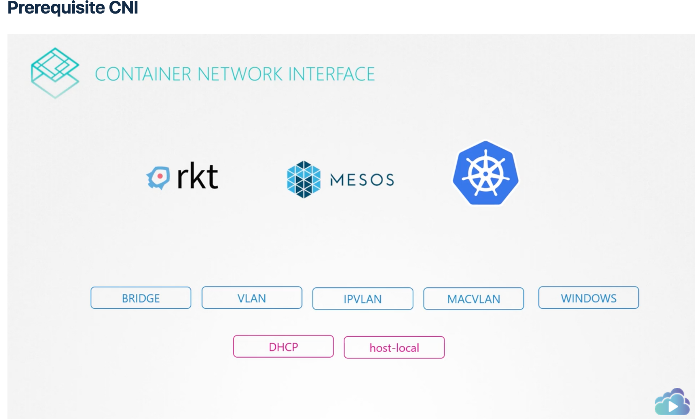

There are other plugins available from third party organizations as well.

Some examples are **weave, flannel, cilium, Vmware NSX, Calico, Infoblox etc**. All of these container runtimes implement CNI standards. So any of them can work with any of these plugins. But there is one that is not in this list. **Docker** does not implement CNI. Docker has its own set of standards known as **CNM** which stands for Container Network Model which is another standard that aims at solving container networking challenges similar to CNI, but with some differences. Due to the differences these plugins don’t natively integrate with Docker meaning you can’t run a docker container and specify the network plugin to use is CNI and specify one of these plugins. But that doesn't mean you can't use Docker with CNI at all. You just have to work around it yourself. 

For example create a docker container without any network configuration and then manually invoke the the bridge plugin yourself. That is pretty much how kubernetes does it. When kubernetes creates docker containers it creates them on the none network. It then invokes the configured CNI plugins who takes care of the rest of the configuration.

### Cluster Networking

We look at the networking configurations required on the master and worker nodes in a kubernetes cluster. 

The kubernetes cluster consists of master and worker nodes. Each node must have at least 1 interface connected to a network. Each interface must have an address configured. The hosts must have a unique hostname set. As well as a unique MAC address. You should note this especially if you created the VMs by cloning from existing ones. 

There are some ports that needs to be opened as well. These are used by the various components in the control plane. The master should accept connections on **-** for the API server. The worker nodes, Kubectl tool, external users, and all other control plane components access the kube-api server via this port. The kubelets on the master and worker nodes listen on **10250**. 

Yes, in case we didn’t discuss this, the kubelet’s can be present on the master node as well. The kube-scheduler requires port **10251** to be open. The kube-controller-manager requires port 10252 to be open. The worker nodes expose services for external access on ports **30000 to 32767.**

So these should be open as well.  Finally, the ETCD server listens on port 2379.

If you have multiple master nodes, all of these ports need to be open on those as well. And you also need an additional port **2380** open so the ETCD clients can communicate with each other. 

The list of ports to be opened are also available in the kubernetes documentation page. 

So consider these when you setup networking for your nodes, in your firewalls, or ip table rules or network security group in a cloud environment such as GCP or Azure or AWS. And if things are not working this is one place to look for while you are investigating. Head over to the practice session and explore

the networking setup in the existing environment.

Keep this commands handy while you look for information.

We will start with simple exercises where you will explore an existing kubernetes cluster and view

information about the interfaces, ips, hostnames, ports etc.

This will help you familiarize with the environment and look for information in the future sections.

Going forward we will get into more challenging exercises.

Correct! That's because 2379 is the port of ETCD to which all control plane components connect to. 2380 is only for etcd peer-to-peer connectivity. When you have multiple controlplane nodes. In this case we don't.

#### Important Note about CNI and CKA Exam

**An important tip about deploying Network Addons in a Kubernetes cluster.**

In the upcoming labs, we will work with Network Addons. This includes installing a network plugin in the cluster. While we have used weave-net as an example, please bear in mind that you can use any of the plugins which are described here:

[https://kubernetes.io/docs/concepts/cluster-administration/addons/](https://kubernetes.io/docs/concepts/cluster-administration/addons/)[https://kubernetes.io/docs/concepts/cluster-administration/networking/#how-to-implement-the-kubernetes-networking-model](https://kubernetes.io/docs/concepts/cluster-administration/networking/#how-to-implement-the-kubernetes-networking-model)

In the CKA exam, for a question that requires you to deploy a network addon, unless specifically directed, you may use any of the solutions described in the link above.

***However,*** the documentation currently does not contain a direct reference to the exact command to be used to deploy a third party network addon.

The links above redirect to third party/ vendor sites or GitHub repositories which cannot be used in the exam. This has been intentionally done to keep the content in the Kubernetes documentation vendor-neutral.

### POD Networking

POD networking in kubernetes.  

So far we have set up several kubernetes, master and worker nodes and configured networking between them. So they are all on a network that can reach each other.

We also made sure the firewall and network security groups are configured correctly to allow for the kubernetes  control plane components to reach each other. 

Assume that we have also set up all the kubernetes control plane components such as the **kubeAPI server**, the **ETCD servers**, **Kublet**, etc. and we are finally ready to deploy our applications.

But before we can do that, there is something that we must address. 

We talked about the network that connects the nodes together, but there's also another layer of networking

that is crucial to the clusters functioning, and that is the networking at the pod layer. Our kubernetes cluster is soon going to have a large number of PODs and services running on it. 

**How are the pods addressed?**

**How do they communicate with each other?**

**How do you access the services running on these PODs internally from within the cluster as well as externally from outside the cluster?**

These are challenges that kubernetes expects you to solve. As of today, kubernetes does not come with a built-in solution for this. It expects you to implement a networking solution that solves these challenges.

However, kubernetes have clearly laid out the requirements for POD networking.Let's take a look at what they are. 

Kubernetes expects every pod to get its own unique IP address and that every POD should be able to reach every other POD within the same node using that IP address. And every POD should be able to reach every other POD on other nodes as well using the same IP address.  

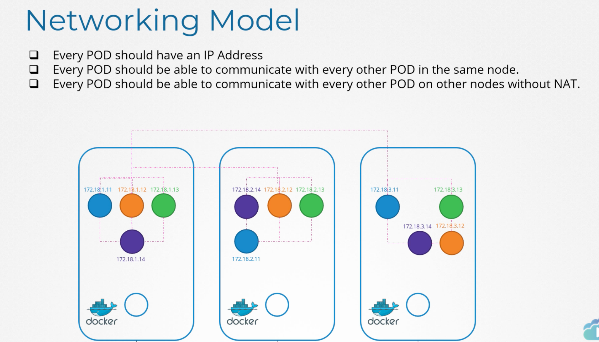

It doesn't care what IP address that is and what range or subnet it belongs to. As long as you can implement a solution that takes care of automatically assigning IP addresses and establishing connectivity between the PODs in a node as well as pods on different nodes, you're good. 

without having to configure any naturals. 

**So how do you implement a model that solves these requirements ?**

**Now** there are many networking solutions available out there that do this(flannel, cilium and vmware nsx), but we have already learned about networking concepts, routing, IP address management, and namespaces in CNI. 

So let's try to use that knowledge to solve this problem by ourselves first**, this will help in understanding how other solutions work.** I know there is a bit of repetition, but I'm trying to relate the same concept and approach all the way from plain network namespace on Linux all the way to kubernetes.

So we have a three node cluster. It doesn't matter which one is master or worker, they all run PODs either for management or workload purposes.

As far as networking is concerned, we're going to consider all of them as the same. 

So first, let's plan what we are going to do. 

The nodes are part of an external network and has IP addresses in the 192.168.1.x series.Node one is assigned 192.168.1.11, node two is 192.168.1.12 and node Three is 192.168.1.13.

Next step, when containers are created, kubernetes creates network namespace spaces for them to enable communication between them. We attach these namespaces to a network, **but what network?**

We have learned about bridge networks that can be created within nodes to attach namespaces. So we create a bridge network on each node. And then bring them up,

```text
To add bridge network on each nodenode01$ ip link add v-net-0 type bridgenode02$ ip link add v-net-0 type bridgenode03$ ip link add v-net-0 type bridge

Currently it's down, turn it up.node01$ ip link set dev v-net-0 upnode02$ ip link set dev v-net-0 upnode03$ ip link set dev v-net-0 up
```

It's time to assign an IP address to the bridge interfaces or networks. **But what IP address?**

We decide that each bridge network work will be on its own subnet, choose any private address range,say, 10.244.1.x, 10.244.2.x and 10.244.3.x Next we set the IP address for the bridge interface.

*Set the IP Addr for the bridge interface*node01`$ ip addr add 10.244.1.1/24 dev v-net-0`node02`$ ip addr add 10.244.2.1/24 dev v-net-0`node03`$ ip addr add 10.244.3.1/24 dev v-net-0`

So we have built our base.

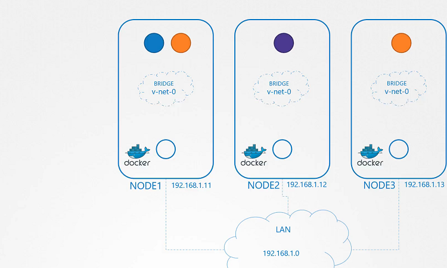

The remaining steps are to be performed for each container and every time a new container is created. So we write a script for it. Now, you don't have to know any kind of complicated scripting. It's just a file that has call commands we will be using and we can run this multiple times for each container going forward.

To attach a container to the network. 1. We need a pipe or virtual network cable. We create that using the IP link add command, don't focus on the options as they are similar to what we saw in our previous lectures. 

Assume that they vary dependent on the inputs.

We then attach one end to the container and another end to the bridge using the IP links set command.

We then assign an IP address using the IP addr command and add a route to the default gateway.

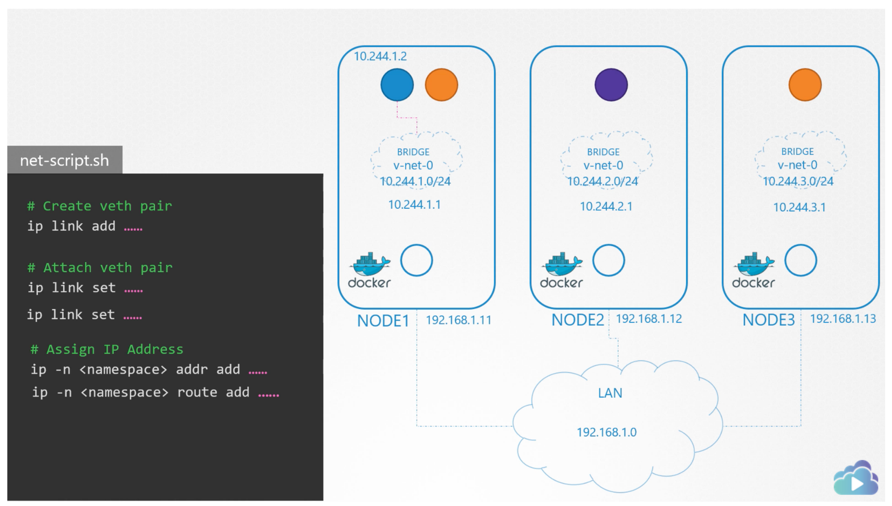

**But what IP do we add?**

We either manage that ourselves or store that information in some kind of database.

For now, we will assume it is 10.244.1.2, which is a free IP in the subnet. 

We discuss IP address management in detail in one of the upcoming chapters. 

Finally, we bring up the interface. 

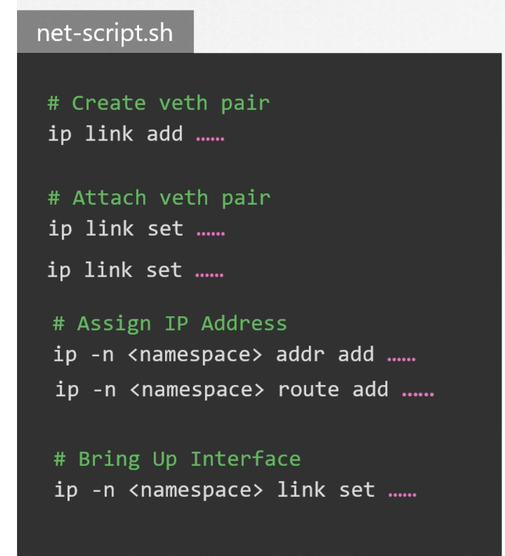

We then run the same script this time from the second container with its information and get the container connected to the network, the two containers can now communicate with each other. We copy the script to the other nodes and run the script on them to assign IP addresses and connect those containers to their own internal networks.

So we have solved the first part of the challenge.

The pods all get their own unique IP address and are able to communicate with each other on their own nodes. The next part is to enable them to reach other PODs on other nodes.

So, for example, the pod at 10.244.1.2 on node1 wants to ping POD, 10.244.2.2  on node2.

```text
Check the reachability$ ping 10.244.2.2
Connect: Network is unreachable
```

As of now, the first has no idea where the address 10.244.2.2 is because it is on a different network than its own. So it routes to node1’s IP as it is said to be the default gateway. Node1 doesn't know either, since 10.244.2.2 is a private network on node2

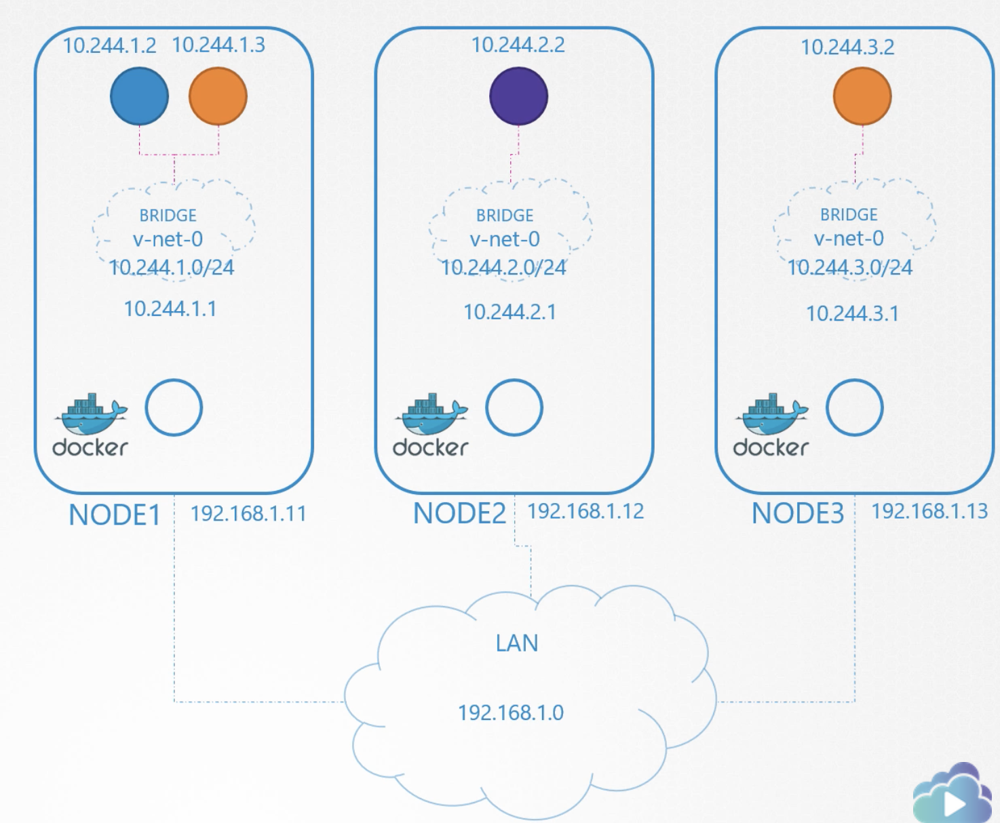

Add a route to node1’s routing table to route traffic to 10.244.2.2 via the second nodes IP at 190.168.1.12 

```bash
Add route in the routing table$ ip route add 10.244.2.2 via 192.168.1.12
```

Once the route is added, the blue pod is able to ping across.

Similarly, we configure routes on all hosts to all the other hosts with information regarding the respective networks within them. 

```bash
node01
$ ip route add 10.244.2.2 via 192.168.1.12
$ ip route add 10.244.3.2 via 192.168.1.13
```

node02

```bash
$ ip route add 10.244.1.2 via 192.168.1.11
$ ip route add 10.244.3.2 via 192.168.1.13
```

node03

```bash
$ ip route add 10.244.1.2 via 192.168.1.11
$ ip route add 10.244.2.2 via 192.168.1.12
```

Now this works fine in this simple setup, but this will require a lot more configuration, as in when your underlying network architecture gets complicated instead of having to configure a route on each server.

A better solution is to do that on a router if you have one in your network and point all hosts to use that as the default gateway.

That way you can easily manage routes to all networks in the routing table on the router.

With that, the individual virtual networks we created with the address 10.244.1.0/24 on each node now form a single large network with the address 10.244.0.0/16 

It's time to tie everything together. We performed a number of manual steps to get the environment ready with the networks and routing tables. 

We then wrote a script that can be run for each container that performs the necessary steps required to connect each container to the network. And we executed the script manually.

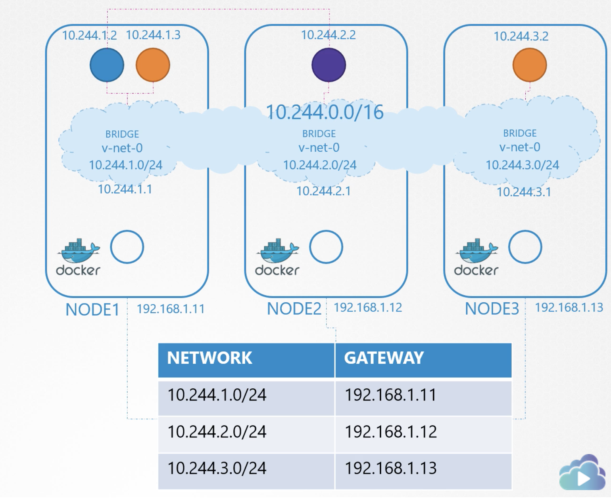

Of course, we don't want to do that, as in large environments where thousands of PODs are created every minute.

So how do we run the script automatically when a POD is created on kubernetes?

That's where CNI comes in. acting as the middleman, CNI tells kubernetes that this is how you should call a script as soon as you create a container.

And CNI tells us this is how your script should look like. So we need to modify the script a little bit to meet CNI standards. 

- It should have an add section that will take care of adding a container to the network and

- A delete section that will take care of deleting container interfaces from the network and freeing the IP address, etc.. So our script is ready.

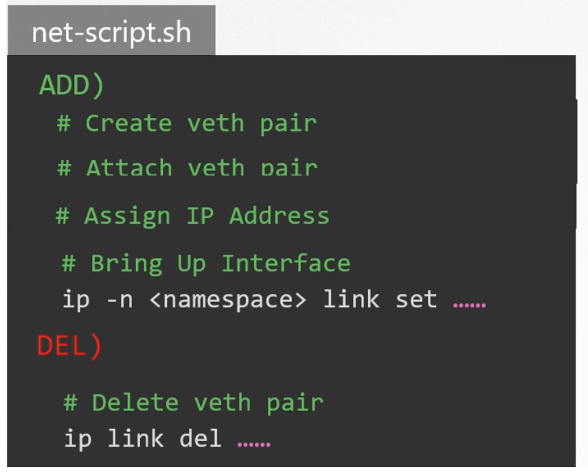

The Kubelit on each node is responsible for creating containers, whenever the container is created.

The kubelet looks at the CNI configuration passed as a command line argument when it was run and identifies our script's name.  It then looks in the CNI’s bin directory, defined our script and then executes the script with the ADD command and the name and namespace ID of the container.

And then our script takes care of the rest. 

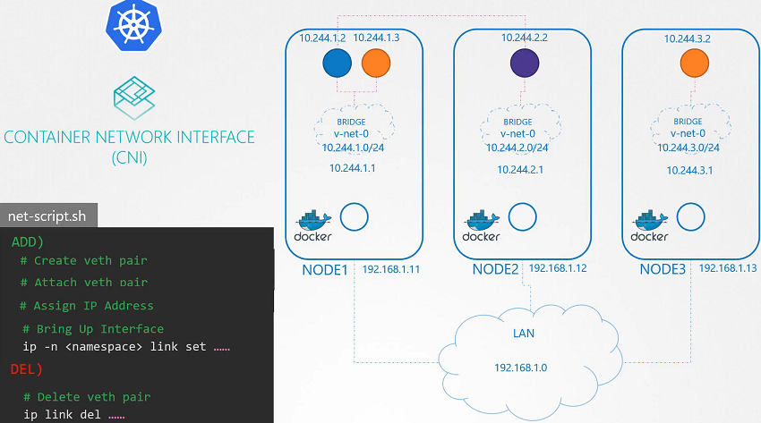

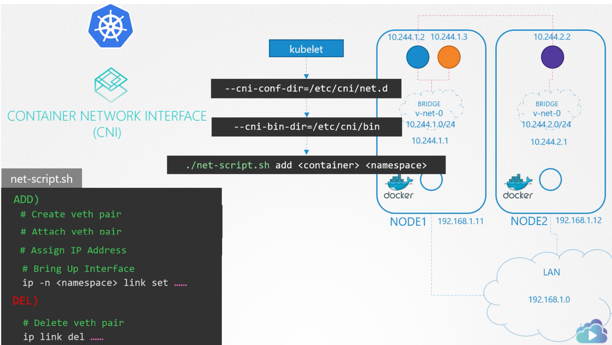

We will look at how and where the CNI is configured and kubernetes in the next lecture, along with practice tests.

### CNI in kubernetes

CNI in Kubernetes. 

In the prerequisite lectures we have started all the way from the absolute basics of network namespaces then we saw how it is done in Docker, we then discussed why you need standards for networking containers and how the container network interface (CNI) came to be and then we saw a list of supported plugins available with CNI.

In this chapter we will see how kubernetes is configured to use these network plugins. As we discussed in the pre-requisite lecture CNI defines the responsibilities of container runtime. As per CNI, container runtimes, in our case Kubernetes, is responsible for creating container network namespaces, identifying and attaching those namespaces to the right network by calling the right network plugin. 

**So where do we specify the CNI plugins for Kubernetes to use?** 

The CNI plugin must be invoked by the component within Kubernetes that is responsible for creating containers. Because that component must then invoke the appropriate network plugin after the container is created.

The CNI plugin is configured in the kubelet service on each node in the cluster. If you look at the kubelet service file, you will see an option called network-plugin set to CNI.

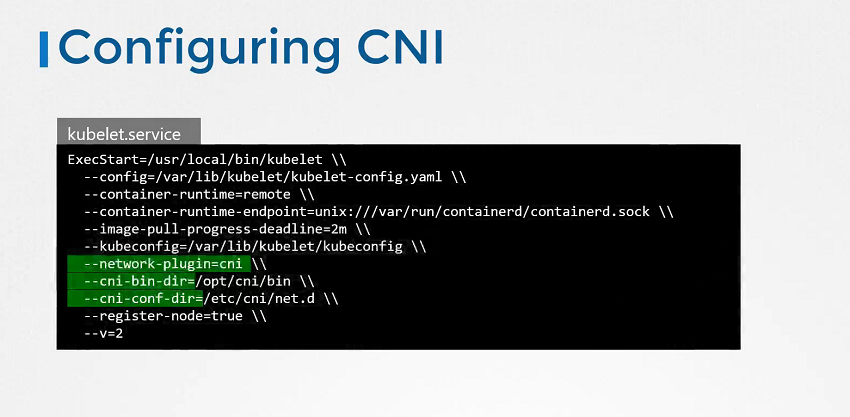

You can see the same information on viewing the running kubelet service. You can see the network plugins set to CNI and a few other options related to CNI such as the CNI bin directory and CNI Config directory. 

```bash
$ systemctl status kubelet.service
$ ps -aux | grep kubelet
```

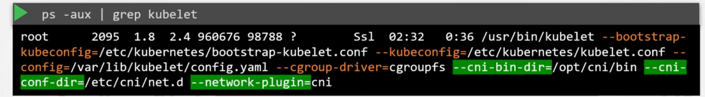

```text
To check all supportable plugins available in the /opt/cni/bin directory.
$ ls /opt/cni/bin
```

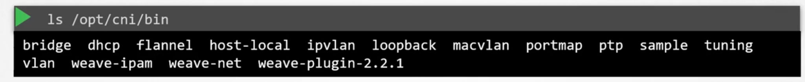

```text
To check the cni plugins which kubelet needs to be used.
ls /etc/cni/net.d
```


The CNI bin directory has all the supported CNI plugins as executables. Such as the **bridge**, **dhcp**, **flannel** etc. The CNI conflict directory has a set of configuration files. 

This is where kubelet looks to find out which plugin needs to be used. In this case it finds the bridge configuration file. If there are multiple files here, It will choose the one in alphabetical order.

If you look at the bridge conf file, it looks like this. 

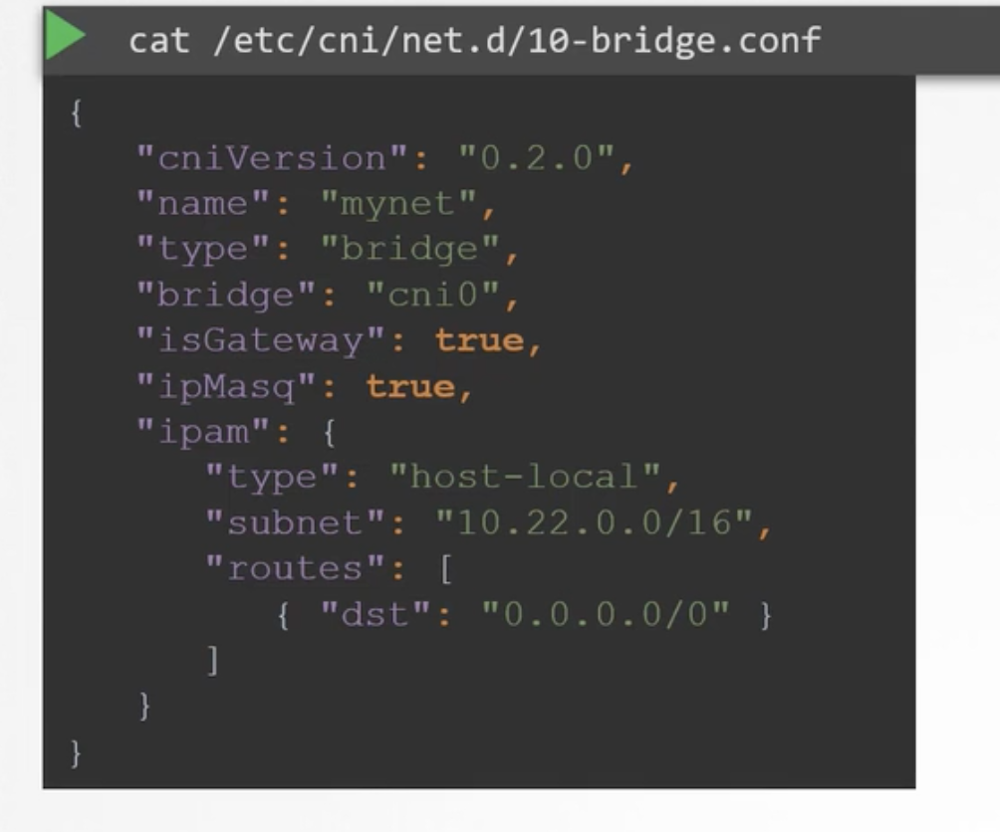

This is a format defined by the CNI standard for a plugin configuration file. . Its name is mynet, and its type is bridge. It also has a set of other configurations which can be related to the concepts we discussed in the prerequisite lectures on bridging, routing and Masquerading in NAT. 

The isGateway defines whether the bridge network interface should get an IP address assigned so it can act as a gateway. 

The ipMasq(uerade) defines if a NAT rule should be added for IP masquerading. 

The IPAM section defines ipam configuration. This is where you specify the subnet or the range of IP addresses that will be assigned to pods and any necessary routes. The **type** host-local indicates that the IP addresses are managed locally on this host.

Unlike a DHCP server maintaining it remotely. The type can also be set to DHCP to configure an external DHCP server.

### CNI Weave

We will discuss one network plugin solution based on CNI in particular **WeaveWorks**. The WeaveWorks/ weave CNI plugin. 

We will see more details about how it works. 

We will start where we left off in the POD Networking Concepts section. We had our own custom CNI script that we built and integrated into the kubelet through CNI. In the previous chapter we saw how, instead of our custom script, we can integrate the weave plugin. Let us now see how the weave solution works, as it is important to understand at least one solution well 

You should then be able to relate this to other solutions as well. 

So the networking solution we set up manually had a routing table which mapped what networks are on what hosts.

So when a packet is sent from one pod to the other, it goes out to the network, to the router and finds its way to the node that hosts that pod.

Now that works for a small environment and in a simple network. But in larger environments with 100s of nodes in a cluster and 100s of PODs on each node, This is not practical.

The routing table may not support so many entries and that is where you need to get creative and look for other solutions.Think of the kubernetes cluster as our company. And the nodes as different office sites. With each site, We have different departments and within each department we have different offices. Someone in office-1 wants to send a packet to office-3 and hands it over to the office boy. All he knows is it needs to go to office 3 and he doesn’t care who or how it is transported. The office boy takes the package, gets in his car, looks up the address of the target office in GPS, uses directions on the street and finds his way to the destination site. Delivers the package to the Payroll department who in turn forwards the package to office 3. 

This works just fine for now. We soon expand regions and countries and this process no longer works. It's hard for the office boy to keep track of so many routes to these large number of offices across different countries and of course he can’t drive to these offices by himself. That’s where we decide to outsource all mailing and shipping activities to a company who does it best. Once the shipping company is engaged.The first thing that they do is place their agents in each of our company's sites. These agents are responsible for managing all shipping activities between sites.

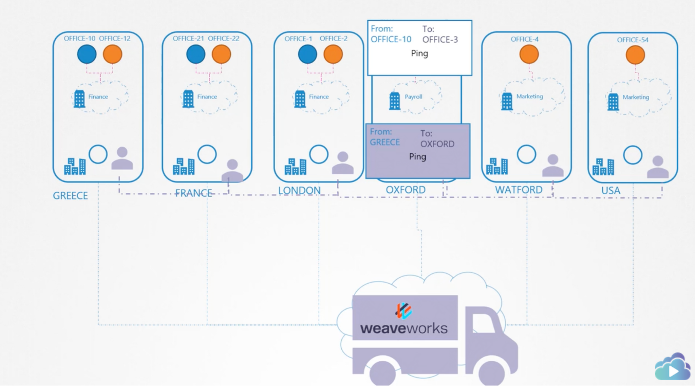

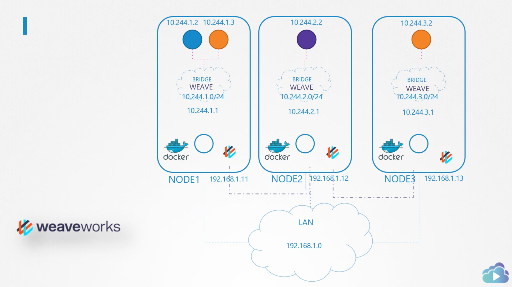

They also keep talking to each other and are well connected so they all know about each other's sites.The departments in them and the offices in them.And so when a package is sent from say office 10 to office 3 the shipping agent in that site intercepts the package, and looks at the target office name. He knows exactly in which site and department that office is in through his little internal network with his peers on the other sites. He then places this package into his own new package with the destination address said to the target site's location and then sends the package through. Once the package arrives at the destination it is again intercepted by the agent on that site.He opens the packet, retrieves the original packet and delivers it to the right department.Back to our world, where the weave CNI plugin is deployed on a cluster, it deploys an agent or service on each node. They communicate with each other to exchange information regarding the nodes and networks and PODs within them. Each agent or peer stores a topology of the entire setup, That way they know the pods and their IPs on the other nodes.Weave creates its own bridge on the nodes and names it weave. Then assigns IP addresses to each network. The IPs shown here are examples only.

 In the upcoming practice test you will figure out the exact range of IP addresses weave assigns on each node.

We will talk about IPAM(IP address management) and how IP addresses are handed out to PODs and containers in the next lecture.

Remember that a single POD may be attached to multiple bridge networks. For example you could have a pod attached to the weave bridge as well as the docker bridge created by Docker.

What path a packet takes to reach its destination depends on the route configured on the container. Weave makes sure that PODs get the correct route configured to reach the agent. And the agent then takes care of other PODs.

Now when a packet is sent from one pod to another on another node, weave intercepts the packet and  dentifies that it's on a separate network It then encapsulates this packet into a new one with new source and destination and sends it across the network.

Once on the other side, the other weave agent retrieves the packet, decapsulates and routes the packet to the right POD.

So how do we deploy weave on a kubernetes cluster?

Weave and weave peers can be deployed as services or daemons on each node in the cluster manually or if kubernetes is set up already Then an easier way to do that is to deploy it as pods in the cluster.

Once the base kubernetes system is ready with nodes and networking configured correctly between the nodes and the basic control plan components are deployed, weave can be deployed in the cluster with a single kubectl apply command.

```bash
Installing weave net onto the Kubernetes cluster with a single command.
$ kubectl apply -f "https://cloud.weave.works/k8s/net?k8s-version=$(kubectl version | base64 | tr -d '\n')"
serviceaccount/weave-net createdclusterrole.rbac.authorization.k8s.io/weave-net createdclusterrolebinding.rbac.authorization.k8s.io/weave-net createdrole.rbac.authorization.k8s.io/weave-net createdrolebinding.rbac.authorization.k8s.io/weave-net createddaemonset.apps/weave-net created
```

This deploys all the necessary components required for weave in the cluster.

Most importantly the weave peers are deployed as a daemonset. A daemonset ensures that one pod of the given kind is deployed on all nodes in the cluster. 

This works perfectly for the weave peers. If you deploy your cluster with the kubeadm tool and weave plugin, you can see the weave peers as pods deployed on each node. 

For troubleshooting purposes view the logs using the kubectl logs Command. 

```bash
$ kubectl get pods -n kube-system
NAME                                      READY   STATUS             RESTARTS   AGE
coredns-66bff467f8-894jf                  1/1     Running            0          52m
coredns-66bff467f8-nck5f                  1/1     Running            0          52m
etcd-controlplane                         1/1     Running            0          52m
kube-apiserver-controlplane               1/1     Running            0          52m
kube-controller-manager-controlplane      1/1     Running            0          52m
kube-keepalived-vip-mbr7d                 1/1     Running            0          52m
kube-proxy-p2mld                          1/1     Running            0          52m
kube-proxy-vjcwp                          1/1     Running            0          52m
kube-scheduler-controlplane               1/1     Running            0          52m
weave-net-jgr8x                           2/2     Running            0          45m
weave-net-tb9tz                           2/2     Running            0          45m

Logs
$ kubectl logs weave-net-tb9tz weave -n kube-system 
```

### View the default route in the Pod

```bash
$ kubectl run test --image=busybox --command -- sleep 4500
pod/test created

$ kubectl exec test -- ip route
default via 10.244.1.1 dev eth0
```

Test CNI Weave

- *→Inspect the kubelet service and identify the network plugin configured for Kubernetes.**

```bash
Run the command: ps -aux | grep kubelet and look at the configured --network-plugin flag.
→ What is the path configured with all binaries of CNI supported plugins?The CNI binaries are located under /opt/cni/bin by default.
→ Identify which of the below plugins is not available in the list of available CNI plugins on this host?
ls -l /opt/cni/bin
→ What is the CNI plugin configured to be used on this kubernetes cluster?
Run the command: ls /etc/cni/net.d/ and identify the name of the plugin.
```

- **What binary executable file will be run by kubelet after a container and its associated namespace are created.**

Look at the type field in file /etc/cni/net.d/10-flannel.conflist.

```yaml
root@controlplane:~# cat /etc/cni/net.d/10-flannel.conflist
{
  "name": "cbr0",
  "cniVersion": "0.3.1",
  "plugins": [
{
  "type": "flannel",
  "delegate": {
    "hairpinMode": true,
    "isDefaultGateway": true
  }
},
{
  "type": "portmap",
  "capabilities": {
    "portMappings": true
  }
}
  ]
}
```

- *→ Deploy weave-net networking solution to the cluster.****Replace the default IP address and subnet of weave-net to the 10.50.0.0/16. Please check the official weave installation and configuration guide which is available at the top right panel.**

```bash
By default, the range of IP addresses and the subnet used by weave-net is 10.32.0.0/12 and it's overlapping with the host system IP addresses.
To know the host system IP address by running ip a command :-
root@controlplane:~# ip a | grep eth0
12396: eth0@if12397: <BROADCAST,MULTICAST,UP,LOWER_UP> mtu 1450 qdisc noqueue state UP group default 
    inet 10.40.56.3/24 brd 10.40.56.255 scope global eth0
If we deploy a weave manifest file directly without changing the default IP addresses it will overlap with the host system IP addresses and as a result, it's weave pods will go into an Error or CrashLoopBackOff
root@controlplane:~# kubectl get po -n kube-system | grep weave
weave-net-6mckb                        1/2     CrashLoopBackOff   6          6m46s

If we will go more deeper and inspect the logs then we can clearly see the issue :-
root@controlplane:~# kubectl logs -n kube-system weave-net-6mckb -c weave
Network 10.32.0.0/12 overlaps with existing route 10.40.56.0/24 on host

So we need to change the default IP address by adding &env.IPALLOC_RANGE=10.50.0.0/16 option at the end of the manifest file. It should be look like as follows :- 

kubectl apply -f "https://cloud.weave.works/k8s/net?k8s-version=$(kubectl version | base64 | tr -d '\n')&env.IPALLOC_RANGE=10.50.0.0/16"
then run the kubectl get pods -n kube-system to see the status of weave-net pods.
Note :- 10.40.56.3 IP address is used here as an example. It may be different in your assigned lab.
```

### ipam weave

IP address management.

**So how does IP address management work in kubernetes?**

This section does not concern the IP address assigned to the nodes in the network. We can manage that on your own or with your own external IPAM solution for nodes. 

What this section covers is how are the virtual bridges networks and the nodes assigned an IP subnet. And how are the PODs assigned an IP. Where is this information stored and who is responsible for ensuring there are no duplicate IPs assigned.

**Let's start with The Who.** 

Let's ask CNI as they're the ones who define the standards. CNI says it is the responsibility of the CNI plugin the network solution provider, to take care of assigning IP to the containers. 

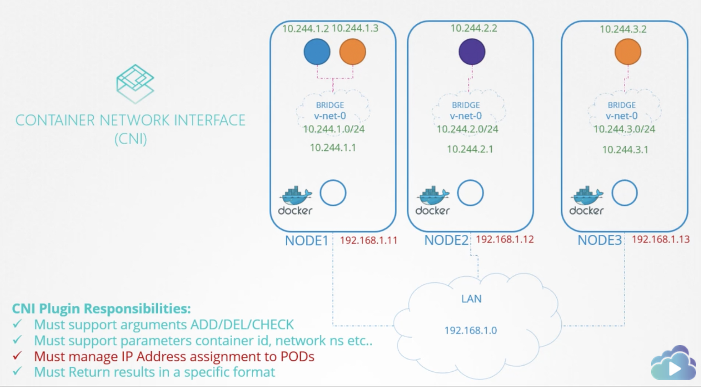

Remember the basic plugin we built earlier. We actually took care of assigning IP addresses within this plugin.

There was a section for assigning IP to the container network namespace.

**But how do we manage these IPs ?**Kubernetes doesn't care how we do it. We just need to do it by making sure we don't assign any duplicate IPs and manage it properly. An easy way to do it is to store the list of IPs in a file and make sure we have necessary code in our script to manage this file properly.

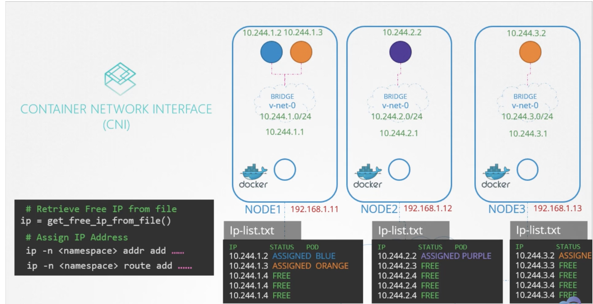

This file would be placed on each host and manages the IPs of PODs on those nodes, Instead of coding that ourselves in our script CNI comes with two built in plugins to which you can outsource this task to.

In this case the plugin that implements the approach that we followed for managing the IP addresses  locally on each host is the **host local plugin** but it is still our responsibility to invoke that plugin in our script or we can make our script dynamic to support different kinds of plugins.

The CNI configuration file has a section called IPAM in which we can specify the type of plug in to be used, the subnet and route to be used.

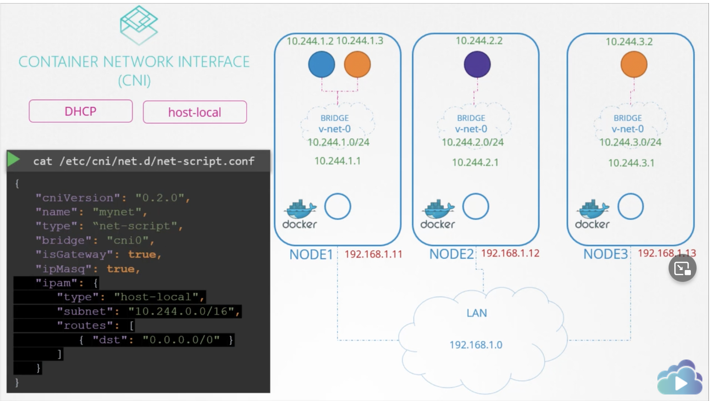

These details can be read from our script to invoke the appropriate plugin instead of hard coding it to use host local every time. 

Different network solution providers does it differently. Let's see how weaveworks manages IP addresses.

In fact you have seen some of the IPs assigned by weave in the previous practice test.

Weave by default allocates the IP address of the range10.32.0.0/12 for the entire network.

That gives the network IP from range 10.32.0.1 to 10.47.255.254 That's about a million IPs that you can use for PODs on the network.

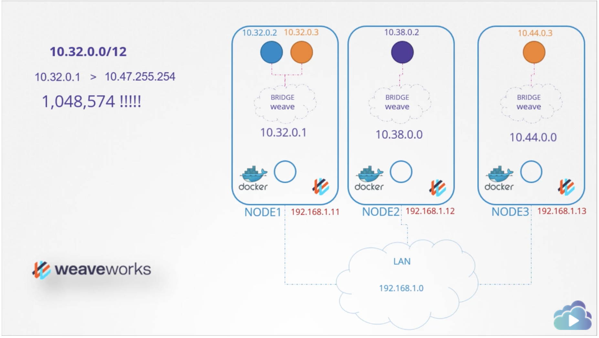

From this range the peers decide to split the IP addresses equally between them and assigns one portion to each node

pods created On this note we'll have it in this range. Of course these ranges are configurable with additional options past while deploying the weave plug into a cluster.

**Test Solutions**

- *→ What is the Networking Solution used by this cluster?**

Check the config file located at `/etc/cni/net.d/`

```yaml
root@controlplane:~# cat /etc/cni/net.d/10-weave.conflist
{
"cniVersion": "0.3.0",
"name": "weave",
"plugins": [
    {
        "name": "weave",
        "type": "weave-net",
        "hairpinMode": true
    },
    {
        "type": "portmap",
        "capabilities": {"portMappings": true},
        "snat": true
    }
]
}
```

- *→ How many weave agents/peers are deployed in this cluster?**

Run the command `kubectl get pods -n kube-system` and count weave pods

**What is the default gateway configured on the PODs scheduled on node01?**

**Try scheduling a pod on node01 and check ip route output**

```bash
$ kubectl run busybox --image=busybox --command sleep 100 --dry-run=client -o yaml > pod.yaml 
$ kubectl apply -f pod.yaml
$ kubectl exec -ti busybox -- sh 
$ ip r # inside the pod
```

### Service Networking

Service networking. 

In the previous lectures, we talked about pod networking, how bridge networks are created within each node and how PODs get a namespace created for them and how interfaces are attached to those namespaces and how PODs get an IP address assigned to them within the subnet assigned for that node.

And we also sort through routes or other overlay techniques. We can get the pods in different nodes to talk to each other, forming a large virtual network where all pods can reach each other.

Now you would rarely configure your pods to communicate directly with each other.

If you want to pod to access services hosted on another pod, you would always use a service. 

Let's quickly recap the different kinds of services. 

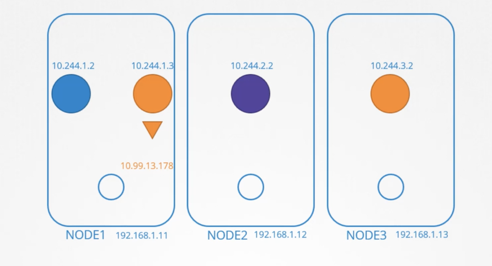

To make the orange pod accessible to the blue pod, we create an orange service. The orange service gets an IP address and a name assigned to it.The blue pod can now access the orange pod through the Orange Services IP or its name.

*We'll talk about name resolution in the upcoming lectures.*

For now, let's just focus on IP addresses.

The blue and orange PODs are on the same node.

**What about access from the other PODs? On other nodes?** when a service is created, it is accessible from all PODs on the cluster, irrespective of what nodes the PODs are on.

While a POD is hosted on a node as service is hosted across the cluster, it is not bound to a specific node.But remember, the service is only accessible from within the cluster. This type of service is known as cluster IP.

If the orange pod was hosting a database application that is to be only accessed from within the cluster, then this type of service works just fine. 

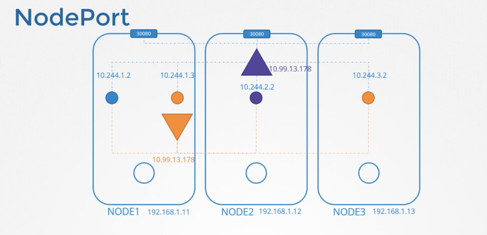

Say, for instance, the purple POD was hosting a web application, to make the application on the pod accessible outside the cluster, we create another service of type nodePort this service also gets an IP  address assigned to it and works just like cluster IP, as in all the other PODs, can access the service using its IP, but in addition, it also exposes the application on a port on all nodes in the cluster that way external users or applications have access to the service. 

**So that's the topic of our discussion for this lecture.**

Our focus is more on services and less on pods. 

**How are the services getting these IP addresses and how were they made available across all the nodes in the cluster?****How is the service made available to external users through a port on each node?**

Who is doing that and how and where do we see it?

So let's get started.

Let's start on a clean slate.

We have a three node cluster, no pods or services yet.

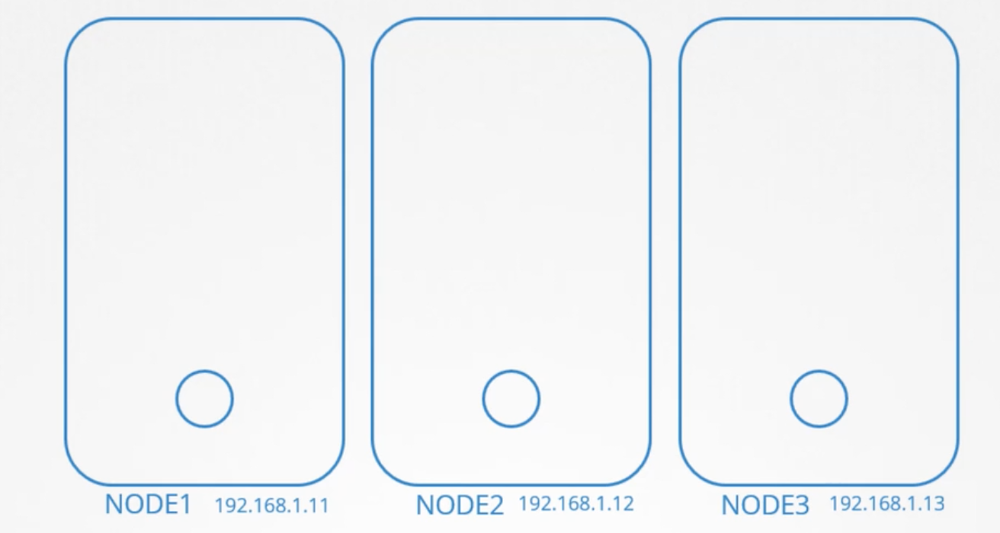

We know that every kubernetes node runs a kubelet process which is responsible for creating pods.

Each kubelet service on each node watches the changes in the cluster through the kubeAPI server, and every time a new POD is to be created, it creates the pod on the nodes. It then invokes the CNI plugin to configure networking for that pod.

Similarly, each node runs another component known as kubeProxy kubeProxy watches.

The changes in the cluster through kubeAPI server and every time a new service is to be created, kubeProxy gets into action.

Unlike pods, services are not created on each node or assigned to each node. Services are a cluster wide concept. They exist across all the nodes in the cluster. As a matter of fact, **they don't exist at all**. There is no server or service really listening on the IP of the service. We have seen that pods have containers and containers have namespaces with interfaces and IPs assigned to those interfaces.With services nothing like that exists. There are no processes or namespaces or interfaces for a service.**It's just a virtual object.**

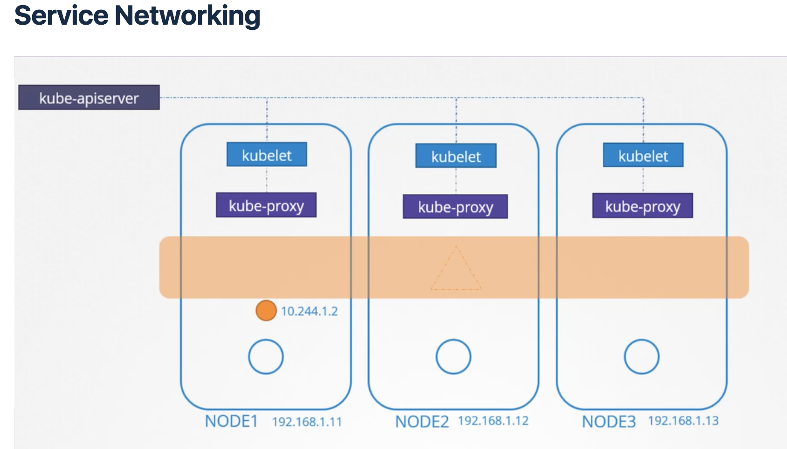

**Then how do they get an IP address and how are we able to access the application on the pod through service?**

When we create a service object in kubernetes, it is assigned an IP address from a predefined range.

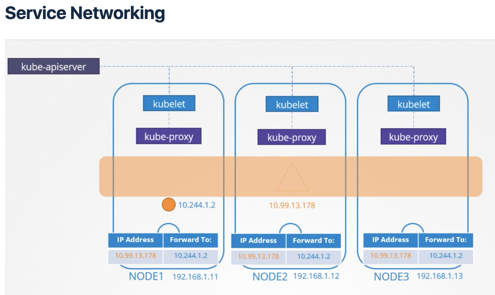

The kubeProxy components running on each node gets that IP address and creates forwarding rules on each node in the cluster, saying any traffic coming to this IP, the IP of the service should go to the IP of the pod. Once that is in place. Whenever a pod tries to reach the IP of the service, it is forwarded to the pod’s IP address, which is accessible from any node in the cluster. 

**Now, remember, it's not just the IP. It's an IP and port combination.**

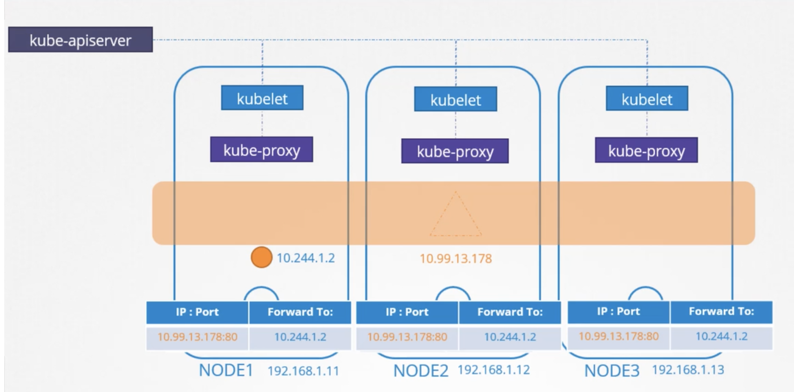

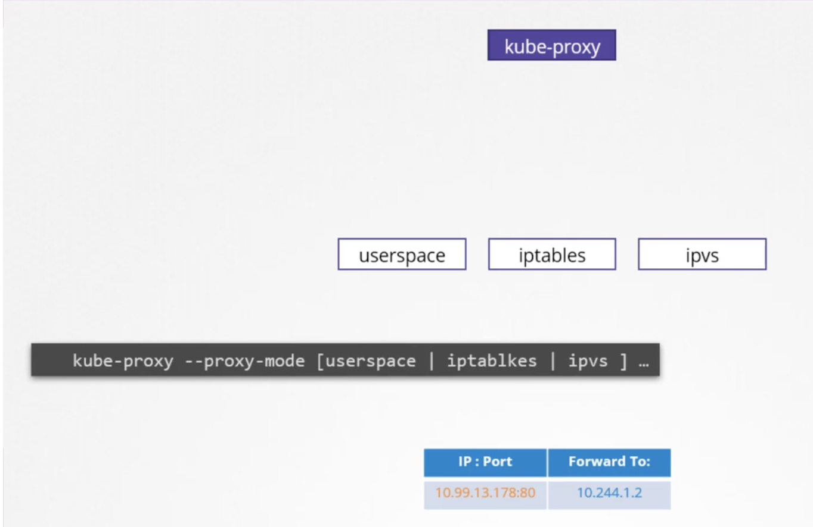

Whenever services are created or deleted, the kubeproxy component creates or deletes these rules.**So how are these rules created?**kubeProxy supports different ways, such as user space where kube-proxy listens on a port for each service and second is proxies connections to the pods by creating IPVS rules for the third and the default option and the one familiar to us is using IP tables.

The proxy mode can be set using the proxy mode option while configuring the kube-proxy service.


If this is not set, it defaults to IP tables.

So we'll see how IP tables are configured by kube-proxy and how you can view them on the nodes.

We have a pod named DB deployed on Node one, it has IP addresses 10.244.1.2.

We create a service of type cluster IP to make this POD available within the cluster.

When the service is created, kuberntes assigns an IP address to it.

It is set to 10.103.132.104  this range is specified in the kubeAPI servers option called `service cluster IP range`, which is by default said to 10.0.0.0/24

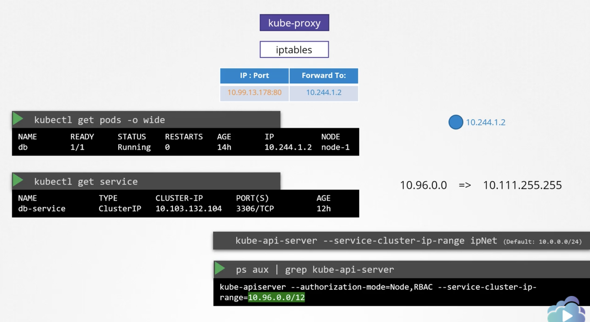

In my case, if I look at my kubeAPI server option, I see it is set to 10.96.0.0/12 

That gives my services IP anywhere from 10.96.0.0 to 10.111255.255

A relative point to mention here, when I set up my POD networking, I provided a pod network CIDR range of 10.244.0.0/16, which gives my pod IP addresses from 10.244.0.0 to 10.244.255.255. 

The reason I brought this up here is because whatever range is specified for each of these networks, it shouldn't overlap, which it doesn't In this case.

Both of these should have it’s own dedicated range of IP to work with.

There shouldn't be a case where a pod and a service are assigned the same IP address.

So getting back to services, that's how my service got an IP address of 10.103.132.104 

You can see the rules created by kube-proxy in the IP table’s NAT table output, search for the name of the service as all rules created by kube-proxy have a comment with the name of the service on it.

```bash
iptables -L -t nat | grep db-service
```

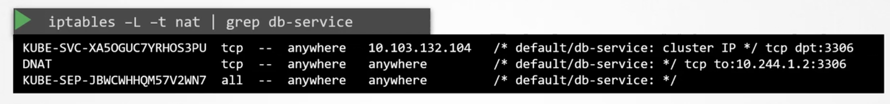

These rules mean any traffic going to the IP address 10.103.132.104 on port 3306, which is the IP of the service, should have its destination address changed to 10.244.1.2:3306  which is the IP of the POD.

This is done by adding a DNAT rule to IP tables.

Similarly, when you create a services of type nodePort kube-proxy creates IP table rules to forward all traffic coming on a port, on all nodes to the respective backend POD.

You can also see kubeProxy creating these entries in the kube-proxy logs itself.

In the logs you will find what proxier it uses, in this case its IPtables, and then adds an entry when it added a new service for the database.

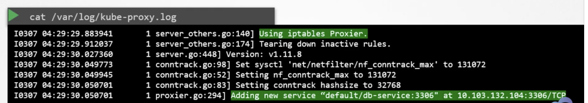

Note that the location of this file might vary depending on your installation. If you don't see these entries, you must also check the verbosity level of the process as well.

- *→ What network range are the nodes in the cluster part of?**updated eth0 range

- *→ What is the range of IP addresses configured for PODs on this cluster?**

The network is configured with weave. Check the weave pods logs using command `kubectl logs <weave-pod-name> weave -n kube-system` and look for `ipalloc-range`

```bash
root@controlplane:~# kubectl logs weave-net-d4p4z weave -n kube-system | grep ipalloc
INFO: 2022/05/05 08:45:38.733582 Command line options: map[conn-limit:200 datapath:datapath db-prefix:/weavedb/weave-net docker-api: expect-npc:true http-addr:127.0.0.1:6784 ipalloc-init:consensus=1 ipalloc-range:10.50.0.0/16 metrics-addr:0.0.0.0:6782 name:3e:40:49:1d:97:70 nickname:node01 no-dns:true no-masq-local:true port:6783]
```

- *→ What is the IP Range configured for the services within the cluster?**

Inspect the setting on kube-api server by running on command cat `/etc/kubernetes/manifests/kube-apiserver.yaml | grep cluster-ip-range`

```bash
root@controlplane:~# cat /etc/kubernetes/manifests/kube-apiserver.yaml | grep cluster-ip-range
- --service-cluster-ip-range=10.96.0.0/12
```

- *→ How many kube-proxy pods are deployed in this cluster?**

root@controlplane:~# kubectl get pods --all-namespaces

NAMESPACE NAME                               READY   STATUSRESTARTS   AGE

kube-system   coredns-74ff55c5b-7rqnn            1/1 Running   0      36m

kube-system   coredns-74ff55c5b-87rx8            1/1 Running   0      36m

kube-system   etcd-controlplane                  1/1 Running   0      36m

kube-system   kube-apiserver-controlplane        1/1 Running   0      36m

kube-system   kube-controller-manager-controlplane   1/1 Running   0      36m

kube-system   kube-proxy-bsh6s                   1/1 Running   0      36m

kube-system   kube-proxy-zkbsb                   1/1 Running   0      34m

kube-system   kube-scheduler-controlplane        1/1 Running   0      36m

kube-system   weave-net-d4p4z                    2/2 Running   0      34m

kube-system   weave-net-qqphk                    2/2 Running   1      36m

- *→ What type of proxy is the kube-proxy configured to use?**

Check the logs of the kube-proxy pods. Run the command: `kubectl logs <kube-proxy-pod-name> -n kube-system`

```bash
I0505 08:44:56.822060   1 node.go:172] Successfully retrieved node IP: 10.17.14.6
I0505 08:44:56.822099   1 server_others.go:142] kube-proxy node IP is an IPv4 address (10.17.14.6), assume IPv4 operation
W0505 08:44:56.915975   1 server_others.go:578] Unknown proxy mode "", assuming iptables proxy
I0505 08:44:58.291922   1 server_others.go:185] Using iptables Proxier.
I0505 08:44:58.600646   1 server.go:650] Version: v1.20.0
I0505 08:44:58.669359   1 conntrack.go:52] Setting nf_conntrack_max to 1179648
I0505 08:44:58.677387   1 conntrack.go:100] Set sysctl 'net/netfilter/nf_conntrack_tcp_timeout_established' to 86400
```

- **How does this Kubernetes cluster ensure that a kube-proxy pod runs on all nodes in the cluster?**

**Inspect the kube-proxy pods and try to identify how they are deployed**

```bash
Run the command: kubectl get ds -n kube-system
# ds - deamonset
```

### DNS in kubernetes

DNS in the Kubernetes cluster. 

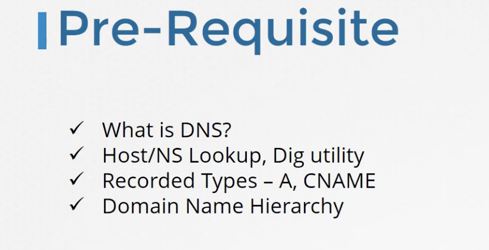

In this chapter we will see what names are assigned to what objects, what our **service DNS** records, **POD DNS** records,  What are the different ways you can reach one POD from another. In the next lecture, we will see how Kubernetes implements DNS in the cluster. So we have a 3 node kubernetes cluster with some PODs and services deployed on them. Each node has a nodename and IP address assigned to it. 

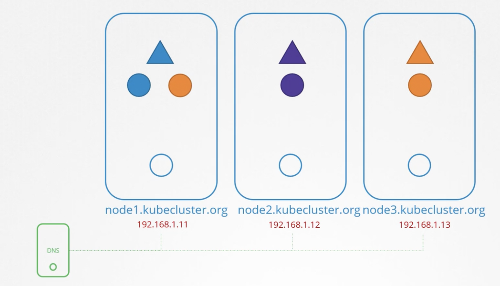

The node names and IP addresses of the cluster are probably registered in a DNS server in your organization.

Now how that is managed, who accesses them is not of concern in this lecture. In this lecture we discuss about DNS resolution within the cluster, between the different components in the cluster such as PODs and services. Kubernetes deploys a built-in DNS server by default when you set up a cluster. If you set up kubernetes manually, then you do it by yourself. 

We will see how that is done and how it is configured in the next chapter.

As far as this chapter is concerned we will see how it helps pods resolve other pods and services within the cluster. So we don't really care about nodes. We focus purely on PODs and services within the cluster. As long as our cluster networking is set up correctly, following the best practices we learned so far in this section, and all pods and services can get their own IP address and can reach each other we should be good.

Let’s start with just two PODs and a service.

I have a test pod on the left with the IP set to 10.244.1.5. And I have a web pod on the right, with the IP set to 10.244.2.5. Looking at their IPs, you can guess that they are probably hosted on two different nodes. But that doesn’t matter, as far as DNS is concerned. We assume that all PODs and services can reach other using their IP addresses. To make the web server accessible to the test pod, we create a service. We name it Web service and the service gets an IP 10.107.37.188. ***Whenever a service is created, the kubernetes DNS service creates a record for the service. It maps the service name to the IP address.*** So within the cluster any pod can now reach the service using its service name.

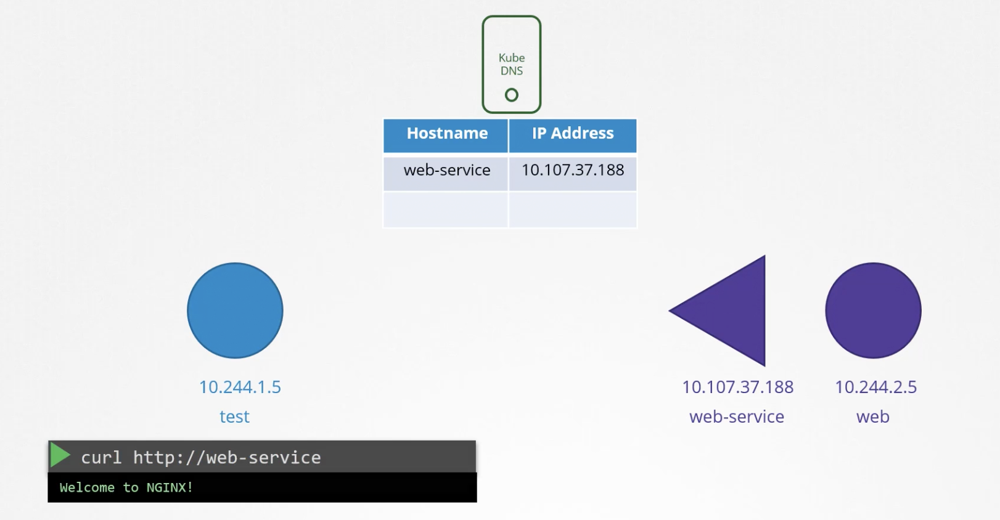

Remember we talked about namespaces earlier. That everyone within the namespace address each other just with their first names and to address anyone in another namespace you use their full names ? In this case since the test pod and the web pod and its associated service are all in the same namespace, “*The default namespace*”. You were able to simply reach the web-service from the test pod using just the service name web-service.

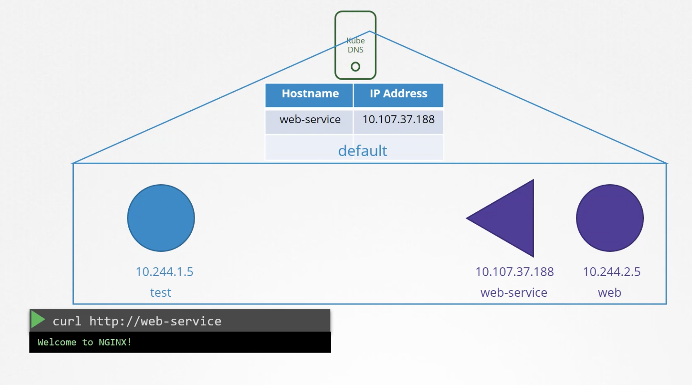

Let's assume the web service was in a separate namespace named ***apps***. Then to refer to it from the default namespace you would have to say ***web-service.apps.*** The last name of the service is now the name of the namespace.

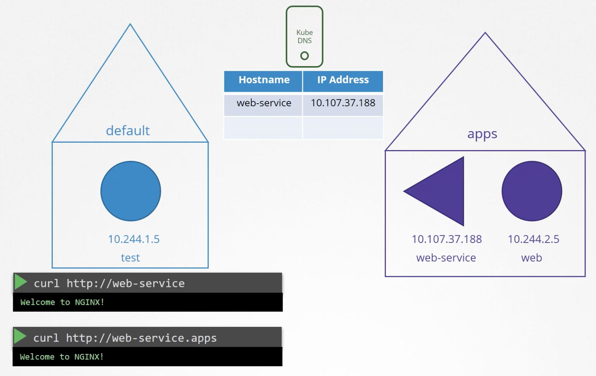

So here web service is the name of the service and apps is the name of the namespace. For each namespace The DNS server creates a subdomain. All the services are grouped together into another subdomain called SVC.**So what was that about?**Let's take a closer look.**web-service** is the name of the service and **apps** is the name of the namespace. For each namespace the DNS server creates a subdomain with its name. All pods and services for a namespace are thus grouped together within a subdomain in the name of the namespace.→ All the services are grouped together into another subdomain called **svc**.→ So you can reach your application with the name **web-service.apps.svc**.

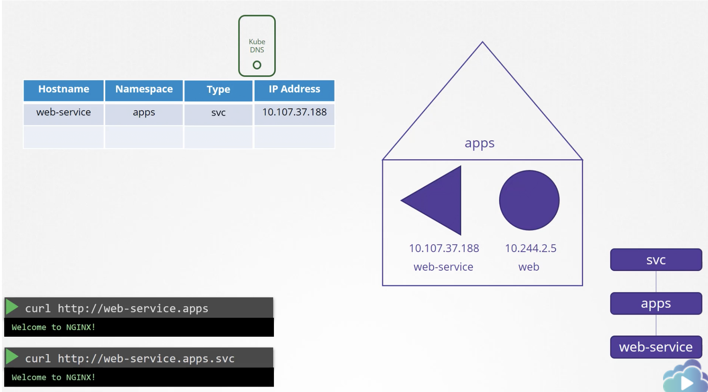

Finally, all the services and PODs are grouped together into a root domain for the cluster, which is set to **cluster.local** by default. So you can access the service using the URL **web-service.apps.svc.cluster.local**. And that’s the fully qualified domain name for the service.→ So that's how services are resolved within the cluster.

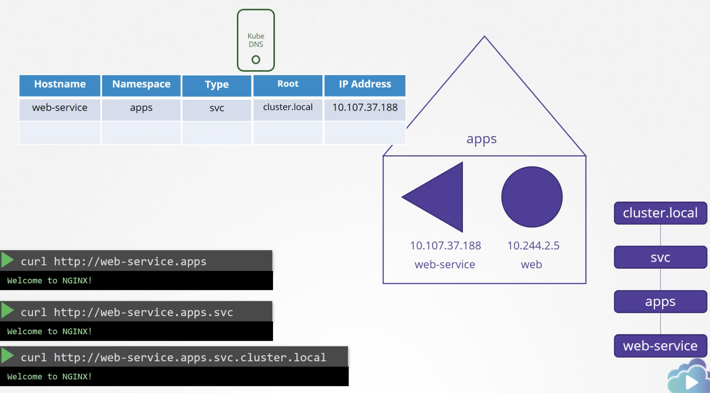

**What about PODs?** 

Records for PODs are not created by default. But we can enable that explicitly, We will see that in the next chapter. Once enabled, Records are created for pods as well.

It does not use the POD name though. For each POD kubernetes generates a name by replacing the dots in the IP address with dashes. 

The namespace remains the same and type is set to pod. The root domain is always cluster.local.

Similarly the test POD in the default namespace, gets a record in the DNS server, with its IP converted to a dashed hostname **10-244-1-5** and namespace set to default, type is POD and root is **cluster.local.**

### CoreDNS in Kubernetes

```text
How kubernetes implements DNS in the cluster.
```

In the previous chapter we saw how you can address a service or pod from another pod. In this lecture we will see how kubernetes makes that possible.

Say you were given two pods with two IP addresses.

**How would you do it?**

Based on what we learned in the prerequisite lectures on DNS, an easy way to get them to resolve each other is to add an entry into each of their /etc/hosts files. 

On the first pod I would say the second pod **web** is at 10.244.2.5

and on the second pod I would say the first pod **test** is at 10.244.1.5.

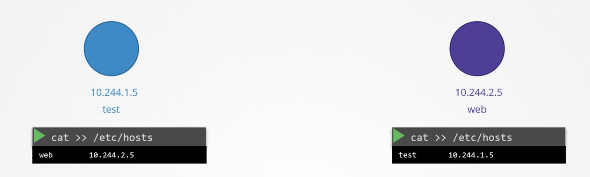

But of course, when you have 1000s of PODs in the cluster, and 100s of them being created and deleted every minute. This is not a suitable solution.So we move these entries into a central DNS server. We then point these PODs to the DNS server by adding an entry into their /etc/resolv.conf file specifying that the nameserver is at the IP address of the DNS server, which happens to be 10.96.0.10 in this case. Every time a new pod is created, we add a record in the DNS server for that pod so that other pods can access the new POD, and configure the /etc/resolv.conf file in the POD to the DNS server so that the pod can resolve other pods in the cluster.

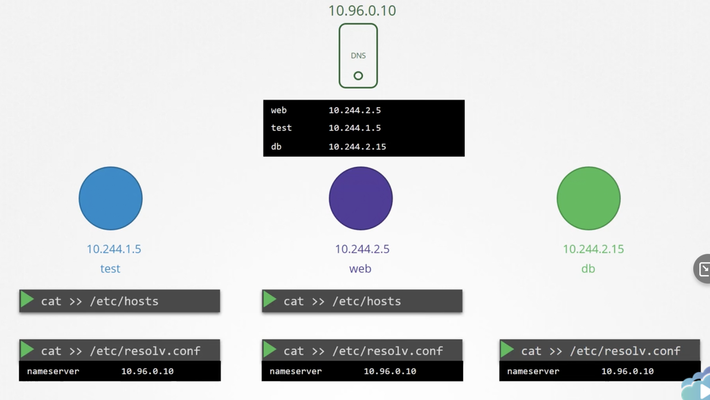

This is kind of how kubernetes does it. Except that it does not create similar entries for PODs to map podname to its IP address as we have seen in the previous lecture. It does that for services.

For pods it forms host names by replacing dots with dashes in the IP address of the pod. Kubernetes implements DNS in the same way. It deploys a DNS server within the cluster.

Prior to version v1.12 the DNS implemented by kubernetes was known as kube-dns. With Kubernetes version 1.12 the recommended DNS server is **CoreDNS**. We took a brief look at a core DNS in one of the prerequisite lectures.

**So how is the coreDNS setup in the cluster?** 

The CoreDNS server is deployed as a POD in the kube-system namespace in the kubernetes cluster. Well they are deployed as two pods for redundancy, as part of a replicaSet, they are actually a replicaset within a deployment. But it doesn’t really matter. We’ll just see CoreDNS as a POD in this lecture.

```bash
$ kubectl get pods -n kube-system
NAME                                      READY   STATUS    RESTARTS   AGE
coredns-66bff467f8-2vghh                  1/1     Running   0          53m
coredns-66bff467f8-t5nzm                  1/1     Running   0          53m

$ kubectl get deployment -n kube-system
NAME                      READY   UP-TO-DATE   AVAILABLE   AGE
coredns                   2/2     2            2           53m
$ kubectl get configmap -n kube-system
NAME                                 DATA   AGE
coredns                              1      52m
```

This POD runs the coreDNS executable, the same executable that we ran when we deployed CoreDNS ourselves.

CoreDNS requires a configuration file. In our case we used a file named Corefile. So does kubernetes.

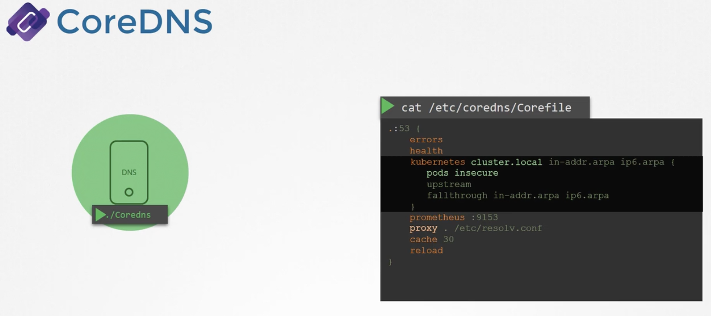

```bash
$ kubectl describe cm coredns -n kube-system

Corefile:
---
.:53 {
    errors
    health {       lameduck 5s
    }
    ready
    kubernetes cluster.local in-addr.arpa ip6.arpa {
       pods insecure
       fallthrough in-addr.arpa ip6.arpa
       ttl 30
    }
    prometheus :9153
    forward . /etc/resolv.conf
    cache 30
    loop
    reload
}
```

### → To view the Service

```bash
$ kubectl get service -n kube-system
NAME       TYPE        CLUSTER-IP   EXTERNAL-IP   PORT(S)                  AGE
kube-dns   ClusterIP   10.96.0.10   <none>        53/UDP,53/TCP,9153/TCP   62m
```

It uses a file named Corefile located at `/etc/coredns`. Within this file you have a number of plugins configured. The ones highlighted in orange. Plugins are configured for handling errors, reporting health, monitoring metrics, cache etc. The plugin that makes CoreDNS work with Kubernetes, is the **kubernetes** plugin. And this is where the top level domain name for the cluster is set. In this case `cluster.local`. So every record in the coredns DNS server falls under this domain. Within the kubernetes plugin there are multiple options. The pods option you see here, is what is responsible for creating a record for PODs in the cluster.

Remember we talked about a record being created for each POD by converting their IPs into a dashed format that's disabled by default. 

But it can be enabled with this entry here. 

Any record that this DNS server can’t solve, for example say a POD tries to reach www.google.com it is forwarded to the nameserver specified in the coredns pods `/etc/resolv.conf` file. The `/etc/resolv.conf` file is set to use the nameserver from the kubernetes Node. Also note that this core file is passed into the pod as a `configMap` object. That way if you need to modify this configuration you can edit the `ConfigMa`p object.

```bash
$ kubectl get configmap -n kube-system
NAME                                 DATA   AGE
coredns                              1      52m
```

We now have the coredns pod up and running using the appropriate kubernetes plugin.

It watches the kubernetes cluster for new PODs or services, and every time a pod or a service is created it adds a record for it in its database. 

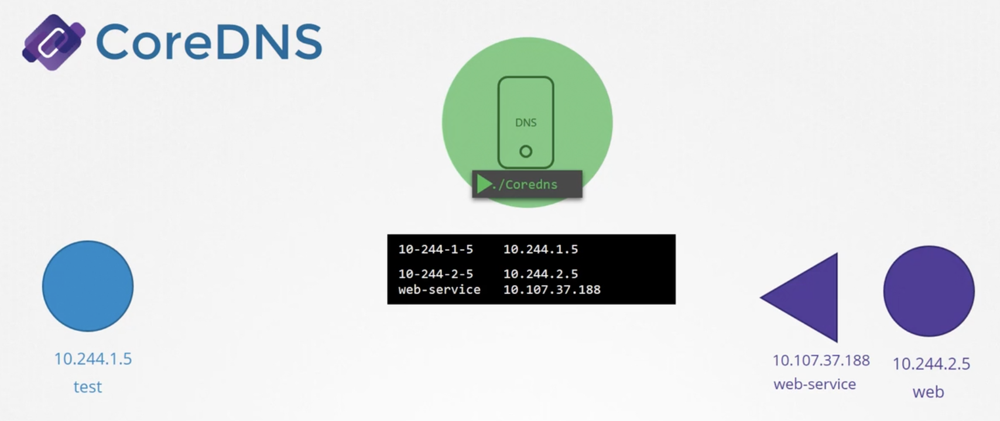

Next step is for the pod to point to the coreDNS server.

**What address do the PODs use to reach the DNS server?** 

When we deploy CoreDNS solution, It also creates a service to make it available to other components within a cluster. The service is named as `kube-dns` by default. The IP address of this service is configured as nameserver on the PODs.

Now you don’t have to configure this yourself. The DNS configurations on PODs are done by kubernetes automatically when the PODs are created. 

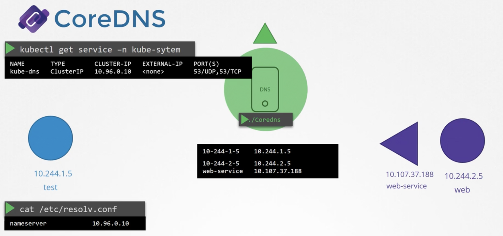

**Want to guess which kubernetes component is responsible for that?** **The kubelet.** If you look at the config file of the kubelet you will see the IP of the `DNS server and domain in it`.

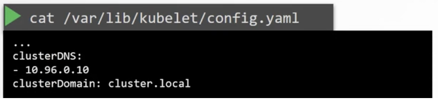

Once the pods are configured with the right nameserver, you can now resolve other pods and services. You can access the web-service using just `web-service, or web-service.default` or `web-service.default.svc` `or` `web-service.default.svc.cluster.local.`

If you try to manually lookup the `web-service` using nslookup or the host command web-service command, it will return the fully qualified domain name of the web-service, which happens to be `web-service.default.svc.cluster.local.`

But you didn't ask for that, you just set web-service.

**So how did it look up for the full name?**

It so happens, the resolv.conf file also has a search entry which is set to `default.svc.cluster.local` as well as `svc.cluster.local and cluster.local.`

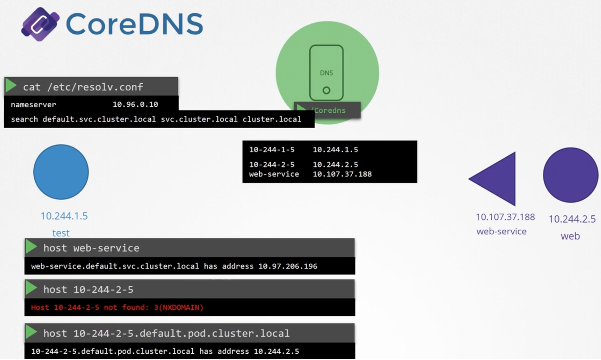

```text
With the host command, we will get fully qualified domain name (FQDN).
$ host web-service
web-service.default.svc.cluster.local has address 10.106.112.101

$ host web-service.default
web-service.default.svc.cluster.local has address 10.106.112.101

$ host web-service.default.svc
web-service.default.svc.cluster.local has address 10.106.112.101

$ host web-service.default.svc.cluster.local
web-service.default.svc.cluster.local has address 10.106.112.101
```

This allows you to find the service using any name. web-service or web-service.default or web-service.default.svc.

However, notice that it only has search entries for service . So you won’t be able to reach a pod the same way.

For that you need to specify the full FQDN of the pod.

### To view the /etc/resolv.conf file

```bash
$ kubectl run -it --rm --restart=Never test-pod --image=busybox -- cat /etc/resolv.conf
nameserver 10.96.0.10
search default.svc.cluster.local svc.cluster.local cluster.local
options ndots:5
pod "test-pod" deleted
```

### Resolve the Pod

```yaml
$ kubectl get pods -o wide
NAME      READY   STATUS    RESTARTS   AGE     IP           NODE     NOMINATED NODE   READINESS GATES
test-pod   1/1     Running   0          11m     10.244.1.3   node01   <none>           <none>
nginx      1/1     Running   0          10m     10.244.1.4   node01   <none>           <none>

$ kubectl exec -it test-pod -- nslookup 10-244-1-4.default.pod.cluster.local
Server:    10.96.0.10
Address 1: 10.96.0.10 kube-dns.kube-system.svc.cluster.local

Name:      10-244-1-4.default.pod.cluster.local
Address 1: 10.244.1.4 

Resolve the Service
$ kubectl get service
NAME          TYPE        CLUSTER-IP       EXTERNAL-IP   PORT(S)   AGE
kubernetes    ClusterIP   10.96.0.1        <none>        443/TCP   85m
web-service   ClusterIP   10.106.112.101   <none>        80/TCP    9m

$ kubectl exec -it test-pod -- nslookup web-service.default.svc.cluster.local
Server:    10.96.0.10
Address 1: 10.96.0.10 kube-dns.kube-system.svc.cluster.local

Name:      web-service.default.svc.cluster.local
Address 1: 10.106.112.101 web-service.default.svc.cluster.local
→ Identify the DNS solution implemented in this cluster.
kubectl get pods -n kube-system
→ How many pods of the DNS server are deployed?
kubectl get pods -n kube-system→ What is the name of the service created for accessing CoreDNS?root@controlplane:~# kubectl get serviceNAME       TYPE    CLUSTER-IP  EXTERNAL-IP   PORT(S)    AGEkubernetes ClusterIP   10.96.0.1   <none>    443/TCP    21mtest-service   NodePort10.104.250.67   <none>    80:30080/TCP   7m26sweb-serviceClusterIP   10.96.49.35 <none>    80/TCP     7m27sroot@controlplane:~# kubectl get service -n kube-systemNAME   TYPE    CLUSTER-IP   EXTERNAL-IP   PORT(S)              AGEkube-dns   ClusterIP   10.96.0.10   <none>    53/UDP,53/TCP,9153/TCP   22m
→ What is the IP of the CoreDNS server that should be configured on PODs to resolve services?
root@controlplane:~# kubectl get service -n kube-systemNAME   TYPE    CLUSTER-IP   EXTERNAL-IP   PORT(S)              AGEkube-dns   ClusterIP   10.96.0.10   <none>    53/UDP,53/TCP,9153/TCP   22m
→ Where is the configuration file located for configuring the CoreDNS service?
Run the command: kubectl -n kube-system describe deployments.apps coredns | grep -A2 Args | grep Corefile
or
kubectl get deploy coredns -n kube-system -o yaml #and then look for args under spec: 
→ How is the Corefile passed in to the CoreDNS POD?
passed as ConfigMap object 
→ What is the name of the ConfigMap object created for Corefile?
Run the command: kubectl get configmap -n kube-system and identify the name.
root@controlplane:~# kubectl get configmaps -n kube-system
NAME                             DATA   AGE
coredns                          1  32m
extension-apiserver-authentication   6  32m
kube-flannel-cfg                 2  32m
kube-proxy                       2  32m
kube-root-ca.crt                 1  32m
kubeadm-config                   2  32m
kubelet-config-1.20              1  32m

What is the root domain/zone configured for this kubernetes cluster?
Run the command: kubectl describe configmap coredns -n kube-system and look for the entry after kubernetes.
kubectl get svc
→ Which of the names CANNOT be used to access the HR service from the test pod?
kubectl get svc
kubectl describe svc web-service 
kubectl get pod hr -show-labels 

web-service
→ Which of the below names can be used to access the payroll service from the test application?

→ We just deployed a web server - webapp - that accesses a database mysql - server. However the web server is failing to connect to the database server. Troubleshoot and fix the issue.
They could be in different namespaces. First locate the applications. The web server interface can be seen by clicking the tab Web Server at the top of your terminal.Set the DB_Host environment variable to use mysql.payroll.Run the command: kubectl edit deploy webapp and correct the DB_Host value.
kubectl get pods --all-namespaces
name: DB_Hostvalue: mysql.payroll # old value mysql
→ From the hr pod nslookup the mysql service and redirect the output to a file /root/CKA/nslookup.out
kubectl exec -it test-pod -- nslookup web-service.default.svc.cluster.local
kubectl exec -it hr -- nslookup mysql.payroll| tee /root/CKA/nslookup1.out
```

### Ingress

We will discuss about ingress in kubernetes. 

One of the common questions that students reach out about usually is regarding services and ingress. 

*What's the difference between the two and when to use what. ?*

So we're going to briefly revisit services and work our way towards ingress.

We will start with a simple scenario. You are deploying an application on Kubernetes for a company that has an online store selling products. Your application would be available at say **my-online-store.com.**

You build the application into a Docker Image and deploy it on the kubernetes cluster as a POD in a Deployment. Your application needs a database so you deploy a MySQL database as a POD and create a service of type **ClusterIP** called **mysql-service** to make it accessible to your application. 

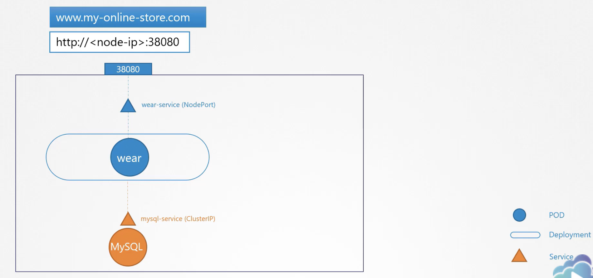

Your application is now working. To make the application accessible to the outside world, you create another service, this time of type **NodePort** and make your application available on a high-port on the nodes in the cluster. In this example a **port 38080** is allocated for the service. The users can now access your application using the URL: http://<node- IP>:<port> of any of your nodes followed by port 38080. That setup works and users are able to access the application. Whenever traffic increases, we increase the number of replicas of the pod to handle the additional traffic and the service takes care of splitting traffic between the pods. However, if you have deployed a production grade application before you know that there are many more things involved in addition to simply splitting the traffic between the pods.

For example we do not want the users to have to type in an IP address every time, so you configure your DNS server to point to the IP of the nodes, your users can now access your application using the URL. **my-online-store.com and port 38080.**

Now you don't want your users to have to remember port number either.

However service **NodePort** can only allocate high numbered ports which are greater than 30000 so you then bring in an additional layer between the DNS server and your cluster like a proxy server, that proxies requests on port 80 to port 38080 on your nodes. You then point your DNS to this server, and users can now access your application by simply visiting **my-online-store.com.**

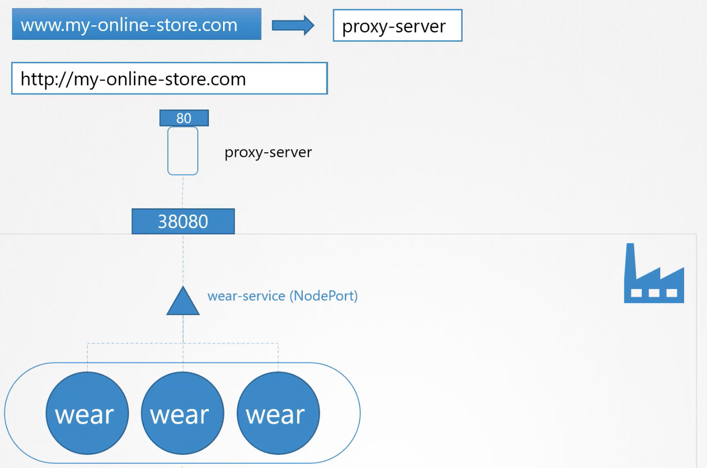

Now this is if your application is hosted onprem in your data center.

Let's take a step back and see what you could do if you were on a public cloud environment like **Google Cloud Platform.**

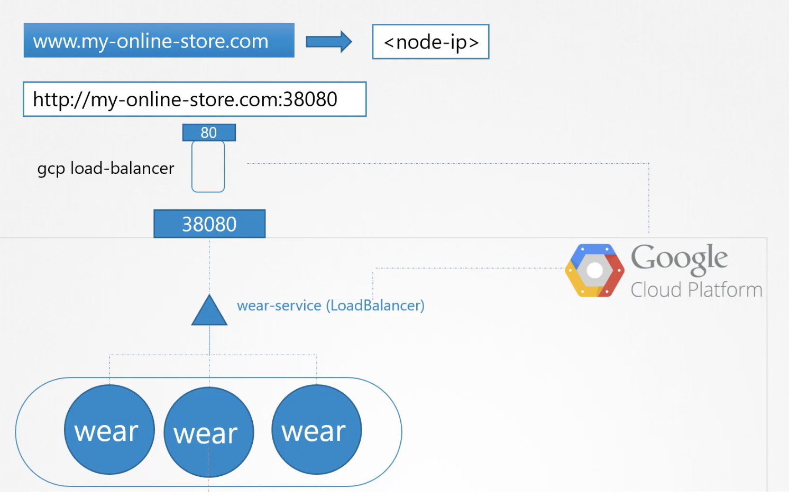

In that case, instead of creating a service of type NodePort for your wear application, you could set it to type load balancer.

When you do that, Kubernetes would still do everything that it has to do for a NodePort, which is to provision a high-port for the service. But in addition to that kubernetes also sends a request to Google Cloud Platform to provision a **network load balancer f**or the service on receiving the request. GCP would then automatically deploy a load balancer configured to route traffic to the service ports on all the nodes and return its information to kubernetes.

The LoadBalancer has an **external IP** that can be provided to users to access the application.In this case we set the DNS to point to this IP and users access the application using the URL **my-online-store.com.** 

Perfect, your company's business grows and you now have new services for your customers.

For example a video streaming service you want your users to be able to access your new video streaming service by going to **my-online-store.com/watch.**

You’d like to make your old application accessible at **my-online.store.com/wear.** Your developers developed the new video streaming application as a completely different application as it has nothing to do with the existing one.

However in order to share the same cluster resources you deploy the new application as a separate deployment within the same cluster. You create a service called **video-service** of type **LoadBalancer.** Kubernetes provisions port 38282 for this service and also provisions a Network LoadBalancer on the cloud. 

The new load balancer has a new IP, remember you must pay for each of these load balancers and having any such load balancers can inversely affect your cloud build. 

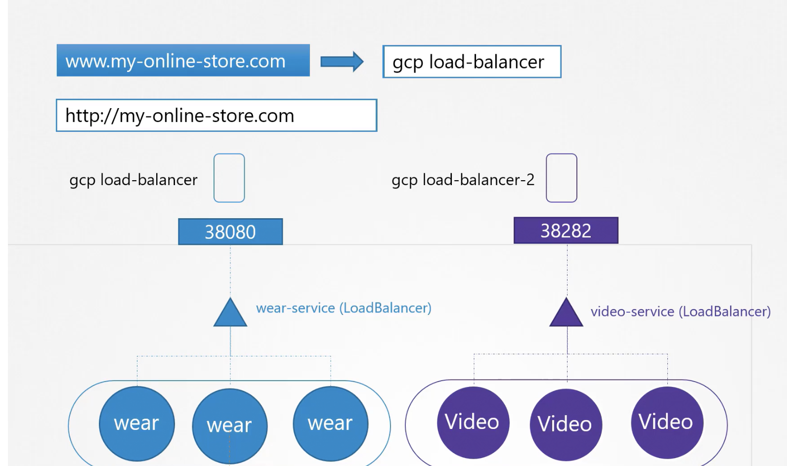

**So how do you direct traffic between each of these load balancers?**

Based on the URL that the users type in you need yet another proxy or load balancer that can redirect traffic based on URLs to the different services. Every time you introduce a new service You have to reconfigure the load balancer and finally you also need to enable SSL for your applications so your users can access your application using https. 

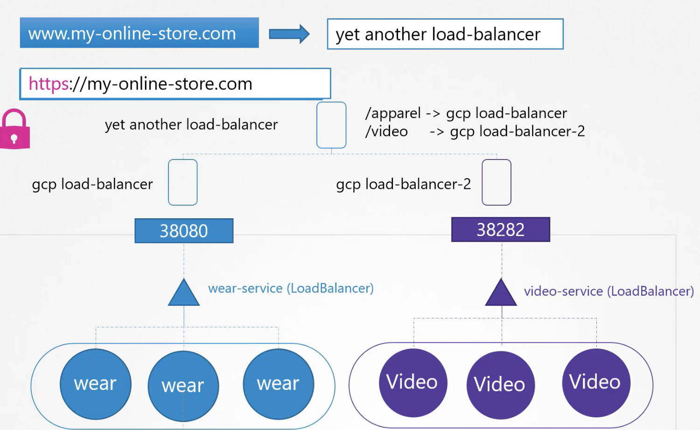

**Where do you configure that?**

It can be done at different levels either at the **application level** itself or at the l**oad balancer** or **proxy server** level but which one you don't want your developers to implement in their application as they would do it in different ways.

You want it to be configured in one place with minimal maintenance. Now that's a lot of different configuration and all of this becomes difficult to manage when your application scales.

It requires involving different individuals in different teams. You need to configure your firewall rules for each new service and it's expensive as well as for each service in you cloud native load balancer needs to be provisioned. 

Wouldn't it be nice if you could manage all of that within the Kubernetes cluster, and have all that configuration as just another kubernetes as definition file that lives along with the rest of your application deployment files that's where **ingress** comes in. Ingress helps your users access your application using a single Externally accessible URL, that you can configure to route to different services within your cluster based on the URL path, At the same time implement SSL security as well.

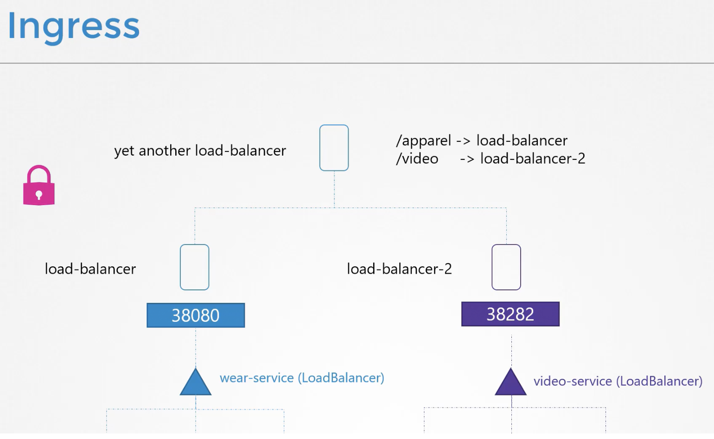

Simply put. Think of ingress as a **layer 7 load balancer built-in to the kubernetes** cluster that can be configured using native kubernetes primitives just like any other object in kubernetes.

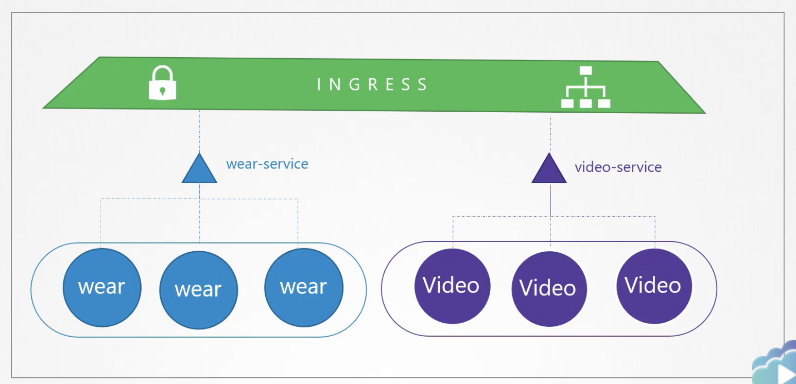

Now remember, even with Ingress you still need to expose it. To make it accessible outside the cluster so you still have to either publish it as a NodePort or with a cloud native load balancer.

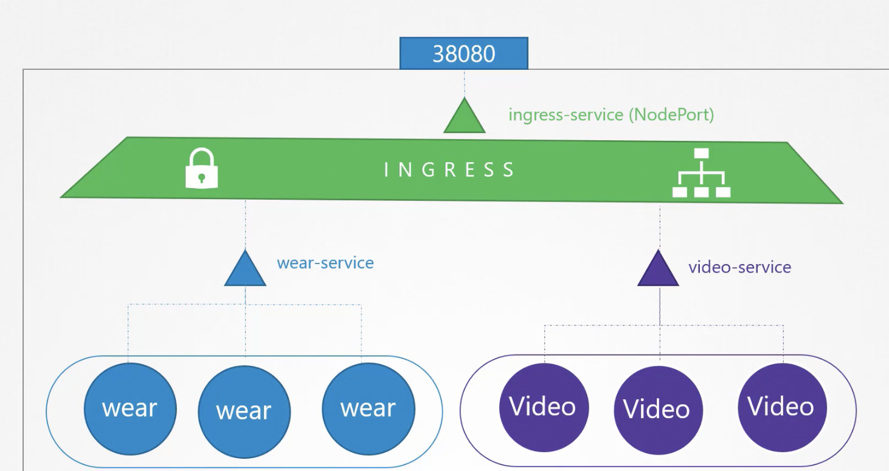

or

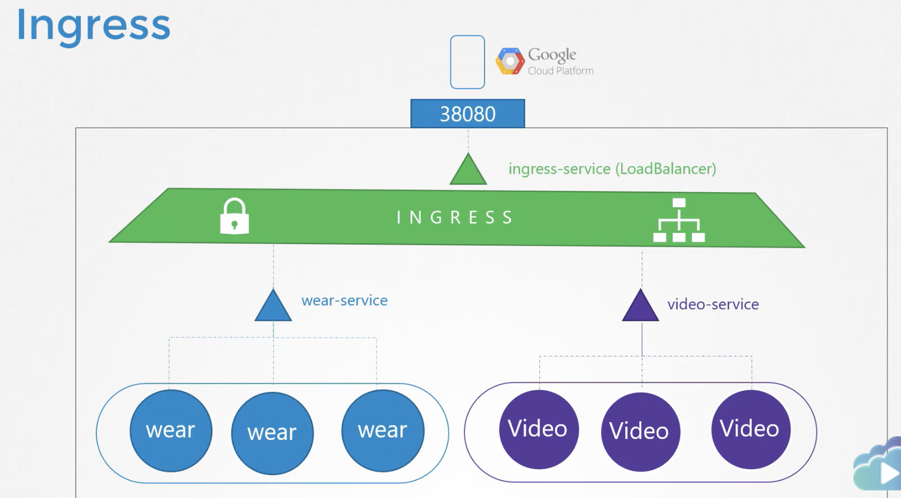

But that is just a one time configuration. 

Going forward you are going to perform all your load balancing, Auth, SSL and URL based routing configurations on the Ingress controller.

**So how does it work?**

**What is it?**

**Where is it?**

**How can you see it?**

**How can you configure it?**

**How does it load balance?**

**How does it implement SSL?** 

**Without ingress, how would YOU do all of these?** I would use a reverse-proxy or a load balancing solution like NGINX or HAProxy or Traefik. I would deploy them on my kubernetes cluster and configure them to route traffic to other services. 

The configuration involves defining URL Routes, configuring SSL certificates etc. Ingress is implemented by Kubernetes in kind of the same way. You first deploy a supported solution, which happens to be any of these listed here and then specify a set of rules to configure ingress. 

The solution you deploy is called as an **ingress controller** and the set of rules you configure are called as **ingress resources,** ingress resources are created using **definition files** like the ones we use to create pods deployments and services earlier in this course.

- *→ Now remember a kubernetes cluster does NOT come with an Ingress Controller by default.**

If you setup a cluster following the demos in this course, you won’t have an ingress controller built into it.

So if you simply create ingress resources and expect them to work they won't.

Let us look at each of these in a bit more detail.

As I mentioned you do not have an Ingress Controller on Kubernetes by default. So you MUST deploy one. 

**What do you deploy?**

There are a number of solutions available for ingress. a few of them being 

- GCE - which is Googles Layer 7HTTP Load Balancer.

- NGINX,

- Contour,

- HAPROXY,

- TRAFIK and Istio.

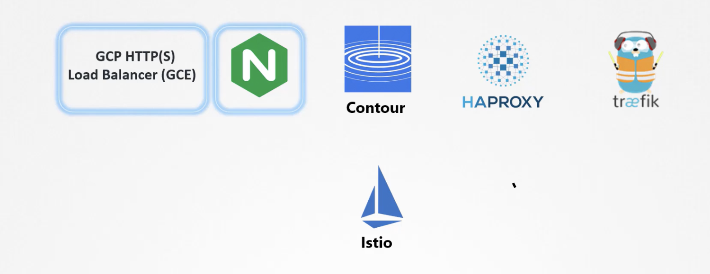

Out of this, GCE and NGINX are currently being supported and maintained by the Kubernetes project.

And in this lecture we will use NGINX as an example. These Ingress Controllers are not just another load balancer or nginx server. The load balancer components are just a part of it. The Ingress controllers have additional intelligence built into them to monitor the kubernetes cluster for new definitions or ingress resources and configure the nginx server accordingly.

 An NGINX Controller is deployed as just another deployment in Kubernetes.

So we start with a deployment file definition, named nginx-ingress-controller. With 1 replica and a simple pod definition template. We will label it nginx-ingress and the image used is **nginx-ingress-controller** with the right version.

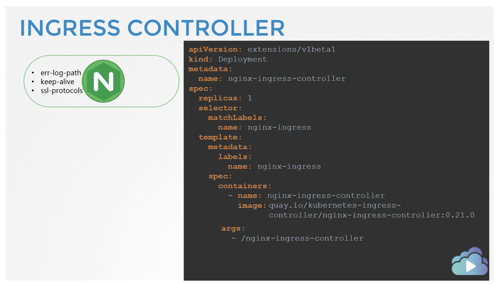

Now this is a special build of NGINX built specifically to be used as an ingress controller in kubernetes.

So it has its own set of requirements. Within the image the nginx program is stored at location `/nginx-ingress-controller.`

So you must pass that as the command to start the **nginx-controller-service.**

If you have worked with NGINX before, you know that it has a set of configuration options such as the 

- path to store the logs,

- keep-alive threshold,

- ssl settings,

- session timeout etc.

 In order to decouple these configuration data  from the **nginx-controller** image, you must create a ConfigMap object and pass that in. 

```yaml
kind: ConfigMap
apiVersion: v1
metadata:
  name: nginx-configuration
```

Now remember the ConfigMap object need not have any entries at this point. A blank object will do.

But creating one makes it easy for you to modify a configuration setting in the future.

You will just have to add it in to this ConfigMap and not have to worry about modifying the nginx configuration files.

You must also pass in two environment variables that carry the POD’s name and namespace it is deployed to. The nginx service requires these to read the configuration data from within the POD. And finally specify the ports used by the ingress controller which happens to be 80 and 443.

```yaml
apiVersion: apps/v1
kind: Deployment
metadata:
  name: ingress-controller
spec:
  replicas: 1
  selector:
    matchLabels:
      name: nginx-ingress
  template:
    metadata:
      labels:
        name: nginx-ingress
    spec:
      serviceAccountName: ingress-serviceaccount
      containers:
        - name: nginx-ingress-controller
          image: quay.io/kubernetes-ingress-controller/nginx-ingress-controller:0.21.0
          args:
            - /nginx-ingress-controller
            - --configmap=$(POD_NAMESPACE)/nginx-configuration
          env:
            - name: POD_NAME
              valueFrom:
                fieldRef:
                  fieldPath: metadata.name
            - name: POD_NAMESPACE
              valueFrom:
                fieldRef:
                  fieldPath: metadata.namespace
          ports:
            - name: http
              containerPort: 80
            - name: https
              containerPort: 443
```

We then need a service to expose the ingress controller to the external world. So we create a service of type **NodePort** with the **nginx-ingress** label selector to link the service to the deployment. 

```yaml
# service-Nodeport.yaml

apiVersion: v1
kind: Service
metadata:
  name: ingress
spec:
  type: NodePort
  ports:
  - port: 80
    targetPort: 80
    protocol: TCP
    name: http
  - port: 443
    targetPort: 443
    protocol: TCP
    name: https
  selector:
    name: nginx-ingress
```

As mentioned before, the Ingress controllers have additional intelligence built into them to monitor the kubernetes cluster for ingress resources and configure the underlying nginx server when something is changed but for the ingress controller to do this it requires a service account with a right set of permissions. For that we create a service account with the correct roles and roles bindings.

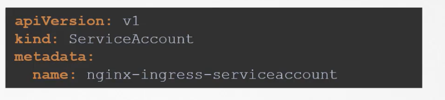

```bash
$ kubectl create -f ingress-sa.yaml
serviceaccount/ingress-serviceaccount created
```

So to summarize, with a deployment of the **nginx-ingress image**, a **service** to expose it, a **ConfigMap** to feed nginx configuration data, and a **service account** with the right permissions to access all of these objects.We should be ready with an Ingress controller in its simplest form,

Now on onto the next part of creating **ingress resources,** an ingress resource is a set of rules and configurations applied on the ingress controller. You can configure rules to say simply forward all incoming traffic to a single application or route traffic to different applications. Based on the URL. So if user goes to **my-online-store.com/wear**, then route to one app, or if the user visits the /watch URL then route to the video app etc... Or you could route user based on the domain name itself.

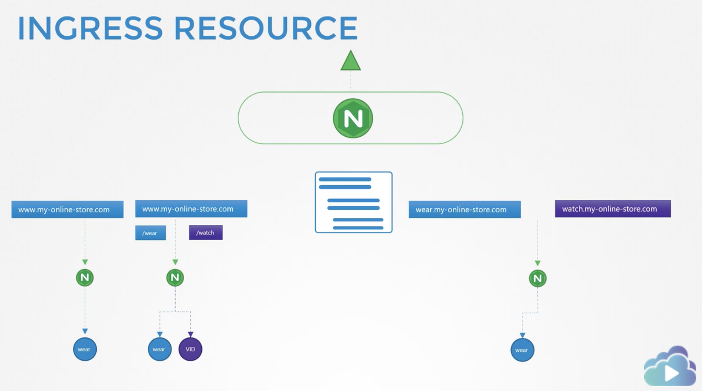

For example, if the user visits wear.my-online-store.com, the route to the wear app or else route to the video app. Let us look at how to configure these in a bit more detail. 

The Ingress resource is created with a Kubernetes Definition file. In this case, **ingress-wear.yaml**. As with any other object, we have **apiVersion**, **kind**, **metadata** and **spec**. The apiVersion is `extensions/v1beta1`, kind is `Ingress`, we will name it `ingress-wear`. And under spec we have `backend`. So the traffic is, of course, routed to the application services and not PODs directly.

Ingress-wear.yaml

```yaml
apiVersion: extensions/v1beta1
kind: Ingress
metadata:
  name: ingress-wear
spec:
     backend:
        serviceName: wear-service
        servicePort: 80
To create the ingress resource
$ kubectl create -f Ingress-wear.yaml
ingress.extensions/ingress-wear created
```

As you might know already the ***backend section defines where the traffic will be routed to***.

So if it's a single backend then you don't really have any rules.

You can simply specify the service name and port of the backend **wear-service**. Create the ingress resource by running the `kubectl create` command. View the created ingress by running the `kubectl get ingress` command. 

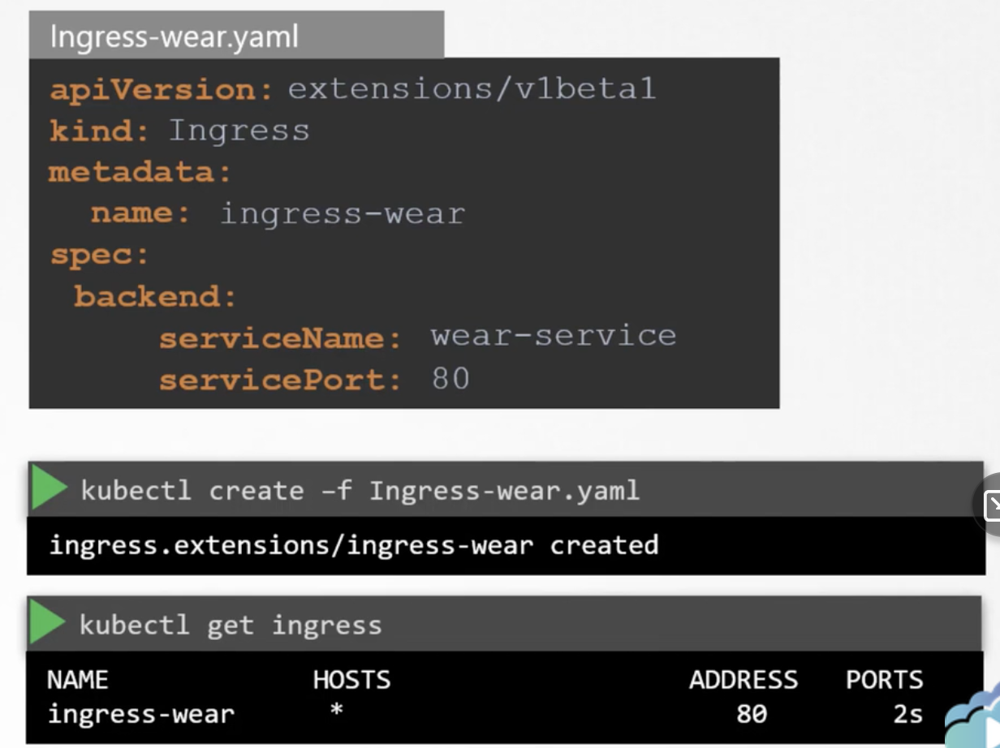

The new ingress is now created and routes all incoming traffic directly to the **wear-service**. You use **rules**, when you want to route traffic based on different conditions.For example you create one rule for traffic originating from each domain or hostname.


That means when users reach your cluster using the domain name, **my-online-store.com**, you can handle that traffic using rule1. When users reach your cluster using domain name **wear.my-online-store.com**, you can handle that traffic using a separate Rule2. Use Rule3 to handle traffic from **watch.my-online-store.com.** And say use a 4th rule to handle everything else.

Now within each rule you can handle different paths. For example, within Rule 1 you can handle the wear path to route that traffic to the **clothes application**. And a watch path to route traffic to the **video streaming** application. And a third path that routes anything other than the first two to a **404 not found page**.

Similarly, the second rule handles all traffic from **wear.my-online-store.com**.You can have path definition within this rule, to route traffic based on different paths. For example, say you have different applications and services within the **apparel** section for **shopping, or returns, or support,** when a user goes to ***wear.my-online.store.com/***, by default they reach the **shopping** page. But if they go to **exchange** or **support** URL, 

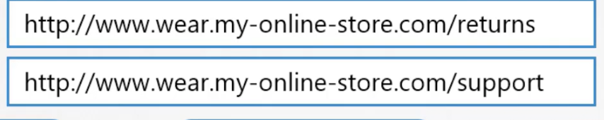

they reach different backend services. 

The same goes for Rule 3, where you route traffic to ***watch.my-online-store.com*** to the video streaming application. But you can have additional paths in it such as **movies or tv.**  

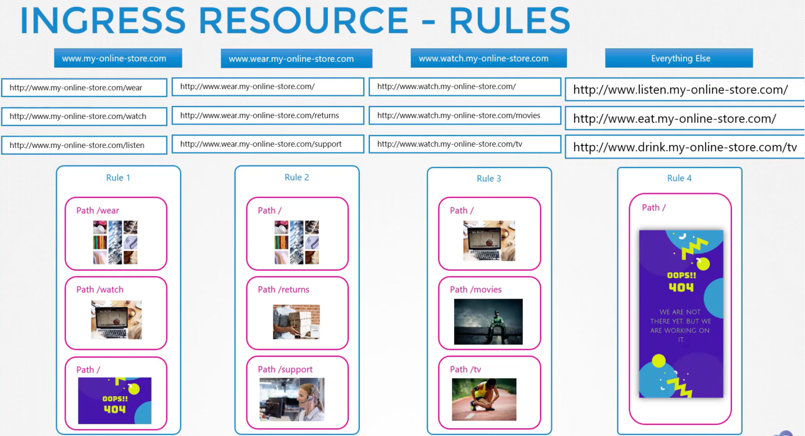

And finally anything other than the ones listed here will go to the fourth rule. that would simply show a **404 Not Found Error page**.

So remember you have rules at the top for each host or domain name and within each rule you have different paths to route traffic based on the URL.

**Now, let’s look at how we configure ingress resources in Kubernetes.**

We will start where we left off. We start with a similar definition file. This time under **spec**,We start with a set of rules. `Ingress-wear.yaml`

```yaml
apiVersion: extensions/v1beta1
kind: Ingress
metadata:
  name: ingress-wear
spec:
     backend:
        serviceName: wear-service
        servicePort: 80
```

`Ingress Resource - Rules``1 Rule and 2 Paths.`

```yaml
apiVersion: extensions/v1beta1
kind: Ingress
metadata:
  name: ingress-wear-watch
spec:
  rules:
  - http:
      paths:
      - path: /wear
        backend:
          serviceName: wear-service
          servicePort: 80
      - path: /watch
        backend:
          serviceName: watch-service
          servicePort: 80
```

Now our requirement here is to handle all traffic coming to *my-online-store.com* and route them based on the URL path.

So we just need a single rules for this. since we are only handling traffic to a single domain name, which is *my-online-store.com*. Under rules we have one item, which is an http rule in which we specify different paths. So paths is an array of multiple items.

One path for each url. Then we move the backend we used in the first example under the first path. The backend specification remains the same, It has a **service name** and **service port**.

Similarly we create a similar backend entry to the second URL path, for the **watch-service** to route all traffic coming in through the /watch url to the **watch-service**. Create the ingress resource using the `kubectl create` command.

Once created, view additional details about the ingress resource by running the `kubectl describe ingress` command.

You now see two backend URLs under the rules, and the backend service they are pointing to.Just as we created it.

```bash
$ kubectl describe ingress ingress-wear-watch
Name:             ingress-wear-watch
Namespace:        default
Address:
Default backend:  default-http-backend:80 (<none>)
Rules:
  Host        Path  Backends
  ----        ----  --------
  *
              /wear    wear-service:80 (<none>)
              /watch   watch-service:80 (<none>)
Annotations:  <none>
Events:
  Type    Reason  Age   From                      Message
  ----    ------  ----  ----                      -------
  Normal  CREATE  23s   nginx-ingress-controller  Ingress default/ingress-wear-watch
```

Now if you look closely in the output of this command you see that there is something about a **default backend**. 

**What might that be?** If a user tries to access a URL that does not match any of these rules, Then the user is directed to the service specified as the default backend.

In this case it happens to be a service named **default-http-backend**. So you must remember to deploy such a service. 

Back in your application, say a user visits the URL **my-online-store.com/listen or /eat** and you don’t have an audio streaming or a food delivery service.You might want to show them a nice message.

You can do this by configuring a default backend service to display this 404 Not found error page.


**The third type of configuration is using domain names or host names.**

We start by creating a similar definition file for ingress. Now that we have two domain names we create two rules, one for each domain.

To Split traffic by domain name we use the host field; the host field in each rule matches the specified value with the domain name used in the request URL and routes traffic to the appropriate backend.

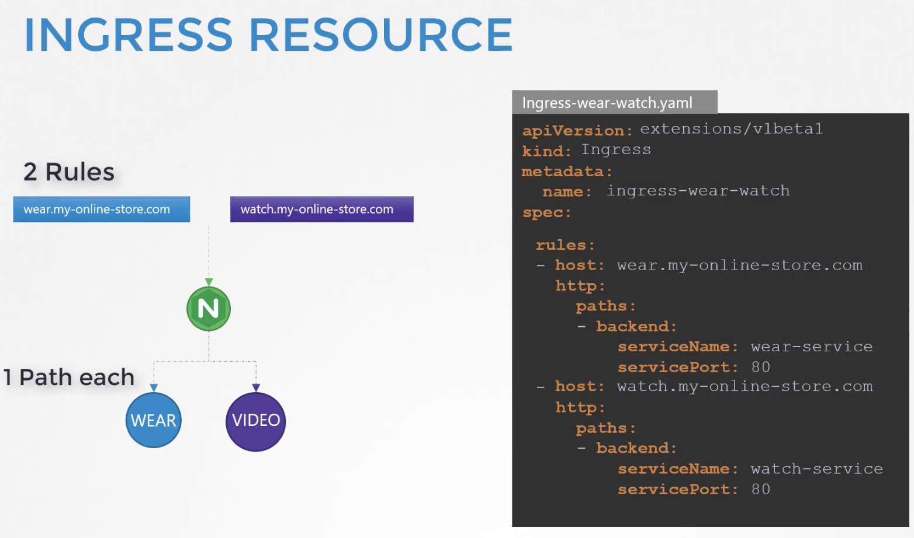

```yaml
# Ingress-wear-watch.yaml
apiVersion: extensions/v1beta1
kind: Ingress
metadata:
  name: ingress-wear-watch
spec:
  rules:
  - host: wear.my-online-store.com
    http:
      paths:
      - backend:
          serviceName: wear-service
          servicePort: 80
  - host: watch.my-online-store.com
    http:
      paths:
      - backend:
          serviceName: watch-service
          servicePort: 80
```

Now remember in the previous case we did not specify the host field. 

If you don't specify the host field it will simply consider it as a star or accept all the incoming traffic through that particular rule without matching the hostname 

In this case Note that we only have a single backend path for each rule which is fine. 

All traffic from these domain names will be routed to the appropriate backend irrespective of the URL path.

You can still have multiple path specifications in each of these to handle different URL paths as we saw in the example earlier. 

So let's compare the two.

Splitting traffic by URL had just one rule and we split the traffic with two paths. Display traffic by hostname.

We used two rules and one path specification in each rule. 

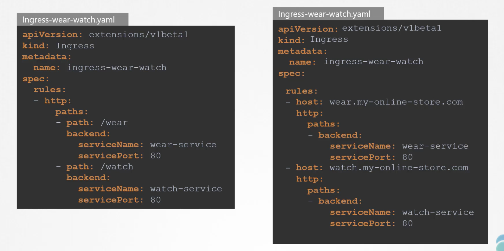

**what changes have been made in previous and current versions in** **Ingress****.**

Like in **apiVersion**, **serviceName** and **servicePort** etc.

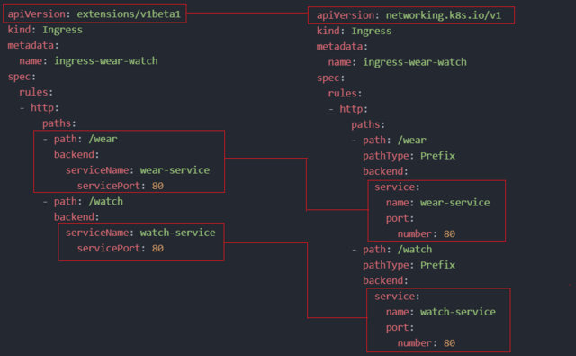

Now, in k8s version **1.20+** we can create an Ingress resource from the imperative way like this:-

Format **- kubectl create ingress <ingress-name> --rule="host/path=service:port"**

**Eg - kubectl create ingress ingress-test --rule="wear.my-online-store.com/wear*=wear-service:80"**

Find more information and examples in the below reference link:-

[https://kubernetes.io/docs/reference/generated/kubectl/kubectl-commands#-em-ingress-em-](https://kubernetes.io/docs/reference/generated/kubectl/kubectl-commands#-em-ingress-em-) 

**References:-**

[https://kubernetes.io/docs/concepts/services-networking/ingress](https://kubernetes.io/docs/concepts/services-networking/ingress)

[https://kubernetes.io/docs/concepts/services-networking/ingress/#path-types](https://kubernetes.io/docs/concepts/services-networking/ingress/#path-types)

### Ingress – Annotations and rewrite-target

Different ingress controllers have different options that can be used to customise the way it works. NGINX Ingress controller has many options that can be seen [here](https://kubernetes.github.io/ingress-nginx/examples/). I would like to explain one such option that we will use in our labs. The [Rewrite](https://kubernetes.github.io/ingress-nginx/examples/rewrite/) target option.

Our `watch` app displays the video streaming webpage at `http://<watch-service>:<port>/`

Our `wear` app displays the apparel webpage at `http://<wear-service>:<port>/`

We must configure Ingress to achieve the below. When a user visits the URL on the left, his/her request should be forwarded internally to the URL on the right. Note that the /watch and /wear URL path are what we configure on the ingress controller so we can forward users to the appropriate application in the backend. The applications don’t have this URL/Path configured on them:

```text
http://<ingress-service>:<ingress-port>/watch –> http://<watch-service>:<port>/
http://<ingress-service>:<ingress-port>/wear –> http://<wear-service>:<port>/

Without the rewrite-target option, this is what would happen:
http://<ingress-service>:<ingress-port>/watch –> http://<watch-service>:<port>/watch
http://<ingress-service>:<ingress-port>/wear –> http://<wear-service>:<port>/wear
```

Notice `watch` and `wear` at the end of the target URLs. The target applications are not configured with `/watch` or `/wear` paths. They are different applications built specifically for their purpose, so they don’t expect `/watch` or `/wear` in the URLs. And as such the requests would fail and throw a 404 not found error.

To fix that we want to “ReWrite” the URL when the request is passed on to the watch or wear applications. We don’t want to pass in the same path that user typed in. So we specify the `rewrite-target` option. This rewrites the URL by replacing whatever is under `rules->http->paths->path` which happens to be `/pay` in this case with the value in `rewrite-target`. This works just like a search and replace function.

```yaml
For example: replace(path, rewrite-target)
In our case: replace("/path","/")

apiVersion: extensions/v1beta1
kind: Ingress
metadata:
  name: test-ingress
  namespace: critical-space
  annotations:
    nginx.ingress.kubernetes.io/rewrite-target: /
spec:
  rules:
  - http:
      paths:
      - path: /pay
        backend:
          serviceName: pay-service
          servicePort: 8282
```

In another example given [here](https://kubernetes.github.io/ingress-nginx/examples/rewrite/), this could also be:

```yaml
replace("/something(/|$)(.*)", "/$2")

apiVersion: extensions/v1beta1
kind: Ingress
metadata:
  annotations:
    nginx.ingress.kubernetes.io/rewrite-target: /$2
  name: rewrite
  namespace: default
spec:
  rules:
  - host: rewrite.bar.com
    http:
      paths:
      - backend:
          serviceName: http-svc
          servicePort: 80
        path: /something(/|$)(.*)
```

### TEST

```bash
→ We have deployed Ingress Controller, resources and applications. Explore the setup.
Note: They are in different namespaces.
kubectl get all -A
```


```yaml
You are requested to make the new application available at /pay.Identify and implement the best approach to making this application available on the ingress controller and test to make sure its working. Look into annotations: rewrite-target as well.
apiVersion: networking.k8s.io/v1
kind: Ingress
metadata:
  name: test-ingress
  namespace: critical-space
  annotations:
    nginx.ingress.kubernetes.io/rewrite-target: /
    nginx.ingress.kubernetes.io/ssl-redirect: "false"
spec:
  rules:
  - http:
      paths:
      - path: /pay
        pathType: Prefix
        backend:
          service:
           name: pay-service
           port:
            number: 828
```

deploy an Ingress Controller. First, create a namespace called ingress-space. We will isolate all ingress related objects into its own namespace.

---

### Modern Ingress v1 Specification (networking.k8s.io/v1)

In modern Kubernetes (1.19+ and current CKA versions), Ingress has graduated to `networking.k8s.io/v1`. Notice the structural changes compared to the deprecated `extensions/v1beta1`:
- `serviceName` and `servicePort` are replaced with `service.name` and `service.port.number` (or `service.port.name`).
- Every path requires an explicit `pathType`: `Prefix`, `Exact`, or `ImplementationSpecific`.
- Ingress class is specified via `spec.ingressClassName` rather than the older `kubernetes.io/ingress.class` annotation.

#### Comprehensive Production Ingress Manifest with TLS & Multiple Hosts

```yaml
apiVersion: networking.k8s.io/v1
kind: Ingress
metadata:
  name: enterprise-ingress
  namespace: production
  annotations:
    nginx.ingress.kubernetes.io/rewrite-target: /
    nginx.ingress.kubernetes.io/ssl-redirect: "true"
spec:
  ingressClassName: nginx
  tls:
  - hosts:
    - app.example.com
    secretName: example-tls-cert
  rules:
  - host: app.example.com
    http:
      paths:
      - path: /api
        pathType: Prefix
        backend:
          service:
            name: backend-api-service
            port:
              number: 8080
      - path: /static
        pathType: Exact
        backend:
          service:
            name: static-assets-service
            port:
              number: 80
  - http: # Default host catch-all
      paths:
      - path: /
        pathType: Prefix
        backend:
          service:
            name: default-web-service
            port:
              number: 80
```

#### Creating TLS Secrets for Ingress Imperatively:
```bash
kubectl create secret tls example-tls-cert \
  --cert=tls.crt \
  --key=tls.key \
  --namespace=production
```

---

### Kubernetes Gateway API Overview

The Gateway API is the next-generation evolution of service networking in Kubernetes, designed to succeed Ingress.

#### Ingress vs Gateway API:
| Feature | Ingress | Gateway API |
| :--- | :--- | :--- |
| **Design Model** | Monolithic single resource | Role-oriented separation of concerns |
| **Portability** | Relies on vendor annotations | Standardized core specifications |
| **Routing Types** | HTTP/HTTPS only | HTTP, HTTPS, gRPC, TCP, UDP, TLS |
| **Traffic Splitting / Canary** | Non-standard vendor annotations | First-class native support (weight filters) |

#### Core Gateway API Resources:
1. **`GatewayClass`** (Infrastructure Provider): Defines a template of controller implementation (e.g., Envoy, Istio, Cilium).
2. **`Gateway`** (Cluster Operator): Translates traffic onto network ports, points to GatewayClass, attaches TLS listeners.
3. **`HTTPRoute` / `GRPCRoute` / `TLSRoute`** (Application Developer): Defines routing rules, header matching, path rewrites, and backend service dispatching.

```yaml
apiVersion: gateway.networking.k8s.io/v1
kind: HTTPRoute
metadata:
  name: store-route
  namespace: store
spec:
  parentRefs:
  - name: internal-gateway
  rules:
  - matches:
    - path:
        type: PathPrefix
        value: /store
    backendRefs:
    - name: store-v1-service
      port: 8080
      weight: 90
    - name: store-v2-canary
      port: 8080
      weight: 10
```

---

### Rapid Pod & Service Debugging with `kubectl port-forward`

When debugging microservices without exposing them via NodePort or Ingress, forward ports from local workstation to cluster targets:

```bash
# Forward local port 8080 to Pod port 80:
kubectl port-forward pod/nginx-pod 8080:80

# Forward to a Service (forwards to one of its healthy backing pods):
kubectl port-forward svc/pay-service 8443:8282 -n critical-space

# Forward local port 9090 to a Deployment target:
kubectl port-forward deployment/prometheus-server 9090:9090 -n monitoring

# Listen on all network interfaces on localhost (not just 127.0.0.1):
kubectl port-forward --address 0.0.0.0 pod/nginx-pod 8080:80
```

---

### EndpointSlices & Headless Services

#### 1. Headless Services (`clusterIP: None`)
When an application requires direct peer-to-peer discovery without intermediate virtual IP load balancing (essential for StatefulSets, distributed databases, ZooKeeper, and Kafka), configure a Headless Service with `spec.clusterIP: None`.

- **DNS Direct Resolution:** CoreDNS returns the individual `A`/`AAAA` records of all backing Pods directly.
- **Predictable SRV Records:** StatefulSet members obtain deterministic FQDNs:
  `$(pod-name).$(service-name).$(namespace).svc.cluster.local`

```yaml
apiVersion: v1
kind: Service
metadata:
  name: db-headless
  namespace: database
spec:
  clusterIP: None # Defines a Headless Service
  selector:
    app: postgres
  ports:
  - port: 5432
    name: db-port
```

#### 2. Scalable Service Discovery with `EndpointSlice` (`discovery.k8s.io/v1`)
In large clusters, a single monolithic `Endpoints` object containing thousands of Pod IPs created severe etcd and network serialization bottlenecks. Kubernetes introduced `EndpointSlice` to partition endpoints into smaller, scalable chunks (default 100 endpoints per slice).

- **Structured Conditions:** Tracks `ready`, `serving`, and `terminating` for seamless zero-downtime rolling updates.
- **Topology Hints:** Enables Topology Aware Routing so kube-proxy forwards traffic to Pods within the same availability zone.

```yaml
apiVersion: discovery.k8s.io/v1
kind: EndpointSlice
metadata:
  name: db-headless-7x89q
  namespace: database
  labels:
    kubernetes.io/service-name: db-headless
addressType: IPv4
ports:
  - name: db-port
    port: 5432
    protocol: TCP
endpoints:
  - addresses:
      - "10.244.2.15"
    conditions:
      ready: true
      serving: true
      terminating: false
    zone: us-east-1a
```
