# 08. Storage

## STORAGE

### Introduction to Docker Storage

Storage in kubernetes, to understand storage in container orchestration tools like kubernetes, it is important to first understand how storage works with containers. 

Understanding how storage works with Docker first and getting all the basics right will later make it so much easier to understand how it works in kubernetes. When it comes to storage in Docker, there are two concepts you must know about **storage drivers** and **volume driver plug-ins**.  In the upcoming video, we will discuss storage drivers. 

It's something that we've discussed in the docker course. So if you have gone through that already, feel free to skip this video or you may choose to stay and refresh your memory once done. We will talk about volume drivers.

### Storage in Docker

We are going to talk about Docker's storage drivers and filesystems. We're going to see where and how Docker stores data and how it manages filesystems of the containers.

Let us start with how docker stores data on the local filesystem.

When you install docker  on a system, it creates this folder structure /var/lib/docker, you have multiple folders under it called **aufs, containers,image, volumes, etc**. 

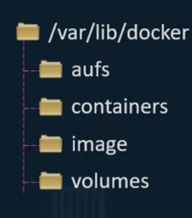

This is where doctor stores all its data by default. When I say data, I mean files related to images and containers running on the docker host.

For example, all files related to containers are stored under the containers folder and the files related to images are stored under the image folder.

Any volumes created by the docker containers are created under the volumes folder.

Well, don't worry about that for now. We will come back to that in a bit. 

For now, let's just understand where docker stores its files and in what format.

So how exactly does Docker store the files of an image and a container to understand that we need to understand Docker's layered architecture?

Let's quickly recap something we learned when Docker builds images. It builds these in a layered architecture.

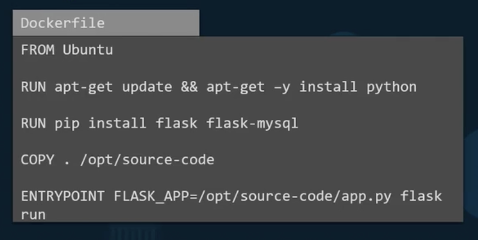

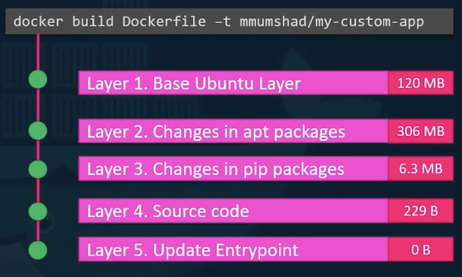

Each line of instruction in the Docker file creates a new layer in the Docker image with just the changes from the previous layer. For example, the first layer is a base Ubuntu operating system, followed by the second instruction that creates a second layer which installs all the apt packages. And then the third instruction creates a third layer, with the Python packages followed by the fourth layer that copies the source code over. And then finally, the fifth layer that updates the entry point of the image.

Since each layer only stores the changes from the previous layer, it is reflected in the size as well. If you look at the base ubuntu image, it is around 120 megabytes in size. The apt packages that are installed is around 300MB, and then the remaining layers are small.

To understand the advantages of this layered architecture, let's consider a second application.

This application has a different Docker file, but it's very similar to our first application as it uses the same basic image as Ubuntu, and uses the same python and flasks dependencies, but uses a different source code to create a different application.

And so a different entry point as well.When I run the Docker build command to build a new image for this application, since the first three layers of both the applications are the same, Docker is not going to build the first three layers. Instead, it reuses the same three layers it built for the first application from the cache and only creates the last two layers with the new sources and the new entry point.

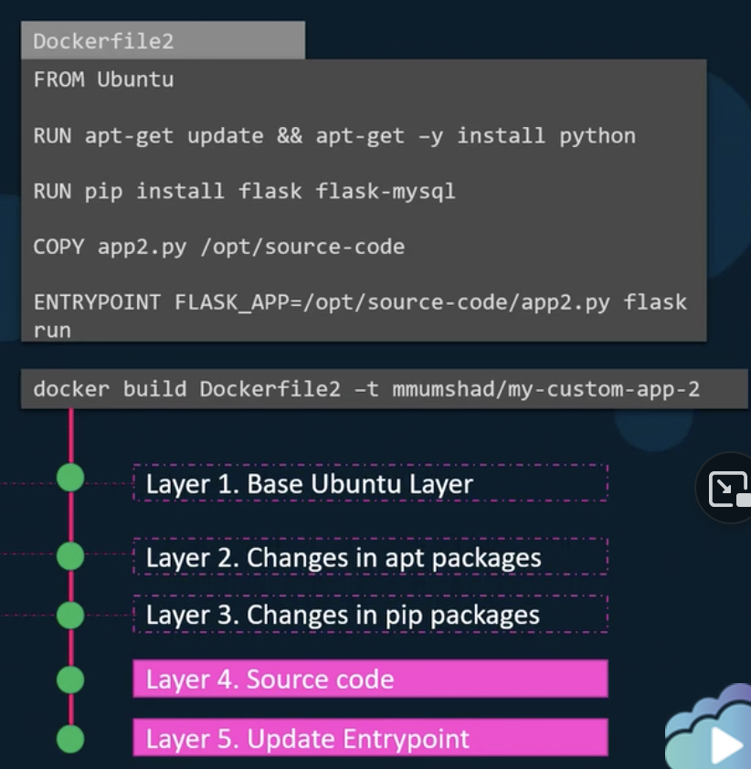

This way, Docker builds images faster and efficiently, saves disk space.

This is also applicable if you were to update your application code, whenever you update your application code, such as the app2.py in this case, Docker simply reuses all the previous layers from cache and quickly rebuilds the application image by updating the latest source code, thus saving us a lot of time during rebuilds and updates. 

Let's rearrange the layers bottom up so we can understand it better. At the bottom , we have the base ubuntu layer, then the packages, then the dependencies, and then the source code of the application and then the entry point.

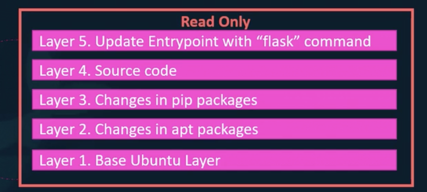

All of these layers are created when we run the locker, build command to form the final docker image.

So all of these are the docker image layers.Once the build is complete, you cannot modify the contents of these layers. And so they are read only and you can only modify them by initiating a new build. 

When you run a container based off of this image using the doctor run command, Docker creates a container based off of these layers and creates a new writable layer on top of the image layer. The writable layer is used to store data created by the container, such as log files, used by the applications, any temporary files generated by the container or just any file modified by the user on that container. The life of this layer, though, is only as long as the container is alive, when the container is destroyed, this layer and all of the changes stored in it are also destroyed. 

Remember that the same image layer is shared by all containers created using this image.

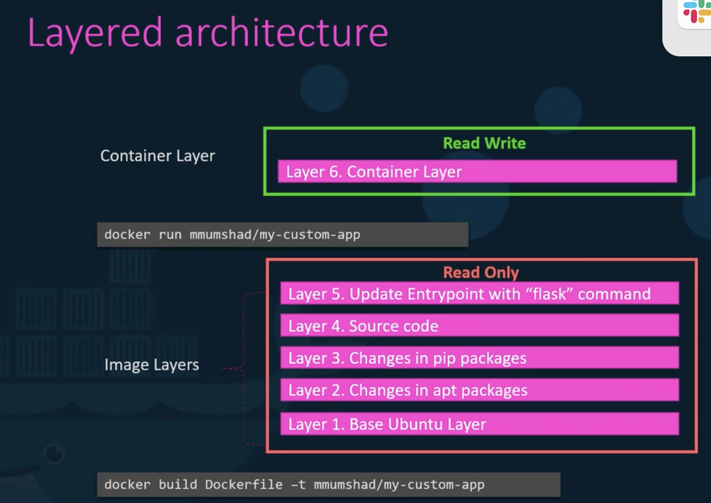

If I were to log into the newly created container and say, create a new file called temp.txt, it would create that file in the container layer, which is read and write. 

We just said that the files in the image layer are read-only, meaning you cannot edit anything in those layers.

Let's take an example of our application code. Since we bake our code into the image. The code is part of the image layer and as such is read only after running a container.

What if I wish to modify the source code to say test to change? 

Remember, the same image layer may be shared between multiple containers created from this image.

So does it mean that I cannot modify this file inside the container?

No, I can still modify this file, but before I save the modified file, Docker automatically creates a copy of the file in the read right layer and I will then be modifying a different version of the file in the read write layer.

All future modifications will be done on this copy of the file in the rewrite layer.

This is called the copy on write mechanism. 

The image layer being read only just means that the files in these layers will not be modified in the image itself. So the image will remain the same all the time until you rebuild the image using the docker build command.

What happens when we get rid of the container, all of the data that was stored in the container layer also gets deleted.The change we made to the app.py and the new temp file we created will also get removed.

So what if we wish to persist this data, for example, if we were working with a database and we would like to preserve the data created by the container, we could add a persistent volume to the container. To do this first, create a volume using the Docker volume, create command.

So when I run the `docker volume create data_volume` command. It creates a folder called data_underscore volume under the `/var/lib/docker/volumes` directory.

Then when I run the docker container using the Docker Run command, I could mount this volume inside the docker container's rewrite layer using the -v option like this.

```bash
docker run -v data_volume:/var/lib/mysql mysql 
```

So I would do a `docker run -v` then specify my newly created volume name, followed by a colon and the location inside my container, which is the default location where mysql stores data. And that is `/var/lib/mysql` and then the image name mysql.

This will create a new container and mount the data volume we created into /var/lib/mysql  folder inside the container, so all data written by the database is in fact stored on the volume created on the docker host.

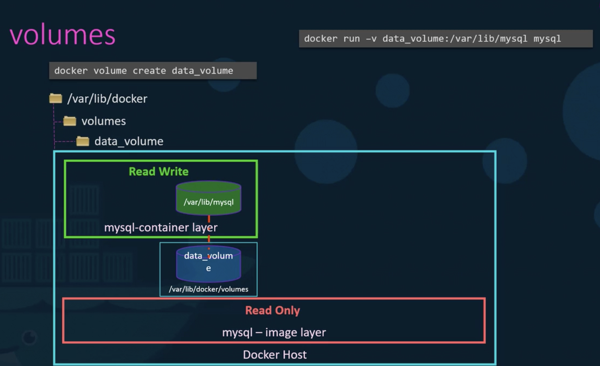

Even if the container is destroyed, the data is still active.

Now, what if you didn't run the docker volume create command to create the volume before the `docker run` command.

For example, if I run the `docker run` command to create a new instance of mysql container with the volume data_volume2, which I have not created yet, Docker will automatically createa volume named data_volume2 and mount to the container.

```bash
docker run -v data_volume2:/var/lib/mysql mysql 
```

You should be able to see all these volumes if you list the contents of the /var/lib/docker/volumes folder.

This is called **volume mounting** as we are mounting a volume created by Docker under the /var/lib/docker/volumes folder. 

But what if we had our data already at another location, for example, let's say we have some external storage on the docker host at our /data and we would like to store database data on that volume and not in the default /var/lib/docker/volumes folder. 

In that case, we would run a container using the command docker run -v, but in this case we will provide the complete path to the folder we would like to mount. 

```bash
docker run -v /data/mysql:/var/lib/mysql mysql 
```

 so it will create a container and mount the folder to the container.

This is called **bind mounding**, so there are two types of mounts, a **volume mounting** and a **bind Mount**

**Volume Mount mounts a volume from the volumes directory and bind Mount mounts and directory from any location on the Docker host.**

One final point to note before I let you go, using the -v is an old style. The new way is to use -mount option.

- -mount is the preferred way as it is more verbose. So you have to specify each parameter in a key=value format.

For example, the previous command can be written with the -mount option as this using the type,source and target options.

```bash
docker run \ --mount type=bind, source=/data/mysql, target=/var/lib/mysql mysql 
```

The type in this case is bind. The source is the location on my host and the target is the location on my container. 

So who is responsible for doing all of these operations, maintaining the layered architecture, creating a writable layer, moving files across layers to enable copy and write, et cetera?  

**It's the storage drivers.**

So Docker uses storage drivers to enable layered architecture. Some of the common storage drivers are AUFS,ZFS,BTRFS,device Mapper,Overlay and Overlay2

The selection of the storage driver depends on the underlying OS being used, for example, with Ubuntu, the default storage driver is  AUFS, whereas this storage driver is not available on other operating systems like Fedora or CentOS In that case, **device Mapper** may be a better option.

Docker will choose the best storage driver available automatically based on the operating system, 

The different storage drivers also provide different performance and stability characteristics. So you may want to choose one that fits the needs of your application and your organization. If you would like to read more on any of these storage drivers, please refer to the links in the attached documentation.

### Volume Driver Plugins in Docker

OK, so in the previous lesson we discussed about storage drivers, storage drivers help manage storage on images and containers.

We also briefly touched upon volumes in the previous lecture. We learned that if you want to persist storage, you must create volumes. Remember that volumes are not handled by storage drivers. Volumes are handled by volume driver plug ins.

The default volume driver plug in is local. The local volume plug in helps create a volume on the Docker host and store its data under /var/lib/docker/volumes directory.

There are many other volume driver plugins that allow you to create a volume on third party solutions like Azur File Storage, Convoy, DigitalOcean Block storage, flocker, gce-docker | GlusterFS, NetApp | RexRay | Portworx| VMware vSphere storage 

And remember this for storage. These are just a few of the many.

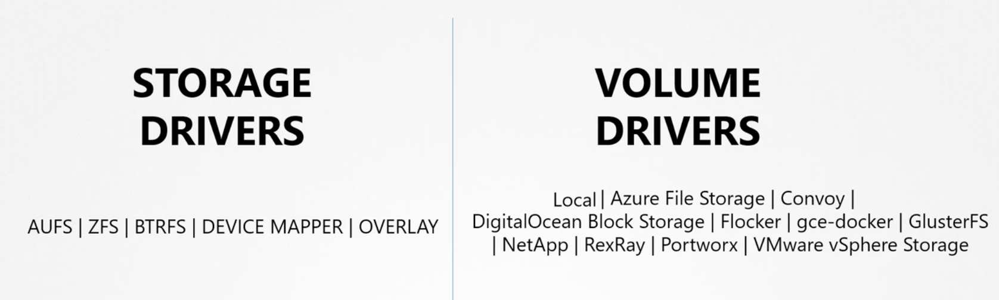

Some of these volume drivers support different storage providers, for instance, RexRay storage driver can be used to provision storage on AWS EBS,S3 EMC storage arrays like Isilon and ScaleIO or Google Persistent Desk or openstack cinder.

When you run a docker container, you can choose to use a specific volume driver such as the RexRay EBS to provision a volume from Amazon EBS

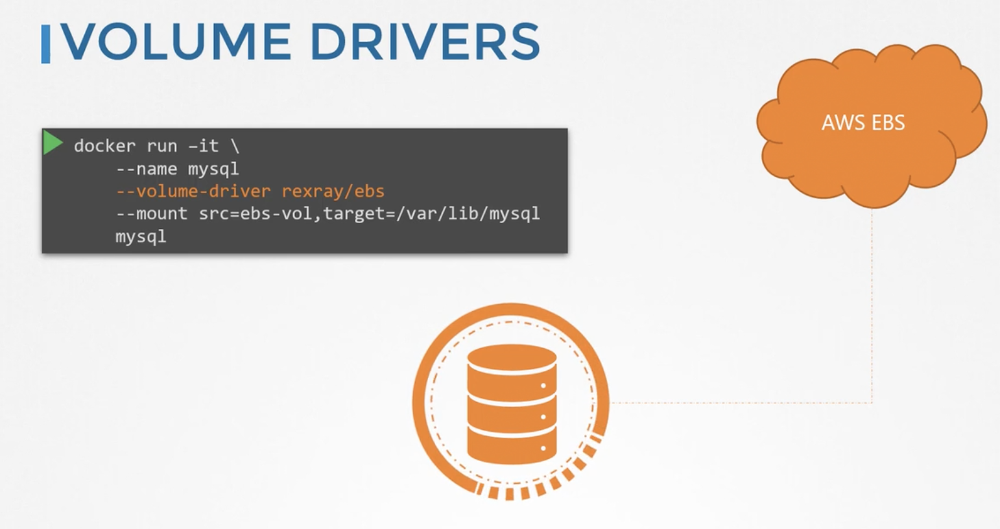

This will create a container and attach a volume from the aws cloud when the container exits, your data is safe in the cloud.

### Container Storage Interface

Let us now look at the container storage interface. In the past, kubernetes has used docker alone as the container runtime engine and all the code to work with Docker was embedded within the kubernetes source code with other container run times coming in, such as rocket and cri-o. It was important to open up and extend support to work with different container run times and not be dependent on the kubernetes source code.

And that's how the **container runtime interface** came to be. 

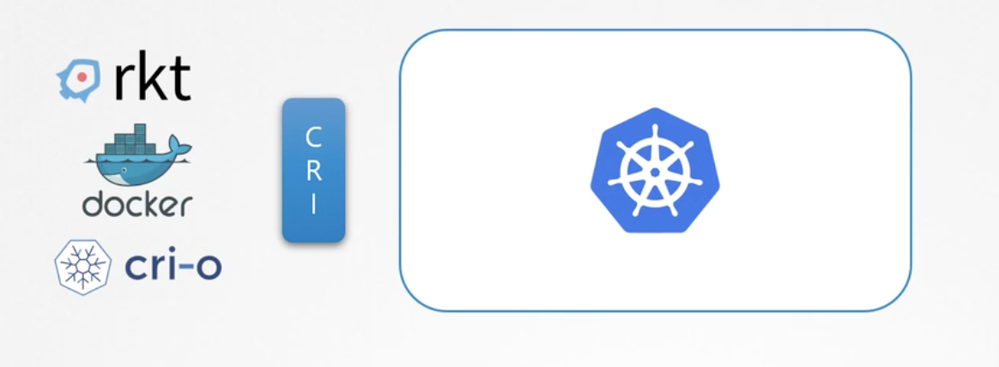

The container runtime interface is a standard that defines how an orchestration solution like kubernetes would communicate with container run times like Docker.  So in the future, if any new container runtime interface is developed, they can simply follow the CRI standards, and that new container runtime would work with kubernetes without really having to work with the kubernetes team of developers or touch the kubernetes source code.

Similarly, as we saw in the networking lectures, to extend support for different networking solutions, the **container networking interface** was introduced. Now any new networking vendors could simply develop their plug-in based on the CNI standards and make their solution work with kubernetes.

And as you can guess, the **container storage interface** was developed to support multiple storage solutions with CSI, you can now write your own drivers for your own storage to work with kubernetes.

portworx, Amazon EBS, Azure disk, Dell EMC Isilon, Powermax, Unity, XtremIO, NetApp, Nutanix, HP, Hitachi, pure storage. Everyone's got their own CSI drivers.

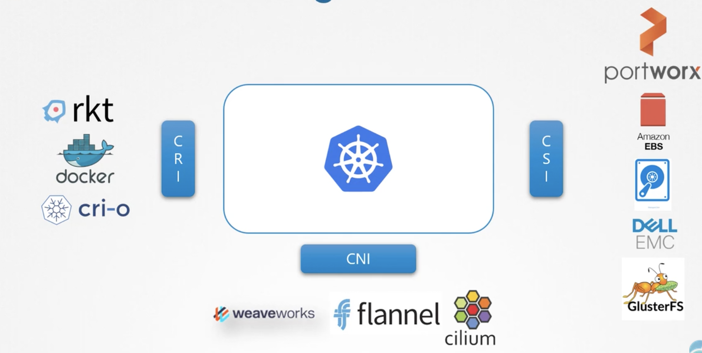

Note that CSI is not a kubernetes specific standard, it is meant to be a universal standard, and if implemented, allows any container orchestration tool to work with any storage vendor with a supported plug in.

Currently, kubernetes, Cloud Foundry and mesos are on board with CSI.

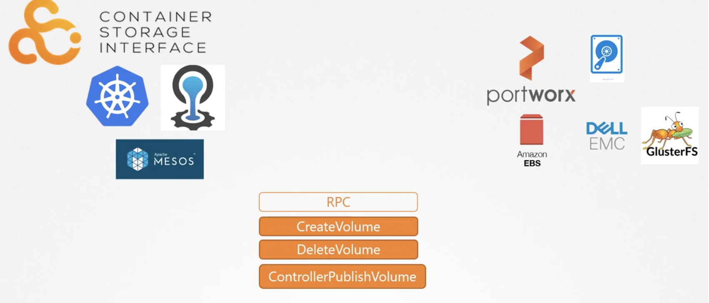

So here's what the CSI kind of looks like, it defines a set of RPCs or remote procedure calls that will be called by the container orchestrator and these must be implemented by the storage drivers.For example, CSI says that when a pod is created and requires a volume, the container orchestrator in this case, kubernetes, should call the **create** **volume** RPC and pass a set of details such as the volume name.The storage driver should implement this RPC and handle that request and provision a new volume on the storage array and return the results of the operation.Similarly, Container Orchestrator should call the delete volume RPC when a volume is to be deleted and the storage driver should implement the code to decommission the volume from the array when that call is made.And the specification details exactly what parameters should be sent by the caller, what should be received by the solution and what error codes should be exchanged. If you're interested, you can review all these details in the CSI specification on GitHub at this url.

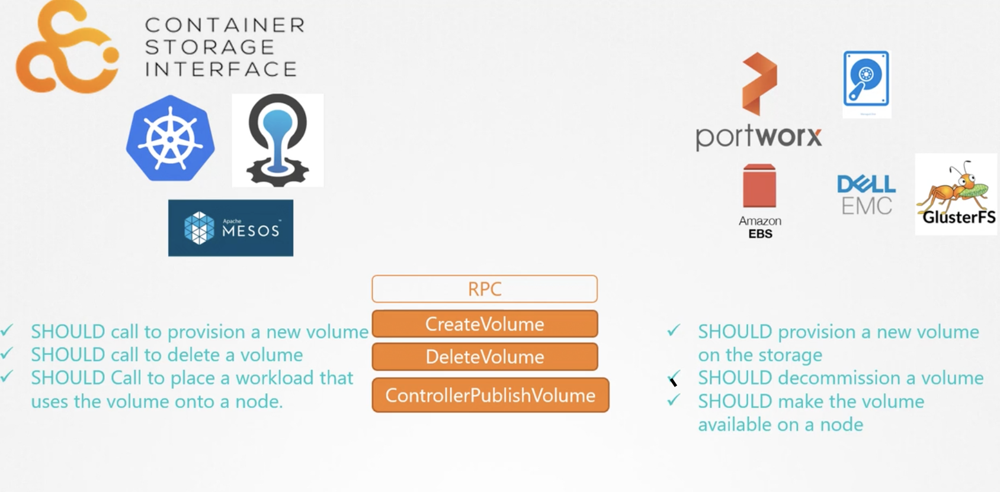

### Volumes

Persistent Volumes in Kubernetes.

Before we head into persistent volumes let us start with Volumes in Kubernetes. Let us look at volumes in Docker first. Docker containers are meant to be transient in nature which means they are meant to last only for a short period of time. They are called upon when required to process data and destroyed once finished. The same is true for the data within the container the data is destroyed along with the container. 

To persist data processed by the containers we attach a volume to the containers when they are created.  The data processed by the container is now placed in this volume thereby retaining it permanently. Even if the container is deleted the data generated or processed by it remains. 

**So how does that work in the Kubernetes world?** 

Just as in Docker, the PODs created in Kubernetes are transient in nature. When a POD is created to process data and then deleted, the data processed by it gets deleted as well. For this we attach a volume to the POD. The data generated by the POD is now stored in the volume, and even after the POD is deleted, the data remains. 

Let’s look at a simple implementation of volumes. We have a single node kubernetes cluster. We create a simple POD that generates a random between 1 and 100 and writes that to a file at **/opt/number.out** and then gets deleted along with the random number. To retain the number generated by the pod.We create a volume and a volume needs storage. When you create a volume you can choose to configure its storage in different ways. We will look at the various options in a bit but for now we will simply configure it to use a directory on the host.

In this case I specify a path **/data** on the host. This way any files created in the volume would be stored in the directory data on my node. Once the volume is created, to access it from a container we mount the volume to a directory inside the container. We use the **volumeMounts** field in each container to mount the data-volume to the directory /opt within the container.

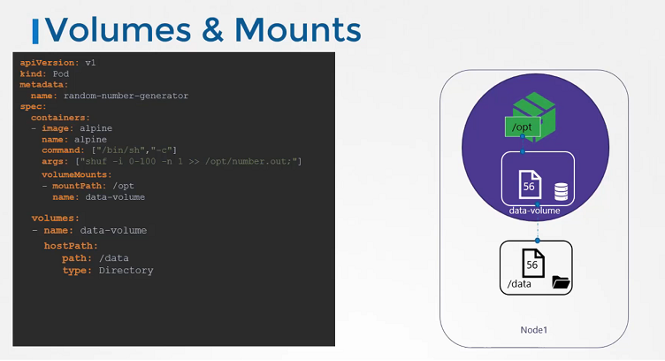

The random number will now be written to /opt mount inside the container, which happens to be on the data-volume which is in fact **/data** directory on the host. 

When the pod gets deleted, the file with the random number still lives on the host. 

**Let's take a step back and look at the volume storage options.** 

We just used the host path option to configure a directory and the host as storage space for the volume. Now that works fine on a single node however it is not recommended for use in a multi node cluster. This is because the PODs would use the /data directory on all the nodes, and expect all of them to be the same and have the same data since they are on different servers. They are in fact not the same unless you configure some kind of external replicated cluster storage solution.

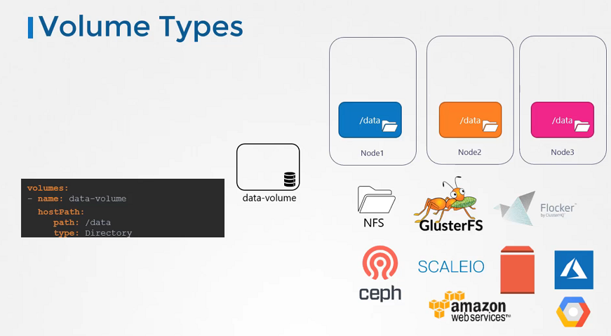

Kubernetes supports several types of standard storage solutions such as NFS, glusterFS, Flocker, FibreChannel, CephFS, ScaleIO or public cloud solutions like AWS EBS, Azure Disk or File or Google’s Persistent Disk.

For example, to configure an AWS Elastic Block Store volume as the storage or the volume, we replace

hostPath field of the volume with awsElasticBlockStore field along with the volumeID and filesystem type. The Volume storage will now be on AWS EBS. Reference docs

```yaml
volumes:
- name: data-volume
  awsElasticBlockStore:
    volumeID: <volume-id>
    fsType: ext4
```

### Persistent Volumes

In the last lecture. We learned about volumes. Now we will discuss Persistent Volumes in Kubernetes. When we created volumes in the previous section We configured volumes within the pod definition file so every configuration information required to configure storage for the volume goes within the pod definition file. 

Now when you have a large environment with a lot of users deploying a lot of pods the users would have to configure storage every time for each pod. Whatever storage solution is used the users who deploys the pods would have to configure that on all pod definition files in his own environment every time it changes to be made. The user would have to make them on all of his pods. 

Instead you would like to manage storage more centrally. You would like it to be configured in a way that an administrator can create a large pool of storage and then have users carve out pieces from it as required.

That is where persistent volumes can help us. **A persistent volume is a cluster wide pool of storage volumes configured by an administrator to be used by users deploying applications on the Cluster.** 

The users can now select storage from this pool using persistent volume claims.

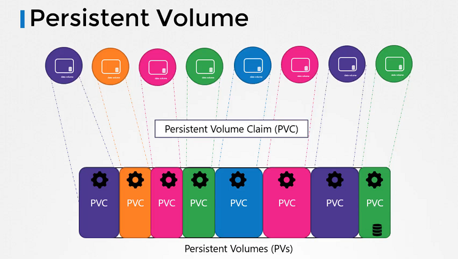

let us now create a persistent volume.

We start with the base template and update the API version, set the client to persistent volume and name it **pv-vol1** under the specs section specify the access modes, access mode defines how a volume should be mounted on the hosts whether in a read only mode or read write mode etc. 

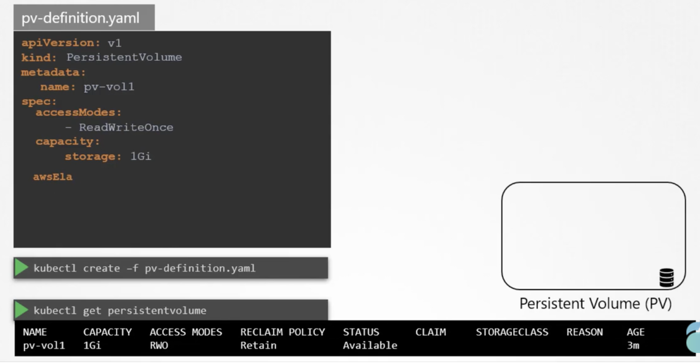

 The supported values are **ReadOnlyMany, ReadWriteOnes or ReadWriteMany,** next is the capacity specify the amount of storage to be reserved for this persistent volume which is set to 1 GB here. Next comes the volume type. We will start with the host path option that uses storage from the nodes local directory. Remember this option is not to be used in a production environment. 

```yaml
pv-definition.yaml

kind: PersistentVolume
apiVersion: v1
metadata:
  name: pv-vol1
spec:
  accessModes: [ "ReadWriteOnce" ]
  capacity:
   storage: 1Gi
  hostPath:
   path: /tmp/data

$ kubectl create -f pv-definition.yaml
persistentvolume/pv-vol1 created

$ kubectl get pv
NAME      CAPACITY   ACCESS MODES   RECLAIM POLICY   STATUS      CLAIM   STORAGECLASS   REASON   AGE
pv-vol1   1Gi        RWO            Retain           Available                                   3min

$ kubectl delete pv pv-vol1
persistentvolume "pv-vol1" deleted
```

To create the volume run `kubectl create` command and to list the created volume. Run the `kubectl get persistentvolume` command replace the host path option with one of the supported storage solutions as we saw in the previous lecture like AWS elastic blocks store etc. kubernetes.io

### Persistent Volume Claims

In the previous lesson. We created a persistent volume. Now we will create a Persistent Volume Claim to make the storage available to a node. Persistent Volumes and Persistent Volume Claims are two separate objects in the Kubernetes namespace.  An Administrator creates a set of Persistent Volumes and a user creates Persistent Volume Claims to use the storage.

Once the Persistent Volume Claims are created, Kubernetes binds the Persistent Volumes to Claims based on the request and properties set on the volume. Every Persistent Volume Claim is bound to single Persistent volume during the binding process Kubernetes tries to find a persistent volume that has sufficient capacity as requested by the claim and any other request properties such as **access modes, volume modes, storage class** etc. However if there are multiple possible matches for a single claim and you would like to specifically use a particular volume you could still use labels and selectors to bind to the right volumes.

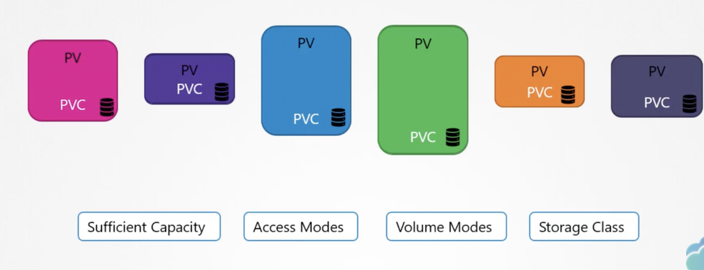

Finally note that a smaller claim may get bound to a larger volume if all the other criteria matches and there are no better options.

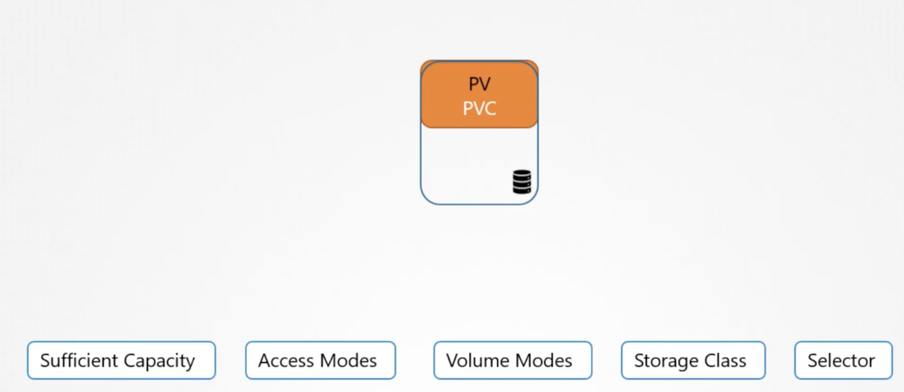

There is a one to one relationship between claims and volumes so no other claims can utilize the remaining capacity in the volume.

If there are no volumes available the persistent volume claim will remain in a pending state until newer volumes are made available to the cluster, once newer volumes are available. The claim would automatically be bound to the newly available volume.  

let us now create a persistent volume claim.

We start with a blank template saying the API version to v1 and kind to PersistentVolumeClaim.We will name it **myclaim**. Under specification set the accessModes to **ReadWriteOnce**. And set resources to request a storage of 500megabytes. 

```yaml
 pvc-definition.yaml

kind: PersistentVolumeClaim
apiVersion: v1
metadata:
  name: myclaim
spec:
  accessModes: [ "ReadWriteOnce" ]
  resources:
   requests:
     storage: 1Gi

pv-definition.yaml
kind: PersistentVolume
apiVersion: v1
metadata:
    name: pv-vol1
spec:
    accessModes: [ "ReadWriteOnce" ]
    capacity:
     storage: 1Gi
    hostPath:
     path: /tmp/data

$ kubectl create -f pv-definition.yaml
persistentvolume/pv-vol1 created

$ kubectl get pv
NAME      CAPACITY   ACCESS MODES   RECLAIM POLICY   STATUS      CLAIM   STORAGECLASS   REASON   AGE
pv-vol1   1Gi        RWO            Retain           Available                                   10s
```

Create the claim using the `kubectl create` command. To view the created claim run the `kubectl get persistentvolumeclaim` command. We see the claim in a pending state. 

When the claim is created, kubernetes looks at the volume created previously. The access Modes match. The capacity requested is 500 Megabytes but the volume is configured with 1 GB of storage. Since there are no other volumes available. The persistent volume claim is bound to persistent volume, when we run to `get` `volumes` commands again .

We see the claim is bound to the persistent volume we created. Perfect. 

To delete a PVC run the `kubectl delete persistentvolumeclaim` command but what happens to the underlying persistent volume when the claim is deleted.

You can choose what is to happen to the volume by default. It is set to retain meaning the persistent volume will remain until it is manually deleted by the administrator.

It is not available for reuse by any other claims or it can be deleted automatically.  This way as soon as the claim is deleted the volume will be deleted as well thus freeing up storage on the end storage device or a third option is to recycle. 

In this case the data in the data volume will be scrubbed before making it available to other claims. 

### Using PVC in PODs

Once you create a PVC use it in a POD definition file by specifying the PVC Claim name under persistentVolumeClaim section in the volumes section like this:

```yaml
apiVersion: v1
kind: Pod
metadata:
  name: mypod
spec:
  containers:
    - name: myfrontend
      image: nginx
      volumeMounts:
      - mountPath: "/var/www/html"
        name: mypd
  volumes:
    - name: mypd
      persistentVolumeClaim:
        claimName: myclaim
```

The same is true for ReplicaSets or Deployments. Add this to the pod template section of a Deployment on ReplicaSet.

Test commands 

- The application stores logs at location `/log/app.log`. View the logs. , You can exec in to the container and open the file:  `kubectl exec webapp -- cat /log/app.log`

- If the POD was to get deleted now, would you be able to view these logs? -- No

Use the command kubectl delete to delete a webapp pod and try to view those logs again.

Sol ;The logs are stored in the Container's file system that lives only as long as the Container does. Once the pod is destroyed, you cannot view the logs again.

- Configure a volume to store these logs at `/var/log/webapp` on the host. Use the spec provided below.

```bash
kubectl get po webapp -o yaml > webapp.yaml
```

Use the command `kubectl get po webapp -o yaml > webapp.yaml` and add the given properties under the `spec.volumes` and `spec.containers.volumeMounts.`ORUse the command `kubectl run` to create a new pod and use the `flag --dry-run=client -o yaml` to generate the manifest file.

In the manifest file add `spec.volumes` and `spec.containers.volumeMounts` property.

After that, run the following command to create a pod called webapp: -

```yaml
kubectl replace -f webapp.yaml --force 
kubectl replace -f: - It will remove the existing resource and will replace it with the new one from the given manifest file. 
apiVersion: v1
kind: Pod
metadata:
  name: webapp
spec:
  containers:
  - env:
- name: LOG_HANDLERS
  value: file
image: kodekloud/event-simulator
name: event-simulator
volumeMounts:
- mountPath: /log
  name: log-volume
  volumes:
- name: log-volume
  hostPath:
    path: /var/log/webapp
    type: Directory
```

Create a `Persistent Volume` with the given specification 

- Volume Name: pv-log

- Storage: 100Mi

- Access Modes: ReadWriteMany

- Host Path: /pv/log

- Reclaim Policy: Retain

```yaml
apiVersion: v1
kind: PersistentVolume
metadata:
  name: pv-log
spec:
  capacity:
storage: 100Mi
  hostPath:
path: /pv/log
  accessModes:
- ReadWriteMany
  persistentVolumeReclaimPolicy: Retain


##does not work 
apiVersion: v1 
kind: PersistentVolumeClaim
metadata:
  name: claim-log-1
spec:
  accessModes:
    - ReadWriteOnce
  volumeMode: Filesystem
  resources:
    requests:
      storage: 50Mi
  storageClassName: “”
  selector:
    matchLabels:
      release: "stable"
    matchExpressions:
      - {key: environment, operator: In, values: [dev]}


##works##
kind: PersistentVolumeClaim
apiVersion: v1
metadata:
  name: claim-log-1
spec:
  accessModes:
    - ReadWriteOnce
  resources:
    requests:
      storage: 50Mi


kubectl get pvc -o wide
kubectl get pv -o wide
```

- Update the `webapp` pod to use the persistent volume claim as its storage. Replace `hostPath` configured earlier with the newly created `PersistentVolumeClaim.`

```yaml
apiVersion: v1
kind: Pod
metadata:
  name: webapp
spec:
  containers:
  - env:
- name: LOG_HANDLERS
  value: file
image: kodekloud/event-simulator
name: event-simulator
volumeMounts:
- mountPath: /log
  name: log-volume
  volumes:
- name: log-volume
    persistentVolumeClaim:
          claimName: claim-log-1
```

### Storage Classes

In the previous lectures we discussed about how to create PVs and then create PVCs to claim that storage and then use the PVCs in the pod definition files as volumes. 

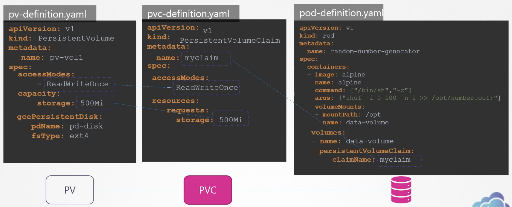

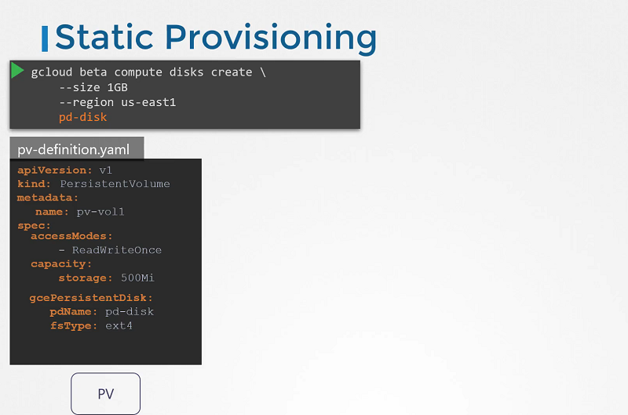

In this case, we create a PVC from a Google cloud  persistent disk.  The problem here is that before this PV is created, you must have created the disk on Google Cloud. Every time an application requires storage, you have to first manually provision the disk on Google Cloud and then manually create a persistent volume definition file using the same name as that of the disk that you created.**That's called static provisioning volumes.**

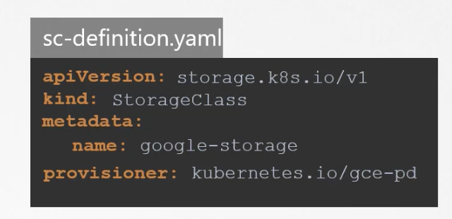

It would have been nice if the volume gets provisioned automatically when the application requires it, and that's where **storage classes** come in. With storage classes, you can define a provisioner such as Google storage that can automatically provision storage on Google Cloud and attach that to PODs when a claim is made. That's called **dynamic provisioning** of volumes. You do that by creating a storage class object with the API version set to **storage.k8s.io/v1**, specify a name and use provisioner as  **kubernates.io/gce-pd**So going back to our original state where we have a pod using a PVC for its storage and the PVC is bound to a PV, we now have a storage class. So we no longer need the PV definition, because the PV and any associated storage is going to be created automatically when the storage class is created. 

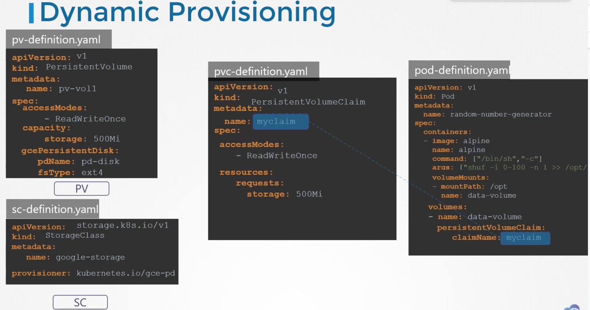

For the PVC to use the storage class we defined, we specify the storage class name in the PVC definition. That's how the PVC knows which storage class to use, Next time a PVC is created the storage class associated with it, uses the defined provisioner to provision a new disk with the required size on GCP and then creates a persistent volume and then binds the PVC to that volume. 

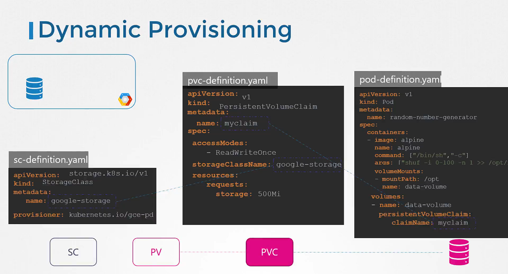

So remember that it still creates a PV. It's just that you don't have to manually create PVs anymore. It's created automatically by the storage class. We used the GCE provisioner to create a volume on GCP, there are many other provisioners as well, 

such as for AWS EBS, Azure File, Azure disk,cephFS,PortWorx,scaleIO and so on. 

With each of these provisions, you can pass in additional parameters, such as the type of disk to provision, the replication type, etc… These parameters are very specific to the provision that you are using. For Google Persistent disk. ⇒You can specify the type which could be standard or SSD.  ⇒You can specify the replication mode which could be none or regional-pd

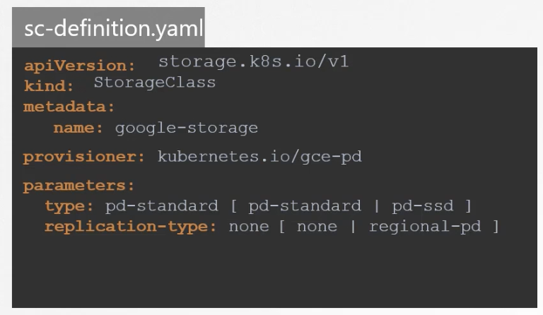

sc-definition.yaml

```yaml
apiVersion: storage.k8s.io/v1
kind: StorageClass
metadata:
   name: google-storage
provisioner: kubernetes.io/gce-pd
```

So you see, you can create different storage classes, each using different types of disks, for example, a silver storage class with the standard disks, a gold class with SSD drives, and a platinum class with SSD drives and replication. 

And that's why it's called a storage class. You can create different classes of service. Next time you create a PVC, you can simply specify the class of storage you need for your volumes.

```bash
Test Question and solutions 

→ How many StorageClasses exist in the cluster right now?
kubectl get storageclasess -- for how many storage classes are present in the cluster
```

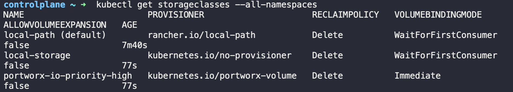

```yaml
→ What is the name of the Storage Class that does not support dynamic volume provisioning?
Look for the storage class name that uses no-provisioner
The local-storage storage class makes use of the no-provisioner and currently does not support dynamic provisioning.
Refer to the tab above the terminal (called Local Storage) to read more about it.

→ What is the Provisioner used for the storage class called portworx-io-priority-high?

run the command: kubectl describe sc portworx-io-priority-high or kubectl get sc portworx-io-priority-high and look under the PROVISIONER section.
→ Is there a PersistentVolumeClaim that is consuming the PersistentVolume called local-pv?
kubectl get pvc -o wide 

→ Create a new PersistentVolumeClaim by the name of local-pvc that should bind to the volume local-pv. Inspect the pv local-pv for the specs.


apiVersion: v1
kind: PersistentVolumeClaim
metadata:
  name: local-pvc
spec:
  accessModes:
    - ReadWriteOnce
  resources:
    requests:
      storage: 500Mi
  storageClassName: local-storage

→ Why is the PVC in a pending state despite making a valid request to claim the volume called local-pv?
```

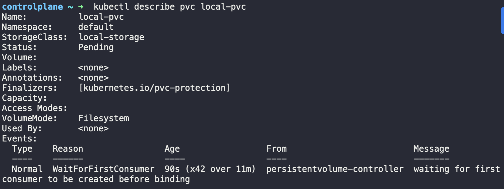

```yaml
Ans: A Pod consuming the volume is not scheduled 
The StorageClass used by the PVC uses WaitForFirstConsumer volume binding mode. This means that the persistent volume will not bind to the claim until a pod makes use of the PVC to request storage.
→ The Storage Class called local-storage makes use of VolumeBindingMode set to WaitForFirstConsumer. This will delay the binding and provisioning of a PersistentVolume until a Pod using the PersistentVolumeClaim is created. 
→ Create a new pod called nginx with the image nginx:alpine. The Pod should make use of the PVC local-pvc and mount the volume at the path /var/www/html. The PV local-pv should in a bound state.
apiVersion: v1
kind: Pod
metadata:
  name: nginx
spec:
  containers:
    - name: nginx
      image: nginx:alpine
      volumeMounts:
      - mountPath: "/var/www/html"
        name: mypd
  volumes:
    - name: mypd
      persistentVolumeClaim:
        claimName: local-pvc

create a storage class which has following attributes 1. volumeBindingMode: WaitForFirstConsumer2. provisioner: kubernetes.io/no-provisioner
apiVersion: storage.k8s.io/v1
kind: StorageClass
metadata:
   name: delayed-volume-sc
provisioner: kubernetes.io/no-provisioner
volumeBindingMode: WaitForFirstConsumer
```

---

### PersistentVolumeClaim (PVC) Volume Expansion

Kubernetes allows online resizing of Persistent Volumes without downtime if supported by the underlying storage provider and CSI driver.

#### Enabling Volume Expansion in StorageClass
The StorageClass must have `allowVolumeExpansion: true`:

```yaml
apiVersion: storage.k8s.io/v1
kind: StorageClass
metadata:
  name: expandable-sc
provisioner: csi.example.com
allowVolumeExpansion: true # Essential for resizing PVCs
volumeBindingMode: Immediate
```

#### Expanding an Existing PVC
You can only increase a PVC's storage size (reducing volume size is never supported).

1. Edit the PVC:
   ```bash
   kubectl edit pvc data-pvc
   ```
2. Or patch the request directly:
   ```bash
   kubectl patch pvc data-pvc -p '{"spec":{"resources":{"requests":{"storage":"20Gi"}}}}'
   ```
3. Inspect expansion progress:
   ```bash
   kubectl describe pvc data-pvc
   ```
   *If the underlying volume is resized but the filesystem inside the Pod has not yet expanded, the PVC status condition will show `FileSystemResizePending`. Once a Pod mounts the volume, kubelet resizes the filesystem and clears the condition.*

---

### CSI Volume Snapshots & VolumeSnapshotClass

Kubernetes provides standard CRDs (`snapshot.storage.k8s.io`) for point-in-time copies of volumes.

#### 1. VolumeSnapshotClass
Defines the CSI snapshot driver and deletion policy:
```yaml
apiVersion: snapshot.storage.k8s.io/v1
kind: VolumeSnapshotClass
metadata:
  name: csi-aws-vsc
driver: ebs.csi.aws.com
deletionPolicy: Delete # Or 'Retain' to preserve physical snapshot when object deleted
```

#### 2. Creating a VolumeSnapshot from a PVC
```yaml
apiVersion: snapshot.storage.k8s.io/v1
kind: VolumeSnapshot
metadata:
  name: mysql-backup-snapshot
  namespace: database
spec:
  volumeSnapshotClassName: csi-aws-vsc
  source:
    persistentVolumeClaimName: mysql-data-pvc
```

Check snapshot readiness:
```bash
kubectl get volumesnapshot -n database
# READYTOUSE column should become 'true'
```

#### 3. Restoring a PVC from a VolumeSnapshot
You can create a brand new PVC initialized with data from a previous snapshot:

```yaml
apiVersion: v1
kind: PersistentVolumeClaim
metadata:
  name: mysql-restored-pvc
  namespace: database
spec:
  storageClassName: expandable-sc
  dataSource:
    name: mysql-backup-snapshot
    kind: VolumeSnapshot
    apiGroup: snapshot.storage.k8s.io
  accessModes:
    - ReadWriteOnce
  resources:
    requests:
      storage: 20Gi # Must be greater than or equal to snapshot size
```
