# 09. Design and Install a Kubernetes Cluster

## 📑 Table of Contents
- [1. Cluster Design Fundamentals](#1-cluster-design-fundamentals)
  - [Assessing Cluster Purpose & Workload Profiles](#assessing-cluster-purpose--workload-profiles)
  - [Kubernetes Scale Limits & Node Sizing](#kubernetes-scale-limits--node-sizing)
  - [Cloud vs. On-Premises Architecture](#cloud-vs-on-premises-architecture)
  - [Storage Considerations](#storage-considerations)
  - [Master vs. Worker Node Architecture](#master-vs-worker-node-architecture)
- [2. Choosing Kubernetes Infrastructure](#2-choosing-kubernetes-infrastructure)
  - [Local Development Environments](#local-development-environments)
  - [Turnkey Solutions vs. Managed Cloud Platforms](#turnkey-solutions-vs-managed-cloud-platforms)
- [3. High Availability (HA) Control Plane Architecture](#3-high-availability-ha-control-plane-architecture)
  - [The Need for High Availability](#the-need-for-high-availability)
  - [API Server: Active-Active with Load Balancer](#api-server-active-active-with-load-balancer)
  - [Controller Manager & Scheduler: Active-Standby via Leader Election](#controller-manager--scheduler-active-standby-via-leader-election)
  - [ETCD Topologies: Stacked vs. External](#etcd-topologies-stacked-vs-external)
  - [Complete 5-Node HA Architecture](#complete-5-node-ha-architecture)
- [4. ETCD in High Availability](#4-etcd-in-high-availability)
  - [What is ETCD? Distributed Key-Value Architecture](#what-is-etcd-distributed-key-value-architecture)
  - [Read vs. Write Operations](#read-vs-write-operations)
  - [Distributed Consensus via the RAFT Protocol](#distributed-consensus-via-the-raft-protocol)
  - [Quorum Calculation & Fault Tolerance](#quorum-calculation--fault-tolerance)
  - [Why Odd Numbers of Nodes (3, 5, 7)?](#why-odd-numbers-of-nodes-3-5-7)
  - [ETCD Cluster Configuration & Service Setup](#etcd-cluster-configuration--service-setup)
  - [Interacting with ETCD using `etcdctl` (v3 API)](#interacting-with-etcd-using-etcdctl-v3-api)
- [5. Bootstrapping with Kubeadm](#5-bootstrapping-with-kubeadm)
  - [Kubeadm Overview & Responsibilities](#kubeadm-overview--responsibilities)
  - [High-Level Installation Workflow](#high-level-installation-workflow)
- [6. Provisioning VMs with Vagrant (Local Multi-Node Setup)](#6-provisioning-vms-with-vagrant-local-multi-node-setup)
  - [Vagrantfile Configuration](#vagrantfile-configuration)
  - [Provisioning and Connecting to VMs](#provisioning-and-connecting-to-vms)
- [7. Step-by-Step Kubeadm Cluster Deployment Playbook](#7-step-by-step-kubeadm-cluster-deployment-playbook)
  - [Prerequisites & Kernel Bridging Configuration](#prerequisites--kernel-bridging-configuration)
  - [Container Runtime Setup](#container-runtime-setup)
  - [Installing Kubeadm, Kubelet, and Kubectl](#installing-kubeadm-kubelet-and-kubectl)
  - [Initializing the Control Plane Node](#initializing-the-control-plane-node)
  - [Configuring Non-Root Kubectl Access](#configuring-non-root-kubectl-access)
  - [Deploying CNI Pod Network Addon](#deploying-cni-pod-network-addon)
  - [Joining Worker Nodes](#joining-worker-nodes)
  - [Cluster Verification & Smoke Test](#cluster-verification--smoke-test)
- [8. CKA Exam Practice Lab: Kubeadm Deployment](#8-cka-exam-practice-lab-kubeadm-deployment)

---

## 1. Cluster Design Fundamentals

### Assessing Cluster Purpose & Workload Profiles
Before provisioning a cluster, evaluate key architectural drivers:

| Dimension | Key Questions & Considerations |
| :--- | :--- |
| **Purpose** | Learning/exploration, Dev/Test, or Production-grade enterprise hosting? |
| **Cloud Model** | Fully-managed Cloud Service Provider (CSP) vs. Self-hosted IaaS/Bare-metal? |
| **Workload Types** | Web services, asynchronous workers, big data, analytics, or stateful databases? |
| **Workload Volume** | Number of services, horizontal replica count, resource bounds (CPU, RAM)? |
| **Network Traffic** | Predictable baseline traffic vs. spiky, bursty high-throughput requests? |

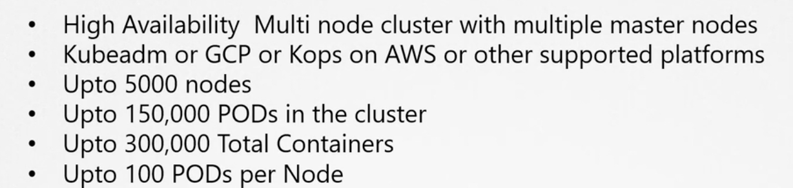

#### Cluster Profiles by Tier:
- **Learning & Prototyping:** Single-node setups (`minikube`, `kind`, or single-node `kubeadm` on local VMs or cloud instances).
- **Development & Testing:** Multi-node cluster with 1 master and 2–3 worker nodes. Provisioned quickly via `kubeadm`, GKE, EKS, or AKS.
- **Production Environments:** High Availability (HA) multi-node setup with redundant control planes, dedicated/external ETCD clusters, multiple worker nodes, and multi-zone fault domains.

---

### Kubernetes Scale Limits & Node Sizing

Standard Kubernetes architecture supports the following upper scale boundaries:
- **Max Nodes per Cluster:** Up to **5,000** nodes
- **Max Pods per Cluster:** Up to **150,000** Pods
- **Max Containers per Cluster:** Up to **300,000** containers
- **Max Pods per Node:** Up to **110** Pods (configurable via kubelet `--max-pods`)

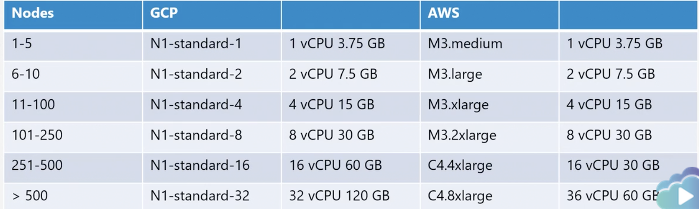

Node resource configurations vary by cluster capacity:
- Small clusters ($\le 10$ nodes): 2–4 vCPUs, 8–16 GB RAM per master node.
- Large clusters ($> 500$ nodes): Master nodes scaled up with dedicated control-plane resources and high-performance NVMe storage for ETCD.

---

### Cloud vs. On-Premises Architecture

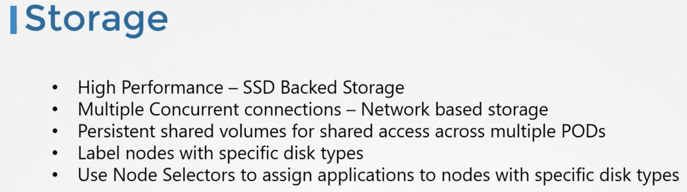

- **On-Premises / Bare-Metal:** `kubeadm` is the standard tool to bootstrap production-ready clusters. Turnkey solutions like Red Hat OpenShift, VMware Tanzu, or Cloud Foundry Container Runtime provide enterprise operational layers.
- **Managed Public Cloud:**
  - **GCP (Google Kubernetes Engine - GKE):** Managed control planes with automated one-click version upgrades and repair.
  - **AWS (Elastic Kubernetes Service - EKS / kOps):** Self-managed clusters using `kops` or managed control planes via EKS.
  - **Azure (Azure Kubernetes Service - AKS):** Free managed control plane with integrated Azure Active Directory and ACR.

---

### Storage Considerations
- **High-Performance Workloads:** SSD/NVMe-backed local storage or low-latency block volumes for databases.
- **Concurrent / Shared Access:** Network-attached storage (NFS, CephFS) providing `ReadWriteMany` (RWX) access modes.
- **Persistent Volumes:** Abstracted storage volumes managed dynamically via distinct **StorageClasses**.

---

### Master vs. Worker Node Architecture
- **Control Plane (Master) Nodes:** Host control components (`kube-apiserver`, `etcd`, `kube-controller-manager`, `kube-scheduler`).
- **Worker Nodes:** Run container runtimes, `kubelet`, `kube-proxy`, and end-user workload Pods.
- **Isolation Best Practice:** Dedicated control plane nodes should not host general workloads. Tools like `kubeadm` enforce this automatically by applying the taint:
  ```text
  node-role.kubernetes.io/control-plane:NoSchedule
  ```
- **OS Requirement:** 64-bit Linux distribution with kernel cgroup and namespace support.

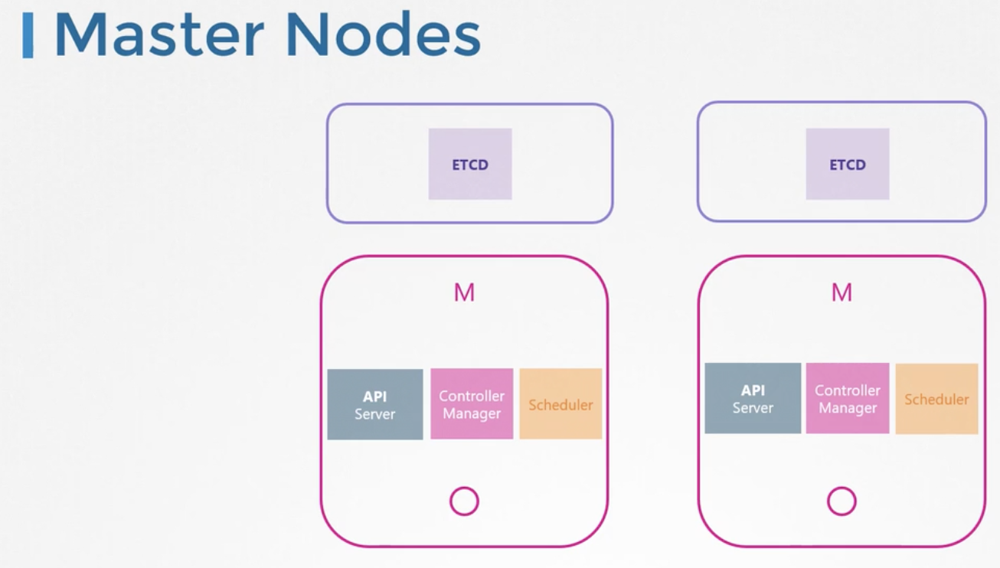

---

## 2. Choosing Kubernetes Infrastructure

### Local Development Environments
- **Linux Hosts:** Native binaries or containerized clusters (`kind`, `minikube`).
- **Windows / macOS Hosts:** Run via virtualization hypervisors (Hyper-V, VirtualBox, VMware) or WSL2 running Linux VMs.
- **Minikube:** Boots a lightweight VM hosting a single-node all-in-one Kubernetes cluster.
- **Kubeadm on Local VMs:** Mirror production deployment topology using multiple VMs provisioned via Vagrant + VirtualBox.

---

### Turnkey Solutions vs. Managed Cloud Platforms

| Solution Type | Examples | Control Plane Management | Infrastructure Maintenance |
| :--- | :--- | :--- | :--- |
| **Turnkey (Private Cloud / On-Prem)** | Red Hat OpenShift, VMware Tanzu, Cloud Foundry (BOSH), Rancher (RKE) | Managed by platform scripts/tooling | Customer manages underlying VMs and OS patching |
| **Hosted / Managed (Public Cloud)** | Google Cloud GKE, AWS EKS, Azure AKS | Automated by Cloud Provider (SLA-backed) | Cloud provider manages control plane; optional automated worker upgrades |

---

## 3. High Availability (HA) Control Plane Architecture

### The Need for High Availability
In a single-master cluster, losing the control plane causes major operational disruptions:
- Worker nodes continue executing existing Pods, but **no scheduling or health recovery can occur**.
- Failed Pods are not recreated by controllers.
- `kubectl` and Kubernetes APIs become completely inaccessible.
- A production architecture requires redundancy across every control plane layer.

---

### API Server: Active-Active with Load Balancer
`kube-apiserver` instances are stateless request handlers.
- Multiple instances run concurrently in **Active-Active** mode across all control plane nodes.
- An external Load Balancer (HAProxy, NGINX, Keepalived, or Cloud LB) distributes client (`kubectl`, worker `kubelet`, `kube-proxy`) traffic across all API servers on port `6443`.

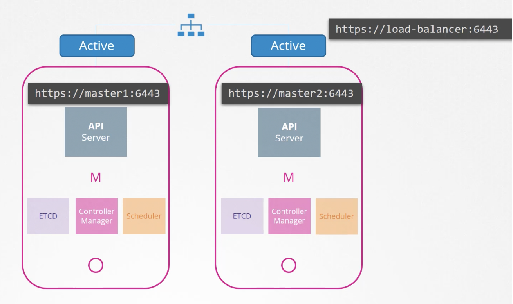

---

### Controller Manager & Scheduler: Active-Standby via Leader Election
`kube-controller-manager` and `kube-scheduler` maintain active cluster state and cannot process mutations in parallel (which would cause race conditions and duplicate Pod creations).
- They operate in **Active-Standby** mode via an automated **Leader Election** mechanism.
- The active process secures a renewable lease lock on an endpoint/lease object (`coordination.k8s.io`).

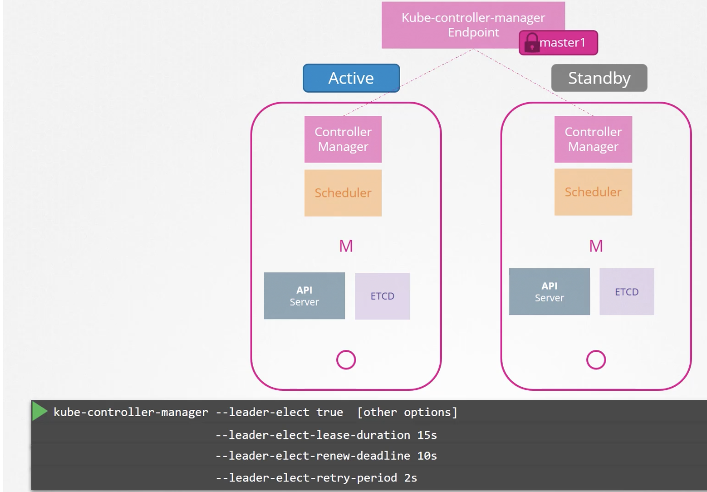

#### Leader Election Flags:
- `--leader-elect=true` (Enables leader election mechanism)
- `--leader-elect-lease-duration=15s` (Lock expiration timeout)
- `--leader-elect-renew-deadline=10s` (Interval at which active leader must renew its lease)
- `--leader-elect-retry-period=2s` (Interval at which standby candidates attempt to acquire lock)

---

### ETCD Topologies: Stacked vs. External

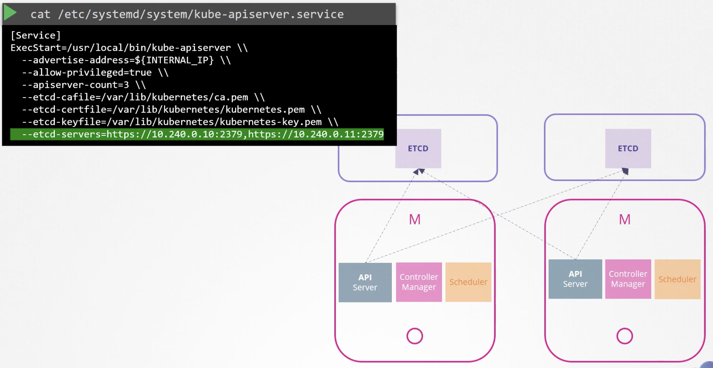

| Topology | Architecture | Advantages | Disadvantages |
| :--- | :--- | :--- | :--- |
| **Stacked Control Plane** | ETCD members run as static Pods directly on control plane nodes. | Fewer servers required; easier to deploy with `kubeadm init --control-plane`. | Coupling: Losing a control plane node simultaneously destroys an ETCD node. |
| **External ETCD** | ETCD cluster runs on separate dedicated bare-metal/VM hosts. | Maximum resilience and isolation; control plane node crashes do not impact datastore. | Requires double the host instances; increased setup and TLS complexity. |

---

### Complete 5-Node HA Architecture
In a standard production topology:
- **3 Control Plane Nodes** running stacked or external ETCD.
- **1 Load Balancer** fronting the API servers.
- **Worker Nodes** executing container workloads.

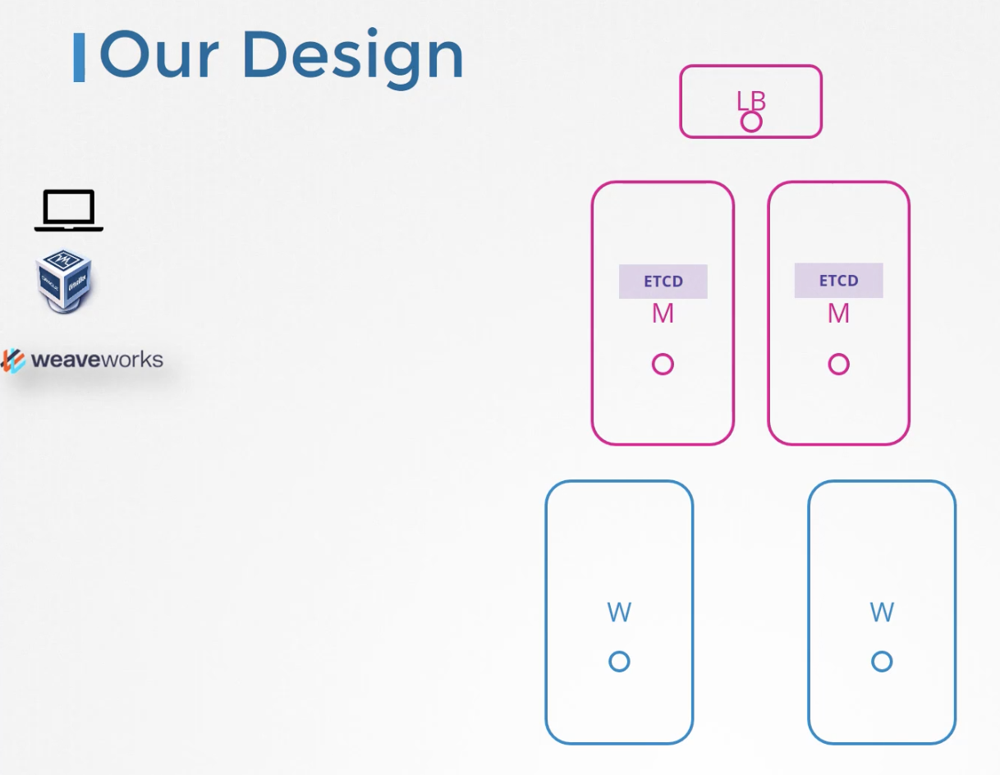

---

## 4. ETCD in High Availability

### What is ETCD? Distributed Key-Value Architecture
ETCD is a strongly consistent, distributed key-value store that houses the complete cluster state, specifications, and metadata.


---

### Read vs. Write Operations
- **Reads:** Can be served directly from any member node.
- **Writes:** Must always be processed through the elected **Leader**. If a write request hits a follower node, the follower forwards the write internally to the cluster leader.
- The leader writes the entry to its local log and propagates it to all followers. The write is only committed once acknowledged by a **quorum** of cluster members.

---

### Distributed Consensus via the RAFT Protocol
ETCD maintains strict consistency across nodes using the **RAFT consensus algorithm**:
1. **Randomized Election Timers:** Each node runs a randomized heartbeat timeout (typically 150ms–300ms).
2. **Leader Election:** If a node does not receive a heartbeat, its timer expires, transitions to candidate state, increments term, and requests votes.
3. **Log Replication:** Once elected, the leader broadcasts regular heartbeat signals to prevent new elections and replicates all incoming mutations.

---

### Quorum Calculation & Fault Tolerance
Quorum is the minimum number of functional nodes required to accept writes and make cluster decisions.


$$\text{Quorum} = \left\lfloor \frac{N}{2} \right\rfloor + 1$$


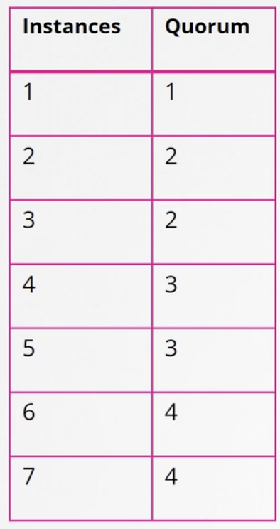

---

### Why Odd Numbers of Nodes (3, 5, 7)?

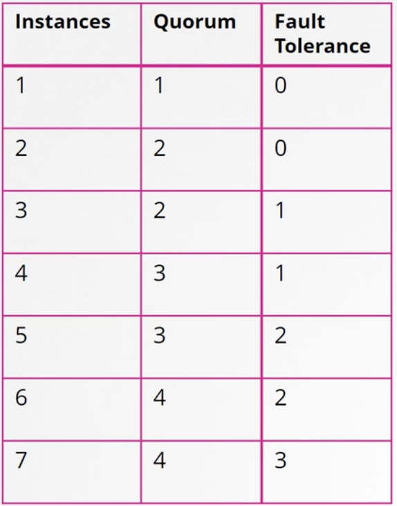

| Total Cluster Nodes ($N$) | Quorum ($\lfloor N/2 \rfloor + 1$) | Fault Tolerance ($N - \text{Quorum}$) |
| :---: | :---: | :---: |
| 1 | 1 | 0 |
| 2 | 2 | 0 |
| **3** | **2** | **1** |
| 4 | 3 | 1 |
| **5** | **3** | **2** |
| 6 | 4 | 2 |
| **7** | **4** | **3** |

#### Why Even Counts (e.g., 4 or 6) are Anti-Patterns:
1. **Identical Fault Tolerance:** A 4-node cluster still only tolerates 1 node failure (quorum = 3), identical to a 3-node cluster. Adding the 4th node adds network overhead without improving fault tolerance.
2. **Split-Brain Risk during Network Partition:**
   - If a 6-node cluster splits evenly into 3 and 3, **neither half meets the required quorum of 4**. The entire cluster freezes and rejects writes.
   - If a 5-node cluster splits into 3 and 2, the 3-node partition maintains quorum and continues operating seamlessly.

> [!IMPORTANT]
> Always configure ETCD clusters with an **odd number of nodes** (minimum 3 for HA; 5 for higher resilience). Clusters with $> 7$ nodes are rarely recommended due to consensus replication overhead.

---

### ETCD Cluster Configuration & Service Setup

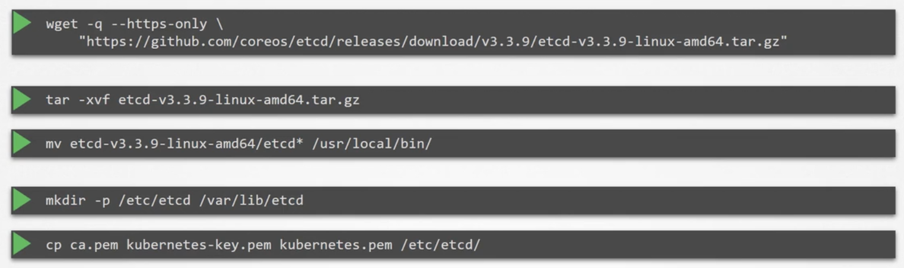

Each ETCD member requires mutual TLS certificates and systemd unit configuration specifying initial peers:

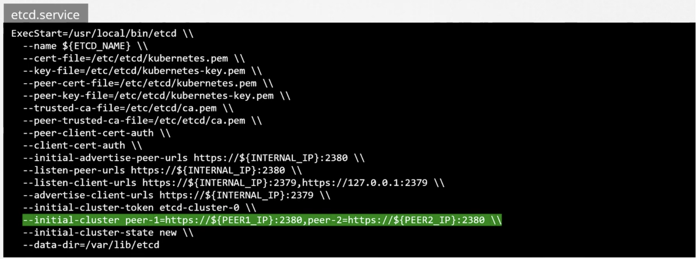

Sample `/etc/systemd/system/etcd.service` excerpt:
```ini
[Unit]
Description=etcd distributed reliable key-value store
Documentation=https://github.com/etcd-io/etcd

[Service]
Type=notify
ExecStart=/usr/local/bin/etcd \
  --name etcd-node-1 \
  --cert-file=/etc/etcd/kubernetes.pem \
  --key-file=/etc/etcd/kubernetes-key.pem \
  --peer-cert-file=/etc/etcd/kubernetes.pem \
  --peer-key-file=/etc/etcd/kubernetes-key.pem \
  --trusted-ca-file=/etc/etcd/ca.pem \
  --peer-trusted-ca-file=/etc/etcd/ca.pem \
  --peer-client-cert-auth \
  --client-cert-auth \
  --initial-advertise-peer-urls https://192.168.56.11:2380 \
  --listen-peer-urls https://192.168.56.11:2380 \
  --listen-client-urls https://192.168.56.11:2379,https://127.0.0.1:2379 \
  --advertise-client-urls https://192.168.56.11:2379 \
  --initial-cluster etcd-node-1=https://192.168.56.11:2380,etcd-node-2=https://192.168.56.12:2380,etcd-node-3=https://192.168.56.13:2380 \
  --initial-cluster-token etcd-cluster-token \
  --initial-cluster-state new \
  --data-dir=/var/lib/etcd
Restart=on-failure
RestartSec=5

[Install]
WantedBy=multi-user.target
```

---

### Interacting with ETCD using `etcdctl` (v3 API)

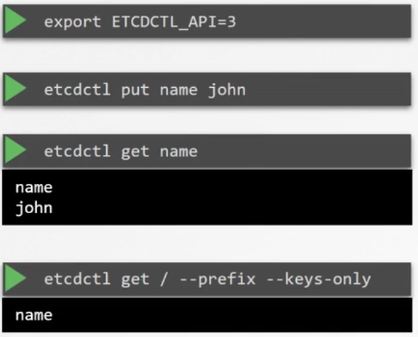

Always specify `ETCDCTL_API=3` when interacting with modern Kubernetes ETCD datastores:

```bash
# Export API version
export ETCDCTL_API=3

# Store a key-value pair
etcdctl put /name john

# Retrieve value
etcdctl get /name

# Retrieve all keys
etcdctl get / --prefix --keys-only

# Check cluster member list
etcdctl --endpoints=https://127.0.0.1:2379 \
  --cacert=/etc/kubernetes/pki/etcd/ca.crt \
  --cert=/etc/kubernetes/pki/etcd/server.crt \
  --key=/etc/kubernetes/pki/etcd/server.key \
  member list

# Check cluster endpoint health
etcdctl --endpoints=https://127.0.0.1:2379 \
  --cacert=/etc/kubernetes/pki/etcd/ca.crt \
  --cert=/etc/kubernetes/pki/etcd/server.crt \
  --key=/etc/kubernetes/pki/etcd/server.key \
  endpoint health
```

---

## 5. Bootstrapping with Kubeadm

### Kubeadm Overview & Responsibilities
Manually provisioning a production-grade cluster involves generating dozens of TLS certificates, creating PKI infrastructures, authoring complex static Pod manifests, and wiring component flags. `kubeadm` automates this entire lifecycle following official Kubernetes best practices.

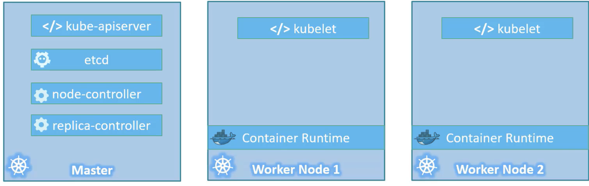

---

### High-Level Installation Workflow
1. **Host Preparation:** Provision 64-bit Linux VMs with unique hostnames, MAC addresses, and network connectivity.
2. **Container Runtime:** Install supported Container Runtime Interface (CRI) such as `containerd` or Docker/cri-dockerd.
3. **Install Binaries:** Install matching versions of `kubeadm`, `kubelet`, and `kubectl`.
4. **Initialize Control Plane:** Execute `kubeadm init` on the primary master node.
5. **Install CNI Plugin:** Deploy a Pod network addon (Calico, Flannel, Weave Net, Cilium) to enable inter-Pod communication.
6. **Join Worker Nodes:** Run `kubeadm join` on worker nodes with the generated token and discovery hash.

---

## 6. Provisioning VMs with Vagrant (Local Multi-Node Setup)

### Vagrantfile Configuration
Using Vagrant and VirtualBox to provision 1 master (`kubemaster`) and 2 worker nodes (`kubenode01`, `kubenode02`):

```bash
# Clone the repository containing the automated Vagrantfile
git clone https://github.com/kodekloudhub/certified-kubernetes-administrator-course.git
cd certified-kubernetes-administrator-course
```

The sample `Vagrantfile` configures:
- Base OS: Ubuntu 18.04 / 20.04 Bionic/Focal 64-bit
- Network Subnet: `192.168.56.0/24` (Master: `192.168.56.2`, Worker 1: `192.168.56.3`, Worker 2: `192.168.56.4`)
- Node specs: 2 vCPUs, 2 GB RAM minimum per node

---

### Provisioning and Connecting to VMs

```bash
# Inspect status of VMs before provisioning
vagrant status

# Boot and provision all virtual machines
vagrant up

# Verify running VM instances
vagrant status

# SSH into the master node
vagrant ssh kubemaster

# SSH into worker nodes
vagrant ssh kubenode01
vagrant ssh kubenode02
```

---

## 7. Step-by-Step Kubeadm Cluster Deployment Playbook

### Prerequisites & Kernel Bridging Configuration
*(Execute on **ALL** nodes: Master and Workers)*

```bash
# 1. Disable swap permanently (Kubernetes requires swap disabled)
sudo swapoff -a
sudo sed -i '/ swap / s/^\(.*\)$/#\1/g' /etc/fstab

# 2. Load necessary kernel modules
cat <<EOF | sudo tee /etc/modules-load.d/k8s.conf
overlay
br_netfilter
EOF

sudo modprobe overlay
sudo modprobe br_netfilter

# 3. Configure sysctl parameters for iptables to see bridged traffic
cat <<EOF | sudo tee /etc/sysctl.d/k8s.conf
net.bridge.bridge-nf-call-iptables  = 1
net.bridge.bridge-nf-call-ip6tables = 1
net.ipv4.ip_forward                 = 1
EOF

# Reload sysctl without rebooting
sudo sysctl --system

# Verify module is active
lsmod | grep br_netfilter
```

---

### Container Runtime Setup
*(Execute on **ALL** nodes)*

```bash
# Install dependencies
sudo apt-get update
sudo apt-get install -y apt-transport-https ca-certificates curl gnupg lsb-release

# Install Docker runtime
curl -fsSL https://download.docker.com/linux/ubuntu/gpg | sudo gpg --dearmor -o /usr/share/keyrings/docker-archive-keyring.gpg
echo "deb [arch=amd64 signed-by=/usr/share/keyrings/docker-archive-keyring.gpg] https://download.docker.com/linux/ubuntu $(lsb_release -cs) stable" | sudo tee /etc/apt/sources.list.d/docker.list > /dev/null

sudo apt-get update
sudo apt-get install -y docker-ce docker-ce-cli containerd.io

# Configure Docker to use systemd cgroup driver (crucial for Kubernetes stability)
sudo mkdir -p /etc/docker
cat <<EOF | sudo tee /etc/docker/daemon.json
{
  "exec-opts": ["native.cgroupdriver=systemd"],
  "log-driver": "json-file",
  "log-opts": {
    "max-size": "100m"
  },
  "storage-driver": "overlay2"
}
EOF

# Restart and enable Docker
sudo systemctl daemon-reload
sudo systemctl restart docker
sudo systemctl enable docker
sudo systemctl status docker --no-pager
```

---

### Installing Kubeadm, Kubelet, and Kubectl
*(Execute on **ALL** nodes)*

```bash
# Add Kubernetes package repository key
sudo curl -fsSLo /usr/share/keyrings/kubernetes-archive-keyring.gpg https://packages.cloud.google.com/apt/doc/apt-key.gpg

# Add Kubernetes APT repository
echo "deb [signed-by=/usr/share/keyrings/kubernetes-archive-keyring.gpg] https://apt.kubernetes.io/ kubernetes-xenial main" | sudo tee /etc/apt/sources.list.d/kubernetes.list

# Install packages with pinned versions
sudo apt-get update
sudo apt-get install -y kubelet=1.21.0-00 kubeadm=1.21.0-00 kubectl=1.21.0-00

# Prevent packages from being accidentally upgraded by automatic updates
sudo apt-mark hold kubelet kubeadm kubectl

# Verify installed versions
kubelet --version
kubeadm version
kubectl version --client
```

---

### Initializing the Control Plane Node
*(Execute on the **MASTER** node only)*

```bash
# Optional: Pre-pull container images to speed up initialization
sudo kubeadm config images pull

# Initialize the control plane
sudo kubeadm init \
  --apiserver-advertise-address=192.168.56.2 \
  --pod-network-cidr=10.244.0.0/16 \
  --apiserver-cert-extra-sans=controlplane
```

> [!NOTE]
> `--pod-network-cidr=10.244.0.0/16` is standard when using Weave Net or Flannel. Ensure the Pod CIDR does not overlap with node subnets.

---

### Configuring Non-Root Kubectl Access
*(Execute on the **MASTER** node as your regular user)*

```bash
mkdir -p $HOME/.kube
sudo cp -i /etc/kubernetes/admin.conf $HOME/.kube/config
sudo chown $(id -u):$(id -g) $HOME/.kube/config

# If operating as root user:
export KUBECONFIG=/etc/kubernetes/admin.conf
```

---

### Deploying CNI Pod Network Addon
*(Execute on the **MASTER** node)*

Before deploying CNI, the control plane node remains in `NotReady` status because CoreDNS requires a functional cluster network overlay.

```bash
# Deploy Weave Net CNI addon:
kubectl apply -f https://github.com/weaveworks/weave/releases/download/v2.8.1/weave-daemonset-k8s.yaml

# (Alternative) Deploy Calico CNI addon:
# kubectl apply -f https://docs.projectcalico.org/manifests/calico.yaml

# Verify CoreDNS and networking DaemonSets are Running:
kubectl get pods -n kube-system
```

---

### Joining Worker Nodes
*(Execute on each **WORKER** node as root)*

Retrieve the join command from the output of `kubeadm init`, or generate a fresh join token if the initial 24-hour token expired:

```bash
# Generate fresh join token and command on the master node:
kubeadm token create --print-join-command
```

Execute on `kubenode01` and `kubenode02`:
```bash
sudo kubeadm join 192.168.56.2:6443 \
  --token gtmdad.olx54xrbafcionbd \
  --discovery-token-ca-cert-hash sha256:fb08c01c782ef1d1ad0b643b56c9edd6a864b87cff56e7ff35713cd666659ff4
```

---

### Cluster Verification & Smoke Test
*(Execute on the **MASTER** node)*

```bash
# Verify all nodes transitioned to Ready
kubectl get nodes -o wide

# Check health of all system components
kubectl get pods -A

# Run a smoke-test NGINX Pod
kubectl run smoke-test-nginx --image=nginx:alpine --port=80
kubectl get pods -o wide

# Cleanup smoke test
kubectl delete pod smoke-test-nginx
```

---

## 8. CKA Exam Practice Lab: Kubeadm Deployment

### Scenario Requirements:
1. Configure kernel bridging on `controlplane` and `node01`.
2. Install `kubeadm=1.21.0-00`, `kubelet=1.21.0-00`, and `kubectl=1.21.0-00` on both nodes and pin versions.
3. Initialize the control plane using:
   - `apiserver-advertise-address`: IP of `eth0`
   - `apiserver-cert-extra-sans`: `controlplane`
   - `pod-network-cidr`: `10.244.0.0/16`
4. Set up kubeconfig for the user.
5. Join `node01` to the cluster.

### Lab Solution Playbook:

```bash
# -----------------------------------------------------------
# Step 1: Execute on BOTH nodes (controlplane & node01)
# -----------------------------------------------------------
cat <<EOF | sudo tee /etc/modules-load.d/k8s.conf
br_netfilter
EOF

cat <<EOF | sudo tee /etc/sysctl.d/k8s.conf
net.bridge.bridge-nf-call-ip6tables = 1
net.bridge.bridge-nf-call-iptables = 1
EOF
sudo sysctl --system

# Install Kubernetes packages
sudo apt-get update
sudo apt-get install -y apt-transport-https ca-certificates curl

sudo curl -fsSLo /usr/share/keyrings/kubernetes-archive-keyring.gpg https://packages.cloud.google.com/apt/doc/apt-key.gpg
echo "deb [signed-by=/usr/share/keyrings/kubernetes-archive-keyring.gpg] https://apt.kubernetes.io/ kubernetes-xenial main" | sudo tee /etc/apt/sources.list.d/kubernetes.list

sudo apt-get update
sudo apt-get install -y kubelet=1.21.0-00 kubeadm=1.21.0-00 kubectl=1.21.0-00
sudo apt-mark hold kubelet kubeadm kubectl

# -----------------------------------------------------------
# Step 2: Execute on controlplane ONLY
# -----------------------------------------------------------
# Identify eth0 IP
ETH0_IP=$(ip -4 addr show eth0 | grep -oP '(?<=inet\s)\d+(\.\d+){3}')

# Initialize controlplane
sudo kubeadm init \
  --apiserver-cert-extra-sans=controlplane \
  --apiserver-advertise-address=$ETH0_IP \
  --pod-network-cidr=10.244.0.0/16

# Configure user kubeconfig
mkdir -p $HOME/.kube
sudo cp -i /etc/kubernetes/admin.conf $HOME/.kube/config
sudo chown $(id -u):$(id -g) $HOME/.kube/config

# Install CNI overlay (Weave Net)
kubectl apply -f "https://cloud.weave.works/k8s/net?k8s-version=$(kubectl version | base64 | tr -d '\n')"

# -----------------------------------------------------------
# Step 3: Join node01
# -----------------------------------------------------------
# SSH into node01 and run the kubeadm join output from Step 2:
sudo kubeadm join <controlplane-ip>:6443 --token <token> \
  --discovery-token-ca-cert-hash sha256:<hash>

# Back on controlplane, verify nodes
kubectl get nodes
```
