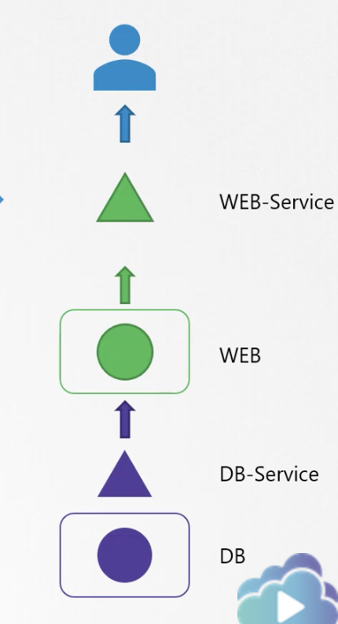
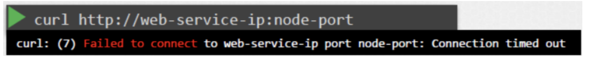
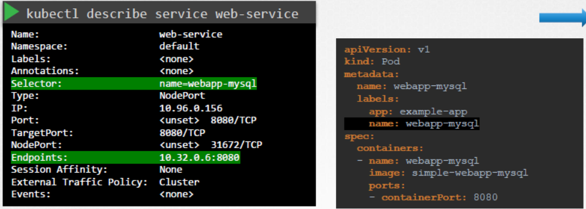
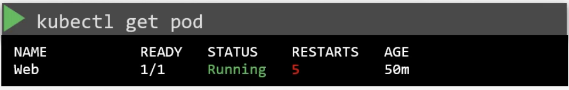
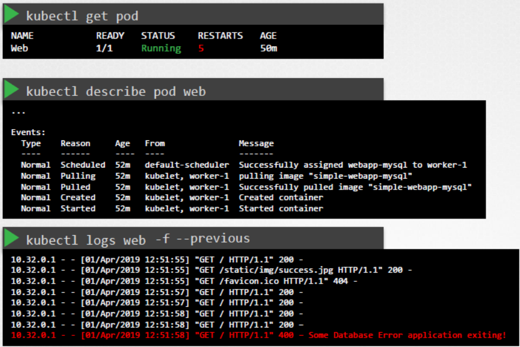
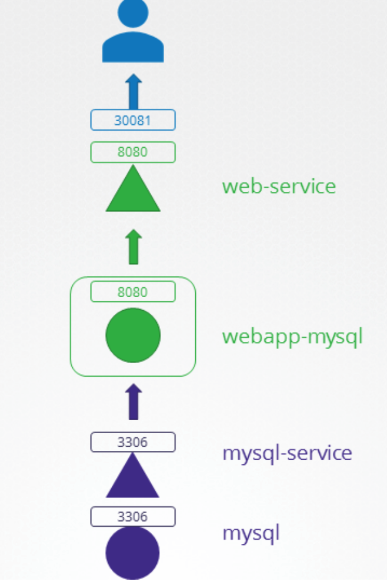

# 10. Troubleshooting

## Troubleshooting

### Application Failure

Throughout this course we have actually worked on a number of troubleshooting exercises with respect to the topic we were going through at that point in time.So a lot of troubleshooting is already covered. We will go through an overview of troubleshooting techniques and procedures and work on some more practice tests in this section. We start with application failures.

Let's take a look at a two tier application that has a web and a database server. The database pod hosts a database and serves the web servers through a database service. The web server is hosted on a Web pod and serves users through the web service. It's good to write down or draw a map or chart of how your application is configured before you start. Depending on how much you know about the failure you may choose to start from either end of this map. 



But remember to check every object and link in this map until you find the root cause of the issue. Say in our case, users report some issue with accessing the application. First we start with the application front-end. Use standard ways of testing if your application is accessible. If it’s a web application, check if the web server is accessible on the IP of the **node-port** using curl. 



`curl` [http://web-service-ip:node-port](about:blank)Next, check the service. Has it discovered endpoints for the web pod? 





`kubectl describe service web-service`In this case it did. But if it did not then you might want to check the service to pod discovery. Compare the selectors configured on the service to the ones on the pod to make sure they match. Next, check the pod itself and make sure it is in a running state. **The status of the pod as well as the number of restarts can give you an idea of whether the application on the pod is running or is getting restarted.**  Check the events related to the pod using the describe command, check the logs of the application using the logs command. If the pod is restarting due to a failure then the logs in the current version of the pod that's running the current version of the container may not reflect why it failed the last time.So you either have to watch these logs using the **–f option** and wait for the application to fail again or use the previous option to view the logs of a previous pod. Next check the status of the db-service as before. And finally check the DB pod itself. Check the logs of the DB. pod and look for any errors in the database.

There are some more tips documented in the Kubernetes documentation page for Troubleshooting applications.

```bash
kubectl logs web -f --previous
```





Test **→ Troubleshooting Test 1:** A simple 2 tier application is deployed in the alpha namespace. It must display a green web page on success. Click on the App tab at the top of your terminal to view your application. It is currently failed. Troubleshoot and fix the issue. Stick to the given architecture. Use the same names and port numbers as given in the below architecture diagram. Feel free to edit, delete or recreate objects as necessary.Check the object names and make sure they match the ones given in the architecture diagram.

The service name used for the MySQL Pod is incorrect. According to the Architecture diagram, it should be mysql-service.

To fix this, first delete the current service: kubectl -n alpha delete svc mysql

Then create a new service with the following YAML file (or use imperative command):======`apiVersion: v1`

```yaml
kind: Service
metadata:
  name: mysql-service
  namespace: alpha
spec:
  clusterIP: 10.43.241.111
  clusterIPs:
  - 10.43.241.111
  internalTrafficPolicy: Cluster
  ipFamilies:
  - IPv4
  ipFamilyPolicy: SingleStack
  ports:
  - port: 3306
protocol: TCP
targetPort: 3306
  selector:
name: mysql
  sessionAffinity: None
  type: ClusterIP
status:
  loadBalancer: {}


→ Troubleshooting Test 2: The same 2 tier application is deployed in the beta namespace. It must display a green web page on success. Click on the App tab at the top of your terminal to view your application. It is currently failed. Troubleshoot and fix the issue.
Stick to the given architecture. Use the same names and port numbers as given in the below architecture diagram. Feel free to edit, delete or recreate objects as necessary.
controlplane ~ ➜  cat mysql-service.yaml
apiVersion: v1
kind: Service
metadata:
  creationTimestamp: "2022-05-18T12:13:17Z"
  name: mysql-service
  namespace: beta
  resourceVersion: "1068"
  uid: 7a0ce034-059d-4522-b0ef-eb1a5ca4711b
spec:
  clusterIP: 10.43.104.205
  clusterIPs:
  - 10.43.104.205
  internalTrafficPolicy: Cluster
  ipFamilies:
  - IPv4
  ipFamilyPolicy: SingleStack
  ports:
  - port: 3306
protocol: TCP
targetPort: 8080
  selector:
name: mysql
  sessionAffinity: None
  type: ClusterIP
status:
  loadBalancer: {}
```

- *→ Troubleshooting Test 3:** The same 2 tier application is deployed in the gamma namespace. It must display a green web page on success. Click on the App tab at the top of your terminal to view your application. It is currently in a failed state. Troubleshoot and fix the issue.

Stick to the given architecture. Use the same names and port numbers as given in the below architecture diagram. Feel free to edit, delete or recreate objects as necessary.

Inspect the selector used by the mysql-service. Is this correct?

If you inspect the mysql-service, you will see that that the selector used does not match the label on the mysql pod.

```yaml
apiVersion: v1
kind: Service
metadata:
  name: mysql-service
  namespace: gamma
spec:
  ports:
  - port: 3306
    targetPort: 3306
  selector:
    name: mysql
```

---

### Control Plane Failure Troubleshooting

Control plane components (`kube-apiserver`, `etcd`, `kube-scheduler`, `kube-controller-manager`) run as **Static Pods** managed directly by the Kubelet on control plane nodes.

#### 1. Manifest Directory & Bootstrapping
Static pod manifests reside in:
```bash
/etc/kubernetes/manifests/
├── kube-apiserver.yaml
├── etcd.yaml
├── kube-scheduler.yaml
└── kube-controller-manager.yaml
```
- Modifying any manifest triggers the Kubelet on that node to restart the container automatically.
- A YAML syntax error or invalid command flag in any file causes the component to fail or enter a crash loop.

#### 2. Diagnosing kube-apiserver Failure
If `kubectl` returns `The connection to the server <host>:6443 was refused`:
```bash
# 1. SSH into the control plane node
# 2. Check if the kube-apiserver container is running via CRI
sudo crictl ps -a | grep kube-apiserver

# 3. View the container log directly from disk (bypassing the dead API server)
sudo crictl logs <container-id>
# Or read raw container logs:
ls -lt /var/log/pods/kube-system_kube-apiserver*/

# 4. Check for syntax errors or invalid flags in the manifest
cat /etc/kubernetes/manifests/kube-apiserver.yaml

# 5. Check if control plane certificates have expired
kubeadm certs check-expiration
```

#### 3. Diagnosing etcd Failure & Quorum Loss
etcd stores all cluster state. If etcd is down, the API server cannot function:
```bash
# Check etcd member health
ETCDCTL_API=3 etcdctl --cacert=/etc/kubernetes/pki/etcd/ca.crt \
  --cert=/etc/kubernetes/pki/etcd/server.crt \
  --key=/etc/kubernetes/pki/etcd/server.key \
  endpoint health

# Check etcd disk usage (NOSPACE alarm)
df -h /var/lib/etcd
```

---

### Worker Node Failure Troubleshooting

When a worker node shows `STATUS: NotReady` in `kubectl get nodes`:

```bash
# 1. Inspect the Node conditions and events
kubectl describe node <node-name>
```

Look for:
- `Ready = False` or `Ready = Unknown`
- `MemoryPressure = True`
- `DiskPressure = True`
- `PIDPressure = True`

#### Step-by-Step Node Triage on the Worker Node:
```bash
# 1. SSH into the failing worker node

# 2. Check Kubelet systemd service status
sudo systemctl status kubelet

# 3. If kubelet is inactive or failed, view recent failure logs
sudo journalctl -u kubelet -n 100 --no-pager

# 4. Check Container Runtime (containerd) service status
sudo systemctl status containerd
sudo journalctl -u containerd -n 50 --no-pager

# 5. Verify the CRI socket is responsive
sudo crictl info

# 6. Check if Linux Swap is enabled (Kubernetes fails if swap is on)
free -m
sudo swapoff -a

# 7. Check cgroup driver alignment in Kubelet config
grep -i cgroup /var/lib/kubelet/config.yaml
# Ensure cgroupDriver matches containerd (typically "systemd")

# 8. Restart services after fixing configuration
sudo systemctl daemon-reload
sudo systemctl restart containerd
sudo systemctl restart kubelet
```

---

### Network Failure Troubleshooting

Network failures typically manifest as DNS resolution errors or inter-pod routing failures.

#### 1. CoreDNS Failure Diagnosis
If pods cannot resolve service names (`<svc>.<ns>.svc.cluster.local`):
```bash
# 1. Check CoreDNS pod status
kubectl get pods -n kube-system -l k8s-app=kube-dns

# 2. View CoreDNS logs (common issue: loop plugin detecting upstream loop)
kubectl logs -n kube-system -l k8s-app=kube-dns

# 3. Test DNS resolution from a temporary debug container
kubectl run test-dns --rm -it --image=busybox:1.36 -- nslookup kubernetes.default.svc.cluster.local
```

#### 2. Kube-Proxy & iptables Troubleshooting
If pods cannot reach Service virtual ClusterIPs:
```bash
# 1. Check kube-proxy daemonset pods
kubectl get pods -n kube-system -l k8s-app=kube-proxy

# 2. Check kube-proxy logs for iptables/IPVS errors
kubectl logs -n kube-system -l k8s-app=kube-proxy

# 3. Inspect iptables NAT rules on the node
sudo iptables -t nat -L KUBE-SERVICES -n -v
```

#### 3. CNI Plugin Verification
```bash
# Verify CNI configuration files exist on the host
ls -la /etc/cni/net.d/

# Verify CNI plugin binaries exist
ls -la /opt/cni/bin/
```

---

### Interactive Troubleshooting with `kubectl debug`

`kubectl debug` is the modern, non-invasive debugging standard for CKA:

#### 1. Debugging a Running Pod with an Ephemeral Container
When a distroless or minimal container lacks `curl`, `netstat`, or `sh`:
```bash
# Attach an ephemeral debug container with full diagnostic tools
kubectl debug -it <pod-name> --image=nicolaka/netshoot --target=<container-name>
```

#### 2. Debugging a Crashed Pod by Creating a Copy
If a pod crashes immediately upon startup (e.g. wrong command or entrypoint):
```bash
# Copy the pod, override the entrypoint with an interactive shell
kubectl debug <pod-name> -it --copy-to=<new-pod-name> --container=<container-name> -- sh
```

#### 3. Debugging a Worker Node Host Directly
If SSH access to a worker node is unavailable:
```bash
# Launch a privileged pod on the target node with the host root filesystem mounted at /host
kubectl debug node/<node-name> -it --image=busybox

# Inside the debug pod, chroot into the host OS:
chroot /host
# Now you have full access to systemctl, journalctl, /etc/kubernetes, etc.
```

