# Kubernetes Apartment Complex — Complete Demo Guide

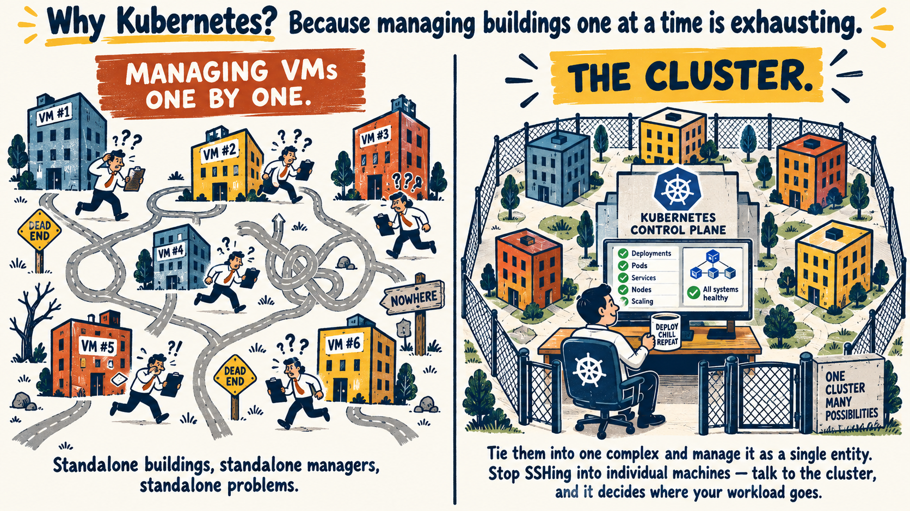

This guide combines the Kubernetes Apartment Complex zine entries with runnable demos. It is both a visual introduction and a technical reference: each entry explains the Kubernetes object or component, shows where it fits in the cluster architecture, calls out operational trade-offs, links to authoritative documentation, and ends with an observable command-line experiment.

## Technical description

Kubernetes is a declarative, API-driven control system. A user or automation client submits objects such as Deployments, Services, and PersistentVolumeClaims to the `kube-apiserver`. The API server authenticates and authorizes the request, applies admission and validation, and persists the accepted state in `etcd`. Controllers continuously compare that desired state with the state reported by Nodes and other resources. When they detect drift, they create, update, or remove objects until the system converges.

For a normal workload, the flow is:

1. A workload object declares the desired state, including the container image, replica count, resource requests, probes, labels, and policy references.
2. The scheduler filters and scores eligible Nodes using resources, taints and tolerations, affinity, topology, and other constraints, then binds each unscheduled Pod to a Node.
3. The kubelet on that Node asks the CRI runtime to create the Pod sandbox, pull images, start containers, mount volumes, and execute probes.
4. The CNI plugin supplies Pod networking, while Services and their EndpointSlices provide stable discovery and traffic routing. Ingress or Gateway controllers can add externally reachable HTTP routing.
5. Controllers, the kubelet, and status reporters publish observed state back through the API. A Deployment, for example, replaces failed replicas and coordinates a rollout; an HPA changes replica count when metrics indicate that demand has changed.

This separation is important: the control plane stores intent and makes decisions, while Nodes execute Pods. A Service is a stable network abstraction rather than a process, a PVC is a request for storage rather than a disk itself, and a PDB limits voluntary disruption rather than protecting against every failure. The “Technical perspective” paragraph in each entry expands these boundaries, failure modes, and production considerations; the demo then verifies the behavior in the cluster.

### Pod creation request flow

<iframe src="k8s-pod-flow-bytemonk.html" width="100%" height="760" style="border:none;"></iframe>

> [!TIP]
> If your Markdown viewer restricts embedded iframes or inline scripts, open [k8s-pod-flow-bytemonk.html](k8s-pod-flow-bytemonk.html) directly in any browser.

### Certified Kubernetes Administrator (CKA) Study Modules

The comprehensive companion guide in [`../CKA_Study_Notes/`](CKA_Study_Notes/README.md) contains deep-dive theory, CLI walk-throughs, and over 430 visual diagrams organized across 10 modules:

- **[01. Core Concepts](CKA_Study_Notes/01-core-concepts.md)**: Cluster architecture, etcd, API Server, Controller Manager, Scheduler, Kubelet, Kube-Proxy, Pods, ReplicaSets, Deployments, Services, Namespaces, Imperative Commands, and `kubectl apply`.
- **[02. Scheduling](CKA_Study_Notes/02-scheduling.md)**: Manual scheduling, Labels and Selectors, Taints and Tolerations, Node Affinity, Resource Requirements/Limits, DaemonSets, Static Pods, Multiple Schedulers, and scheduler tuning.
- **[03. Logging & Monitoring](CKA_Study_Notes/03-logging-and-monitoring.md)**: Metrics Server, cluster component monitoring (`top node`, `top pod`), and application logging with `kubectl logs`.
- **[04. Application Lifecycle Management](CKA_Study_Notes/04-application-lifecycle-management.md)**: Rolling updates, rollbacks, commands/args, ConfigMaps, Secrets, multi-container pods, native sidecars, and init containers.
- **[05. Cluster Maintenance](CKA_Study_Notes/05-cluster-maintenance.md)**: OS upgrades (`drain`, `cordon`, `uncordon`), Kubernetes version lifecycle, cluster upgrades with kubeadm, and etcd snapshot backup/restore.
- **[06. Security](CKA_Study_Notes/06-security.md)**: TLS bootstrapping, Certificates API, KubeConfig, API groups, RBAC (Roles, RoleBindings, ClusterRoles, ClusterRoleBindings), ServiceAccounts, SecurityContexts, and NetworkPolicies.
- **[07. Networking](CKA_Study_Notes/07-networking.md)**: Linux networking prerequisites (routing, iptables, netns, DNS), CNI plugins, Pod networking, Service networking (ClusterIP, NodePort), CoreDNS, and Ingress controllers.
- **[08. Storage](CKA_Study_Notes/08-storage.md)**: CSI architecture, PersistentVolumes (PV), PersistentVolumeClaims (PVC), StorageClasses, volume mounts, and dynamic provisioning.
- **[09. Design & Install a Kubernetes Cluster](CKA_Study_Notes/09-cluster-design-and-installation.md)**: Infrastructure planning, High Availability (HA) topology, stacked vs external etcd, and automated kubeadm deployment.
- **[10. Troubleshooting](CKA_Study_Notes/10-troubleshooting.md)**: Application failure diagnosis, service routing troubleshooting, control plane component diagnosis, worker node failure recovery, and network debugging.

### Technical coverage map & CKA Study Module Alignment

The topics build from cluster internals to application operations. Use this map to see the engineering concern and corresponding deep-dive study module in [`../CKA_Study_Notes/`](CKA_Study_Notes/README.md):

| # | Topic | Engineering focus | CKA Study Module |
| --- | --- | --- | --- |
| 1 | Cluster | Declarative management, scheduling, reconciliation, and platform trade-offs | [01. Core Concepts](CKA_Study_Notes/01-core-concepts.md) |
| 2 | Control Plane vs. Worker Nodes | Failure boundaries, high availability, and workload continuity | [01. Core Concepts](CKA_Study_Notes/01-core-concepts.md) · [09. Cluster Design](CKA_Study_Notes/09-cluster-design-and-installation.md) |
| 3 | kube-apiserver | Authentication, authorization, admission, validation, watches, and API consistency | [01. Core Concepts](CKA_Study_Notes/01-core-concepts.md) · [06. Security](CKA_Study_Notes/06-security.md) |
| 4 | etcd | Strong consistency, quorum, encryption, backup, restore, and control-plane dependency | [01. Core Concepts](CKA_Study_Notes/01-core-concepts.md) · [05. Cluster Maintenance](CKA_Study_Notes/05-cluster-maintenance.md) |
| 5 | kube-scheduler | Feasibility filtering, scoring, resource requests, placement constraints, and topology | [02. Scheduling](CKA_Study_Notes/02-scheduling.md) |
| 6 | kube-controller-manager | Reconciliation, ownership, idempotency, eventual convergence, and drift correction | [01. Core Concepts](CKA_Study_Notes/01-core-concepts.md) |
| 7 | cloud-controller-manager | Provider APIs, cloud identity, quotas, load balancers, routes, and volumes | [01. Core Concepts](CKA_Study_Notes/01-core-concepts.md) · [09. Cluster Design](CKA_Study_Notes/09-cluster-design-and-installation.md) |
| 8 | Static Pods | Node-local bootstrapping, manifest drift, and control-plane initialization | [01. Core Concepts](CKA_Study_Notes/01-core-concepts.md) · [02. Scheduling](CKA_Study_Notes/02-scheduling.md) |
| 9 | kube-proxy | Service datapath, virtual IPs, endpoint updates, and proxy implementation choices | [01. Core Concepts](CKA_Study_Notes/01-core-concepts.md) · [07. Networking](CKA_Study_Notes/07-networking.md) |
| 10 | Container Runtime & CRI | Runtime abstraction, image pulling, sandboxes, cgroups, logging, and isolation | [01. Core Concepts](CKA_Study_Notes/01-core-concepts.md) |
| 11 | Pods & Pause Container | Shared namespaces and volumes, container coupling, lifecycle, and localhost routing | [01. Core Concepts](CKA_Study_Notes/01-core-concepts.md) |
| 12 | Sidecar Containers | Shared namespaces and volumes, lifecycle coupling, telemetry, and resource overhead | [04. Application Lifecycle](CKA_Study_Notes/04-application-lifecycle-management.md) |
| 13 | Init Containers | Ordered initialization, retries, migrations, dependency checks, and startup latency | [04. Application Lifecycle](CKA_Study_Notes/04-application-lifecycle-management.md) |
| 14 | CNI | Pod interfaces, IP allocation, routing, encryption, and policy-capable dataplanes | [07. Networking](CKA_Study_Notes/07-networking.md) |
| 15 | CoreDNS | Service discovery, search paths, caching, forwarding, readiness, and DNS capacity | [07. Networking](CKA_Study_Notes/07-networking.md) |
| 16 | Services & ClusterIP | Stable virtual endpoints, selectors, exposure types, and client decoupling | [01. Core Concepts](CKA_Study_Notes/01-core-concepts.md) · [07. Networking](CKA_Study_Notes/07-networking.md) |
| 17 | NodePort & LoadBalancer | External port allocation, cloud provider integrations, and SNAT trade-offs | [07. Networking](CKA_Study_Notes/07-networking.md) |
| 18 | Ingress | Layer-7 routing, TLS termination, controller responsibility, and Gateway API direction | [07. Networking](CKA_Study_Notes/07-networking.md) |
| 19 | NetworkPolicy | Namespaced allow rules, ingress/egress isolation, CNI enforcement, and DNS dependencies | [06. Security](CKA_Study_Notes/06-security.md) · [07. Networking](CKA_Study_Notes/07-networking.md) |
| 20 | PersistentVolume | Storage lifecycle, reclaim policy, access modes, topology, and backup limits | [08. Storage](CKA_Study_Notes/08-storage.md) |
| 21 | PersistentVolumeClaim | Workload storage requests, binding constraints, provisioning, and Pending diagnosis | [08. Storage](CKA_Study_Notes/08-storage.md) |
| 22 | StorageClass | Dynamic provisioning, parameters, binding mode, performance, cost, and retention | [08. Storage](CKA_Study_Notes/08-storage.md) |
| 23 | ConfigMap | Decoupled configuration, environment variables, volume projections, and update propagation | [04. Application Lifecycle](CKA_Study_Notes/04-application-lifecycle-management.md) |
| 24 | Secret | Sensitive data handling, base64 encoding vs. KMS encryption at rest, and volume projections | [04. Application Lifecycle](CKA_Study_Notes/04-application-lifecycle-management.md) · [06. Security](CKA_Study_Notes/06-security.md) |
| 25 | Role & RoleBinding | Namespaced API permissions, verbs, resources, least privilege, and escalation risk | [06. Security](CKA_Study_Notes/06-security.md) |
| 26 | ClusterRole & ClusterRoleBinding | Reusable or cluster-scoped permissions, aggregation rules, and wide-impact review | [06. Security](CKA_Study_Notes/06-security.md) |
| 27 | ServiceAccount | Workload identity, projected tokens, RBAC binding, and credential hygiene | [06. Security](CKA_Study_Notes/06-security.md) |
| 28 | Node Controller & Eviction | Heartbeats, leases, failure detection, eviction timing, and redundancy | [05. Cluster Maintenance](CKA_Study_Notes/05-cluster-maintenance.md) |
| 29 | Namespace Controller | Resource scope, cleanup, finalizers, and deletion stuck in Terminating | [01. Core Concepts](CKA_Study_Notes/01-core-concepts.md) |
| 30 | ResourceQuota & LimitRange | Aggregate resource/object limits, admission behavior, and capacity governance | [02. Scheduling](CKA_Study_Notes/02-scheduling.md) |
| 31 | Garbage Collector | Owner references, cascading deletion, propagation policy, and orphan prevention | [01. Core Concepts](CKA_Study_Notes/01-core-concepts.md) |
| 32 | ReplicaSet | Replica-count reconciliation, label selection, and why Deployments are preferred | [01. Core Concepts](CKA_Study_Notes/01-core-concepts.md) |
| 33 | Deployment | Rolling updates, readiness, revision history, rollback, and state migration concerns | [01. Core Concepts](CKA_Study_Notes/01-core-concepts.md) · [04. Application Lifecycle](CKA_Study_Notes/04-application-lifecycle-management.md) |
| 34 | StatefulSet | Stable identity, ordered operations, storage association, quorum, and recovery semantics | [04. Application Lifecycle](CKA_Study_Notes/04-application-lifecycle-management.md) · [08. Storage](CKA_Study_Notes/08-storage.md) |
| 35 | DaemonSet | Per-node coverage, selectors, tolerations, agent resources, and node lifecycle | [02. Scheduling](CKA_Study_Notes/02-scheduling.md) |
| 36 | Job | Finite work, completion tracking, retries, parallelism, and cleanup policy | [04. Application Lifecycle](CKA_Study_Notes/04-application-lifecycle-management.md) |
| 37 | CronJob | Scheduling, missed runs, concurrency, deadlines, history, and idempotency | [04. Application Lifecycle](CKA_Study_Notes/04-application-lifecycle-management.md) |
| 38 | ReplicationController | Legacy replica management, selector limitations, and migration to Deployments | [01. Core Concepts](CKA_Study_Notes/01-core-concepts.md) |
| 39 | HorizontalPodAutoscaler | Metric-driven replica scaling, requests, startup behavior, and traffic distribution | [03. Logging & Monitoring](CKA_Study_Notes/03-logging-and-monitoring.md) |
| 40 | VerticalPodAutoscaler | Resource recommendations, evictions, update modes, and interaction with HPA | [03. Logging & Monitoring](CKA_Study_Notes/03-logging-and-monitoring.md) |
| 41 | Pod Disruption Budget | Voluntary eviction limits, maintenance progress, replica count, and capacity | [05. Cluster Maintenance](CKA_Study_Notes/05-cluster-maintenance.md) |

## Before you start

41 self-contained demos. Each has: SETUP, YAML (if any), STEPS, WHAT YOU SHOULD SEE, CLEANUP.

BEFORE YOU START
----------------------------------------------------------------
1. Use a disposable local cluster. Some demos delete Pods, stop a kubelet, or drain a node.
2. These demos use kind with Docker as the host provider. Linux uses Docker Engine;
   macOS uses Docker Desktop. Inside every kind node, kubelet talks to containerd
   through CRI. The runtime should show as containerd://...
3. From the repository root, create the recommended multi-node cluster:
     ./scripts/kind-up.sh
   This uses the checked-in kind-multinode.yaml (1 control-plane + 2 workers),
   maps Ingress to localhost:8080/8443, and waits for every node to become Ready.
   If the cluster already exists without these port mappings, recreate it before
   running demo 18.
4. Every demo uses its own namespace (zine-demo, or demo-ns / other-ns where stated)
   and cleans up after itself, so demos can be run in ANY order.
5. Save each YAML block to the file named above it, then run the commands.
6. Add-ons some demos need first:
     - 18 Ingress: ingress-nginx's kind provider manifest
     - 19 NetworkPolicy: a CNI that enforces policy (Calico or Cilium; kindnet does not)
     - 39 HPA: metrics-server
     - 40 VPA: the VPA add-on
     - 41 PDB and 28 Node controller: two or more worker nodes
7. Commands marked 'run on the node' enter a kind node through the host Docker provider:
     docker exec -it zine-control-plane bash
     docker exec -it zine-worker bash
   Kind node names for this cluster are zine-control-plane, zine-worker,
   and zine-worker2. Run crictl and host-network checks inside those containers,
   not on the macOS host.
8. Text after # on a command line is an explanation, not part of the command.

LIVE OBSERVATION
----------------------------------------------------------------
For a practical, realtime run, keep a second terminal open while executing a demo:
     kubectl get pods -A -o wide -w
     kubectl get events -A --sort-by=.lastTimestamp -w
     kubectl get nodes -w
Use Ctrl+C to stop a watch. The STEPS below favor wait/watch commands so
rollouts, scheduling, replacement Pods, endpoints, and autoscaling are visible
as they converge instead of being checked only after the fact.

Quick reference - demos that need something extra:
  add-on:      18, 19, 39, 40
  2+ workers:  28, 41 (and 2, 35 read best with them)
  on the node: 4, 8, 9, 10, 11, 28

## 1. The Cluster (Why Kubernetes?)

**Part 1 — Technical Discussion:** Kubernetes is an open-source, production-grade container orchestration system designed to automate the deployment, scaling, and operational lifecycle of containerized application workloads across distributed server clusters. Rather than managing physical or virtual servers as independent hosts requiring manual intervention, Kubernetes unifies compute, storage, and networking into a single declarative API plane.

### Core Architecture & Reconciliation Engine
- **Declarative State Model:** System state is declared as intent-driven objects (Pods, Deployments, Services). Operators never imperatively configure machines; instead, they declare the *target state*, and Kubernetes executes continuous reconciliation.
- **Continuous Control Loops:** Autonomous controllers repeatedly query actual cluster state against declared state in etcd. Any detected drift (e.g., node failure, process termination, network partition) triggers corrective reconciliation workflows.
- **Bin-Packing & Resource Efficiency:** The platform schedules containers dynamically based on declared resource requests and limits, maximizing host density while respecting compute, memory, and topology boundaries.
- **Three-Way Merge Apply:** Modern cluster management relies on `kubectl apply`, which computes a three-way diff between the local configuration manifest, the live cluster state, and the `kubectl.kubernetes.io/last-applied-configuration` annotation.

### Linux Kernel & OS Foundation
- **Namespaces (Isolation):** Linux namespaces (`pid`, `net`, `mnt`, `ipc`, `uts`, `user`) partition kernel resources so containers operate in isolated process spaces on shared Linux kernels.
- **Control Groups (cgroups v1/v2):** Kernel cgroups enforce granular compute constraints (CFS CPU bandwidth quota in `cpu.cfs_quota_us`, hard memory limits in `memory.max`, and block I/O priorities).
- **Systemd & Container Daemons:** Nodes execute as Linux systems managed by systemd, with system daemons (`kubelet`, `containerd`) running as prioritized system units.

```yaml
# cluster-workload-foundation.yaml
# WHY THIS YAML: Demonstrates the cluster's declarative model in action.
# 'replicas: 3' is the desired state the Controller Manager reconciles against.
#   If a pod dies, it creates a replacement — no human intervention needed.
# 'resources.requests' is what the Scheduler reads to decide which Node fits.
# 'resources.limits' is enforced at runtime by kernel cgroups on the Worker Node.
# The cluster unifies scheduling, execution, and healing into one declarative API.
apiVersion: apps/v1
kind: Deployment
metadata:
  name: core-app
  namespace: default
  labels:
    tier: application
spec:
  replicas: 3
  selector:
    matchLabels:
      app: core-app
  template:
    metadata:
      labels:
        app: core-app
    spec:
      containers:
      - name: web
        image: registry.k8s.io/pause:3.9
        resources:
          requests:
            cpu: 100m
            memory: 128Mi
          limits:
            cpu: 500m
            memory: 512Mi
```

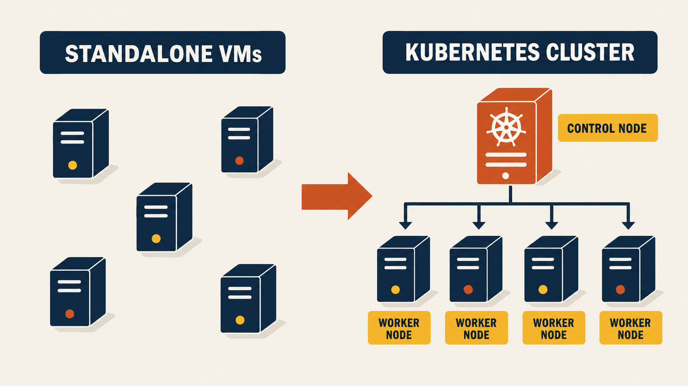

**Technical perspective:** From an engineering and SRE perspective, Kubernetes shifts complexity from individual host administration to cluster lifecycle governance. While individual nodes become disposable cattle that can be replaced or upgraded without application downtime, the cluster itself introduces distributed systems operational overhead:
- **Blast Radius Boundaries:** A misconfigured admission webhook or global NetworkPolicy can disrupt cluster-wide workloads in seconds.
- **Kernel & Driver Compatibility:** Worker nodes depend on consistent Linux kernel configurations (`sysctl` network forwarding, overlayfs modules, and container runtime socket stability).
- **Control Plane Sizing:** As cluster object count grows, etcd memory footprint and kube-apiserver serialization latency scale non-linearly, requiring strict resource quotas and API rate limiting.

### Component architecture flow

<iframe src="diagrams/topic-01.html" width="100%" height="560" style="border:none;"></iframe>

> [!TIP]
> View the interactive animated diagram in [diagrams/topic-01.html](diagrams/topic-01.html).

**Part 2 — Analogy / Zine:** Managing standalone buildings is exhausting; tying them into one complex lets you manage them as a single entity.


**Zine explanation:** The zine image shows isolated standalone buildings transforming into a unified apartment complex — and this is precisely how Kubernetes changes workload management. Just as managing separate buildings means separate keys, separate managers, and separate problems, running containers on individual VMs requires SSH access, manual restarts, and per-host configuration. The cluster metaphor captures Kubernetes' core value: you stop talking to individual machines and instead declare intent to the API server, which distributes and reconciles workloads across all nodes. The "single entity" in the image directly maps to the kube-apiserver acting as the sole gateway — one front desk for the entire complex.

* **Zine Text & Layout:**
* (Top): "Why Kubernetes? Because managing buildings one at a time is exhausting."
* (Under Left): "Standalone buildings, standalone managers, standalone problems."
* (Under Right): "Tie them into one complex and manage it as a single entity. Stop SSHing into individual machines — talk to the cluster, and it decides where your workload goes."

**Further reading**

- [Kubernetes concepts](https://kubernetes.io/docs/concepts/)
- [CKA Study Notes: Core Concepts](../CKA_Study_Notes/01-core-concepts.md)

### Demo — The Cluster (Why Kubernetes?)

<div style="background:#000;color:#fff;border-radius:8px;padding:1rem;overflow:auto;box-shadow:0 2px 8px rgba(0,0,0,.25);"><pre style="background:transparent;color:#fff;margin:0;white-space:pre-wrap;">
SETUP
  (none: uses what is already in the cluster)

STEPS
  1. kubectl cluster-info
  2. kubectl get nodes -o wide
  3. kubectl get pods -A -o wide --field-selector status.phase=Running | head -20
  4. kubectl get namespaces

WHAT YOU SHOULD SEE
  cluster-info prints the control-plane and CoreDNS API URLs — the single
  management endpoint for the entire cluster.
  get nodes shows every node with ROLES (control-plane vs <none>), STATUS,
  INTERNAL-IP, and which container runtime version is running.
  get pods -A shows all running workloads across all namespaces — the
  cluster's unified view of every running container.
  This is the 'one complex' — one command, all nodes, all pods.

CLEANUP
  (nothing to clean up)

NOTE
  Compare this to the alternative: SSH into each machine and run
  'docker ps' manually. That is the pre-Kubernetes world.
</pre></div>


### Knowledge Check — Quiz

**Q1: When a worker node running a Pod loses network connectivity to the control plane, what happens to the containers running on that node immediately?**

- [ ] A) The local container runtime immediately terminates all running containers.
- [ ] B) The containers continue running locally, but the control plane cannot observe or update their status.
- [ ] C) The API server sends an SSH command to reboot the worker machine.
- [ ] D) etcd immediately purges the Pod object from cluster state.

<details>
<summary>Reveal Answer &amp; Explanation</summary>

**Correct Answer:** B) The containers continue running locally, but the control plane cannot observe or update their status.

**Explanation:** The kubelet and local container runtime continue executing workloads based on local state even during control plane disconnection, though the control plane will mark the node NotReady after the lease timeout.

</details>

**Q2: Which core architectural principle fundamentally distinguishes Kubernetes from traditional imperative VM deployment scripts?**

- [ ] A) Synchronous execution of linear shell scripts on remote hosts.
- [ ] B) Declarative desired state reconciliation via continuous control loops.
- [ ] C) Direct peer-to-peer communication between etcd and container runtimes.
- [ ] D) Requiring physical operator access to machines for all changes.

<details>
<summary>Reveal Answer &amp; Explanation</summary>

**Correct Answer:** B) Declarative desired state reconciliation via continuous control loops.

**Explanation:** Kubernetes operates on declarative intent: you define the desired state in the API server, and independent controllers continuously reconcile actual state to match it.

</details>

**Q3: Which Linux kernel feature is responsible for isolating container process trees, network interfaces, and mount tables, as opposed to limiting compute consumption?**

- [ ] A) Control Groups (cgroups)
- [ ] B) Linux Namespaces (pid, net, mnt, ipc, uts, user)
- [ ] C) Seccomp system call profiles
- [ ] D) eBPF packet filters

<details>
<summary>Reveal Answer &amp; Explanation</summary>

**Correct Answer:** B) Linux Namespaces (pid, net, mnt, ipc, uts, user)

**Explanation:** Linux namespaces partition kernel resources so containers operate in isolated process spaces on shared Linux kernels, whereas cgroups enforce resource bandwidth constraints (CPU/RAM limits).

</details>

**Q4: When managing resources using `kubectl apply`, how does Kubernetes calculate which fields to update, delete, or retain?**

- [ ] A) It performs a direct overwrite of all fields from the local file without reading the live object.
- [ ] B) It computes a three-way diff between the local configuration manifest, the live cluster state, and the `kubectl.kubernetes.io/last-applied-configuration` annotation.
- [ ] C) It sends an SSH payload to all worker nodes to rewrite local systemd unit files.
- [ ] D) It hashes the manifest and rejects the update if any live field has diverged.

<details>
<summary>Reveal Answer &amp; Explanation</summary>

**Correct Answer:** B) It computes a three-way diff between the local configuration manifest, the live cluster state, and the `kubectl.kubernetes.io/last-applied-configuration` annotation.

**Explanation:** Three-way merge apply compares the local file, the live API object in etcd, and the recorded last-applied annotation to merge changes without wiping out fields managed by other controllers (e.g., status or autoscalers).

</details>

**Q5: Which Linux kernel sysctl parameter is strictly required on worker nodes to allow packet forwarding between Pod network interfaces and physical network interfaces?**

- [ ] A) net.ipv4.ip_forward = 1
- [ ] B) kernel.pid_max = 1000
- [ ] C) vm.swappiness = 100
- [ ] D) fs.file-max = 65536

<details>
<summary>Reveal Answer &amp; Explanation</summary>

**Correct Answer:** A) net.ipv4.ip_forward = 1

**Explanation:** Linux kernel packet routing requires `net.ipv4.ip_forward = 1` so the host kernel forwards transit packets between virtual ethernet (veth) pairs and the host physical network adapter.

</details>

**Q6: From an operational reliability perspective, why can a misconfigured Validating Admission Webhook with `failurePolicy: Fail` cause a cluster-wide outage?**

- [ ] A) It permanently corrupts the Raft database file on disk.
- [ ] B) If the webhook endpoint becomes unreachable, the API server rejects all matching resource requests (such as Pod creation and lease renewals) cluster-wide.
- [ ] C) It forces the kubelet to restart every running container on worker nodes.
- [ ] D) It revokes all worker node TLS bootstrap certificates.

<details>
<summary>Reveal Answer &amp; Explanation</summary>

**Correct Answer:** B) If the webhook endpoint becomes unreachable, the API server rejects all matching resource requests (such as Pod creation and lease renewals) cluster-wide.

**Explanation:** When `failurePolicy: Fail` is configured, if the webhook service crashes or network connectivity is lost, the API server must fail-closed and reject all matching admission requests, potentially freezing cluster deployments and controller operations.

</details>

## 2. Control Plane vs. Worker Nodes

**Part 1 — Technical Discussion:** A Kubernetes cluster is strictly divided into two functional tiers: the **Control Plane** (the cluster brain responsible for state, decisions, and API orchestration) and **Worker Nodes** (the execution engines that run containerized workloads).

### Control Plane Anatomy & Topologies
- **Stacked Control Plane Topology:** Control plane components (`kube-apiserver`, `kube-controller-manager`, `kube-scheduler`) co-locate with etcd instances on dedicated control plane nodes. Recommended minimum: 3 nodes for quorum.
- **External etcd Topology:** etcd runs on dedicated external servers separated from API servers, isolating storage I/O from API compute workloads.
- **Node Heartbeats via NodeLeases:** In modern Kubernetes, worker nodes report heartbeats through lightweight `Lease` objects in the `kube-node-lease` namespace every 10 seconds, drastically reducing `kube-apiserver` etcd write load compared to full Node status updates.

### Linux OS Node Requirements
- **Kernel Forwarding & Netfilter:** Nodes require `net.ipv4.ip_forward = 1` and `net.bridge.bridge-nf-call-iptables = 1` in `/etc/sysctl.d/k8s.conf` to allow bridge traffic traversal through iptables rules.
- **Swap Disabled:** The Linux kernel swap mechanism must be disabled (`swapoff -a`) so the kubelet and kernel OOM killer have deterministic memory accounting without page thrashing.
- **System Slices:** Worker nodes partition resources using systemd slices (`system.slice`, `kubelet.slice`, `runtime.slice`, and `kubepods.slice`).

```yaml
# node-affinity-spec.yaml
# WHY THIS YAML: Enforces the Control Plane / Worker Node separation boundary.
# 'DoesNotExist' for 'node-role.kubernetes.io/control-plane' tells the Scheduler:
#   never place this workload on a control plane node during the Filtering phase.
# This is how you prevent application Pods from competing with etcd, kube-apiserver,
#   or kube-scheduler for CPU/RAM on control plane nodes.
# Worker Nodes are the execution layer — this affinity rule enforces that boundary.
apiVersion: v1
kind: Pod
metadata:
  name: compute-workload
spec:
  affinity:
    nodeAffinity:
      requiredDuringSchedulingIgnoredDuringExecution:
        nodeSelectorTerms:
        - matchExpressions:
          - key: node-role.kubernetes.io/control-plane
            operator: DoesNotExist
  containers:
  - name: worker
    image: registry.k8s.io/pause:3.9
```

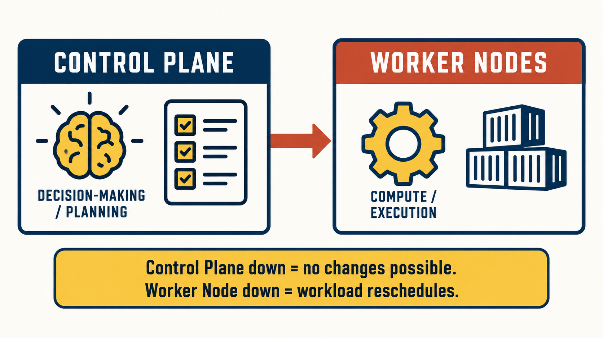

**Technical perspective:** The primary operational boundary in cluster design is preventing control plane starvation from noisy worker node tenants:
- **Control Plane Taints:** Control plane nodes are tainted with `node-role.kubernetes.io/control-plane:NoSchedule` by default so business workloads never consume control plane CPU or memory.
- **Split-Brain Scenarios:** If network partitions sever worker nodes from the control plane, local workloads continue running under kubelet supervision, but after the controller-manager `node-monitor-grace-period` (default 40s), the node is marked `NotReady`, and pod eviction scheduling begins after `pod-eviction-timeout` (default 5m).

### Component architecture flow

<iframe src="diagrams/topic-02.html" width="100%" height="560" style="border:none;"></iframe>

> [!TIP]
> View the interactive animated diagram in [diagrams/topic-02.html](diagrams/topic-02.html).

**Part 2 — Analogy / Zine:** The office thinks (Leasing Office); the buildings do the actual physical work (Worker Nodes).

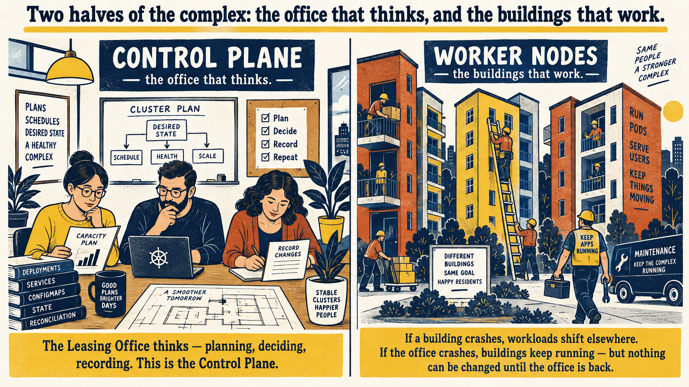

**Zine explanation:** The two-panel split in the image maps exactly to Kubernetes' architectural separation of concerns. The Leasing Office (left) represents the Control Plane — it holds records, makes decisions, and issues instructions, but never physically lifts anything. The Buildings (right) represent Worker Nodes — they do the actual execution, running containers on hardware. The critical Kubernetes insight the image encodes is failure isolation: if a building collapses, the office dispatches the workload elsewhere; if the office goes dark, buildings keep existing tenants running (containers continue) but no new work can be assigned. This separation is why etcd, kube-apiserver, and kube-scheduler must never be co-located with application workloads.

* **Zine Text & Layout:**
* (Top): "Two halves of the complex: the office that thinks, and the buildings that work."
* (Under Left): "The Leasing Office thinks — planning, deciding, recording. This is the Control Plane."
* (Under Right): "If a building crashes, workloads shift elsewhere. If the office crashes, buildings keep running — but nothing can be changed until the office is back."

**Further reading**

- [Cluster architecture](https://kubernetes.io/docs/concepts/architecture/)
- [CKA Study Notes: Core Concepts](../CKA_Study_Notes/01-core-concepts.md) & [Cluster Design](../CKA_Study_Notes/09-cluster-design-and-installation.md)

### Demo — Control Plane vs. Worker Nodes

<div style="background:#000;color:#fff;border-radius:8px;padding:1rem;overflow:auto;box-shadow:0 2px 8px rgba(0,0,0,.25);"><pre style="background:transparent;color:#fff;margin:0;white-space:pre-wrap;">
SETUP
  (none: uses what is already in the cluster)

STEPS
  1. kubectl get nodes --show-labels | grep -E 'control-plane|NAME'
  2. kubectl get pods -n kube-system -o wide
  3. kubectl describe node zine-control-plane | grep -E 'Taints|Roles|Conditions' | head -10
  4. kubectl get lease -n kube-node-lease

WHAT YOU SHOULD SEE
  Step 1: control-plane node is labelled node-role.kubernetes.io/control-plane.
  Step 2: kube-system shows api-server, etcd, scheduler, controller-manager Pods
    all running on the control-plane node — not on worker nodes.
  Step 3: the control-plane node shows Taint: node-role.kubernetes.io/control-plane:NoSchedule
    — this is what prevents application Pods from landing on it.
  Step 4: each node has a Lease object it renews every 10 seconds — the lightweight
    heartbeat mechanism replacing heavy Node status updates in modern Kubernetes.

CLEANUP
  (nothing to clean up)

NOTE
  The Taint/NoSchedule confirms the two-region split: control plane components
  run on dedicated nodes, application workloads run on worker nodes.
</pre></div>


### Knowledge Check — Quiz

**Q1: If all control plane nodes become temporarily unreachable in a cluster, what is the immediate effect on already-running workloads on healthy worker nodes?**

- [ ] A) All pods are immediately terminated by their local kubelets.
- [ ] B) Worker nodes stop routing network traffic between running pods.
- [ ] C) Existing pods and data plane networking continue running, but no new pods can be scheduled or state updated.
- [ ] D) The cluster automatically falls back to single-node Docker engines.

<details>
<summary>Reveal Answer &amp; Explanation</summary>

**Correct Answer:** C) Existing pods and data plane networking continue running, but no new pods can be scheduled or state updated.

**Explanation:** Data plane execution is decoupled from the control plane; existing pods and network routes remain functional, but scheduling, scaling, and API changes are blocked.

</details>

**Q2: What is the primary role of worker nodes relative to the control plane?**

- [ ] A) Managing etcd quorum and evaluating RBAC authorization.
- [ ] B) Executing pod sandboxes, container processes, and local network/storage enforcement via kubelet and runtime.
- [ ] C) Authorizing TLS certificates for external client requests.
- [ ] D) Directly editing cluster manifests inside etcd storage.

<details>
<summary>Reveal Answer &amp; Explanation</summary>

**Correct Answer:** B) Executing pod sandboxes, container processes, and local network/storage enforcement via kubelet and runtime.

**Explanation:** Worker nodes represent the execution layer ('muscle') managed by kubelet, containerd, and kube-proxy, while the control plane ('brain') makes decisions and stores intent.

</details>

**Q3: What is the primary operational trade-off of a 'Stacked etcd' control plane topology compared to an 'External etcd' topology?**

- [ ] A) Stacked topology requires more physical machines than external topology.
- [ ] B) Stacked topology co-locates etcd with API servers on the same nodes, reducing machine count but increasing risk of resource contention between API server compute and etcd disk I/O.
- [ ] C) Stacked topology does not support High Availability failover.
- [ ] D) Stacked topology cannot run containerized workloads.

<details>
<summary>Reveal Answer &amp; Explanation</summary>

**Correct Answer:** B) Stacked topology co-locates etcd with API servers on the same nodes, reducing machine count but increasing risk of resource contention between API server compute and etcd disk I/O.

**Explanation:** In a stacked topology, etcd members run on the control plane nodes alongside kube-apiserver and controllers. This uses fewer machines but creates shared CPU, RAM, and disk I/O contention between API processing and etcd consensus.

</details>

**Q4: How do worker nodes report health and liveliness to the control plane in modern Kubernetes to avoid heavy etcd write loads?**

- [ ] A) By opening an SSH tunnel directly into the active etcd leader every 5 seconds.
- [ ] B) By updating a lightweight `Lease` object in the `kube-node-lease` namespace at regular intervals (default every 10s).
- [ ] C) By writing full Node status specifications into etcd every second.
- [ ] D) By broadcasting ICMP ping packets across all master node physical interfaces.

<details>
<summary>Reveal Answer &amp; Explanation</summary>

**Correct Answer:** B) By updating a lightweight `Lease` object in the `kube-node-lease` namespace at regular intervals (default every 10s).

**Explanation:** The NodeLease feature replaces heavy Node status heartbeats with lightweight micro-updates to `Lease` objects in `kube-node-lease`, drastically reducing etcd write amplification in large clusters.

</details>

**Q5: What is the standard mechanism used to prevent general application Pods from being scheduled onto control plane nodes?**

- [ ] A) A hardcoded kernel firewall rule blocking TCP traffic to control plane host IPs.
- [ ] B) A node taint such as `node-role.kubernetes.io/control-plane:NoSchedule`, which normal Pods do not tolerate.
- [ ] C) Completely disabling the kubelet service on control plane hosts.
- [ ] D) Creating a ResourceQuota with `pods: 0` in every user namespace.

<details>
<summary>Reveal Answer &amp; Explanation</summary>

**Correct Answer:** B) A node taint such as `node-role.kubernetes.io/control-plane:NoSchedule`, which normal Pods do not tolerate.

**Explanation:** Control plane nodes are marked with taints (traditionally `node-role.kubernetes.io/control-plane:NoSchedule` or `node-role.kubernetes.io/master:NoSchedule`). Only platform pods with matching tolerations can run there.

</details>

**Q6: What is the key difference between running `kubectl cordon <node>` and `kubectl drain <node>`?**

- [ ] A) Cordon deletes the node object from the cluster; drain reboots the operating system.
- [ ] B) Cordon only marks the node unschedulable for new Pods; drain marks it unschedulable AND evicts existing running Pods.
- [ ] C) Cordon kills all containers immediately with SIGKILL; drain gives a 30-minute grace period.
- [ ] D) Cordon applies only to worker nodes; drain applies only to control plane nodes.

<details>
<summary>Reveal Answer &amp; Explanation</summary>

**Correct Answer:** B) Cordon only marks the node unschedulable for new Pods; drain marks it unschedulable AND evicts existing running Pods.

**Explanation:** `kubectl cordon` sets `spec.unschedulable: true` so no new pods are placed on the node. `kubectl drain` cordons the node and then calls the Eviction API to gracefully evict existing pods.

</details>

## 3. kube-apiserver

**Part 1 — Technical Discussion:** The `kube-apiserver` is the central gateway, management bridge, and only component in the cluster that directly interfaces with the `etcd` datastore. All other control plane components, worker node daemons, and user CLI tools communicate exclusively via the API server over secure HTTPS (port 6443).

### Request Processing Lifecycle Pipeline
1. **Authentication (AuthN):** Validates the caller's identity via X.509 Client Certificates (`/etc/kubernetes/pki`), OpenID Connect (OIDC) JWT tokens, or ServiceAccount bearer tokens.
2. **Authorization (AuthZ):** Evaluates permissions against access control modules. Configured via `--authorization-mode=Node,RBAC` to enforce least-privilege role policies and node self-isolation.
3. **Mutating Admission Controllers:** Intercepts requests to inject default values, sidecars, or storage policies (e.g., `DefaultStorageClass`, `MutatingAdmissionWebhook`).
4. **Schema Validation:** Verifies structural schema conformity against openAPI specifications.
5. **Validating Admission Controllers:** Evaluates compliance rules and security postures (e.g., `PodSecurity`, `ResourceQuota`, `ValidatingAdmissionWebhook`). Rejections immediately return HTTP 400/403.
6. **Persistence:** Serializes the validated object and commits it directly to `etcd`.

### Linux System & Network Concepts
- **mTLS Mutual Authentication:** Every connection requires bidirectional cryptographic verification using certificates signed by the cluster Certificate Authority (`ca.crt`).
- **HTTP/2 Streaming & Watch API:** Uses HTTP/2 persistent streaming multiplexing to support `watch` calls, pushing asynchronous state change notifications instantly to subscribed controllers without polling.

```yaml
# /etc/kubernetes/manifests/kube-apiserver.yaml -- Static Pod excerpt
# WHY THIS YAML: kube-apiserver itself runs as a Static Pod — its own manifest.
# '--secure-port=6443': the single front door; ALL kubectl, controller, and kubelet
#   traffic hits this port. No component bypasses it.
# '--etcd-servers': proves kube-apiserver is the ONLY component that talks to etcd.
# '--authorization-mode=Node,RBAC': every request traverses this AuthZ chain.
# '--enable-admission-plugins': defines what mutation/validation runs before etcd write.
apiVersion: v1
kind: Pod
metadata:
  name: kube-apiserver
  namespace: kube-system
spec:
  containers:
  - name: kube-apiserver
    image: registry.k8s.io/kube-apiserver:v1.28.0
    command:
    - kube-apiserver
    - --advertise-address=192.168.1.10
    - --secure-port=6443
    - --etcd-servers=https://127.0.0.1:2379
    - --etcd-cafile=/etc/kubernetes/pki/etcd/ca.crt
    - --etcd-certfile=/etc/kubernetes/pki/apiserver-etcd-client.crt
    - --etcd-keyfile=/etc/kubernetes/pki/apiserver-etcd-client.key
    - --authorization-mode=Node,RBAC
    - --enable-admission-plugins=NodeRestriction,LimitRanger,ResourceQuota
```

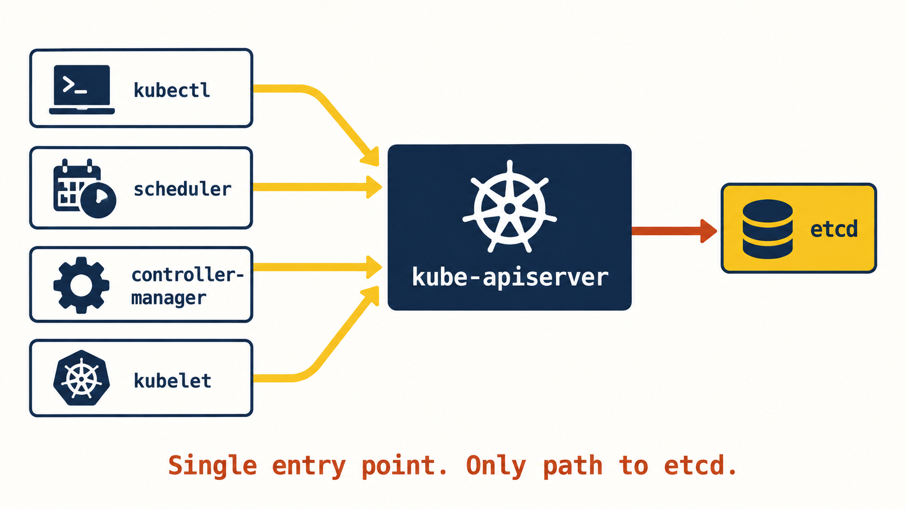

**Technical perspective:** The API server is stateless and horizontally scalable behind a TCP Layer-4 Load Balancer (HAProxy, Envoy, or AWS NLB). 
- **Production Vulnerabilities:** Unbounded watch queries (`kubectl get pods -A --watch`) from high numbers of controllers or CI/CD pipelines can exhaust API server memory.
- **Priority and Fairness (APF):** Modern clusters employ API Priority and Fairness to classify traffic into distinct priority queues (`workload-high`, `workload-low`, `system`), guaranteeing administrative access even during DDoS surges.

### Component architecture flow

<iframe src="diagrams/topic-03.html" width="100%" height="560" style="border:none;"></iframe>

> [!TIP]
> View the interactive animated diagram in [diagrams/topic-03.html](diagrams/topic-03.html).

**Part 2 — Analogy / Zine:** Every request must go through this one desk; nobody bypasses it.

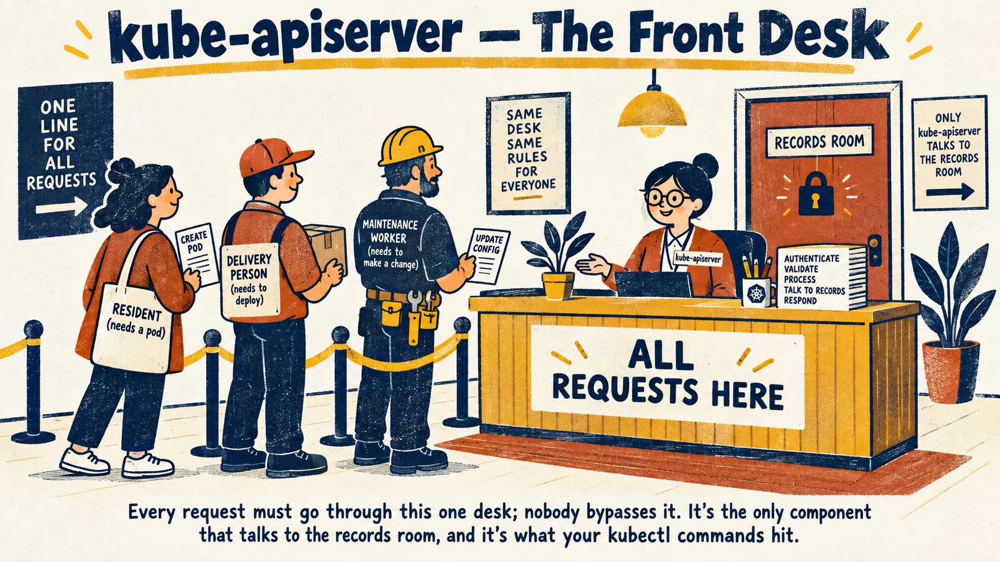

**Zine explanation:** The Front Desk metaphor in the image captures kube-apiserver's defining property: it is the only entry point and the sole component that speaks directly to etcd. Just as every request at a hotel front desk gets logged, authenticated (ID check), and either approved or rejected before anything happens, every kubectl command, controller watch, and kubelet status update goes through the API server's pipeline: AuthN → AuthZ → Mutation → Validation → etcd write → Watch notification. The "nobody bypasses it" caption reflects the security architecture — even internal components like the scheduler and controllers cannot write to etcd directly; they must go through the API server's admission pipeline.

* **Zine Text & Layout:**
* (Top): "kube-apiserver — The Front Desk"
* (Caption): "Every request must go through this one desk; nobody bypasses it. It's the only component that talks to the records room, and it's what your kubectl commands hit."

**Further reading**

- [API server reference](https://kubernetes.io/docs/reference/command-line-tools-reference/kube-apiserver/)
- [Kubernetes API concepts](https://kubernetes.io/docs/concepts/overview/kubernetes-api/)
- [CKA Study Notes: Core Concepts (API Server)](../CKA_Study_Notes/01-core-concepts.md) & [Security](../CKA_Study_Notes/06-security.md)

### Demo — kube-apiserver

<div style="background:#000;color:#fff;border-radius:8px;padding:1rem;overflow:auto;box-shadow:0 2px 8px rgba(0,0,0,.25);"><pre style="background:transparent;color:#fff;margin:0;white-space:pre-wrap;">
SETUP
  (none: uses what is already in the cluster)

STEPS
  1. kubectl get --raw /api/v1 | head -c 300
  2. kubectl proxy --port=8080 &
  3. sleep 2
  4. curl -s http://localhost:8080/api/v1/namespaces | head -c 300

WHAT YOU SHOULD SEE
  Both calls return raw JSON from the API server. kubectl is just an HTTP client.

CLEANUP
  kill %1   # stop the background kubectl proxy

NOTE
  Bypass kubectl and hit the 'front desk' directly with curl.
</pre></div>


### Knowledge Check — Quiz

**Q1: Which of the following is true regarding how cluster components communicate with etcd in standard Kubernetes?**

- [ ] A) Both the scheduler and kubelet write directly to etcd over gRPC.
- [ ] B) Only the kube-apiserver communicates directly with etcd; all other components interact via the API server.
- [ ] C) etcd pushes event notifications directly to worker node kube-proxies.
- [ ] D) Admission webhooks persist rejected objects directly in etcd for audit logs.

<details>
<summary>Reveal Answer &amp; Explanation</summary>

**Correct Answer:** B) Only the kube-apiserver communicates directly with etcd; all other components interact via the API server.

**Explanation:** kube-apiserver is the sole gateway and concurrency boundary for etcd, ensuring all reads and writes pass through authentication, authorization, and validation.

</details>

**Q2: In what order does the kube-apiserver process an incoming resource creation request?**

- [ ] A) Mutating Admission -> Authentication -> Validation -> etcd
- [ ] B) Authentication -> Authorization -> Mutating Admission -> Schema/Validating Admission -> etcd
- [ ] C) Authorization -> Schema Validation -> Authentication -> etcd
- [ ] D) etcd Write -> Mutating Admission -> Authorization

<details>
<summary>Reveal Answer &amp; Explanation</summary>

**Correct Answer:** B) Authentication -> Authorization -> Mutating Admission -> Schema/Validating Admission -> etcd

**Explanation:** A request must first be authenticated (who are you?), then authorized (can you do this?), then mutated (defaults/sidecars injected), then validated (schema & policy rules), before being committed to etcd.

</details>

**Q3: Why is the kube-apiserver described as completely stateless?**

- [ ] A) It loses all authentication tokens whenever an administrator logs out of the terminal.
- [ ] B) It does not persist any cluster state in its own memory or local disk; all durable state is stored in etcd.
- [ ] C) It runs as a serverless function that shuts down after every HTTP request.
- [ ] D) It communicates exclusively via UDP packets.

<details>
<summary>Reveal Answer &amp; Explanation</summary>

**Correct Answer:** B) It does not persist any cluster state in its own memory or local disk; all durable state is stored in etcd.

**Explanation:** kube-apiserver stores no state locally on disk or memory; it reads and writes all persistent object state directly to etcd. Because it is stateless, multiple API server instances can run active-active behind a load balancer.

</details>

**Q4: What role does API Priority and Fairness (APF) play in kube-apiserver protection?**

- [ ] A) It automatically encrypts Secret objects using external cloud KMS keys.
- [ ] B) It classifies incoming requests into priority levels and flow schemas to prevent rogue or misconfigured clients from overwhelming the API server.
- [ ] C) It balances network bandwidth equally between worker node ethernet interfaces.
- [ ] D) It automatically scales the number of replica pods when CPU usage exceeds 80%.

<details>
<summary>Reveal Answer &amp; Explanation</summary>

**Correct Answer:** B) It classifies incoming requests into priority levels and flow schemas to prevent rogue or misconfigured clients from overwhelming the API server.

**Explanation:** APF inspects incoming requests, assigns them to flow schemas and priority queues (e.g., exempt, system, leader-election, workload-high), and drops or throttles low-priority traffic during traffic spikes to protect critical control plane operations.

</details>

**Q5: In the Kubernetes API schema hierarchy, what does GVR stand for?**

- [ ] A) Gateway, VirtualService, Route
- [ ] B) Group, Version, Resource
- [ ] C) Global, Variable, Replica
- [ ] D) Governance, Validation, Reconciliation

<details>
<summary>Reveal Answer &amp; Explanation</summary>

**Correct Answer:** B) Group, Version, Resource

**Explanation:** GVR stands for Group, Version, Resource (e.g., Group: `apps`, Version: `v1`, Resource: `deployments`). It defines the exact REST URL path exposed by the API server.

</details>

**Q6: What is the purpose of Mutating Admission Webhooks versus Validating Admission Webhooks?**

- [ ] A) Mutating webhooks can modify the incoming object spec (inject sidecars, defaults); Validating webhooks can only accept or reject the object.
- [ ] B) Mutating webhooks check user RBAC permissions; Validating webhooks write to etcd.
- [ ] C) Mutating webhooks run after the object is committed to etcd; Validating webhooks run before.
- [ ] D) Mutating webhooks apply only to Nodes; Validating webhooks apply only to Pods.

<details>
<summary>Reveal Answer &amp; Explanation</summary>

**Correct Answer:** A) Mutating webhooks can modify the incoming object spec (inject sidecars, defaults); Validating webhooks can only accept or reject the object.

**Explanation:** Mutating admission webhooks run first and can alter the submitted object (e.g., injecting proxy sidecars or security contexts). Validating webhooks run afterward and only return an accept/reject verdict.

</details>

## 4. etcd

**Part 1 — Technical Discussion:** `etcd` is a strongly consistent, distributed, transactional key-value store that implements the **Raft Consensus Algorithm**. It acts as the single source of truth for all Kubernetes state, storing object specifications, status, metadata, and leases under hierarchical keys (e.g., `/registry/pods/default/nginx`).

### Raft Consensus & Quorum Mechanics
- **Leader Election & Heartbeats:** In a cluster of $N$ nodes, a majority quorum of $Q = \lfloor N/2 \rfloor + 1$ members is strictly required to commit any read/write transaction.
- **Cluster Sizing & Tolerances:**
  - 3 nodes: Quorum is 2 (tolerates 1 node failure).
  - 5 nodes: Quorum is 3 (tolerates 2 node failures).
  - Even numbers of nodes (e.g., 4 or 6) provide no extra failure tolerance and increase communication overhead.
- **MVCC (Multi-Version Concurrency Control):** etcd maintains historical revisions of keys. Compaction processes prune historical tombstones to prevent database bloat, followed by defragmentation to reclaim disk space.

### Linux Storage & Performance Realities
- **Fsync Latency Requirement:** etcd commits every transaction to disk using synchronous writes (`fdatasync`). Sequential write latency must remain below **10ms** (ideally < 2ms) to prevent Raft leader election timeouts and cluster instability. High-IOPS NVMe/SSD storage is non-negotiable.
- **BoltDB Engine:** Uses a B+ tree memory-mapped file backend (`bbolt`), benefiting directly from Linux kernel page cache performance.

```yaml
# etcd-backup-cronjob.yaml
# WHY THIS YAML: etcd is the single source of truth for ALL cluster state.
# This CronJob automates the critical disaster recovery operation: etcdctl snapshot save.
# 'schedule: "0 */4 * * *"': every 4 hours — data written since the last snapshot
#   is unrecoverable if etcd loses quorum and all members fail simultaneously.
# '--endpoints=https://127.0.0.1:2379': etcd is only reachable locally (by design).
# '--cacert/--cert/--key': etcd requires mTLS — the cluster CA chain in action.
apiVersion: batch/v1
kind: CronJob
metadata:
  name: etcd-snapshot-backup
  namespace: kube-system
spec:
  schedule: "0 */4 * * *"
  jobTemplate:
    spec:
      template:
        spec:
          containers:
          - name: etcd-backup
            image: registry.k8s.io/etcd:3.5.9-0
            env:
            - name: ETCDCTL_API
              value: "3"
            command:
            - /bin/sh
            - -c
            - etcdctl --endpoints=https://127.0.0.1:2379 --cacert=/etc/kubernetes/pki/etcd/ca.crt --cert=/etc/kubernetes/pki/etcd/server.crt --key=/etc/kubernetes/pki/etcd/server.key snapshot save /backup/etcd-snapshot-$(date +%s).db
```

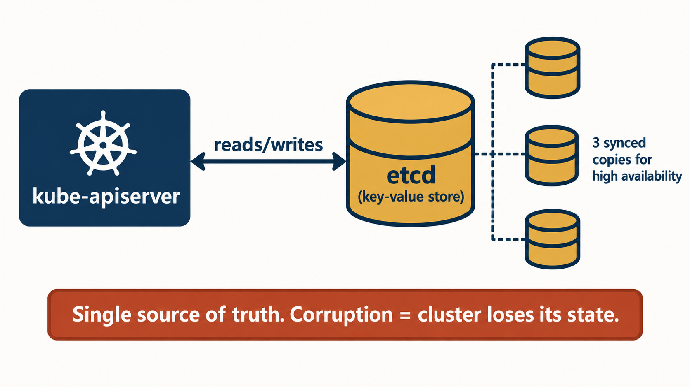

**Technical perspective:** etcd is the most critical failure point in Kubernetes. If etcd loses quorum, the entire control plane enters read-only failure: no pods can be created, updated, or scheduled, and controllers stall.
- **CKA Disaster Recovery Drill:** Administrators must master taking snapshots with `ETCDCTL_API=3 etcdctl snapshot save <file>` and restoring via `etcdctl snapshot restore <file> --data-dir=/var/lib/etcd-from-backup`.
- **Space Quotas:** etcd enforces a default 2GB storage quota (expandable to 8GB). Exceeding this quota triggers an `NOSPACE` alarm that locks the cluster into read-only mode until compaction and defragmentation are completed.

### Component architecture flow

<iframe src="diagrams/topic-04.html" width="100%" height="560" style="border:none;"></iframe>

> [!TIP]
> View the interactive animated diagram in [diagrams/topic-04.html](diagrams/topic-04.html).

**Part 2 — Analogy / Zine:** Wall-to-wall filing cabinets holding the only copy of the complex's rules and state that actually counts.

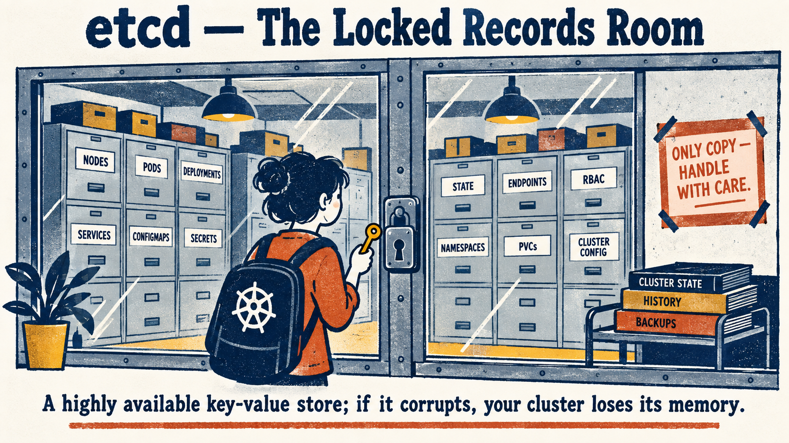

**Zine explanation:** The Locked Records Room image illustrates etcd's role as the only source of truth in the entire cluster. In the apartment metaphor, every lease, tenant record, and maintenance log lives in this one room — if it burns down, nobody knows who lives where or what rules apply. This mirrors etcd's position in Kubernetes: all object definitions (Pods, Services, Deployments), all cluster state, and all controller metadata are stored here. The "locked" aspect reflects that only the kube-apiserver holds the key — no other component writes to etcd directly. The "highly available" quality maps to the Raft quorum requirement: you need at least 2 of 3 rooms to agree before any record is considered committed.

* **Zine Text & Layout:**
* (Top): "etcd — The Locked Records Room"
* (Caption): "A highly available key-value store; if it corrupts, your cluster loses its memory."

**Further reading**

- [etcd: why etcd](https://etcd.io/docs/v3.5/learning/why/)
- [Kubernetes etcd guidance](https://kubernetes.io/docs/tasks/administer-cluster/configure-upgrade-etcd/)
- [CKA Study Notes: Core Concepts (etcd)](../CKA_Study_Notes/01-core-concepts.md) & [Cluster Maintenance (etcd Backup/Restore)](../CKA_Study_Notes/05-cluster-maintenance.md)

### Demo — etcd

<div style="background:#000;color:#fff;border-radius:8px;padding:1rem;overflow:auto;box-shadow:0 2px 8px rgba(0,0,0,.25);"><pre style="background:transparent;color:#fff;margin:0;white-space:pre-wrap;">
SETUP
  ETCD_POD=$(kubectl get pods -n kube-system -l component=etcd -o jsonpath='{.items[0].metadata.name}')
  echo $ETCD_POD

STEPS
  1. kubectl -n kube-system exec $ETCD_POD -- etcdctl --endpoints=https://127.0.0.1:2379 --cacert=/etc/kubernetes/pki/etcd/ca.crt --cert=/etc/kubernetes/pki/etcd/server.crt --key=/etc/kubernetes/pki/etcd/server.key get /registry/pods --prefix --keys-only | head -20

WHAT YOU SHOULD SEE
  A list of keys such as /registry/pods/kube-system/etcd-&lt;node&gt;. These are the 'filing cabinets' behind the API server.

CLEANUP
  (nothing to clean up)

NOTE
  Works on the kubeadm-style control plane used by kind. Managed clusters (EKS, GKE, AKS) hide etcd, so this will not work there. Do not use -it with a piped command.
</pre></div>


### Knowledge Check — Quiz

**Q1: In a 3-node etcd cluster, how many node failures can the cluster tolerate while maintaining write operations?**

- [ ] A) 2 nodes
- [ ] B) 1 node
- [ ] C) 0 nodes
- [ ] D) 3 nodes

<details>
<summary>Reveal Answer &amp; Explanation</summary>

**Correct Answer:** B) 1 node

**Explanation:** etcd requires a strict majority quorum ((N/2) + 1). For N=3, quorum is 2, meaning only 1 node failure is tolerated before writes are blocked.

</details>

**Q2: Why is low-latency disk I/O (such as NVMe/SSD) critical for etcd performance in production?**

- [ ] A) etcd compiles Go binaries on every write transaction.
- [ ] B) Raft consensus requires sequential fsync writes to the write-ahead log (WAL) before acknowledging mutations.
- [ ] C) etcd stores container image layers on disk.
- [ ] D) kube-proxy streams raw packet capture logs into etcd.

<details>
<summary>Reveal Answer &amp; Explanation</summary>

**Correct Answer:** B) Raft consensus requires sequential fsync writes to the write-ahead log (WAL) before acknowledging mutations.

**Explanation:** Every Raft proposal requires appending to disk and fsyncing to the WAL; high disk write latency directly stalls Raft consensus heartbeats and API server writes.

</details>

**Q3: Why is an odd number of members (such as 3 or 5) strongly recommended for an etcd cluster?**

- [ ] A) Even-numbered clusters consume twice as much network bandwidth per Raft heartbeat.
- [ ] B) Adding an even node increases cluster resource consumption without improving fault tolerance (a 4-node cluster still requires 3 for quorum, tolerating only 1 failure just like a 3-node cluster).
- [ ] C) etcd refuses to start if it detects an even number of peer URLs in its configuration file.
- [ ] D) Linux kernel bridge drivers cannot route multicast traffic across even node counts.

<details>
<summary>Reveal Answer &amp; Explanation</summary>

**Correct Answer:** B) Adding an even node increases cluster resource consumption without improving fault tolerance (a 4-node cluster still requires 3 for quorum, tolerating only 1 failure just like a 3-node cluster).

**Explanation:** Quorum is calculated as (N/2) + 1. In a 3-node cluster, quorum is 2 (tolerates 1 failure). In a 4-node cluster, quorum is 3 (still tolerates only 1 failure). Thus, the 4th node adds overhead without increasing fault tolerance.

</details>

**Q4: When etcd disk space reaches its quota limit (default 2GB to 8GB), what happens to API server operations?**

- [ ] A) etcd automatically purges the oldest half of all user namespaces.
- [ ] B) etcd enters maintenance alarm mode and raises an `NOSPACE` alarm, rejecting all new write and update requests until compacted and defragmented.
- [ ] C) The host operating system immediately kernel-panics to prevent data loss.
- [ ] D) etcd automatically provisions an external cloud block storage volume.

<details>
<summary>Reveal Answer &amp; Explanation</summary>

**Correct Answer:** B) etcd enters maintenance alarm mode and raises an `NOSPACE` alarm, rejecting all new write and update requests until compacted and defragmented.

**Explanation:** When space exceeds the storage quota, etcd raises an alarm and disables write operations to prevent database file corruption. Operators must compact revisions and run `etcdctl defrag` to reclaim space and disarm the alarm.

</details>

**Q5: What is the difference between a linearizable read and a serializable read in etcd?**

- [ ] A) Linearizable reads consult the Raft leader to verify it is still the legitimate leader before returning data; serializable reads return local data immediately, risking stale reads.
- [ ] B) Linearizable reads are cached in Redis; serializable reads bypass cache.
- [ ] C) Linearizable reads only return binary data; serializable reads return JSON.
- [ ] D) Linearizable reads are executed on worker nodes; serializable reads run on control plane nodes.

<details>
<summary>Reveal Answer &amp; Explanation</summary>

**Correct Answer:** A) Linearizable reads consult the Raft leader to verify it is still the legitimate leader before returning data; serializable reads return local data immediately, risking stale reads.

**Explanation:** Linearizable (quorum) reads ensure you never read stale data by confirming leader lease with quorum before responding. Serializable reads read directly from local member state without contacting quorum, offering lower latency but risking stale reads.

</details>

**Q6: Which command sequence correctly performs an offline restore of an etcd snapshot onto a new cluster node?**

- [ ] A) kubectl apply -f etcd-snapshot.db
- [ ] B) etcdctl snapshot restore /backup/etcd-snapshot.db --data-dir=/var/lib/etcd-restored
- [ ] C) systemctl restart etcd --import-snapshot=/backup/etcd-snapshot.db
- [ ] D) etcd-tool --restore --all-namespaces /backup/etcd-snapshot.db

<details>
<summary>Reveal Answer &amp; Explanation</summary>

**Correct Answer:** B) etcdctl snapshot restore /backup/etcd-snapshot.db --data-dir=/var/lib/etcd-restored

**Explanation:** `etcdctl snapshot restore <file> --data-dir=<new-dir>` initializes a fresh etcd data directory from the snapshot before etcd is started.

</details>

## 5. kube-scheduler

**Part 1 — Technical Discussion:** The `kube-scheduler` is the control plane component responsible for assigning newly created or unscheduled Pods (`spec.nodeName == ""`) to the most appropriate Worker Node in the cluster. It operates by watching the API server for unbound Pods and evaluating candidate nodes through a rigorous two-phase pipeline.

### Two-Phase Scheduling Pipeline
1. **Filtering Phase (Predicates):** Filters out nodes that do not meet the Pod's mandatory criteria.
   - `NodeResourcesFit`: Node has sufficient available CPU and memory allocatable capacity.
   - `NodeName` & `NodeSelector`: Checks explicit node names and key-value label selectors.
   - `PodTopologySpread`: Enforces failure domain distribution across zones or racks.
   - `NodePorts`: Verifies required host ports are not already occupied.
   - `Tolerations`: Ensures the Pod tolerates any active taints on the node.
2. **Scoring Phase (Priorities):** Ranks the remaining eligible nodes from 0 to 100 based on scoring plugins.
   - `ImageLocality`: Favors nodes that already have container images cached locally.
   - `NodeResourcesBalancedAllocation`: Scores nodes that achieve balanced CPU and memory utilization ratios.
   - `NodeAffinityScoring`: Awards higher scores for `preferredDuringSchedulingIgnoredDuringExecution` affinity rules.
3. **Binding Phase:** The scheduler constructs a `Binding` API object pointing the Pod to the winning node and posts it to `kube-apiserver`, populating `spec.nodeName`.

### Linux Capacity Evaluation
- The scheduler reads node capacity summaries reported by the kubelet based on kernel `/proc/meminfo` and `/sys/fs/cgroup/cpu` controllers.
- Workloads are evaluated against **Requests** (guaranteed reservation allocated by scheduler), not **Limits** (enforced by kernel cgroups).

```yaml
# advanced-pod-scheduling.yaml
# WHY THIS YAML: Demonstrates both phases of kube-scheduler's pipeline.
# FILTERING: 'tolerations' removes nodes that have the 'dedicated=high-compute:NoSchedule'
#   taint — without matching, the Scheduler discards those nodes before scoring.
# FILTERING + SCORING: 'requiredDuringScheduling' eliminates nodes outside allowed zones.
# 'resources.requests': the Scheduler checks NodeResourcesFit using these values —
#   nodes without 250m CPU or 256Mi free allocatable capacity are filtered out.
apiVersion: v1
kind: Pod
metadata:
  name: critical-service
spec:
  tolerations:
  - key: "dedicated"
    operator: "Equal"
    value: "high-compute"
    effect: "NoSchedule"
  affinity:
    nodeAffinity:
      requiredDuringSchedulingIgnoredDuringExecution:
        nodeSelectorTerms:
        - matchExpressions:
          - key: topology.kubernetes.io/zone
            operator: In
            values: ["us-east-1a", "us-east-1b"]
  containers:
  - name: app
    image: registry.k8s.io/pause:3.9
    resources:
      requests:
        cpu: 250m
        memory: 256Mi
```

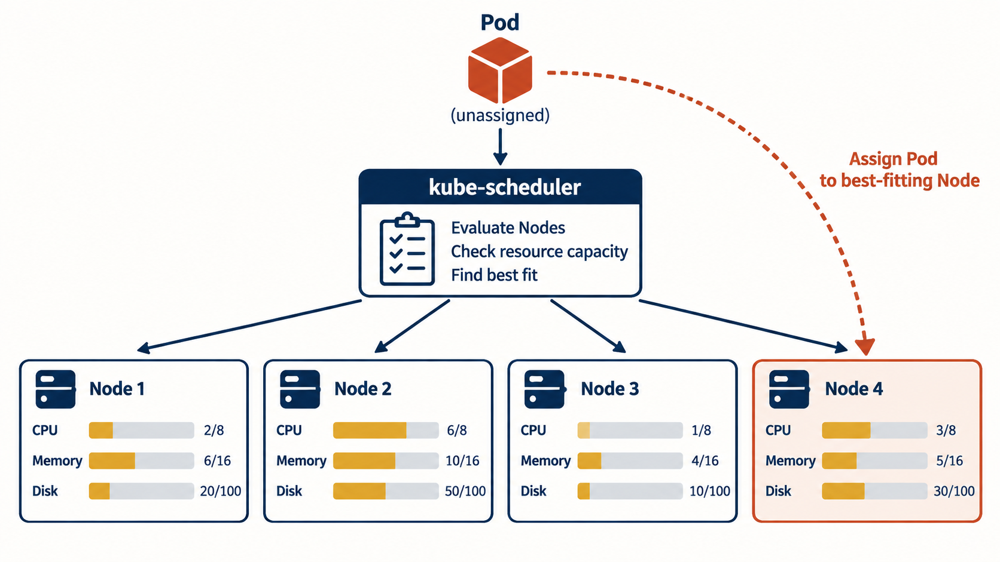

**Technical perspective:** The scheduler guarantees placement feasibility at scheduling time, but does not monitor subsequent node runtime performance:
- **Custom Schedulers:** Multiple schedulers can run concurrently. A pod declares a specific scheduler via `spec.schedulerName: custom-scheduler`.
- **Pending Pod Diagnosis:** If all nodes fail the filtering stage, the Pod remains stuck in `Pending`. Engineers troubleshoot this via `kubectl describe pod <name>` to view scheduler predicate events (e.g., `0/3 nodes available: 3 Insufficient memory`).

### Component architecture flow

<iframe src="diagrams/topic-05.html" width="100%" height="560" style="border:none;"></iframe>

> [!TIP]
> View the interactive animated diagram in [diagrams/topic-05.html](diagrams/topic-05.html).

**Part 2 — Analogy / Zine:** Checks building capacity and rules, then pins new tenants to the best-fitting building.

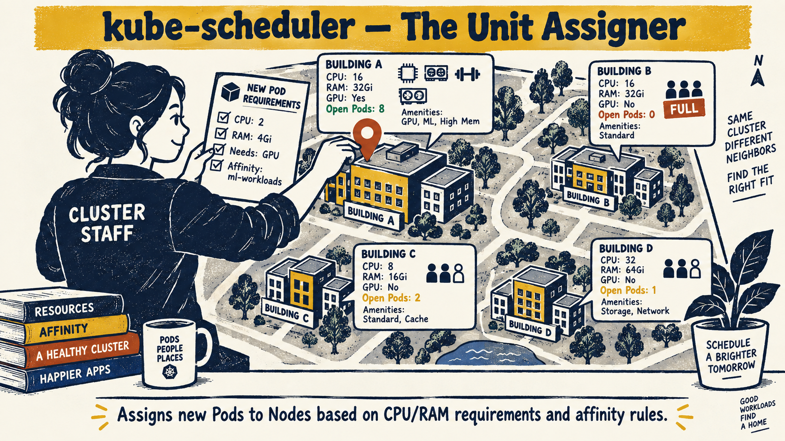

**Zine explanation:** The Unit Assigner image represents kube-scheduler's two-phase decision process. Just as a housing coordinator doesn't just pick any vacant unit but evaluates floor capacity, existing tenants, and accessibility requirements, kube-scheduler first filters out nodes that lack sufficient CPU/RAM, violate taints/tolerations, or fail topology constraints (Filtering Phase), then scores the remaining candidates based on resource balance, image locality, and affinity preferences (Scoring Phase). The image's assignment arrow from coordinator to node captures the Binding call — a PATCH to `pod.spec.nodeName` — which is the atomic moment a Pod is committed to a specific Worker Node.

* **Zine Text & Layout:**
* (Top): "kube-scheduler — The Unit Assigner"
* (Caption): "Assigns new Pods to Nodes based on CPU/RAM requirements and affinity rules."

**Further reading**

- [Kubernetes scheduler](https://kubernetes.io/docs/concepts/scheduling-eviction/kube-scheduler/)
- [Scheduling framework](https://kubernetes.io/docs/concepts/scheduling-eviction/scheduling-framework/)
- [CKA Study Notes: Scheduling](../CKA_Study_Notes/02-scheduling.md)

### Demo — kube-scheduler

<div style="background:#000;color:#fff;border-radius:8px;padding:1rem;overflow:auto;box-shadow:0 2px 8px rgba(0,0,0,.25);"><pre style="background:transparent;color:#fff;margin:0;white-space:pre-wrap;">
SETUP
  kubectl create namespace zine-demo

STEPS
  1. kubectl run demo-pod --image=nginx -n zine-demo
  2. kubectl wait --for=condition=Ready pod/demo-pod -n zine-demo --timeout=60s
  3. kubectl get pod demo-pod -n zine-demo -o wide
  4. kubectl describe pod demo-pod -n zine-demo | grep -A6 Events

WHAT YOU SHOULD SEE
  Events shows 'Scheduled ... Successfully assigned zine-demo/demo-pod to &lt;node&gt;'. The NODE column matches.

CLEANUP
  kubectl delete namespace zine-demo

NOTE
  The Scheduled event is the exact moment the scheduler picked a node.
</pre></div>


### Knowledge Check — Quiz

**Q1: During the scheduling cycle for an unscheduled Pod, what occurs if all candidate nodes are eliminated during the Filtering (predicates) phase?**

- [ ] A) The Pod is scheduled on the control-plane node automatically.
- [ ] B) The Pod remains in Pending status with a PodScheduled condition of False and reason FailedScheduling.
- [ ] C) The kube-scheduler deletes the Pod from etcd.
- [ ] D) The Pod is assigned to a random worker node regardless of constraints.

<details>
<summary>Reveal Answer &amp; Explanation</summary>

**Correct Answer:** B) The Pod remains in Pending status with a PodScheduled condition of False and reason FailedScheduling.

**Explanation:** If no node passes filtering (e.g. due to insufficient CPU/memory or untolerated taints), the pod stays Pending until cluster capacity or constraints change.

</details>

**Q2: How does the scheduler communicate its placement decision to the assigned worker node?**

- [ ] A) The scheduler connects via SSH directly to the worker node.
- [ ] B) The scheduler creates a Binding subresource via the API server that sets pod.spec.nodeName.
- [ ] C) The scheduler pushes a gRPC message directly to containerd on the worker node.
- [ ] D) The scheduler writes the node IP into CoreDNS.

<details>
<summary>Reveal Answer &amp; Explanation</summary>

**Correct Answer:** B) The scheduler creates a Binding subresource via the API server that sets pod.spec.nodeName.

**Explanation:** The scheduler does not contact nodes directly; it creates a Binding object via the API server, setting spec.nodeName. The target node's kubelet watches for pods bound to itself.

</details>

**Q3: In the scheduling cycle of kube-scheduler, what are the two primary phases executed for each unscheduled Pod?**

- [ ] A) Authentication and Authorization
- [ ] B) Filtering (Predicates) and Scoring (Priorities)
- [ ] C) Eviction and Preemption
- [ ] D) Image Pulling and Sandbox Initialization

<details>
<summary>Reveal Answer &amp; Explanation</summary>

**Correct Answer:** B) Filtering (Predicates) and Scoring (Priorities)

**Explanation:** kube-scheduler first executes Filtering (eliminating nodes that do not meet requirements like compute, taints, ports), then Scoring (ranking eligible candidate nodes according to priority functions to pick the best host).

</details>

**Q4: What is the key difference between `requiredDuringSchedulingIgnoredDuringExecution` and `preferredDuringSchedulingIgnoredDuringExecution` in node affinity?**

- [ ] A) Required is a hard constraint (pod stays Pending if no node matches); Preferred is a soft preference (scheduler will schedule on non-matching node if necessary).
- [ ] B) Required runs before pod creation; Preferred runs after pod creation.
- [ ] C) Preferred will evict the pod if node labels change later; Required will not.
- [ ] D) Required is deprecated in Kubernetes 1.25+; Preferred is the only supported syntax.

<details>
<summary>Reveal Answer &amp; Explanation</summary>

**Correct Answer:** A) Required is a hard constraint (pod stays Pending if no node matches); Preferred is a soft preference (scheduler will schedule on non-matching node if necessary).

**Explanation:** `requiredDuringScheduling...` acts as a hard requirement that must be satisfied for scheduling. `preferredDuringScheduling...` assigns weighted preference points to matching nodes, but does not block scheduling if no match exists.

</details>

**Q5: What occurs when a higher-priority Pod with a `PriorityClass` cannot find any node with sufficient compute resources?**

- [ ] A) The API server automatically doubles the CPU clock frequency of worker nodes.
- [ ] B) kube-scheduler initiates Preemption, evicting lower-priority Pods from a candidate node to make room for the higher-priority Pod.
- [ ] C) The higher-priority Pod is immediately converted into a DaemonSet.
- [ ] D) The scheduler crashes with an unhandled exception.

<details>
<summary>Reveal Answer &amp; Explanation</summary>

**Correct Answer:** B) kube-scheduler initiates Preemption, evicting lower-priority Pods from a candidate node to make room for the higher-priority Pod.

**Explanation:** If a high-priority pod cannot be scheduled, kube-scheduler identifies a candidate node and evicts lower-priority victim pods so the high-priority workload can bind.

</details>

**Q6: When configuring Pod anti-affinity to ensure that no two replicas of a database run on the same physical server, what should the `topologyKey` be set to?**

- [ ] A) kubernetes.io/os
- [ ] B) kubernetes.io/hostname
- [ ] C) topology.kubernetes.io/zone
- [ ] D) node.kubernetes.io/instance-type

<details>
<summary>Reveal Answer &amp; Explanation</summary>

**Correct Answer:** B) kubernetes.io/hostname

**Explanation:** `topologyKey: kubernetes.io/hostname` scopes the anti-affinity domain to individual hostnames, ensuring no two matching pods land on the same physical or virtual host.

</details>

## 6. kube-controller-manager

**Part 1 — Technical Discussion:** The `kube-controller-manager` is a single binary that bundles dozens of distinct, autonomous control loops into a single process. Each controller is responsible for reconciling a specific slice of cluster state towards its declared intent.

### Core Bundled Controllers
- **Node Lifecycle Controller:** Monitors node health leases, assigns CIDR blocks, manages node taints (`node.kubernetes.io/unreachable`), and handles eviction timeouts.
- **ReplicaSet / Deployment Controller:** Ensures the exact number of Pod replicas declared in workload specs are running, creating or deleting pods as needed.
- **EndpointSlice Controller:** Watches Services and Pods to maintain updated network routing endpoint collections.
- **Job / CronJob Controller:** Spawns batch pods according to schedule and monitors them to completion exit codes.
- **ServiceAccount & Namespace Controllers:** Generates default ServiceAccounts and default tokens; cleans up resources during namespace deletion.

### High Availability & Leader Election
- When multiple control plane nodes run the controller manager, only **one** instance acts as active leader at any given time.
- Active leadership is acquired via a distributed lease lock stored as a `Lease` object in `kube-system` (`coordination.k8s.io/v1`). Standby instances continuously poll the lease, taking over immediately if the leader fails to renew within the renewal interval.

```yaml
# /etc/kubernetes/manifests/kube-controller-manager.yaml -- Flags excerpt
# WHY THIS YAML: These flags configure the controller loops inside kube-controller-manager.
# '--leader-elect=true': only ONE active instance in HA; others watch the Lease lock.
# '--node-monitor-grace-period=40s': how long before a silent node is marked NotReady.
# '--pod-eviction-timeout=5m0s': after NotReady, pods wait this long before rescheduling.
# '--cluster-cidr=10.244.0.0/16': the Pod IP block; the controller assigns per-node CIDRs.
apiVersion: v1
kind: Pod
metadata:
  name: kube-controller-manager
  namespace: kube-system
spec:
  containers:
  - name: kube-controller-manager
    image: registry.k8s.io/kube-controller-manager:v1.28.0
    command:
    - kube-controller-manager
    - --leader-elect=true
    - --node-monitor-grace-period=40s
    - --node-monitor-period=5s
    - --pod-eviction-timeout=5m0s
    - --allocate-node-cidrs=true
    - --cluster-cidr=10.244.0.0/16
```

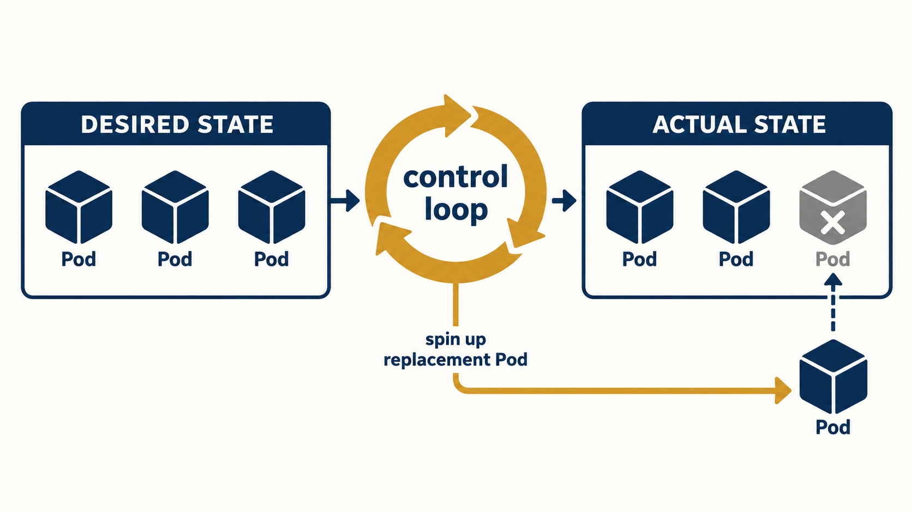

**Technical perspective:** Controllers operate on an **eventual consistency** paradigm. They are designed to be idempotent: running the reconciliation loop multiple times with the same input produces the exact same cluster state:
- **Rate-Limiting & Backoff:** If a controller repeatedly fails an operation (such as failing to create a Pod due to quota exhaustion), it applies exponential backoff to protect the API server from request flooding.
- **Cascading Deletions:** The Garbage Collector controller tracks parent-child hierarchies via `ownerReferences` on objects, ensuring that deleting a Deployment automatically cascades down to delete its managed ReplicaSets and Pods.

### Component architecture flow

<iframe src="diagrams/topic-06.html" width="100%" height="560" style="border:none;"></iframe>

> [!TIP]
> View the interactive animated diagram in [diagrams/topic-06.html](diagrams/topic-06.html).

**Part 2 — Analogy / Zine:** Clipboard inspectors walking endless loops to ensure reality matches the promised plan, fixing discrepancies automatically.

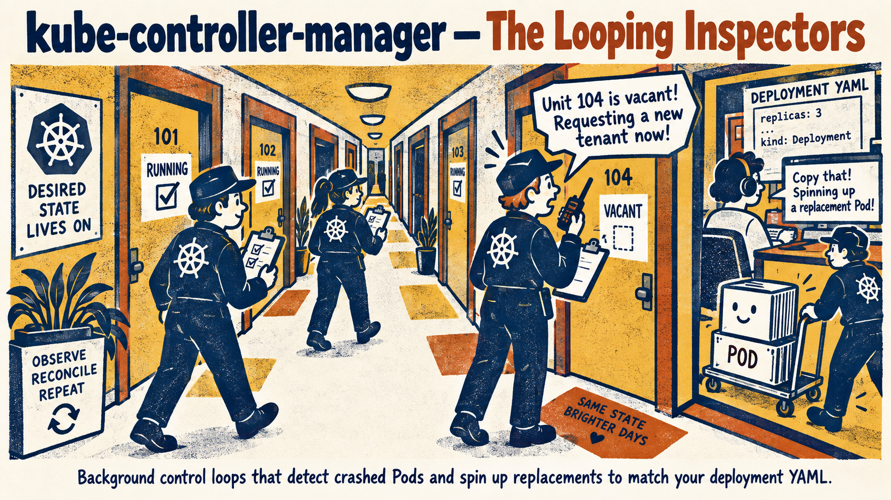

**Zine explanation:** The Looping Inspectors image captures kube-controller-manager's defining behavior: it runs dozens of independent control loops that continuously patrol cluster state. Just as building inspectors walk the floors on a schedule, detect vacant units, and trigger the leasing process — without being asked each time — controllers like ReplicaSet Controller, Node Lifecycle Controller, and EndpointSlice Controller watch for drift between desired state (etcd) and actual state (node reports), then issue corrective API calls. The "looping" aspect is critical: controllers are event-driven and level-triggered, meaning they reconcile even if events are missed, ensuring eventual convergence without manual intervention.

* **Zine Text & Layout:**
* (Top): "kube-controller-manager — The Looping Inspectors"
* (Caption): "Background control loops that detect crashed Pods and spin up replacements to match your deployment YAML."

**Further reading**

- [Controllers](https://kubernetes.io/docs/concepts/architecture/controller/)
- [CKA Study Notes: Core Concepts (Controller Manager)](../CKA_Study_Notes/01-core-concepts.md)

### Demo — kube-controller-manager

<div style="background:#000;color:#fff;border-radius:8px;padding:1rem;overflow:auto;box-shadow:0 2px 8px rgba(0,0,0,.25);"><pre style="background:transparent;color:#fff;margin:0;white-space:pre-wrap;">
SETUP
  kubectl create namespace zine-demo
  kubectl create deployment demo --image=nginx --replicas=3 -n zine-demo
  kubectl rollout status deployment/demo -n zine-demo

STEPS
  1. kubectl get pods -l app=demo -n zine-demo
  2. kubectl delete pod $(kubectl get pods -l app=demo -n zine-demo -o name | head -1) -n zine-demo
  3. kubectl get pods -l app=demo -n zine-demo -w   # Ctrl+C after a new Pod is Running

WHAT YOU SHOULD SEE
  You deleted one Pod and a replacement appears within seconds. The count returns to 3.

CLEANUP
  kubectl delete namespace zine-demo

NOTE
  The control loop noticed the gap and closed it with no command from you.
</pre></div>


### Knowledge Check — Quiz

**Q1: What design principle enables Kubernetes controllers to recover gracefully from network partitions or restarts without missing state changes?**

- [ ] A) Edge-triggered interrupts stored in persistent message queues.
- [ ] B) Level-triggered reconciliation loops comparing desired state from the API server with observed cluster state.
- [ ] C) Synchronous RPC heartbeats between all worker nodes.
- [ ] D) Hardcoded sleep timers between sequential shell commands.

<details>
<summary>Reveal Answer &amp; Explanation</summary>

**Correct Answer:** B) Level-triggered reconciliation loops comparing desired state from the API server with observed cluster state.

**Explanation:** Level-triggered design means controllers reconcile based on current observed state rather than relying on having received every intermediate edge event, making them self-healing and idempotent.

</details>

**Q2: If a user manually deletes a Pod managed by a Deployment (via its ReplicaSet), what will the ReplicaSet controller do?**

- [ ] A) It updates the Deployment replicas count to N - 1.
- [ ] B) It marks the Deployment as Failed.
- [ ] C) It observes that current replicas < desired replicas and creates a replacement Pod via the API server.
- [ ] D) It recreates the entire cluster worker node.

<details>
<summary>Reveal Answer &amp; Explanation</summary>

**Correct Answer:** C) It observes that current replicas < desired replicas and creates a replacement Pod via the API server.

**Explanation:** The ReplicaSet controller continuously compares observed replicas matching its selector against spec.replicas. If one is missing, it immediately issues an API request to create a new one.

</details>

**Q3: What concurrency and high-availability mechanism does `kube-controller-manager` use when multiple instances run across control plane nodes?**

- [ ] A) Active-Active round-robin load balancing of controller loops across all instances.
- [ ] B) Active-Passive leader election using a Lease lock in `kube-system`; only the elected leader runs control loops while standbys idle.
- [ ] C) Shared memory IPC over high-speed InfiniBand links.
- [ ] D) Sharding controllers across nodes based on namespace alphabetical order.

<details>
<summary>Reveal Answer &amp; Explanation</summary>

**Correct Answer:** B) Active-Passive leader election using a Lease lock in `kube-system`; only the elected leader runs control loops while standbys idle.

**Explanation:** To prevent split-brain dual-reconciliation where multiple instances issue conflicting changes, `kube-controller-manager` uses an active-passive leader election lock. Only the active leader executes controllers.

</details>

**Q4: Which architectural concept explains why Kubernetes controllers can self-heal after extended network partitions or restarts without missing events?**

- [ ] A) Edge-triggered event delivery only
- [ ] B) Level-triggered reconciliation loops comparing desired state against actual state continuously
- [ ] C) Storing past event logs in local SQLite databases
- [ ] D) Mandatory daily reboots of all worker nodes

<details>
<summary>Reveal Answer &amp; Explanation</summary>

**Correct Answer:** B) Level-triggered reconciliation loops comparing desired state against actual state continuously

**Explanation:** Kubernetes is level-triggered rather than edge-triggered: controllers observe the current actual state and drive it toward desired state, meaning missed transient edge events do not prevent reconciliation once connectivity resumes.

</details>

**Q5: If a platform administrator wants to disable only the Route and ServiceAccountToken controllers in kube-controller-manager, which command-line flag is used?**

- [ ] A) --disable-controllers=route,serviceaccount-token
- [ ] B) --controllers=*, -route, -serviceaccount-token
- [ ] C) --exclude-controllers=route,serviceaccount-token
- [ ] D) --skip-controllers=route,serviceaccount-token

<details>
<summary>Reveal Answer &amp; Explanation</summary>

**Correct Answer:** B) --controllers=*, -route, -serviceaccount-token

**Explanation:** The `--controllers` flag accepts a comma-separated list of controllers where `*` includes all default controllers and prefixing with `-` excludes specific controllers (e.g. `*, -route, -serviceaccount-token`).

</details>

**Q6: What internal client-go caching component do controllers use to efficiently watch API resources without polling the API server?**

- [ ] A) Redis Cache Client
- [ ] B) SharedInformer with Reflector, DeltaFIFO queue, and Local Indexer Cache
- [ ] C) Direct raw TCP socket dump
- [ ] D) Local file-based SQLite replica

<details>
<summary>Reveal Answer &amp; Explanation</summary>

**Correct Answer:** B) SharedInformer with Reflector, DeltaFIFO queue, and Local Indexer Cache

**Explanation:** client-go's `SharedInformer` establishes a watch stream with the API server, maintains an in-memory cached index (Lister), and dispatches add/update/delete notifications to worker queues, avoiding API server polling overhead.

</details>

## 7. cloud-controller-manager

**Part 1 — Technical Discussion:** The `cloud-controller-manager` (CCM) isolates cloud-vendor-specific control loops from core Kubernetes codebase. Historically, cloud provider logic (AWS, Azure, GCP, OpenStack) was compiled directly into `kube-controller-manager` ("in-tree"). The modern architecture moves all vendor integration to an external out-of-tree binary.

### Key CCM Controllers
- **Node Controller:** Periodically checks cloud provider APIs to confirm if nodes that became unresponsive in Kubernetes have actually been terminated or deleted in the cloud console, cleaning them up promptly.
- **Route Controller:** Configures VPC routing tables and subnets so that Pod CIDR network packets can route between distinct VMs across cloud availability zones.
- **Service Controller:** Watches Services of `type: LoadBalancer` and interacts with cloud provider APIs to provision, configure, and delete cloud load balancers (AWS NLB/ALB, Google Cloud Load Balancing, Azure Load Balancer).

### Operational Integration
- The kubelet runs with `--cloud-provider=external`, marking the node with a taint `node.cloudprovider.kubernetes.io/uninitialized:NoSchedule` until the CCM initializes the node with cloud metadata (Zone, Region, InstanceType, ProviderID).

```yaml
# cloud-loadbalancer-service.yaml
# WHY THIS YAML: This Service spec triggers the cloud-controller-manager's Service Controller.
# 'type: LoadBalancer': when the API server persists this, CCM's Service Controller
#   calls the cloud provider API (AWS/GCP/Azure) to provision an actual load balancer.
# 'annotations': cloud-specific parameters passed to the CCM for LB configuration.
# 'aws-load-balancer-type: external' tells CCM to create an AWS NLB, not an ALB.
# This proves 'type: LoadBalancer' is a Kubernetes intent — CCM translates it to infra.
apiVersion: v1
kind: Service
metadata:
  name: cloud-service
  annotations:
    service.beta.kubernetes.io/aws-load-balancer-type: "external"
    service.beta.kubernetes.io/aws-load-balancer-nlb-target-type: "instance"
    service.beta.kubernetes.io/aws-load-balancer-scheme: "internet-facing"
spec:
  type: LoadBalancer
  selector:
    app: public-web
  ports:
  - port: 80
    targetPort: 8080
    protocol: TCP
```

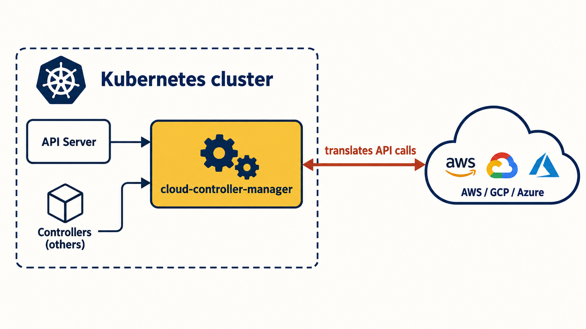

**Technical perspective:** Running out-of-tree CCM decouples Kubernetes releases from cloud provider bugfixes:
- **Cloud IAM Identity:** The CCM requires explicit cloud IAM roles and credentials (or Workload Identity/IRSA) with permissions to provision network interfaces, load balancers, and route tables.
- **Orphaned Cloud Costs:** If a namespace containing a LoadBalancer Service is deleted forcefully while CCM is malfunctioning, the external cloud load balancer may remain active in the cloud account, incurring silent billing costs.

### Component architecture flow

<iframe src="diagrams/topic-07.html" width="100%" height="560" style="border:none;"></iframe>

> [!TIP]
> View the interactive animated diagram in [diagrams/topic-07.html](diagrams/topic-07.html).

**Part 2 — Analogy / Zine:** Signs paperwork to connect external utilities like rented parking gates.

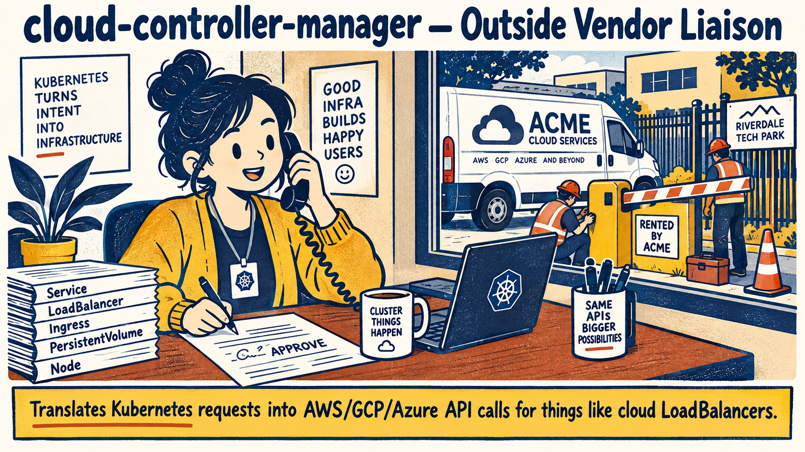

**Zine explanation:** The Outside Vendor Liaison image represents cloud-controller-manager's role as the bridge between Kubernetes' internal API model and external cloud provider APIs. Just as a complex might hire an external property management firm to handle parking structures, utility connections, and city permits — things beyond the building's own walls — cloud-controller-manager handles resources that exist in the cloud platform: provisioning AWS NLBs when Services of type LoadBalancer are created, updating VPC routing tables for Pod CIDR blocks, and removing cloud node entries when VMs are terminated. This decoupling keeps core Kubernetes cloud-agnostic while allowing per-cloud integrations.

* **Zine Text & Layout:**
* (Top): "cloud-controller-manager — Outside Vendor Liaison"
* (Caption): "Translates Kubernetes requests into AWS/GCP/Azure API calls for things like cloud LoadBalancers."

**Further reading**

- [Cloud controller manager](https://kubernetes.io/docs/concepts/architecture/cloud-controller/)
- [CKA Study Notes: Core Concepts & Cloud Controller](../CKA_Study_Notes/01-core-concepts.md)

### Demo — cloud-controller-manager

<div style="background:#000;color:#fff;border-radius:8px;padding:1rem;overflow:auto;box-shadow:0 2px 8px rgba(0,0,0,.25);"><pre style="background:transparent;color:#fff;margin:0;white-space:pre-wrap;">
SETUP
  kubectl create namespace zine-demo
  kubectl create deployment demo --image=nginx --replicas=3 -n zine-demo
  kubectl rollout status deployment/demo -n zine-demo

STEPS
  1. kubectl expose deployment demo --type=LoadBalancer --port=80 --target-port=80 -n zine-demo
  2. kubectl get svc demo -n zine-demo -w   # Ctrl+C when done

WHAT YOU SHOULD SEE
  On a cloud cluster EXTERNAL-IP moves from &lt;pending&gt; to a real IP. On kind it stays &lt;pending&gt; unless a cloud provider integration is installed.

CLEANUP
  kubectl delete namespace zine-demo

NOTE
  Kind has no cloud provider by default, so &lt;pending&gt; is the expected result. To provision a real LoadBalancer on kind, install and run cloud-provider-kind separately; for a simple local HTTP test, use a NodePort instead.
</pre></div>


### Knowledge Check — Quiz

**Q1: What was the primary motivation for introducing the cloud-controller-manager (CCM) as a separate binary from kube-controller-manager?**

- [ ] A) To make Kubernetes compatible with Windows worker nodes.
- [ ] B) To extract vendor-specific cloud provider code out-of-tree so cloud providers can update independently of Kubernetes core releases.
- [ ] C) To replace etcd with cloud databases like AWS DynamoDB.
- [ ] D) To eliminate the need for kubelet on cloud virtual machines.

<details>
<summary>Reveal Answer &amp; Explanation</summary>

**Correct Answer:** B) To extract vendor-specific cloud provider code out-of-tree so cloud providers can update independently of Kubernetes core releases.

**Explanation:** Out-of-tree cloud controllers decouple cloud provider SDKs and release cycles from the core Kubernetes repository, removing proprietary drivers from the core codebase.

</details>

**Q2: Which controller within cloud-controller-manager is responsible for provisioning cloud load balancers when a Service of type LoadBalancer is created?**

- [ ] A) Node lifecycle controller
- [ ] B) Service controller
- [ ] C) Route controller
- [ ] D) PersistentVolume label controller

<details>
<summary>Reveal Answer &amp; Explanation</summary>

**Correct Answer:** B) Service controller

**Explanation:** The cloud Service controller watches for Services of type: LoadBalancer and calls the cloud provider's API to provision and wire up external load balancers.

</details>

**Q3: What was the primary architectural motivation behind moving cloud provider code out of `kube-controller-manager` into `cloud-controller-manager`?**

- [ ] A) To force cloud providers to write their integrations in Python instead of Go.
- [ ] B) To decouple cloud provider release cycles and private SDKs from core Kubernetes releases, allowing independent development and out-of-tree plugins.
- [ ] C) To eliminate the need for container runtimes on worker nodes.
- [ ] D) To make Kubernetes compatible only with private on-premises hardware.

<details>
<summary>Reveal Answer &amp; Explanation</summary>

**Correct Answer:** B) To decouple cloud provider release cycles and private SDKs from core Kubernetes releases, allowing independent development and out-of-tree plugins.

**Explanation:** In-tree cloud providers tightly coupled vendor SDKs to the Kubernetes core binary. Out-of-tree `cloud-controller-manager` enables cloud vendors to release fixes and features without waiting for upstream Kubernetes releases.

</details>

**Q4: Which specific controller inside `cloud-controller-manager` is responsible for querying the cloud provider API to delete Kubernetes Node objects when a cloud VM is destroyed?**

- [ ] A) Route Controller
- [ ] B) Node Lifecycle Controller (Node Controller)
- [ ] C) Service Controller
- [ ] D) PersistentVolume Controller

<details>
<summary>Reveal Answer &amp; Explanation</summary>

**Correct Answer:** B) Node Lifecycle Controller (Node Controller)

**Explanation:** The cloud-controller-manager's node controller queries cloud infrastructure APIs to verify whether an instance still exists. If the VM was terminated in the cloud, it cleans up the corresponding Kubernetes Node object.

</details>

**Q5: What task does the Route Controller inside `cloud-controller-manager` perform?**

- [ ] A) It programs DNS records inside CoreDNS.
- [ ] B) It configures cloud VPC routing tables so packets destined for a node's Pod CIDR are forwarded to that node's cloud VM IP.
- [ ] C) It generates TLS certificates for Ingress controllers.
- [ ] D) It manages SSH authorized keys for node access.

<details>
<summary>Reveal Answer &amp; Explanation</summary>

**Correct Answer:** B) It configures cloud VPC routing tables so packets destined for a node's Pod CIDR are forwarded to that node's cloud VM IP.

**Explanation:** In clouds with non-overlay VPC routing, the Route Controller configures the cloud VPC route table so traffic destined for a pod subnet assigned to a specific worker node is routed to that node's VM interface.

</details>

**Q6: Which node label is automatically applied by cloud-controller-manager to indicate the physical failure domain of an instance?**

- [ ] A) topology.kubernetes.io/zone and topology.kubernetes.io/region
- [ ] B) hardware.architecture/rack-number
- [ ] C) cloud.provider/datacenter-room
- [ ] D) kubernetes.io/physical-server-bay

<details>
<summary>Reveal Answer &amp; Explanation</summary>

**Correct Answer:** A) topology.kubernetes.io/zone and topology.kubernetes.io/region

**Explanation:** cloud-controller-manager queries cloud instance metadata and populates standard topology labels: `topology.kubernetes.io/zone` (e.g. `us-east-1a`) and `topology.kubernetes.io/region` (e.g. `us-east-1`).

</details>

## 8. Static Pods

**Part 1 — Technical Discussion:** **Static Pods** are pods managed directly and exclusively by the local `kubelet` daemon on a specific node, completely bypassing the `kube-apiserver`, `kube-scheduler`, and workload controllers.

### Bootstrapping & Discovery Mechanism
- **Manifest Directory:** The kubelet periodically scans a local filesystem directory (configured via `staticPodPath` in `/var/lib/kubelet/config.yaml`, standard path: `/etc/kubernetes/manifests/`) using Linux `inotify` watches.
- **Local Supervision:** When a valid Pod manifest is written into this directory, the kubelet directly instructs the local container runtime to launch the containers. If the manifest is deleted, the kubelet terminates the containers immediately.
- **Mirror Pods:** To provide cluster observability, the kubelet creates a read-only **Mirror Pod** in the `kube-system` namespace on `kube-apiserver`. The mirror pod reflects status in `kubectl get pods`, but cannot be deleted or modified through the API.
- **Control Plane Self-Hosting:** Standard tools like `kubeadm` use static pods to bootstrap the entire Kubernetes control plane (`kube-apiserver`, `etcd`, `kube-controller-manager`, `kube-scheduler`).

### Linux OS Integration
- Static pods execute container runtimes while the control plane is offline or uninitialized.
- File ownership in `/etc/kubernetes/manifests/` must be restricted to `root:root` with permissions `0600` or `0644`.

```yaml
# /etc/kubernetes/manifests/node-diagnostics.yaml
# WHY THIS YAML: Placed in the Static Pod directory — kubelet reads via inotify.
# The kubelet starts this container WITHOUT consulting kube-apiserver, etcd, or scheduler.
# 'hostNetwork: true': shares the node's network namespace — needed before CNI is ready.
# 'hostPID: true': shares the node's PID namespace — needed for node-level diagnostics.
# 'hostPath /var/log': mounts the node's actual log directory into the container.
# This is the exact pattern kubeadm uses to bootstrap etcd and kube-apiserver.
apiVersion: v1
kind: Pod
metadata:
  name: node-diagnostics
  namespace: kube-system
spec:
  hostNetwork: true
  hostPID: true
  containers:
  - name: diagnostic-agent
    image: registry.k8s.io/pause:3.9
    volumeMounts:
    - name: host-log
      mountPath: /var/log
  volumes:
  - name: host-log
    hostPath:
      path: /var/log
```

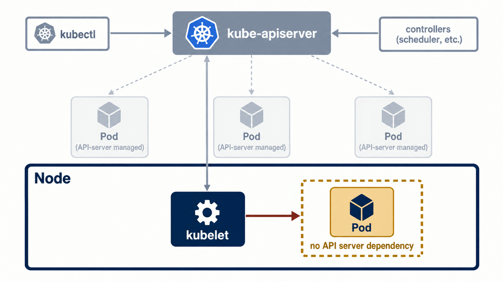

**Technical perspective:** Static pods are the backbone of Kubernetes cluster bootstrapping and node-level operational recovery:
- **CKA Troubleshooting Pattern:** If `kubectl get nodes` fails because the API server is down, check `/etc/kubernetes/manifests/` on the control plane node. Inspect the manifest files and review container logs via `crictl ps` and `crictl logs <container-id>` or `/var/log/pods/`.
- **Name Appending:** The kubelet automatically appends the node hostname as a suffix to the static pod name (e.g., `kube-apiserver-control-plane-01`).

### Component architecture flow

<iframe src="diagrams/topic-08.html" width="100%" height="560" style="border:none;"></iframe>

> [!TIP]
> View the interactive animated diagram in [diagrams/topic-08.html](diagrams/topic-08.html).

**Part 2 — Analogy / Zine:** A local blueprint used to build the front desk before a front desk even exists.

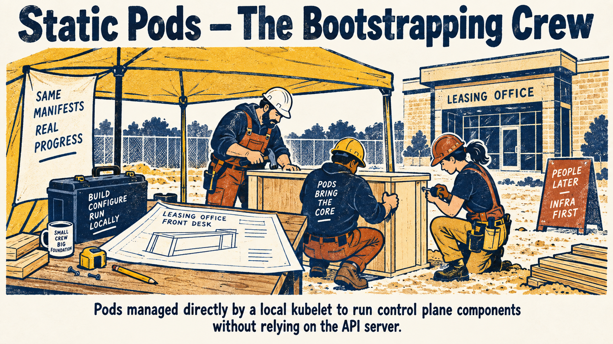

**Zine explanation:** The Bootstrapping Crew image shows workers setting up the building's infrastructure before any tenants arrive — and this is exactly what Static Pods do for the Kubernetes control plane. Static Pods are defined as YAML manifests in `/etc/kubernetes/manifests/` on the control plane node, read directly by the kubelet via inotify file watches, with no dependency on the kube-apiserver or etcd. They are how kubeadm bootstraps the cluster: etcd, kube-apiserver, kube-scheduler, and kube-controller-manager all run as Static Pods before any cluster API is available. The Mirror Pod mechanic — a read-only reflection visible in `kubectl get pods -n kube-system` — explains why you see these pods in the API even though the API didn't create them.

* **Zine Text & Layout:**
* (Top): "Static Pods — The Bootstrapping Crew"
* (Caption): "Pods managed directly by a local kubelet to run control plane components without relying on the API server."

**Further reading**

- [Static Pods](https://kubernetes.io/docs/tasks/configure-pod-container/static-pod/)
- [CKA Study Notes: Scheduling (Static Pods & Kubelet)](../CKA_Study_Notes/02-scheduling.md)

### Demo — Static Pods

<div style="background:#000;color:#fff;border-radius:8px;padding:1rem;overflow:auto;box-shadow:0 2px 8px rgba(0,0,0,.25);"><pre style="background:transparent;color:#fff;margin:0;white-space:pre-wrap;">
SETUP
  (none: uses what is already in the cluster)

STEPS
  1. docker exec -it zine-control-plane bash
  2. ls /etc/kubernetes/manifests/
  3. exit
  4. kubectl get pods -n kube-system -o wide | grep -E 'apiserver|etcd|scheduler'

WHAT YOU SHOULD SEE
  The manifests folder lists kube-apiserver.yaml, etcd.yaml, kube-scheduler.yaml, kube-controller-manager.yaml. The same Pods appear in kube-system with the node name appended.

CLEANUP
  (nothing to clean up)

NOTE
  The kubelet reads those files directly, with no API server round-trip. Run the ls on the control-plane node itself, not your laptop.
</pre></div>


### Knowledge Check — Quiz

**Q1: Who manages the lifecycle of a Static Pod running on a worker node?**

- [ ] A) The kube-scheduler running on the control plane.
- [ ] B) The local kubelet on that specific node watching a local file directory or HTTP endpoint directly.
- [ ] C) The Deployment controller.
- [ ] D) CoreDNS.

<details>
<summary>Reveal Answer &amp; Explanation</summary>

**Correct Answer:** B) The local kubelet on that specific node watching a local file directory or HTTP endpoint directly.

**Explanation:** Static Pods are configured locally on a node (typically in /etc/kubernetes/manifests) and supervised directly by the kubelet without scheduler involvement.

</details>

**Q2: What is a 'Mirror Pod' in the context of Static Pods?**

- [ ] A) An identical backup container running on a secondary worker node.
- [ ] B) A read-only Pod representation created on the API server by kubelet so the Static Pod is visible via kubectl get pods.
- [ ] C) A sidecar container injected into every pod for logging.
- [ ] D) A container that replicates network packets for auditing.

<details>
<summary>Reveal Answer &amp; Explanation</summary>

**Correct Answer:** B) A read-only Pod representation created on the API server by kubelet so the Static Pod is visible via kubectl get pods.

**Explanation:** The kubelet creates a Mirror Pod on the API server matching the static pod spec so cluster operators can observe its status using standard Kubernetes API tools.

</details>

**Q3: How does the Kubelet discover and maintain Static Pods without communicating with the kube-scheduler?**

- [ ] A) It queries an external Git repository every 60 seconds.
- [ ] B) It scans a local host filesystem directory (such as `/etc/kubernetes/manifests`) for YAML files using inotify filesystem watches.
- [ ] C) It reads static pod configurations from worker node BIOS NVRAM.
- [ ] D) It listens on a raw UDP multicast port broadcast by the control plane.

<details>
<summary>Reveal Answer &amp; Explanation</summary>

**Correct Answer:** B) It scans a local host filesystem directory (such as `/etc/kubernetes/manifests`) for YAML files using inotify filesystem watches.

**Explanation:** Static Pods are defined directly on the node filesystem (configured via `staticPodPath` in Kubelet configuration). Kubelet monitors the folder and directly starts and restarts the containers via the local CRI runtime.

</details>

**Q4: What is the purpose of the 'Mirror Pod' that the Kubelet creates in the kube-apiserver for every local Static Pod?**

- [ ] A) It provides visibility of the Static Pod to cluster administrators and allows `kubectl get pods` to display its status.
- [ ] B) It runs a backup copy of the container on a worker node in case the control plane fails.
- [ ] C) It proxies HTTP network traffic from user namespaces into the static container.
- [ ] D) It allows the kube-scheduler to migrate the Static Pod to another host.

<details>
<summary>Reveal Answer &amp; Explanation</summary>

**Correct Answer:** A) It provides visibility of the Static Pod to cluster administrators and allows `kubectl get pods` to display its status.

**Explanation:** Mirror Pods are read-only representations in the API server that allow operators to view static pod status via `kubectl`. Deleting a mirror pod via `kubectl delete` does not delete the static pod; the Kubelet simply recreates the mirror.

</details>

**Q5: What happens when a node's filesystem disk usage exceeds the Kubelet's `imageGCHighThresholdPercent` (default 85%)?**

- [ ] A) The Kubelet immediately formats the node's disk partition.
- [ ] B) The Kubelet initiates image garbage collection, deleting unused container images until disk usage drops below `imageGCLowThresholdPercent` (default 80%).
- [ ] C) The Kubelet terminates all Running pods with exit code 137.
- [ ] D) The Kubelet disables all network interfaces on the node.

<details>
<summary>Reveal Answer &amp; Explanation</summary>

**Correct Answer:** B) The Kubelet initiates image garbage collection, deleting unused container images until disk usage drops below `imageGCLowThresholdPercent` (default 80%).

**Explanation:** Image garbage collection triggers when disk usage crosses `imageGCHighThresholdPercent`, removing unreferenced images in order of least recently used until usage falls back below the low threshold.

</details>

**Q6: Why is it mandatory for the Kubelet's cgroup driver (`cgroupDriver`) to match the container runtime's cgroup driver (typically `systemd`) on modern Linux distributions?**

- [ ] A) Mismatched drivers cause the Linux kernel to refuse mounting ext4 partitions.
- [ ] B) Having two different cgroup managers (e.g., Kubelet using cgroupfs while containerd uses systemd) creates split resource accounting and leads to node instability under memory pressure.
- [ ] C) systemd only supports single-core CPU processors.
- [ ] D) Kubernetes requires cgroupfs for IPv6 network routing.

<details>
<summary>Reveal Answer &amp; Explanation</summary>

**Correct Answer:** B) Having two different cgroup managers (e.g., Kubelet using cgroupfs while containerd uses systemd) creates split resource accounting and leads to node instability under memory pressure.

**Explanation:** When systemd is the init system, having Kubelet allocate cgroups via `cgroupfs` while containerd allocates via `systemd` results in conflicting cgroup hierarchies, inaccurate resource tracking, and failed process evictions under load.

</details>

## 9. kubelet

**Part 1 — Technical Discussion:** The `kubelet` is the primary node-level agent that runs on every machine in the cluster. It bridges the Kubernetes declarative control plane and the host Linux operating system. It does not manage containers directly; instead, it orchestrates container lifecycle through standardized gRPC interfaces: **CRI** (runtime), **CNI** (networking), and **CSI** (storage).

### Kubelet Operational Architecture
- **PodSpec Watching:** Watches for PodSpecs assigned to its node from the API server, local manifest directory (`/etc/kubernetes/manifests`), or an HTTP URL endpoint.
- **Volume Mounting & Attachment:** Coordinates with CSI plugins to attach, format (`mkfs.ext4`), and mount PersistentVolumes into `/var/lib/kubelet/pods/<pod-uid>/volumes/`.
- **Health Probing Engine:**
  - `startupProbe`: Verifies slow-starting applications have initialized before enabling liveness checks.
  - `livenessProbe`: Determines when to restart a crashed or deadlocked container.
  - `readinessProbe`: Controls whether the Pod receives network traffic via Service Endpoints.
- **Node Status & Heartbeats:** Updates node conditions (`Ready`, `MemoryPressure`, `DiskPressure`, `PIDPressure`) and refreshes its 10-second `Lease` in `kube-node-lease`.

### Linux System & Kernel Mechanisms
- **cgroup Management:** Coordinates with systemd via `cgroupDriver: systemd` to create and nest cgroup hierarchies under `/sys/fs/cgroup/kubepods.slice/`.
- **OOM Score Adjustment:** Configures `/proc/<pid>/oom_score_adj` based on QoS class (`Guaranteed` = -997, `Burstable` = 100-999, `BestEffort` = 1000) so Linux kernel out-of-memory killer terminates non-critical pods first under host memory starvation.
- **Eviction Manager:** Monitors host thresholds (e.g., `imagefs.available < 15%`, `nodefs.available < 10%`, `memory.available < 100Mi`) and proactively evicts pods before kernel panics occur.

```yaml
# pod-with-probes.yaml
# WHY THIS YAML: These probes are the kubelet's health monitoring directives.
# 'startupProbe': kubelet will NOT run livenessProbe until this succeeds.
#   'failureThreshold: 30 x periodSeconds: 10' = up to 300s for slow startup.
#   Without this, slow-starting apps are killed by liveness checks prematurely.
# 'livenessProbe': failure causes kubelet to instruct the CRI to restart the container.
# 'readinessProbe': failure removes the Pod from the Service's EndpointSlice.
#   The kubelet -- not the API server -- executes these probes on the node locally.
apiVersion: v1
kind: Pod
metadata:
  name: resilient-web
spec:
  containers:
  - name: web
    image: registry.k8s.io/pause:3.9
    startupProbe:
      httpGet:
        path: /healthz
        port: 8080
      failureThreshold: 30
      periodSeconds: 10
    livenessProbe:
      httpGet:
        path: /healthz
        port: 8080
      periodSeconds: 15
    readinessProbe:
      httpGet:
        path: /ready
        port: 8080
      periodSeconds: 5
```

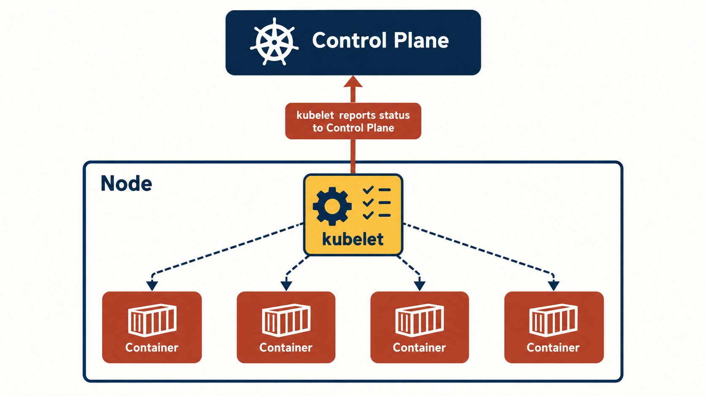

**Technical perspective:** The kubelet is the ultimate authority on node execution:
- **Systemd Service Troubleshooting:** Kubelet runs as a native systemd unit (`systemctl status kubelet`, `journalctl -u kubelet -f`). Misconfigured cgroup drivers (`cgroupfs` vs `systemd`) are the #1 cause of kubelet boot failure.
- **Port 10250 Security:** Kubelet exposes an HTTPS API on port 10250 for `kubectl logs` and `kubectl exec`. This endpoint must be secured with `--anonymous-auth=false` and `--authorization-mode=Webhook` to prevent unauthenticated remote code execution.

### Component architecture flow

<iframe src="diagrams/topic-09.html" width="100%" height="560" style="border:none;"></iframe>

> [!TIP]
> View the interactive animated diagram in [diagrams/topic-09.html](diagrams/topic-09.html).

**Part 2 — Analogy / Zine:** Receives the work order from the office and does headcounts to ensure assigned tenants are present and healthy.

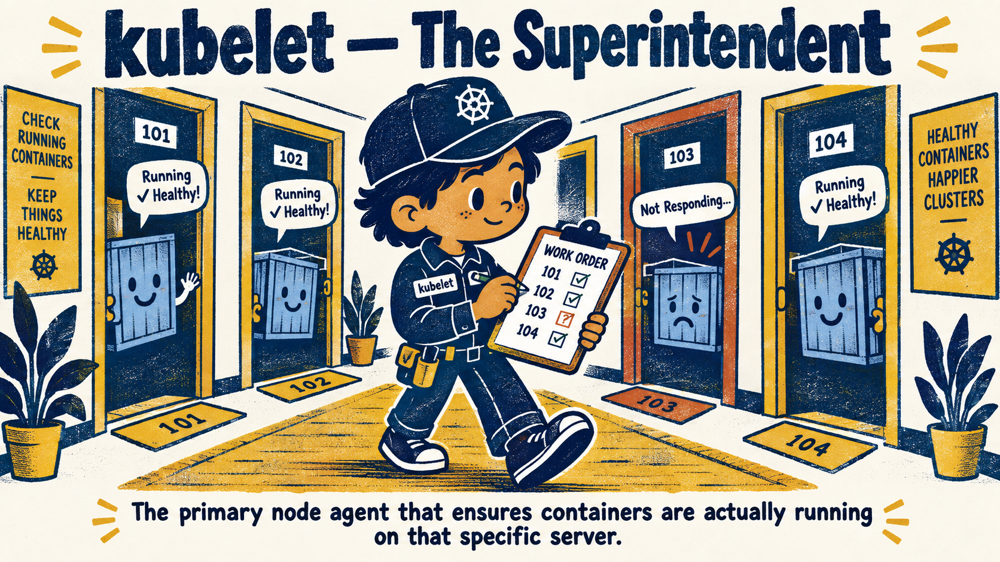

**Zine explanation:** The Superintendent image captures the kubelet's position as the node-level agent that translates API-level Pod specs into actual running containers. Just as a building superintendent manages day-to-day operations — ensuring units are properly maintained, heating is working, and problems are reported to the office — the kubelet watches for Pods assigned to its node, instructs the container runtime (via CRI gRPC) to start/stop containers, mounts volumes, runs liveness and readiness probes, and reports node status back to the control plane. The kubelet is the only Kubernetes component that runs as a native systemd service rather than a container — because it must exist before any container infrastructure is available.

* **Zine Text & Layout:**
* (Top): "kubelet — The Superintendent"
* (Caption): "The primary node agent that ensures containers are actually running on that specific server."

**Further reading**

- [Nodes and kubelet](https://kubernetes.io/docs/concepts/architecture/nodes/)
- [CKA Study Notes: Networking (Kube-Proxy & iptables)](../CKA_Study_Notes/07-networking.md)

### Demo — kubelet

<div style="background:#000;color:#fff;border-radius:8px;padding:1rem;overflow:auto;box-shadow:0 2px 8px rgba(0,0,0,.25);"><pre style="background:transparent;color:#fff;margin:0;white-space:pre-wrap;">
SETUP
  kubectl create namespace zine-demo
  kubectl run demo-pod --image=nginx -n zine-demo
  kubectl wait --for=condition=Ready pod/demo-pod -n zine-demo --timeout=60s

STEPS
  1. kubectl get pod demo-pod -n zine-demo -o jsonpath='{.status.conditions}'
  2. docker exec zine-worker bash -lc "ps -ef | grep '[k]ubelet'"

WHAT YOU SHOULD SEE
  Conditions list Initialized, Ready, ContainersReady, PodScheduled, all 'True'. The process listing shows kubelet running inside the kind worker container.

CLEANUP
  kubectl delete namespace zine-demo

NOTE
  The Pod's conditions are reported by the kubelet on that node.
</pre></div>


### Knowledge Check — Quiz

**Q1: If a container's liveness probe fails consecutively beyond failureThreshold, what action does the kubelet take?**

- [ ] A) The kubelet removes the Pod from Service endpoints without restarting the container.
- [ ] B) The kubelet terminates the container and restarts it according to the Pod's restartPolicy.
- [ ] C) The kubelet evicts the Pod to a different worker node.
- [ ] D) The kubelet drains the entire node.

<details>
<summary>Reveal Answer &amp; Explanation</summary>

**Correct Answer:** B) The kubelet terminates the container and restarts it according to the Pod's restartPolicy.

**Explanation:** Liveness probe failures indicate an unhealthy process that cannot recover on its own; kubelet kills the container and restarts it according to restartPolicy.

</details>

**Q2: How does the kubelet authenticate itself when communicating with the kube-apiserver?**

- [ ] A) Using plain HTTP with no authentication.
- [ ] B) Using mutual TLS (mTLS) with client certificates typically issued in the system:nodes group.
- [ ] C) Using the host operating system's root password.
- [ ] D) Through SSH key exchange on port 22.

<details>
<summary>Reveal Answer &amp; Explanation</summary>

**Correct Answer:** B) Using mutual TLS (mTLS) with client certificates typically issued in the system:nodes group.

**Explanation:** Kubelets use client X.509 certificates belonging to the system:nodes group, authorized by the Node authorization mode on the API server.

</details>

**Q3: Why does `kube-proxy` operating in IPVS mode scale better in clusters with tens of thousands of Services compared to iptables mode?**

- [ ] A) IPVS compiles packet routing rules directly into Python scripts.
- [ ] B) IPVS uses hash tables with O(1) lookup complexity, whereas iptables uses sequential rule lists with O(n) traversal latency.
- [ ] C) IPVS runs in user-space, avoiding kernel context switches.
- [ ] D) IPVS eliminates the need for network interface cards.

<details>
<summary>Reveal Answer &amp; Explanation</summary>

**Correct Answer:** B) IPVS uses hash tables with O(1) lookup complexity, whereas iptables uses sequential rule lists with O(n) traversal latency.

**Explanation:** In iptables mode, packet processing traverses sequential chains of rules whose evaluation cost grows linearly O(n) with service count. IPVS uses kernel hash tables offering near-constant O(1) latency regardless of service scale.

</details>

**Q4: What is the primary benefit and trade-off of setting `externalTrafficPolicy: Local` on a Service of type NodePort or LoadBalancer?**

- [ ] A) Benefit: Preserves client source IP and avoids extra network hops; Trade-off: Potential uneven traffic distribution if pods are not evenly distributed across all nodes.
- [ ] B) Benefit: Enables automatic gzip compression; Trade-off: Disables TLS termination.
- [ ] C) Benefit: Encrypts packet payloads; Trade-off: Doubles CPU consumption.
- [ ] D) Benefit: Allows routing across external internet gateways; Trade-off: Disables DNS resolution.

<details>
<summary>Reveal Answer &amp; Explanation</summary>

**Correct Answer:** A) Benefit: Preserves client source IP and avoids extra network hops; Trade-off: Potential uneven traffic distribution if pods are not evenly distributed across all nodes.

**Explanation:** Setting `externalTrafficPolicy: Local` prevents kube-proxy from SNATing the client IP to the node IP and only forwards traffic to local pods on the entry node, preserving the client IP address but dropping or skewing traffic if that node lacks pod endpoints.

</details>

**Q5: What Linux kernel table does `kube-proxy` rely on in iptables mode to track bi-directional connection states for translated Service IPs?**

- [ ] A) ARP cache table
- [ ] B) Netfilter Connection Tracking (conntrack) table
- [ ] C) BGP routing table
- [ ] D) DNS lookup table

<details>
<summary>Reveal Answer &amp; Explanation</summary>

**Correct Answer:** B) Netfilter Connection Tracking (conntrack) table

**Explanation:** Netfilter's `conntrack` facility tracks stateful network flows so reply packets from backend pods can be un-DNATed back to the original cluster virtual IP and returned to the client seamlessly.

</details>

**Q6: Which Kubernetes API resource replaced the legacy `Endpoints` resource to improve kube-proxy performance and control plane scalability in large clusters?**

- [ ] A) IngressRoute
- [ ] B) EndpointSlice
- [ ] C) ServiceMesh
- [ ] D) VirtualIPMap

<details>
<summary>Reveal Answer &amp; Explanation</summary>

**Correct Answer:** B) EndpointSlice

**Explanation:** The `EndpointSlice` resource breaks large monolithic Endpoints objects (which had to be re-sent entirely on any single pod change) into scalable chunks of 100 endpoints by default, drastically lowering API bandwidth and kube-proxy processing time.

</details>

## 10. kube-proxy

**Part 1 — Technical Discussion:** `kube-proxy` is the network proxy that runs on every node in the cluster, responsible for implementing the Kubernetes **Service** virtual IP abstraction (ClusterIP). It does not act as an application-level reverse proxy; rather, it programs host Linux kernel networking rules to intercept traffic destined for Service IPs and translate them to Pod backend IPs.

### Operating Modes & Evolution
- **iptables Mode (Default):**
  - Programs Netfilter chains (`PREROUTING`, `OUTPUT`, `KUBE-SERVICES`, `KUBE-SVC-*`, `KUBE-SEP-*`).
  - Implements random load balancing using the `statistic` module (`-m statistic --mode random --probability 0.5`).
  - Limitation: Sequential rule evaluation causes $O(n)$ latency degradation when cluster Services exceed 5,000+.
- **IPVS Mode (High Scale):**
  - Utilizes Linux IP Virtual Server (L4 transport balancer) built into the Linux kernel.
  - Implements $O(1)$ hash table lookups with configurable load balancing algorithms (round-robin, least connections, source hashing).
- **Userspace Mode (Obsolete):**
  - Routed packets via user-space socket copies; deprecated due to excessive context-switch overhead.

### Linux Netfilter & Connection Tracking
- **DNAT (Destination NAT):** Rewrites the destination IP from virtual ClusterIP (`10.96.x.x`) to the selected Pod IP (`10.244.x.x`).
- **SNAT / Masquerade:** Rewrites source IP when traffic leaves the pod network or when `externalTrafficPolicy: Cluster` is used on NodePort.
- **conntrack:** Relies on the Linux kernel connection tracking table (`/proc/net/nf_conntrack`) to ensure return packets are un-NATed symmetrically.

```yaml
# service-network-spec.yaml
# WHY THIS YAML: This ClusterIP Service triggers kube-proxy's iptables/IPVS programming.
# 'type: ClusterIP': creates a virtual IP that exists nowhere physically.
#   It works ONLY because kube-proxy programs iptables DNAT rules on every node.
# 'selector: app: backend-api': kube-proxy reads the matching EndpointSlice to know
#   which Pod IPs to include in the DNAT rules. Rules update as Pods come and go.
# 'port: 80 -> targetPort: 8080': iptables rewrites BOTH destination IP and port.
# Without kube-proxy's rules, this ClusterIP would be completely unreachable.
apiVersion: v1
kind: Service
metadata:
  name: internal-api
spec:
  type: ClusterIP
  selector:
    app: backend-api
  ports:
  - protocol: TCP
    port: 80
    targetPort: 8080
```

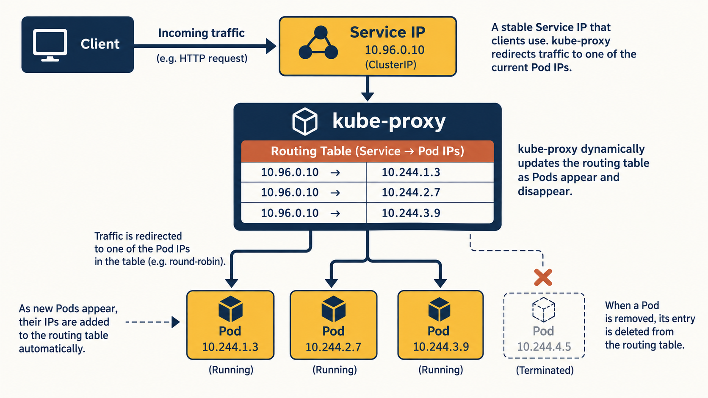

**Technical perspective:** Understanding kube-proxy is essential for debugging service connectivity:
- **Virtual IP Non-Routability:** ClusterIPs are virtual synthetic IPs that do not belong to any physical or virtual network interface (`ip addr show` will never display a ClusterIP). Ping (`ICMP`) to a ClusterIP will fail by design unless explicitly answered by iptables.
- **Conntrack Table Exhaustion:** High-volume UDP workloads (such as DNS floods) can fill `/proc/sys/net/netfilter/nf_conntrack_max`, leading to dropped connections across the entire node.

### Component architecture flow

<iframe src="diagrams/topic-10.html" width="100%" height="560" style="border:none;"></iframe>

> [!TIP]
> View the interactive animated diagram in [diagrams/topic-10.html](diagrams/topic-10.html).

**Part 2 — Analogy / Zine:** Updates a directory on the fly so visitors find the right unit, even as tenants swap out.

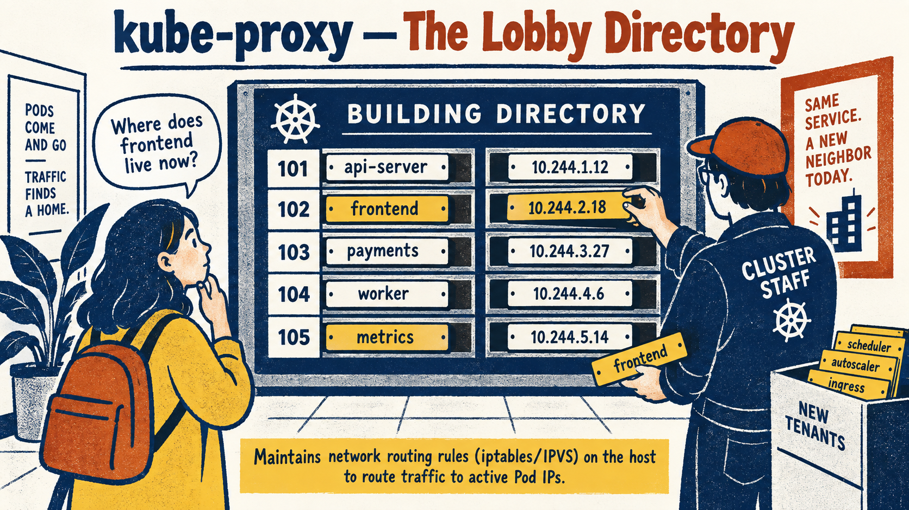

**Zine explanation:** The Lobby Directory image represents kube-proxy's role as the network translation layer that makes virtual Service IPs functional. Just as a lobby directory tells you which apartment number maps to which resident — and keeps that directory current as tenants move in and out — kube-proxy programs iptables/IPVS rules on every node so that traffic destined for a ClusterIP (a virtual, non-routable IP) is NAT-translated to the real Pod IP of a healthy backend. The directory is always current: when EndpointSlices change because Pods are added or removed, kube-proxy re-programs the rules. Without kube-proxy, the ClusterIP is just an IP address that goes nowhere.

* **Zine Text & Layout:**
* (Top): "kube-proxy — The Lobby Directory"
* (Caption): "Maintains network routing rules (iptables/IPVS) on the host to route traffic to active Pod IPs."

**Further reading**

- [kube-proxy](https://kubernetes.io/docs/reference/command-line-tools-reference/kube-proxy/)
- [Service proxying](https://kubernetes.io/docs/concepts/services-networking/service-traffic-policies/)
- [CKA Study Notes: Core Concepts (Container Runtime & CRI)](../CKA_Study_Notes/01-core-concepts.md)

### Demo — kube-proxy

<div style="background:#000;color:#fff;border-radius:8px;padding:1rem;overflow:auto;box-shadow:0 2px 8px rgba(0,0,0,.25);"><pre style="background:transparent;color:#fff;margin:0;white-space:pre-wrap;">
SETUP
  kubectl create namespace zine-demo
  kubectl create deployment demo --image=nginx --replicas=3 -n zine-demo
  kubectl rollout status deployment/demo -n zine-demo
  kubectl expose deployment demo --port=80 -n zine-demo

STEPS
  1. kubectl get endpoints demo -n zine-demo
  2. docker exec zine-worker bash -lc "iptables -t nat -L KUBE-SERVICES -n | grep zine-demo"

WHAT YOU SHOULD SEE
  Endpoints lists 3 Pod IPs. The iptables output has a rule for the demo Service on port 80.

CLEANUP
  kubectl delete namespace zine-demo

NOTE
  If your cluster runs kube-proxy in IPVS mode, use 'sudo ipvsadm -Ln' instead. The Endpoints list and the rules line up.
</pre></div>


### Knowledge Check — Quiz

**Q1: What is the key performance advantage of kube-proxy running in ipvs mode compared to standard iptables mode in large clusters?**

- [ ] A) IPVS compresses network packets using gzip.
- [ ] B) IPVS uses hash tables with O(1) lookup complexity, whereas iptables uses sequential rule chains with O(N) evaluation latency.
- [ ] C) IPVS replaces TCP with UDP for faster packet transmission.
- [ ] D) IPVS eliminates the need for container network interfaces.

<details>
<summary>Reveal Answer &amp; Explanation</summary>

**Correct Answer:** B) IPVS uses hash tables with O(1) lookup complexity, whereas iptables uses sequential rule chains with O(N) evaluation latency.

**Explanation:** Sequential iptables rule chains incur linear O(N) processing overhead as rule counts grow to tens of thousands; IPVS uses ipset hash tables providing near-constant O(1) routing latency.

</details>

**Q2: When an application inside a Pod sends traffic to a ClusterIP:port, where is the destination IP translated to an actual backend Pod IP?**

- [ ] A) By the CoreDNS pod using DNS round-robin.
- [ ] B) In the Linux kernel on the sending node via iptables/IPVS NAT rules maintained by kube-proxy.
- [ ] C) In the cloud provider's external hardware gateway.
- [ ] D) Inside the application container's glibc runtime.

<details>
<summary>Reveal Answer &amp; Explanation</summary>

**Correct Answer:** B) In the Linux kernel on the sending node via iptables/IPVS NAT rules maintained by kube-proxy.

**Explanation:** The virtual ClusterIP does not exist on any physical interface; packet destination is rewritten (DNAT) directly inside the node's kernel by the netfilter rules programmed by kube-proxy.

</details>

**Q3: In the modern Kubernetes container execution hierarchy, what is the role of `containerd-shim`?**

- [ ] A) It compiles Go source code inside the container during startup.
- [ ] B) It serves as a lightweight parent process for the container, holding stdin/stdout/stderr pipes and exit status open so the container daemon (`containerd`) can restart without terminating running containers.
- [ ] C) It manages node-level DNS caching.
- [ ] D) It allocates persistent disk volumes from cloud storage providers.

<details>
<summary>Reveal Answer &amp; Explanation</summary>

**Correct Answer:** B) It serves as a lightweight parent process for the container, holding stdin/stdout/stderr pipes and exit status open so the container daemon (`containerd`) can restart without terminating running containers.

**Explanation:** `containerd-shim` sits between containerd and runc. It holds container file descriptors open, captures exit codes, and allows daemonless containers that remain running even if containerd is restarted or upgraded.

</details>

**Q4: Which CLI diagnostic tool is specifically designed for inspecting and troubleshooting the Kubernetes CRI runtime directly on a worker node without relying on Docker?**

- [ ] A) kubectl
- [ ] B) crictl
- [ ] C) kubeadm
- [ ] D) systemd-analyze

<details>
<summary>Reveal Answer &amp; Explanation</summary>

**Correct Answer:** B) crictl

**Explanation:** `crictl` is the official CRI-compatible debugging CLI tool maintained by the Kubernetes SIG-node community, designed specifically to inspect pods, containers, and images through the CRI gRPC interface.

</details>

**Q5: What is the purpose of configuring a `RuntimeClass` in Kubernetes?**

- [ ] A) To select the JVM version used by Java web applications.
- [ ] B) To select alternative OCI runtimes (such as gVisor `runsc` for kernel sandbox isolation or Kata Containers for lightweight VM isolation) for specific Pod workloads.
- [ ] C) To assign priority classes to batch jobs.
- [ ] D) To enforce storage quotas on local volumes.

<details>
<summary>Reveal Answer &amp; Explanation</summary>

**Correct Answer:** B) To select alternative OCI runtimes (such as gVisor `runsc` for kernel sandbox isolation or Kata Containers for lightweight VM isolation) for specific Pod workloads.

**Explanation:** `RuntimeClass` allows cluster administrators to define different container runtimes (e.g., standard `runc`, sandbox-isolated `runsc`, or hardware-virtualized `kata`) and allow pods to select them via `spec.runtimeClassName`.

</details>

**Q6: What happens when a container image is specified with a tag like `:latest` and `imagePullPolicy` is omitted?**

- [ ] A) The image is never pulled if an image with the same name exists locally.
- [ ] B) The pull policy defaults to `Always`, forcing the Kubelet to contact the registry to check whether a newer digest exists before starting the container.
- [ ] C) The Kubelet fails container creation with an ErrImageNeverPull error.
- [ ] D) The image is compiled from the nearest git branch.

<details>
<summary>Reveal Answer &amp; Explanation</summary>

**Correct Answer:** B) The pull policy defaults to `Always`, forcing the Kubelet to contact the registry to check whether a newer digest exists before starting the container.

**Explanation:** When an image tag is `:latest` or omitted, `imagePullPolicy` defaults to `Always`. For any explicit version tag (e.g. `:v1.2.3`), it defaults to `IfNotPresent`.

</details>

## 11. Container Runtime & CRI

**Part 1 — Technical Discussion:** The **Container Runtime** is the software stack on each worker node responsible for executing containers. Kubernetes interacts with container runtimes via the **Container Runtime Interface (CRI)**, a gRPC API that standardizes how the kubelet manages container sandboxes, image pulling, and container lifecycles across diverse runtimes (containerd, CRI-O).

### CRI Architecture: High-Level vs. Low-Level Runtimes
- **CRI Layer (containerd / CRI-O):** Manages image distribution, local image storage snapshots, lifecycle events, and communicates with the kubelet via Unix domain sockets (e.g., `/run/containerd/containerd.sock`).
- **OCI Layer (runc / crun):** Low-level Open Container Initiative compliant runtime that invokes kernel system calls (`clone`, `unshare`, `pivot_root`, `setns`) to configure namespaces and cgroups, spawning the actual isolated Linux process.
- **crictl CLI Utility:** The official CKA command-line tool for inspecting CRI runtimes directly (`crictl pods`, `crictl ps`, `crictl images`, `crictl logs`).

### Linux OS & Kernel Foundation
- **Namespaces:** Isolates visibility per container (Mount `mnt`, Process ID `pid`, Network `net`, Inter-Process `ipc`, Hostname `uts`, User `user`).
- **Control Groups (cgroups v2):** Enforces resource boundaries under unified hierarchy `/sys/fs/cgroup/kubepods.slice/`.
- **OverlayFS:** Union filesystem combining read-only image layers (`lowerdir`), a thin writable container layer (`upperdir`), and a merged execution mount (`merged`).

```yaml
# oci-security-pod.yaml
# WHY THIS YAML: These security fields are translated by containerd into OCI runtime spec,
#   which runc passes to Linux kernel syscalls when creating the container sandbox.
# 'runAsNonRoot: true': containerd verifies UID != 0 before starting the container.
# 'seccompProfile: RuntimeDefault': containerd loads a BPF filter blocking dangerous syscalls.
# 'allowPrivilegeEscalation: false': sets the no_new_privs prctl flag via runc.
# 'capabilities.drop: ALL': runc calls cap_set_proc() stripping all Linux capabilities.
apiVersion: v1
kind: Pod
metadata:
  name: hardened-container
spec:
  securityContext:
    runAsNonRoot: true
    seccompProfile:
      type: RuntimeDefault
  containers:
  - name: app
    image: registry.k8s.io/pause:3.9
    securityContext:
      allowPrivilegeEscalation: false
      readOnlyRootFilesystem: true
      capabilities:
        drop:
        - ALL
```

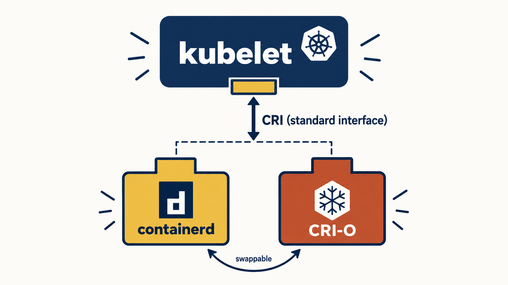

**Technical perspective:** Dockershim was permanently removed in Kubernetes 1.24, making containerd and CRI-O the standard production runtimes:
- **cgroup Driver Alignment:** Both containerd (`SystemdCgroup = true` in `/etc/containerd/config.toml`) and kubelet (`cgroupDriver: systemd`) must match systemd. Mismatched drivers cause node instability and crash loops.
- **Image Garbage Collection:** Kubelet instructs CRI to clean up unused image layers when disk utilization passes `imageGCHighThresholdPercent` (default 85%).

### Component architecture flow

<iframe src="diagrams/topic-11.html" width="100%" height="560" style="border:none;"></iframe>

> [!TIP]
> View the interactive animated diagram in [diagrams/topic-11.html](diagrams/topic-11.html).

**Part 2 — Analogy / Zine:** The physical crew carrying boxes, operating under a standard universal contract.

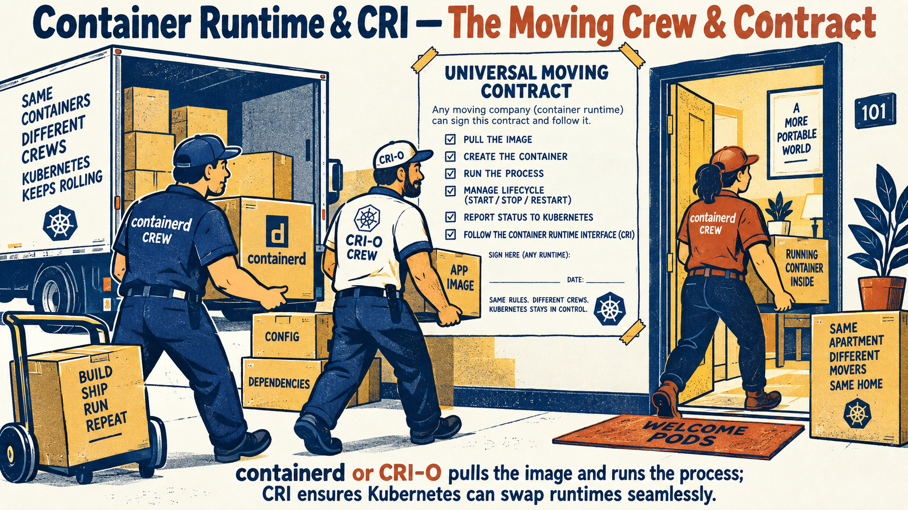

**Zine explanation:** The Maintenance Staff image depicts the Container Runtime's (CRI) role as the operational layer between Kubernetes' orchestration decisions and the actual Linux kernel mechanics of running processes. Just as maintenance staff in a building don't design apartments but are essential for physically making them livable — hooking up plumbing, power, and walls — containerd (or CRI-O) translates kubelet instructions into kernel-level calls: creating cgroup hierarchies for resource limits, configuring Linux namespaces for isolation, mounting OverlayFS layers for the container filesystem, and invoking runc to spawn the actual process. Without the CRI layer, kubelet's PodSpec has no way to become a running process.

* **Zine Text & Layout:**
* (Top): "Container Runtime & CRI — The Maintenance Staff"
* (Caption): "Runs the actual containers via a standardized gRPC interface, handling image pulls, sandbox creation, and cgroup isolation."

**Further reading**

- [Container runtimes](https://kubernetes.io/docs/setup/production-environment/container-runtimes/)
- [CRI specification](https://github.com/kubernetes/cri-api)
- [CKA Study Notes: Core Concepts (Pods)](../CKA_Study_Notes/01-core-concepts.md)

### Demo — Container Runtime & CRI

<div style="background:#000;color:#fff;border-radius:8px;padding:1rem;overflow:auto;box-shadow:0 2px 8px rgba(0,0,0,.25);"><pre style="background:transparent;color:#fff;margin:0;white-space:pre-wrap;">
SETUP
  docker ps --filter name=zine-

STEPS
  1. kubectl get nodes -o jsonpath='{.items[*].status.nodeInfo.containerRuntimeVersion}'; echo
  2. docker exec zine-worker crictl ps

WHAT YOU SHOULD SEE
  First command prints something like containerd://1.7.x. crictl ps lists running containers straight from the runtime.

CLEANUP
  (nothing to clean up)

NOTE
  crictl bypasses Kubernetes and talks to the runtime through CRI. Run it on the node, not your laptop.
</pre></div>


### Knowledge Check — Quiz

**Q1: What role does the Container Runtime Interface (CRI) play in the Kubernetes node architecture?**

- [ ] A) It compiles application source code into container images on the worker node.
- [ ] B) It is a gRPC interface that standardizes how kubelet communicates with pluggable container runtimes like containerd or CRI-O.
- [ ] C) It encrypts network traffic between pods across nodes.
- [ ] D) It manages persistent disk volume attachments in cloud storage.

<details>
<summary>Reveal Answer &amp; Explanation</summary>

**Correct Answer:** B) It is a gRPC interface that standardizes how kubelet communicates with pluggable container runtimes like containerd or CRI-O.

**Explanation:** CRI defines the gRPC protobuf specification for runtime and image services, allowing Kubernetes to support any compliant runtime without vendor lock-in.

</details>

**Q2: Why does a Pod sandbox include a 'pause' (or infra) container?**

- [ ] A) To pause container execution when the node is low on memory.
- [ ] B) To hold the Linux network, IPC, and mount namespaces that all containers in the Pod share throughout its lifecycle.
- [ ] C) To provide a graphical terminal interface for container debugging.
- [ ] D) To cache container image layers locally.

<details>
<summary>Reveal Answer &amp; Explanation</summary>

**Correct Answer:** B) To hold the Linux network, IPC, and mount namespaces that all containers in the Pod share throughout its lifecycle.

**Explanation:** The pause container holds the shared namespaces (particularly the network namespace) so that if an application container restarts, the Pod IP and network interface remain intact.

</details>

**Q3: What is the primary role of the `pause` container (infrastructure container) in a Kubernetes Pod?**

- [ ] A) It pauses execution of containers when CPU usage exceeds 90%.
- [ ] B) It initializes and holds the shared Linux namespaces (Network, IPC) so application containers can join the same network space and communicate over localhost.
- [ ] C) It performs periodic health checks against worker node disks.
- [ ] D) It compiles container logs into Prometheus metrics.

<details>
<summary>Reveal Answer &amp; Explanation</summary>

**Correct Answer:** B) It initializes and holds the shared Linux namespaces (Network, IPC) so application containers can join the same network space and communicate over localhost.

**Explanation:** The pause container serves as the parent anchor for the Pod sandbox. It requests and holds the network interface and IPC namespaces open; if an application container restarts, the pod's IP and port bindings remain intact.

</details>

**Q4: When a Pod is being terminated gracefully, what sequence of events occurs on the worker node?**

- [ ] A) The Kubelet immediately sends SIGKILL to all processes and wipes the disk.
- [ ] B) The Kubelet executes any configured `preStop` lifecycle hooks, sends `SIGTERM` to container processes, waits up to `terminationGracePeriodSeconds` (default 30s), and sends `SIGKILL` only if processes have not exited.
- [ ] C) The Kubelet pauses all other pods on the node until the target container shuts down.
- [ ] D) The Kubelet drains the node's memory into swap space.

<details>
<summary>Reveal Answer &amp; Explanation</summary>

**Correct Answer:** B) The Kubelet executes any configured `preStop` lifecycle hooks, sends `SIGTERM` to container processes, waits up to `terminationGracePeriodSeconds` (default 30s), and sends `SIGKILL` only if processes have not exited.

**Explanation:** Graceful termination runs `preStop` hooks first, sends `SIGTERM` to allow in-flight connections to finish, waits for the grace period (default 30s), and issues `SIGKILL` as a last resort.

</details>

**Q5: What is the difference between a Pod's `restartPolicy: Always` versus `restartPolicy: OnFailure`?**

- [ ] A) Always restarts containers regardless of exit status (0 or non-zero); OnFailure restarts only if the container exits with a non-zero error code.
- [ ] B) Always applies to worker nodes; OnFailure applies only to the control plane.
- [ ] C) Always restarts the host machine; OnFailure restarts only the Docker daemon.
- [ ] D) Always is used exclusively for batch Jobs; OnFailure is used for Deployments.

<details>
<summary>Reveal Answer &amp; Explanation</summary>

**Correct Answer:** A) Always restarts containers regardless of exit status (0 or non-zero); OnFailure restarts only if the container exits with a non-zero error code.

**Explanation:** `Always` ensures containers are continually restarted even after clean exits (code 0), which is standard for long-running services. `OnFailure` restarts containers only on non-zero exit codes (crashes), standard for batch jobs.

</details>

**Q6: How do multiple containers in the same Pod access shared local storage?**

- [ ] A) By opening an NFS socket between their respective IP addresses.
- [ ] B) By declaring a shared `volume` in `spec.volumes` (e.g. `emptyDir: {}`) and mounting it in each container's `volumeMounts`.
- [ ] C) By writing directly to the host's `/root` directory.
- [ ] D) Containers in the same pod cannot share filesystem volumes.

<details>
<summary>Reveal Answer &amp; Explanation</summary>

**Correct Answer:** B) By declaring a shared `volume` in `spec.volumes` (e.g. `emptyDir: {}`) and mounting it in each container's `volumeMounts`.

**Explanation:** Volumes defined at the Pod level can be mounted into any or all containers in that Pod at chosen mount paths, enabling fast in-memory or disk file sharing between co-located containers.

</details>

## 12. Sidecar Containers

**Part 1 — Technical Discussion:** A **Sidecar Container** is a multi-container Pod architectural pattern where a secondary container runs alongside the primary application container to augment, proxy, or enhance its functionality (e.g., logging agents, Envoy service mesh proxies, metric exporters, vault credential refreshers).

### Shared Pod Sandbox Mechanics
- **Shared Network Namespace:** All containers within the same Pod share the exact same Linux network namespace (`netns`). They communicate with each other over the loopback interface (`localhost:port`) with zero network virtualization overhead.
- **Shared Volumes:** Containers share filesystem data in-memory or on-disk via `emptyDir` volumes, allowing log shippers (e.g., Fluent Bit) to tail logs written by application containers.
- **Native Sidecar Containers (K8s 1.28+):** Built directly into `initContainers` using `restartPolicy: Always`. Unlike legacy sidecars, native sidecars start *before* application containers and do not block Pod shutdown.

### Linux Namespace Sharing
- Processes in the Pod share the network namespace (`/proc/<pid>/ns/net`) and optionally the PID namespace if `shareProcessNamespace: true` is configured, allowing sidecars to monitor application PIDs directly.

```yaml
# native-sidecar-pod.yaml
# WHY THIS YAML: Demonstrates the native sidecar pattern (Kubernetes 1.28+).
# 'initContainers' with 'restartPolicy: Always': this is what makes it a native sidecar.
#   It starts BEFORE application containers but does NOT exit -- stays running alongside.
# 'shared-logs emptyDir volume': both containers mount the SAME Linux tmpfs directory.
#   The sidecar reads logs written by web-app because they share the same volume mount
#   -- enabled by the Pod's shared mount namespace (all containers share Pod volumes).
apiVersion: v1
kind: Pod
metadata:
  name: web-with-sidecar
spec:
  initContainers:
  - name: telemetry-sidecar
    image: registry.k8s.io/pause:3.9
    restartPolicy: Always
    volumeMounts:
    - name: shared-logs
      mountPath: /var/log/app
  containers:
  - name: web-app
    image: registry.k8s.io/pause:3.9
    volumeMounts:
    - name: shared-logs
      mountPath: /var/log/app
  volumes:
  - name: shared-logs
    emptyDir: {}
```

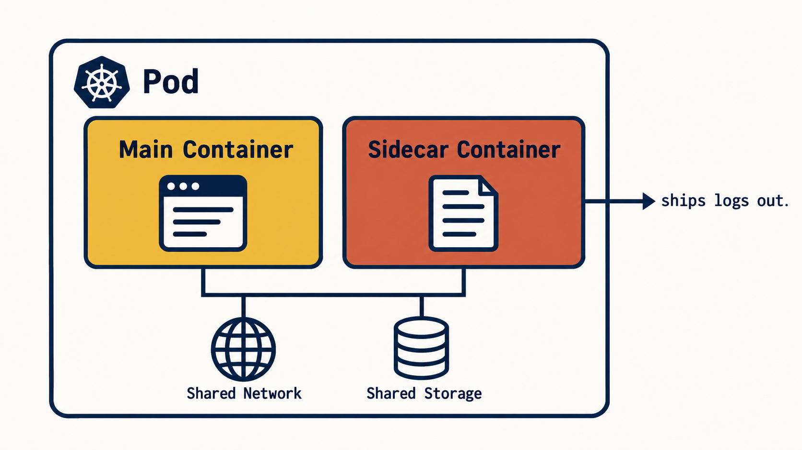

**Technical perspective:** Sidecars introduce operational trade-offs in resource footprint and lifecycle management:
- **Resource Summation:** Pod resource requests and limits equal the sum of all primary containers plus sidecar containers. Excessive sidecars reduce node scheduling density.
- **Shutdown Race Conditions:** With legacy sidecars, if the application container finishes but the sidecar keeps running, the Pod never terminates, causing Job failures. Native sidecars (`restartPolicy: Always`) solve this problem natively.

### Component architecture flow

<iframe src="diagrams/topic-12.html" width="100%" height="560" style="border:none;"></iframe>

> [!TIP]
> View the interactive animated diagram in [diagrams/topic-12.html](diagrams/topic-12.html).

**Part 2 — Analogy / Zine:** Sits in the same unit handling side tasks, like shipping out logs, without bothering the main tenant.

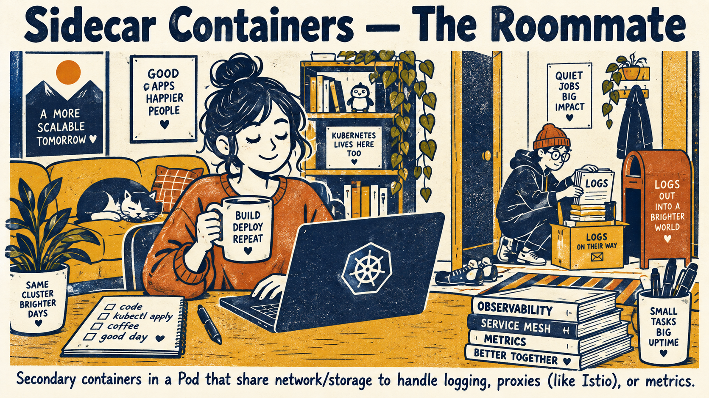

**Zine explanation:** The Roommate image perfectly captures sidecar containers' shared-namespace model. Just as two roommates share the same apartment (same address, same front door, same mailbox), sidecar containers in a Pod share the same Linux network namespace — meaning they communicate over `localhost` without crossing any network boundary — and share volumes declared in the Pod spec. The Envoy proxy sidecar in a service mesh intercepts all of the app container's traffic on localhost because they share the same network stack. The native sidecar (Kubernetes 1.28+) in `initContainers` with `restartPolicy: Always` starts before the app and stays alive, solving the Job-termination race condition that plagued legacy sidecar patterns.

* **Zine Text & Layout:**
* (Top): "Sidecar Containers — The Roommate"
* (Caption): "A helper container that shares the Pod's network namespace and volumes, running alongside the main container without coupling their code."

**Further reading**

- [Sidecar containers](https://kubernetes.io/docs/concepts/workloads/pods/sidecar-containers/)
- [CKA Study Notes: Application Lifecycle (Multi-Container Pods)](../CKA_Study_Notes/04-application-lifecycle-management.md)

### Demo — Sidecar Containers

<div style="background:#000;color:#fff;border-radius:8px;padding:1rem;overflow:auto;box-shadow:0 2px 8px rgba(0,0,0,.25);"><pre style="background:transparent;color:#fff;margin:0;white-space:pre-wrap;">
SETUP
  kubectl create namespace zine-demo

YAML  (sidecar-demo.yaml)
  apiVersion: v1
  kind: Pod
  metadata:
    name: sidecar-demo
  spec:
    containers:
    - name: main
      image: nginx
    - name: log-shipper
      image: busybox
      command: ["sh", "-c", "while true; do echo shipping logs; sleep 5; done"]

STEPS
  1. kubectl apply -f sidecar-demo.yaml -n zine-demo
  2. kubectl wait --for=condition=Ready pod/sidecar-demo -n zine-demo --timeout=60s
  3. kubectl get pod sidecar-demo -n zine-demo
  4. kubectl logs sidecar-demo -c log-shipper -n zine-demo

WHAT YOU SHOULD SEE
  READY shows 2/2: two containers, one Pod. The log-shipper logs print 'shipping logs' every 5 seconds.

CLEANUP
  kubectl delete namespace zine-demo

NOTE
  Two containers share one Pod: one address, one lifecycle.
</pre></div>


### Knowledge Check — Quiz

**Q1: How do two containers residing within the same Pod communicate over the network?**

- [ ] A) Through external Ingress controllers.
- [ ] B) Via localhost on their shared loopback network interface.
- [ ] C) By creating a public NodePort service.
- [ ] D) They cannot communicate over network sockets.

<details>
<summary>Reveal Answer &amp; Explanation</summary>

**Correct Answer:** B) Via localhost on their shared loopback network interface.

**Explanation:** All containers in a Pod share the exact same network namespace and IP address, meaning they reach each other directly via localhost and shared ports.

</details>

**Q2: What is the primary operational trade-off of deploying sidecar containers across thousands of application pods?**

- [ ] A) Incompatible CPU architectures between containers.
- [ ] B) Multiplied resource overhead (CPU/memory requests & limits) and increased pod startup/shutdown latency.
- [ ] C) Inability to mount volume storage.
- [ ] D) Breaking CoreDNS name resolution for the cluster.

<details>
<summary>Reveal Answer &amp; Explanation</summary>

**Correct Answer:** B) Multiplied resource overhead (CPU/memory requests & limits) and increased pod startup/shutdown latency.

**Explanation:** Every sidecar consumes reserved CPU and memory quota across every pod replica, and lifecycle coupling can complicate graceful shutdown if the sidecar terminates before the main app finishes.

</details>

**Q3: In Kubernetes 1.28+, how are native sidecar containers configured in a Pod specification?**

- [ ] A) Inside a top-level `spec.sidecars` field.
- [ ] B) Inside `spec.initContainers` with `restartPolicy: Always`.
- [ ] C) Inside `metadata.annotations` with `sidecar.istio.io/inject: true`.
- [ ] D) Inside `spec.containers` with `role: sidecar`.

<details>
<summary>Reveal Answer &amp; Explanation</summary>

**Correct Answer:** B) Inside `spec.initContainers` with `restartPolicy: Always`.

**Explanation:** Native sidecars are defined within `spec.initContainers` having `restartPolicy: Always`. They start before regular application containers and remain running for the entire lifecycle of the Pod.

</details>

**Q4: What problem does the native sidecar feature solve compared to traditional legacy multi-container Pod patterns?**

- [ ] A) It eliminates the need for container images.
- [ ] B) It guarantees that helper services (such as logging or service mesh proxies) start before app containers begin and terminate gracefully after app containers finish.
- [ ] C) It reduces container memory consumption to zero.
- [ ] D) It bypasses Linux cgroup CPU bandwidth throttling.

<details>
<summary>Reveal Answer &amp; Explanation</summary>

**Correct Answer:** B) It guarantees that helper services (such as logging or service mesh proxies) start before app containers begin and terminate gracefully after app containers finish.

**Explanation:** Legacy sidecars were regular containers with no deterministic startup or shutdown ordering, causing app containers to fail if proxies weren't ready, or preventing batch jobs from completing because the sidecar never exited.

</details>

**Q5: How do Service Mesh sidecars (such as Envoy in Istio or Linkerd) transparently intercept inbound and outbound TCP traffic for an application container?**

- [ ] A) By modifying the application source code at compile time.
- [ ] B) By using an init container (running with `NET_ADMIN` capability) to configure iptables PREROUTING and OUTPUT rules that redirect traffic to the sidecar's localhost proxy port.
- [ ] C) By assigning a separate IP address to the sidecar container.
- [ ] D) By intercepting packets at the hardware router layer.

<details>
<summary>Reveal Answer &amp; Explanation</summary>

**Correct Answer:** B) By using an init container (running with `NET_ADMIN` capability) to configure iptables PREROUTING and OUTPUT rules that redirect traffic to the sidecar's localhost proxy port.

**Explanation:** An `istio-init` container runs with `CAP_NET_ADMIN` to inject iptables rules into the Pod's shared network namespace, redirecting incoming and outgoing TCP flows to Envoy's local listening port (typically 15001/15006).

</details>

**Q6: How are compute resource requests (CPU and Memory) calculated for a Pod running both an application container and a sidecar container?**

- [ ] A) The Kubelet only accounts for the larger container's resources.
- [ ] B) The Pod's total resource request is the sum of the requests of all running application and sidecar containers.
- [ ] C) Sidecars do not consume Pod quota and run without resource tracking.
- [ ] D) The scheduler ignores sidecar limits during node placement.

<details>
<summary>Reveal Answer &amp; Explanation</summary>

**Correct Answer:** B) The Pod's total resource request is the sum of the requests of all running application and sidecar containers.

**Explanation:** Because regular and native sidecars run concurrently throughout the Pod lifecycle, the scheduler and kubelet calculate the Pod's total resource requests by summing the requests of all active containers.

</details>

## 13. Init Containers

**Part 1 — Technical Discussion:** **Init Containers** are specialized containers that run sequentially to completion before any application containers in the Pod are started. If an init container fails, the kubelet restarts the Pod until the init container succeeds (governed by `restartPolicy`).

### Primary Use Cases & Guarantees
- **Sequential Execution:** Multiple init containers run in strict declared array order (`init[0] -> init[1] -> init[2]`).
- **Prerequisite Blocking:** Verifies network dependencies (e.g., waiting for PostgreSQL or Redis with `nc -z` or `curl`) before the primary app starts.
- **Privileged Pre-flight Setup:** Can run with elevated Linux capabilities (`NET_ADMIN`) to configure iptables rules (e.g., Istio proxy redirection) while leaving the primary application completely unprivileged.
- **Filesystem Hydration:** Clones git repos, seeds configuration templates, or unpacks assets into a shared `emptyDir` volume.

### Linux Execution Flow
- Kubelet starts the init container sandbox, binds volumes, and monitors process exit code.
- Kubelet proceeds to the next container only when the process exits with **status code 0**.

```yaml
# init-container-dependency.yaml
# WHY THIS YAML: Init containers enforce startup prerequisites before the main app starts.
# The kubelet runs init containers IN ORDER, each must exit code 0 before the next starts.
# Common pattern: init container runs 'until nc -z postgres 5432; do sleep 2; done'
#   -- the main app container will not start until the DB port is confirmed open.
# Init containers share Pod volumes (emptyDir, PVCs), allowing pre-seeding of config
#   files, DB migrations, or secrets into shared storage before the app reads them.
apiVersion: v1
kind: Pod
metadata:
  name: app-with-preflight
spec:
  initContainers:
  - name: wait-for-db
    image: busybox:1.36
    command: ['sh', '-c', 'until nc -z -w 2 db-service 5432; do echo waiting for db...; sleep 2; done']
  - name: hydrate-config
    image: busybox:1.36
    command: ['sh', '-c', 'echo "database_url=postgres://db-service" > /work/app.env']
    volumeMounts:
    - name: config-vol
      mountPath: /work
  containers:
  - name: api
    image: registry.k8s.io/pause:3.9
    volumeMounts:
    - name: config-vol
      mountPath: /work
  volumes:
  - name: config-vol
    emptyDir: {}
```

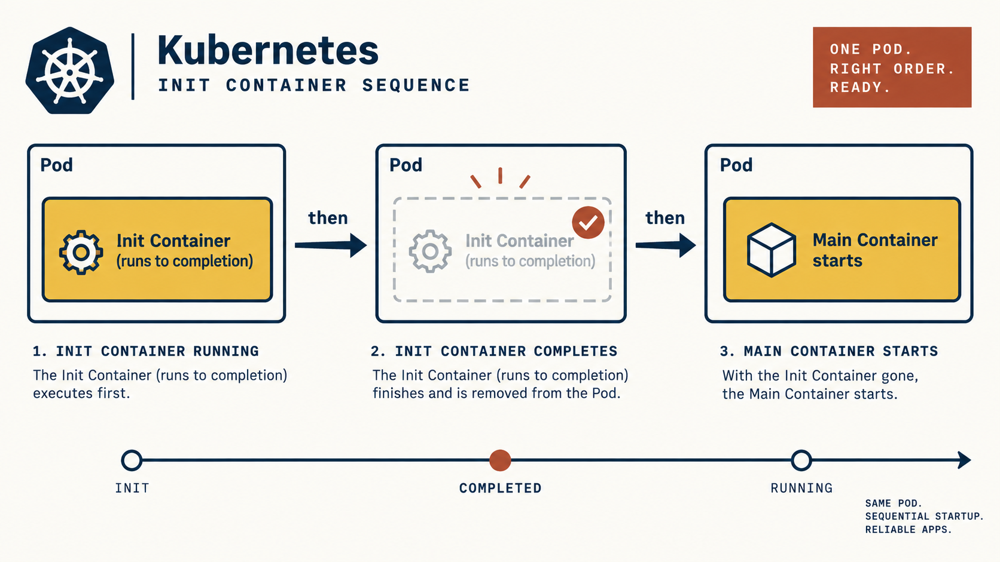

**Technical perspective:** Init containers must be idempotent because crashes or node reboots will cause them to re-execute from the beginning:
- **Resource Computation:** The effective resource request of a Pod is `max(max(init_containers), sum(app_containers))`. An init container requesting 4 CPU cores will cause the entire Pod to require 4 cores during scheduling, even if it runs for only 5 seconds.
- **Debugging Blocked Pods:** When a Pod is stuck in `Init:0/1`, run `kubectl logs <pod-name> -c <init-container-name>` to inspect why the preflight check is stalling.

### Component architecture flow

<iframe src="diagrams/topic-13.html" width="100%" height="560" style="border:none;"></iframe>

> [!TIP]
> View the interactive animated diagram in [diagrams/topic-13.html](diagrams/topic-13.html).

**Part 2 — Analogy / Zine:** Cleans and preps the unit, then leaves completely before the main tenant moves in.

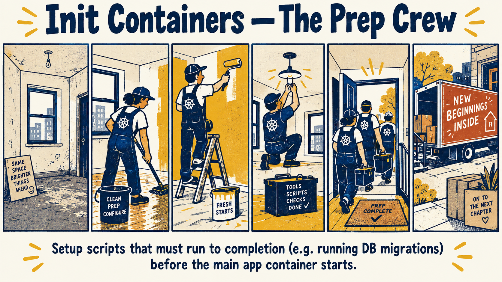

**Zine explanation:** The Pre-Move Checklist image maps directly to init containers' sequential, gate-keeping role. Just as a property manager runs through a mandatory checklist before handing over apartment keys — verify utilities are connected, locks are changed, inspection is signed — init containers run to completion in declared order before any application container starts. They enforce startup dependencies: the app container does not start until all init containers exit with code 0. An init container can wait for a database (`nc -z postgres 5432`), seed a ConfigMap file into a shared emptyDir volume, or configure iptables rules (with elevated privileges) that the unprivileged app container then benefits from.

* **Zine Text & Layout:**
* (Top): "Init Containers — The Pre-Move Checklist"
* (Caption): "Runs prerequisite setup tasks to completion before any application container starts — verifying dependencies and seeding data."

**Further reading**

- [Init containers](https://kubernetes.io/docs/concepts/workloads/pods/init-containers/)
- [CKA Study Notes: Application Lifecycle (Init Containers)](../CKA_Study_Notes/04-application-lifecycle-management.md)

### Demo — Init Containers

<div style="background:#000;color:#fff;border-radius:8px;padding:1rem;overflow:auto;box-shadow:0 2px 8px rgba(0,0,0,.25);"><pre style="background:transparent;color:#fff;margin:0;white-space:pre-wrap;">
SETUP
  kubectl create namespace zine-demo

YAML  (init-demo.yaml)
  apiVersion: v1
  kind: Pod
  metadata:
    name: init-demo
  spec:
    initContainers:
    - name: prep-crew
      image: busybox
      command: ["sh", "-c", "echo prepping unit...; sleep 10"]
    containers:
    - name: main-tenant
      image: nginx

STEPS
  1. kubectl apply -f init-demo.yaml -n zine-demo
  2. kubectl get pod init-demo -n zine-demo -w   # Ctrl+C after it shows Running
  3. kubectl logs init-demo -c prep-crew -n zine-demo

WHAT YOU SHOULD SEE
  STATUS reads Init:0/1, then PodInitializing, then Running. The init logs print 'prepping unit...'.

CLEANUP
  kubectl delete namespace zine-demo

NOTE
  The init container sleeps 10 seconds so the Init:0/1 state is easy to catch on screen.
</pre></div>


### Knowledge Check — Quiz

**Q1: What happens if an Init Container fails its execution (exits with non-zero status) and the Pod's restartPolicy is Always?**

- [ ] A) The main application container starts anyway.
- [ ] B) The kubelet restarts the failed Init Container repeatedly with exponential backoff until it succeeds.
- [ ] C) The Pod is immediately deleted from the cluster.
- [ ] D) The worker node is rebooted.

<details>
<summary>Reveal Answer &amp; Explanation</summary>

**Correct Answer:** B) The kubelet restarts the failed Init Container repeatedly with exponential backoff until it succeeds.

**Explanation:** Init containers must run sequentially to successful completion (exit 0) before any app container can launch; failures trigger kubelet restarts subject to restart policy backoff.

</details>

**Q2: In what order do multiple Init Containers defined in a Pod spec execute?**

- [ ] A) In parallel simultaneously.
- [ ] B) In the exact sequential order they are listed in the spec.initContainers array.
- [ ] C) In reverse alphabetical order by name.
- [ ] D) Randomly based on image pull completion.

<details>
<summary>Reveal Answer &amp; Explanation</summary>

**Correct Answer:** B) In the exact sequential order they are listed in the spec.initContainers array.

**Explanation:** Kubernetes guarantees strict sequential execution: Init Container 1 must finish with code 0 before Init Container 2 begins execution.

</details>

**Q3: In what order do multiple Init Containers execute within a Pod?**

- [ ] A) In parallel simultaneously to minimize startup latency.
- [ ] B) Sequentially, in the exact order they are defined in `spec.initContainers`, with each completing successfully before the next begins.
- [ ] C) In reverse alphabetical order based on their container name.
- [ ] D) In random order determined by the Kubelet.

<details>
<summary>Reveal Answer &amp; Explanation</summary>

**Correct Answer:** B) Sequentially, in the exact order they are defined in `spec.initContainers`, with each completing successfully before the next begins.

**Explanation:** Init containers run strictly sequentially. Each init container must run to completion with exit code 0 before the next init container is started. If any fails, the pod restarts according to its `restartPolicy`.

</details>

**Q4: Which of the following probe types is supported on standard Init Containers?**

- [ ] A) LivenessProbe
- [ ] B) ReadinessProbe
- [ ] C) StartupProbe
- [ ] D) None of the above (standard init containers do not support probes)

<details>
<summary>Reveal Answer &amp; Explanation</summary>

**Correct Answer:** D) None of the above (standard init containers do not support probes)

**Explanation:** Standard init containers do not support readiness, liveness, or startup probes because their readiness is directly defined by process termination with exit code 0.

</details>

**Q5: What is a major security advantage of performing database schema migrations or security credential downloads in an Init Container rather than the main application container?**

- [ ] A) Init containers are immune to Linux kernel vulnerabilities.
- [ ] B) Migration tools, compiler toolchains, or administrative database credentials do not need to be present inside the final production application container image.
- [ ] C) Init containers run without using network interfaces.
- [ ] D) Init containers bypass Kubernetes RBAC policies.

<details>
<summary>Reveal Answer &amp; Explanation</summary>

**Correct Answer:** B) Migration tools, compiler toolchains, or administrative database credentials do not need to be present inside the final production application container image.

**Explanation:** Separating setup into an init container keeps the runtime application container image minimal and secure (distroless), removing administrative tools, database migration utilities, and elevated credentials from the long-running attack surface.

</details>

**Q6: How does the Kubernetes scheduler calculate effective resource requests for a Pod with multiple Init Containers?**

- [ ] A) It takes the sum of all init containers plus all app containers.
- [ ] B) It takes the maximum of: (the highest init container request) or (the sum of all app/sidecar container requests).
- [ ] C) It completely ignores init container resource requests.
- [ ] D) It doubles the memory requested by the first init container.

<details>
<summary>Reveal Answer &amp; Explanation</summary>

**Correct Answer:** B) It takes the maximum of: (the highest init container request) or (the sum of all app/sidecar container requests).

**Explanation:** Because init containers run sequentially, only one runs at a time. Therefore, the scheduler computes the effective request as `max(max(init_container_requests), sum(app_container_requests))`.

</details>

## 14. CNI (Container Network Interface)

**Part 1 — Technical Discussion:** The **Container Network Interface (CNI)** is a CNCF specification that standardizes how third-party networking plugins configure Linux network namespaces for containers. Kubernetes mandates a flat, non-NAT network model across the entire cluster.

### Fundamental Kubernetes Networking Rules
1. Every Pod receives a unique, routable IP address within the cluster.
2. All Pods can communicate with all other Pods on any node without Network Address Translation (NAT).
3. All Nodes can communicate directly with all Pods without NAT.
4. The IP that a Pod sees for itself is the exact same IP that any other Pod sees for it.

### Linux Kernel Networking Mechanisms
- **Virtual Ethernet (veth) Pairs:** CNI creates a Linux `veth` pair (`veth-host` and `veth-pod`). One end is connected to the host network namespace (attached to bridge `cni0` or routed via eBPF), while the other is moved into the container's network namespace as `eth0`.
- **IPAM (IP Address Management):** Allocates subnets to worker nodes from cluster PodCIDR using plugins like `host-local` or cloud VPC IPAM.
- **Encapsulation vs. Direct Routing:**
  - *Overlay Networks (VXLAN / Geneve):* Encapsulates Pod L2 frames inside host UDP packets (Flannel, Calico VXLAN). Operates over any underlying network.
  - *Direct / BGP Routing:* Advertises Pod routes via BGP directly to physical or cloud routers (Calico BGP, Cilium BGP) with zero encapsulation overhead.

```yaml
# calico-ippool-spec.yaml
# WHY THIS YAML: This Calico IPPool defines the CIDR range for Pod IP allocation.
# 'cidr: 192.168.0.0/16': every Pod gets an IP from this block via CNI IPAM.
#   When kubelet calls the CNI ADD command for a new Pod, Calico allocates from here.
# 'ipipMode: Always': cross-node Pod traffic is IP-in-IP encapsulated, enabling
#   pod-to-pod routing across nodes without BGP routing support.
# 'natOutgoing: true': enables SNAT so Pod traffic leaving the cluster uses the node IP.
apiVersion: projectcalico.org/v3
kind: IPPool
metadata:
  name: default-ipv4-ippool
spec:
  cidr: 10.244.0.0/16
  ipipMode: Never
  vxlanMode: Always
  natOutgoing: true
  nodeSelector: all()
```

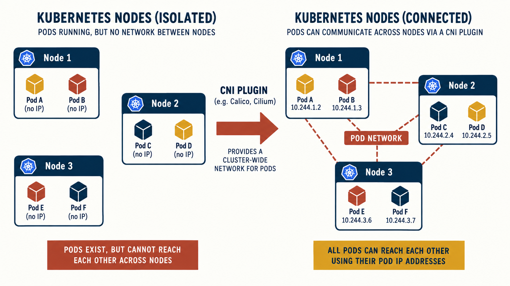

**Technical perspective:** Selecting and operating a CNI determines cluster security and performance:
- **MTU Sizing:** VXLAN encapsulation adds a 50-byte outer header. If host MTU is 1500, CNI interface MTU must be configured to 1450. MTU mismatches result in silent packet dropping for packets larger than the threshold.
- **eBPF Acceleration:** Modern CNIs (Cilium, Calico eBPF) bypass iptables entirely, programming eBPF programs directly into Linux kernel socket filters (`tc` / `xdp`), cutting network latency by up to 40%.

### Component architecture flow

<iframe src="diagrams/topic-14.html" width="100%" height="560" style="border:none;"></iframe>

> [!TIP]
> View the interactive animated diagram in [diagrams/topic-14.html](diagrams/topic-14.html).

**Part 2 — Analogy / Zine:** The crew that paves the roads and hands out addresses so tenants can reach each other.

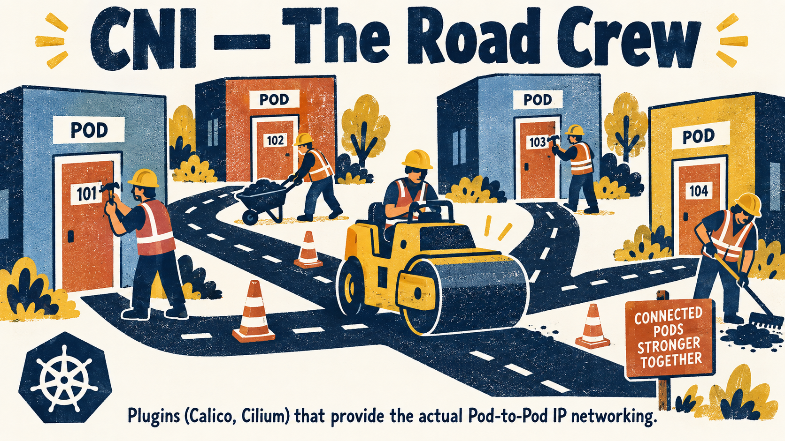

**Zine explanation:** The Wiring Crew image represents the CNI plugin's role in building the physical network fabric that Pods rely on. Just as a wiring crew installs the electrical and network cabling that makes apartments functional before tenants arrive — and that work is invisible once done — CNI plugins (Calico, Cilium, Flannel) run when a Pod is scheduled, create a virtual ethernet pair (veth), assign an IP address from the Pod CIDR, configure routing rules, and attach the interface to the Pod's network namespace. Once done, the Pod can communicate on the cluster network just like a properly wired apartment can plug in any device. NetworkPolicy enforcement is the CNI's equivalent of circuit breakers — selectively controlling which connections are allowed.

* **Zine Text & Layout:**
* (Top): "CNI — The Wiring Crew"
* (Caption): "Configures Pod networking on each node — assigning IPs, creating virtual interfaces, and establishing routes between Pods across nodes."

**Further reading**

- [Network plugins and CNI](https://kubernetes.io/docs/concepts/extend-kubernetes/compute-storage-net/network-plugins/)
- [CNI project](https://github.com/containernetworking/cni)
- [CKA Study Notes: Networking (CNI & Pod Networking)](../CKA_Study_Notes/07-networking.md)

### Demo — CNI (Container Network Interface)

<div style="background:#000;color:#fff;border-radius:8px;padding:1rem;overflow:auto;box-shadow:0 2px 8px rgba(0,0,0,.25);"><pre style="background:transparent;color:#fff;margin:0;white-space:pre-wrap;">
SETUP
  kubectl create namespace zine-demo
  kubectl create deployment demo --image=nginx --replicas=3 -n zine-demo
  kubectl rollout status deployment/demo -n zine-demo

STEPS
  1. kubectl get pods -n kube-system -o wide | grep -iE 'calico|cilium|flannel|kindnet'
  2. kubectl get pods -A -o custom-columns=NS:.metadata.namespace,POD:.metadata.name,IP:.status.podIP,NODE:.spec.nodeName

WHAT YOU SHOULD SEE
  A CNI Pod runs on each node (kindnet on kind, calico/cilium/flannel elsewhere). Every Pod has its own IP, even across nodes.

CLEANUP
  kubectl delete namespace zine-demo

NOTE
  Flat Pod addressing works because the CNI plugin paved the roads between nodes.
</pre></div>


### Knowledge Check — Quiz

**Q1: What fundamental networking requirement does the Kubernetes network model mandate for all CNI plugins?**

- [ ] A) Every pod must use the same IP address as its host worker node.
- [ ] B) All pods can communicate with all other pods across nodes on a flat network without NAT.
- [ ] C) Every pod must have a dedicated public IPv4 address.
- [ ] D) Nodes can only communicate via SSH tunnels.

<details>
<summary>Reveal Answer &amp; Explanation</summary>

**Correct Answer:** B) All pods can communicate with all other pods across nodes on a flat network without NAT.

**Explanation:** The fundamental Kubernetes IP-per-pod model requires that pods on any node can communicate with pods on any other node without Network Address Translation (NAT).

</details>

**Q2: What Linux kernel mechanism is typically created by a CNI plugin to connect a Pod's network namespace to the host network?**

- [ ] A) A virtual ethernet (veth) pair connecting the pod's eth0 to a host bridge or routing table.
- [ ] B) A loopback-only interface with no host connection.
- [ ] C) An NFS network mount point.
- [ ] D) A Unix domain socket in /tmp.

<details>
<summary>Reveal Answer &amp; Explanation</summary>

**Correct Answer:** A) A virtual ethernet (veth) pair connecting the pod's eth0 to a host bridge or routing table.

**Explanation:** A veth pair functions like a virtual patch cable: one end sits inside the pod's network namespace as eth0, and the peer end sits in the host namespace attached to a bridge or routing engine.

</details>

**Q3: What are the fundamental tenets of the Kubernetes network model that every CNI plugin must satisfy?**

- [ ] A) All pods share a single IP address and communicate using port offsets.
- [ ] B) Every pod receives a unique IP address reachable by every other pod in the cluster without NAT, and node agents (kubelet) can communicate with all pods on that node.
- [ ] C) Pods can only communicate with other pods running on the exact same physical host.
- [ ] D) All pod traffic must route through an external internet proxy.

<details>
<summary>Reveal Answer &amp; Explanation</summary>

**Correct Answer:** B) Every pod receives a unique IP address reachable by every other pod in the cluster without NAT, and node agents (kubelet) can communicate with all pods on that node.

**Explanation:** The Kubernetes IP-per-Pod model requires that all pods communicate with all other pods across nodes without NAT, and agents on a node can reach all pods on that same node directly.

</details>

**Q4: On Linux hosts running an overlay CNI (such as Calico VXLAN or Flannel), why must the CNI interface MTU be set lower than the physical host network MTU (e.g. 1450 vs 1500)?**

- [ ] A) To account for the 50-byte encapsulation header (Ethernet + IP + UDP + VXLAN) and prevent packet fragmentation.
- [ ] B) Because Linux kernel bridges do not support MTUs above 1450.
- [ ] C) To reduce memory consumption inside containerd.
- [ ] D) To comply with Wi-Fi 802.11 standards.

<details>
<summary>Reveal Answer &amp; Explanation</summary>

**Correct Answer:** A) To account for the 50-byte encapsulation header (Ethernet + IP + UDP + VXLAN) and prevent packet fragmentation.

**Explanation:** VXLAN encapsulation adds outer IP, UDP, and VXLAN headers (typically 50 bytes). If the CNI MTU matches the host MTU (1500), inner packets exceeding 1450 bytes will exceed physical MTU, causing silent packet drops or fragmentation.

</details>

**Q5: Where are CNI network configuration files and executable binaries stored on a standard Linux Kubernetes node?**

- [ ] A) Config: `/etc/cni/net.d/`, Binaries: `/opt/cni/bin/`
- [ ] B) Config: `/var/log/cni/`, Binaries: `/usr/bin/`
- [ ] C) Config: `/etc/kubernetes/manifests/`, Binaries: `/tmp/`
- [ ] D) Config: `/home/cni/`, Binaries: `/sbin/`

<details>
<summary>Reveal Answer &amp; Explanation</summary>

**Correct Answer:** A) Config: `/etc/cni/net.d/`, Binaries: `/opt/cni/bin/`

**Explanation:** Standard CNI paths on Linux are `/etc/cni/net.d/` for JSON configuration files (read by the runtime in lexicographical order) and `/opt/cni/bin/` for CNI plugin binaries (bridge, loopback, host-local, calico, cilium).

</details>

**Q6: What is the primary operational advantage of eBPF-based CNI implementations (such as Cilium or Calico eBPF mode) over traditional iptables-based CNI networking?**

- [ ] A) eBPF allows containers to run without Docker.
- [ ] B) eBPF programs attach directly to kernel socket and network hooks (tc/xdp), bypassing iptables rule evaluation and connection tracking for significantly lower latency and higher throughput.
- [ ] C) eBPF encrypts all cluster memory using hardware TPMs.
- [ ] D) eBPF eliminates the need for worker nodes.

<details>
<summary>Reveal Answer &amp; Explanation</summary>

**Correct Answer:** B) eBPF programs attach directly to kernel socket and network hooks (tc/xdp), bypassing iptables rule evaluation and connection tracking for significantly lower latency and higher throughput.

**Explanation:** eBPF attaches programs directly to Linux network interface layers (traffic control `tc` and eXpress Data Path `xdp`), routing packets directly in kernel space without the overhead of traversing hundreds of iptables chains and conntrack locks.

</details>

## 15. CoreDNS

**Part 1 — Technical Discussion:** **CoreDNS** is the cluster-internal DNS server deployed as a high-availability Deployment in `kube-system`. It resolves Kubernetes Service names, headless Service endpoints, and external domains for all Pods across the cluster.

### Service Discovery Naming Conventions
- **Standard Service Record:** `<service-name>.<namespace>.svc.cluster.local` resolves to the virtual ClusterIP.
- **Headless Service Record (`clusterIP: None`):** Returns the individual IPs of all ready Pods matching the selector (`A` records) or `<pod-name>.<service-name>.<namespace>.svc.cluster.local`.
- **SRV Records:** Resolves named ports (e.g., `_http._tcp.<service>.<namespace>.svc.cluster.local`).

### Linux DNS Resolution & resolv.conf
- Kubelet automatically populates `/etc/resolv.conf` in every container with:
  ```text
  nameserver 10.96.0.10
  search <namespace>.svc.cluster.local svc.cluster.local cluster.local
  options ndots:5
  ```
- **The `ndots:5` Challenge:** Any query with fewer than 5 dots (e.g., `google.com`) searches sequentially through every local search path first before querying the root servers, generating 4-5 redundant DNS queries per external lookup.

```yaml
# coredns-configmap.yaml
# WHY THIS YAML: This ConfigMap IS the CoreDNS Corefile -- its runtime configuration.
# 'cluster.local': the cluster domain. Services resolve as:
#   <service>.<namespace>.svc.cluster.local -> ClusterIP address.
# 'kubernetes cluster.local': uses the Kubernetes API as the DNS backend,
#   watching Service and EndpointSlice objects to answer queries in real time.
# 'forward . /etc/resolv.conf': external domain queries forwarded to node DNS.
# Every Pod's /etc/resolv.conf is auto-configured to use this CoreDNS ClusterIP.
apiVersion: v1
kind: ConfigMap
metadata:
  name: coredns
  namespace: kube-system
data:
  Corefile: |
    .:53 {
        errors
        health {
           lameduck 5s
        }
          ready
          kubernetes cluster.local in-addr.arpa ip6.arpa {
             pods insecure
             fallthrough in-addr.arpa ip6.arpa
             ttl 30
          }
          prometheus :9153
          forward . /etc/resolv.conf
          cache 30
          loop
          reload
          loadbalance
      }
```

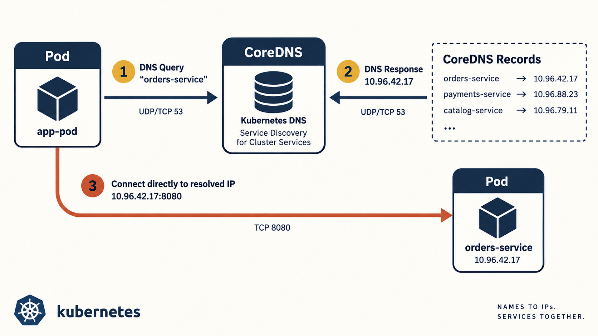

**Technical perspective:** DNS failure is one of the most common causes of cluster-wide outages:
- **NodeLocal DNSCache:** In high-concurrency clusters, deploying `NodeLocal DNSCache` (a DaemonSet running CoreDNS on `169.254.20.10`) avoids conntrack UDP race conditions and eliminates DNS latency.
- **CoreDNS Autoscaling:** CoreDNS must be scaled proportionally using `cluster-proportional-autoscaler` based on the number of nodes and cores in the cluster.

### Component architecture flow

<iframe src="diagrams/topic-15.html" width="100%" height="560" style="border:none;"></iframe>

> [!TIP]
> View the interactive animated diagram in [diagrams/topic-15.html](diagrams/topic-15.html).

**Part 2 — Analogy / Zine:** Tenants look up a friendly name instead of memorizing unit numbers.

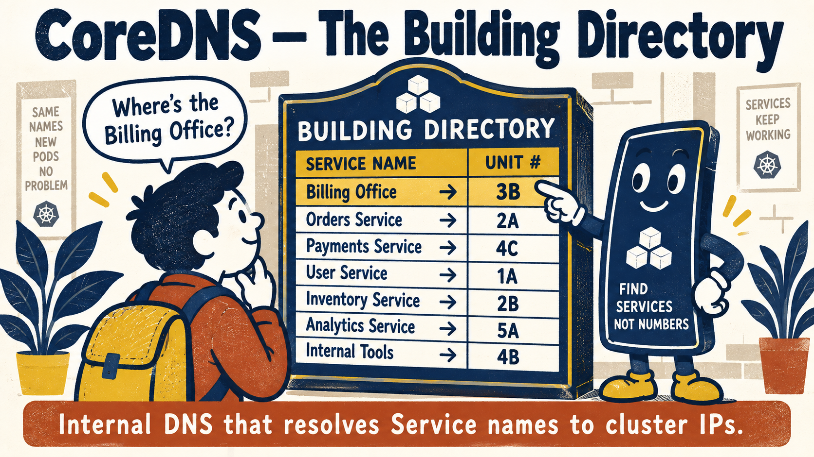

**Zine explanation:** The Internal Phone Directory image maps CoreDNS' service discovery function precisely. Just as an apartment complex's internal directory lets you call "Front Desk" instead of memorizing the desk's extension number — and the directory updates automatically when staff change — CoreDNS resolves `my-service.my-namespace.svc.cluster.local` to a ClusterIP without requiring callers to know the IP directly. When Services or Endpoints change, CoreDNS's in-memory cache (backed by the API server watch) reflects the update within the TTL window. Every Pod is automatically configured with CoreDNS as its nameserver (`/etc/resolv.conf`), making service-to-service discovery work seamlessly within the cluster.

* **Zine Text & Layout:**
* (Top): "CoreDNS — The Internal Phone Directory"
* (Caption): "Resolves Service names to cluster IPs, so Pods find each other by name instead of tracking ephemeral IP addresses."

**Further reading**

- [DNS for Services and Pods](https://kubernetes.io/docs/concepts/services-networking/dns-pod-service/)
- [CoreDNS project](https://coredns.io/)
- [CKA Study Notes: Networking (CoreDNS)](../CKA_Study_Notes/07-networking.md)

### Demo — CoreDNS

<div style="background:#000;color:#fff;border-radius:8px;padding:1rem;overflow:auto;box-shadow:0 2px 8px rgba(0,0,0,.25);"><pre style="background:transparent;color:#fff;margin:0;white-space:pre-wrap;">
SETUP
  kubectl create namespace zine-demo
  kubectl create deployment demo --image=nginx --replicas=3 -n zine-demo
  kubectl rollout status deployment/demo -n zine-demo
  kubectl expose deployment demo --port=80 -n zine-demo

STEPS
  1. kubectl run dns-test --image=busybox --rm -it --restart=Never -n zine-demo -- nslookup demo.zine-demo.svc.cluster.local

WHAT YOU SHOULD SEE
  nslookup returns the Service's ClusterIP. Nobody typed an IP address.

CLEANUP
  kubectl delete namespace zine-demo

NOTE
  The name resolves through CoreDNS, like asking the directory board.
</pre></div>


### Knowledge Check — Quiz

**Q1: How does a Pod resolve the service name 'auth-service' located in the same namespace 'production' without specifying an FQDN?**

- [ ] A) CoreDNS broadcasts an ARP request across the node subnet.
- [ ] B) The pod's /etc/resolv.conf specifies search paths like production.svc.cluster.local, which the resolver appends automatically.
- [ ] C) The application container must hardcode the IP address in /etc/hosts.
- [ ] D) The Linux kernel queries the root DNS servers on the internet.

<details>
<summary>Reveal Answer &amp; Explanation</summary>

**Correct Answer:** B) The pod's /etc/resolv.conf specifies search paths like production.svc.cluster.local, which the resolver appends automatically.

**Explanation:** Kubelet configures /etc/resolv.conf with search domains (<namespace>.svc.cluster.local, svc.cluster.local, etc.), allowing short names to be expanded and resolved.

</details>

**Q2: Where does CoreDNS source its real-time mapping of Service names to ClusterIPs and Endpoint IPs?**

- [ ] A) From a static text file hosted on GitHub.
- [ ] B) By watching the Kubernetes API server for Service and EndpointSlice resource events.
- [ ] C) By scanning worker node ARP tables every second.
- [ ] D) From the host operating system's /etc/bind/named.conf.

<details>
<summary>Reveal Answer &amp; Explanation</summary>

**Correct Answer:** B) By watching the Kubernetes API server for Service and EndpointSlice resource events.

**Explanation:** The CoreDNS kubernetes plugin connects to the kube-apiserver with an informer cache, watching Services and Endpoints to answer queries from live cluster state.

</details>

**Q3: In what order are plugins evaluated inside the CoreDNS `Corefile`?**

- [ ] A) In the exact order they are written line-by-line in the Corefile.
- [ ] B) In a predefined compile-time plugin order determined by `plugin.cfg` in the CoreDNS binary, regardless of their line order in the Corefile.
- [ ] C) In alphabetical order based on plugin name.
- [ ] D) In random order determined at server startup.

<details>
<summary>Reveal Answer &amp; Explanation</summary>

**Correct Answer:** B) In a predefined compile-time plugin order determined by `plugin.cfg` in the CoreDNS binary, regardless of their line order in the Corefile.

**Explanation:** CoreDNS plugin execution order is determined at compile time by the ordering in `plugin.cfg`, not the order in which directives appear in the Corefile ConfigMap.

</details>

**Q4: What DNS records are returned when querying a Headless Service (`spec.clusterIP: None`) compared to a standard ClusterIP Service?**

- [ ] A) A Headless Service returns a CNAME pointing to google.com.
- [ ] B) A standard Service returns the single virtual ClusterIP; a Headless Service returns multiple `A` records containing the direct IP addresses of all ready backend Pods.
- [ ] C) A Headless Service returns an error because it has no virtual IP.
- [ ] D) A Headless Service returns the IP address of the kube-apiserver.

<details>
<summary>Reveal Answer &amp; Explanation</summary>

**Correct Answer:** B) A standard Service returns the single virtual ClusterIP; a Headless Service returns multiple `A` records containing the direct IP addresses of all ready backend Pods.

**Explanation:** A standard Service returns its single virtual ClusterIP. A Headless Service (`clusterIP: None`) has no virtual IP; CoreDNS resolves queries directly to the set of individual ready Pod IPs (A/AAAA records).

</details>

**Q5: Why does setting `options ndots:5` in `/etc/resolv.conf` create extra network overhead for external domain queries (like `api.stripe.com`)?**

- [ ] A) It encrypts all DNS requests with 5 separate keys.
- [ ] B) Any hostname containing fewer than 5 dots is treated as an incomplete local name and appended to every local search domain (e.g. `api.stripe.com.default.svc.cluster.local`) before querying the root domain.
- [ ] C) It forces CoreDNS to query 5 different external DNS servers simultaneously.
- [ ] D) It restricts queries to 5 packets per second.

<details>
<summary>Reveal Answer &amp; Explanation</summary>

**Correct Answer:** B) Any hostname containing fewer than 5 dots is treated as an incomplete local name and appended to every local search domain (e.g. `api.stripe.com.default.svc.cluster.local`) before querying the root domain.

**Explanation:** With `ndots:5`, any domain with fewer than 5 dots is checked sequentially against all search domains (`<ns>.svc.cluster.local`, `svc.cluster.local`, `cluster.local`) first. Each external lookup incurs 3-4 failed DNS queries before resolving.

</details>

**Q6: What is the primary role of the `NodeLocal DNSCache` daemon in large Kubernetes clusters?**

- [ ] A) It stores DNS query records in etcd for compliance auditing.
- [ ] B) It runs a caching DNS agent on a link-local IP (`169.254.20.10`) on every worker node, serving queries locally to eliminate conntrack UDP race conditions and reduce CoreDNS control plane load.
- [ ] C) It synchronizes external cloud Route53 records.
- [ ] D) It forces all DNS queries to use IPv6.

<details>
<summary>Reveal Answer &amp; Explanation</summary>

**Correct Answer:** B) It runs a caching DNS agent on a link-local IP (`169.254.20.10`) on every worker node, serving queries locally to eliminate conntrack UDP race conditions and reduce CoreDNS control plane load.

**Explanation:** NodeLocal DNSCache runs a local cache instance on each node listening on a link-local address. Pods query localhost, reducing CoreDNS network traffic and avoiding Linux conntrack UDP race conditions that cause sporadic 5-second DNS timeouts.

</details>

## 16. Services

**Part 1 — Technical Discussion:** A **Service** is a durable, stable REST abstraction that defines a logical set of Pods and a policy to access them. Because Pods are ephemeral and receive dynamic IP addresses upon recreation, Services provide persistent network endpoints and decoupled internal load balancing.

### Service Types & Port Mapping
- **ClusterIP (Default):** Exposes the Service on an internal virtual IP reachable only from within the cluster.
- **NodePort:** Allocates a dedicated port from the cluster-wide range (default `30000-32767`) across every worker node's physical IP address.
- **LoadBalancer:** Builds upon NodePort by calling cloud provider APIs to provision an external Layer-4 cloud load balancer.
- **ExternalName:** Maps the Service to an external DNS CNAME record (e.g., `db.external.com`) without proxying.
- **Headless (`clusterIP: None`):** Bypasses kube-proxy load balancing, allowing clients to connect directly to Pod IPs via DNS.

### Network Mechanics: Virtual IP translation
- The ClusterIP has no network interface or MAC address. It exists solely as a destination matching rule in host kernel Netfilter/IPVS tables.

```yaml
# nodeport-service-spec.yaml
# WHY THIS YAML: This Service shows the ClusterIP + NodePort layered model.
# 'type: NodePort' creates BOTH a ClusterIP (internal) AND a NodePort (external).
# 'selector: app: web-frontend': EndpointSlice controller populates backends;
#   kube-proxy reads EndpointSlices to program its iptables rules.
# 'port: 80 -> targetPort: 8080': stable interface -> actual container port.
# 'nodePort: 30080': kube-proxy opens this port on every node's iptables chain.
apiVersion: v1
kind: Service
metadata:
  name: web-frontend
spec:
  type: NodePort
  selector:
    app: web
  ports:
  - name: http
    protocol: TCP
    port: 80
    targetPort: 8080
    nodePort: 31080
  sessionAffinity: ClientIP
  sessionAffinityConfig:
    clientIP:
      timeoutSeconds: 10800
```

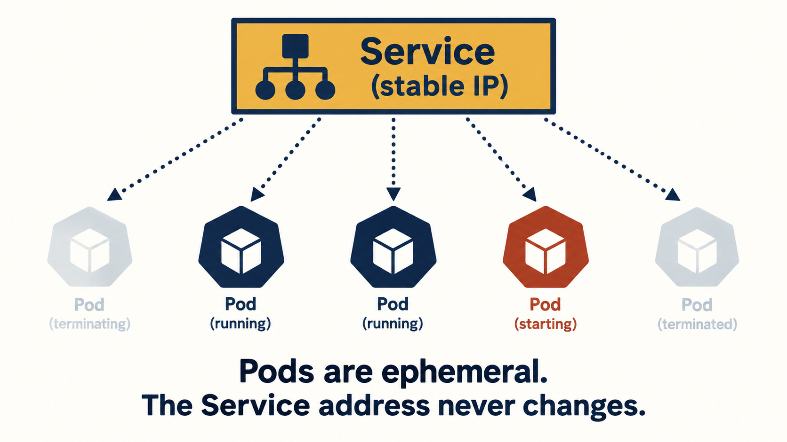

**Technical perspective:** Traffic routing policies impact network hops and client source IP preservation:
- **`externalTrafficPolicy: Local` vs `Cluster`:**
  - `Cluster` (default): Routes traffic to any node, potentially forwarding across nodes with SNAT (hiding client real IP).
  - `Local`: Only routes to pods on the node receiving the packet. Preserves the real client IP and avoids extra network hops, but risks uneven load distribution if nodes have unequal pod replicas.

### Component architecture flow

<iframe src="diagrams/topic-16.html" width="100%" height="560" style="border:none;"></iframe>

> [!TIP]
> View the interactive animated diagram in [diagrams/topic-16.html](diagrams/topic-16.html).

**Part 2 — Analogy / Zine:** A bolted mailbox that points to whichever tenants currently have the matching door nameplates.

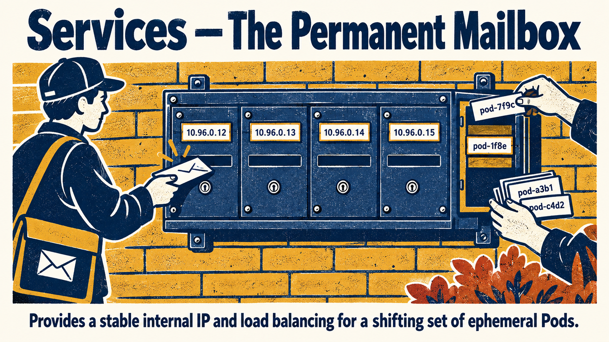

**Zine explanation:** The Reception Desk image represents how a Kubernetes Service provides a stable virtual endpoint that decouples callers from the constantly-changing set of backend Pods. Just as a reception desk has one extension number that rings through to whichever staff member is available — even as staff come and go — a ClusterIP Service has one stable IP and port that load-balances traffic to matching Pods, selected by label selectors. When a Pod restarts and gets a new IP, the EndpointSlice controller updates the routing table; callers never need to know. The Service is a permanent address for an ephemeral population, which is why Deployments and Services are always created in pairs.

* **Zine Text & Layout:**
* (Top): "Services & ClusterIP — The Reception Desk"
* (Caption): "A stable virtual IP that load-balances traffic across matching Pods — decoupling callers from the constantly-changing Pod IP addresses."

**Further reading**

- [Service networking](https://kubernetes.io/docs/concepts/services-networking/service/)
- [CKA Study Notes: Networking (Services & ClusterIP)](../CKA_Study_Notes/07-networking.md)

### Demo — Services

<div style="background:#000;color:#fff;border-radius:8px;padding:1rem;overflow:auto;box-shadow:0 2px 8px rgba(0,0,0,.25);"><pre style="background:transparent;color:#fff;margin:0;white-space:pre-wrap;">
SETUP
  kubectl create namespace zine-demo
  kubectl create deployment demo --image=nginx --replicas=3 -n zine-demo
  kubectl rollout status deployment/demo -n zine-demo
  kubectl expose deployment demo --port=80 --name=demo-svc -n zine-demo

STEPS
  1. kubectl get svc demo-svc -n zine-demo
  2. kubectl delete pod -l app=demo -n zine-demo
  3. kubectl rollout status deployment/demo -n zine-demo
  4. kubectl get svc demo-svc -n zine-demo   # same CLUSTER-IP, unchanged

WHAT YOU SHOULD SEE
  All Pods were destroyed and replaced, but CLUSTER-IP is identical before and after.

CLEANUP
  kubectl delete namespace zine-demo

NOTE
  The mailbox stayed bolted to the wall while the tenants changed.
</pre></div>


### Knowledge Check — Quiz

**Q1: Why is a Service's ClusterIP virtual IP address preferred over calling individual Pod IPs directly from client applications?**

- [ ] A) Pod IPs are slower because they require hardware encryption.
- [ ] B) Pod IPs are ephemeral and change upon container restart or rescheduling, whereas ClusterIP remains stable.
- [ ] C) Pod IPs are only reachable from the control plane node.
- [ ] D) ClusterIP bypasses all container network interfaces.

<details>
<summary>Reveal Answer &amp; Explanation</summary>

**Correct Answer:** B) Pod IPs are ephemeral and change upon container restart or rescheduling, whereas ClusterIP remains stable.

**Explanation:** Pods are dynamic and mortal; a Service provides a durable, static IP and DNS name that load-balances traffic across the ever-shifting set of backend pods.

</details>

**Q2: Which Service type creates an external cloud load balancer and automatically configures NodePort and ClusterIP routes as well?**

- [ ] A) type: ClusterIP
- [ ] B) type: NodePort
- [ ] C) type: LoadBalancer
- [ ] D) type: ExternalName

<details>
<summary>Reveal Answer &amp; Explanation</summary>

**Correct Answer:** C) type: LoadBalancer

**Explanation:** In Kubernetes, Service types build upon each other: LoadBalancer allocates a cloud LB, which forwards to NodePort, which routes to ClusterIP.

</details>

**Q3: In a Kubernetes Service manifest, what is the distinction between `port` and `targetPort`?**

- [ ] A) `port` is the port exposed on the Service's virtual ClusterIP; `targetPort` is the actual port the application container listens on inside the backend Pod.
- [ ] B) `port` is for UDP traffic; `targetPort` is for TCP traffic.
- [ ] C) `port` is the host node port; `targetPort` is the proxy port.
- [ ] D) `port` is deprecated in Kubernetes 1.29+.

<details>
<summary>Reveal Answer &amp; Explanation</summary>

**Correct Answer:** A) `port` is the port exposed on the Service's virtual ClusterIP; `targetPort` is the actual port the application container listens on inside the backend Pod.

**Explanation:** `spec.ports[*].port` defines the listening port exposed by the Service abstraction itself inside the cluster. `spec.ports[*].targetPort` defines the destination container port on the backend Pod to which packets are forwarded.

</details>

**Q4: Why does pinging a Service's virtual ClusterIP (e.g. `ping 10.96.0.1`) typically fail, even when the Service is routing HTTP traffic properly?**

- [ ] A) ClusterIP addresses are virtual entries in iptables/IPVS rules that translate specific TCP/UDP transport ports; they are not real physical network interfaces and do not respond to ICMP Echo packets.
- [ ] B) The Linux kernel permanently disables ICMP in containerized environments.
- [ ] C) ClusterIPs require an active BGP session to respond to pings.
- [ ] D) CoreDNS blocks ICMP packets by default.

<details>
<summary>Reveal Answer &amp; Explanation</summary>

**Correct Answer:** A) ClusterIP addresses are virtual entries in iptables/IPVS rules that translate specific TCP/UDP transport ports; they are not real physical network interfaces and do not respond to ICMP Echo packets.

**Explanation:** A ClusterIP does not exist as an interface or ARP responder on any host; it exists solely as a destination translation target in iptables/IPVS for specified TCP/UDP ports. ICMP ping packets have no port and are dropped.

</details>

**Q5: What requirement must be met when defining a Kubernetes Service with multiple ports in `spec.ports`?**

- [ ] A) All ports must use the UDP protocol.
- [ ] B) Every port entry in `spec.ports` must have a unique `name` assigned to it.
- [ ] C) The Service type must be LoadBalancer.
- [ ] D) The Service must use `clusterIP: None`.

<details>
<summary>Reveal Answer &amp; Explanation</summary>

**Correct Answer:** B) Every port entry in `spec.ports` must have a unique `name` assigned to it.

**Explanation:** When multiple ports are defined in a Service, Kubernetes requires each port to specify a unique `name` (e.g. `name: http` and `name: https`) to prevent ambiguity in EndpointSlice and DNS SRV records.

</details>

**Q6: How can an operator configure a Service to route subsequent requests from the same client IP to the same backend Pod?**

- [ ] A) By setting `spec.sessionAffinity: ClientIP` on the Service.
- [ ] B) By enabling HTTP cookies in kube-proxy.
- [ ] C) By creating a StatefulSet with ordinal routing.
- [ ] D) By assigning a static MAC address to the pod.

<details>
<summary>Reveal Answer &amp; Explanation</summary>

**Correct Answer:** A) By setting `spec.sessionAffinity: ClientIP` on the Service.

**Explanation:** Setting `spec.sessionAffinity: ClientIP` instructs kube-proxy to program iptables/IPVS rules that map connections from the same client IP address to the same backend pod for a configurable timeout period.

</details>

## 17. Endpoints

**Part 1 — Technical Discussion:** **Endpoints** and **EndpointSlices** bridge the declarative Service abstraction with physical, live Pod network IP addresses. When a Service defines a `spec.selector`, the EndpointSlice controller automatically queries matching, healthy Pods and maintains the active backend pool.

### Architectural Evolution: Endpoints vs. EndpointSlices
- **Legacy Endpoints Resource:** Stored all backend IPs and ports in a single monolithic API object (`/api/v1/endpoints/<service-name>`). For high-replica workloads (1,000+ pods), any single pod scaling event or health change forced the API server to re-serialize the entire multi-megabyte object to etcd and blast it to all kube-proxies.
- **EndpointSlice API (`discovery.k8s.io/v1`):** Splits backend collections into distinct slices containing a maximum of 100 endpoints each. Modifying one pod updates only its corresponding slice, reducing network and etcd load by up to 90%.

### Readiness Probe Integration
- If a Pod's `readinessProbe` fails, the EndpointSlice controller immediately strips its IP address from the EndpointSlice, stopping incoming Service traffic without killing the container.

```yaml
# custom-manual-endpoints.yaml
# WHY THIS YAML: Manual Endpoints/EndpointSlices route a Service to non-Pod backends.
# A Service WITHOUT a 'selector' tells the controller NOT to auto-manage backends.
# The Endpoints object lists IP:port pairs that kube-proxy uses to program
#   its iptables/IPVS rules, exactly as it would for Pod-backed endpoints.
# This lets Kubernetes Services act as stable internal DNS names for external systems
#   (legacy VMs, managed databases), enabling transparent migration to in-cluster Pods.
apiVersion: v1
kind: Service
metadata:
  name: external-database
spec:
  ports:
  - port: 5432
    targetPort: 5432
---
apiVersion: discovery.k8s.io/v1
kind: EndpointSlice
metadata:
  name: external-database-1
  labels:
    kubernetes.io/service-name: external-database
addressType: IPv4
ports:
- name: ""
  port: 5432
  protocol: TCP
endpoints:
- addresses:
  - "192.168.1.50"
  conditions:
    ready: true
```

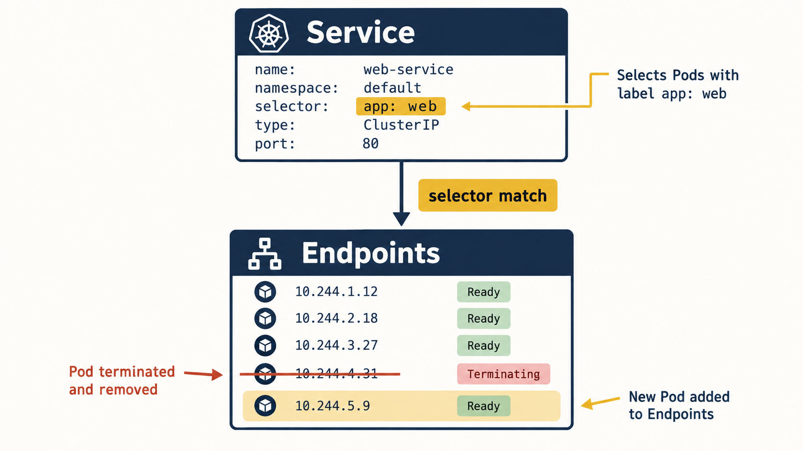

**Technical perspective:** Endpoint management is the heartbeat of zero-downtime rolling deployments:
- **Graceful Termination Drain:** When a pod is deleted, the EndpointSlice controller asynchronously removes it from endpoints while the kubelet sends `SIGTERM` to the container. If the application terminates immediately without waiting for endpoint propagation, in-flight TCP requests receive connection resets (`RST`). Always implement a `preStop` hook (`sleep 5`) in the container spec to allow endpoint propagation before stopping server listeners.

### Component architecture flow

<iframe src="diagrams/topic-17.html" width="100%" height="560" style="border:none;"></iframe>

> [!TIP]
> View the interactive animated diagram in [diagrams/topic-17.html](diagrams/topic-17.html).

**Part 2 — Analogy / Zine:** The actual mail-forwarding list taped inside the mailbox, updated every time a tenant moves in or out.

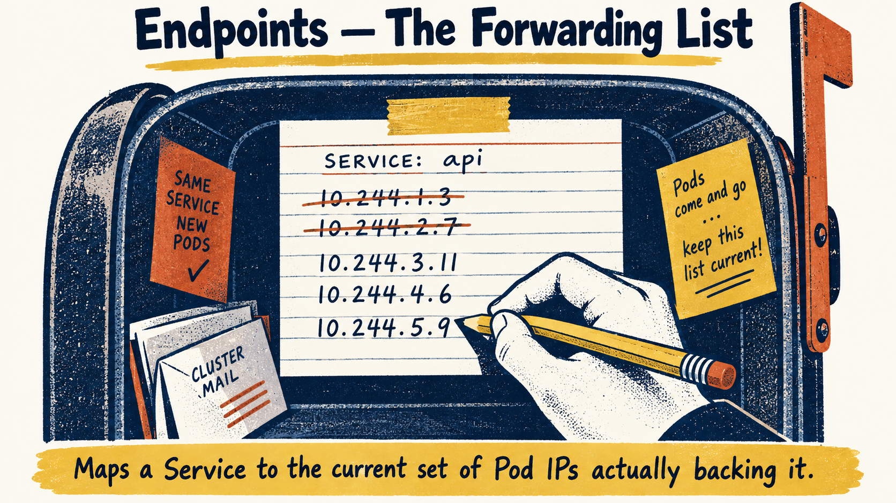

**Zine explanation:** The Building Address + Buzzer Panel image illustrates how NodePort and LoadBalancer Services extend the internal ClusterIP to be reachable from outside the cluster. Just as an apartment's external-facing buzzer panel (NodePort) lets visitors ring specific units from the street — even though internally residents call each other by apartment number — a NodePort Service opens a high-numbered port on every node, forwarding external traffic to the ClusterIP. A LoadBalancer Service adds a cloud-provisioned load balancer (the building's main lobby entrance) in front of those NodePorts, providing a single stable public IP. The trade-off: NodePort exposes a high-numbered port on every node; LoadBalancer incurs cloud costs per service.

* **Zine Text & Layout:**
* (Top): "NodePort & LoadBalancer — The Street-Facing Entrance"
* (Caption): "Opens the cluster's internal Services to external traffic — NodePort via host ports, LoadBalancer via a cloud-provisioned IP."

**Further reading**

- [EndpointSlices](https://kubernetes.io/docs/concepts/services-networking/endpoint-slices/)
- [CKA Study Notes: Networking (NodePort & LoadBalancer)](../CKA_Study_Notes/07-networking.md)

### Demo — Endpoints

<div style="background:#000;color:#fff;border-radius:8px;padding:1rem;overflow:auto;box-shadow:0 2px 8px rgba(0,0,0,.25);"><pre style="background:transparent;color:#fff;margin:0;white-space:pre-wrap;">
SETUP
  kubectl create namespace zine-demo
  kubectl create deployment demo --image=nginx --replicas=3 -n zine-demo
  kubectl rollout status deployment/demo -n zine-demo
  kubectl expose deployment demo --port=80 --name=demo-svc -n zine-demo

STEPS
  1. kubectl get endpoints demo-svc -n zine-demo
  2. kubectl scale deployment demo --replicas=5 -n zine-demo
  3. kubectl rollout status deployment/demo -n zine-demo
  4. kubectl get endpoints demo-svc -n zine-demo   # now lists 5 IPs

WHAT YOU SHOULD SEE
  Endpoints grows from 3 IPs to 5 while the Service address never changes.

CLEANUP
  kubectl delete namespace zine-demo

NOTE
  That is the forwarding list being rewritten live. On Kubernetes 1.33+ you may see a deprecation warning for Endpoints; 'kubectl get endpointslices -n zine-demo' shows the same data.
</pre></div>


### Knowledge Check — Quiz

**Q1: Why did Kubernetes introduce EndpointSlice resources to replace monolithic Endpoints objects in large clusters?**

- [ ] A) To support IPv6-only clusters.
- [ ] B) Monolithic Endpoints objects caused massive API server write amplification when a single pod changed in a service with thousands of replicas.
- [ ] C) Because EndpointSlice completely eliminates the need for kube-proxy.
- [ ] D) Endpoints could only store up to 5 IP addresses.

<details>
<summary>Reveal Answer &amp; Explanation</summary>

**Correct Answer:** B) Monolithic Endpoints objects caused massive API server write amplification when a single pod changed in a service with thousands of replicas.

**Explanation:** With monolithic Endpoints, a change to 1 pod in a 5,000-pod service required resending the entire multi-megabyte object to all nodes; EndpointSlices chunk endpoints into groups of 100, dramatically reducing API bandwidth.

</details>

**Q2: What condition must a Pod satisfy before the EndpointSlice controller adds its IP address to the active serving endpoints of a Service?**

- [ ] A) The Pod must have passed its readiness probe (ContainersReady: True).
- [ ] B) The Pod must be running for at least 10 minutes.
- [ ] C) The Pod must be scheduled on the control plane node.
- [ ] D) The Pod must have no CPU limits defined.

<details>
<summary>Reveal Answer &amp; Explanation</summary>

**Correct Answer:** A) The Pod must have passed its readiness probe (ContainersReady: True).

**Explanation:** A pod is only considered ready to serve live user traffic when its readiness probes pass; unready pods are excluded from active service endpoints.

</details>

**Q3: What is the relationship between the three primary Kubernetes Service types: ClusterIP, NodePort, and LoadBalancer?**

- [ ] A) They are mutually exclusive and operate on completely different network OSI layers.
- [ ] B) They form a strict superset hierarchy: A NodePort is automatically a ClusterIP, and a LoadBalancer is automatically both a NodePort and a ClusterIP.
- [ ] C) NodePort replaces ClusterIP, while LoadBalancer replaces kube-proxy.
- [ ] D) LoadBalancer operates only on worker nodes, while NodePort operates only on control plane nodes.

<details>
<summary>Reveal Answer &amp; Explanation</summary>

**Correct Answer:** B) They form a strict superset hierarchy: A NodePort is automatically a ClusterIP, and a LoadBalancer is automatically both a NodePort and a ClusterIP.

**Explanation:** Service types form an inclusive hierarchy: When you create a `NodePort`, Kubernetes automatically assigns a `ClusterIP`. When you create a `LoadBalancer`, Kubernetes provisions a cloud load balancer, opens a `NodePort` on all nodes, and allocates a `ClusterIP`.

</details>

**Q4: Which field in a Service of type LoadBalancer restricts inbound access to specific external CIDR IP ranges at the cloud firewall level?**

- [ ] A) spec.ipBlockList
- [ ] B) spec.loadBalancerSourceRanges
- [ ] C) spec.allowedIngressCIDRs
- [ ] D) metadata.annotations.firewall-rule

<details>
<summary>Reveal Answer &amp; Explanation</summary>

**Correct Answer:** B) spec.loadBalancerSourceRanges

**Explanation:** `spec.loadBalancerSourceRanges` allows operators to specify client CIDRs (e.g., `['203.0.113.0/24']`). Supported cloud providers configure their security groups/firewalls to allow traffic only from those IP blocks.

</details>

**Q5: When `externalTrafficPolicy: Local` is enabled on a NodePort/LoadBalancer Service, what port is allocated for cloud load balancer health checks to determine which nodes have ready Pods?**

- [ ] A) spec.healthCheckNodePort
- [ ] B) spec.ports[0].targetPort
- [ ] C) spec.clusterIPPort
- [ ] D) Kubelet port 10250

<details>
<summary>Reveal Answer &amp; Explanation</summary>

**Correct Answer:** A) spec.healthCheckNodePort

**Explanation:** When `externalTrafficPolicy: Local` is used, Kubernetes allocates `spec.healthCheckNodePort`. Cloud load balancers probe this HTTP port; nodes with zero local pod replicas return HTTP 503, ensuring traffic is only routed to nodes hosting live pods.

</details>

**Q6: How does MetalLB enable Service type LoadBalancer functionality on bare-metal Kubernetes clusters without cloud provider APIs?**

- [ ] A) By rewriting the Linux kernel routing table on client laptops.
- [ ] B) By operating in Layer 2 mode (announcing IPs via ARP/NDP from a leader node) or BGP mode (peering with network routers to announce pod/service routes).
- [ ] C) By deploying an external NGINX reverse proxy on every worker node.
- [ ] D) By converting all NodePort services to DNS CNAME records.

<details>
<summary>Reveal Answer &amp; Explanation</summary>

**Correct Answer:** B) By operating in Layer 2 mode (announcing IPs via ARP/NDP from a leader node) or BGP mode (peering with network routers to announce pod/service routes).

**Explanation:** MetalLB provides bare-metal load balancing using standard network protocols: Layer 2 mode uses ARP (IPv4) or NDP (IPv6) to bind service IPs to node MAC addresses, while BGP mode establishes dynamic routing sessions with upstream datacenter switches.

</details>

## 18. Ingress

**Part 1 — Technical Discussion:** **Ingress** is an API object that manages external Layer-7 (HTTP and HTTPS) access to Services within a cluster. It provides application-layer routing features including hostname routing, URL path prefix matching, SSL/TLS termination, and basic authentication.

### Ingress vs. Ingress Controller
- **Ingress Resource:** Metadata-only declaration defining HTTP routing rules.
- **Ingress Controller:** The active reverse proxy process (e.g., ingress-nginx, Traefik, HAProxy, Envoy) that watches the Ingress API, parses annotations, dynamically generates proxy configuration, and routes real HTTP requests.

### Path Matching & Gateway API Evolution
- `pathType: Exact`: Strict match on URL path.
- `pathType: Prefix`: Hierarchical matching based on `/`-delimited URL elements.
- **Gateway API (`gateway.networking.k8s.io`):** The next-generation evolutionary successor to Ingress, splitting configuration across roles (`GatewayClass` for infrastructure providers, `Gateway` for cluster operators, `HTTPRoute` for application developers).

```yaml
# tls-ingress-spec.yaml
# WHY THIS YAML: This Ingress resource is processed by the Ingress Controller,
#   NOT by kube-apiserver or kube-proxy directly.
# 'ingressClassName: nginx': selects which controller watches this object.
#   Multiple controllers can coexist; className routes to the right one.
# 'tls.secretName: tls-cert': the controller reads this Secret and configures
#   its virtual host to terminate HTTPS -- Layer 7, impossible with raw kube-proxy.
# 'rules.host / path': HTTP Host header and URL-path-based routing to backend Services.
apiVersion: networking.k8s.io/v1
kind: Ingress
metadata:
  name: production-ingress
  annotations:
    nginx.ingress.kubernetes.io/rewrite-target: /$2
    nginx.ingress.kubernetes.io/ssl-redirect: "true"
spec:
  tls:
  - hosts:
    - api.example.com
    secretName: example-tls-cert
  rules:
  - host: api.example.com
    http:
      paths:
      - path: /users(/|$)(.*)
        pathType: ImplementationSpecific
        backend:
          service:
            name: user-service
            port:
              number: 8080
```

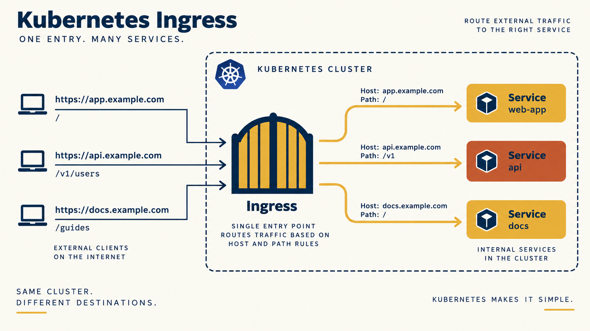

**Technical perspective:** Ingress controllers operate as the public-facing edge of the cluster:
- **TLS Secret Management:** TLS certificates are stored in `kubernetes.io/tls` Secrets containing `tls.crt` and `tls.key`. Automatic certificate issuance and renewal are standardly delegated to `cert-manager` via ACME/Let's Encrypt.
- **Controller Reload Penalties:** Older ingress-nginx setups reloaded the NGINX master process upon any backend endpoint change, causing transient client latency spikes. Modern controllers use dynamic Lua shared-memory routing to update backends without process reloads.

### Component architecture flow

<iframe src="diagrams/topic-18.html" width="100%" height="560" style="border:none;"></iframe>

> [!TIP]
> View the interactive animated diagram in [diagrams/topic-18.html](diagrams/topic-18.html).

**Part 2 — Analogy / Zine:** The single outer gate reads visitor destinations and sends them down the right internal road.

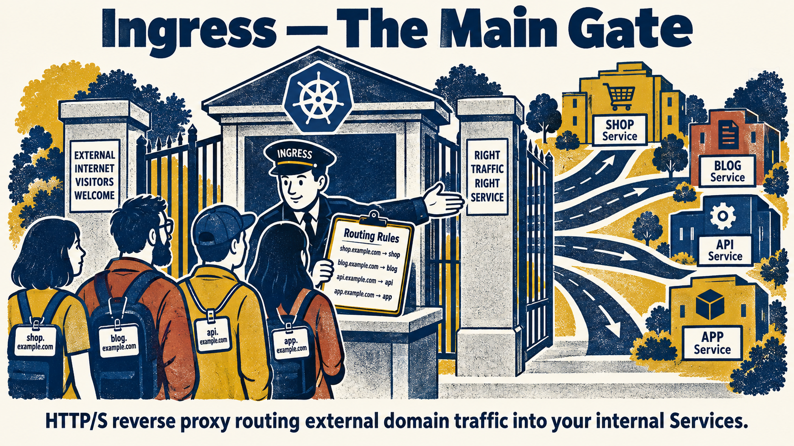

**Zine explanation:** The Guest Concierge image captures how an Ingress controller acts as an intelligent HTTP/HTTPS router that fronts multiple Services with a single entry point. Just as a hotel concierge receives all guest requests at one desk and routes them to the right floor or department based on the request type — "conference room requests go left, restaurant reservations go right" — an Ingress controller (nginx, Traefik) inspects HTTP Host headers and URL paths, then forwards traffic to the appropriate backend Service. TLS termination at the concierge (Ingress) means backend Services don't need their own certificates. A single LoadBalancer IP can serve dozens of Services through host/path routing rules.

* **Zine Text & Layout:**
* (Top): "Ingress — The Guest Concierge"
* (Caption): "Routes external HTTP/HTTPS traffic to backend Services by hostname or URL path, with TLS termination at one central point."

**Further reading**

- [Ingress](https://kubernetes.io/docs/concepts/services-networking/ingress/)
- [CKA Study Notes: Networking (Ingress)](../CKA_Study_Notes/07-networking.md)

### Demo — Ingress

<div style="background:#000;color:#fff;border-radius:8px;padding:1rem;overflow:auto;box-shadow:0 2px 8px rgba(0,0,0,.25);"><pre style="background:transparent;color:#fff;margin:0;white-space:pre-wrap;">
SETUP
  kubectl apply -f https://raw.githubusercontent.com/kubernetes/ingress-nginx/main/deploy/static/provider/kind/deploy.yaml
  kubectl wait --namespace ingress-nginx --for=condition=Ready pod -l app.kubernetes.io/component=controller --timeout=120s
  kubectl create namespace zine-demo
  kubectl create deployment demo --image=nginx --replicas=3 -n zine-demo
  kubectl rollout status deployment/demo -n zine-demo
  kubectl expose deployment demo --port=80 --name=demo-svc -n zine-demo

YAML  (demo-ingress.yaml)
  apiVersion: networking.k8s.io/v1
  kind: Ingress
  metadata:
    name: demo-ingress
  spec:
    ingressClassName: nginx
    rules:
    - host: demo.local
      http:
        paths:
        - path: /
          pathType: Prefix
          backend:
            service:
              name: demo-svc
              port:
                number: 80

STEPS
  1. kubectl apply -f demo-ingress.yaml -n zine-demo
  2. kubectl get ingress demo-ingress -n zine-demo   # wait until ADDRESS is filled
  3. curl -i -H "Host: demo.local" http://localhost:8080/

WHAT YOU SHOULD SEE
  curl returns the nginx welcome page. Changing the Host header to something else returns a 404 from the gatekeeper.

CLEANUP
  kubectl delete namespace zine-demo

NOTE
  One external address, and the hostname in the request decides which Service you reach. This demo needs the kind ingress-nginx manifest and the 8080 -> 80 mapping in kind-multinode.yaml.
</pre></div>


### Knowledge Check — Quiz

**Q1: What is the primary difference between a Kubernetes Ingress resource and an Ingress Controller?**

- [ ] A) The Ingress resource is an active proxy process; the controller is just a documentation file.
- [ ] B) The Ingress resource is a declarative configuration object; the Ingress Controller is the actual daemon that watches the API and proxies traffic.
- [ ] C) Ingress operates at Layer 4 (TCP), while the controller operates at Layer 3 (IP).
- [ ] D) Ingress requires cloud provider hardware, while controllers run on bare metal.

<details>
<summary>Reveal Answer &amp; Explanation</summary>

**Correct Answer:** B) The Ingress resource is a declarative configuration object; the Ingress Controller is the actual daemon that watches the API and proxies traffic.

**Explanation:** An Ingress manifest (kind: Ingress) only declares routing rules; traffic does not flow until an Ingress Controller is deployed to parse those rules and proxy incoming HTTP requests.

</details>

**Q2: Which OSI layer does a standard Kubernetes Ingress operate at to provide host-based and path-based routing?**

- [ ] A) Layer 3 (Network - IP packets)
- [ ] B) Layer 4 (Transport - TCP/UDP sockets)
- [ ] C) Layer 7 (Application - HTTP/HTTPS URLs, headers, and hostnames)
- [ ] D) Layer 2 (Data Link - MAC addresses)

<details>
<summary>Reveal Answer &amp; Explanation</summary>

**Correct Answer:** C) Layer 7 (Application - HTTP/HTTPS URLs, headers, and hostnames)

**Explanation:** Ingress inspects HTTP requests (Host headers like api.example.com and URL paths like /v1/users) to direct traffic to appropriate internal services.

</details>

**Q3: What is the architectural difference between an `Ingress` resource and an `Ingress Controller` in Kubernetes?**

- [ ] A) An Ingress is a control plane daemon; an Ingress Controller is a worker node daemon.
- [ ] B) An Ingress is a declarative API metadata resource defining routing rules; an Ingress Controller is the running reverse proxy daemon (like NGINX or Envoy) that watches the API and executes the routing.
- [ ] C) Ingress handles UDP traffic; Ingress Controller handles TCP traffic.
- [ ] D) Ingress is deprecated; Ingress Controller is its replacement.

<details>
<summary>Reveal Answer &amp; Explanation</summary>

**Correct Answer:** B) An Ingress is a declarative API metadata resource defining routing rules; an Ingress Controller is the running reverse proxy daemon (like NGINX or Envoy) that watches the API and executes the routing.

**Explanation:** An Ingress object is simply declarative configuration in etcd describing hostname/path routing and TLS rules. An Ingress Controller (such as ingress-nginx or Traefik) is the actual software daemon that fulfills those rules by proxying HTTP(S) traffic.

</details>

**Q4: Which Ingress path type matches an incoming request URL prefix on a element-by-element path segment basis?**

- [ ] A) Exact
- [ ] B) Prefix
- [ ] C) ImplementationSpecific
- [ ] D) Regex

<details>
<summary>Reveal Answer &amp; Explanation</summary>

**Correct Answer:** B) Prefix

**Explanation:** `pathType: Prefix` matches URL path prefixes split by `/` delimiters. For example, `/v1` matches `/v1/` and `/v1/users`, but does not match `/v10`.

</details>

**Q5: How is TLS termination configured on an Ingress resource to decrypt HTTPS traffic?**

- [ ] A) By pasting raw certificate strings directly into `spec.rules`.
- [ ] B) By specifying `spec.tls[*].secretName` referencing a `kubernetes.io/tls` Secret containing `tls.crt` and `tls.key` in the same namespace.
- [ ] C) By installing the certificate directly onto the worker node's host BIOS.
- [ ] D) By configuring a NodePort with port 443.

<details>
<summary>Reveal Answer &amp; Explanation</summary>

**Correct Answer:** B) By specifying `spec.tls[*].secretName` referencing a `kubernetes.io/tls` Secret containing `tls.crt` and `tls.key` in the same namespace.

**Explanation:** Ingress specifies `spec.tls` blocks with hostnames and `secretName`. The referenced Secret must exist in the same namespace and contain `tls.crt` (public cert chain) and `tls.key` (private key).

</details>

**Q6: What new Kubernetes standard is designed to succeed Ingress by providing expressive, role-oriented, and cross-namespace routing capabilities?**

- [ ] A) ServiceMesh API
- [ ] B) Gateway API (`GatewayClass`, `Gateway`, `HTTPRoute`)
- [ ] C) EgressRoute API
- [ ] D) VirtualService API

<details>
<summary>Reveal Answer &amp; Explanation</summary>

**Correct Answer:** B) Gateway API (`GatewayClass`, `Gateway`, `HTTPRoute`)

**Explanation:** The Kubernetes Gateway API provides a modern, role-oriented replacement for Ingress, separating platform infrastructure governance (`GatewayClass`, `Gateway`) from application routing rules (`HTTPRoute`, `GRPCRoute`).

</details>

## 19. NetworkPolicy

**Part 1 — Technical Discussion:** **NetworkPolicy** is an application-centric firewall specification that controls Layer-3 and Layer-4 packet flow between Pods and network endpoints. By default, Kubernetes networks operate in **permissive mode** (all Pods can communicate freely with all other Pods).

### Policy Evaluation & Selectors
- **Isolation On Select:** As soon as a NetworkPolicy selects a Pod via `spec.podSelector`, that Pod becomes **isolated** for the declared `policyTypes` (`Ingress`, `Egress`). All traffic not explicitly permitted by a rule is dropped (default deny).
- **Rule Selectors (Additive OR vs. AND):**
  - Combining `podSelector` and `namespaceSelector` under separate list items evaluates as a logical **OR**.
  - Combining `podSelector` and `namespaceSelector` within the same item evaluates as a logical **AND**.
  - `ipBlock`: Specifies external CIDR ranges with optional `except` blocks.

### Linux Kernel Enforcement
- NetworkPolicies are **not** enforced by core Kubernetes or kube-proxy; they require a policy-capable CNI plugin (Calico, Cilium, Antrea, Weave).
- The CNI translates NetworkPolicy YAML rules into host Linux Netfilter `iptables` filter chains or Linux kernel `eBPF` maps evaluated directly on virtual interfaces.

```yaml
# strict-backend-network-policy.yaml
# WHY THIS YAML: Enforces namespace-level network segmentation via the CNI plugin.
# 'podSelector: app: backend': once ANY NetworkPolicy selects this Pod,
#   default becomes deny-all -- only explicitly allowed traffic flows.
# 'policyTypes: [Ingress, Egress]': both directions are now controlled.
# 'ingress.from.namespaceSelector: frontend': ONLY the frontend namespace may connect.
# 'egress.ports.port: 5432': Pods may only make outbound connections to PostgreSQL.
# WARNING: Must explicitly allow DNS (port 53) or DNS resolution breaks.
apiVersion: networking.k8s.io/v1
kind: NetworkPolicy
metadata:
  name: secure-db-policy
  namespace: production
spec:
  podSelector:
    matchLabels:
      role: database
  policyTypes:
  - Ingress
  - Egress
  ingress:
  - from:
    - namespaceSelector:
        matchLabels:
          environment: production
      podSelector:
        matchLabels:
          role: backend-api
    ports:
    - protocol: TCP
      port: 5432
  egress:
  - to:
    - ports:
      - protocol: UDP
        port: 53
```

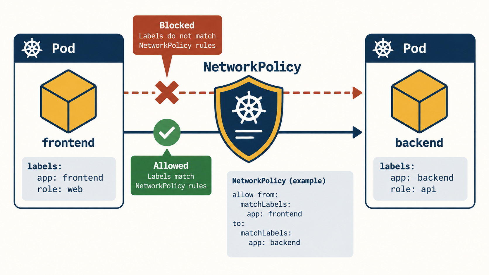

**Technical perspective:** NetworkPolicies are a mandatory requirement for PCI-DSS, HIPAA, and SOC2 compliance:
- **Flannel Gotcha:** Flannel does NOT enforce NetworkPolicies! Clusters using pure Flannel will silently ignore NetworkPolicy manifests, leaving workloads completely unisolated. Canal (Flannel + Calico policy engine) or Calico must be used.
- **DNS Egress Lockdown:** When configuring an Egress default-deny policy, workloads immediately lose the ability to resolve names because port 53 UDP/TCP to CoreDNS is blocked. Always include an explicit egress rule permitting DNS traffic.

### Component architecture flow

<iframe src="diagrams/topic-19.html" width="100%" height="560" style="border:none;"></iframe>

> [!TIP]
> View the interactive animated diagram in [diagrams/topic-19.html](diagrams/topic-19.html).

**Part 2 — Analogy / Zine:** A guest list posted on a unit's door — only visitors on the list get buzzed in, everyone else is turned away at that door.

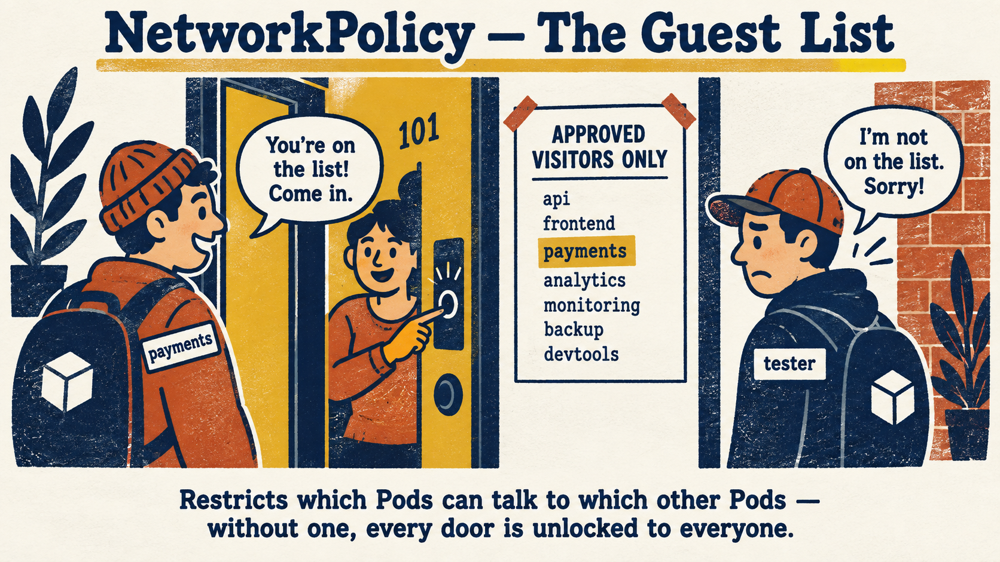

**Zine explanation:** The Security Door image maps NetworkPolicy's role as a namespace-level firewall that controls which Pods may communicate with which other Pods. Just as an apartment complex installs keycard-access doors between sections — so residents can't wander from the parking garage into the residential floors without authorization — NetworkPolicy rules restrict ingress and egress traffic between Pods at the kernel netfilter level (enforced by the CNI plugin). Without a NetworkPolicy, all Pods in a cluster can reach each other by default (flat network). Once any NetworkPolicy selects a Pod, the default behavior becomes deny-all for that Pod, and only explicitly allowed traffic flows. DNS traffic to port 53 must be explicitly allowed or DNS resolution breaks.

* **Zine Text & Layout:**
* (Top): "NetworkPolicy — The Security Door"
* (Caption): "Controls which Pods can communicate with which other Pods — enforcing namespace-level network segmentation at the kernel level."

**Further reading**

- [Network Policies](https://kubernetes.io/docs/concepts/services-networking/network-policies/)
- [CKA Study Notes: Security (NetworkPolicies)](../CKA_Study_Notes/06-security.md)

### Demo — NetworkPolicy

<div style="background:#000;color:#fff;border-radius:8px;padding:1rem;overflow:auto;box-shadow:0 2px 8px rgba(0,0,0,.25);"><pre style="background:transparent;color:#fff;margin:0;white-space:pre-wrap;">
SETUP
  kubectl create namespace zine-demo
  kubectl create deployment demo --image=nginx --replicas=3 -n zine-demo
  kubectl rollout status deployment/demo -n zine-demo
  kubectl expose deployment demo --port=80 --name=demo-svc -n zine-demo
  kubectl create namespace other-ns

YAML  (deny-demo.yaml)
  apiVersion: networking.k8s.io/v1
  kind: NetworkPolicy
  metadata:
    name: deny-from-other-namespaces
  spec:
    podSelector: {}
    policyTypes: ["Ingress"]
    ingress:
    - from:
      - podSelector: {}

STEPS
  1. kubectl run before --image=busybox --rm -it --restart=Never -n other-ns -- wget -qO- --timeout=3 demo-svc.zine-demo.svc.cluster.local   # works
  2. kubectl apply -f deny-demo.yaml -n zine-demo
  3. kubectl run intruder --image=busybox --rm -it --restart=Never -n other-ns -- wget -qO- --timeout=3 demo-svc.zine-demo.svc.cluster.local   # now times out

WHAT YOU SHOULD SEE
  Before the policy the request returns the nginx page. After it the request times out.

CLEANUP
  kubectl delete namespace zine-demo other-ns

NOTE
  The default kind CNI (kindnet) does not enforce NetworkPolicy, so the second request will still succeed. Run this demo on a separate kind cluster configured with Calico or Cilium; do not try to replace kindnet in an already-running cluster.
</pre></div>


### Knowledge Check — Quiz

**Q1: What happens in a namespace when no NetworkPolicies are applied versus when a single NetworkPolicy with podSelector: {} and ingress: [] is applied?**

- [ ] A) Default behavior is allow-all; applying an empty ingress policy creates an isolation boundary that defaults to deny-all incoming traffic.
- [ ] B) Default behavior is deny-all; applying a policy enables allow-all.
- [ ] C) Applying a policy disables DNS resolution across the entire cluster.
- [ ] D) The container runtime pauses all running containers.

<details>
<summary>Reveal Answer &amp; Explanation</summary>

**Correct Answer:** A) Default behavior is allow-all; applying an empty ingress policy creates an isolation boundary that defaults to deny-all incoming traffic.

**Explanation:** By default, pod networking is non-isolated (allow all). As soon as any NetworkPolicy selects a pod, that pod enters isolated mode where unselected traffic is rejected.

</details>

**Q2: Why might a newly created NetworkPolicy fail to enforce traffic blocking in a cluster running standard default kind?**

- [ ] A) The policy YAML had invalid syntax.
- [ ] B) The default CNI plugin in standard kind (kindnet) does not implement NetworkPolicy enforcement; a policy-capable CNI (like Calico or Cilium) is required.
- [ ] C) NetworkPolicies only work in production cloud clusters.
- [ ] D) kube-apiserver disables NetworkPolicy by default.

<details>
<summary>Reveal Answer &amp; Explanation</summary>

**Correct Answer:** B) The default CNI plugin in standard kind (kindnet) does not implement NetworkPolicy enforcement; a policy-capable CNI (like Calico or Cilium) is required.

**Explanation:** NetworkPolicy is a declarative API spec; enforcement is the responsibility of the underlying CNI plugin dataplane (eBPF or iptables). Kindnet does not support NetworkPolicy.

</details>

**Q3: What is the network security posture of a Kubernetes namespace before any `NetworkPolicy` is created in that namespace?**

- [ ] A) Default-Deny (all incoming and outgoing traffic is blocked).
- [ ] B) Default-Allow (all Pods can communicate with all other Pods across all namespaces and external networks).
- [ ] C) Only DNS traffic is permitted; all HTTP traffic is blocked.
- [ ] D) Pods can communicate only with the kube-apiserver.

<details>
<summary>Reveal Answer &amp; Explanation</summary>

**Correct Answer:** B) Default-Allow (all Pods can communicate with all other Pods across all namespaces and external networks).

**Explanation:** By default, Kubernetes network namespaces are completely open (non-isolated). All pods can communicate with any other pod across any namespace unless a NetworkPolicy selects the pod and enforces isolation.

</details>

**Q4: What is the result when a NetworkPolicy has `policyTypes: [Ingress]` and an empty `spec.podSelector: {}`, but no `ingress` rules defined?**

- [ ] A) It allows all inbound traffic to all pods in the namespace.
- [ ] B) It isolates all pods in the namespace and blocks 100% of incoming traffic (Default-Deny Ingress).
- [ ] C) It crashes the CNI plugin on all worker nodes.
- [ ] D) It deletes all Services in the namespace.

<details>
<summary>Reveal Answer &amp; Explanation</summary>

**Correct Answer:** B) It isolates all pods in the namespace and blocks 100% of incoming traffic (Default-Deny Ingress).

**Explanation:** Selecting all pods (`podSelector: {}`) for Ingress without providing any `ingress` rules creates a default-deny ingress policy, isolating all pods in the namespace from all inbound network traffic.

</details>

**Q5: In a NetworkPolicy ingress rule, what is the semantic difference between two items in a single `from` list element versus two separate elements in the `from` list?**

- [ ] A) Single element with both `namespaceSelector` and `podSelector` is an AND (intersection); separate list items represent an OR (union).
- [ ] B) Single element is an OR; separate list items represent an AND.
- [ ] C) Single element applies to TCP; separate elements apply to UDP.
- [ ] D) There is no difference in rule evaluation.

<details>
<summary>Reveal Answer &amp; Explanation</summary>

**Correct Answer:** A) Single element with both `namespaceSelector` and `podSelector` is an AND (intersection); separate list items represent an OR (union).

**Explanation:** In YAML, a single map entry containing both selectors (`- namespaceSelector: ... ;   podSelector: ...`) is an AND: the pod must match BOTH. Two list items (`- namespaceSelector: ... ; - podSelector: ...`) is an OR: traffic from either is allowed.

</details>

**Q6: Why would applying a valid `NetworkPolicy` manifest have no effect on network traffic in a standard kind cluster running default kindnet?**

- [ ] A) NetworkPolicies only work on physical fiber-optic cables.
- [ ] B) NetworkPolicy enforcement requires a policy-aware CNI plugin (such as Calico or Cilium); default basic CNIs (like kindnet or flannel) do not program or enforce policy rules.
- [ ] C) kind clusters do not have an API server.
- [ ] D) The `NetworkPolicy` API must be enabled via a feature flag in the Linux kernel.

<details>
<summary>Reveal Answer &amp; Explanation</summary>

**Correct Answer:** B) NetworkPolicy enforcement requires a policy-aware CNI plugin (such as Calico or Cilium); default basic CNIs (like kindnet or flannel) do not program or enforce policy rules.

**Explanation:** The API server accepts NetworkPolicy objects in all clusters, but actual enforcement happens at the data plane. If the installed CNI (like basic flannel or kindnet) lacks a policy controller, rules are simply ignored.

</details>

## 20. PersistentVolume (PV)

**Part 1 — Technical Discussion:** A **PersistentVolume (PV)** is a piece of networked or local storage provisioned in the cluster that exists as an independent, cluster-scoped resource with a lifecycle decoupled from any individual Pod that consumes it.

### Core PV Attributes
- **Capacity:** Declared disk size (e.g., `storage: 50Gi`).
- **Access Modes:**
  - `ReadWriteOnce` (RWO): Can be mounted as read-write by a single node.
  - `ReadOnlyMany` (ROX): Can be mounted as read-only by many nodes simultaneously.
  - `ReadWriteMany` (RWX): Can be mounted as read-write by many nodes (NFS, CephFS, AWS EFS).
  - `ReadWriteOncePod` (RWOP): Mountable as read-write by a single Pod exclusively.
- **Reclaim Policies:**
  - `Retain`: Preserves data when PVC is deleted; requires manual administrator reclamation.
  - `Delete`: Deletes the backing storage asset in the cloud provider automatically upon PVC deletion.
  - `Recycle` (Deprecated): Performed basic scrub (`rm -rf /volume/*`).

### Linux Storage Subsystem Integration
- Backed by the **Container Storage Interface (CSI)** standard. Kubelet coordinates with CSI node plugins to format block storage (`mkfs.ext4`, `mkfs.xfs`) and execute kernel `mount` system calls into the host directory before bind-mounting into the container's mount namespace.

```yaml
# nfs-persistent-volume.yaml
# WHY THIS YAML: Demonstrates the administrator-provisioned PV lifecycle.
# 'capacity.storage: 50Gi': the PV advertises its size -- PVCs requesting >50Gi won't bind.
# 'accessModes: ReadWriteMany': NFS supports multiple nodes mounting simultaneously.
#   Block storage (EBS) would be ReadWriteOnce -- one node at a time only.
# 'persistentVolumeReclaimPolicy: Retain': when PVC is deleted, PV is NOT destroyed.
#   Moves to 'Released' state; admin must manually reclaim before rebinding.
# 'storageClassName: ""': empty string means only manual PVC binding (no dynamic provisioning).
apiVersion: v1
kind: PersistentVolume
metadata:
  name: shared-nfs-pv
spec:
  capacity:
    storage: 100Gi
  accessModes:
    - ReadWriteMany
  persistentVolumeReclaimPolicy: Retain
  storageClassName: manual
  nfs:
    path: /srv/nfs/shared
    server: 192.168.1.100
```

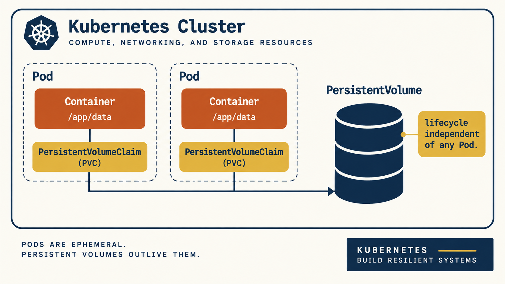

**Technical perspective:** PVs decouple storage provisioning from application deployment:
- **Multi-Attach Errors:** When a node crashes, cloud block storage (AWS EBS, GCP PD) attached to that node remains locked in the cloud hypervisor. When the pod is rescheduled to another node, it becomes stuck in `ContainerCreating` with `VolumeAttachment` timeout errors until the detachment completes.
- **Backup Limitations:** PV objects represent storage handles, not backup systems. Snapshots must be scheduled using `VolumeSnapshot` objects and CSI snapshot controllers.

### Component architecture flow

<iframe src="diagrams/topic-20.html" width="100%" height="560" style="border:none;"></iframe>

> [!TIP]
> View the interactive animated diagram in [diagrams/topic-20.html](diagrams/topic-20.html).

**Part 2 — Analogy / Zine:** A separate storage facility building down the road, built to outlast any single tenant.

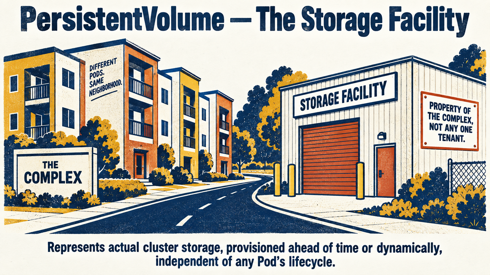

**Zine explanation:** The Pre-Built Storage Unit image represents a PersistentVolume's lifecycle independence from any individual Pod or tenant. Just as a storage unit in a complex exists as physical infrastructure that can be rented to one tenant, vacated, sanitized, and re-rented to another — independently of any specific lease — a PersistentVolume is provisioned by an administrator (or dynamically by a StorageClass) and exists as a cluster-level resource independent of any Pod. The Reclaim Policy (Retain/Delete/Recycle) determines what happens to the PV after a PVC releases it — like deciding whether a storage unit gets cleared out or preserved for the same tenant. AccessModes (ReadWriteOnce, ReadWriteMany) reflect the physical constraint of whether a storage unit can be accessed from one or multiple buildings simultaneously.

* **Zine Text & Layout:**
* (Top): "PersistentVolume — The Storage Unit"
* (Caption): "Represents actual cluster storage, provisioned ahead of time or dynamically, independent of any Pod's lifecycle."

**Further reading**

- [Persistent Volumes](https://kubernetes.io/docs/concepts/storage/persistent-volumes/)
- [CKA Study Notes: Storage (Persistent Volumes)](../CKA_Study_Notes/08-storage.md)

### Demo — PersistentVolume (PV)

<div style="background:#000;color:#fff;border-radius:8px;padding:1rem;overflow:auto;box-shadow:0 2px 8px rgba(0,0,0,.25);"><pre style="background:transparent;color:#fff;margin:0;white-space:pre-wrap;">
SETUP
  kubectl create namespace zine-demo
  kubectl apply -f pv-setup.yaml -n zine-demo
  kubectl wait --for=condition=Ready pod/pvc-user -n zine-demo --timeout=90s

YAML  (pv-setup.yaml)
  apiVersion: v1
  kind: PersistentVolumeClaim
  metadata:
    name: demo-pvc
  spec:
    accessModes: ["ReadWriteOnce"]
    resources:
      requests:
        storage: 1Gi
  ---
  apiVersion: v1
  kind: Pod
  metadata:
    name: pvc-user
  spec:
    containers:
    - name: app
      image: busybox
      command: ["sh", "-c", "sleep 3600"]
      volumeMounts:
      - name: data
        mountPath: /data
    volumes:
    - name: data
      persistentVolumeClaim:
        claimName: demo-pvc

STEPS
  1. kubectl get pv
  2. PV=$(kubectl get pv -o jsonpath='{.items[0].metadata.name}')
  3. kubectl describe pv $PV | grep -E 'Status|Claim|StorageClass|Reclaim'
  4. kubectl delete pod pvc-user -n zine-demo
  5. kubectl get pv $PV   # still there after the Pod is gone

WHAT YOU SHOULD SEE
  The PV shows STATUS Bound and a Claim. After the Pod is deleted the PV is still listed: it lives at cluster level, independent of any Pod.

CLEANUP
  kubectl delete namespace zine-demo

NOTE
  This setup creates a claim and Pod so a PV exists to look at. The PV outlives the Pod.
</pre></div>


### Knowledge Check — Quiz

**Q1: What is the difference in scope between a PersistentVolume (PV) and a PersistentVolumeClaim (PVC)?**

- [ ] A) A PV is namespaced, while a PVC is cluster-scoped.
- [ ] B) A PV is a cluster-wide storage resource, while a PVC is a namespaced request for storage.
- [ ] C) Both PV and PVC must reside in the kube-system namespace.
- [ ] D) A PV can only be mounted by one pod across the entire cluster lifetime.

<details>
<summary>Reveal Answer &amp; Explanation</summary>

**Correct Answer:** B) A PV is a cluster-wide storage resource, while a PVC is a namespaced request for storage.

**Explanation:** PVs are cluster-level infrastructure objects created by admins or dynamic provisioners; PVCs are namespaced consumer objects created by developers.

</details>

**Q2: If a PersistentVolume has persistentVolumeReclaimPolicy set to Retain, what occurs when its bound PVC is deleted?**

- [ ] A) The underlying storage disk and data are immediately wiped.
- [ ] B) The PV moves to Released status; the volume and data remain intact on physical storage until manually reclaimed.
- [ ] C) The PV is automatically assigned to a random new Pod.
- [ ] D) The storage volume is resized to 0GB.

<details>
<summary>Reveal Answer &amp; Explanation</summary>

**Correct Answer:** B) The PV moves to Released status; the volume and data remain intact on physical storage until manually reclaimed.

**Explanation:** Retain prevents automated data loss: when the claim is deleted, the volume transitions to Released and requires manual administrator cleanup.

</details>

**Q3: What is the primary architectural difference in lifecycle and scope between a `PersistentVolume` (PV) and a `PersistentVolumeClaim` (PVC)?**

- [ ] A) PV is namespace-scoped; PVC is cluster-scoped.
- [ ] B) PV is a cluster-scoped storage resource provisioned by an administrator or CSI driver; PVC is a namespace-scoped request for storage made by a user/developer.
- [ ] C) PVs can only be attached to worker nodes; PVCs attach to control plane nodes.
- [ ] D) PVs store metadata; PVCs store actual data files.

<details>
<summary>Reveal Answer &amp; Explanation</summary>

**Correct Answer:** B) PV is a cluster-scoped storage resource provisioned by an administrator or CSI driver; PVC is a namespace-scoped request for storage made by a user/developer.

**Explanation:** A PersistentVolume is a cluster-wide resource representing underlying storage capacity. A PersistentVolumeClaim is a namespaced request that binds to a matching PV, separating platform storage provisioning from tenant consumption.

</details>

**Q4: What happens when a PersistentVolume with `persistentVolumeReclaimPolicy: Retain` is unbound after its associated PVC is deleted?**

- [ ] A) The PV and its underlying storage volume are immediately erased and deleted.
- [ ] B) The PV transitions to the `Released` status phase; the volume and data remain intact on the storage backend, but the PV cannot be bound to another PVC until manually scrubbed by an admin.
- [ ] C) The PV is immediately reassigned to the default namespace.
- [ ] D) The storage backend formats the partition using ext4.

<details>
<summary>Reveal Answer &amp; Explanation</summary>

**Correct Answer:** B) The PV transitions to the `Released` status phase; the volume and data remain intact on the storage backend, but the PV cannot be bound to another PVC until manually scrubbed by an admin.

**Explanation:** Under `Retain`, when a PVC is deleted, the PV moves to `Released`. The data is preserved safely on the storage device, but the PV cannot be claimed by another PVC until an administrator cleans the data and resets `claimRef`.

</details>

**Q5: What is the meaning of the `ReadWriteOncePod` (RWOP) access mode introduced in Kubernetes 1.22+?**

- [ ] A) The volume can be mounted as read-write by multiple pods across different nodes.
- [ ] B) The volume can be mounted as read-write by exactly one single Pod in the entire cluster, preventing multiple pods on the same node from corrupting the volume.
- [ ] C) The volume can only be written to once, after which it becomes read-only.
- [ ] D) The volume is wiped every time the pod restarts.

<details>
<summary>Reveal Answer &amp; Explanation</summary>

**Correct Answer:** B) The volume can be mounted as read-write by exactly one single Pod in the entire cluster, preventing multiple pods on the same node from corrupting the volume.

**Explanation:** `ReadWriteOnce` (RWO) allows multiple pods on the *same node* to read/write the volume. `ReadWriteOncePod` (RWOP) strictly restricts read-write access to a *single pod in the entire cluster*, preventing concurrent write corruption.

</details>

**Q6: Why must a PersistentVolume using a `local` volume source specify `nodeAffinity` in its specification?**

- [ ] A) To ensure the volume is replicated to all other nodes in the cluster.
- [ ] B) Because local storage exists on a specific physical disk on a specific node; the scheduler must bind and run consuming Pods on that exact node.
- [ ] C) To assign an IP address to the local disk.
- [ ] D) To enable encryption at rest on the local partition.

<details>
<summary>Reveal Answer &amp; Explanation</summary>

**Correct Answer:** B) Because local storage exists on a specific physical disk on a specific node; the scheduler must bind and run consuming Pods on that exact node.

**Explanation:** A local PV is tied directly to a local disk or partition on a single machine. The `nodeAffinity` field informs the Kubernetes scheduler which node hosts the data so workloads are placed where the disk physically exists.

</details>

## 21. PersistentVolumeClaim (PVC)

**Part 1 — Technical Discussion:** A **PersistentVolumeClaim (PVC)** is a user's request for storage in a specific namespace. It functions analogously to how a Pod requests compute resources (CPU/RAM): while administrators or StorageClasses provision PersistentVolumes, developers create PVCs declaring required capacity and access modes.

### 1-to-1 Binding Mechanics
- **Matching Criteria:** The control plane storage controller attempts to bind a PVC to an available PV based on:
  1. Matching `storageClassName`.
  2. Matching or compatible `accessModes`.
  3. PV capacity $\ge$ PVC requested storage.
- **Strict 1-to-1 Exclusivity:** Even if a PV has 100Gi and a PVC requests only 10Gi, once bound, that PV is completely consumed by that single claim. No other PVC can attach to the remainder.
- **PVC Phase Transitions:** `Pending` (no matching PV or waiting for consumer) $\rightarrow$ `Bound` (successfully paired) $\rightarrow$ `Lost` (bound PV was deleted).

### Workload Consumption
- Pods mount storage by referencing the PVC name under `spec.volumes[*].persistentVolumeClaim.claimName`.
- Linux mount paths (`mountPath`) are injected into the container's mount namespace (`mnt`) via Linux bind mounts.

```yaml
# pvc-workload-claim.yaml
# WHY THIS YAML: Shows the full PVC consumption lifecycle in one manifest.
# PVC 'accessModes: ReadWriteOnce': binds only to PVs supporting single-node mounting.
# PVC 'resources.requests.storage: 20Gi': minimum capacity required for binding.
# Pod 'persistentVolumeClaim.claimName: database-storage': Pod references PVC by name;
#   kubelet instructs the CSI driver to mount the volume at mountPath.
# The PVC remains bound even if the Pod is deleted -- data persists across Pod restarts.
apiVersion: v1
kind: PersistentVolumeClaim
metadata:
  name: database-storage
  namespace: data-tier
spec:
  accessModes:
    - ReadWriteOnce
  resources:
    requests:
      storage: 20Gi
  storageClassName: standard
---
apiVersion: v1
kind: Pod
metadata:
  name: database-server
  namespace: data-tier
spec:
  containers:
  - name: postgres
    image: registry.k8s.io/pause:3.9
    volumeMounts:
    - name: data
      mountPath: /var/lib/postgresql/data
  volumes:
  - name: data
    persistentVolumeClaim:
      claimName: database-storage
```

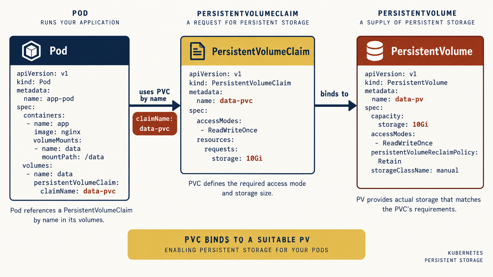

**Technical perspective:** PVC lifecycle errors can halt stateful deployments:
- **Pending PVC Diagnosis:** Run `kubectl describe pvc <name>` to inspect events. Common root causes include no available PVs matching the criteria, StorageClass misconfiguration, or quota exhaustion.
- **In-Use Protection:** Kubernetes applies the `kubernetes.io/pvc-protection` finalizer. If an operator attempts to delete an active PVC currently mounted by a running Pod, the deletion is deferred until the Pod terminates, preventing sudden filesystem corruption.

### Component architecture flow

<iframe src="diagrams/topic-21.html" width="100%" height="560" style="border:none;"></iframe>

> [!TIP]
> View the interactive animated diagram in [diagrams/topic-21.html](diagrams/topic-21.html).

**Part 2 — Analogy / Zine:** A universal rental agreement a tenant signs to claim a unit in the storage facility.

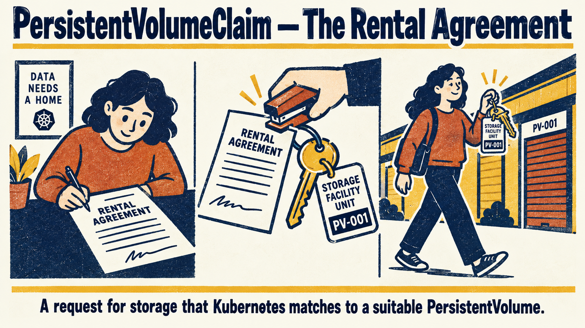

**Zine explanation:** The Rental Agreement image illustrates how a PersistentVolumeClaim is a formal request by a workload for specific storage characteristics — and the binding process that matches it to a suitable PersistentVolume. Just as a rental agreement specifies the storage unit size, access type (shared or exclusive), and duration, a PVC declares `accessModes`, `resources.requests.storage`, and optionally a `storageClassName`. The Kubernetes control plane then finds a PV that satisfies all constraints (capacity ≥ requested, matching access mode, matching StorageClass) and binds the two together. Once bound, the PVC is the Pod's exclusive handle to that storage — other Pods cannot claim the same PV while it's bound. If no PV matches, the PVC stays Pending until one becomes available.

* **Zine Text & Layout:**
* (Top): "PersistentVolumeClaim — The Rental Agreement"
* (Caption): "A request for storage that Kubernetes matches to a suitable PersistentVolume."

**Further reading**

- [PersistentVolumeClaims](https://kubernetes.io/docs/concepts/storage/persistent-volumes/#persistentvolumeclaims)
- [CKA Study Notes: Storage (Persistent Volume Claims)](../CKA_Study_Notes/08-storage.md)

### Demo — PersistentVolumeClaim (PVC)

<div style="background:#000;color:#fff;border-radius:8px;padding:1rem;overflow:auto;box-shadow:0 2px 8px rgba(0,0,0,.25);"><pre style="background:transparent;color:#fff;margin:0;white-space:pre-wrap;">
SETUP
  kubectl create namespace zine-demo

YAML  (demo-pvc.yaml)
  apiVersion: v1
  kind: PersistentVolumeClaim
  metadata:
    name: demo-pvc
  spec:
    accessModes: ["ReadWriteOnce"]
    resources:
      requests:
        storage: 1Gi
  ---
  apiVersion: v1
  kind: Pod
  metadata:
    name: pvc-user
  spec:
    containers:
    - name: app
      image: busybox
      command: ["sh", "-c", "echo hello > /data/hello.txt; sleep 3600"]
      volumeMounts:
      - name: data
        mountPath: /data
    volumes:
    - name: data
      persistentVolumeClaim:
        claimName: demo-pvc

STEPS
  1. kubectl apply -f demo-pvc.yaml -n zine-demo
  2. kubectl get pvc demo-pvc -n zine-demo   # Pending until a Pod uses it, if WaitForFirstConsumer
  3. kubectl wait --for=condition=Ready pod/pvc-user -n zine-demo --timeout=90s
  4. kubectl get pvc demo-pvc -n zine-demo   # now Bound
  5. kubectl get pv

WHAT YOU SHOULD SEE
  The PVC goes Pending, then Bound once the Pod starts. A new PV appears with the claim's name, provisioned automatically.

CLEANUP
  kubectl delete namespace zine-demo   # the PV is removed too under the default Delete reclaim policy

NOTE
  The claim is matched to a real volume without anyone creating the PV by hand.
</pre></div>


### Knowledge Check — Quiz

**Q1: What state does a PVC remain in if no existing PV matches its capacity and accessModes, and no dynamic provisioner is configured?**

- [ ] A) Failed
- [ ] B) Pending
- [ ] C) Terminating
- [ ] D) Running

<details>
<summary>Reveal Answer &amp; Explanation</summary>

**Correct Answer:** B) Pending

**Explanation:** The PVC remains Pending until a matching PV is created or dynamically provisioned, and any Pod referencing that PVC will be blocked from starting.

</details>

**Q2: Which access mode allows a single volume to be mounted read-write by multiple pods simultaneously across different worker nodes?**

- [ ] A) ReadWriteOnce (RWO)
- [ ] B) ReadOnlyMany (ROX)
- [ ] C) ReadWriteMany (RWX)
- [ ] D) ReadWriteOncePod (RWOP)

<details>
<summary>Reveal Answer &amp; Explanation</summary>

**Correct Answer:** C) ReadWriteMany (RWX)

**Explanation:** ReadWriteMany (RWX) permits simultaneous read/write mounting across multiple nodes (typically backed by NFS, CephFS, or cloud file storage).

</details>

**Q3: What three main criteria does the PersistentVolume controller evaluate when binding a PVC to a PersistentVolume?**

- [ ] A) Pod CPU request, Node memory capacity, and Kernel version.
- [ ] B) StorageClass name, Access Modes, and Capacity (PV capacity must be >= requested PVC capacity).
- [ ] C) Container image tag, Namespace quota, and Host network port.
- [ ] D) Git commit SHA, Docker daemon version, and DNS search domain.

<details>
<summary>Reveal Answer &amp; Explanation</summary>

**Correct Answer:** B) StorageClass name, Access Modes, and Capacity (PV capacity must be >= requested PVC capacity).

**Explanation:** A PVC binds to a PV only when both share the same StorageClass (or both have none), the PV supports all requested access modes (RWO, RWX, etc.), and the PV capacity meets or exceeds the requested storage size.

</details>

**Q4: If a user requires expanding an existing PersistentVolumeClaim from 10Gi to 50Gi, what must be true about the underlying StorageClass?**

- [ ] A) The StorageClass must have `allowVolumeExpansion: true`.
- [ ] B) The StorageClass must be marked as `readOnly: true`.
- [ ] C) The StorageClass must use `reclaimPolicy: Recycle`.
- [ ] D) Storage expansion is strictly prohibited in Kubernetes without recreating the cluster.

<details>
<summary>Reveal Answer &amp; Explanation</summary>

**Correct Answer:** A) The StorageClass must have `allowVolumeExpansion: true`.

**Explanation:** Volume expansion requires `allowVolumeExpansion: true` on the StorageClass. When enabled, users can edit `spec.resources.requests.storage` on the PVC, and the CSI driver will resize the underlying storage volume.

</details>

**Q5: What is the purpose of the `kubernetes.io/pvc-protection` finalizer attached to a PersistentVolumeClaim?**

- [ ] A) It encrypts files written to the volume with AES-256.
- [ ] B) It delays the physical deletion of a PVC while it is actively being used by a running Pod, preventing data corruption or abrupt volume detachment.
- [ ] C) It automatically synchronizes PVC contents to an external S3 bucket.
- [ ] D) It prevents users from deleting any namespaces.

<details>
<summary>Reveal Answer &amp; Explanation</summary>

**Correct Answer:** B) It delays the physical deletion of a PVC while it is actively being used by a running Pod, preventing data corruption or abrupt volume detachment.

**Explanation:** The Storage Object Protection feature attaches the `kubernetes.io/pvc-protection` finalizer to active PVCs. If an operator runs `kubectl delete pvc`, the PVC stays in `Terminating` until no active Pod is referencing it.

</details>

**Q6: How can a single PersistentVolumeClaim be mounted into two different directories inside a container, or shared across multiple subdirectories, without exposing the root of the volume?**

- [ ] A) Using the `volumeMounts.subPath` parameter.
- [ ] B) By creating multiple symlinks in the container Dockerfile.
- [ ] C) Using the `spec.volumeDevices` array.
- [ ] D) PVCs cannot mount subdirectories.

<details>
<summary>Reveal Answer &amp; Explanation</summary>

**Correct Answer:** A) Using the `volumeMounts.subPath` parameter.

**Explanation:** `volumeMounts.subPath` allows mounting a specific subfolder within a volume instead of its root directory, enabling sharing of a single volume across multiple mounts or containers without exposing the parent filesystem.

</details>

## 22. StorageClass

**Part 1 — Technical Discussion:** A **StorageClass** provides dynamic storage provisioning for Kubernetes clusters, eliminating the administrative overhead of manually creating static PersistentVolumes. It acts as an abstraction template defining provisioner plugins, cloud storage parameters, and volume binding behaviors.

### Key Architectural Parameters
- **`provisioner`:** The CSI plugin driver responsible for communicating with cloud or storage APIs (e.g., `ebs.csi.aws.com`, `pd.csi.storage.gke.io`).
- **`volumeBindingMode`:**
  - `Immediate` (Default): The PV is provisioned dynamically as soon as the PVC is submitted. (Warning: risks provisioning storage in an Availability Zone where no compute capacity exists).
  - `WaitForFirstConsumer`: Delays volume creation and binding until a Pod using the claim is scheduled. Guarantees that the storage volume is provisioned in the exact same Availability Zone / topology domain as the scheduled worker node.
- **`allowVolumeExpansion`:** Enables online filesystem expansion without restarting workloads (`true`).
- **`reclaimPolicy`:** Sets whether dynamically provisioned volumes are `Delete` or `Retain`.

```yaml
# dynamic-storage-class.yaml
# WHY THIS YAML: This StorageClass drives the dynamic provisioning workflow.
# 'provisioner: ebs.csi.aws.com': the CSI plugin receiving CreateVolume gRPC calls
#   when a PVC referencing this class is created -- calls the AWS EBS API.
# 'volumeBindingMode: WaitForFirstConsumer': provisioning DELAYED until a Pod is scheduled.
#   Ensures the EBS volume is created in the same AZ as the node -- avoids AZ failures.
# 'allowVolumeExpansion: true': operators can increase PVC size post-creation; no migration.
# 'reclaimPolicy: Delete': PVC deletion automatically destroys the EBS volume.
apiVersion: storage.k8s.io/v1
kind: StorageClass
metadata:
  name: fast-nvme-sc
provisioner: ebs.csi.aws.com
volumeBindingMode: WaitForFirstConsumer
allowVolumeExpansion: true
reclaimPolicy: Delete
parameters:
  type: gp3
  iops: "3000"
  throughput: "125"
  encrypted: "true"
```

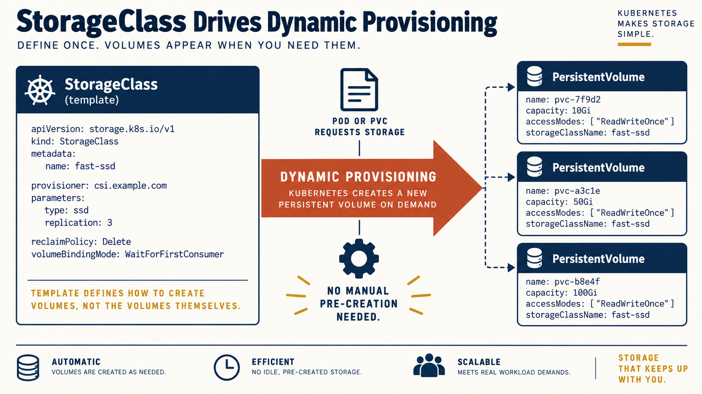

**Technical perspective:** Dynamic storage provisioning is mandatory for modern multi-zone cloud architectures:
- **AZ Placement Conflicts:** Using `volumeBindingMode: Immediate` with cloud block storage often results in `volume node affinity conflict` errors if the cloud disk is created in `us-east-1a` while the scheduler attempts to place the Pod in `us-east-1b`. Always use `WaitForFirstConsumer` in multi-zone clusters.
- **Default StorageClass:** Marking a class with annotation `storageclass.kubernetes.io/is-default-class: "true"` automatically assigns it to any PVC submitted without an explicit `storageClassName`.

### Component architecture flow

<iframe src="diagrams/topic-22.html" width="100%" height="560" style="border:none;"></iframe>

> [!TIP]
> View the interactive animated diagram in [diagrams/topic-22.html](diagrams/topic-22.html).

**Part 2 — Analogy / Zine:** The complex's pre-approved construction blueprint for building a brand-new storage unit on demand, instead of waiting for one to already exist.

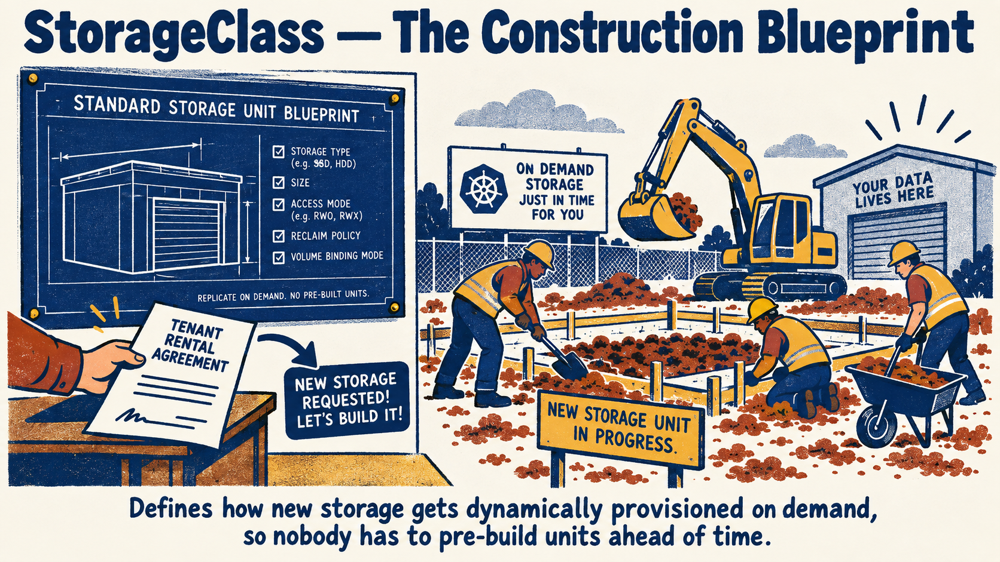

**Zine explanation:** The Construction Blueprint image captures StorageClass as the template that defines how new storage gets dynamically manufactured on demand, eliminating the need for pre-provisioned PVs. Just as a blueprint specifies the materials, size standards, and construction method for new units — and a construction crew follows it every time a new unit is needed — a StorageClass specifies the provisioner (e.g., `ebs.csi.aws.com`), volume type (`gp3`), and parameters (IOPS, encryption). When a PVC references a StorageClass, the CSI provisioner receives a CreateVolume call, creates the actual disk in the cloud, and returns a PV that gets auto-bound to the PVC. The `volumeBindingMode: WaitForFirstConsumer` setting delays provisioning until a Pod is actually scheduled, ensuring the disk is created in the same availability zone as the node.

* **Zine Text & Layout:**
* (Top): "StorageClass — The Construction Blueprint"
* (Caption): "Defines how new storage gets dynamically provisioned on demand, so nobody has to pre-build units ahead of time."

**Further reading**

- [StorageClasses](https://kubernetes.io/docs/concepts/storage/storage-classes/)
- [CKA Study Notes: Storage (StorageClasses & Dynamic Provisioning)](../CKA_Study_Notes/08-storage.md)

### Demo — StorageClass

<div style="background:#000;color:#fff;border-radius:8px;padding:1rem;overflow:auto;box-shadow:0 2px 8px rgba(0,0,0,.25);"><pre style="background:transparent;color:#fff;margin:0;white-space:pre-wrap;">
SETUP
  kubectl create namespace zine-demo

STEPS
  1. kubectl get storageclass
  2. kubectl get storageclass standard -o yaml | grep -E 'provisioner|volumeBindingMode|reclaimPolicy'
  3. cat <<EOF | kubectl apply -f -
apiVersion: v1
kind: PersistentVolumeClaim
metadata:
  name: sc-demo-pvc
  namespace: zine-demo
spec:
  accessModes:
    - ReadWriteOnce
  resources:
    requests:
      storage: 1Gi
  storageClassName: standard
EOF
  4. kubectl get pvc sc-demo-pvc -n zine-demo
  5. kubectl get pv | grep sc-demo-pvc

WHAT YOU SHOULD SEE
  Step 1: lists available StorageClasses; one marked (default) is used when
    no storageClassName is specified in a PVC.
  Step 2: shows the provisioner (e.g. rancher.io/local-path for kind) and
    volumeBindingMode — WaitForFirstConsumer means provisioning waits for a Pod.
  Step 4/5: PVC moves to Bound and a PV is dynamically created matching the class.
  This proves dynamic provisioning: no admin pre-created the PV — the StorageClass did it.

CLEANUP
  kubectl delete pvc sc-demo-pvc -n zine-demo
  kubectl delete namespace zine-demo
</pre></div>


### Knowledge Check — Quiz

**Q1: What is the primary purpose of setting volumeBindingMode: WaitForFirstConsumer on a StorageClass?**

- [ ] A) It ensures volumes are created without filesystem formatting.
- [ ] B) It delays dynamic volume creation until a Pod referencing the PVC is scheduled, ensuring the volume is provisioned in the same availability zone as the Pod.
- [ ] C) It disables volume caching in memory.
- [ ] D) It prevents users from deleting the PVC.

<details>
<summary>Reveal Answer &amp; Explanation</summary>

**Correct Answer:** B) It delays dynamic volume creation until a Pod referencing the PVC is scheduled, ensuring the volume is provisioned in the same availability zone as the Pod.

**Explanation:** Without this setting, volumes might be provisioned in an availability zone where candidate worker nodes lack capacity, preventing the pod from scheduling.

</details>

**Q2: In dynamic volume provisioning, what component detects an unbound PVC and calls the underlying storage infrastructure to create the disk?**

- [ ] A) The kube-scheduler.
- [ ] B) The CSI external-provisioner controller.
- [ ] C) The CoreDNS daemon.
- [ ] D) The container runtime runc binary.

<details>
<summary>Reveal Answer &amp; Explanation</summary>

**Correct Answer:** B) The CSI external-provisioner controller.

**Explanation:** The CSI external-provisioner sidecar watches for PVCs with an associated StorageClass and issues CreateVolume gRPC requests to the CSI driver.

</details>

**Q3: What is the key difference between `volumeBindingMode: Immediate` and `volumeBindingMode: WaitForFirstConsumer` on a StorageClass?**

- [ ] A) Immediate allocates storage and binds the volume as soon as the PVC is created; WaitForFirstConsumer delays provisioning and binding until a Pod using the PVC is scheduled, ensuring the volume is created in the pod's availability zone.
- [ ] B) Immediate provisions storage on SSDs; WaitForFirstConsumer provisions on HDDs.
- [ ] C) Immediate is used for NFS; WaitForFirstConsumer is used for iSCSI.
- [ ] D) Immediate skips volume format; WaitForFirstConsumer formats the filesystem.

<details>
<summary>Reveal Answer &amp; Explanation</summary>

**Correct Answer:** A) Immediate allocates storage and binds the volume as soon as the PVC is created; WaitForFirstConsumer delays provisioning and binding until a Pod using the PVC is scheduled, ensuring the volume is created in the pod's availability zone.

**Explanation:** With `Immediate`, cloud disks are provisioned immediately upon PVC creation without knowing where the consumer pod will run, risking multi-zone scheduling deadlocks. `WaitForFirstConsumer` delays creation until scheduling, guaranteeing zonal alignment.

</details>

**Q4: How does Kubernetes determine which StorageClass to use when a developer creates a PVC without specifying `storageClassName`?**

- [ ] A) It rejects the PVC with an HTTP 400 Bad Request.
- [ ] B) It uses the StorageClass marked with the annotation `storageclass.kubernetes.io/is-default-class: 'true'`. If none exists, dynamic provisioning fails.
- [ ] C) It randomly selects a StorageClass from the cluster.
- [ ] D) It always falls back to hostPath storage.

<details>
<summary>Reveal Answer &amp; Explanation</summary>

**Correct Answer:** B) It uses the StorageClass marked with the annotation `storageclass.kubernetes.io/is-default-class: 'true'`. If none exists, dynamic provisioning fails.

**Explanation:** If `storageClassName` is omitted from a PVC, the dynamic provisioner looks for a StorageClass with the default annotation. If a default class is found, it is used; otherwise, the PVC remains unbound until a class or PV is supplied.

</details>

**Q5: In the modern Container Storage Interface (CSI) specification, what are the two distinct plugins deployed for a storage driver?**

- [ ] A) A Client plugin and a Server plugin.
- [ ] B) A CSI Controller plugin (Deployment for provisioning/attaching volumes via cloud APIs) and a CSI Node plugin (DaemonSet for formatting/mounting volumes onto worker nodes).
- [ ] C) A Master plugin and a Worker plugin.
- [ ] D) An Ingress plugin and an Egress plugin.

<details>
<summary>Reveal Answer &amp; Explanation</summary>

**Correct Answer:** B) A CSI Controller plugin (Deployment for provisioning/attaching volumes via cloud APIs) and a CSI Node plugin (DaemonSet for formatting/mounting volumes onto worker nodes).

**Explanation:** A complete CSI driver consists of a central Controller plugin (watches PV/PVCs and invokes cloud APIs to create/attach disks) and a Node plugin running on every node (invoked by Kubelet to format, partition, and mount disks locally).

</details>

**Q6: Which Kubernetes resource allows taking point-in-time copies of a PersistentVolumeClaim for backup and disaster recovery?**

- [ ] A) VolumeSnapshot
- [ ] B) StorageBackup
- [ ] C) DiskClone
- [ ] D) PVCCopy

<details>
<summary>Reveal Answer &amp; Explanation</summary>

**Correct Answer:** A) VolumeSnapshot

**Explanation:** The CSI Snapshotting feature uses `VolumeSnapshot` (namespaced user request), `VolumeSnapshotClass` (storage driver parameters), and `VolumeSnapshotContent` (cluster-scoped snapshot record) to manage point-in-time storage backups.

</details>

## 23. Role

**Part 1 — Technical Discussion:** A **Role** is a namespaced Role-Based Access Control (RBAC) resource that defines a discrete set of additive permissions within a single Kubernetes namespace. Permissions cannot deny access; access is denied by default unless explicitly granted by a rule.

### Anatomy of RBAC Policy Rules
- **`apiGroups`:** The core API group is denoted by `""`. Other groups include `"apps"`, `"batch"`, `"networking.k8s.io"`.
- **`resources`:** The target objects (`pods`, `services`, `deployments`, `configmaps`). Subresources are targeted using slashes (e.g., `pods/log`, `pods/exec`, `pods/status`).
- **`resourceNames`:** (Optional) Restricts access to specific named instances of a resource (e.g., only the ConfigMap named `app-config`).
- **`verbs`:** Allowed API operations (`get`, `list`, `watch`, `create`, `update`, `patch`, `delete`, `deletecollection`).

```yaml
# namespaced-developer-role.yaml
# WHY THIS YAML: A Role defines the permission boundary within a single Namespace.
# 'namespace: development': Role ONLY applies to this namespace -- cannot grant cross-namespace access.
# 'resources: ["pods", "pods/log"]': access to Pod objects AND their log subresource.
#   Without 'pods/log', kubectl logs is denied even with pod get permissions.
# 'verbs: ["get", "list", "watch"]': read-only access -- satisfies least-privilege.
# This Role has ZERO effect until a RoleBinding attaches it to a subject.
apiVersion: rbac.authorization.k8s.io/v1
kind: Role
metadata:
  name: pod-operator
  namespace: development
rules:
- apiGroups: [""]
  resources: ["pods", "pods/log"]
  verbs: ["get", "list", "watch"]
- apiGroups: [""]
  resources: ["pods/exec"]
  verbs: ["create"]
- apiGroups: ["apps"]
  resources: ["deployments"]
  verbs: ["get", "list", "patch"]
```

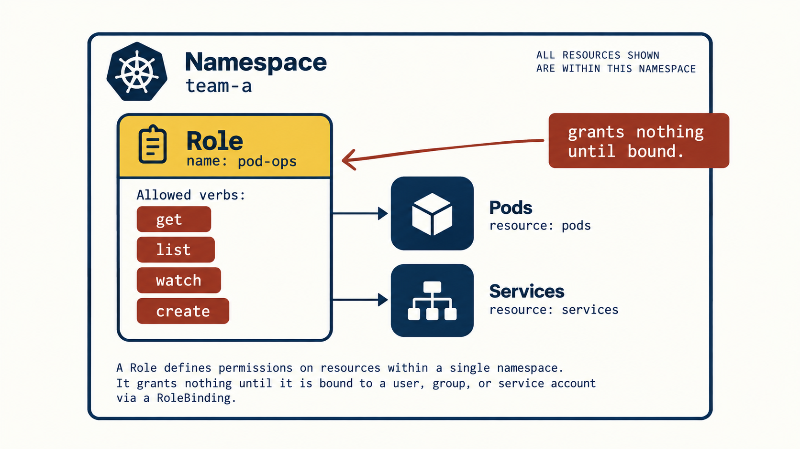

**Technical perspective:** RBAC Role definition is the cornerstone of multi-tenant namespace security:
- **Principle of Least Privilege:** Avoid granting wildcard (`"*"`) verbs or resources.
- **Privilege Escalation Risks:** Granting `create` or `patch` on `pods/exec` grants arbitrary command execution inside containers, effectively yielding the privileges of the container process. Similarly, access to `secrets` allows token theft.

### Component architecture flow

<iframe src="diagrams/topic-23.html" width="100%" height="560" style="border:none;"></iframe>

> [!TIP]
> View the interactive animated diagram in [diagrams/topic-23.html](diagrams/topic-23.html).

**Part 2 — Analogy / Zine:** A printed set of house rules for one specific building — what's allowed inside, but nobody's name is on it yet.

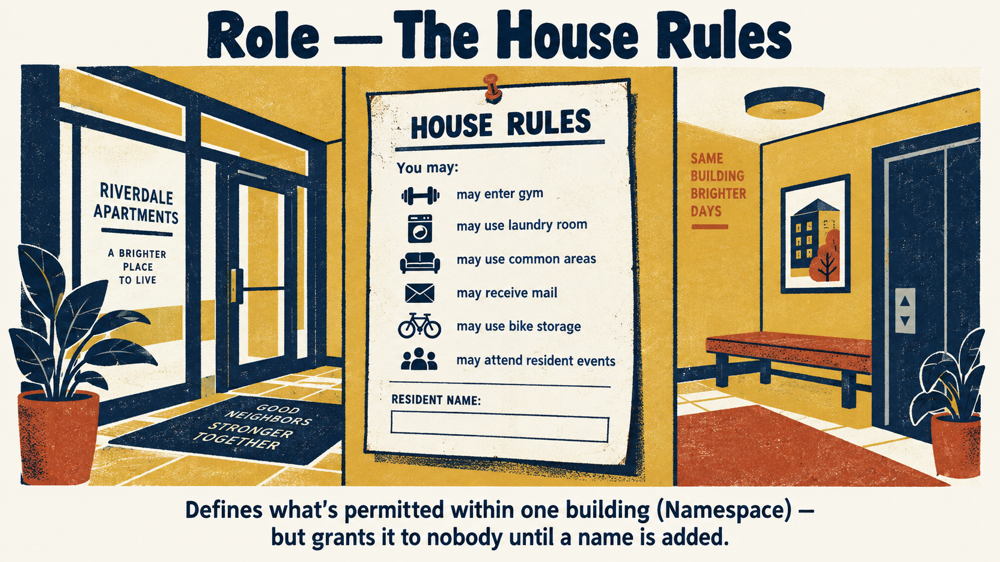

**Zine explanation:** The House Rules image maps directly to a Kubernetes Role's definition: a set of permissions scoped to a single Namespace that says what API verbs (get, list, create, delete) are allowed on which resources (pods, services, secrets). Just as house rules posted in a building define what residents may and may not do within that building — but are meaningless until someone agrees to follow them — a Role object does nothing on its own. It is purely a declaration of allowed actions. A Role cannot grant permissions outside its Namespace (that requires ClusterRole). Until a RoleBinding connects a Role to a subject (user, group, ServiceAccount), it has no effect on any entity.

* **Zine Text & Layout:**
* (Top): "Role — The House Rules"
* (Caption): "Defines what's permitted within one building (Namespace) — but grants it to nobody until a name is added."

**Further reading**

- [RBAC roles and permissions](https://kubernetes.io/docs/reference/access-authn-authz/rbac/#role-and-clusterrole)
- [CKA Study Notes: Application Lifecycle (ConfigMaps)](../CKA_Study_Notes/04-application-lifecycle-management.md)

### Demo — Role

<div style="background:#000;color:#fff;border-radius:8px;padding:1rem;overflow:auto;box-shadow:0 2px 8px rgba(0,0,0,.25);"><pre style="background:transparent;color:#fff;margin:0;white-space:pre-wrap;">
SETUP
  kubectl create namespace zine-demo

STEPS
  1. kubectl create role pod-reader --verb=get,list,watch --resource=pods -n zine-demo
  2. kubectl get role pod-reader -n zine-demo -o yaml
  3. kubectl auth can-i list pods -n zine-demo --as system:serviceaccount:zine-demo:default
  4. kubectl create rolebinding pod-reader-binding --role=pod-reader --serviceaccount=zine-demo:default -n zine-demo
  5. kubectl auth can-i list pods -n zine-demo --as system:serviceaccount:zine-demo:default

WHAT YOU SHOULD SEE
  Step 2: the Role YAML shows 'verbs', 'resources', and the namespace scope.
  Step 3: 'no' — the default ServiceAccount has no permissions before binding.
  Step 5: 'yes' — the RoleBinding activates the Role for the ServiceAccount.
  This proves the two-step RBAC model: Role defines permissions, RoleBinding activates them.

CLEANUP
  kubectl delete rolebinding pod-reader-binding -n zine-demo
  kubectl delete role pod-reader -n zine-demo
  kubectl delete namespace zine-demo
</pre></div>


### Knowledge Check — Quiz

**Q1: Can a standard Kubernetes Role grant permissions to list nodes or create namespaces?**

- [ ] A) Yes, if the namespace field is omitted.
- [ ] B) No, because a Role is strictly namespaced and can only grant permissions on namespaced resources within its own namespace; cluster-scoped resources require a ClusterRole.
- [ ] C) Yes, if granted by an administrator.
- [ ] D) Only on worker nodes, not control plane nodes.

<details>
<summary>Reveal Answer &amp; Explanation</summary>

**Correct Answer:** B) No, because a Role is strictly namespaced and can only grant permissions on namespaced resources within its own namespace; cluster-scoped resources require a ClusterRole.

**Explanation:** Roles are bounded by namespace; non-namespaced resources (like Nodes, Namespaces, and PersistentVolumes) can only be governed by ClusterRoles.

</details>

**Q2: How does the Kubernetes RBAC authorization engine evaluate permissions when multiple Roles or rules apply to a single identity?**

- [ ] A) It uses a deny-first evaluation where explicit denies override allows.
- [ ] B) It uses purely additive (allow-only) evaluation; if any matching rule grants the verb on the resource, the action is permitted.
- [ ] C) It takes the intersection of all granted permissions.
- [ ] D) It grants access only if the client certificate was created within 24 hours.

<details>
<summary>Reveal Answer &amp; Explanation</summary>

**Correct Answer:** B) It uses purely additive (allow-only) evaluation; if any matching rule grants the verb on the resource, the action is permitted.

**Explanation:** Kubernetes RBAC has no 'deny' rules; all permissions are additive (whitelisting). Access is authorized if at least one rule grants the requested verb.

</details>

**Q3: What is the maximum data storage size limit for a single ConfigMap object in standard Kubernetes?**

- [ ] A) 10 Megabytes (10MB)
- [ ] B) 1 Megabyte (1MB)
- [ ] C) 512 Kilobytes (512KB)
- [ ] D) Unlimited (bounded only by host RAM)

<details>
<summary>Reveal Answer &amp; Explanation</summary>

**Correct Answer:** B) 1 Megabyte (1MB)

**Explanation:** Because ConfigMaps are stored directly as JSON/protobuf entries within etcd, they are bounded by etcd's default request and value size limit of 1 Megabyte (1MB).

</details>

**Q4: How does setting `immutable: true` on a ConfigMap improve cluster performance and operational safety?**

- [ ] A) It encrypts the ConfigMap with GPG keys.
- [ ] B) It protects against accidental configuration drift and significantly reduces kube-apiserver load by allowing Kubelets to stop watching the ConfigMap for updates.
- [ ] C) It forces the ConfigMap to be stored in the Linux kernel ring buffer.
- [ ] D) It prevents the ConfigMap from being backed up by etcd snapshots.

<details>
<summary>Reveal Answer &amp; Explanation</summary>

**Correct Answer:** B) It protects against accidental configuration drift and significantly reduces kube-apiserver load by allowing Kubelets to stop watching the ConfigMap for updates.

**Explanation:** Marking a ConfigMap immutable ensures its contents cannot be altered, which allows Kubelets to close active watch connections to the API server, significantly reducing control plane watch overhead in large-scale deployments.

</details>

**Q5: When a ConfigMap is mounted into a Pod as a volume, how are updates to the ConfigMap reflected inside the running container?**

- [ ] A) The container is immediately killed and restarted with exit code 0.
- [ ] B) The Kubelet's periodic sync loop updates the projected symlink targets inside the container without restarting the pod, though applications must detect the file modification themselves.
- [ ] C) Updates are never reflected until the worker node is rebooted.
- [ ] D) The Kubelet re-executes the container entrypoint script.

<details>
<summary>Reveal Answer &amp; Explanation</summary>

**Correct Answer:** B) The Kubelet's periodic sync loop updates the projected symlink targets inside the container without restarting the pod, though applications must detect the file modification themselves.

**Explanation:** Volume-mounted ConfigMaps are updated automatically by the Kubelet using atomic directory symlink swapping. In contrast, environment variables loaded via `valueFrom` or `envFrom` are never updated without a pod restart.

</details>

**Q6: Which field in a ConfigMap manifest is specifically designed to store non-UTF-8 binary data such as small certificates or gzip archives?**

- [ ] A) spec.binaryFiles
- [ ] B) binaryData (base64-encoded strings)
- [ ] C) data.bytes
- [ ] D) metadata.rawBinary

<details>
<summary>Reveal Answer &amp; Explanation</summary>

**Correct Answer:** B) binaryData (base64-encoded strings)

**Explanation:** The `binaryData` field allows storing binary assets as base64-encoded strings, whereas standard `data` requires valid UTF-8 strings.

</details>

## 24. RoleBinding

**Part 1 — Technical Discussion:** A **RoleBinding** grants the permissions defined in a `Role` (or a `ClusterRole`) to a defined list of **Subjects** within a specific namespace.

### Subject Types & Scopes
- **`User`:** External human identities authenticated via X.509 certs or OIDC (e.g., `alice@company.com`).
- **`Group`:** Collections of users (e.g., `system:authenticated`, `dev-team`).
- **`ServiceAccount`:** Workload identities assigned to Pods within the cluster.

### ClusterRole Reusability via RoleBinding
- A RoleBinding can reference a **ClusterRole** as its `roleRef`. In this pattern, the broad permissions defined in the ClusterRole apply **only within the namespace of the RoleBinding**. This avoids duplicating common Role templates across hundreds of namespaces.
- **Immutability:** The `roleRef` field of a RoleBinding is immutable upon creation. To change the referenced Role, the RoleBinding must be deleted and recreated.

```yaml
# role-binding-spec.yaml
# WHY THIS YAML: A RoleBinding ACTIVATES a Role by connecting it to specific subjects.
# 'roleRef.kind: Role': references a namespace-scoped Role (not cluster-wide).
# 'subjects': the identities receiving the permissions.
#   'kind: User / name: alice': a human user identified by their kubeconfig credential.
#   'kind: ServiceAccount': a Pod's identity -- allows in-cluster processes to use this role.
# A RoleBinding cannot grant permissions beyond what is in the referenced Role.
# Changing subjects is the fastest way to grant/revoke access without modifying the Role.
apiVersion: rbac.authorization.k8s.io/v1
kind: RoleBinding
metadata:
  name: bind-pod-operator
  namespace: development
subjects:
- kind: ServiceAccount
  name: cicd-deployer
  namespace: development
- kind: Group
  name: developers
  apiGroup: rbac.authorization.k8s.io
roleRef:
  kind: Role
  name: pod-operator
  apiGroup: rbac.authorization.k8s.io
```

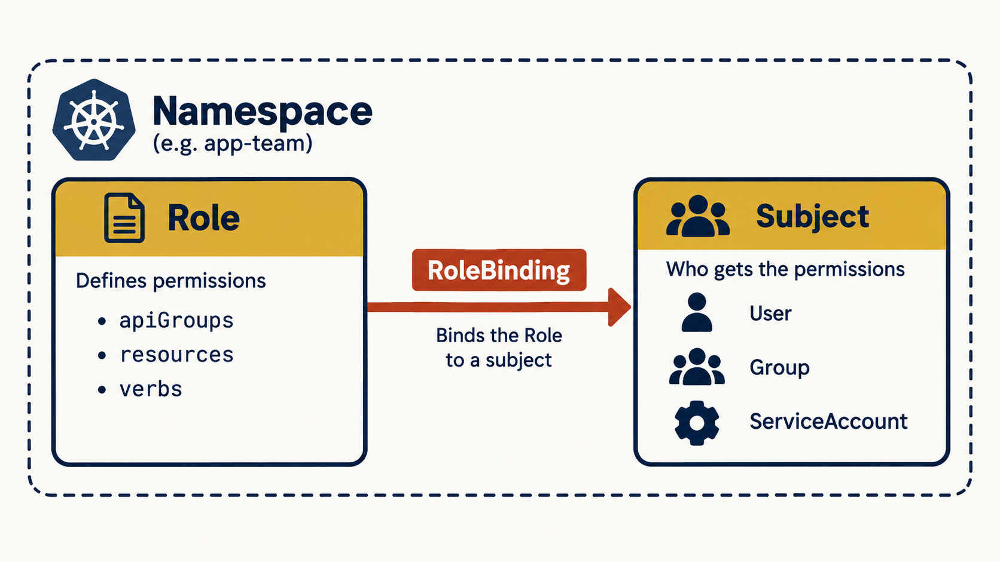

**Technical perspective:** Auditing effective permissions is a mandatory CKA administrative skill:
- **`kubectl auth can-i` Testing:** Verify access directly from the CLI without switching credentials:
  ```bash
  kubectl auth can-i create pods --as=system:serviceaccount:development:cicd-deployer -n development
  ```
- **Namespace Boundary Leaks:** Accidental assignment of an administrative ClusterRole via a ClusterRoleBinding instead of a RoleBinding grants cluster-wide superuser access across all namespaces.

### Component architecture flow

<iframe src="diagrams/topic-24.html" width="100%" height="560" style="border:none;"></iframe>

> [!TIP]
> View the interactive animated diagram in [diagrams/topic-24.html](diagrams/topic-24.html).

**Part 2 — Analogy / Zine:** The clipboard sign-up sheet where a specific tenant's name gets added under the house rules, officially granting them those permissions.

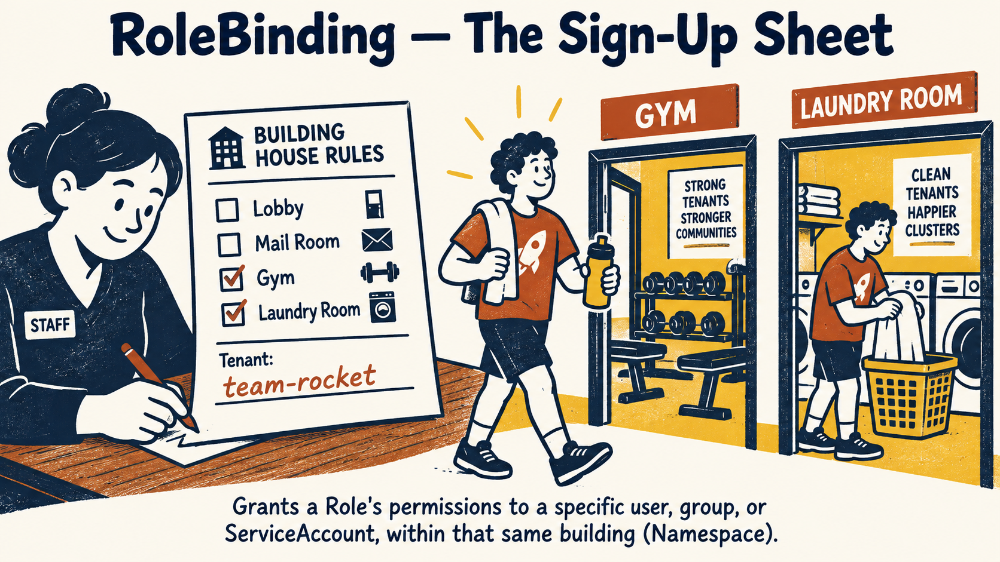

**Zine explanation:** The Sign-Up Sheet image represents RoleBinding as the object that activates a Role by connecting it to a specific identity. Just as house rules only become binding when a tenant signs the agreement — making them personally accountable to those rules — a RoleBinding is the `subjects:` list that says "these users/groups/ServiceAccounts are bound to this Role in this Namespace." The RoleBinding creates no new permissions itself; it references an existing Role or ClusterRole and binds it. Using a ClusterRole in a RoleBinding (not ClusterRoleBinding) grants only namespace-scoped permissions, which is a useful pattern for reusing permission templates without cluster-wide exposure.

* **Zine Text & Layout:**
* (Top): "RoleBinding — The Sign-Up Sheet"
* (Caption): "Grants a Role's permissions to a specific user, group, or ServiceAccount, within that same building (Namespace)."

**Further reading**

- [RoleBindings](https://kubernetes.io/docs/reference/access-authn-authz/rbac/#rolebinding-and-clusterrolebinding)
- [CKA Study Notes: Security (Secrets & Encryption at Rest)](../CKA_Study_Notes/06-security.md)

### Demo — RoleBinding

<div style="background:#000;color:#fff;border-radius:8px;padding:1rem;overflow:auto;box-shadow:0 2px 8px rgba(0,0,0,.25);"><pre style="background:transparent;color:#fff;margin:0;white-space:pre-wrap;">
SETUP
  kubectl create namespace zine-demo
  kubectl create role pod-reader --verb=get,list,watch --resource=pods -n zine-demo

STEPS
  1. kubectl auth can-i get pods --as=jane -n zine-demo   # no
  2. kubectl create rolebinding read-pods-binding --role=pod-reader --user=jane -n zine-demo
  3. kubectl auth can-i get pods --as=jane -n zine-demo   # yes

WHAT YOU SHOULD SEE
  can-i flips from 'no' to 'yes' the moment the binding exists.

CLEANUP
  kubectl delete namespace zine-demo

NOTE
  The name got added to the sign-up sheet.
</pre></div>


### Knowledge Check — Quiz

**Q1: Can a RoleBinding located in namespace 'dev' reference a ClusterRole in its roleRef?**

- [ ] A) No, RoleBindings can only bind namespaced Roles.
- [ ] B) Yes; it binds the ClusterRole's defined permissions, but scopes them strictly to namespace 'dev'.
- [ ] C) Yes, and it automatically grants the user cluster-wide admin access.
- [ ] D) Only if the user has root privileges on the control-plane host.

<details>
<summary>Reveal Answer &amp; Explanation</summary>

**Correct Answer:** B) Yes; it binds the ClusterRole's defined permissions, but scopes them strictly to namespace 'dev'.

**Explanation:** Referencing a ClusterRole in a namespaced RoleBinding is a common pattern to reuse common permission sets (e.g. edit or view) within an individual namespace.

</details>

**Q2: What happens if an administrator attempts to modify the roleRef field of an existing RoleBinding object?**

- [ ] A) The API server updates all bound subjects immediately.
- [ ] B) The API server rejects the mutation because the roleRef field is immutable; the binding must be deleted and recreated.
- [ ] C) The referenced Role is deleted.
- [ ] D) The subjects lose access to the cluster permanently.

<details>
<summary>Reveal Answer &amp; Explanation</summary>

**Correct Answer:** B) The API server rejects the mutation because the roleRef field is immutable; the binding must be deleted and recreated.

**Explanation:** roleRef is an immutable field in Kubernetes RBAC to prevent accidental privilege escalation; you must delete and recreate the binding to point to a new role.

</details>

**Q3: By default in a vanilla Kubernetes installation without external configuration, how are Secret resources stored inside the etcd database?**

- [ ] A) Encrypted using hardware AES-NI instructions.
- [ ] B) Encrypted with RSA-4096 bit public keys.
- [ ] C) Unencrypted as plain base64-encoded text, meaning anyone with read access to etcd can decode the secrets in plaintext.
- [ ] D) Stored in volatile worker node memory only.

<details>
<summary>Reveal Answer &amp; Explanation</summary>

**Correct Answer:** C) Unencrypted as plain base64-encoded text, meaning anyone with read access to etcd can decode the secrets in plaintext.

**Explanation:** By default, Kubernetes Secrets are merely base64-encoded strings stored in plaintext in etcd. Base64 is an encoding format, NOT encryption; anyone with access to etcd or API backup files can immediately decode the contents.

</details>

**Q4: To enable native Encryption at Rest for Secrets inside etcd, what resource file must be passed to the `kube-apiserver` via `--encryption-provider-config`?**

- [ ] A) KubeletConfiguration
- [ ] B) EncryptionConfiguration (specifying providers such as `kms`, `aescbc`, or `secretbox`)
- [ ] C) SecurityContextConstraints
- [ ] D) ClusterRoleBinding

<details>
<summary>Reveal Answer &amp; Explanation</summary>

**Correct Answer:** B) EncryptionConfiguration (specifying providers such as `kms`, `aescbc`, or `secretbox`)

**Explanation:** The `EncryptionConfiguration` file configures encryption providers (e.g. cloud KMS, AES-CBC, secretbox). The first provider in the list encrypts newly written secrets, while subsequent providers allow reading previously written secrets.

</details>

**Q5: When a Secret is mounted into a Pod as a volume, what underlying filesystem technology does Kubelet use on the worker node to safeguard credentials?**

- [ ] A) An encrypted NTFS partition.
- [ ] B) A RAM-backed `tmpfs` volume, ensuring the secret payload is stored in memory and never written to the host's physical hard drive.
- [ ] C) A remote S3 bucket mount.
- [ ] D) An unformatted raw disk block.

<details>
<summary>Reveal Answer &amp; Explanation</summary>

**Correct Answer:** B) A RAM-backed `tmpfs` volume, ensuring the secret payload is stored in memory and never written to the host's physical hard drive.

**Explanation:** Kubelet mounts secrets as `tmpfs` (temporary in-memory filesystems). Because tmpfs resides strictly in volatile RAM, secrets are never flushed or written to the node's physical persistent storage.

</details>

**Q6: What is the primary difference between a native Kubernetes Secret and using an External Secrets Operator (ESO) with HashiCorp Vault or AWS Secrets Manager?**

- [ ] A) Native Secrets do not work with container images.
- [ ] B) External Secrets Operator synchronizes secrets from an enterprise secret management system into Kubernetes Secrets dynamically, maintaining centralized rotation, auditing, and fine-grained access policies outside the cluster.
- [ ] C) Native Secrets require Java runtimes to decrypt.
- [ ] D) External Secrets Operator stores secrets directly in DNS TXT records.

<details>
<summary>Reveal Answer &amp; Explanation</summary>

**Correct Answer:** B) External Secrets Operator synchronizes secrets from an enterprise secret management system into Kubernetes Secrets dynamically, maintaining centralized rotation, auditing, and fine-grained access policies outside the cluster.

**Explanation:** External Secrets Operator bridges Kubernetes with external vaults (AWS Secrets Manager, HashiCorp Vault, Azure Key Vault), allowing security teams to manage secrets, rotations, and audit trails centrally outside of Kubernetes YAML.

</details>

## 25. ClusterRole

**Part 1 — Technical Discussion:** A **ClusterRole** is a cluster-scoped RBAC resource. Unlike namespaced Roles, ClusterRoles govern permissions across the entire cluster (all namespaces) or for non-namespaced cluster-level resources.

### Scope of ClusterRole Grants
1. **Cluster-Scoped Resources:** Resources that do not belong to any namespace (`nodes`, `persistentvolumes`, `namespaces`, `storageclasses`).
2. **Non-Resource URLs:** HTTP endpoints exposed by the API server (`/healthz`, `/metrics`, `/version`, `/api`).
3. **Aggregated ClusterRoles:** Combines multiple ClusterRoles into one using label selectors (`aggregationRule.clusterRoleSelectors`).
4. **Namespace Template:** Defines a standardized permission set reusable across namespaces via individual RoleBindings.

```yaml
# node-viewer-clusterrole.yaml
# WHY THIS YAML: A ClusterRole grants permissions to cluster-scoped resources.
# 'resources: ["nodes"]': Nodes have no namespace -- a regular Role CANNOT grant this.
#   Only ClusterRole can grant access to non-namespaced API objects.
# 'resources: ["nodes/metrics", "nodes/stats"]': subresources for kubelet metric endpoints.
# ClusterRoles can also be used in namespace-scoped RoleBindings to reuse
#   permission templates across namespaces without granting cluster-wide access.
apiVersion: rbac.authorization.k8s.io/v1
kind: ClusterRole
metadata:
  name: cluster-node-observer
rules:
- apiGroups: [""]
  resources: ["nodes", "nodes/status"]
  verbs: ["get", "list", "watch"]
- apiGroups: [""]
  resources: ["persistentvolumes"]
  verbs: ["get", "list", "watch"]
- nonResourceURLs: ["/metrics"]
  verbs: ["get"]
```

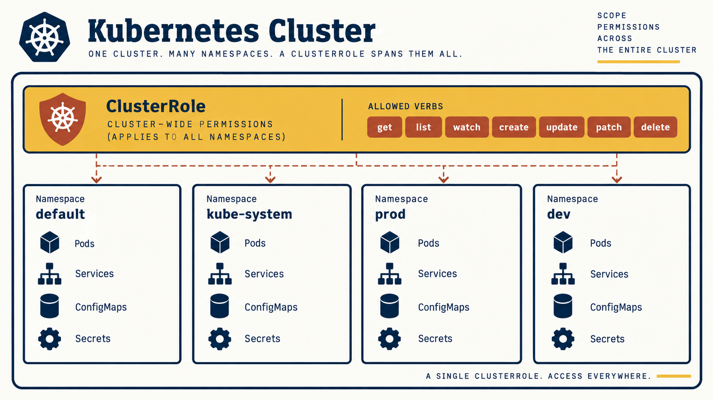

**Technical perspective:** ClusterRoles represent the highest administrative security tier:
- **Built-in Superuser Roles:** Kubernetes ships with built-in ClusterRoles: `cluster-admin` (complete superuser access), `admin`, `edit`, and `view`. Modifying built-in ClusterRoles is discouraged because cluster upgrades will reconcile and overwrite changes.
- **Node Restriction:** The `Node` authorizer and `NodeRestriction` admission plugin restrict kubelet identities from modifying objects outside their own node, mitigating worker node compromise.

### Component architecture flow

<iframe src="diagrams/topic-25.html" width="100%" height="560" style="border:none;"></iframe>

> [!TIP]
> View the interactive animated diagram in [diagrams/topic-25.html](diagrams/topic-25.html).

**Part 2 — Analogy / Zine:** A master house-rules sheet that applies across every building in the entire complex, not just one.

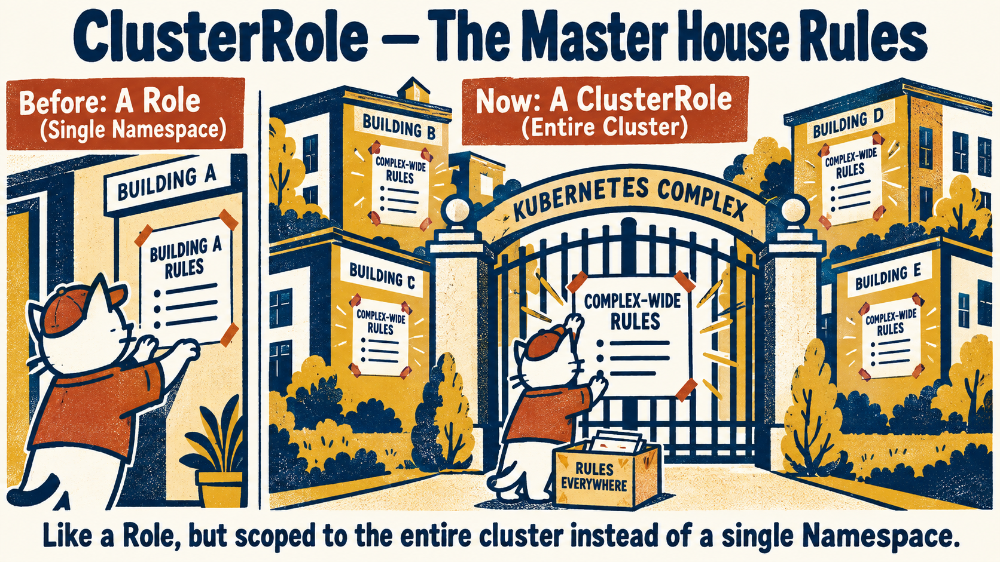

**Zine explanation:** The Master House Rules image illustrates ClusterRole's scope: unlike a Role that applies within one Namespace, ClusterRole permissions span the entire cluster and can include non-namespaced resources (Nodes, PersistentVolumes, ClusterRoles themselves). Just as master house rules at the complex level govern things that transcend individual buildings — elevator access, parking lot policies, fire safety standards — a ClusterRole can grant access to cluster-wide resources or be reused across Namespaces via RoleBindings. Aggregated ClusterRoles (`aggregationRule`) automatically merge permissions from ClusterRoles matching a label selector, allowing additive plugin-style extension of the admin role without modifying it directly.

* **Zine Text & Layout:**
* (Top): "ClusterRole — The Master House Rules"
* (Caption): "Like a Role, but scoped to the entire cluster instead of a single Namespace."

**Further reading**

- [RBAC roles and permissions](https://kubernetes.io/docs/reference/access-authn-authz/rbac/#role-and-clusterrole)
- [CKA Study Notes: Security (Roles & RoleBindings)](../CKA_Study_Notes/06-security.md)

### Demo — ClusterRole

<div style="background:#000;color:#fff;border-radius:8px;padding:1rem;overflow:auto;box-shadow:0 2px 8px rgba(0,0,0,.25);"><pre style="background:transparent;color:#fff;margin:0;white-space:pre-wrap;">
SETUP
  (none: uses what is already in the cluster)

STEPS
  1. kubectl get clusterroles | grep -v system: | head -10
  2. kubectl describe clusterrole view | grep -E 'Name:|Resources:|Verbs:' | head -15
  3. kubectl auth can-i list nodes --as system:serviceaccount:default:default
  4. kubectl create clusterrole node-viewer --verb=get,list --resource=nodes
  5. kubectl auth can-i list nodes --as system:serviceaccount:default:default
  6. kubectl create clusterrolebinding node-viewer-binding --clusterrole=node-viewer --serviceaccount=default:default
  7. kubectl auth can-i list nodes --as system:serviceaccount:default:default

WHAT YOU SHOULD SEE
  Step 2: ClusterRole 'view' shows cluster-scoped resources and their allowed verbs.
  Step 3: 'no' — default SA cannot list Nodes (cluster-scoped resource).
  Step 5: still 'no' — ClusterRole alone does nothing without a ClusterRoleBinding.
  Step 7: 'yes' — ClusterRoleBinding activates the ClusterRole cluster-wide.
  Nodes are non-namespaced resources; only ClusterRole can grant access to them.

CLEANUP
  kubectl delete clusterrolebinding node-viewer-binding
  kubectl delete clusterrole node-viewer
</pre></div>


### Knowledge Check — Quiz

**Q1: When is a ClusterRole strictly required instead of a namespaced Role?**

- [ ] A) When deploying a container that uses more than 1GB of memory.
- [ ] B) When granting access to non-namespaced resources (e.g. Nodes, PersistentVolumes) or non-resource URLs (e.g. /healthz).
- [ ] C) Whenever using kind on a local machine.
- [ ] D) When mounting an emptyDir volume.

<details>
<summary>Reveal Answer &amp; Explanation</summary>

**Correct Answer:** B) When granting access to non-namespaced resources (e.g. Nodes, PersistentVolumes) or non-resource URLs (e.g. /healthz).

**Explanation:** Non-namespaced API endpoints and cluster-wide resources do not belong to any individual namespace and therefore cannot be expressed in a namespaced Role.

</details>

**Q2: How do aggregated ClusterRoles work in Kubernetes?**

- [ ] A) They combine multiple physical worker nodes into a single logical entity.
- [ ] B) The cluster dynamically combines rules from other ClusterRoles matching specified label selectors into an aggregate role.
- [ ] C) They merge all user passwords into a single hash.
- [ ] D) They compress API requests to improve network throughput.

<details>
<summary>Reveal Answer &amp; Explanation</summary>

**Correct Answer:** B) The cluster dynamically combines rules from other ClusterRoles matching specified label selectors into an aggregate role.

**Explanation:** ClusterRole aggregation allows custom controllers to extend built-in roles (like admin or edit) by labeling new ClusterRoles that are automatically merged.

</details>

**Q3: What is the scope and limitation of a Kubernetes `Role` compared to a `ClusterRole`?**

- [ ] A) A Role can grant permissions across all namespaces and cluster-scoped resources.
- [ ] B) A Role is strictly namespace-scoped; its permission rules apply only to resources within the specific namespace in which the Role is defined.
- [ ] C) A Role can only be bound to ServiceAccounts, never to human Users.
- [ ] D) A Role applies only to worker nodes.

<details>
<summary>Reveal Answer &amp; Explanation</summary>

**Correct Answer:** B) A Role is strictly namespace-scoped; its permission rules apply only to resources within the specific namespace in which the Role is defined.

**Explanation:** A `Role` is always bound to a single namespace and can only grant access to namespaced resources (Pods, Services, Deployments) within that namespace. It cannot grant access to cluster-scoped resources like Nodes or PVs.

</details>

**Q4: Which design principle governs all Kubernetes RBAC authorization rules?**

- [ ] A) Deny rules always take precedence over Allow rules.
- [ ] B) RBAC is purely additive (white-listing only); there are no 'Deny' rules. If an action is not explicitly permitted by a rule, it is denied by default.
- [ ] C) Permissions are inherited automatically from parent namespaces.
- [ ] D) Root users are hardcoded in the Linux kernel and bypass RBAC.

<details>
<summary>Reveal Answer &amp; Explanation</summary>

**Correct Answer:** B) RBAC is purely additive (white-listing only); there are no 'Deny' rules. If an action is not explicitly permitted by a rule, it is denied by default.

**Explanation:** Kubernetes RBAC is strictly additive: rules grant capabilities (`allow`). There is no syntax to declare a `deny`. All actions not explicitly permitted by at least one binding evaluating to true are forbidden.

</details>

**Q5: What happens if a `RoleBinding` in namespace `finance` references a `ClusterRole` named `secret-reader` in its `roleRef`?**

- [ ] A) The subjects gain permission to read Secrets across all namespaces in the cluster.
- [ ] B) The subjects gain permission to read Secrets ONLY within the `finance` namespace.
- [ ] C) The API server rejects the RoleBinding with a validation error.
- [ ] D) The cluster converts the namespace into a cluster administrator.

<details>
<summary>Reveal Answer &amp; Explanation</summary>

**Correct Answer:** B) The subjects gain permission to read Secrets ONLY within the `finance` namespace.

**Explanation:** A `RoleBinding` can reference a `ClusterRole`. When it does, it scopes the permissions defined in the ClusterRole strictly down to the namespace of the RoleBinding, enabling reuse of common permission definitions across namespaces.

</details>

**Q6: How are subresources (such as reading pod logs or executing commands inside a container) represented in RBAC rules?**

- [ ] A) By listing them as `resources: ["pods/log", "pods/exec"]` in the rule definition.
- [ ] B) By adding annotations to the pod manifest.
- [ ] C) By granting full root access to the Node object.
- [ ] D) Subresources cannot be controlled with RBAC.

<details>
<summary>Reveal Answer &amp; Explanation</summary>

**Correct Answer:** A) By listing them as `resources: ["pods/log", "pods/exec"]` in the rule definition.

**Explanation:** Subresources use a slash delimiter format in the `resources` array (e.g., `pods/log`, `pods/exec`, `pods/status`, `deployments/scale`), allowing granular RBAC controls without granting broad object access.

</details>

## 26. ClusterRoleBinding

**Part 1 — Technical Discussion:** A **ClusterRoleBinding** binds a `ClusterRole` to subjects across the **entire cluster** and across every single namespace.

### Global Authorization Boundary
- While a `RoleBinding` restricts permissions to its host namespace, a `ClusterRoleBinding` grants the referenced ClusterRole's permissions globally.
- Binding the `cluster-admin` ClusterRole to a subject grants unrestricted, multi-tenant administrative power, effectively bypassing all namespace isolation.
- Used standardly by platform daemons, CNI networking plugins, CSI storage drivers, and monitoring operators (e.g., Prometheus) that require cluster-wide metrics scraping.

```yaml
# sre-clusterrolebinding.yaml
# WHY THIS YAML: A ClusterRoleBinding grants cluster-wide permissions -- use with caution.
# 'roleRef.kind: ClusterRole': must reference a ClusterRole for cluster-wide binding.
# 'subjects.kind: Group': binds an entire OIDC/LDAP group, not just one user.
#   Group membership changes in the identity provider automatically update K8s access.
# ClusterRoleBindings don't expire -- treat cluster-admin bindings as critical security assets.
# Prefer namespace-scoped RoleBindings when cluster-wide access is not required.
apiVersion: rbac.authorization.k8s.io/v1
kind: ClusterRoleBinding
metadata:
  name: sre-global-observers
subjects:
- kind: Group
  name: sre-engineering
  apiGroup: rbac.authorization.k8s.io
roleRef:
  kind: ClusterRole
  name: cluster-node-observer
  apiGroup: rbac.authorization.k8s.io
```

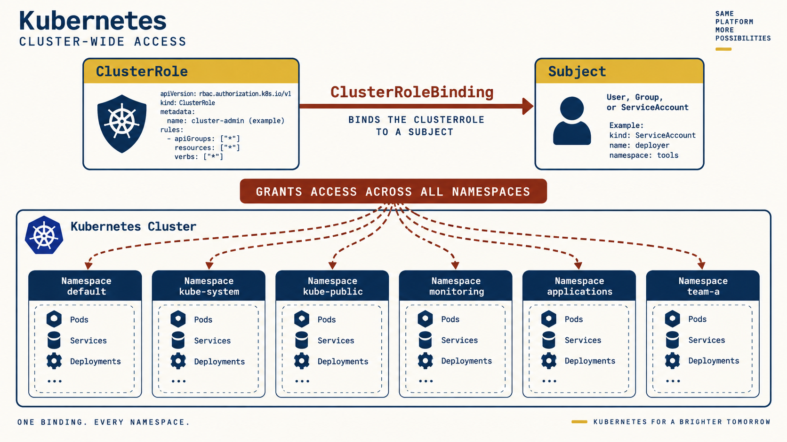

**Technical perspective:** Misconfigured ClusterRoleBindings are a top vulnerability in Kubernetes clusters:
- **Audit & Review:** Platform engineers must routinely audit all active ClusterRoleBindings:
  ```bash
  kubectl get clusterrolebindings -o jsonpath='{range .items[*]}{.metadata.name}{"	"}{.roleRef.name}{"	"}{.subjects[*].name}{"
"}{end}'
  ```
- **Default ServiceAccount Hardening:** Never bind a ClusterRole to `system:serviceaccount:<namespace>:default`, as any unprivileged pod created in that namespace inherits cluster-level authority.

### Component architecture flow

<iframe src="diagrams/topic-26.html" width="100%" height="560" style="border:none;"></iframe>

> [!TIP]
> View the interactive animated diagram in [diagrams/topic-26.html](diagrams/topic-26.html).

**Part 2 — Analogy / Zine:** A master key issued to one person that works on every building in the complex, not just one unit.

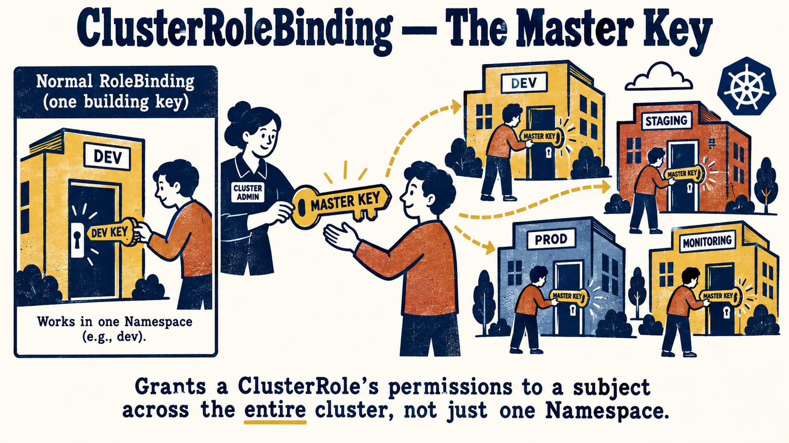

**Zine explanation:** The Master Key image shows ClusterRoleBinding's function: granting a ClusterRole's permissions to a subject across all Namespaces and cluster-scoped resources simultaneously. Just as a master key opens every door in every building of the complex — a single physical key with unrestricted access — a ClusterRoleBinding gives the bound subject cluster-wide authority. This is why cluster-admin ClusterRoleBindings must be reviewed carefully: binding a compromised ServiceAccount or user to cluster-admin is equivalent to giving a stranger the master key to every room. Least-privilege design prefers RoleBindings (scoped to individual Namespaces) over ClusterRoleBindings wherever possible.

* **Zine Text & Layout:**
* (Top): "ClusterRoleBinding — The Master Key"
* (Caption): "Grants a ClusterRole's permissions to a subject across the entire cluster, not just one Namespace."

**Further reading**

- [RoleBindings](https://kubernetes.io/docs/reference/access-authn-authz/rbac/#rolebinding-and-clusterrolebinding)
- [CKA Study Notes: Security (ClusterRoles & ClusterRoleBindings)](../CKA_Study_Notes/06-security.md)

### Demo — ClusterRoleBinding

<div style="background:#000;color:#fff;border-radius:8px;padding:1rem;overflow:auto;box-shadow:0 2px 8px rgba(0,0,0,.25);"><pre style="background:transparent;color:#fff;margin:0;white-space:pre-wrap;">
SETUP
  kubectl create clusterrole node-reader --verb=get,list,watch --resource=nodes

STEPS
  1. kubectl auth can-i get nodes --as=jane   # no
  2. kubectl create clusterrolebinding read-nodes-binding --clusterrole=node-reader --user=jane
  3. kubectl auth can-i get nodes --as=jane   # yes
  4. kubectl auth can-i get nodes --as=jane -n kube-system   # yes, same answer in any namespace

WHAT YOU SHOULD SEE
  can-i flips from 'no' to 'yes', and the answer is the same in every namespace.

CLEANUP
  kubectl delete clusterrolebinding read-nodes-binding
  kubectl delete clusterrole node-reader

NOTE
  The master key is not scoped to any one building.
</pre></div>


### Knowledge Check — Quiz

**Q1: What is the operational risk of binding the built-in cluster-admin ClusterRole to a ServiceAccount using a ClusterRoleBinding?**

- [ ] A) It limits the ServiceAccount to reading configmaps only.
- [ ] B) It grants unrestricted superuser privileges across every namespace and cluster-scoped resource, creating a critical security risk if the token is compromised.
- [ ] C) It causes the kubelet to reboot every worker node.
- [ ] D) It disables TLS encryption across the cluster.

<details>
<summary>Reveal Answer &amp; Explanation</summary>

**Correct Answer:** B) It grants unrestricted superuser privileges across every namespace and cluster-scoped resource, creating a critical security risk if the token is compromised.

**Explanation:** cluster-admin provides unrestricted access (* verbs on * resources); granting it globally violates least privilege and exposes the entire platform to compromise.

</details>

**Q2: Can a ClusterRoleBinding grant permissions that are limited to a single namespace?**

- [ ] A) Yes, by setting the namespace field in the binding metadata.
- [ ] B) No; ClusterRoleBindings are cluster-scoped and always apply across all namespaces; to scope permissions to one namespace, use a RoleBinding.
- [ ] C) Yes, if the subject is a ServiceAccount.
- [ ] D) Only on worker nodes.

<details>
<summary>Reveal Answer &amp; Explanation</summary>

**Correct Answer:** B) No; ClusterRoleBindings are cluster-scoped and always apply across all namespaces; to scope permissions to one namespace, use a RoleBinding.

**Explanation:** ClusterRoleBindings are inherently global; scoping permissions to a specific namespace requires a namespaced RoleBinding.

</details>

**Q3: Which types of resources require a `ClusterRole` and `ClusterRoleBinding` rather than a standard `Role`?**

- [ ] A) Namespaced Pods and ConfigMaps.
- [ ] B) Cluster-scoped resources (such as `Nodes`, `PersistentVolumes`, `StorageClasses`, `Namespaces`) and non-resource URL paths (like `/healthz`, `/metrics`).
- [ ] C) Deployments with more than 10 replicas.
- [ ] D) Pods running with hostNetwork: true.

<details>
<summary>Reveal Answer &amp; Explanation</summary>

**Correct Answer:** B) Cluster-scoped resources (such as `Nodes`, `PersistentVolumes`, `StorageClasses`, `Namespaces`) and non-resource URL paths (like `/healthz`, `/metrics`).

**Explanation:** Non-namespaced resources (Nodes, PVs, Namespaces, StorageClasses) and non-resource HTTP endpoints (`/healthz`, `/metrics`, `/livez`) do not belong to any namespace and can only be authorized via ClusterRoles and ClusterRoleBindings.

</details>

**Q4: What is an Aggregated ClusterRole and how is it constructed?**

- [ ] A) A ClusterRole created by merging etcd database tables directly.
- [ ] B) A ClusterRole that uses `aggregationRule.clusterRoleSelectors` to dynamically combine permissions from multiple other ClusterRoles matching specific label selectors.
- [ ] C) A ClusterRole that automatically grants admin rights to every user in the company.
- [ ] D) A ClusterRole generated by the CNI plugin.

<details>
<summary>Reveal Answer &amp; Explanation</summary>

**Correct Answer:** B) A ClusterRole that uses `aggregationRule.clusterRoleSelectors` to dynamically combine permissions from multiple other ClusterRoles matching specific label selectors.

**Explanation:** Aggregated ClusterRoles combine permissions from other ClusterRoles using label selectors (`matchLabels`). Controllers dynamically populate the aggregated role's rules, allowing custom CRDs to automatically extend default roles like `admin` or `edit`.

</details>

**Q5: Which built-in user-facing ClusterRole provides full read-write access to namespaced resources (except Roles and RoleBindings) while denying cluster-scoped administrative rights?**

- [ ] A) cluster-admin
- [ ] B) admin
- [ ] C) view
- [ ] D) system:node

<details>
<summary>Reveal Answer &amp; Explanation</summary>

**Correct Answer:** B) admin

**Explanation:** The built-in `admin` role grants read-write access to most namespaced resources (including Deployments, Services, Secrets), whereas `cluster-admin` grants unrestricted superuser rights across the entire cluster.

</details>

**Q6: How can an administrator quickly verify whether a specific ServiceAccount or user has permission to perform an action using the CLI?**

- [ ] A) kubectl auth can-i <verb> <resource> --as=<user> [-n <namespace>]
- [ ] B) kubectl test rbac --user=<user>
- [ ] C) kubectl get permissions --all
- [ ] D) kubectl describe cluster-admin

<details>
<summary>Reveal Answer &amp; Explanation</summary>

**Correct Answer:** A) kubectl auth can-i <verb> <resource> --as=<user> [-n <namespace>]

**Explanation:** `kubectl auth can-i <verb> <resource>` (e.g. `kubectl auth can-i create deployments --as=developer -n dev`) queries the API server's SelfSubjectAccessReview API to evaluate and report whether the action is authorized.

</details>

## 27. ServiceAccount

**Part 1 — Technical Discussion:** A **ServiceAccount** provides an authenticable identity for in-cluster processes running inside Pods to interact with the `kube-apiserver`. Unlike human users managed by external enterprise directories, ServiceAccounts are native API objects.

### Modern Token Architecture: Bound Projected ServiceAccount Tokens
- **Legacy Tokens (Pre-1.24):** Used static, non-expiring JWT tokens stored in indefinitely persisting Secret objects.
- **Bound Projected Tokens (Modern Standard):** Tokens are short-lived, time-bound, audience-restricted OpenID Connect (OIDC) JWTs issued directly by the API server's TokenRequest API.
- **Linux Volume Mount:** The kubelet mounts the projected token as an in-memory `tmpfs` volume inside every container at `/var/run/secrets/kubernetes.io/serviceaccount/`:
  - `token`: Short-lived cryptographic JWT.
  - `ca.crt`: Certificate Authority bundle for verifying API server identity.
  - `namespace`: The current namespace string.
- **Token Invalidation:** Tokens are cryptographically bound to the specific Pod instance; deleting the Pod immediately invalidates the token.

```yaml
# secure-serviceaccount-pod.yaml
# WHY THIS YAML: Shows secure ServiceAccount usage for in-cluster API access.
# 'serviceAccountName: metrics-reader': kubelet mounts a projected SA token at
#   /var/run/secrets/kubernetes.io/serviceaccount/token inside the container.
#   The app uses this bearer token to authenticate to kube-apiserver as this SA identity.
# 'automountServiceAccountToken: false': when set on the SA, no token is mounted --
#   best practice for Pods that don't need API access (prevents credential exposure).
# RBAC RoleBindings determine what the SA can DO with the token after authenticating.
apiVersion: v1
kind: ServiceAccount
metadata:
  name: auditor-sa
  namespace: security
automountServiceAccountToken: false
---
apiVersion: v1
kind: Pod
metadata:
  name: auditor-pod
  namespace: security
spec:
  serviceAccountName: auditor-sa
  automountServiceAccountToken: true
  containers:
  - name: auditor
    image: registry.k8s.io/pause:3.9
```

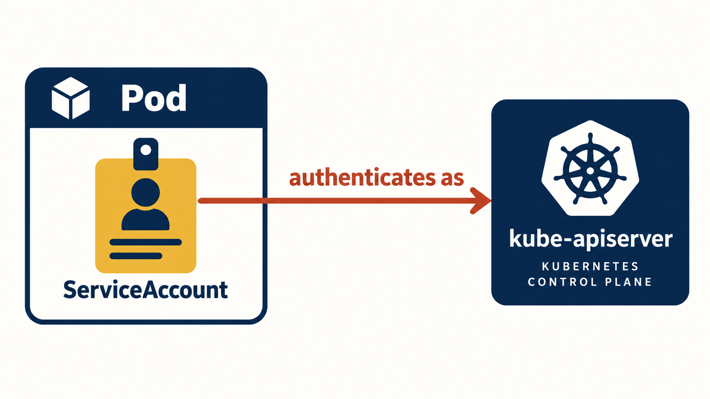

**Technical perspective:** Securing workload identity is essential for zero-trust Kubernetes architectures:
- **`automountServiceAccountToken: false`:** Workloads that do not need to call the Kubernetes API should always set `automountServiceAccountToken: false` on either the ServiceAccount or PodSpec, eliminating credentials that attackers could steal via container breakout.
- **Cloud Workload Identity:** Modern cloud architectures (AWS IRSA, GCP Workload Identity, Azure Workload ID) federate the ServiceAccount OIDC token directly with cloud IAM, eliminating static hardcoded cloud API keys.

### Component architecture flow

<iframe src="diagrams/topic-27.html" width="100%" height="560" style="border:none;"></iframe>

> [!TIP]
> View the interactive animated diagram in [diagrams/topic-27.html](diagrams/topic-27.html).

**Part 2 — Analogy / Zine:** A staff ID badge issued to a robot maintenance worker so the front desk knows it's an authorized employee, not a random visitor.

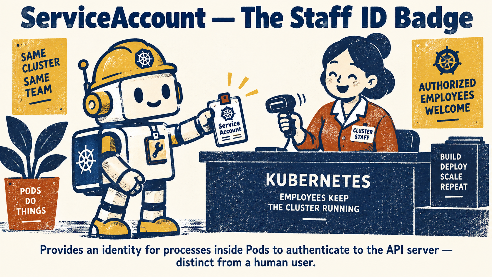

**Zine explanation:** The Staff ID Badge image represents ServiceAccount as the identity credential that processes running inside Pods use to authenticate to the kube-apiserver — distinct from human users who use kubeconfig certificates or OIDC tokens. Just as a staff ID badge identifies which employee is making a request to the building office (and what they're allowed to access based on their role) — without confusing them with a visiting tenant — a ServiceAccount provides a stable identity for Pods. The kubelet automatically mounts a projected ServiceAccount token as a file inside every container (`/var/run/secrets/kubernetes.io/serviceaccount/token`), which the application uses as a bearer token for API calls. ServiceAccounts are namespace-scoped and bound to RBAC Roles for least-privilege access control.

* **Zine Text & Layout:**
* (Top): "ServiceAccount — The Staff ID Badge"
* (Caption): "Provides an identity for processes inside Pods to authenticate to the API server — distinct from a human user."

**Further reading**

- [ServiceAccounts](https://kubernetes.io/docs/concepts/security/service-accounts/)
- [RBAC authorization](https://kubernetes.io/docs/reference/access-authn-authz/rbac/)
- [CKA Study Notes: Security (ServiceAccounts)](../CKA_Study_Notes/06-security.md)

### Demo — ServiceAccount

<div style="background:#000;color:#fff;border-radius:8px;padding:1rem;overflow:auto;box-shadow:0 2px 8px rgba(0,0,0,.25);"><pre style="background:transparent;color:#fff;margin:0;white-space:pre-wrap;">
SETUP
  kubectl create namespace zine-demo
  kubectl create serviceaccount demo-bot -n zine-demo

STEPS
  1. kubectl run badge-test --image=busybox -n zine-demo --overrides='{"spec":{"serviceAccountName":"demo-bot"}}' --rm -it --restart=Never -- sh -c 'ls /var/run/secrets/kubernetes.io/serviceaccount/; head -c 50 /var/run/secrets/kubernetes.io/serviceaccount/token; echo'

WHAT YOU SHOULD SEE
  The folder contains ca.crt, namespace and token. The first 50 characters of the token print (it starts with eyJ).

CLEANUP
  kubectl delete namespace zine-demo

NOTE
  Every Pod gets a token mounted automatically: its staff ID badge. The token is short-lived and rotated by the kubelet.
</pre></div>


### Knowledge Check — Quiz

**Q1: Under modern Kubernetes token projection (BoundServiceAccountTokenVolume), what happens when a Pod is deleted?**

- [ ] A) The token remains valid indefinitely.
- [ ] B) The projected token is tied to the Pod's lifecycle and becomes invalid when the Pod is deleted.
- [ ] C) The entire ServiceAccount is automatically deleted.
- [ ] D) The API server revokes all client certificates.

<details>
<summary>Reveal Answer &amp; Explanation</summary>

**Correct Answer:** B) The projected token is tied to the Pod's lifecycle and becomes invalid when the Pod is deleted.

**Explanation:** Projected service account tokens are cryptographically signed, audience-bound, time-limited, and bound to the specific Pod's UID, mitigating stolen token replay attacks.

</details>

**Q2: Where does kubelet mount the projected ServiceAccount token inside a container by default?**

- [ ] A) /etc/kubernetes/admin.conf
- [ ] B) /var/run/secrets/kubernetes.io/serviceaccount/
- [ ] C) /root/.kube/config
- [ ] D) /tmp/k8s/

<details>
<summary>Reveal Answer &amp; Explanation</summary>

**Correct Answer:** B) /var/run/secrets/kubernetes.io/serviceaccount/

**Explanation:** Kubelet automatically mounts the token, ca.crt, and namespace files into /var/run/secrets/kubernetes.io/serviceaccount/ unless automountServiceAccountToken: false is configured.

</details>

**Q3: What is the primary difference between a `ServiceAccount` and a standard Kubernetes User account?**

- [ ] A) ServiceAccounts are managed directly by Kubernetes API resources for in-cluster processes/Pods; User accounts represent humans and are managed externally (via certificates, OIDC, LDAP) without API objects.
- [ ] B) ServiceAccounts can only be used on Windows nodes.
- [ ] C) User accounts are stored in etcd; ServiceAccounts are stored on GitHub.
- [ ] D) ServiceAccounts cannot be bound to RBAC roles.

<details>
<summary>Reveal Answer &amp; Explanation</summary>

**Correct Answer:** A) ServiceAccounts are managed directly by Kubernetes API resources for in-cluster processes/Pods; User accounts represent humans and are managed externally (via certificates, OIDC, LDAP) without API objects.

**Explanation:** Kubernetes does not have an API resource for human Users (they are authenticated via external IdPs, X.509 certs, or tokens). ServiceAccounts are first-class namespaced Kubernetes API objects designed for machine workloads.

</details>

**Q4: In modern Kubernetes (1.24+), how are ServiceAccount tokens provided to Pods by default?**

- [ ] A) As static, non-expiring secret tokens permanently saved in the namespace's Secret store.
- [ ] B) Via the `TokenRequest` API as time-bound, audience-restricted, automatically rotated projected volume tokens mounted at `/var/run/secrets/kubernetes.io/serviceaccount/token`.
- [ ] C) Through an unencrypted environment variable called `$K8S_TOKEN`.
- [ ] D) By opening an SSH connection to the kube-apiserver.

<details>
<summary>Reveal Answer &amp; Explanation</summary>

**Correct Answer:** B) Via the `TokenRequest` API as time-bound, audience-restricted, automatically rotated projected volume tokens mounted at `/var/run/secrets/kubernetes.io/serviceaccount/token`.

**Explanation:** Bound Service Account Token Volume projection issues short-lived, time-expiring JWT tokens tied directly to the specific pod instance and API audience, replacing the insecure legacy pattern of eternal static Secret tokens.

</details>

**Q5: If a Pod does not need to communicate with the Kubernetes API server, what setting should be applied for security hardening?**

- [ ] A) `automountServiceAccountToken: false` on the Pod spec or ServiceAccount.
- [ ] B) `hostNetwork: false`.
- [ ] C) `dnsPolicy: None`.
- [ ] D) Assigning `priorityClassName: system-cluster-critical`.

<details>
<summary>Reveal Answer &amp; Explanation</summary>

**Correct Answer:** A) `automountServiceAccountToken: false` on the Pod spec or ServiceAccount.

**Explanation:** Setting `automountServiceAccountToken: false` prevents Kubelet from mounting API credentials into the container filesystem, neutralizing credential theft risk if the application container is compromised.

</details>

**Q6: Where does Kubelet mount in-pod API credentials by default inside a container?**

- [ ] A) /etc/kubernetes/admin.conf
- [ ] B) /var/run/secrets/kubernetes.io/serviceaccount/
- [ ] C) /root/.kube/config
- [ ] D) /tmp/k8s-credentials/

<details>
<summary>Reveal Answer &amp; Explanation</summary>

**Correct Answer:** B) /var/run/secrets/kubernetes.io/serviceaccount/

**Explanation:** The standard credential mount path inside every pod is `/var/run/secrets/kubernetes.io/serviceaccount/`, containing `token` (JWT), `ca.crt` (cluster CA certificate), and `namespace` (the pod's namespace name).

</details>

## 28. Node (controller)

**Part 1 — Technical Discussion:** The **Node Controller** is an internal control loop running inside `kube-controller-manager` responsible for managing the registration, health tracking, and eviction lifecycle of worker nodes.

### Health Tracking & Taint Enforcement Lifecycle
1. **Registration & CIDR Assignment:** Assigns an isolated PodCIDR subnet block (e.g., `10.244.1.0/24`) to newly joined nodes when `--allocate-node-cidrs=true`.
2. **Lease Monitoring:** Watches the `kube-node-lease` namespace. If a node fails to renew its lease within `--node-monitor-grace-period` (default 40s), the controller marks the Node status as `NotReady` or `Unknown`.
3. **Automatic Tainting:** Applies built-in condition taints:
   - `node.kubernetes.io/not-ready:NoSchedule`
   - `node.kubernetes.io/unreachable:NoExecute`
4. **Eviction Execution:** If a node remains unreachable past `--pod-eviction-timeout` (default 5m), the controller initiates pod evictions, triggering workload controllers to recreate pods on healthy nodes.

```yaml
# toleration-node-failure.yaml
# WHY THIS YAML: This toleration governs the Node Controller's eviction interaction.
# 'key: node.kubernetes.io/unreachable' and 'node.kubernetes.io/not-ready':
#   these taints are automatically added by the Node Lifecycle Controller when a node
#   fails its heartbeat check and is marked NotReady.
# 'effect: NoExecute': triggers immediate eviction of Pods without this toleration.
# 'tolerationSeconds: 300': this Pod tolerates the taint for 5 minutes before eviction.
#   Longer windows prevent false-positive evictions during transient network blips.
apiVersion: v1
kind: Pod
metadata:
  name: tolerant-workload
spec:
  tolerations:
  - key: "node.kubernetes.io/unreachable"
    operator: "Exists"
    effect: "NoExecute"
    tolerationSeconds: 60
  - key: "node.kubernetes.io/not-ready"
    operator: "Exists"
    effect: "NoExecute"
    tolerationSeconds: 60
  containers:
  - name: worker
    image: registry.k8s.io/pause:3.9
```

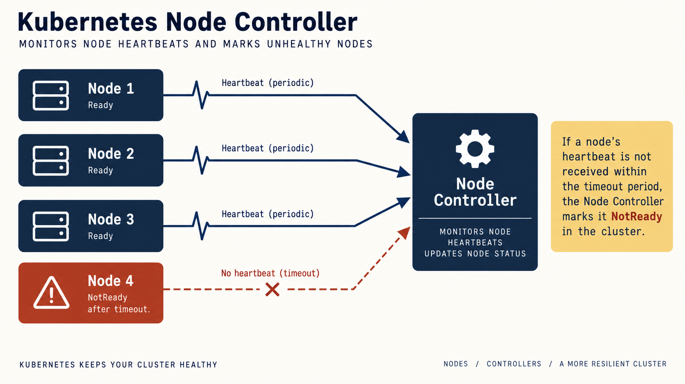

**Technical perspective:** The Node Controller handles cluster-wide partition survival:
- **`tolerationSeconds` Tuning:** Stateful workloads (databases) often reduce `tolerationSeconds` from 300s down to 30s to initiate faster failover upon node hardware crashes.
- **Zone Disruption / Eviction Rate Limiting:** To prevent mass eviction storms during large-scale network partitions, the Node Controller monitors the percentage of unhealthy nodes in each zone. If more than 55% of nodes are unhealthy, it throttles eviction rates down to `0.1` nodes/second.

### Component architecture flow

<iframe src="diagrams/topic-28.html" width="100%" height="560" style="border:none;"></iframe>

> [!TIP]
> View the interactive animated diagram in [diagrams/topic-28.html](diagrams/topic-28.html).

**Part 2 — Analogy / Zine:** The office worker who checks in on every building daily, and starts moving tenants out if a building goes quiet for too long.

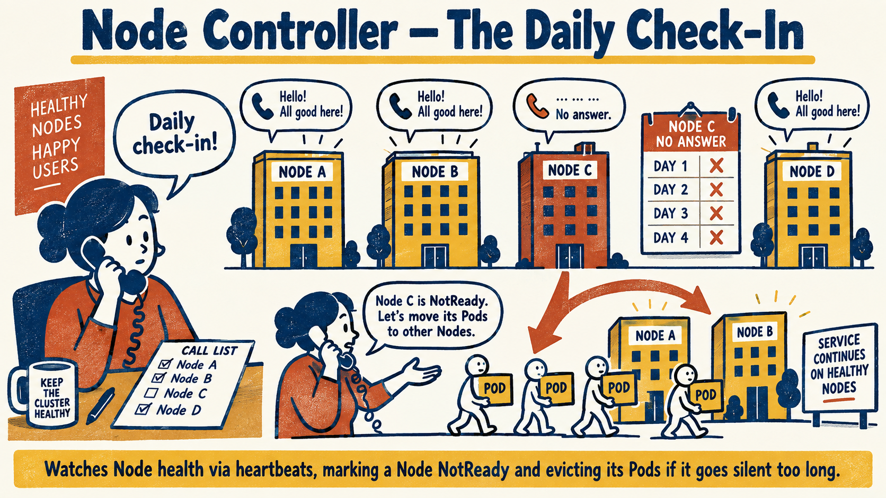

**Zine explanation:** The Daily Check-In image maps precisely to the Node Controller's heartbeat-monitoring behavior. Just as a building manager does daily rounds to check that every unit superintendent has checked in — and flags a building as "unresponsive" after missed check-ins, then starts relocating tenants — the Node Controller watches `Lease` objects in `kube-node-lease`. If a node fails to renew its Lease within `node-monitor-grace-period` (default 40s), the controller marks it `NotReady`. After `pod-eviction-timeout` (default 5 minutes), eviction begins: pods are marked for rescheduling and the scheduler places them on healthy nodes. This is why redundancy across nodes matters — a single node failure can trigger this cascade.

* **Zine Text & Layout:**
* (Top): "Node Controller — The Daily Check-In"
* (Caption): "Watches Node health via heartbeats, marking a Node NotReady and evicting its Pods if it goes silent too long."

**Further reading**

- [Node lifecycle](https://kubernetes.io/docs/concepts/architecture/nodes/#node-lifecycle)
- [Node controller](https://kubernetes.io/docs/concepts/architecture/nodes/)
- [CKA Study Notes: Cluster Maintenance (Node Drain & Eviction)](../CKA_Study_Notes/05-cluster-maintenance.md)

### Demo — Node (controller)

<div style="background:#000;color:#fff;border-radius:8px;padding:1rem;overflow:auto;box-shadow:0 2px 8px rgba(0,0,0,.25);"><pre style="background:transparent;color:#fff;margin:0;white-space:pre-wrap;">
SETUP
  (none: uses what is already in the cluster)

STEPS
  1. kubectl get nodes
  2. NODE=$(kubectl get nodes -o jsonpath='{.items[-1].metadata.name}')
  3. kubectl describe node $NODE | grep -A8 Conditions
  4. # simulate a dead node: on a WORKER node stop the kubelet
  5. docker exec zine-worker systemctl stop kubelet
  6. kubectl get nodes -w   # Ctrl+C once it shows NotReady

WHAT YOU SHOULD SEE
  The node moves from Ready to NotReady after about 40 seconds. After the eviction timeout (about 5 minutes) its Pods are rescheduled onto healthy nodes.

CLEANUP
  docker exec zine-worker systemctl start kubelet

NOTE
  Needs a multi-node cluster. Do NOT stop the kubelet on your only node or the control plane goes dark.
</pre></div>


### Knowledge Check — Quiz

**Q1: How does the Node lifecycle controller detect that a worker node has become unhealthy?**

- [ ] A) By attempting to ping the host over ICMP every millisecond.
- [ ] B) By monitoring the node's Lease object in kube-node-lease; if no heartbeat renewal occurs within node-monitor-grace-period, the node is flagged NotReady.
- [ ] C) By polling the cloud provider's billing dashboard.
- [ ] D) By checking whether the containers on the node are serving HTTP 200.

<details>
<summary>Reveal Answer &amp; Explanation</summary>

**Correct Answer:** B) By monitoring the node's Lease object in kube-node-lease; if no heartbeat renewal occurs within node-monitor-grace-period, the node is flagged NotReady.

**Explanation:** Kubelets post periodic lease updates (heartbeats) every 10s; if missed beyond the grace period (default 40s), the controller marks the node NotReady.

</details>

**Q2: When a node transitions to NotReady, what taint is automatically applied to begin the pod eviction process?**

- [ ] A) node.kubernetes.io/unreachable:NoExecute or node.kubernetes.io/not-ready:NoExecute
- [ ] B) node-role.kubernetes.io/control-plane:NoSchedule
- [ ] C) kubernetes.io/drain-active:PreferNoSchedule
- [ ] D) node.kubernetes.io/memory-pressure:AllowAll

<details>
<summary>Reveal Answer &amp; Explanation</summary>

**Correct Answer:** A) node.kubernetes.io/unreachable:NoExecute or node.kubernetes.io/not-ready:NoExecute

**Explanation:** NoExecute taints evict pods immediately unless those pods specify a matching toleration with a tolerationSeconds grace window.

</details>

**Q3: How long after a worker node stops reporting heartbeats does the Node Lifecycle Controller mark the node as `NotReady` or `Unknown` by default?**

- [ ] A) 5 seconds
- [ ] B) 40 seconds (`node-monitor-grace-period`)
- [ ] C) 10 minutes
- [ ] D) 1 hour

<details>
<summary>Reveal Answer &amp; Explanation</summary>

**Correct Answer:** B) 40 seconds (`node-monitor-grace-period`)

**Explanation:** The default `node-monitor-grace-period` in kube-controller-manager is 40 seconds. If no lease heartbeat is received within this window, the controller changes the node's Ready condition to Unknown or False.

</details>

**Q4: When a node transitions to `NotReady` or `Unreachable`, what taint is automatically applied by the Node Lifecycle Controller?**

- [ ] A) `node.kubernetes.io/not-ready:NoExecute` or `node.kubernetes.io/unreachable:NoExecute`
- [ ] B) `kubernetes.io/shutdown:Crash`
- [ ] C) `node.critical/evict:Immediate`
- [ ] D) `hardware.failure/reboot:True`

<details>
<summary>Reveal Answer &amp; Explanation</summary>

**Correct Answer:** A) `node.kubernetes.io/not-ready:NoExecute` or `node.kubernetes.io/unreachable:NoExecute`

**Explanation:** The controller injects `node.kubernetes.io/not-ready:NoExecute` or `node.kubernetes.io/unreachable:NoExecute`. Pods without matching tolerations begin eviction.

</details>

**Q5: By default, how long will a standard Pod tolerate a `node.kubernetes.io/not-ready:NoExecute` taint before the node controller evicts it?**

- [ ] A) 0 seconds (immediate eviction)
- [ ] B) 300 seconds (5 minutes, configured via default tolerationSeconds)
- [ ] C) 24 hours
- [ ] D) Indefinitely

<details>
<summary>Reveal Answer &amp; Explanation</summary>

**Correct Answer:** B) 300 seconds (5 minutes, configured via default tolerationSeconds)

**Explanation:** Kubernetes automatically appends default tolerations to all pods for `not-ready` and `unreachable` with `tolerationSeconds: 300` (5 minutes), preventing immediate mass eviction during transient network blips.

</details>

**Q6: Which Kubelet Node condition indicates that the host's Linux process table is running out of available PID numbers?**

- [ ] A) MemoryPressure
- [ ] B) PIDPressure
- [ ] C) DiskPressure
- [ ] D) NetworkUnavailable

<details>
<summary>Reveal Answer &amp; Explanation</summary>

**Correct Answer:** B) PIDPressure

**Explanation:** `PIDPressure` indicates that the number of allocated Linux process IDs on the host is nearing the system limit (`kernel.pid_max`), prompting Kubelet to reject new pods to prevent host kernel lockups.

</details>

## 29. Namespace (controller)

**Part 1 — Technical Discussion:** The **Namespace Controller** manages the lifecycle, state reconciliation, and cascading deletion of `Namespace` resources in a cluster.

### Scoping & Lifecycle Transitions
- **Logical Administrative Scope:** Namespaces partition object names, RBAC boundaries, ResourceQuotas, and LimitRanges within a single physical cluster. (Note: Namespaces do **not** provide network isolation by default; NetworkPolicies must be applied).
- **Phases:**
  - `Active`: Operating normally; accepting new resources.
  - `Terminating`: Deletion initiated. The controller rejects all new resource creation requests and walks through every namespaced resource to execute graceful cleanup.
- **Finalizer Pipeline:** Namespaces contain the `kubernetes` finalizer. The controller recursively deletes all Pods, Services, PVCs, ConfigMaps, and custom resources before releasing the namespace record from etcd.

```yaml
# labeled-namespace-spec.yaml
# WHY THIS YAML: A Namespace is the primary isolation boundary and RBAC scope.
# 'labels.pod-security.kubernetes.io/enforce: restricted': activates Pod Security Admission
#   for this namespace -- every Pod creation is validated against security standards.
# Labels on Namespaces are used by NetworkPolicies ('namespaceSelector')
#   to target specific namespaces for ingress/egress rules.
# ResourceQuotas and LimitRanges are also Namespace-scoped, applying only within this boundary.
apiVersion: v1
kind: Namespace
metadata:
  name: team-alpha
  labels:
    tier: production
    network-isolation: "true"
    pod-security.kubernetes.io/enforce: restricted
```

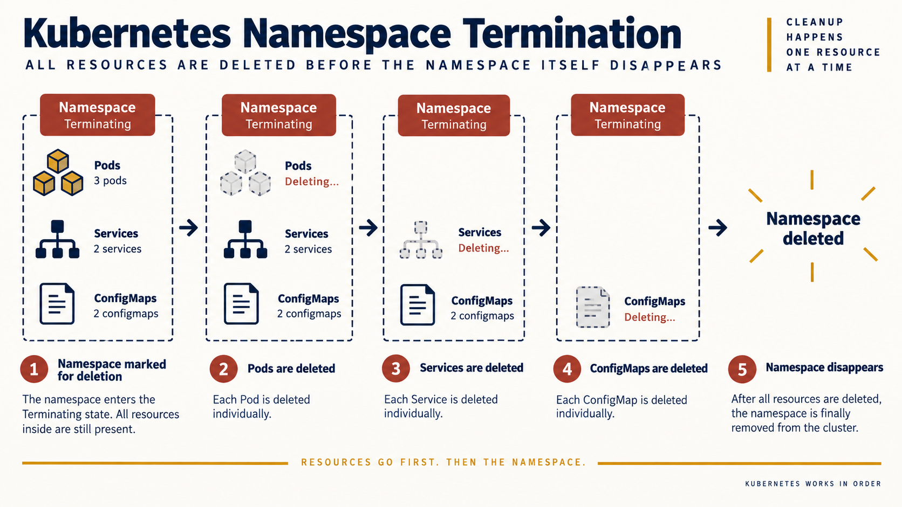

**Technical perspective:** Stuck namespace deletion is a notorious operational headache:
- **Terminating Namespace Diagnosis:** If a namespace is permanently stuck in `Terminating`, inspect remaining resources with finalizers:
  ```bash
  kubectl api-resources --verbs=list --namespaced -o name | xargs -n 1 kubectl get --show-kind --ignore-not-found -n <namespace>
  ```
- **Custom Resource Finalizer Deadlocks:** Often, an uninstalled Custom Resource Definition (CRD) leaves custom objects with dangling finalizers that block the namespace controller indefinitely.

### Component architecture flow

<iframe src="diagrams/topic-29.html" width="100%" height="560" style="border:none;"></iframe>

> [!TIP]
> View the interactive animated diagram in [diagrams/topic-29.html](diagrams/topic-29.html).

**Part 2 — Analogy / Zine:** When a fenced section of the property is being shut down, every tenant and piece of furniture inside is cleared out first before the fence itself comes down.

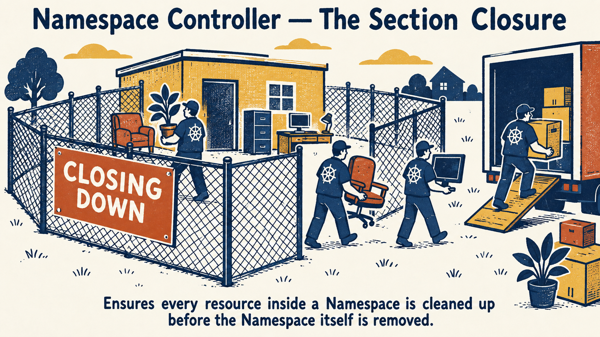

**Zine explanation:** The Section Closure image illustrates the Namespace Controller's cleanup responsibility during namespace deletion. Just as closing a wing of the complex requires vacating every apartment, canceling all service contracts, and only then removing the section from the building registry — a Kubernetes Namespace cannot be fully deleted until every resource inside it (Pods, Services, PVCs, ConfigMaps, Secrets) is removed. The Namespace Controller issues deletion requests for all contained resources and sets a `DeletingTimestamp`. If a resource has a finalizer that prevents immediate deletion (e.g., a PVC with protection finalizer), the Namespace gets stuck in `Terminating` until the finalizer is cleared. This is a common operational problem requiring manual finalizer removal.

* **Zine Text & Layout:**
* (Top): "Namespace Controller — The Section Closure"
* (Caption): "Ensures every resource inside a Namespace is cleaned up before the Namespace itself is removed."

**Further reading**

- [Namespaces](https://kubernetes.io/docs/concepts/overview/working-with-objects/namespaces/)
- [CKA Study Notes: Core Concepts (Namespaces)](../CKA_Study_Notes/01-core-concepts.md)

### Demo — Namespace (controller)

<div style="background:#000;color:#fff;border-radius:8px;padding:1rem;overflow:auto;box-shadow:0 2px 8px rgba(0,0,0,.25);"><pre style="background:transparent;color:#fff;margin:0;white-space:pre-wrap;">
SETUP
  kubectl create namespace zine-demo-ns

STEPS
  1. kubectl get namespace zine-demo-ns -o yaml | grep -E 'finalizers|phase|status'
  2. kubectl run test-pod --image=nginx -n zine-demo-ns
  3. kubectl get pods -n zine-demo-ns
  4. kubectl delete namespace zine-demo-ns &
  5. sleep 2
  6. kubectl get namespace zine-demo-ns
  7. kubectl get pods -n zine-demo-ns

WHAT YOU SHOULD SEE
  Step 1: the namespace has 'kubernetes' finalizer — this must be cleared before deletion.
  Step 4-6: while deleting, the namespace enters 'Terminating' state. The Namespace
    controller waits for all resources inside (Pods, Services, PVCs) to be deleted before
    the namespace object itself is removed from etcd.
  Step 7: pods are being terminated as part of the cascading namespace cleanup.
  If a resource has a stuck finalizer, the namespace stays 'Terminating' indefinitely.

CLEANUP
  wait   # wait for background delete to complete
  (namespace auto-cleaned)
</pre></div>


### Knowledge Check — Quiz

**Q1: Why does a namespace sometimes become stuck in the Terminating state indefinitely?**

- [ ] A) Because the cluster has run out of CPU capacity.
- [ ] B) Because one or more resources inside the namespace have finalizers that cannot be completed or cleared.
- [ ] C) Because the namespace name was longer than 10 characters.
- [ ] D) Because kube-proxy is running in iptables mode.

<details>
<summary>Reveal Answer &amp; Explanation</summary>

**Correct Answer:** B) Because one or more resources inside the namespace have finalizers that cannot be completed or cleared.

**Explanation:** A namespace cannot be deleted until all resources within it are gone; if a custom resource or PVC has an unfulfilled finalizer, deletion hangs in Terminating.

</details>

**Q2: Which objects are NOT deleted when a namespace is deleted?**

- [ ] A) Deployments and ReplicaSets in that namespace.
- [ ] B) Cluster-scoped objects like Nodes, PersistentVolumes, and ClusterRoles.
- [ ] C) Secrets and ConfigMaps in that namespace.
- [ ] D) Pods and Services in that namespace.

<details>
<summary>Reveal Answer &amp; Explanation</summary>

**Correct Answer:** B) Cluster-scoped objects like Nodes, PersistentVolumes, and ClusterRoles.

**Explanation:** Namespace deletion cascades to all namespaced objects within its boundary, but cluster-scoped resources exist independently outside any namespace.

</details>

**Q3: What action does the Namespace Controller take when a user executes `kubectl delete namespace <name>`?**

- [ ] A) It immediately deletes the namespace object, leaving running pods orphaned.
- [ ] B) It transitions the namespace status to `Terminating` and initiates asynchronous cascading deletion of all namespaced resources (Pods, Services, PVCs, ConfigMaps) inside that namespace.
- [ ] C) It sends an email notification to cluster administrators for approval.
- [ ] D) It reboots all worker nodes.

<details>
<summary>Reveal Answer &amp; Explanation</summary>

**Correct Answer:** B) It transitions the namespace status to `Terminating` and initiates asynchronous cascading deletion of all namespaced resources (Pods, Services, PVCs, ConfigMaps) inside that namespace.

**Explanation:** Deleting a namespace puts it into `Terminating`. The namespace controller discovers and deletes all resources residing in that namespace in order before finalizing namespace deletion.

</details>

**Q4: Why does a namespace occasionally become stuck in the `Terminating` status indefinitely?**

- [ ] A) Because the cluster has run out of CPU quota.
- [ ] B) One or more resources within the namespace have active `finalizers` that cannot be cleared (e.g., an unavailable custom metrics API or dangling PVC protection).
- [ ] C) Because DNS records cannot be deleted without an internet connection.
- [ ] D) Because worker nodes refuse to run garbage collection.

<details>
<summary>Reveal Answer &amp; Explanation</summary>

**Correct Answer:** B) One or more resources within the namespace have active `finalizers` that cannot be cleared (e.g., an unavailable custom metrics API or dangling PVC protection).

**Explanation:** A namespace cannot be completely deleted while objects inside it still have pending finalizers, or if an aggregated API service responsible for a resource type is unresponsive.

</details>

**Q5: Which of the following resources is strictly non-namespaced (cluster-scoped)?**

- [ ] A) ConfigMap
- [ ] B) PersistentVolume (PV)
- [ ] C) Service
- [ ] D) Secret

<details>
<summary>Reveal Answer &amp; Explanation</summary>

**Correct Answer:** B) PersistentVolume (PV)

**Explanation:** `PersistentVolume`, `Node`, `Namespace`, `StorageClass`, and `ClusterRole` are cluster-scoped (non-namespaced) resources. ConfigMap, Service, and Secret are namespaced.

</details>

**Q6: Which command displays all Kubernetes resource types along with their API group and whether they are namespaced or cluster-scoped?**

- [ ] A) kubectl api-resources
- [ ] B) kubectl get all --all-namespaces
- [ ] C) kubectl explain schema
- [ ] D) kubectl cluster-info dump

<details>
<summary>Reveal Answer &amp; Explanation</summary>

**Correct Answer:** A) kubectl api-resources

**Explanation:** `kubectl api-resources` lists all resource types registered with the API server, showing their short name, API group, whether they are namespaced (true/false), and Kind.

</details>

## 30. ResourceQuota

**Part 1 — Technical Discussion:** A **ResourceQuota** enforces aggregate resource consumption limits within a namespace, preventing individual teams or runaway workloads from monopolizing cluster compute and storage capacity.

### Quota Dimension Categories
- **Compute Resources:** Enforces total CPU and Memory reservations across all pods in the namespace (`requests.cpu`, `limits.cpu`, `requests.memory`, `limits.memory`).
- **Storage Subsystems:** Enforces total capacity requests (`requests.storage`) and PVC counts, optionally qualified by StorageClass (e.g., `fast-nvme.storageclass/requests.storage: 500Gi`).
- **Object Counts:** Restricts total API instances (`pods`, `services`, `services.loadbalancers`, `configmaps`, `secrets`).

### Admission Enforcement
- Enforced synchronously by the **`ResourceQuota` Admission Plugin** on `kube-apiserver`.
- **Mandatory Request Requirement:** If a namespace defines a compute quota for CPU or memory, **every single container** created in that namespace must explicitly declare that resource request/limit, or creation is rejected with HTTP 403 Forbidden (unless a `LimitRange` automatically injects defaults).

```yaml
# team-resource-quota.yaml
# WHY THIS YAML: ResourceQuota enforces aggregate resource governance at Namespace level.
# 'requests.cpu: "8"': SUM of all Pod resource requests in this namespace cannot exceed 8 CPU.
#   If a new Pod would push total over the limit, API server's admission controller rejects it.
# 'limits.cpu: "16"': prevents namespace from claiming unlimited burst capacity.
# 'count/pods: "50"': caps the number of Pod objects, not just CPU/memory.
# Once quota is enabled, EVERY Pod MUST declare 'resources.requests' or it is rejected.
#   The quota system cannot account for undeclared resource consumption.
apiVersion: v1
kind: ResourceQuota
metadata:
  name: compute-storage-quota
  namespace: development
spec:
  hard:
    requests.cpu: "4"
    requests.memory: 8Gi
    limits.cpu: "8"
    limits.memory: 16Gi
    pods: "10"
    services.loadbalancers: "1"
    requests.storage: 100Gi
---
apiVersion: v1
kind: LimitRange
metadata:
  name: default-compute-limits
  namespace: development
spec:
  limits:
  - default:
      cpu: 500m
      memory: 512Mi
    defaultRequest:
      cpu: 100m
      memory: 128Mi
    type: Container
```

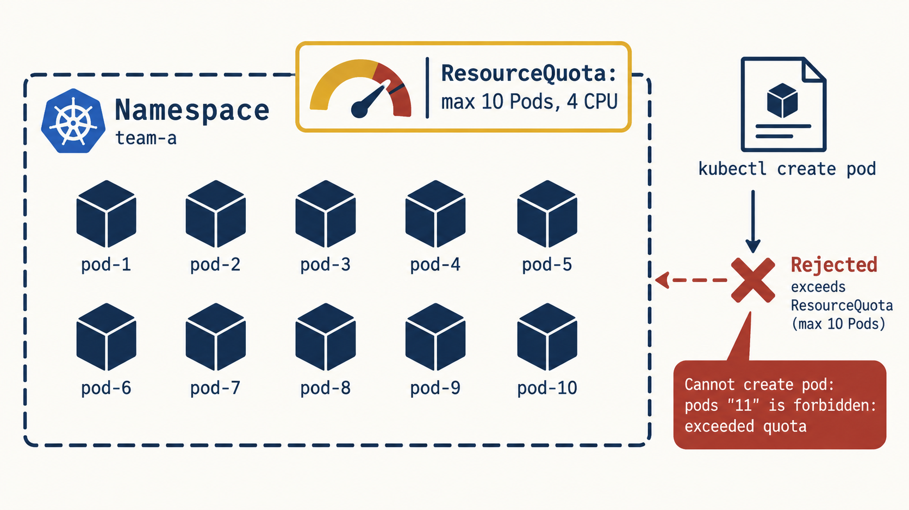

**Technical perspective:** ResourceQuotas are vital for multi-tenant cluster cost governance:
- **Quota Tracking Commands:** Administrators inspect current quota usage vs. hard limits using:
  ```bash
  kubectl get resourcequota -n <namespace>
  kubectl describe resourcequota <quota-name> -n <namespace>
  ```
- **Deployment Rollout Deadlocks:** During a rolling update, a Deployment temporarily runs old replicas plus new replicas (`maxSurge`). If the namespace quota has zero headroom remaining, new pods cannot be created, completely stalling the rollout.

### Component architecture flow

<iframe src="diagrams/topic-30.html" width="100%" height="560" style="border:none;"></iframe>

> [!TIP]
> View the interactive animated diagram in [diagrams/topic-30.html](diagrams/topic-30.html).

**Part 2 — Analogy / Zine:** A posted occupancy limit sign on a fenced section — once it's full, the front desk simply refuses to let anyone else move in.

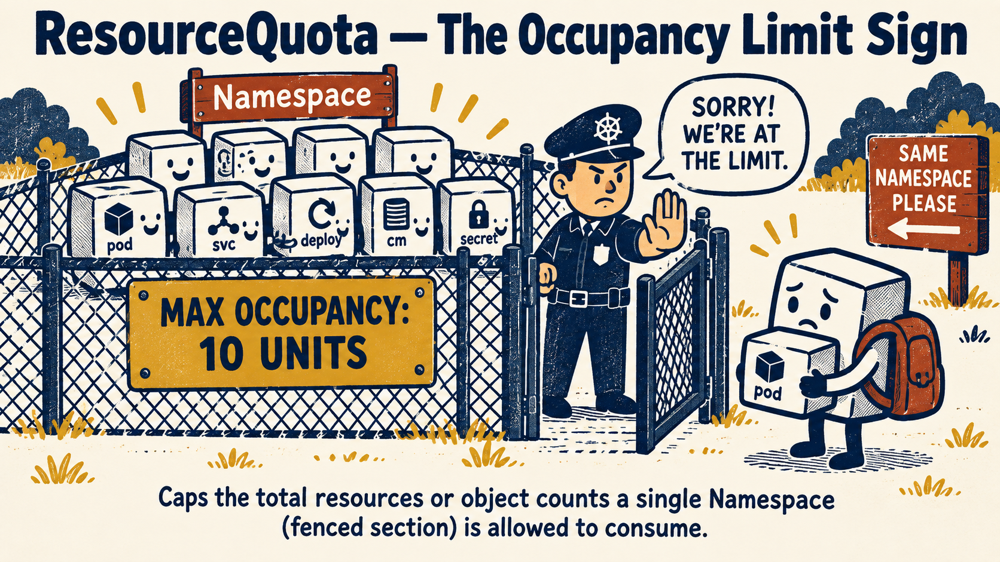

**Zine explanation:** The Occupancy Limit Sign image shows how ResourceQuota enforces aggregate consumption caps at the Namespace level, preventing any single team or workload from monopolizing cluster capacity. Just as a section of the complex posts a maximum occupancy sign — "This wing: 50 units, 200 residents" — a ResourceQuota object tracks and limits the sum of CPU requests, memory limits, object counts (Pods, Services, PVCs), and storage requests within a Namespace. When a new Pod would exceed the quota, the API server's LimitRanger admission controller rejects it with a 403 error. LimitRange objects work alongside ResourceQuota by enforcing per-Pod defaults and maximums, ensuring every Pod declares requests/limits (required for quota accounting).

* **Zine Text & Layout:**
* (Top): "ResourceQuota — The Occupancy Limit Sign"
* (Caption): "Caps the total resources or object counts a single Namespace (fenced section) is allowed to consume."

**Further reading**

- [Resource quotas](https://kubernetes.io/docs/concepts/policy/resource-quotas/)
- [CKA Study Notes: Scheduling (Resource Limits & Quotas)](../CKA_Study_Notes/02-scheduling.md)

### Demo — ResourceQuota

<div style="background:#000;color:#fff;border-radius:8px;padding:1rem;overflow:auto;box-shadow:0 2px 8px rgba(0,0,0,.25);"><pre style="background:transparent;color:#fff;margin:0;white-space:pre-wrap;">
SETUP
  kubectl create namespace demo-ns

YAML  (quota-demo.yaml)
  apiVersion: v1
  kind: ResourceQuota
  metadata:
    name: pod-limit
  spec:
    hard:
      pods: "2"

STEPS
  1. kubectl apply -f quota-demo.yaml -n demo-ns
  2. kubectl run p1 --image=nginx -n demo-ns
  3. kubectl run p2 --image=nginx -n demo-ns
  4. kubectl run p3 --image=nginx -n demo-ns   # rejected
  5. kubectl describe quota pod-limit -n demo-ns

WHAT YOU SHOULD SEE
  The third Pod is refused with: exceeded quota: pod-limit, requested: pods=1, used: pods=2, limited: pods=2.

CLEANUP
  kubectl delete namespace demo-ns

NOTE
  The namespace hit its posted occupancy limit. The namespace is set with -n, so the YAML has no namespace field.
</pre></div>


### Knowledge Check — Quiz

**Q1: If a namespace has a ResourceQuota specifying limits on requests.cpu, what requirement is placed on all pods created in that namespace?**

- [ ] A) Pods must run on bare metal servers.
- [ ] B) Every container in every submitted Pod must explicitly declare a CPU request, or a LimitRange must provide a default.
- [ ] C) Pods cannot use sidecar containers.
- [ ] D) Pods must be scheduled on the control-plane node.

<details>
<summary>Reveal Answer &amp; Explanation</summary>

**Correct Answer:** B) Every container in every submitted Pod must explicitly declare a CPU request, or a LimitRange must provide a default.

**Explanation:** If a quota restricts a resource type, the admission controller rejects any pod that fails to declare an explicit request/limit for that resource.

</details>

**Q2: At what point in the request lifecycle is a ResourceQuota enforced?**

- [ ] A) By the kubelet when launching the container.
- [ ] B) By the ResourceQuota admission plugin in the kube-apiserver during API admission control.
- [ ] C) By the scheduler during node scoring.
- [ ] D) By CoreDNS when resolving DNS queries.

<details>
<summary>Reveal Answer &amp; Explanation</summary>

**Correct Answer:** B) By the ResourceQuota admission plugin in the kube-apiserver during API admission control.

**Explanation:** Quotas are enforced synchronously by admission controllers before the object is accepted and committed to etcd; violations return HTTP 403 Forbidden.

</details>

**Q3: What is the primary difference in scope and enforcement between a `ResourceQuota` and a `LimitRange`?**

- [ ] A) ResourceQuota enforces aggregate resource consumption limits across an entire namespace; LimitRange sets default, minimum, and maximum resource constraints on individual containers/Pods.
- [ ] B) ResourceQuota is for storage; LimitRange is for CPU.
- [ ] C) ResourceQuota applies to worker nodes; LimitRange applies to control plane nodes.
- [ ] D) ResourceQuota applies to external users; LimitRange applies to internal pods.

<details>
<summary>Reveal Answer &amp; Explanation</summary>

**Correct Answer:** A) ResourceQuota enforces aggregate resource consumption limits across an entire namespace; LimitRange sets default, minimum, and maximum resource constraints on individual containers/Pods.

**Explanation:** A ResourceQuota bounds total cumulative usage in a namespace (e.g. max 20 CPUs, 50 Pods total). A LimitRange enforces per-pod or per-container boundaries (e.g. min 100m CPU, default 256Mi RAM) and injects default requests/limits.

</details>

**Q4: If a namespace has a `ResourceQuota` restricting total `requests.cpu`, what happens if a user submits a Pod that does NOT declare any CPU request or limit?**

- [ ] A) The Pod is assigned 100% of the host node's CPU.
- [ ] B) The API server rejects Pod creation with HTTP 403 Forbidden, unless a `LimitRange` in the namespace injects default CPU requests.
- [ ] C) The scheduler automatically assigns 1 milliCPU.
- [ ] D) The ResourceQuota is automatically disabled.

<details>
<summary>Reveal Answer &amp; Explanation</summary>

**Correct Answer:** B) The API server rejects Pod creation with HTTP 403 Forbidden, unless a `LimitRange` in the namespace injects default CPU requests.

**Explanation:** When a quota restricts compute resources, every submitted container must specify that resource. If a container lacks requests/limits and no LimitRange provides defaults, the admission controller rejects the creation request.

</details>

**Q5: What is the difference between `default` and `defaultRequest` in a container `LimitRange` specification?**

- [ ] A) `default` sets the container resource Limit; `defaultRequest` sets the container resource Request.
- [ ] B) `default` is for memory; `defaultRequest` is for CPU.
- [ ] C) `default` applies to Deployments; `defaultRequest` applies to Jobs.
- [ ] D) `default` is deprecated.

<details>
<summary>Reveal Answer &amp; Explanation</summary>

**Correct Answer:** A) `default` sets the container resource Limit; `defaultRequest` sets the container resource Request.

**Explanation:** In a LimitRange, `default` defines the fallback resource *limits* applied when a pod omits them, while `defaultRequest` defines the fallback resource *requests*.

</details>

**Q6: Which ResourceQuota scope restricts resource calculations only to Pods that have an active deadline specified (such as batch Jobs)?**

- [ ] A) BestEffort
- [ ] B) Terminating
- [ ] C) NotTerminating
- [ ] D) PriorityClass

<details>
<summary>Reveal Answer &amp; Explanation</summary>

**Correct Answer:** B) Terminating

**Explanation:** The `Terminating` scope matches Pods that have `spec.activeDeadlineSeconds >= 0` (like batch jobs), allowing separate quotas for short-lived batch workloads versus non-terminating long-running services.

</details>

## 31. Garbage Collector

**Part 1 — Technical Discussion:** The **Garbage Collector (GC)** is a core controller inside `kube-controller-manager` responsible for identifying and cleaning up orphaned API objects whose parent owner object has been deleted.

### Owner References & Ownership Hierarchies
- Objects declare ownership via the `metadata.ownerReferences` array in their API specification:
  - `apiVersion`: API group and version of parent.
  - `kind`: Kind of parent resource (e.g., `ReplicaSet`, `Job`).
  - `name`: Name of the parent.
  - `uid`: Universally unique identifier of the parent.
  - `blockOwnerDeletion: true`: Prevents parent deletion from completing until dependents are processed.

### Deletion Propagation Policies
- **`Foreground`:** The owner enters a deletion phase with finalizer `foregroundDeletion`. The owner remains visible until all dependent children with `blockOwnerDeletion: true` are completely deleted.
- **`Background` (Default):** The owner is deleted immediately. The Garbage Collector then asynchronously discovers and deletes the orphaned children in the background.
- **`Orphan`:** Strips the `ownerReferences` from dependent children and leaves them running independently without a parent controller.

```yaml
# pod-with-owner-reference.yaml
# WHY THIS YAML: The ownerReference field is the Garbage Collector's dependency graph.
# 'ownerReferences.apiVersion/kind/name/uid': links this Pod to a specific ReplicaSet.
#   The uid is unique per object instance -- not just per name -- preventing stale refs.
# 'controller: true': marks this as the controlling owner (only one allowed per object).
# 'blockOwnerDeletion: true': Pod must be deleted before the owning ReplicaSet finalizes.
# When a Deployment is deleted, GC traces: Deployment -> ReplicaSet -> Pods, deleting each.
# Without ownerReferences, orphaned Pods keep running indefinitely after parent deletion.
apiVersion: v1
kind: Pod
metadata:
  name: managed-worker-pod
  ownerReferences:
  - apiVersion: apps/v1
    kind: ReplicaSet
    name: frontend-rs-v1
    uid: d4b3c2a1-0000-1111-2222-333344445555
    controller: true
    blockOwnerDeletion: true
spec:
  containers:
  - name: worker
    image: registry.k8s.io/pause:3.9
```

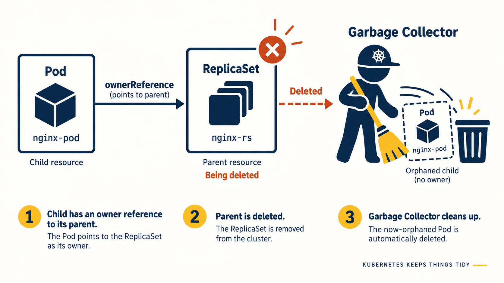

**Technical perspective:** Cascading deletion control is essential when replacing parent controllers:
- **CLI Propagation Options:** `kubectl delete deployment <name> --cascade=orphan` deletes the Deployment object while leaving the underlying Pods running without disruption.
- **Dangling Resources:** If an operator manually edits a Pod and deletes its `ownerReferences`, higher-level workload rollouts and autoscalers lose track of the Pod, causing silent replica drift and orphaned resource consumption.

### Component architecture flow

<iframe src="diagrams/topic-31.html" width="100%" height="560" style="border:none;"></iframe>

> [!TIP]
> View the interactive animated diagram in [diagrams/topic-31.html](diagrams/topic-31.html).

**Part 2 — Analogy / Zine:** The cleanup crew that removes any leftover furniture in a unit once the tenant who ordered it moves out — nothing is left behind unclaimed.

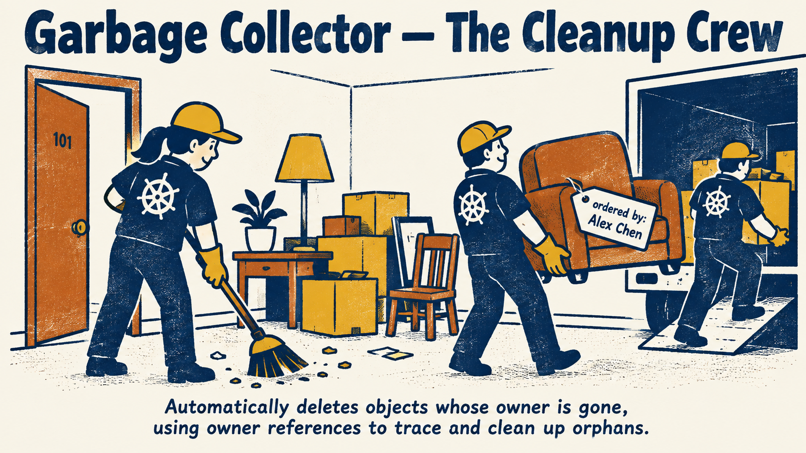

**Zine explanation:** The Cleanup Crew image maps the Garbage Collector controller's owner-reference traversal behavior. Just as a cleanup crew checks whether a storage unit's assigned tenant still has an active lease before clearing the unit — and automatically clears it if the tenant's file is gone — the Garbage Collector watches for objects whose `ownerReferences` point to a non-existent owner. When a Deployment is deleted, it removes its ReplicaSet (owner of Pods), triggering cascading deletion of all managed Pods. The propagation policy controls whether this cascade is `Foreground` (parent waits for children), `Background` (parent deletes immediately, children cleaned asynchronously), or `Orphan` (children kept, ownership reference cleared).

* **Zine Text & Layout:**
* (Top): "Garbage Collector — The Cleanup Crew"
* (Caption): "Automatically deletes objects whose owner is gone, using owner references to trace and clean up orphans."

**Further reading**

- [Owners and dependents](https://kubernetes.io/docs/concepts/architecture/garbage-collection/)
- [CKA Study Notes: Core Concepts (Garbage Collection)](../CKA_Study_Notes/01-core-concepts.md)

### Demo — Garbage Collector

<div style="background:#000;color:#fff;border-radius:8px;padding:1rem;overflow:auto;box-shadow:0 2px 8px rgba(0,0,0,.25);"><pre style="background:transparent;color:#fff;margin:0;white-space:pre-wrap;">
SETUP
  kubectl create namespace zine-demo

STEPS
  1. kubectl create deployment gc-demo --image=nginx --replicas=2 -n zine-demo
  2. kubectl rollout status deployment/gc-demo -n zine-demo
  3. kubectl get pods -l app=gc-demo -n zine-demo -o jsonpath='{.items[0].metadata.ownerReferences}'; echo
  4. kubectl get replicaset -l app=gc-demo -n zine-demo
  5. kubectl delete deployment gc-demo -n zine-demo
  6. kubectl get replicaset,pods -l app=gc-demo -n zine-demo   # empty, cascaded

WHAT YOU SHOULD SEE
  The Pod's ownerReferences point to a ReplicaSet. After deleting the Deployment, the ReplicaSet and Pods are gone too.

CLEANUP
  kubectl delete namespace zine-demo

NOTE
  Nobody deleted the Pods or ReplicaSet directly; deletion cascaded through owner references.
</pre></div>


### Knowledge Check — Quiz

**Q1: How does the Kubernetes Garbage Collector determine which dependent child objects to delete when a parent object is deleted?**

- [ ] A) By scanning container image names for matches.
- [ ] B) By inspecting the metadata.ownerReferences field on child objects pointing to the parent UID.
- [ ] C) By searching for pods with matching creation timestamps.
- [ ] D) By asking the container runtime for process tree IDs.

<details>
<summary>Reveal Answer &amp; Explanation</summary>

**Correct Answer:** B) By inspecting the metadata.ownerReferences field on child objects pointing to the parent UID.

**Explanation:** Child resources (e.g. ReplicaSets created by a Deployment) maintain an ownerReferences array listing the parent's uid, kind, and apiVersion.

</details>

**Q2: What is the difference between Background cascading deletion and Orphan deletion?**

- [ ] A) Background deletion deletes child objects after or alongside the parent; Orphan deletion leaves child objects running with their owner references cleared.
- [ ] B) Background deletion removes the cluster; Orphan deletion restores from backup.
- [ ] C) Orphan deletion is only used for temporary testing pods.
- [ ] D) Background deletion requires pausing the kubelet.

<details>
<summary>Reveal Answer &amp; Explanation</summary>

**Correct Answer:** A) Background deletion deletes child objects after or alongside the parent; Orphan deletion leaves child objects running with their owner references cleared.

**Explanation:** With propagationPolicy: Orphan, the parent is removed while child resources survive as unowned, standalone objects.

</details>

**Q3: What is the primary function of `metadata.ownerReferences` on Kubernetes API objects?**

- [ ] A) It specifies which human developer owns the git commit.
- [ ] B) It links child resources (such as Pods managed by a ReplicaSet) to their parent controller, allowing the Garbage Collector to automatically clean up dependents when the parent is deleted.
- [ ] C) It authorizes external TLS connections.
- [ ] D) It sets billing chargeback codes for cloud accounting.

<details>
<summary>Reveal Answer &amp; Explanation</summary>

**Correct Answer:** B) It links child resources (such as Pods managed by a ReplicaSet) to their parent controller, allowing the Garbage Collector to automatically clean up dependents when the parent is deleted.

**Explanation:** OwnerReferences establish parent-child relationships between API objects (e.g. Deployment -> ReplicaSet -> Pod). The Garbage Collector uses these links to prune orphaned dependent resources automatically.

</details>

**Q4: What is the difference between `propagationPolicy: Background` and `propagationPolicy: Foreground` during cascading resource deletion?**

- [ ] A) Background deletes the parent first and cleans up child objects asynchronously in the background; Foreground marks the parent in 'deletion in progress' until all child objects are deleted first.
- [ ] B) Background deletes resources at midnight; Foreground deletes immediately.
- [ ] C) Background is for worker nodes; Foreground is for control plane nodes.
- [ ] D) Background only deletes Services; Foreground only deletes Pods.

<details>
<summary>Reveal Answer &amp; Explanation</summary>

**Correct Answer:** A) Background deletes the parent first and cleans up child objects asynchronously in the background; Foreground marks the parent in 'deletion in progress' until all child objects are deleted first.

**Explanation:** With `Background`, Kubernetes deletes the owner object immediately, then the garbage collector deletes dependents later. With `Foreground`, the owner enters `Terminating` with a finalizer, waiting until all dependents are deleted before disappearing.

</details>

**Q5: What restriction applies to `ownerReferences` regarding namespace boundaries?**

- [ ] A) OwnerReferences can cross namespaces only if both namespaces share the same prefix.
- [ ] B) Cross-namespace owner references are disallowed by design; a namespaced child resource can only have an ownerReference to a parent within the same namespace.
- [ ] C) OwnerReferences can only point to objects in the `default` namespace.
- [ ] D) There are no namespace restrictions on OwnerReferences.

<details>
<summary>Reveal Answer &amp; Explanation</summary>

**Correct Answer:** B) Cross-namespace owner references are disallowed by design; a namespaced child resource can only have an ownerReference to a parent within the same namespace.

**Explanation:** By design, namespaced resources cannot specify owners in different namespaces. This prevents privilege escalation or accidental cross-tenant deletion across namespace boundaries.

</details>

**Q6: How do `finalizers` on an object interact with the Kubernetes Garbage Collector?**

- [ ] A) They immediately erase the object from etcd.
- [ ] B) They inform the API server that asynchronous cleanup actions (like external cloud load balancer teardown) must succeed before the object can be completely purged from etcd.
- [ ] C) They force all pods into CrashLoopBackOff.
- [ ] D) They encrypt the object with AES-256.

<details>
<summary>Reveal Answer &amp; Explanation</summary>

**Correct Answer:** B) They inform the API server that asynchronous cleanup actions (like external cloud load balancer teardown) must succeed before the object can be completely purged from etcd.

**Explanation:** Finalizers are string identifiers (e.g. `kubernetes.io/pv-protection`) in `metadata.finalizers`. When an object is deleted, it remains in `Terminating` with a `deletionTimestamp` until controllers finish cleanup and remove their finalizers.

</details>

## 32. ReplicaSet

**Part 1 — Technical Discussion:** A **ReplicaSet** maintains a stable, declared population of identical Pod replicas running at any given time. It acts as the direct supervisor of Pods, continuously reconciling actual replica count with `spec.replicas`.

### Set-Based Label Selectors vs. Legacy Selectors
- Unlike legacy ReplicationControllers which only supported simple equality matches (`env = prod`), ReplicaSets support rich **set-based selectors** using `matchExpressions`:
  - Operators: `In`, `NotIn`, `Exists`, `DoesNotExist`.
  - Enables targeting multiple deployment tiers, versions, or environments under complex filtering logic.
- **Pod Acquisition & Adoption:** The ReplicaSet controller does not only manage pods it created; it automatically *adopts* any unbound Pod in the namespace whose labels match its selector!

```yaml
# set-based-replicaset.yaml
# WHY THIS YAML: Shows the label selector matching that drives ReplicaSet reconciliation.
# 'replicas: 3': the controller watches this number and creates/deletes Pods to match it.
#   The moment a Pod terminates, the controller creates a replacement -- no human needed.
# 'selector.matchExpressions': set-based selectors -- the improvement over ReplicationController.
#   'In: [nginx, nginx-proxy]' matches Pods with either label value, not just exact equality.
# 'template.metadata.labels': MUST match the selector or the API server rejects the spec.
# Use Deployments, not raw ReplicaSets -- Deployments add versioning and rolling updates.
apiVersion: apps/v1
kind: ReplicaSet
metadata:
  name: api-replicaset
  labels:
    app: api-server
    tier: backend
spec:
  replicas: 3
  selector:
    matchLabels:
      app: api-server
    matchExpressions:
    - key: environment
      operator: In
      values: ["staging", "production"]
  template:
    metadata:
      labels:
        app: api-server
        environment: production
    spec:
      containers:
      - name: api
        image: registry.k8s.io/pause:3.9
```

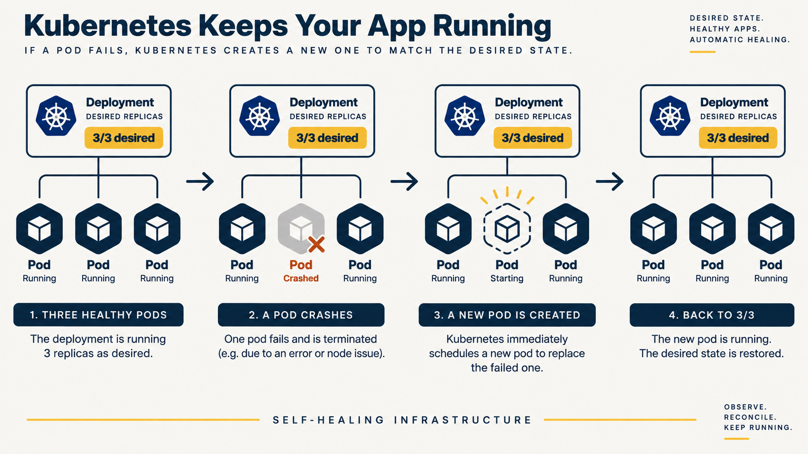

**Technical perspective:** ReplicaSets are rarely deployed directly in production; instead, they are managed via higher-level Deployments:
- **Label Selector Overlap Hazards:** If two different ReplicaSets define overlapping label selectors, they will enter a violent reconciliation loop, continuously creating and terminating each other's Pods in an infinite fight for target count.
- **CKA Deployment Rollback Internals:** Every Deployment revision creates a new underlying ReplicaSet. Rolling back a Deployment (`kubectl rollout undo`) simply scales the target historical ReplicaSet back up and the current ReplicaSet down to 0.

### Component architecture flow

<iframe src="diagrams/topic-32.html" width="100%" height="560" style="border:none;"></iframe>

> [!TIP]
> View the interactive animated diagram in [diagrams/topic-32.html](diagrams/topic-32.html).

**Part 2 — Analogy / Zine:** Protects one number: 'always keep exactly 3 identical units occupied,' replacing any that go vacant instantly.

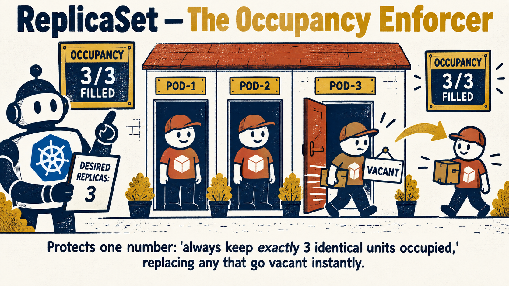

**Zine explanation:** The Occupancy Enforcer image shows the ReplicaSet's single, relentless job: maintain exactly the declared number of identical Pod replicas at all times. Just as a building occupancy enforcer continuously patrols the wing and immediately lists a vacant unit for re-occupancy the moment someone moves out — without waiting to be asked — the ReplicaSet controller watches its managed Pods' status and creates replacement Pods the moment one terminates, crashes, or fails a readiness probe. Label selectors are the ReplicaSet's matching criteria: it adopts any Pod whose labels match, which is why manually created Pods with matching labels can accidentally be adopted. Deployments are always preferred over raw ReplicaSets because they add versioning and rolling update orchestration.

* **Zine Text & Layout:**
* (Top): "ReplicaSet — The Occupancy Enforcer"
* (Caption): "Protects one number: 'always keep exactly 3 identical units occupied,' replacing any that go vacant instantly."

**Further reading**

- [ReplicaSets](https://kubernetes.io/docs/concepts/workloads/controllers/replicaset/)
- [CKA Study Notes: Core Concepts (ReplicaSets)](../CKA_Study_Notes/01-core-concepts.md)

### Demo — ReplicaSet

<div style="background:#000;color:#fff;border-radius:8px;padding:1rem;overflow:auto;box-shadow:0 2px 8px rgba(0,0,0,.25);"><pre style="background:transparent;color:#fff;margin:0;white-space:pre-wrap;">
SETUP
  kubectl create namespace zine-demo
  kubectl create deployment rs-demo --image=nginx --replicas=3 -n zine-demo
  kubectl rollout status deployment/rs-demo -n zine-demo

STEPS
  1. kubectl get replicaset -l app=rs-demo -n zine-demo
  2. kubectl delete pod $(kubectl get pods -l app=rs-demo -n zine-demo -o name | head -1) -n zine-demo
  3. kubectl get pods -l app=rs-demo -n zine-demo

WHAT YOU SHOULD SEE
  The ReplicaSet shows DESIRED 3, CURRENT 3, READY 3. After you delete one Pod, a new one appears and the count returns to 3.

CLEANUP
  kubectl delete namespace zine-demo

NOTE
  The ReplicaSet only cares about the number, not which Pods make it up.
</pre></div>


### Knowledge Check — Quiz

**Q1: Why do modern Kubernetes deployments use Deployments instead of managing ReplicaSets directly?**

- [ ] A) ReplicaSets cannot run on Linux.
- [ ] B) ReplicaSets do not provide declarative rolling updates, revision histories, or automated rollbacks; Deployments manage ReplicaSets to orchestrate those workflows.
- [ ] C) ReplicaSets only support a single replica.
- [ ] D) ReplicaSets bypass kube-proxy.

<details>
<summary>Reveal Answer &amp; Explanation</summary>

**Correct Answer:** B) ReplicaSets do not provide declarative rolling updates, revision histories, or automated rollbacks; Deployments manage ReplicaSets to orchestrate those workflows.

**Explanation:** A ReplicaSet only maintains an exact pod count; it has no mechanism to update container images with zero downtime. Deployments orchestrate transitions between old and new ReplicaSets.

</details>

**Q2: What type of label selector syntax does a ReplicaSet support that the older ReplicationController lacked?**

- [ ] A) SQL WHERE clauses.
- [ ] B) Set-based requirements (e.g. environment in (production, staging)).
- [ ] C) Regex evaluation on container logs.
- [ ] D) Plain text substring matching only.

<details>
<summary>Reveal Answer &amp; Explanation</summary>

**Correct Answer:** B) Set-based requirements (e.g. environment in (production, staging)).

**Explanation:** ReplicaSets support rich set-based selectors (in, notin, exists), whereas legacy ReplicationControllers only supported exact equality (key = value).

</details>

**Q3: What distinguishes a `ReplicaSet` from its predecessor, the legacy `ReplicationController`?**

- [ ] A) ReplicaSets can run on Windows, whereas ReplicationControllers only run on Linux.
- [ ] B) ReplicaSets support set-based label selectors (`matchExpressions` with `In`, `NotIn`, `Exists`), whereas ReplicationControllers only support simple equality-based selectors.
- [ ] C) ReplicaSets do not use etcd.
- [ ] D) ReplicaSets can only manage a single Pod replica.

<details>
<summary>Reveal Answer &amp; Explanation</summary>

**Correct Answer:** B) ReplicaSets support set-based label selectors (`matchExpressions` with `In`, `NotIn`, `Exists`), whereas ReplicationControllers only support simple equality-based selectors.

**Explanation:** The primary evolution from ReplicationController to ReplicaSet was the introduction of set-based selectors (`matchExpressions`), allowing complex queries across environments, tiers, and versions.

</details>

**Q4: Why is it generally considered an anti-pattern for developers to manage `ReplicaSet` objects directly?**

- [ ] A) ReplicaSets are deprecated and will be removed in the next release.
- [ ] B) Deployments manage ReplicaSets automatically, providing declarative rolling updates, rollbacks, and revision history that raw ReplicaSets lack.
- [ ] C) ReplicaSets cannot restart crashed containers.
- [ ] D) ReplicaSets consume twice as much network bandwidth.

<details>
<summary>Reveal Answer &amp; Explanation</summary>

**Correct Answer:** B) Deployments manage ReplicaSets automatically, providing declarative rolling updates, rollbacks, and revision history that raw ReplicaSets lack.

**Explanation:** Deployments sit on top of ReplicaSets. While ReplicaSets ensure replica counts, they do not support automated rolling updates or rollbacks. Deployments manage ReplicaSet lifecycles declaratively.

</details>

**Q5: What happens if an existing running Pod has labels matching a newly created `ReplicaSet`'s selector?**

- [ ] A) The ReplicaSet deletes the existing Pod immediately.
- [ ] B) The ReplicaSet adopts the existing Pod and counts it toward its desired replica count.
- [ ] C) The ReplicaSet fails to start with a duplicate label error.
- [ ] D) The API server renames the Pod.

<details>
<summary>Reveal Answer &amp; Explanation</summary>

**Correct Answer:** B) The ReplicaSet adopts the existing Pod and counts it toward its desired replica count.

**Explanation:** ReplicaSets operate on label matching, not creation lineage. A ReplicaSet will automatically adopt any unowned Pod matching its selector, counting it toward `spec.replicas`.

</details>

**Q6: What is the purpose of the `pod-template-hash` label injected into Pods by the Deployment controller?**

- [ ] A) It serves as a cryptographic checksum to detect container tampering.
- [ ] B) It ensures that different ReplicaSets created by a Deployment do not have overlapping label selectors, preventing multi-ReplicaSet selector collisions.
- [ ] C) It defines the root password for the pod.
- [ ] D) It hashes the pod's IP address for load balancing.

<details>
<summary>Reveal Answer &amp; Explanation</summary>

**Correct Answer:** B) It ensures that different ReplicaSets created by a Deployment do not have overlapping label selectors, preventing multi-ReplicaSet selector collisions.

**Explanation:** The Deployment controller hashes the `PodTemplateSpec` and injects `pod-template-hash` into the child ReplicaSet and Pod labels so the Deployment can distinguish between replicas of different revisions.

</details>

## 33. Deployment

**Part 1 — Technical Discussion:** A **Deployment** provides declarative management, automated rolling updates, and instant rollback capabilities for Pods and ReplicaSets. It represents the standard workload primitive for stateless web and API applications.

### Deployment Strategies & Update Mechanics
- **`RollingUpdate` (Default):**
  - Progressively replaces old Pods with new Pods with zero application downtime.
  - `maxSurge`: Maximum number of Pods that can be scheduled *above* the declared replica count (e.g., `25%`).
  - `maxUnavailable`: Maximum number of Pods that can be unavailable during the update (e.g., `0` for zero-downtime updates).
- **`Recreate`:** Terminates all running Pods simultaneously before launching new versions (causes downtime, but prevents dual-version database schema collisions).

### Rollout Lifecycle & Revision History
- Tracks historical changes via `revisionHistoryLimit` (default 10).
- Commands:
  - `kubectl rollout status deployment/<name>`
  - `kubectl rollout history deployment/<name>`
  - `kubectl rollout undo deployment/<name> --to-revision=2`
  - `kubectl rollout pause / resume deployment/<name>`

```yaml
# zero-downtime-deployment.yaml
# WHY THIS YAML: Governs the rolling update strategy enabling zero-downtime releases.
# 'strategy.type: RollingUpdate': scales up new ReplicaSet while scaling down old one.
# 'maxSurge: 1': allows 1 extra Pod above replicas count during rollout.
#   New ReplicaSet scales to 4 before old ReplicaSet starts shrinking.
# 'maxUnavailable: 0': zero Pods may be below desired count during rollout.
#   Guarantees full capacity throughout update -- at the cost of extra resources.
# 'readinessProbe': each new Pod must pass readiness before an old Pod is terminated.
apiVersion: apps/v1
kind: Deployment
metadata:
  name: frontend-app
spec:
  replicas: 4
  revisionHistoryLimit: 5
  strategy:
    type: RollingUpdate
    rollingUpdate:
      maxSurge: 25%
      maxUnavailable: 0
  selector:
    matchLabels:
      app: frontend
  template:
    metadata:
      labels:
        app: frontend
    spec:
      containers:
      - name: nginx
        image: registry.k8s.io/pause:3.9
        readinessProbe:
          httpGet:
            path: /
            port: 80
          initialDelaySeconds: 5
          periodSeconds: 5
```

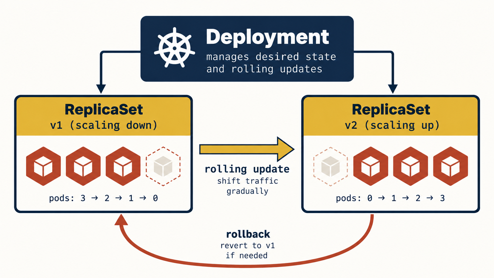

**Technical perspective:** Deployments require proper readiness probes to safely execute rolling updates:
- **The Broken Image Trap:** If a new container image is pushed with a fatal startup bug and no `readinessProbe` is configured, Kubernetes considers the container "Ready" as soon as the process starts, immediately terminating all healthy old replicas and causing a complete outage!
- **`maxUnavailable: 0` Requirement:** For critical services, pairing `maxUnavailable: 0` with thorough readiness probes guarantees that an unhealthy rollout stalls automatically without killing a single active serving pod.

### Component architecture flow

<iframe src="diagrams/topic-33.html" width="100%" height="560" style="border:none;"></iframe>

> [!TIP]
> View the interactive animated diagram in [diagrams/topic-33.html](diagrams/topic-33.html).

**Part 2 — Analogy / Zine:** Manages swapping an entire set of units from a v1 layout to a v2 layout gradually, with a lever to rollback if inspections fail.

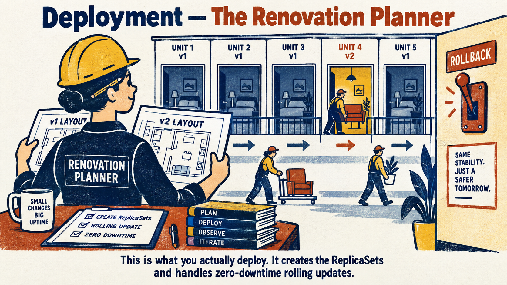

**Zine explanation:** The Renovation Planner image captures Deployment's role in orchestrating zero-downtime updates by managing transitions between ReplicaSet versions. Just as a renovation planner doesn't demolish all apartments at once but vacates and renovates one floor at a time while residents stay in temporary units — a Deployment rolling update creates a new ReplicaSet (new version), scales it up one Pod at a time, while scaling down the old ReplicaSet — respecting `maxSurge` and `maxUnavailable` to ensure a minimum number of ready replicas always serve traffic. The revision history (`revisionHistoryLimit`) allows rollback to any previous ReplicaSet via `kubectl rollout undo`. Readiness probes gate each step: a new Pod must pass its readiness check before the next old Pod is terminated.

* **Zine Text & Layout:**
* (Top): "Deployment — The Renovation Planner"
* (Caption): "This is what you actually deploy. It creates the ReplicaSets and handles zero-downtime rolling updates."

**Further reading**

- [Deployments](https://kubernetes.io/docs/concepts/workloads/controllers/deployment/)
- [CKA Study Notes: Application Lifecycle (Rolling Updates)](../CKA_Study_Notes/04-application-lifecycle-management.md)

### Demo — Deployment

<div style="background:#000;color:#fff;border-radius:8px;padding:1rem;overflow:auto;box-shadow:0 2px 8px rgba(0,0,0,.25);"><pre style="background:transparent;color:#fff;margin:0;white-space:pre-wrap;">
SETUP
  kubectl create namespace zine-demo
  kubectl create deployment deploy-demo --image=nginx:1.24 --replicas=3 -n zine-demo
  kubectl rollout status deployment/deploy-demo -n zine-demo

STEPS
  1. kubectl set image deployment/deploy-demo nginx=nginx:1.25 -n zine-demo
  2. kubectl rollout status deployment/deploy-demo -n zine-demo
  3. kubectl get replicaset -l app=deploy-demo -n zine-demo
  4. kubectl rollout history deployment/deploy-demo -n zine-demo
  5. kubectl rollout undo deployment/deploy-demo -n zine-demo
  6. kubectl get deployment deploy-demo -n zine-demo -o jsonpath='{.spec.template.spec.containers[0].image}'; echo

WHAT YOU SHOULD SEE
  Two ReplicaSets appear (old scaling down, new scaling up). After undo the image reads nginx:1.24 again.

CLEANUP
  kubectl delete namespace zine-demo

NOTE
  The container is named 'nginx' because create deployment names it after the image. Rolling update, then rollback with zero downtime.
</pre></div>


### Knowledge Check — Quiz

**Q1: How does a Deployment perform a RollingUpdate without causing service downtime?**

- [ ] A) It reboots all nodes simultaneously.
- [ ] B) It creates a new ReplicaSet and incrementally scales it up while scaling down the old ReplicaSet according to maxSurge and maxUnavailable parameters.
- [ ] C) It rewrites container binaries in-place inside running pods.
- [ ] D) It redirects traffic to an external maintenance page.

<details>
<summary>Reveal Answer &amp; Explanation</summary>

**Correct Answer:** B) It creates a new ReplicaSet and incrementally scales it up while scaling down the old ReplicaSet according to maxSurge and maxUnavailable parameters.

**Explanation:** The Deployment controller creates a new ReplicaSet for the new revision and shifts traffic replica-by-replica, ensuring healthy pods always satisfy availability thresholds.

</details>

**Q2: How do you roll back a failed Deployment to its previous revision?**

- [ ] A) By deleting the worker nodes.
- [ ] B) Using kubectl rollout undo deployment/<name>.
- [ ] C) By modifying the etcd Raft log manually.
- [ ] D) By restarting the kubelet daemon.

<details>
<summary>Reveal Answer &amp; Explanation</summary>

**Correct Answer:** B) Using kubectl rollout undo deployment/<name>.

**Explanation:** kubectl rollout undo instructs the Deployment controller to roll back the pod template spec to the previous recorded revision in its history.

</details>

**Q3: What is the default deployment strategy in Kubernetes, and what are its two primary tuning parameters?**

- [ ] A) Recreate (downtime); tuned by `activeDeadlineSeconds`.
- [ ] B) RollingUpdate; tuned by `maxSurge` (maximum pods created above desired count) and `maxUnavailable` (maximum pods unavailable during the update).
- [ ] C) Canary; tuned by `canaryPercentage`.
- [ ] D) BlueGreen; tuned by `color`.

<details>
<summary>Reveal Answer &amp; Explanation</summary>

**Correct Answer:** B) RollingUpdate; tuned by `maxSurge` (maximum pods created above desired count) and `maxUnavailable` (maximum pods unavailable during the update).

**Explanation:** The default strategy is `RollingUpdate`. It is governed by `maxSurge` (how many extra pods can be created above `spec.replicas`) and `maxUnavailable` (how many pods can be down during the rollout), both defaulting to 25%.

</details>

**Q4: Which command rolls back a Deployment to a specific historical revision number?**

- [ ] A) kubectl rollout undo deployment/<name> --to-revision=<N>
- [ ] B) kubectl deployment rollback <name> -v <N>
- [ ] C) kubectl revert deployment <name> --revision <N>
- [ ] D) kubectl apply --rollback <N>

<details>
<summary>Reveal Answer &amp; Explanation</summary>

**Correct Answer:** A) kubectl rollout undo deployment/<name> --to-revision=<N>

**Explanation:** `kubectl rollout undo deployment/<name> --to-revision=<N>` restores the pod template from the specified historical ReplicaSet revision recorded in the rollout history.

</details>

**Q5: What happens to an in-progress RollingUpdate if the new version's Pods fail their `readinessProbe` checks?**

- [ ] A) The Deployment controller immediately terminates all old healthy pods.
- [ ] B) The new Pods never transition to `Ready`, preventing the Deployment controller from progressing further or terminating additional old Pods, thereby containing the failure.
- [ ] C) The entire cluster enters emergency maintenance mode.
- [ ] D) The Kubelet deletes the Deployment manifest from etcd.

<details>
<summary>Reveal Answer &amp; Explanation</summary>

**Correct Answer:** B) The new Pods never transition to `Ready`, preventing the Deployment controller from progressing further or terminating additional old Pods, thereby containing the failure.

**Explanation:** Rolling updates wait for new pods to report Ready before terminating old pods. If readiness probes fail, the rollout stalls, preserving the existing healthy pods and preventing user downtime.

</details>

**Q6: How can an administrator pause an active Deployment rollout to inspect the state or execute canary testing before completing the update?**

- [ ] A) kubectl rollout pause deployment/<name>
- [ ] B) kubectl stop deployment/<name>
- [ ] C) kubectl drain deployment/<name>
- [ ] D) systemctl stop kube-deployment

<details>
<summary>Reveal Answer &amp; Explanation</summary>

**Correct Answer:** A) kubectl rollout pause deployment/<name>

**Explanation:** `kubectl rollout pause deployment/<name>` pauses the rollout, allowing operators to make multiple changes or verify canary behavior before resuming the rollout with `kubectl rollout resume`.

</details>

## 34. StatefulSet

**Part 1 — Technical Discussion:** A **StatefulSet** is the workload controller designed specifically for stateful applications (databases, clustered storage, distributed message queues like Kafka, ZooKeeper, MongoDB, PostgreSQL) that require unique identities and persistent state.

### Core Architectural Guarantees
1. **Stable Network Identity:** Each Pod receives a predictable, persistent ordinal index starting from 0 (`web-0`, `web-1`, `web-2`).
2. **Headless Service DNS Integration:** Pairs with a Headless Service (`clusterIP: None`) to publish stable direct DNS records:
   `<pod-name>.<service-name>.<namespace>.svc.cluster.local`.
3. **Dedicated Persistent Storage per Replica:** Uses `volumeClaimTemplates` to automatically provision a separate, dedicated PVC and PV for every individual ordinal index (e.g., `data-web-0`, `data-web-1`).
4. **Ordered Deployment & Termination:** Scales up sequentially from `0` to `N-1`. Scales down in reverse order from `N-1` to `0`. (Configurable to parallel via `podManagementPolicy: Parallel`).

```yaml
# clustered-statefulset.yaml
# WHY THIS YAML: StatefulSet's ordered identity guarantees are configured here.
# 'serviceName: "db-cluster"': creates a Headless Service for stable DNS per Pod.
#   'db-0.db-cluster.<ns>.svc.cluster.local' persists across Pod restarts.
#   This stable DNS identity is essential for distributed peers (Cassandra, Kafka).
# 'podManagementPolicy: OrderedReady': Pods created 0, 1, 2 in sequence; each must be
#   Ready before next starts. Scale-down reverses order (2, 1, 0).
# 'volumeClaimTemplates': each Pod gets its OWN PVC that persists even if StatefulSet is deleted.
apiVersion: v1
kind: Service
metadata:
  name: database-headless
spec:
  clusterIP: None
  selector:
    app: stateful-db
  ports:
  - port: 5432
    name: db
---
apiVersion: apps/v1
kind: StatefulSet
metadata:
  name: db-cluster
spec:
  serviceName: "database-headless"
  replicas: 3
  selector:
    matchLabels:
      app: stateful-db
  template:
    metadata:
      labels:
        app: stateful-db
    spec:
      containers:
      - name: postgres
        image: registry.k8s.io/pause:3.9
        volumeMounts:
        - name: data-store
          mountPath: /var/lib/data
  volumeClaimTemplates:
  - metadata:
      name: data-store
    spec:
      accessModes: [ "ReadWriteOnce" ]
      resources:
        requests:
          storage: 10Gi
```

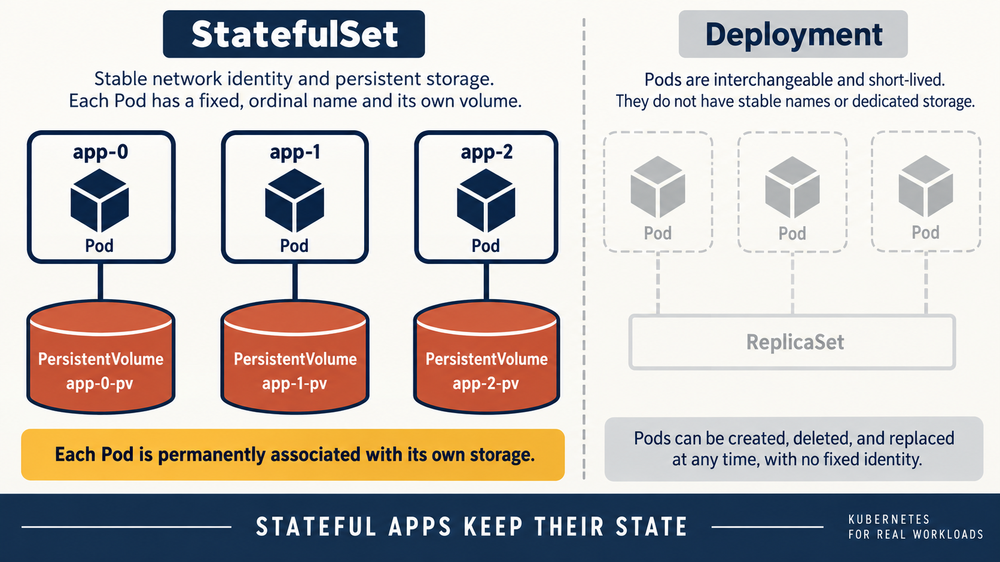

**Technical perspective:** StatefulSets protect against split-brain scenarios:
- **Volume Retention on Scale-Down:** When a StatefulSet is scaled down (e.g., from 3 to 2), the associated PVC (`data-db-cluster-2`) is **not deleted**. This prevents catastrophic accidental data loss.
- **At-Most-One-Pod Guarantee:** In network partitions, Kubernetes will never create a replacement stateful pod until the previous pod is confirmed terminated. Deleting a partitioned stateful pod with `--force --grace-period=0` can cause dual writes and data corruption if the old node is still alive!

### Component architecture flow

<iframe src="diagrams/topic-34.html" width="100%" height="560" style="border:none;"></iframe>

> [!TIP]
> View the interactive animated diagram in [diagrams/topic-34.html](diagrams/topic-34.html).

**Part 2 — Analogy / Zine:** Named, numbered units where the same tenant always returns to the exact same unit with their exact same furniture — never shuffled to a different room.

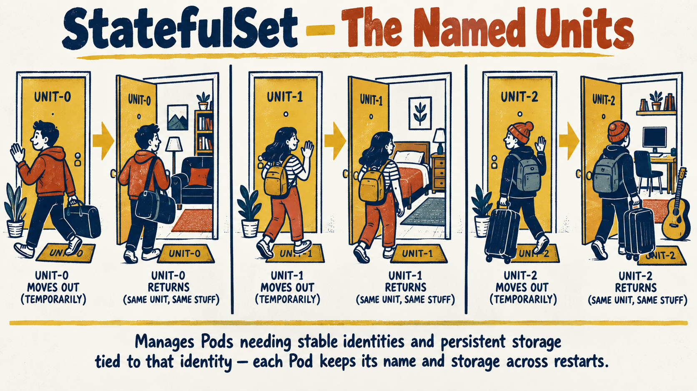

**Zine explanation:** The Named Units image represents StatefulSet's guarantee of stable, persistent identity per Pod — the opposite of Deployments, where Pods are fungible and interchangeable. Just as specific named apartment units (Unit 4A, 4B, 4C) have stable addresses, dedicated mailboxes, and stored belongings tied to that unit number — even if the same tenant moves back in — StatefulSet Pods retain the same DNS hostname (`pod-0.service`, `pod-1.service`) and the same PersistentVolumeClaim across restarts. Pods are created and deleted in strict ordinal order (0, 1, 2... for scale-up; 2, 1, 0 for scale-down), which is critical for distributed systems like Cassandra, Kafka, and etcd that require ordered peer discovery and quorum membership.

* **Zine Text & Layout:**
* (Top): "StatefulSet — The Named Units"
* (Caption): "Manages Pods needing stable identities and persistent storage tied to that identity — each Pod keeps its name and storage across restarts."

**Further reading**

- [StatefulSets](https://kubernetes.io/docs/concepts/workloads/controllers/statefulset/)
- [CKA Study Notes: Storage & StatefulSets](../CKA_Study_Notes/08-storage.md)

### Demo — StatefulSet

<div style="background:#000;color:#fff;border-radius:8px;padding:1rem;overflow:auto;box-shadow:0 2px 8px rgba(0,0,0,.25);"><pre style="background:transparent;color:#fff;margin:0;white-space:pre-wrap;">
SETUP
  kubectl create namespace zine-demo

YAML  (statefulset-demo.yaml)
  apiVersion: v1
  kind: Service
  metadata:
    name: web
  spec:
    clusterIP: None
    selector:
      app: web
    ports:
    - port: 80
  ---
  apiVersion: apps/v1
  kind: StatefulSet
  metadata:
    name: web
  spec:
    serviceName: "web"
    replicas: 3
    selector:
      matchLabels:
        app: web
    template:
      metadata:
        labels:
          app: web
      spec:
        containers:
        - name: nginx
          image: nginx

STEPS
  1. kubectl apply -f statefulset-demo.yaml -n zine-demo
  2. kubectl rollout status statefulset/web -n zine-demo
  3. kubectl get pods -l app=web -n zine-demo   # web-0, web-1, web-2
  4. kubectl delete pod web-1 -n zine-demo
  5. kubectl get pods -l app=web -n zine-demo -w   # Ctrl+C when web-1 is Running again

WHAT YOU SHOULD SEE
  Pods are named web-0, web-1, web-2 and start in order. The replacement comes back as web-1, not a random name.

CLEANUP
  kubectl delete namespace zine-demo

NOTE
  A StatefulSet needs a headless Service (clusterIP: None), so the YAML includes one. The tenant returns to the same numbered unit.
</pre></div>


### Knowledge Check — Quiz

**Q1: Why does a StatefulSet require a Headless Service (clusterIP: None)?**

- [ ] A) To encrypt pod network traffic with TLS.
- [ ] B) To provide predictable direct DNS A/SRV records for individual pods (e.g. pod-0.headless-svc.namespace.svc.cluster.local) rather than load-balancing across them.
- [ ] C) Because stateful applications cannot use IP addresses.
- [ ] D) To bypass the Linux kernel iptables rules.

<details>
<summary>Reveal Answer &amp; Explanation</summary>

**Correct Answer:** B) To provide predictable direct DNS A/SRV records for individual pods (e.g. pod-0.headless-svc.namespace.svc.cluster.local) rather than load-balancing across them.

**Explanation:** Clustered stateful applications (databases, ZooKeeper, Kafka) need to address specific ordinal members directly for clustering and replication.

</details>

**Q2: When a StatefulSet replica pod is deleted or crashes, what happens to its PersistentVolumeClaim?**

- [ ] A) The PVC is automatically deleted and recreated fresh.
- [ ] B) The PVC and storage are retained and automatically reattached to the replacement pod with the same ordinal index.
- [ ] C) The PVC is wiped and reformatted.
- [ ] D) The storage volume is converted into an emptyDir volume.

<details>
<summary>Reveal Answer &amp; Explanation</summary>

**Correct Answer:** B) The PVC and storage are retained and automatically reattached to the replacement pod with the same ordinal index.

**Explanation:** StatefulSet storage is persistent and sticky; data-web-0 is never deleted automatically when web-0 terminates, preserving data upon pod recreation.

</details>

**Q3: What three core guarantees distinguish a `StatefulSet` from a `Deployment`?**

- [ ] A) Faster container startup, zero CPU usage, and automated SSL certs.
- [ ] B) Stable, unique network identifiers (predictable ordinal DNS names); stable, persistent storage bound to each pod; and ordered, graceful deployment and scaling.
- [ ] C) Ability to run without Docker, automated backups to S3, and root host access.
- [ ] D) Guaranteed execution only on control plane nodes.

<details>
<summary>Reveal Answer &amp; Explanation</summary>

**Correct Answer:** B) Stable, unique network identifiers (predictable ordinal DNS names); stable, persistent storage bound to each pod; and ordered, graceful deployment and scaling.

**Explanation:** StatefulSets provide stable ordinal indices (`pod-0`, `pod-1`), deterministic network identities via Headless Services (`pod-0.svc.ns.svc.cluster.local`), and persistent storage that stays bound to the same ordinal across restarts.

</details>

**Q4: Why is a Headless Service (`spec.clusterIP: None`) strictly required for a StatefulSet?**

- [ ] A) StatefulSets cannot route HTTP traffic.
- [ ] B) It enables direct DNS resolution for each individual Pod ordinal (e.g. `statefulset-0.service-name`), allowing clustered stateful databases (Cassandra, ZooKeeper, Kafka) to locate specific peers directly.
- [ ] C) Headless Services bypass Linux kernel routing tables.
- [ ] D) It encrypts database network traffic.

<details>
<summary>Reveal Answer &amp; Explanation</summary>

**Correct Answer:** B) It enables direct DNS resolution for each individual Pod ordinal (e.g. `statefulset-0.service-name`), allowing clustered stateful databases (Cassandra, ZooKeeper, Kafka) to locate specific peers directly.

**Explanation:** Clustered stateful applications need peer-to-peer discovery rather than generic load balancing. A Headless Service creates direct SRV/A records for every pod ordinal (`<pod-name>.<service-name>.<ns>.svc.cluster.local`).

</details>

**Q5: What happens to the PersistentVolumeClaims created by a StatefulSet's `volumeClaimTemplates` when the StatefulSet is scaled down or deleted?**

- [ ] A) The PVCs and underlying storage disks are immediately deleted.
- [ ] B) The PVCs are deliberately NOT deleted, preserving critical application data and allowing pods to reattach to the exact same storage when scaled back up.
- [ ] C) The PVCs are merged into a single archive file.
- [ ] D) The PVCs are transferred to the default namespace.

<details>
<summary>Reveal Answer &amp; Explanation</summary>

**Correct Answer:** B) The PVCs are deliberately NOT deleted, preserving critical application data and allowing pods to reattach to the exact same storage when scaled back up.

**Explanation:** To safeguard stateful data against accidental data loss during scale-down operations, StatefulSets do not delete PVCs created from `volumeClaimTemplates`. Deleting them requires manual administrative action.

</details>

**Q6: What is the purpose of `spec.updateStrategy.rollingUpdate.partition` in a StatefulSet?**

- [ ] A) It partitions the hard drive into separate partitions.
- [ ] B) It enables canary deployments by updating only Pods with an ordinal greater than or equal to the partition number, leaving lower-numbered ordinals on the old version.
- [ ] C) It restricts pod execution to specific CPU cores.
- [ ] D) It splits network traffic across different VPC subnets.

<details>
<summary>Reveal Answer &amp; Explanation</summary>

**Correct Answer:** B) It enables canary deployments by updating only Pods with an ordinal greater than or equal to the partition number, leaving lower-numbered ordinals on the old version.

**Explanation:** Setting a partition number (e.g. `partition: 3` on a 5-replica set) updates only pods 3 and 4, allowing staged canary verification before rolling out the update to pods 0, 1, and 2.

</details>

## 35. DaemonSet

**Part 1 — Technical Discussion:** A **DaemonSet** ensures that all (or a selected subset of) Nodes run exactly one copy of a Pod. As new nodes join the cluster, the DaemonSet controller automatically adds the Pod; as nodes are decommissioned, the Pods are garbage collected.

### Standard Production Use Cases
- **Cluster Storage Daemons:** Ceph, GlusterFS, Rook.
- **Log Collection Daemons:** Fluentd, Fluent Bit, Promtail, Vector.
- **Node Monitoring & Security:** Prometheus `node-exporter`, Datadog Agent, Falco eBPF security sensors.

### Scheduling & Node Taint Toleration
- Modern DaemonSets are scheduled by the standard `kube-scheduler` using default node affinity.
- DaemonSets typically include universal tolerations allowing them to run on control plane nodes or tainted storage nodes (`node-role.kubernetes.io/control-plane:NoSchedule`).

### Host Integration
- Often configured with `hostNetwork: true`, `hostPID: true`, and host filesystem bind-mounts (`/var/log`, `/proc`, `/sys`) to monitor low-level Linux kernel metrics.

```yaml
# node-exporter-daemonset.yaml
# WHY THIS YAML: DaemonSet guarantees one Pod per node -- node-exporter needs this.
# 'tolerations: node-role.kubernetes.io/control-plane: NoSchedule': without this,
#   DaemonSet skips control plane nodes. This toleration ensures ALL nodes are covered.
# 'hostPID: true' and 'hostNetwork: true': required to read host-level metrics
#   from /proc and /sys -- these are node-level capabilities normal apps avoid.
# 'resources.requests': DaemonSet Pods consume resources on EVERY node.
#   500m CPU on 100 nodes = 50 CPUs cluster-wide. Size very carefully.
# 'updateStrategy.type: RollingUpdate': updates node by node, preserving metric coverage.
apiVersion: apps/v1
kind: DaemonSet
metadata:
  name: node-exporter
  namespace: monitoring
spec:
  selector:
    matchLabels:
      app: node-exporter
  template:
    metadata:
      labels:
        app: node-exporter
    spec:
      hostNetwork: true
      hostPID: true
      tolerations:
      - operator: "Exists"
      containers:
      - name: exporter
        image: registry.k8s.io/pause:3.9
        volumeMounts:
        - name: proc
          mountPath: /host/proc
          readOnly: true
      volumes:
      - name: proc
        hostPath:
          path: /proc
```

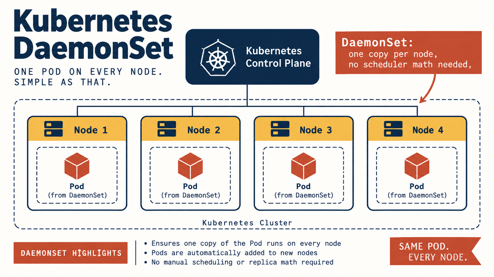

**Technical perspective:** DaemonSets require strict resource sizing:
- **Node Sizing Footprint:** Because DaemonSets run on every node, their resource requests multiply linearly across the entire cluster. 10 DaemonSets requesting 200m CPU each will consume 2 full CPU cores on every single node before any application workload is scheduled.
- **Rolling Update Strategy:** Configured via `updateStrategy.type: RollingUpdate` (with optional `maxUnavailable`) or `OnDelete` (updates only when the old pod is manually killed).

### Component architecture flow

<iframe src="diagrams/topic-35.html" width="100%" height="560" style="border:none;"></iframe>

> [!TIP]
> View the interactive animated diagram in [diagrams/topic-35.html](diagrams/topic-35.html).

**Part 2 — Analogy / Zine:** A dedicated fire extinguisher mounted in every single building — one per building, automatically, no exceptions.

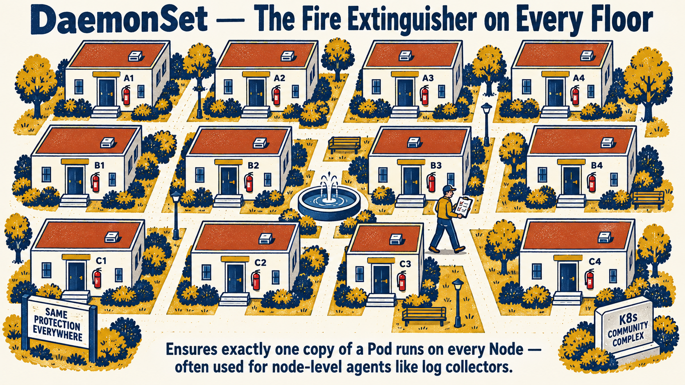

**Zine explanation:** The Fire Extinguisher on Every Floor image captures DaemonSet's defining guarantee: exactly one Pod replica runs on every node in the cluster (or matching nodes). Just as fire safety regulations require an extinguisher on every floor — not "some floors" or "one extinguisher shared by all" — DaemonSets ensure node-level agents (log collectors like Fluent Bit, metrics exporters like Node Exporter, CNI plugins, kube-proxy itself) run on every node. When a new node joins the cluster, the DaemonSet controller automatically schedules the daemon Pod on it. DaemonSet Pods use tolerations to run on control plane nodes (which carry `NoSchedule` taints), allowing monitoring agents to cover every node including the control plane.

* **Zine Text & Layout:**
* (Top): "DaemonSet — The Fire Extinguisher on Every Floor"
* (Caption): "Ensures exactly one copy of a Pod runs on every Node — often used for node-level agents like log collectors."

**Further reading**

- [DaemonSets](https://kubernetes.io/docs/concepts/workloads/controllers/daemonset/)
- [CKA Study Notes: Scheduling (DaemonSets)](../CKA_Study_Notes/02-scheduling.md)

### Demo — DaemonSet

<div style="background:#000;color:#fff;border-radius:8px;padding:1rem;overflow:auto;box-shadow:0 2px 8px rgba(0,0,0,.25);"><pre style="background:transparent;color:#fff;margin:0;white-space:pre-wrap;">
SETUP
  kubectl create namespace zine-demo

YAML  (daemonset-demo.yaml)
  apiVersion: apps/v1
  kind: DaemonSet
  metadata:
    name: node-agent
  spec:
    selector:
      matchLabels:
        app: node-agent
    template:
      metadata:
        labels:
          app: node-agent
      spec:
        containers:
        - name: agent
          image: busybox
          command: ["sh", "-c", "while true; do sleep 3600; done"]

STEPS
  1. kubectl apply -f daemonset-demo.yaml -n zine-demo
  2. kubectl rollout status daemonset/node-agent -n zine-demo
  3. kubectl get pods -l app=node-agent -n zine-demo -o wide
  4. kubectl get nodes --no-headers | wc -l   # total nodes; compare with the Pod count

WHAT YOU SHOULD SEE
  One Pod runs on each worker node. On a cluster whose control-plane node is tainted (the default), the count is the number of worker nodes, one less than the total node count.

CLEANUP
  kubectl delete namespace zine-demo

NOTE
  Add a toleration for node-role.kubernetes.io/control-plane:NoSchedule to the Pod template if you want the control-plane node included; the Pod count then equals the node count.
</pre></div>


### Knowledge Check — Quiz

**Q1: What is the primary use case for a DaemonSet compared to a standard Deployment?**

- [ ] A) Running short batch jobs that exit with code 0.
- [ ] B) Running cluster infrastructure agents (such as log shippers, monitoring agents, or CNI plugins) that must run exactly once on every eligible node.
- [ ] C) Running stateless web frontends behind an Ingress controller.
- [ ] D) Managing relational database failover.

<details>
<summary>Reveal Answer &amp; Explanation</summary>

**Correct Answer:** B) Running cluster infrastructure agents (such as log shippers, monitoring agents, or CNI plugins) that must run exactly once on every eligible node.

**Explanation:** A DaemonSet ensures that all (or some matching) nodes run a copy of a pod, automatically scaling as nodes are added or removed from the cluster.

</details>

**Q2: If a new worker node is added to a Kubernetes cluster, how does a DaemonSet respond?**

- [ ] A) It waits for manual administrator approval before acting.
- [ ] B) The DaemonSet controller detects the new node and automatically schedules an agent pod onto it.
- [ ] C) It evicts pods from older nodes to free up licenses.
- [ ] D) It restarts all pods in the cluster.

<details>
<summary>Reveal Answer &amp; Explanation</summary>

**Correct Answer:** B) The DaemonSet controller detects the new node and automatically schedules an agent pod onto it.

**Explanation:** The DaemonSet controller continuously watches for node additions and ensures immediate agent coverage without manual intervention.

</details>

**Q3: What is the primary operational role of a `DaemonSet` in a Kubernetes cluster?**

- [ ] A) To run short-lived computational batch scripts that exit upon completion.
- [ ] B) To ensure that all (or eligible) worker nodes execute exactly one copy of a specific Pod (e.g. CNI networking agents, log collectors, node monitoring daemons).
- [ ] C) To provide external Layer-7 HTTP routing.
- [ ] D) To manage the etcd Raft consensus loop.

<details>
<summary>Reveal Answer &amp; Explanation</summary>

**Correct Answer:** B) To ensure that all (or eligible) worker nodes execute exactly one copy of a specific Pod (e.g. CNI networking agents, log collectors, node monitoring daemons).

**Explanation:** A DaemonSet guarantees that every eligible node in the cluster runs a single replica of a pod. As new nodes join the cluster, the DaemonSet controller automatically adds the pod to them.

</details>

**Q4: When an administrator executes `kubectl drain <node>`, why must the `--ignore-daemonsets` flag typically be specified?**

- [ ] A) Because DaemonSets cannot run on worker nodes.
- [ ] B) Because DaemonSets are bound to every node; if evicted, the DaemonSet controller would immediately recreate them on that same node, causing the drain command to fail or hang.
- [ ] C) Because DaemonSets ignore SIGTERM signals.
- [ ] D) Because DaemonSets are managed by systemd.

<details>
<summary>Reveal Answer &amp; Explanation</summary>

**Correct Answer:** B) Because DaemonSets are bound to every node; if evicted, the DaemonSet controller would immediately recreate them on that same node, causing the drain command to fail or hang.

**Explanation:** Without `--ignore-daemonsets`, `kubectl drain` refuses to proceed because evicting a daemonset pod is futile: the daemonset controller would immediately schedule a new copy on the same node.

</details>

**Q5: How can an operator configure a DaemonSet to run only on nodes equipped with physical GPU hardware?**

- [ ] A) By setting `spec.gpu: true` on the DaemonSet.
- [ ] B) By configuring `nodeSelector` or `spec.template.spec.affinity.nodeAffinity` on the DaemonSet pod template to match GPU node labels (e.g. `accelerator: nvidia-tesla`).
- [ ] C) By installing the CUDA driver into the kube-apiserver.
- [ ] D) DaemonSets cannot be targeted to specific nodes.

<details>
<summary>Reveal Answer &amp; Explanation</summary>

**Correct Answer:** B) By configuring `nodeSelector` or `spec.template.spec.affinity.nodeAffinity` on the DaemonSet pod template to match GPU node labels (e.g. `accelerator: nvidia-tesla`).

**Explanation:** DaemonSets evaluate node selectors and node affinity. Specifying node matching rules restricts the DaemonSet controller to creating pods only on nodes possessing the matching labels.

</details>

**Q6: What update strategies are supported by the DaemonSet controller in `spec.updateStrategy.type`?**

- [ ] A) `RollingUpdate` (default, updates nodes gradually according to `maxUnavailable`) and `OnDelete` (updates a node's pod only when the old pod is manually killed).
- [ ] B) `Recreate` and `Immediate`.
- [ ] C) `BlueGreen` and `Canary`.
- [ ] D) `Parallel` and `Serial`.

<details>
<summary>Reveal Answer &amp; Explanation</summary>

**Correct Answer:** A) `RollingUpdate` (default, updates nodes gradually according to `maxUnavailable`) and `OnDelete` (updates a node's pod only when the old pod is manually killed).

**Explanation:** DaemonSets support `RollingUpdate` (automatically terminates and replaces old daemon pods node by node) and `OnDelete` (does not touch running pods until an administrator or automation explicitly deletes them).

</details>

## 36. Job

**Part 1 — Technical Discussion:** A **Job** creates one or more Pods and tracks them to successful termination (exit code 0). Unlike Deployments and ReplicaSets which continuously restart finished containers to keep them running, a Job ensures that batch tasks execute to completion.

### Concurrency & Completion Controls
- **`completions`:** Total number of Pods that must successfully finish with exit status 0 for the Job to be marked complete.
- **`parallelism`:** Maximum number of Pods executing concurrently at any single point in time.
- **`backoffLimit`:** Maximum retry attempts before marking the Job permanently as `Failed` (default 6). Retries use exponential backoff (10s, 20s, 40s...).
- **`activeDeadlineSeconds`:** Hard ceiling timeout duration for the Job; terminates all running pods once exceeded.

### Linux Process Termination & Restart Policy
- Container specs inside Jobs only support `restartPolicy: OnFailure` (restarts container inside existing pod sandbox) or `Never` (kubelet fails pod and Job controller spawns a fresh pod).

```yaml
# batch-processing-job.yaml
# WHY THIS YAML: Job's completion tracking and retry semantics are configured here.
# 'completions: 4': Job must run 4 successful Pod completions to be considered Done.
#   Useful for parallelizing data processing across 4 independent dataset chunks.
# 'parallelism: 2': at most 2 Pods run simultaneously -- controls resource usage.
# 'backoffLimit: 3': after 3 failed Pod attempts, Job is marked Failed, no more Pods.
# 'restartPolicy: Never': failed containers get a NEW Pod, not an in-place restart.
# 'ttlSecondsAfterFinished: 600': auto-deletes Job and Pods 10 minutes after completion.
apiVersion: batch/v1
kind: Job
metadata:
  name: database-schema-migration
spec:
  completions: 3
  parallelism: 2
  backoffLimit: 4
  activeDeadlineSeconds: 300
  template:
    spec:
      restartPolicy: OnFailure
      containers:
      - name: migrator
        image: busybox:1.36
        command: ["sh", "-c", "echo 'Executing database migration step'; sleep 5; exit 0"]
```

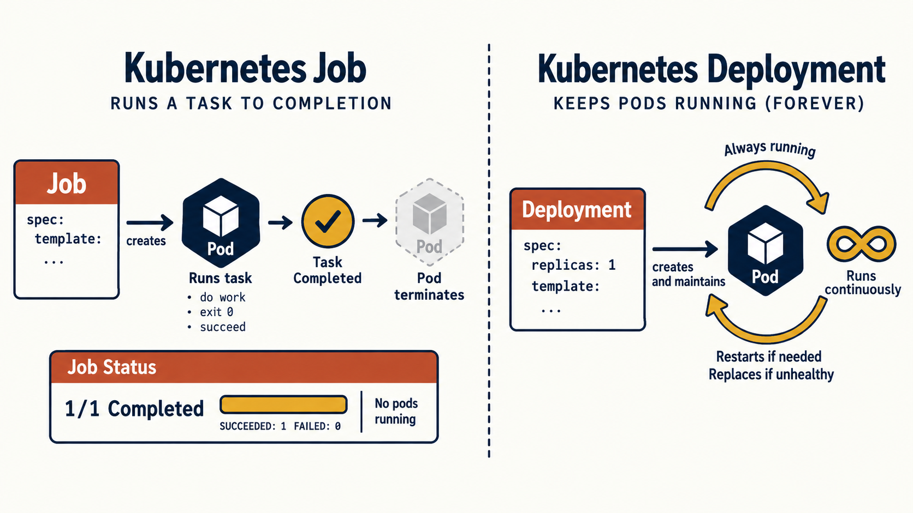

**Technical perspective:** Batch processing requires lifecycle cleanup planning:
- **Completed Pod Garbage Collection:** Completed Job pods remain in the cluster in phase `Completed` so operators can inspect logs (`kubectl logs`). Use `ttlSecondsAfterFinished: 300` to automatically delete completed Job records and prevent etcd object accumulation.
- **Pod Cleanup on Failure:** If a Job fails and uses `restartPolicy: Never`, multiple failed Pod objects will clutter the namespace until the Job is deleted.

### Component architecture flow

<iframe src="diagrams/topic-36.html" width="100%" height="560" style="border:none;"></iframe>

> [!TIP]
> View the interactive animated diagram in [diagrams/topic-36.html](diagrams/topic-36.html).

**Part 2 — Analogy / Zine:** A one-time moving crew hired to move a single tenant's boxes — once the job is done, the crew packs up and leaves for good, not staying on payroll.

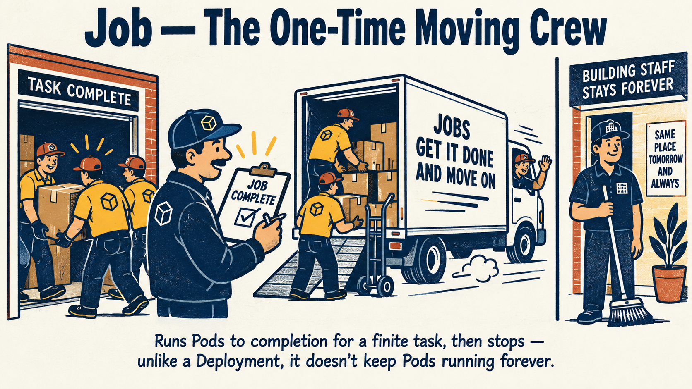

**Zine explanation:** The One-Time Moving Crew image maps to Job's finite-work execution model: unlike a Deployment that keeps Pods running indefinitely, a Job runs Pods until a defined number complete successfully, then stops. Just as a moving crew is hired for a specific job — pack and transport by Friday, then their engagement ends — a Kubernetes Job creates one or more Pods to complete a batch task (database migration, report generation, data transformation) and tracks completion via exit code 0. `completions` sets how many successful Pod runs are required; `parallelism` controls concurrent Pods. `backoffLimit` defines how many retries before the Job is declared Failed. `ttlSecondsAfterFinished` automatically cleans up completed Jobs after a set period.

* **Zine Text & Layout:**
* (Top): "Job — The One-Time Moving Crew"
* (Caption): "Runs Pods to completion for a finite task, then stops — unlike a Deployment, it doesn't keep Pods running forever."

**Further reading**

- [Jobs](https://kubernetes.io/docs/concepts/workloads/controllers/job/)
- [CKA Study Notes: Application Lifecycle (Jobs)](../CKA_Study_Notes/04-application-lifecycle-management.md)

### Demo — Job

<div style="background:#000;color:#fff;border-radius:8px;padding:1rem;overflow:auto;box-shadow:0 2px 8px rgba(0,0,0,.25);"><pre style="background:transparent;color:#fff;margin:0;white-space:pre-wrap;">
SETUP
  kubectl create namespace zine-demo

YAML  (job-demo.yaml)
  apiVersion: batch/v1
  kind: Job
  metadata:
    name: one-time-task
  spec:
    template:
      spec:
        containers:
        - name: task
          image: busybox
          command: ["sh", "-c", "echo doing the move; sleep 5; echo done"]
        restartPolicy: Never

STEPS
  1. kubectl apply -f job-demo.yaml -n zine-demo
  2. kubectl get jobs -n zine-demo -w   # Ctrl+C when COMPLETIONS is 1/1
  3. kubectl logs job/one-time-task -n zine-demo

WHAT YOU SHOULD SEE
  COMPLETIONS goes from 0/1 to 1/1. The logs print 'doing the move' then 'done'. The Pod ends as Completed.

CLEANUP
  kubectl delete namespace zine-demo

NOTE
  Once it hits 1/1 the Job stops; the crew finished the move.
</pre></div>


### Knowledge Check — Quiz

**Q1: What differentiates a Job's container lifecycle from a Deployment's container lifecycle?**

- [ ] A) Jobs only run on Linux; Deployments run on Windows.
- [ ] B) A Job runs containers until a designated number of completions succeed (exit 0), whereas a Deployment continuously restarts containers to keep them running indefinitely.
- [ ] C) Job containers cannot access persistent volumes.
- [ ] D) Jobs bypass the Kubernetes API server.

<details>
<summary>Reveal Answer &amp; Explanation</summary>

**Correct Answer:** B) A Job runs containers until a designated number of completions succeed (exit 0), whereas a Deployment continuously restarts containers to keep them running indefinitely.

**Explanation:** Jobs supervise batch workloads designed to terminate upon completion; Deployments supervise persistent services designed to never terminate.

</details>

**Q2: What happens to a Job's pods after the workload has successfully completed?**

- [ ] A) They are immediately deleted along with their logs.
- [ ] B) The pods are kept in Completed status so operators can inspect logs and exit statuses until the Job is cleaned up.
- [ ] C) The pods automatically transition to running web servers.
- [ ] D) The worker node is shut down.

<details>
<summary>Reveal Answer &amp; Explanation</summary>

**Correct Answer:** B) The pods are kept in Completed status so operators can inspect logs and exit statuses until the Job is cleaned up.

**Explanation:** Retaining completed pods allows operators to run kubectl logs and view output; automated cleanup can be managed via ttlSecondsAfterFinished.

</details>

**Q3: Which `restartPolicy` values are valid for a Kubernetes `Job` object?**

- [ ] A) Only `Always`
- [ ] B) `Never` or `OnFailure` (setting `Always` is strictly rejected by the API server)
- [ ] C) `Conditional` or `Fallback`
- [ ] D) `OnError` only

<details>
<summary>Reveal Answer &amp; Explanation</summary>

**Correct Answer:** B) `Never` or `OnFailure` (setting `Always` is strictly rejected by the API server)

**Explanation:** Jobs run batch processes to completion. A `restartPolicy: Always` makes no sense for a finite job and is rejected by the API server schema; only `Never` (create a new pod on failure) or `OnFailure` (restart container inside same pod) are allowed.

</details>

**Q4: In a Kubernetes Job specification, what is the operational difference between `completions` and `parallelism`?**

- [ ] A) `completions` defines how many successful pod terminations are required for the Job to finish; `parallelism` defines the maximum number of pods that can run concurrently.
- [ ] B) `completions` is for CPU; `parallelism` is for RAM.
- [ ] C) `completions` sets timeout seconds; `parallelism` sets retry count.
- [ ] D) `completions` applies only to CronJobs.

<details>
<summary>Reveal Answer &amp; Explanation</summary>

**Correct Answer:** A) `completions` defines how many successful pod terminations are required for the Job to finish; `parallelism` defines the maximum number of pods that can run concurrently.

**Explanation:** `spec.completions` specifies the target total count of successful pod runs needed, while `spec.parallelism` dictates how many worker pods are allowed to execute at the same time.

</details>

**Q5: What does the `backoffLimit` field (default 6) in a Job manifest configure?**

- [ ] A) The maximum network bandwidth allocated to the job.
- [ ] B) The maximum number of retries before the Job controller marks the entire Job as permanently Failed.
- [ ] C) The delay in milliseconds between log entries.
- [ ] D) The number of backup nodes.

<details>
<summary>Reveal Answer &amp; Explanation</summary>

**Correct Answer:** B) The maximum number of retries before the Job controller marks the entire Job as permanently Failed.

**Explanation:** `backoffLimit` dictates how many times failed pod runs will be retried with exponential backoff delay (10s, 20s, 40s...) before the Job controller gives up and sets the Job condition to Failed.

</details>

**Q6: How can completed batch Jobs and their associated Pods be automatically cleaned up after finishing without manual scripting?**

- [ ] A) By setting `spec.ttlSecondsAfterFinished` on the Job manifest.
- [ ] B) By configuring a ResourceQuota with `ttl: 0`.
- [ ] C) By setting `imagePullPolicy: Never`.
- [ ] D) Kubernetes automatically deletes all Jobs after 60 seconds.

<details>
<summary>Reveal Answer &amp; Explanation</summary>

**Correct Answer:** A) By setting `spec.ttlSecondsAfterFinished` on the Job manifest.

**Explanation:** The TTL-after-finished controller automatically purges completed or failed Jobs and their associated pods after the duration configured in `spec.ttlSecondsAfterFinished` expires.

</details>

## 37. CronJob

**Part 1 — Technical Discussion:** A **CronJob** runs Jobs on a recurring, time-based schedule using standard UNIX cron format (`minute hour day-of-month month day-of-week`).

### Concurrency Policies & Job Spawning
- **`concurrencyPolicy`:**
  - `Allow` (Default): Permits multiple Job instances to execute concurrently.
  - `Forbid`: Skips the new Job run if the previous Job instance is still actively running.
  - `Replace`: Cancels and terminates the currently running Job and spawns the new scheduled Job.
- **`startingDeadlineSeconds`:** Window of time in seconds that a Job can start if it missed its scheduled time (e.g., due to cluster downtime). If missed past the deadline, the run is skipped.
- **History Limits:** `successfulJobsHistoryLimit` (default 3) and `failedJobsHistoryLimit` (default 1) prune finished Job API records automatically.

```yaml
# nightly-backup-cronjob.yaml
# WHY THIS YAML: CronJob's schedule and concurrency controls are configured here.
# 'schedule: "0 2 * * *"': runs at 2:00 AM UTC daily. The CronJob controller
#   compares this against cluster time and creates a Job object at each trigger.
# 'concurrencyPolicy: Forbid': if 2am Job is still running at 3am, 3am trigger is SKIPPED.
#   Prevents overlapping backup jobs from corrupting the same backup target.
# 'startingDeadlineSeconds: 300': if cluster was down at 2am, only schedules within
#   5 minutes of the missed trigger -- older missed runs are discarded.
# 'successfulJobsHistoryLimit: 3': limits retained completed Job objects for history inspection.
apiVersion: batch/v1
kind: CronJob
metadata:
  name: nightly-etcd-snapshot
  namespace: maintenance
spec:
  schedule: "0 2 * * *"
  concurrencyPolicy: Forbid
  startingDeadlineSeconds: 120
  successfulJobsHistoryLimit: 3
  failedJobsHistoryLimit: 1
  jobTemplate:
    spec:
      template:
        spec:
          restartPolicy: OnFailure
          containers:
          - name: backup
            image: busybox:1.36
            command: ["sh", "-c", "echo 'Running backup at:'; date; sleep 10"]
```

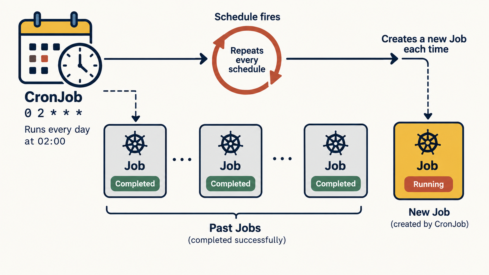

**Technical perspective:** CronJob time scheduling depends on control plane timezone configuration:
- **Timezone Awareness:** In Kubernetes 1.27+, CronJobs support explicit timezone specifications (`spec.timeZone: "America/New_York"`). By default, all CronJobs evaluate against the UTC system clock of `kube-controller-manager`.
- **`concurrencyPolicy: Forbid` Sizing:** Long-running cron tasks with short schedules (e.g., every 5 minutes) must use `concurrencyPolicy: Forbid` to prevent runaway compute resource exhaustion if an execution experiences transient delays.

### Component architecture flow

<iframe src="diagrams/topic-37.html" width="100%" height="560" style="border:none;"></iframe>

> [!TIP]
> View the interactive animated diagram in [diagrams/topic-37.html](diagrams/topic-37.html).

**Part 2 — Analogy / Zine:** The scheduled overnight cleaning crew that shows up automatically every night at 2 AM, does the job, and leaves — nobody has to call them each time.

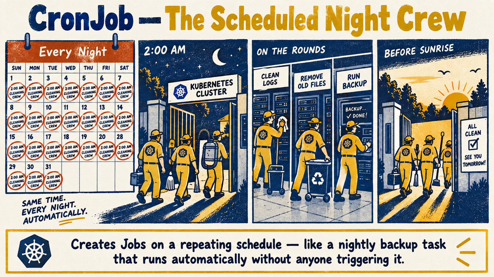

**Zine explanation:** The Scheduled Night Crew image maps CronJob to the building's recurring maintenance schedule. Just as a janitorial crew arrives every night at 2am without anyone having to call them — because the schedule is set in the building's annual contract — a CronJob creates a new Job on a cron expression schedule (e.g., `0 2 * * *` for 2am daily). Each trigger creates a fresh Job object, which spawns its Pod(s). `concurrencyPolicy: Forbid` prevents a new Job from starting if the previous one is still running, while `startingDeadlineSeconds` marks a Job as missed if it doesn't start within that window. CronJobs are stateless triggers — they do not track or aggregate results across runs.

* **Zine Text & Layout:**
* (Top): "CronJob — The Scheduled Night Crew"
* (Caption): "Creates Jobs on a repeating schedule — like a nightly backup task that runs automatically without anyone triggering it."

**Further reading**

- [CronJobs](https://kubernetes.io/docs/concepts/workloads/controllers/cron-jobs/)
- [CKA Study Notes: Application Lifecycle (CronJobs)](../CKA_Study_Notes/04-application-lifecycle-management.md)

### Demo — CronJob

<div style="background:#000;color:#fff;border-radius:8px;padding:1rem;overflow:auto;box-shadow:0 2px 8px rgba(0,0,0,.25);"><pre style="background:transparent;color:#fff;margin:0;white-space:pre-wrap;">
SETUP
  kubectl create namespace zine-demo

YAML  (cronjob-demo.yaml)
  apiVersion: batch/v1
  kind: CronJob
  metadata:
    name: nightly-task
  spec:
    schedule: "*/2 * * * *"
    jobTemplate:
      spec:
        template:
          spec:
            containers:
            - name: task
              image: busybox
              command: ["sh", "-c", "echo nightly cleanup ran"]
            restartPolicy: Never

STEPS
  1. kubectl apply -f cronjob-demo.yaml -n zine-demo
  2. kubectl get cronjob nightly-task -n zine-demo
  3. kubectl get jobs -n zine-demo -w   # wait up to 2 minutes; Ctrl+C after a Job appears
  4. kubectl logs job/$(kubectl get jobs -n zine-demo -o name | head -1 | cut -d/ -f2) -n zine-demo

WHAT YOU SHOULD SEE
  A new Job appears every 2 minutes with no command from you. Its logs print 'nightly cleanup ran'.

CLEANUP
  kubectl delete namespace zine-demo

NOTE
  The schedule is every 2 minutes for the demo; a real nightly job would use 0 2 * * *.
</pre></div>


### Knowledge Check — Quiz

**Q1: What does the concurrencyPolicy: Forbid setting on a CronJob do if a previous job execution is still running when the next scheduled interval arrives?**

- [ ] A) It kills the currently running job immediately.
- [ ] B) It skips the new execution until the currently running job has completed.
- [ ] C) It crashes the CronJob controller.
- [ ] D) It scales the worker node capacity.

<details>
<summary>Reveal Answer &amp; Explanation</summary>

**Correct Answer:** B) It skips the new execution until the currently running job has completed.

**Explanation:** Forbid prevents concurrent executions of the same job, avoiding duplicate batch processing or database lock contention.

</details>

**Q2: What Kubernetes object does the CronJob controller create when a scheduled trigger fires?**

- [ ] A) A bare container process via SSH.
- [ ] B) A standard Job object, which in turn creates the execution pod.
- [ ] C) A StatefulSet.
- [ ] D) An Ingress rule.

<details>
<summary>Reveal Answer &amp; Explanation</summary>

**Correct Answer:** B) A standard Job object, which in turn creates the execution pod.

**Explanation:** CronJob operates as a higher-level orchestrator: on schedule, it instantiates a standard Job based on its jobTemplate.

</details>

**Q3: What are the three supported options for `concurrencyPolicy` in a Kubernetes `CronJob`?**

- [ ] A) `Immediate`, `Delayed`, `Queued`
- [ ] B) `Allow` (concurrent runs permitted), `Forbid` (skip new run if previous has not finished), `Replace` (cancel running job and start new one)
- [ ] C) `Fast`, `Normal`, `Slow`
- [ ] D) `Exclusive`, `Shared`, `Distributed`

<details>
<summary>Reveal Answer &amp; Explanation</summary>

**Correct Answer:** B) `Allow` (concurrent runs permitted), `Forbid` (skip new run if previous has not finished), `Replace` (cancel running job and start new one)

**Explanation:** `concurrencyPolicy` defines behavior when a new schedule arrives while an older job is still running: `Allow` runs both concurrently; `Forbid` skips the new execution; `Replace` terminates the older job and launches the new one.

</details>

**Q4: What is the purpose of `startingDeadlineSeconds` on a CronJob?**

- [ ] A) The time limit for the container image to download.
- [ ] B) The window of time in seconds after the scheduled trigger time during which a missed Job execution can still be started (e.g. if the cluster was down or paused).
- [ ] C) The execution duration limit for the running job process.
- [ ] D) The DNS lookup timeout.

<details>
<summary>Reveal Answer &amp; Explanation</summary>

**Correct Answer:** B) The window of time in seconds after the scheduled trigger time during which a missed Job execution can still be started (e.g. if the cluster was down or paused).

**Explanation:** If a CronJob misses its scheduled time (due to control plane downtime or node maintenance), `startingDeadlineSeconds` defines how long after the missed schedule it is still allowed to start; past the deadline, it is counted as a missed run.

</details>

**Q5: How can an administrator temporarily pause all future automated runs of a CronJob without deleting the resource?**

- [ ] A) By setting `spec.suspend: true` on the CronJob manifest.
- [ ] B) By changing the schedule to `* * * * *`.
- [ ] C) By deleting the kube-controller-manager.
- [ ] D) By adding a `NoSchedule` taint to all worker nodes.

<details>
<summary>Reveal Answer &amp; Explanation</summary>

**Correct Answer:** A) By setting `spec.suspend: true` on the CronJob manifest.

**Explanation:** Setting `spec.suspend: true` pauses execution of all future scheduled runs while preserving the CronJob definition, historical jobs, and configuration intact.

</details>

**Q6: Which parameters control the pruning of finished historical Job objects created by a CronJob?**

- [ ] A) `spec.successfulJobsHistoryLimit` (default 3) and `spec.failedJobsHistoryLimit` (default 1)
- [ ] B) `spec.retentionPolicy.keepDays`
- [ ] C) `metadata.historyPruneSeconds`
- [ ] D) `spec.maxBackupCount`

<details>
<summary>Reveal Answer &amp; Explanation</summary>

**Correct Answer:** A) `spec.successfulJobsHistoryLimit` (default 3) and `spec.failedJobsHistoryLimit` (default 1)

**Explanation:** `successfulJobsHistoryLimit` (default 3) and `failedJobsHistoryLimit` (default 1) govern how many completed and failed Job records the CronJob controller retains in the API server before pruning.

</details>

## 38. ReplicationController (legacy)

**Part 1 — Technical Discussion:** A **ReplicationController** is the legacy v1 ancestor to `ReplicaSet`. It served the same core purpose of ensuring that a specified number of Pod replicas were running at all times.

### Key Architectural Differences from ReplicaSet
- **Equality-Based Selectors Only:** ReplicationControllers exclusively support simple equality-based label selectors:
  ```yaml
  selector:
    app: frontend
    tier: web
  ```
- Does **not** support set-based operators (`In`, `NotIn`, `Exists`) or `matchExpressions`.
- Retained in the core API (`apiVersion: v1`) for backward compatibility, but fully superseded in modern production by `Deployment` and `ReplicaSet`.

```yaml
# legacy-replication-controller.yaml
# WHY THIS YAML: Historical reference only -- do NOT use in new deployments.
# 'selector: app: legacy-app': only supports equality-based selectors (key=value).
#   Cannot express 'app in [v1, v2]' or 'env != prod' -- ReplicaSet can.
# NO 'strategy' field: ReplicationController has no rolling update support.
#   Updates require manual Pod deletion or blue/green swap -- Deployment automates this.
# Migration: delete RC, create Deployment with same selector -- it adopts existing Pods.
apiVersion: v1
kind: ReplicationController
metadata:
  name: legacy-frontend-rc
spec:
  replicas: 2
  selector:
    app: legacy-app
  template:
    metadata:
      labels:
        app: legacy-app
    spec:
      containers:
      - name: web
        image: registry.k8s.io/pause:3.9
```

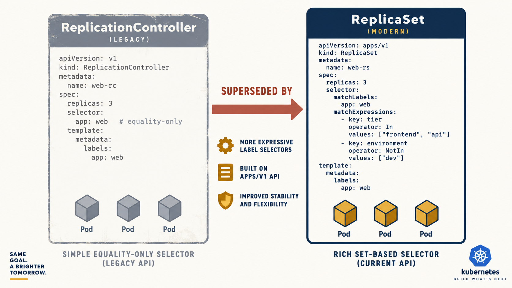

**Technical perspective:** CKA Exam & Migration Insight:
- Modern Kubernetes best practices strictly mandate using **Deployments** for all stateless workloads. Never author new ReplicationController manifests in modern environments.
- Migrating from ReplicationController to Deployment requires deleting the ReplicationController with `--cascade=orphan` and creating a Deployment matching the existing pod labels to adopt the running pods without downtime.

### Component architecture flow

<iframe src="diagrams/topic-38.html" width="100%" height="560" style="border:none;"></iframe>

> [!TIP]
> View the interactive animated diagram in [diagrams/topic-38.html](diagrams/topic-38.html).

**Part 2 — Analogy / Zine:** The original, retired occupancy-enforcer clipboard system the complex used before the newer, more flexible enforcer took over — still technically works, but nobody sets it up new anymore.

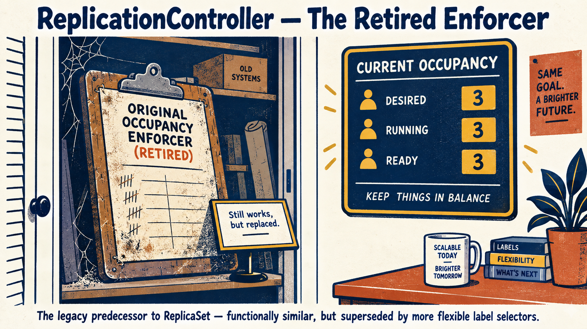

**Zine explanation:** The Retired Enforcer image positions ReplicationController as the predecessor concept that established replica management — now fully superseded by ReplicaSet and Deployment. Just as a retired building superintendent followed the same principle (keep units occupied) but used older methods (paper ledgers, keys on hooks) that lacked the flexibility of modern digital systems — ReplicationController maintained a fixed replica count but only supported equality-based label selectors (`app=nginx`), not set-based ones (`app in [nginx, apache]`). It had no rolling update coordination. Deployments and ReplicaSets are strictly preferred; ReplicationController remains only for historical context and backward compatibility.

* **Zine Text & Layout:**
* (Top): "ReplicationController — The Retired Enforcer"
* (Caption): "The legacy predecessor to ReplicaSet — functionally similar, but superseded by more flexible label selectors."

**Further reading**

- [ReplicationController](https://kubernetes.io/docs/concepts/workloads/controllers/replicationcontroller/)
- [CKA Study Notes: Core Concepts (ReplicationControllers)](../CKA_Study_Notes/01-core-concepts.md)

### Demo — ReplicationController (legacy)

<div style="background:#000;color:#fff;border-radius:8px;padding:1rem;overflow:auto;box-shadow:0 2px 8px rgba(0,0,0,.25);"><pre style="background:transparent;color:#fff;margin:0;white-space:pre-wrap;">
SETUP
  kubectl create namespace zine-demo

YAML  (rc-demo.yaml)
  apiVersion: v1
  kind: ReplicationController
  metadata:
    name: rc-demo
  spec:
    replicas: 2
    selector:
      app: rc-demo
    template:
      metadata:
        labels:
          app: rc-demo
      spec:
        containers:
        - name: nginx
          image: nginx

STEPS
  1. kubectl apply -f rc-demo.yaml -n zine-demo
  2. kubectl get rc rc-demo -n zine-demo
  3. kubectl delete pod $(kubectl get pods -l app=rc-demo -n zine-demo -o name | head -1) -n zine-demo
  4. kubectl get pods -l app=rc-demo -n zine-demo
  5. kubectl explain replicationcontroller | head -8

WHAT YOU SHOULD SEE
  It self-heals exactly like a ReplicaSet: delete a Pod and a new one appears.

CLEANUP
  kubectl delete namespace zine-demo

NOTE
  Still works, but nobody builds new systems on it. Use a Deployment instead.
</pre></div>


### Knowledge Check — Quiz

**Q1: Why is ReplicationController considered legacy in modern Kubernetes clusters?**

- [ ] A) It cannot run in containerized environments.
- [ ] B) It was superseded by Deployments and ReplicaSets, which offer set-based selectors, declarative rolling updates, and rollback capabilities.
- [ ] C) It does not support Docker containers.
- [ ] D) It only works on single-node clusters.

<details>
<summary>Reveal Answer &amp; Explanation</summary>

**Correct Answer:** B) It was superseded by Deployments and ReplicaSets, which offer set-based selectors, declarative rolling updates, and rollback capabilities.

**Explanation:** ReplicationController was the original v1 replica primitive; Deployments and ReplicaSets replaced it with superior rollout orchestration and selector power.

</details>

**Q2: What label selector restriction does a ReplicationController have?**

- [ ] A) It only supports equality-based selectors (key = value).
- [ ] B) It cannot select pods by label at all.
- [ ] C) It requires JSONPath expressions.
- [ ] D) It only works with pods named default.

<details>
<summary>Reveal Answer &amp; Explanation</summary>

**Correct Answer:** A) It only supports equality-based selectors (key = value).

**Explanation:** ReplicationController only understands exact equality (app = frontend), while modern controllers support expressive set-based selectors (app in (frontend, api)).

</details>

**Q3: Why is the legacy `ReplicationController` retained in the core Kubernetes API (`apiVersion: v1`)?**

- [ ] A) It is the required controller for all control plane components.
- [ ] B) For strict backward compatibility with original Kubernetes v1 manifests, though it is fully superseded by Deployments and ReplicaSets.
- [ ] C) It offers better performance than ReplicaSet on ARM64 hardware.
- [ ] D) It is used exclusively for Windows container workloads.

<details>
<summary>Reveal Answer &amp; Explanation</summary>

**Correct Answer:** B) For strict backward compatibility with original Kubernetes v1 manifests, though it is fully superseded by Deployments and ReplicaSets.

**Explanation:** `ReplicationController` is preserved in the core `v1` API group so that legacy automation and original manifests from early Kubernetes releases continue to function without breaking backward compatibility.

</details>

**Q4: Which selector operator is completely unsupported by a `ReplicationController`?**

- [ ] A) Equality (`environment = production`)
- [ ] B) Set-based operators (`tier in (frontend, backend)` or `matchExpressions`)
- [ ] C) String matching
- [ ] D) Exact label keys

<details>
<summary>Reveal Answer &amp; Explanation</summary>

**Correct Answer:** B) Set-based operators (`tier in (frontend, backend)` or `matchExpressions`)

**Explanation:** ReplicationControllers only support equality-based matching (`selector: { app: web }`). They cannot parse `matchExpressions` or set-based operators (`In`, `NotIn`, `Exists`), which were introduced with ReplicaSets.

</details>

**Q5: Can a modern Kubernetes `Deployment` object manage a `ReplicationController`?**

- [ ] A) Yes, if configured with `spec.controllerKind: ReplicationController`.
- [ ] B) No; Deployments are designed exclusively to manage `ReplicaSet` objects (`apps/v1`).
- [ ] C) Yes, but only in the `kube-system` namespace.
- [ ] D) Yes, if the cluster runs in legacy compatibility mode.

<details>
<summary>Reveal Answer &amp; Explanation</summary>

**Correct Answer:** B) No; Deployments are designed exclusively to manage `ReplicaSet` objects (`apps/v1`).

**Explanation:** Deployments exclusively create and manage ReplicaSets. They have no code path to manage legacy ReplicationControllers.

</details>

**Q6: What is the recommended migration path to upgrade an application running under a `ReplicationController` to a `Deployment` without downtime?**

- [ ] A) Delete all worker nodes and restore from an etcd backup.
- [ ] B) Deploy a Deployment whose pod template has the identical labels; the Deployment's ReplicaSet will adopt the pods (or roll out new ones), after which the ReplicationController can be deleted with `--cascade=orphan`.
- [ ] C) Rename the `kind: ReplicationController` line to `kind: Deployment` without changing the schema.
- [ ] D) Reboot the cluster.

<details>
<summary>Reveal Answer &amp; Explanation</summary>

**Correct Answer:** B) Deploy a Deployment whose pod template has the identical labels; the Deployment's ReplicaSet will adopt the pods (or roll out new ones), after which the ReplicationController can be deleted with `--cascade=orphan`.

**Explanation:** Because Kubernetes works on label matching, deploying a Deployment with identical labels and deleting the ReplicationController with `--cascade=orphan` allows zero-downtime adoption of existing workloads.

</details>

## 39. HorizontalPodAutoscaler (HPA)

**Part 1 — Technical Discussion:** The **HorizontalPodAutoscaler (HPA)** automatically scales the number of Pod replicas in a Deployment, ReplicaSet, or StatefulSet up or down based on observed resource utilization or custom application metrics.

### Autoscaling Algorithm & Formula
$$\text{desiredReplicas} = \left\lceil \text{currentReplicas} \times \left( \frac{\text{currentMetricValue}}{\text{targetMetricValue}} \right) \right\rceil$$

### Metric Source Categories (`autoscaling/v2`)
1. **Resource Metrics:** CPU and Memory utilization queried from `metrics-server` (which reads container cgroup stats from Kubelet Summary API).
2. **Custom Metrics:** Application-specific metrics from within the cluster (e.g., HTTP request rate per second, active websocket connections) via Prometheus Adapter.
3. **External Metrics:** Cloud or third-party metrics outside the cluster (e.g., AWS SQS queue depth).

### Scaling Behavior & Stabilization Windows
- Modern HPA specs define `behavior` policies:
  - `scaleDown.stabilizationWindowSeconds`: Defaults to 300s (5 minutes) to prevent "flapping" (rapid oscillations between scale-up and scale-down).

```yaml
# hpa-v2-production.yaml
# WHY THIS YAML: HPA v2 spec shows the metrics and scaling behavior configuration.
# 'scaleTargetRef': HPA controller watches this Deployment and adjusts 'spec.replicas'.
# 'metrics.type: Resource / averageUtilization: 60': scales when avg CPU exceeds 60%.
#   Formula: desiredReplicas = ceil(currentReplicas x currentCPU / 60).
# 'minReplicas: 2 / maxReplicas: 20': HPA never goes below 2 (availability) or above 20 (cost).
# 'stabilizationWindowSeconds: 300': prevents scale-down for 5 min after a spike (anti-flapping).
# REQUIRES 'resources.requests.cpu' on every Pod -- without it, utilization is undefined.
apiVersion: autoscaling/v2
kind: HorizontalPodAutoscaler
metadata:
  name: web-scaler
spec:
  scaleTargetRef:
    apiVersion: apps/v1
    kind: Deployment
    name: frontend-app
  minReplicas: 2
  maxReplicas: 10
  metrics:
  - type: Resource
    resource:
      name: cpu
      target:
        type: Utilization
        averageUtilization: 60
  behavior:
    scaleDown:
      stabilizationWindowSeconds: 300
      policies:
      - type: Percent
        value: 50
        periodSeconds: 60
```

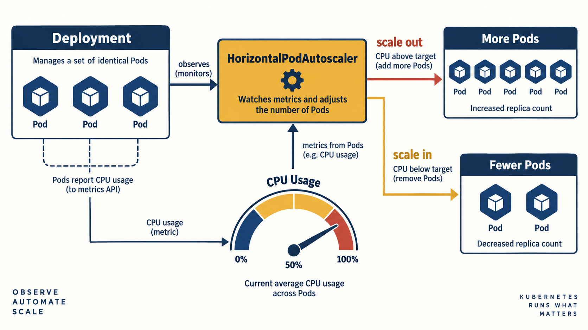

**Technical perspective:** HPA requires explicit resource requests on every target container:
- **The Missing Requests Pitfall:** If a container does not declare `resources.requests.cpu`, HPA cannot compute percentage utilization! The HPA status will show `unknown / 60%`, and autoscaling will fail to trigger.
- **Metrics Server Dependency:** HPA requires `metrics-server` running in `kube-system`. Verify with `kubectl top pods` and `kubectl top nodes` before enabling HPA.

### Component architecture flow

<iframe src="diagrams/topic-39.html" width="100%" height="560" style="border:none;"></iframe>

> [!TIP]
> View the interactive animated diagram in [diagrams/topic-39.html](diagrams/topic-39.html).

**Part 2 — Analogy / Zine:** The staffing manager who calls in more substitute teachers automatically when the lunch rush hits a certain crowd size, and sends them home once things quiet down.

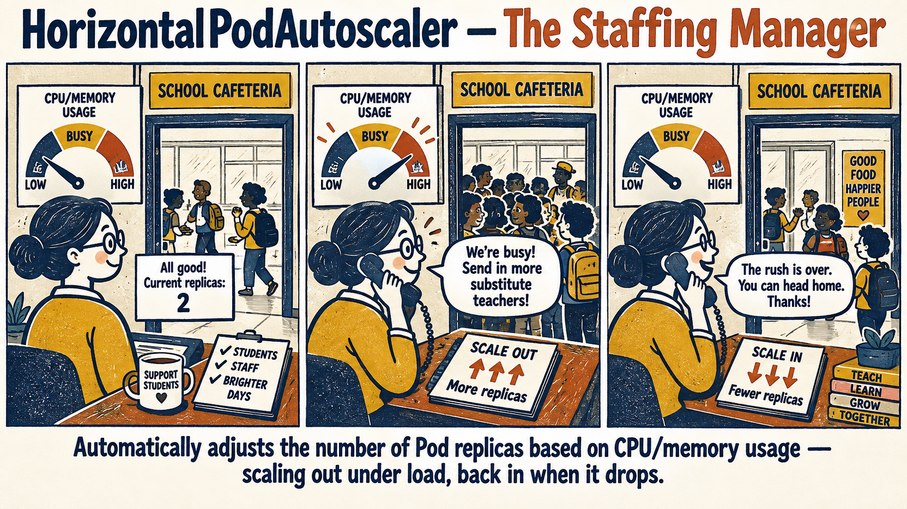

**Zine explanation:** The Staffing Manager image captures HPA's reactive scaling behavior: it monitors a metric signal and adjusts the number of Pod replicas in a Deployment or StatefulSet to maintain a target utilization level. Just as a staffing manager adds temporary staff during a busy season and sends them home when traffic drops — reading occupancy reports to decide how many people are needed — the HPA controller reads CPU/memory metrics from the Metrics Server (or custom metrics from Prometheus Adapter) every 15 seconds and computes: `desired replicas = ceil(currentReplicas × currentMetricValue / targetMetricValue)`. Scale-up is immediate; scale-down has a stabilization window (default 5 minutes) to prevent flapping. HPA requires Pods to have `resources.requests` declared, or it cannot compute utilization ratios.

* **Zine Text & Layout:**
* (Top): "HorizontalPodAutoscaler — The Staffing Manager"
* (Caption): "Automatically adjusts the number of Pod replicas based on CPU/memory usage — scaling out under load, back in when it drops."

**Further reading**

- [Horizontal Pod Autoscaling](https://kubernetes.io/docs/tasks/run-application/horizontal-pod-autoscale/)
- [Autoscaling concepts](https://kubernetes.io/docs/concepts/workloads/autoscaling/)
- [CKA Study Notes: Logging & Monitoring (Metrics Server & HPA)](../CKA_Study_Notes/03-logging-and-monitoring.md)

### Demo — HorizontalPodAutoscaler (HPA)

<div style="background:#000;color:#fff;border-radius:8px;padding:1rem;overflow:auto;box-shadow:0 2px 8px rgba(0,0,0,.25);"><pre style="background:transparent;color:#fff;margin:0;white-space:pre-wrap;">
SETUP
  kubectl get deployment metrics-server -n kube-system || (kubectl apply -f https://github.com/kubernetes-sigs/metrics-server/releases/latest/download/components.yaml && kubectl patch deployment metrics-server -n kube-system --type='json' -p='[{"op":"add","path":"/spec/template/spec/containers/0/args/-","value":"--kubelet-insecure-tls"}]')
  kubectl create namespace zine-demo
  kubectl create deployment hpa-demo --image=registry.k8s.io/hpa-example -n zine-demo
  kubectl set resources deployment hpa-demo --requests=cpu=200m -n zine-demo
  kubectl rollout status deployment/hpa-demo -n zine-demo
  kubectl expose deployment hpa-demo --port=80 -n zine-demo

STEPS
  1. kubectl autoscale deployment hpa-demo --cpu-percent=50 --min=1 --max=5 -n zine-demo
  2. kubectl run load-generator --image=busybox -n zine-demo --restart=Never -- sh -c 'while true; do wget -q -O- http://hpa-demo; done'
  3. kubectl get hpa hpa-demo -n zine-demo -w   # Ctrl+C after REPLICAS climbs above 1
  4. kubectl delete pod load-generator -n zine-demo
  5. kubectl get hpa hpa-demo -n zine-demo -w   # replicas fall back after about 5 minutes

WHAT YOU SHOULD SEE
  TARGETS climbs above 50% and REPLICAS rises toward 5. After the load stops it falls back to 1.

CLEANUP
  kubectl delete namespace zine-demo

NOTE
  Needs metrics-server. Until it reports, TARGETS shows &lt;unknown&gt;. Scale-down is deliberately slow (about 5 minutes).
</pre></div>


### Knowledge Check — Quiz

**Q1: What component must be running in the cluster for the HorizontalPodAutoscaler to scale based on CPU and memory utilization?**

- [ ] A) An NFS storage server.
- [ ] B) The metrics-server (or a custom metrics provider implementing the Metrics API).
- [ ] C) Docker Desktop on macOS.
- [ ] D) A Ceph storage cluster.

<details>
<summary>Reveal Answer &amp; Explanation</summary>

**Correct Answer:** B) The metrics-server (or a custom metrics provider implementing the Metrics API).

**Explanation:** HPA queries metrics.k8s.io to evaluate resource utilization; metrics-server collects container cgroup metrics from node kubelets and exposes them through this API.

</details>

**Q2: Why does HPA have a default stabilization window (typically 5 minutes) for scaling down replicas?**

- [ ] A) Because the kube-apiserver is throttled to 1 write per 5 minutes.
- [ ] B) To prevent 'flapping' (rapid oscillation of scaling up and down in response to transient metric spikes).
- [ ] C) To allow container images to download.
- [ ] D) To wait for node operating system updates.

<details>
<summary>Reveal Answer &amp; Explanation</summary>

**Correct Answer:** B) To prevent 'flapping' (rapid oscillation of scaling up and down in response to transient metric spikes).

**Explanation:** Rapid scaling oscillations degrade application stability; the cooldown window smooths out scale-down decisions over time.

</details>

**Q3: What cluster service must be running for the Horizontal Pod Autoscaler (HPA) to scale workloads based on CPU and memory utilization?**

- [ ] A) CoreDNS
- [ ] B) Metrics Server (aggregating resource metrics from Kubelet Summary APIs)
- [ ] C) Flannel CNI
- [ ] D) External Secrets Operator

<details>
<summary>Reveal Answer &amp; Explanation</summary>

**Correct Answer:** B) Metrics Server (aggregating resource metrics from Kubelet Summary APIs)

**Explanation:** HPA queries the `metrics.k8s.io` API. This API is fulfilled by the cluster `Metrics Server`, which periodically scrapes container CPU and RAM usage from Kubelet `/stats/summary` endpoints.

</details>

**Q4: What is the mathematical scaling formula used by the HPA controller to determine desired replica count?**

- [ ] A) `desiredReplicas = ceil[currentReplicas * (currentMetricValue / targetMetricValue)]`
- [ ] B) `desiredReplicas = currentReplicas + (currentMetricValue * 2)`
- [ ] C) `desiredReplicas = maxReplicas - minReplicas`
- [ ] D) `desiredReplicas = floor[targetMetricValue / currentReplicas]`

<details>
<summary>Reveal Answer &amp; Explanation</summary>

**Correct Answer:** A) `desiredReplicas = ceil[currentReplicas * (currentMetricValue / targetMetricValue)]`

**Explanation:** The HPA evaluates the ratio of observed metric value to target value: `desiredReplicas = ceil[currentReplicas * (currentMetricValue / targetMetricValue)]`, scaling up or down to keep metrics near target.

</details>

**Q5: What is the purpose of the `spec.behavior.scaleDown.stabilizationWindowSeconds` setting in an HPA definition?**

- [ ] A) It delays the startup of containers.
- [ ] B) It prevents rapid 'flapping' (thrashing) by observing metrics over a sustained window (default 300s / 5 minutes) before scaling down replicas.
- [ ] C) It restricts pod network throughput.
- [ ] D) It forces CPU throttling on worker nodes.

<details>
<summary>Reveal Answer &amp; Explanation</summary>

**Correct Answer:** B) It prevents rapid 'flapping' (thrashing) by observing metrics over a sustained window (default 300s / 5 minutes) before scaling down replicas.

**Explanation:** A stabilization window smooths out momentary spikes and dips in load. During scale-down, HPA looks back across the stabilization window and picks the highest desired replica count calculated during that window, avoiding premature downscaling.

</details>

**Q6: What requirement must application containers meet for an HPA targeting `type: Resource` (e.g. 80% CPU utilization) to calculate percentages?**

- [ ] A) Containers must run as root.
- [ ] B) Containers must have explicit `resources.requests` defined for that resource; without requests, HPA cannot calculate percentage utilization and will report `<unknown>`.
- [ ] C) Containers must expose a `/metrics` Prometheus endpoint.
- [ ] D) Containers must be part of a DaemonSet.

<details>
<summary>Reveal Answer &amp; Explanation</summary>

**Correct Answer:** B) Containers must have explicit `resources.requests` defined for that resource; without requests, HPA cannot calculate percentage utilization and will report `<unknown>`.

**Explanation:** Target percentage utilization is calculated relative to container resource requests (`actual_usage / requested_resource * 100`). If `requests.cpu` is omitted, HPA has no baseline and cannot compute target percentages.

</details>

## 40. VerticalPodAutoscaler (VPA)

**Part 1 — Technical Discussion:** The **VerticalPodAutoscaler (VPA)** automatically right-sizes container CPU and memory requests and limits based on historical resource consumption patterns, avoiding manual guesswork in capacity planning.

### Architecture & Components
1. **VPA Recommender:** Queries historical usage from metrics-server / Prometheus and computes recommendations (`lowerBound`, `target`, `uncappedTarget`, `upperBound`).
2. **VPA Updater:** In `Auto` mode, identifies pods running with outdated resource specs and evicts them to trigger replacement.
3. **VPA Admission Controller:** A Mutating Admission Webhook that intercepts pod creation requests and injects the updated resource requests into the PodSpec before it is persisted to etcd.

### Operating Modes
- **`Off`:** Computes recommendations without modifying pods (ideal for cost audits).
- **`Initial`:** Injects recommendations only at pod creation time; never evicts running pods.
- **`Auto`:** Actively evicts and recreates running pods to apply updated resource values.

```yaml
# vpa-auto-spec.yaml
# WHY THIS YAML: VPA's update mode determines how recommendations are applied.
# 'updateMode: Auto': VPA evicts and recreates Pods with updated resource requests.
#   In-place resize (no eviction) requires K8s 1.27+ InPlacePodVerticalScaling feature.
# 'containerPolicies.minAllowed.cpu: 100m / maxAllowed.cpu: "4"': VPA recommendations
#   are bounded -- never below 100m (starvation floor) or above 4 CPU (cost ceiling).
# VPA Recommender samples CPU/memory usage over history (default 8 days) and computes
#   p50 recommendations for requests and p95 for limits.
# WARNING: VPA and HPA targeting the same metric on the same Deployment WILL conflict.
apiVersion: autoscaling.k8s.io/v1
kind: VerticalPodAutoscaler
metadata:
  name: api-right-sizer
spec:
  targetRef:
    apiVersion: "apps/v1"
    kind: Deployment
    name: core-api
  updatePolicy:
    updateMode: "Auto"
  resourcePolicy:
    containerPolicies:
    - containerName: '*'
      minAllowed:
        cpu: 100m
        memory: 128Mi
      maxAllowed:
        cpu: 2
        memory: 4Gi
```

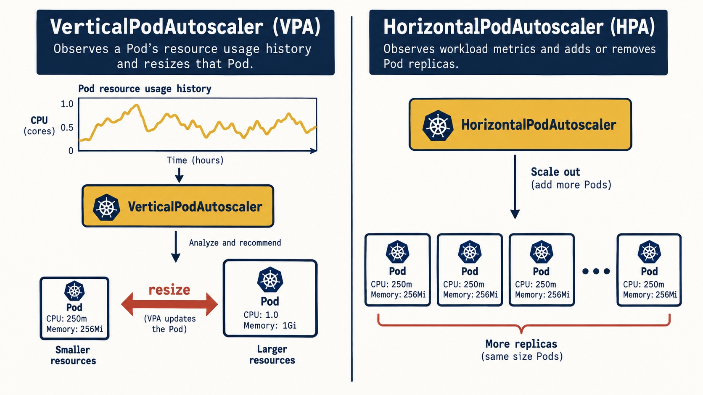

**Technical perspective:** VPA and HPA must be coordinated carefully:
- **VPA + HPA Conflict Hazard:** Do NOT use VPA and HPA simultaneously on the same metric (e.g., both targeting CPU utilization). HPA will add pods to lower CPU usage, while VPA will downscale pod CPU requests, creating destructive feedback loops.
- **Disruption Planning:** In `Auto` mode, VPA evicts running pods to resize them. Always combine VPA with `PodDisruptionBudgets` and multi-replica Deployments to prevent downtime during vertical resizing.

### Component architecture flow

<iframe src="diagrams/topic-40.html" width="100%" height="560" style="border:none;"></iframe>

> [!TIP]
> View the interactive animated diagram in [diagrams/topic-40.html](diagrams/topic-40.html).

**Part 2 — Analogy / Zine:** Instead of calling in more staff, this manager just gives one tenant a bigger unit when they clearly need more space, and downsizes them if they don't need it anymore.

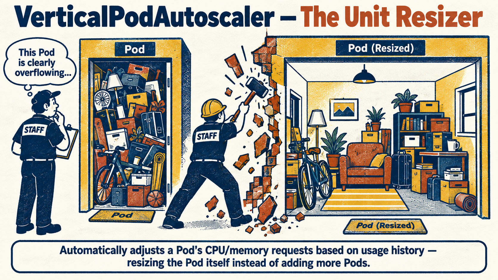

**Zine explanation:** The Unit Resizer image represents VPA's approach to right-sizing individual Pods' resource requests and limits, as opposed to HPA which adds more Pods. Just as a property manager analyzes how much space each tenant actually uses and offers to move them to a larger or smaller unit — rather than adding more tenants — VPA observes historical CPU and memory consumption, generates recommendations, and (in `Auto` mode) evicts and restarts Pods with updated `resources.requests` values. The trade-off is unavoidable: VPA cannot resize a running container in-place (in most cluster configurations), so it must evict the Pod. VPA and HPA should not both target CPU on the same Deployment, as they will conflict.

* **Zine Text & Layout:**
* (Top): "VerticalPodAutoscaler — The Unit Resizer"
* (Caption): "Automatically adjusts a Pod's CPU/memory requests based on usage history — resizing the Pod itself instead of adding more Pods."

**Further reading**

- [Vertical Pod Autoscaling](https://github.com/kubernetes/autoscaler/tree/master/vertical-pod-autoscaler)
- [Autoscaling concepts](https://kubernetes.io/docs/concepts/workloads/autoscaling/)
- [CKA Study Notes: Logging & Monitoring (Resource Optimization & VPA)](../CKA_Study_Notes/03-logging-and-monitoring.md)

### Demo — VerticalPodAutoscaler (VPA)

<div style="background:#000;color:#fff;border-radius:8px;padding:1rem;overflow:auto;box-shadow:0 2px 8px rgba(0,0,0,.25);"><pre style="background:transparent;color:#fff;margin:0;white-space:pre-wrap;">
SETUP
  # Install the VPA add-on first: git clone https://github.com/kubernetes/autoscaler.git && cd autoscaler/vertical-pod-autoscaler && ./hack/vpa-up.sh
  kubectl get pods -n kube-system | grep vpa   # recommender, updater, admission-controller must be Running
  kubectl create namespace zine-demo
  kubectl create deployment hpa-demo --image=registry.k8s.io/hpa-example -n zine-demo
  kubectl set resources deployment hpa-demo --requests=cpu=100m -n zine-demo
  kubectl rollout status deployment/hpa-demo -n zine-demo

YAML  (vpa-demo.yaml)
  apiVersion: autoscaling.k8s.io/v1
  kind: VerticalPodAutoscaler
  metadata:
    name: vpa-demo
  spec:
    targetRef:
      apiVersion: "apps/v1"
      kind: Deployment
      name: hpa-demo
    updatePolicy:
      updateMode: "Auto"

STEPS
  1. kubectl apply -f vpa-demo.yaml -n zine-demo
  2. sleep 120   # give the recommender time to observe usage
  3. kubectl describe vpa vpa-demo -n zine-demo   # see Recommendation

WHAT YOU SHOULD SEE
  Under Recommendation you see Lower Bound, Target and Upper Bound for CPU and memory, based on observed usage.

CLEANUP
  kubectl delete namespace zine-demo

NOTE
  In Auto mode VPA evicts and recreates the Pod with the new sizes; use updateMode: "Off" if you only want recommendations. The Deployment is created fresh here, so this demo does not depend on entry 39.
</pre></div>


### Knowledge Check — Quiz

**Q1: What is the primary operational difference between HPA and VPA?**

- [ ] A) HPA scales the number of Pod replicas (horizontal scaling), while VPA adjusts the CPU and memory requests/limits of existing containers (vertical scaling).
- [ ] B) HPA only works on worker nodes; VPA only works on the control plane.
- [ ] C) HPA scales storage; VPA scales networking.
- [ ] D) HPA requires Windows; VPA requires Linux.

<details>
<summary>Reveal Answer &amp; Explanation</summary>

**Correct Answer:** A) HPA scales the number of Pod replicas (horizontal scaling), while VPA adjusts the CPU and memory requests/limits of existing containers (vertical scaling).

**Explanation:** HPA adds/removes pod replicas to handle load; VPA right-sizes individual container CPU and RAM requests based on historical consumption patterns.

</details>

**Q2: In updateMode: 'Auto', how does VPA apply updated CPU and memory recommendations to a running Pod?**

- [ ] A) By dynamically adjusting kernel memory without restarting the container.
- [ ] B) By evicting the existing Pod so that the workload controller recreates it, at which point the VPA mutating admission webhook injects the new resource values.
- [ ] C) By editing the host BIOS settings.
- [ ] D) By changing the container image.

<details>
<summary>Reveal Answer &amp; Explanation</summary>

**Correct Answer:** B) By evicting the existing Pod so that the workload controller recreates it, at which point the VPA mutating admission webhook injects the new resource values.

**Explanation:** In current Kubernetes releases, pod resource changes require pod recreation; VPA evicts the pod and its admission webhook mutates the pod spec during recreation.

</details>

**Q3: What are the three primary components that constitute the Kubernetes Vertical Pod Autoscaler (VPA)?**

- [ ] A) Ingress, Service, and EndpointSlice
- [ ] B) VPA Recommender (computes resource recommendations), VPA Updater (evicts pods needing resizing), and VPA Admission Controller (injects recommended requests upon pod recreation)
- [ ] C) Kubelet, Containerd, and Runc
- [ ] D) Prometheus, Grafana, and Alertmanager

<details>
<summary>Reveal Answer &amp; Explanation</summary>

**Correct Answer:** B) VPA Recommender (computes resource recommendations), VPA Updater (evicts pods needing resizing), and VPA Admission Controller (injects recommended requests upon pod recreation)

**Explanation:** VPA operates via three decoupled components: Recommender (observes historic usage and calculates target CPU/RAM), Updater (evicts out-of-spec pods), and Mutating Admission Controller (injects new resource values when pods recreate).

</details>

**Q4: What is the operational effect of setting `updateMode: 'Off'` in a VerticalPodAutoscaler manifest?**

- [ ] A) The VPA is completely uninstalled.
- [ ] B) The VPA computes and publishes recommended resource requests in its status field, but never modifies, evicts, or resizes running Pods.
- [ ] C) The VPA shuts down all worker nodes.
- [ ] D) The VPA deletes all Pods matching the targetRef.

<details>
<summary>Reveal Answer &amp; Explanation</summary>

**Correct Answer:** B) The VPA computes and publishes recommended resource requests in its status field, but never modifies, evicts, or resizes running Pods.

**Explanation:** `updateMode: 'Off'` operates as a safe observation tool. The recommender logs optimal resource sizes in `status.recommendation`, enabling engineers to review recommendations without risking automated pod disruptions.

</details>

**Q5: Why should HPA and VPA generally NOT be configured to scale the same workload based on the same resource metric (such as CPU utilization)?**

- [ ] A) Linux kernels do not support both autoscalers simultaneously.
- [ ] B) They enter a race condition (thrashing loop): high CPU causes VPA to increase pod CPU requests, while HPA simultaneously adds more replicas, leading to severe resource over-allocation.
- [ ] C) etcd database corruption will occur.
- [ ] D) The API server blocks the creation of the VPA manifest.

<details>
<summary>Reveal Answer &amp; Explanation</summary>

**Correct Answer:** B) They enter a race condition (thrashing loop): high CPU causes VPA to increase pod CPU requests, while HPA simultaneously adds more replicas, leading to severe resource over-allocation.

**Explanation:** Scaling both horizontally (HPA) and vertically (VPA) on the same metric creates conflicting control loops. If CPU spikes, VPA raises the pod's CPU request while HPA adds replicas, resulting in unpredictable and compounding resource expansion.

</details>

**Q6: How does the Kubernetes 'In-Place Pod Resource Resizing' feature (alpha/beta in K8s 1.27+) improve upon traditional VPA behavior?**

- [ ] A) It eliminates the need for Linux cgroups.
- [ ] B) It allows container CPU and memory requests/limits to be adjusted dynamically without restarting or evicting the container, avoiding application downtime.
- [ ] C) It converts containers into virtual machines.
- [ ] D) It doubles host physical RAM on demand.

<details>
<summary>Reveal Answer &amp; Explanation</summary>

**Correct Answer:** B) It allows container CPU and memory requests/limits to be adjusted dynamically without restarting or evicting the container, avoiding application downtime.

**Explanation:** Traditionally, changing pod resources required pod eviction and restart. In-place resizing allows modifying `resources.requests` and `resources.limits` on running containers without restart by adjusting cgroup limits live in the Linux kernel.

</details>

## 41. Pod Disruption Budget (PDB)

**Part 1 — Technical Discussion:** A **PodDisruptionBudget (PDB)** limits the number of concurrent voluntary disruptions that an application's Pods can suffer during cluster maintenance operations (e.g., `kubectl drain`, automated node pool upgrades, cluster autoscaler scale-downs).

### Specification Constraints
- Configured using **one** of two mutually exclusive fields:
  - `minAvailable`: Minimum number or percentage of healthy Pods that must remain running (e.g., `2` or `80%`).
  - `maxUnavailable`: Maximum number or percentage of Pods that can be disrupted simultaneously (e.g., `1` or `20%`).
- Selects target Pods using `spec.selector.matchLabels`.

### Eviction API Interception Mechanics
- Voluntary disruptions do not call the core Pod Delete API directly; they call the **Eviction API** (`/api/v1/namespaces/<ns>/pods/<name>/eviction`).
- The API server checks active PDBs before accepting the eviction:
  - If evicting the pod would violate the PDB constraint, the API server rejects the request with **HTTP 429 (Too Many Requests)**.
  - `kubectl drain` stalls and retries until new healthy replicas are running on other nodes.

```yaml
# pdb-high-availability.yaml
# WHY THIS YAML: PDB protects workload availability during planned (voluntary) disruptions.
# 'selector.matchLabels: app: critical-api': PDB applies to all Pods with this label.
# 'minAvailable: 2': the Eviction API (used by 'kubectl drain') REFUSES to evict
#   a Pod if doing so would drop available Pod count below 2. Drain pauses and waits.
# PDB ONLY protects against voluntary disruptions: drain, rolling updates, cluster upgrades.
#   A node CRASH bypasses PDB -- it is not a voluntary disruption.
# Critical rule: 'minAvailable' must be less than total replicas.
#   minAvailable: 3 with replicas: 3 = drain blocks forever -- never undrained.
apiVersion: policy/v1
kind: PodDisruptionBudget
metadata:
  name: api-ha-budget
  namespace: production
spec:
  minAvailable: 2
  selector:
    matchLabels:
      app: customer-api
```

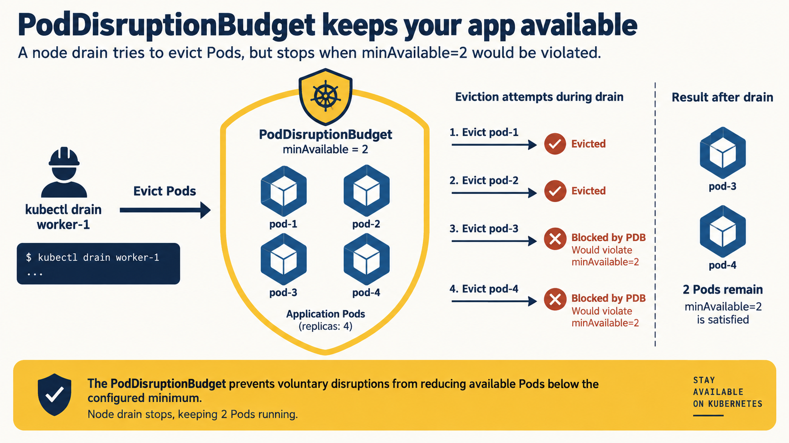

**Technical perspective:** PDBs safeguard high availability during automated platform maintenance:
- **Voluntary vs. Involuntary Disruptions:** PDBs protect ONLY against **voluntary** disruptions (`kubectl drain`, node scale-down). They CANNOT prevent **involuntary** disruptions (hardware crashes, kernel panics, OOMKilled events, network cuts).
- **Drain Deadlocks:** A PDB requiring `minAvailable: 100%` or `maxUnavailable: 0` will permanently block `kubectl drain`, preventing cluster upgrades until an administrator intervenes.

### Component architecture flow

<iframe src="diagrams/topic-41.html" width="100%" height="560" style="border:none;"></iframe>

> [!TIP]
> View the interactive animated diagram in [diagrams/topic-41.html](diagrams/topic-41.html).

**Part 2 — Analogy / Zine:** A rule posted during planned building maintenance: at least 2 units in this wing must stay occupied and undisturbed at any given time, no matter how many maintenance requests come in at once.

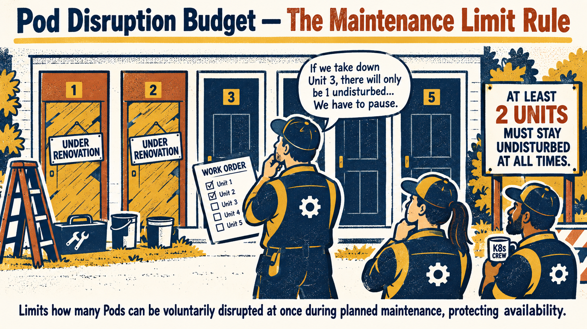

**Zine explanation:** The Maintenance Limit Rule image shows PDB's role in protecting application availability during voluntary disruptions like node drains, cluster upgrades, or rolling deployments. Just as a building code limits how many units can be under renovation simultaneously — ensuring the complex never falls below minimum occupancy — a PodDisruptionBudget sets a lower bound (`minAvailable`) or upper bound (`maxUnavailable`) on how many Pods in a workload can be disrupted at the same time. The Eviction API (used by `kubectl drain`) respects PDB constraints and will block further evictions if they would violate the budget. PDBs only protect against voluntary (planned) disruptions — a node crash is an involuntary disruption that PDB cannot prevent. Requires at least as many replicas as `minAvailable` to function correctly.

* **Zine Text & Layout:**
* (Top): "Pod Disruption Budget — The Maintenance Limit Rule"
* (Caption): "Limits how many Pods can be voluntarily disrupted at once during planned maintenance, protecting availability."

**Further reading**

- [Pod disruption budgets](https://kubernetes.io/docs/concepts/workloads/pods/disruptions/)
- [Eviction API](https://kubernetes.io/docs/concepts/scheduling-eviction/api-eviction/)
- [CKA Study Notes: Cluster Maintenance (Pod Disruption Budgets)](../CKA_Study_Notes/05-cluster-maintenance.md)

### Demo — Pod Disruption Budget (PDB)

<div style="background:#000;color:#fff;border-radius:8px;padding:1rem;overflow:auto;box-shadow:0 2px 8px rgba(0,0,0,.25);"><pre style="background:transparent;color:#fff;margin:0;white-space:pre-wrap;">
SETUP
  kubectl create namespace zine-demo
  kubectl create deployment demo --image=nginx --replicas=3 -n zine-demo
  kubectl rollout status deployment/demo -n zine-demo

YAML  (pdb-demo.yaml)
  apiVersion: policy/v1
  kind: PodDisruptionBudget
  metadata:
    name: demo-pdb
  spec:
    minAvailable: 2
    selector:
      matchLabels:
        app: demo

STEPS
  1. kubectl apply -f pdb-demo.yaml -n zine-demo
  2. kubectl get pdb demo-pdb -n zine-demo   # ALLOWED DISRUPTIONS should be 1
  3. kubectl get pods -l app=demo -n zine-demo -o wide
  4. NODE=$(kubectl get pods -l app=demo -n zine-demo -o jsonpath='{.items[0].spec.nodeName}')
  5. kubectl drain $NODE --ignore-daemonsets --delete-emptydir-data --timeout=60s

WHAT YOU SHOULD SEE
  The drain evicts Pods one at a time and stalls with 'Cannot evict pod ... would violate the pod's disruption budget' once only 2 remain. The --timeout=60s ends the drain by itself; you can also press Ctrl+C.

CLEANUP
  kubectl uncordon $NODE
  kubectl delete namespace zine-demo

NOTE
  Needs 2 or more worker nodes so evicted Pods have somewhere to go. Do not drain your only node.
</pre></div>


### Knowledge Check — Quiz

**Q1: What type of disruptions does a Pod Disruption Budget (PDB) protect against?**

- [ ] A) Involuntary disruptions like hardware power loss or kernel panics.
- [ ] B) Voluntary disruptions initiated by cluster administrators or automation, such as kubectl drain, node upgrades, and cluster autoscaler scale-down.
- [ ] C) Malicious cyberattacks on the network.
- [ ] D) Pod crashes caused by out-of-memory (OOM) errors.

<details>
<summary>Reveal Answer &amp; Explanation</summary>

**Correct Answer:** B) Voluntary disruptions initiated by cluster administrators or automation, such as kubectl drain, node upgrades, and cluster autoscaler scale-down.

**Explanation:** PDBs govern voluntary management operations; they cannot prevent hardware crashes, but they intercept Eviction API calls during node maintenance to safeguard minimum available replicas.

</details>

**Q2: What happens if an administrator runs kubectl drain node-1 and evicting a pod would violate its PDB minAvailable constraint?**

- [ ] A) The node drain immediately deletes the pod forcefully.
- [ ] B) The Eviction API rejects or delays the eviction request, causing kubectl drain to wait or retry until sufficient healthy replicas exist elsewhere.
- [ ] C) The PDB is automatically deleted.
- [ ] D) The entire cluster is placed in read-only mode.

<details>
<summary>Reveal Answer &amp; Explanation</summary>

**Correct Answer:** B) The Eviction API rejects or delays the eviction request, causing kubectl drain to wait or retry until sufficient healthy replicas exist elsewhere.

**Explanation:** The Eviction API checks active PDBs and returns HTTP 429 (Too Many Requests) if an eviction would breach the budget, protecting application availability during maintenance.

</details>

**Q3: In a `PodDisruptionBudget` (PDB) specification, what is the constraint regarding `minAvailable` and `maxUnavailable`?**

- [ ] A) Both must always be specified simultaneously.
- [ ] B) They are mutually exclusive; you can specify either `minAvailable` OR `maxUnavailable`, but never both in the same PDB.
- [ ] C) `minAvailable` is for memory; `maxUnavailable` is for CPU.
- [ ] D) `minAvailable` is deprecated.

<details>
<summary>Reveal Answer &amp; Explanation</summary>

**Correct Answer:** B) They are mutually exclusive; you can specify either `minAvailable` OR `maxUnavailable`, but never both in the same PDB.

**Explanation:** A PDB specification allows either `minAvailable` (minimum healthy pods that must remain) or `maxUnavailable` (maximum pods that can be down simultaneously). Specifying both in the same PDB is rejected by the API server schema.

</details>

**Q4: What happens if an administrator runs `kubectl drain <node>` when a Pod running on that node is protected by a PDB requiring `minAvailable: 100%`?**

- [ ] A) The node is drained immediately without warnings.
- [ ] B) The Eviction API rejects the eviction with HTTP 429 Too Many Requests, causing `kubectl drain` to stall and retry indefinitely until the timeout expires or the budget is relaxed.
- [ ] C) The PDB is automatically deleted by the node controller.
- [ ] D) The entire cluster is rebooted.

<details>
<summary>Reveal Answer &amp; Explanation</summary>

**Correct Answer:** B) The Eviction API rejects the eviction with HTTP 429 Too Many Requests, causing `kubectl drain` to stall and retry indefinitely until the timeout expires or the budget is relaxed.

**Explanation:** A PDB of `minAvailable: 100%` or `maxUnavailable: 0` creates a drain deadlock. The API server refuses eviction requests, blocking automated node upgrades or drain operations until an operator intervenes.

</details>

**Q5: Does a PodDisruptionBudget protect applications from involuntary disruptions such as hardware node power loss or kernel panics?**

- [ ] A) Yes; PDBs restart hardware automatically.
- [ ] B) No; PDBs safeguard ONLY against voluntary disruptions (e.g. `kubectl drain`, cluster autoscaler scale-down, automated node pool upgrades); they cannot prevent physical hardware crashes or kernel failures.
- [ ] C) Yes, by maintaining a redundant cold spare node.
- [ ] D) Yes, if the cluster runs on cloud VMs.

<details>
<summary>Reveal Answer &amp; Explanation</summary>

**Correct Answer:** B) No; PDBs safeguard ONLY against voluntary disruptions (e.g. `kubectl drain`, cluster autoscaler scale-down, automated node pool upgrades); they cannot prevent physical hardware crashes or kernel failures.

**Explanation:** PDBs govern only voluntary administrative operations routed through the Kubernetes Eviction API. They cannot prevent involuntary disruptions like hardware failure, kernel panics, or unexpected host reboots.

</details>

**Q6: What is the purpose of the `spec.unhealthyPodEvictionPolicy` setting introduced in Kubernetes 1.27+ for PDBs?**

- [ ] A) It sends an alert to PagerDuty when a pod is unhealthy.
- [ ] B) It controls whether pods that are already unhealthy or failing readiness probes are allowed to be evicted immediately during a drain, preventing unhealthy pods from permanently blocking node maintenance.
- [ ] C) It automatically restarts all unhealthy pods every 60 seconds.
- [ ] D) It marks unhealthy pods as completed.

<details>
<summary>Reveal Answer &amp; Explanation</summary>

**Correct Answer:** B) It controls whether pods that are already unhealthy or failing readiness probes are allowed to be evicted immediately during a drain, preventing unhealthy pods from permanently blocking node maintenance.

**Explanation:** `unhealthyPodEvictionPolicy: AlwaysAllow` allows eviction of pods that are already not ready/unhealthy regardless of budget constraints, ensuring broken application pods do not deadlock cluster node maintenance drains.

</details>
