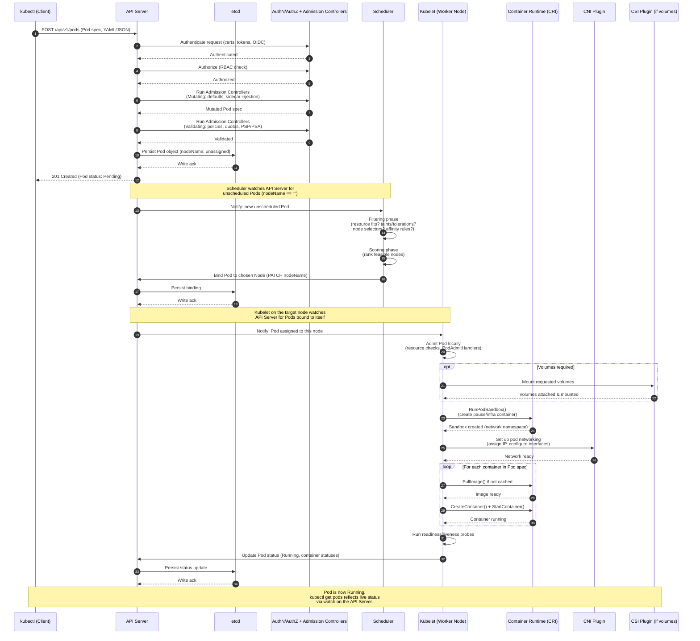

# What Happens When You Create a Pod in Kubernetes

This sequence diagram traces the full lifecycle of a `kubectl apply -f pod.yaml` (or any resource creation) request — from the client, through the control plane, down to the container actually running on a worker node.

## Key stages at a glance

1. **Submission** — `kubectl` sends the manifest to the API server as an authenticated HTTPS request.
2. **Gatekeeping** — AuthN, AuthZ (RBAC), then mutating and validating admission webhooks run before anything is written.
3. **Persistence** — The API server is the only component that talks to `etcd` directly; every other component reads/writes through it.
4. **Scheduling** — The scheduler doesn't get pushed pods; it *watches* for pods with no `nodeName` and binds one once filtering + scoring pick a node.
5. **Kubelet takeover** — Once bound, the kubelet on that node is now responsible for the pod's entire lifecycle.
6. **Sandbox → Network → Containers** — CRI creates the pause container first (holds the network namespace), CNI wires up networking, then real containers start inside that sandbox.
7. **Status loop** — The kubelet continuously reports status back through the API server, which is what `kubectl get pods -w` is watching.

## Notes for editing
- Rendered natively by GitHub, GitLab, VS Code (Markdown Preview Mermaid Support extension), Obsidian, and most static site generators (mkdocs-material, Docusaurus).
- To extend this for a specific resource (Deployment, StatefulSet, Job), add a preceding block showing the controller (Deployment controller, etc.) creating the Pod object it wraps — the pod-level flow from admission onward stays identical.
- If you want a **flowchart** (branching/decision-shape) version instead of this sequence-diagram (time-ordered) version, that's a quick variant — let me know.
